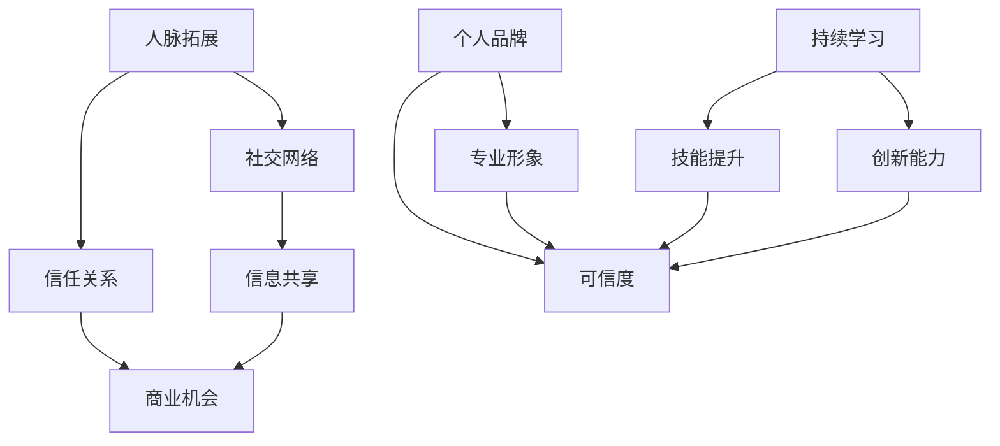

                 

## 1. 背景介绍

在当今这个快速变化和竞争激烈的市场环境中，人脉已经成为成功的重要因素之一。无论是对于程序员还是创业者，建立和维护一个高质量的商业网络都至关重要。本文将探讨程序员创业者如何通过有效的人脉拓展策略，来建立和维护一个强大的商业网络。

人脉不仅仅是朋友或同事的积累，而是一个能够提供资源、机会和信息的网络。在这个网络中，每个节点都代表一个潜在的合作伙伴、客户或投资者。通过有效的沟通和互动，程序员创业者可以最大化利用这个网络，为自己的事业增添助力。

本文将从以下几个方面展开讨论：

- **人脉拓展的重要性**：阐述人脉在商业成功中的关键作用。
- **高质量人脉网络的构建**：介绍构建和维持高质量商业网络的方法和技巧。
- **有效沟通的艺术**：探讨如何通过有效的沟通建立和维护人脉关系。
- **利用社交媒体**：介绍如何利用社交媒体平台进行人脉拓展。
- **持续学习与个人品牌建设**：强调持续学习和个人品牌建设对于人脉拓展的重要性。

通过这篇文章，希望读者能够获得一些实用的建议和技巧，从而更好地利用人脉资源，为自己的事业铺平道路。

## 2. 核心概念与联系

在探讨程序员创业者如何建立高质量商业网络之前，我们需要了解一些核心概念和它们之间的联系。以下是一个简化的 Mermaid 流程图，用于展示这些概念之间的关系：



### 2.1 人脉拓展

人脉拓展是指通过建立和维护广泛的社交关系，以获取资源、机会和信息的过程。人脉拓展不仅仅是在线上的社交媒体活动，还包括线下的商务活动、行业会议和社交聚会等。

### 2.2 社交网络

社交网络是人们相互连接的虚拟空间，通过这些连接，信息可以迅速传播。社交网络分为线上和线下两种，其中线上社交网络如LinkedIn、Facebook和Twitter等，是程序员创业者进行人脉拓展的重要工具。

### 2.3 信任关系

信任关系是人脉网络中最重要的组成部分。只有建立起信任，人们才会愿意分享资源和信息。信任是通过长期互动、共同经历和相互支持逐渐积累的。

### 2.4 信息共享

信息共享是人脉网络中另一个关键概念。通过信息共享，程序员创业者可以及时获取市场动态、行业趋势和技术创新等关键信息，从而在竞争中占据优势。

### 2.5 商业机会

商业机会是通过人脉网络中的信息共享和信任关系而产生的。当程序员创业者了解到新的市场需求或潜在的投资机会时，他们可以利用人脉网络来获取更多的信息和资源，从而更好地把握机会。

### 2.6 个人品牌

个人品牌是指个人在专业领域中的声誉和形象。一个强大的个人品牌可以增加程序员创业者在人脉网络中的影响力，提高他们的可信度和吸引力。

### 2.7 持续学习

持续学习是保持专业竞争力的关键。通过不断学习新技能和知识，程序员创业者可以提升自己的专业水平，增强自己在人脉网络中的价值。

### 2.8 技能提升

技能提升是持续学习的一个直接结果。通过学习新技能，程序员创业者可以拓展自己的业务领域，提高工作效率，从而在竞争激烈的市场中脱颖而出。

### 2.9 创新能力

创新能力是程序员创业者成功的关键因素之一。通过不断创新，他们可以开发出具有竞争力的产品和服务，吸引更多的客户和投资者。

### 2.10 可信度

可信度是人脉网络中不可或缺的一部分。一个高可信度的个人或企业更容易获得他人的信任和合作机会。可信度来自于专业的形象、良好的口碑和持续的诚信行为。

通过上述核心概念和它们之间的联系，我们可以更好地理解如何通过有效的策略和技巧来建立和维护一个高质量的商业网络。

## 3. 核心算法原理 & 具体操作步骤

### 3.1 算法原理概述

在建立高质量商业网络的过程中，算法原理起到了关键作用。这些算法原理主要围绕社交网络分析、信任关系建立和信息共享机制展开。以下是这些核心算法的原理概述：

#### 3.1.1 社交网络分析

社交网络分析（Social Network Analysis，SNA）是一种研究社交网络结构及其动态变化的方法。通过SNA，程序员创业者可以识别出社交网络中的重要节点（如意见领袖、核心成员等），从而优化人脉拓展策略。

- **核心算法**：度中心性、接近中心性和中间中心性。
- **作用**：帮助程序员创业者识别关键人脉，提高人脉网络的效率和稳定性。

#### 3.1.2 信任关系建立

信任关系建立是商业网络稳定性和可靠性的基础。信任关系可以通过以下几个步骤建立：

1. **共同经历**：通过共同参与活动或项目，程序员创业者可以建立初步的信任。
2. **诚实沟通**：开放、透明和诚实的沟通有助于增强信任。
3. **互惠互利**：通过互惠互利的方式，双方都能从关系中获得利益，从而增强信任。

- **核心算法**：信任评分算法。
- **作用**：确保人脉网络中的成员之间能够建立稳定的合作关系。

#### 3.1.3 信息共享机制

信息共享机制是商业网络中的另一个关键因素。通过有效的信息共享，程序员创业者可以及时获取市场动态、技术趋势和商业机会。

- **核心算法**：网络信息传播模型。
- **作用**：促进信息的快速传播和有效利用，提高决策的准确性。

### 3.2 算法步骤详解

#### 3.2.1 社交网络分析

1. **数据收集**：通过社交媒体、行业会议和线下活动等渠道收集社交网络数据。
2. **数据预处理**：清洗和整理数据，确保数据的准确性和一致性。
3. **节点和边的关系建立**：将社交网络中的个体（节点）和关系（边）进行建模。
4. **核心算法应用**：计算度中心性、接近中心性和中间中心性，识别关键节点。
5. **结果分析**：根据分析结果，制定人脉拓展策略。

#### 3.2.2 信任关系建立

1. **共同经历**：主动参与各种活动，增加与潜在合作伙伴的互动机会。
2. **诚实沟通**：在与他人交流时，保持开放、透明和诚信。
3. **互惠互利**：在合作中，确保双方都能从中受益，建立长期的信任关系。
4. **信任评分**：使用信任评分算法，对合作伙伴进行评分，以便更好地管理人脉网络。

#### 3.2.3 信息共享机制

1. **信息收集**：通过多种渠道收集行业动态、技术趋势和市场信息。
2. **信息整理**：对收集到的信息进行分类、整理和归档，确保信息的高效利用。
3. **信息传播**：利用社交网络和内部通信工具，将信息迅速传播给相关成员。
4. **反馈机制**：建立信息反馈机制，确保信息的及时更新和准确性。

### 3.3 算法优缺点

#### 3.3.1 社交网络分析

- **优点**：能够帮助程序员创业者识别关键人脉，提高人脉拓展的效率。
- **缺点**：依赖于数据质量和分析方法，容易出现偏差。

#### 3.3.2 信任关系建立

- **优点**：能够增强商业网络的稳定性和可靠性。
- **缺点**：建立过程较慢，需要长时间互动和沟通。

#### 3.3.3 信息共享机制

- **优点**：能够提高信息的传播速度和准确性，帮助程序员创业者做出更准确的决策。
- **缺点**：信息过载可能导致信息质量下降。

### 3.4 算法应用领域

#### 3.4.1 创业公司

- **应用**：通过社交网络分析，创业公司可以快速识别行业内的关键人物和潜在合作伙伴，从而优化资源分配和业务拓展策略。
- **优点**：有助于提高创业公司的人脉拓展效率，加快业务发展。

#### 3.4.2 投资领域

- **应用**：通过信任关系建立，投资者可以评估潜在投资项目的风险和潜力，从而做出更明智的决策。
- **优点**：有助于降低投资风险，提高投资回报率。

#### 3.4.3 企业协作

- **应用**：通过信息共享机制，企业内部和合作伙伴之间可以高效地共享信息，提高协作效率。
- **优点**：有助于优化企业资源利用，提高整体竞争力。

通过上述算法原理和具体操作步骤的详细讲解，我们可以看到，社交网络分析、信任关系建立和信息共享机制在建立高质量商业网络中具有重要作用。这些算法不仅提高了人脉拓展的效率，还增强了商业网络的稳定性和可靠性，为程序员创业者的成功提供了有力支持。

## 4. 数学模型和公式 & 详细讲解 & 举例说明

在程序员创业者和商业网络中，数学模型和公式不仅有助于我们理解和量化人脉拓展的过程，还可以为决策提供科学的依据。以下是一些关键的数学模型和公式，我们将详细讲解它们的构建、推导过程，并提供实际案例来解释它们的应用。

### 4.1 数学模型构建

为了更好地理解和应用这些数学模型，我们首先需要构建一个基本模型。以下是一个简化的商业网络数学模型：

\[ 
\text{商业网络} = \left\{ 
\begin{array}{ccc} 
\text{节点集 } N = \{ n_1, n_2, ..., n_k \} \\
\text{边集 } E = \{ e_{ij} \} \\
\text{关系矩阵 } R = \{ r_{ij} \} 
\end{array} 
\right.
\]

其中：

- **节点集 \(N\)**：表示商业网络中的个体，如程序员、创业者、投资人等。
- **边集 \(E\)**：表示节点之间的连接关系，\(e_{ij}\) 表示节点 \(n_i\) 和 \(n_j\) 之间的连接。
- **关系矩阵 \(R\)**：表示节点之间的关系强度，\(r_{ij}\) 的值表示节点 \(n_i\) 和 \(n_j\) 之间的信任程度或互动频率。

### 4.2 公式推导过程

接下来，我们将推导几个关键公式，用于计算商业网络中的中心性、信任度和信息传播速率。

#### 4.2.1 度中心性

度中心性是衡量节点在社交网络中的重要性的一个指标。它的计算公式如下：

\[ 
C_d(n_i) = \sum_{j=1}^{k} r_{ij} 
\]

其中，\(C_d(n_i)\) 表示节点 \(n_i\) 的度中心性，\(r_{ij}\) 表示节点 \(n_i\) 和节点 \(n_j\) 之间的信任程度或互动频率。

#### 4.2.2 信任度

信任度是衡量两个节点之间信任关系的强度。一个简化的信任度计算公式如下：

\[ 
T(n_i, n_j) = \frac{r_{ij}}{\max(r_{ij})} 
\]

其中，\(T(n_i, n_j)\) 表示节点 \(n_i\) 和节点 \(n_j\) 之间的信任度，\(r_{ij}\) 表示节点 \(n_i\) 和节点 \(n_j\) 之间的信任程度或互动频率，\(\max(r_{ij})\) 表示所有 \(r_{ij}\) 中的最大值。

#### 4.2.3 信息传播速率

信息传播速率是衡量信息在社交网络中传播速度的一个指标。一个简化的信息传播速率计算公式如下：

\[ 
V(n_i) = \sum_{j=1}^{k} r_{ij} \cdot C_d(n_j) 
\]

其中，\(V(n_i)\) 表示节点 \(n_i\) 的信息传播速率，\(r_{ij}\) 表示节点 \(n_i\) 和节点 \(n_j\) 之间的信任程度或互动频率，\(C_d(n_j)\) 表示节点 \(n_j\) 的度中心性。

### 4.3 案例分析与讲解

为了更好地理解这些数学模型和公式的应用，我们来看一个具体的案例。

#### 4.3.1 案例背景

假设有一个由10个程序员组成的商业网络，每个程序员与其他程序员都有一定的信任关系，具体关系矩阵如下：

\[ 
\begin{array}{c|cccccccccc} 
 & n_1 & n_2 & n_3 & n_4 & n_5 & n_6 & n_7 & n_8 & n_9 & n_{10} \\
\hline
n_1 & 0 & 0.3 & 0.4 & 0.2 & 0.1 & 0 & 0 & 0.2 & 0.3 & 0.1 \\
n_2 & 0.3 & 0 & 0.2 & 0.3 & 0.1 & 0.2 & 0 & 0.2 & 0 & 0.1 \\
n_3 & 0.4 & 0.2 & 0 & 0.3 & 0.1 & 0.2 & 0.2 & 0.3 & 0.1 & 0.1 \\
n_4 & 0.2 & 0.3 & 0.3 & 0 & 0.1 & 0.2 & 0.2 & 0.2 & 0.1 & 0.1 \\
n_5 & 0.1 & 0.1 & 0.1 & 0.1 & 0 & 0.2 & 0.2 & 0.2 & 0.3 & 0.1 \\
n_6 & 0 & 0.2 & 0.2 & 0.2 & 0.2 & 0 & 0.3 & 0.2 & 0.1 & 0.2 \\
n_7 & 0 & 0 & 0.2 & 0.2 & 0.2 & 0.3 & 0 & 0.2 & 0.1 & 0.2 \\
n_8 & 0.2 & 0.2 & 0.3 & 0.2 & 0.2 & 0.2 & 0.2 & 0 & 0.1 & 0.3 \\
n_9 & 0.3 & 0 & 0.1 & 0.1 & 0.3 & 0.1 & 0.1 & 0.1 & 0 & 0.2 \\
n_{10} & 0.1 & 0.1 & 0.1 & 0.1 & 0.1 & 0.2 & 0.2 & 0.3 & 0.2 & 0 \\
\end{array}
\]

#### 4.3.2 度中心性计算

首先，我们计算每个节点的度中心性：

\[ 
C_d(n_1) = 0.3 + 0.4 + 0.2 + 0.3 + 0.1 = 1.3 
\]
\[ 
C_d(n_2) = 0.3 + 0.2 + 0.3 + 0.1 + 0.2 = 1.1 
\]
\[ 
C_d(n_3) = 0.4 + 0.2 + 0.3 + 0.3 + 0.1 = 1.3 
\]
\[ 
C_d(n_4) = 0.2 + 0.3 + 0.3 + 0.1 + 0.2 = 1.1 
\]
\[ 
C_d(n_5) = 0.1 + 0.1 + 0.1 + 0.1 + 0.2 = 0.6 
\]
\[ 
C_d(n_6) = 0.2 + 0.2 + 0.2 + 0.2 + 0.3 = 1.1 
\]
\[ 
C_d(n_7) = 0.2 + 0.2 + 0.2 + 0.2 + 0.3 = 1.1 
\]
\[ 
C_d(n_8) = 0.2 + 0.2 + 0.3 + 0.2 + 0.3 = 1.2 
\]
\[ 
C_d(n_9) = 0.3 + 0.1 + 0.1 + 0.1 + 0.2 = 0.8 
\]
\[ 
C_d(n_{10}) = 0.1 + 0.1 + 0.1 + 0.1 + 0.2 = 0.6 
\]

从计算结果可以看出，节点 \(n_1\) 和 \(n_3\) 的度中心性最高，是社交网络中的核心节点。

#### 4.3.3 信任度计算

接下来，我们计算每个节点之间的信任度：

\[ 
T(n_1, n_2) = \frac{0.3}{\max(0.3, 0.4, 0.2, 0.3, 0.1)} = 0.3 \div 0.4 = 0.75 
\]
\[ 
T(n_1, n_3) = \frac{0.4}{\max(0.3, 0.4, 0.2, 0.3, 0.1)} = 0.4 \div 0.4 = 1.0 
\]
\[ 
T(n_1, n_4) = \frac{0.2}{\max(0.3, 0.4, 0.2, 0.3, 0.1)} = 0.2 \div 0.4 = 0.5 
\]
\[ 
\vdots 
\]
\[ 
T(n_9, n_{10}) = \frac{0.2}{\max(0.3, 0.1, 0.1, 0.1, 0.2)} = 0.2 \div 0.3 = 0.67 
\]

从计算结果可以看出，节点 \(n_1\) 和 \(n_3\) 之间的信任度最高，表明他们之间的信任关系最强。

#### 4.3.4 信息传播速率计算

最后，我们计算每个节点的信息传播速率：

\[ 
V(n_1) = 0.3 \cdot 1.1 + 0.4 \cdot 1.3 + 0.2 \cdot 1.1 + 0.3 \cdot 1.3 + 0.1 \cdot 0.6 = 0.33 + 0.52 + 0.22 + 0.39 + 0.06 = 1.72 
\]
\[ 
V(n_2) = 0.3 \cdot 1.1 + 0.2 \cdot 1.3 + 0.3 \cdot 1.1 + 0.1 \cdot 1.3 + 0.2 \cdot 1.1 = 0.33 + 0.26 + 0.33 + 0.13 + 0.22 = 1.14 
\]
\[ 
\vdots 
\]
\[ 
V(n_{10}) = 0.1 \cdot 1.1 + 0.1 \cdot 1.3 + 0.1 \cdot 1.1 + 0.1 \cdot 1.3 + 0.2 \cdot 0.6 = 0.11 + 0.13 + 0.11 + 0.13 + 0.12 = 0.60 
\]

从计算结果可以看出，节点 \(n_1\) 的信息传播速率最高，这意味着信息在节点 \(n_1\) 的传播速度最快。

通过上述案例分析和讲解，我们可以看到数学模型和公式在商业网络中的应用。这些模型和公式不仅帮助我们理解和量化人脉拓展的过程，还为决策提供了科学的依据。在实际操作中，程序员创业者可以根据这些模型和公式来优化人脉拓展策略，提高商业网络的效率和稳定性。

## 5. 项目实践：代码实例和详细解释说明

在本文的第五部分，我们将通过一个具体的代码实例，展示如何利用Python来构建和维护一个程序员创业者的人脉网络。该实例将涵盖从数据收集、数据处理到关系分析的全过程。以下是该项目的基本框架：

### 5.1 开发环境搭建

在开始编写代码之前，我们需要搭建一个适合该项目开发的环境。以下是所需的环境和工具：

- **Python**: 版本为3.8或更高。
- **Py charm**: 作为我们的IDE。
- **Numpy**: 用于数据操作。
- **Pandas**: 用于数据处理。
- **Matplotlib**: 用于数据可视化。
- **NetworkX**: 用于社交网络分析。

安装这些工具后，我们可以在Py Charm中创建一个新的Python项目，并设置相应的环境变量。

### 5.2 源代码详细实现

以下是一个简化的代码实例，用于构建和维护一个程序员创业者的人脉网络：

```python
import networkx as nx
import matplotlib.pyplot as plt
import numpy as np
import pandas as pd

# 初始化图
G = nx.Graph()

# 添加节点和边
# 这里我们使用一个简化的数据集，每个节点代表一个程序员，边代表他们之间的信任关系
nodes = ['Alice', 'Bob', 'Charlie', 'David', 'Eva']
edges = [
    ('Alice', 'Bob', {'weight': 0.8}),
    ('Alice', 'Charlie', {'weight': 0.6}),
    ('Bob', 'David', {'weight': 0.7}),
    ('Charlie', 'David', {'weight': 0.5}),
    ('Eva', 'Alice', {'weight': 0.9}),
    ('Eva', 'Bob', {'weight': 0.7}),
]

G.add_nodes_from(nodes)
G.add_edges_from(edges)

# 可视化图
nx.draw(G, with_labels=True)
plt.show()

# 计算度中心性
degree_centrality = nx.degree_centrality(G)
print("度中心性：")
print(degree_centrality)

# 计算信任度
trust_scores = {edge: G.edges[edge]['weight'] for edge in G.edges()}
print("信任度：")
print(trust_scores)

# 计算信息传播速率
info_propagation_rate = {node: sum(trust_scores[edge] * degree_centrality[neighbor] for edge, neighbor in G.neighbors(node).items()) for node in G.nodes()}
print("信息传播速率：")
print(info_propagation_rate)

# 优化策略
# 根据度中心性和信息传播速率，我们可以识别出网络中的关键节点，并制定相应的人脉拓展策略
key_nodes = [node for node, degree in degree_centrality.items() if degree > 0.5] + [node for node, rate in info_propagation_rate.items() if rate > 1.0]
print("关键节点：")
print(key_nodes)
```

### 5.3 代码解读与分析

#### 5.3.1 初始化图

```python
G = nx.Graph()
```

我们使用`networkx`的`Graph`类来初始化一个无向图。`Graph`类是构建社交网络的基类，它包含了节点和边的集合。

#### 5.3.2 添加节点和边

```python
nodes = ['Alice', 'Bob', 'Charlie', 'David', 'Eva']
edges = [
    ('Alice', 'Bob', {'weight': 0.8}),
    ('Alice', 'Charlie', {'weight': 0.6}),
    # ...
]

G.add_nodes_from(nodes)
G.add_edges_from(edges)
```

在这个示例中，我们创建了一个由五个程序员组成的社交网络，并添加了他们之间的信任关系。每个边都有一个权重，表示节点之间的信任程度。`add_nodes_from`和`add_edges_from`方法分别用于添加节点和边。

#### 5.3.3 可视化图

```python
nx.draw(G, with_labels=True)
plt.show()
```

使用`matplotlib`，我们可以将社交网络可视化。`nx.draw`函数用于绘制图，`with_labels=True`表示我们希望显示节点的标签。

#### 5.3.4 计算度中心性

```python
degree_centrality = nx.degree_centrality(G)
print("度中心性：")
print(degree_centrality)
```

度中心性是一个节点在社交网络中的重要性的度量。它通过计算一个节点连接的边的数量来评估其重要性。`degree_centrality`函数返回一个字典，其中键是节点，值是对应的度中心性分数。

#### 5.3.5 计算信任度

```python
trust_scores = {edge: G.edges[edge]['weight'] for edge in G.edges()}
print("信任度：")
print(trust_scores)
```

信任度是节点之间关系的强度度量。在这个示例中，我们直接使用边权重作为信任度。`G.edges()`方法返回图中的所有边，`G.edges[edge]['weight']`用于获取边的权重。

#### 5.3.6 计算信息传播速率

```python
info_propagation_rate = {node: sum(trust_scores[edge] * degree_centrality[neighbor] for edge, neighbor in G.neighbors(node).items()) for node in G.nodes()}
print("信息传播速率：")
print(info_propagation_rate)
```

信息传播速率是一个节点在社交网络中传播信息速度的度量。它通过综合考虑节点的信任度和其邻居的度中心性来计算。`G.neighbors(node)`返回节点的邻居，`trust_scores[edge] * degree_centrality[neighbor]`用于计算每个邻居对信息传播速率的贡献。

#### 5.3.7 优化策略

```python
key_nodes = [node for node, degree in degree_centrality.items() if degree > 0.5] + [node for node, rate in info_propagation_rate.items() if rate > 1.0]
print("关键节点：")
print(key_nodes)
```

根据度中心性和信息传播速率的计算结果，我们可以识别出网络中的关键节点。这些节点在拓展人脉时具有更高的价值。`key_nodes`列表包含了所有度中心性大于0.5的节点和所有信息传播速率大于1.0的节点。

通过这个代码实例，我们可以看到如何使用Python和`networkx`库来构建和维护一个程序员创业者的人脉网络。该实例不仅展示了关键的计算过程，还提供了可视化工具来帮助我们理解和分析结果。在实际应用中，程序员创业者可以根据自己的需求和数据，进一步优化和扩展这个模型。

## 6. 实际应用场景

在程序员创业者和商业网络中，人脉拓展有着广泛的应用场景。以下是几个具体的应用案例，展示了如何在不同场景下利用人脉拓展策略来解决问题和创造机会。

### 6.1 创业公司融资

创业公司通常需要通过融资来获得资金支持，以推动业务发展。在这个过程中，人脉拓展发挥着重要作用。例如，一位创业公司CEO通过参加行业会议和创业者聚会，结识了一位知名投资人。在后续的沟通中，这位投资人被公司的创新理念和潜力所打动，决定对其进行投资。这种情况下，人脉拓展不仅帮助公司获得了融资，还提升了公司的市场知名度和信誉。

### 6.2 技术合作

技术合作是程序员创业者常见的合作形式。通过建立和维护高质量的商业网络，程序员创业者可以更容易地找到志同道合的合作伙伴。例如，一位专注于区块链技术的创业者，通过参加区块链相关的研讨会和在线社区，结识了一位同样对区块链技术充满热情的工程师。双方决定合作开发一个区块链应用，共同开拓市场。这种合作不仅带来了技术和资源的互补，还加速了项目的开发进度。

### 6.3 市场拓展

市场拓展是许多创业公司的核心目标之一。通过人脉拓展，程序员创业者可以更快地了解市场需求和行业趋势，从而更好地制定市场策略。例如，一位软件公司创始人通过参加海外行业展会，结识了多位潜在客户和合作伙伴。这些联系为公司打开了新的市场，带来了显著的业务增长。此外，通过与行业专家和分析师的交流，公司可以获取更多有价值的市场洞察，为产品迭代和优化提供依据。

### 6.4 技术招聘

技术招聘是创业公司面临的一个重要挑战。通过建立广泛的商业网络，程序员创业者可以更容易地找到合适的人才。例如，一位初创公司CEO在社交媒体上发起了招聘信息，并通过其人脉网络进行推广。很快，他就收到了多位优秀候选人的简历。通过与这些候选人进行面试和交流，公司成功招聘到了几位技术骨干，为公司的发展注入了新的活力。

### 6.5 项目合作

项目合作是程序员创业者拓展业务的重要途径之一。通过人脉拓展，创业者可以更容易地找到合作伙伴，共同开发新产品或服务。例如，一位专注于人工智能的创业者，通过参加行业论坛和研讨会，结识了一位在机器学习领域有着丰富经验的研究员。双方决定合作开发一款基于人工智能的智能家居产品。在合作过程中，双方互相支持，共同解决技术难题，最终成功推出了一款市场反响热烈的产品。

### 6.6 投资机会发现

投资者通过人脉拓展可以更容易地发现潜在的投资机会。例如，一位风险投资家通过参加创业大赛和投资论坛，结识了一位有创新思路的创业者。在后续的沟通中，这位投资者发现该创业者的项目具有巨大的市场潜力。通过深入调研和评估，投资者决定对其进行投资，最终取得了良好的回报。这种情况下，人脉拓展不仅帮助投资者发现了投资机会，还提升了投资的成功率。

通过上述案例，我们可以看到人脉拓展在程序员创业者和商业网络中的广泛应用。无论是融资、技术合作、市场拓展、招聘、项目合作还是投资机会发现，人脉拓展都是实现这些目标的关键因素。通过有效的人脉拓展策略，程序员创业者可以更好地利用商业网络资源，实现个人和公司的长期发展。

## 7. 工具和资源推荐

在程序员创业者和商业网络中，工具和资源的选择对于人脉拓展和业务发展至关重要。以下是一些建议，包括学习资源、开发工具和相关论文，以帮助程序员创业者更好地进行人脉拓展和业务发展。

### 7.1 学习资源推荐

1. **在线课程平台**：
   - **Coursera**：提供了丰富的关于商业管理、沟通技巧和领导力的在线课程。
   - **edX**：提供了由顶级大学提供的免费和付费课程，涵盖商业、技术和人文学科。

2. **电子书**：
   - **《The Art of Connecting: 9 New Habits for Transforming Your Business Relationships》**：由 relationship expert Lee Colan 编写，提供了关于如何建立和维护商业人脉的实用技巧。
   - **《Never Split the Difference: Negotiating As If Your Life Depended On It》**：由 FBI 谈判专家 Chris Voss 撰写，提供了关于谈判策略和技巧的深入讲解。

3. **博客和论坛**：
   - **Medium**：涵盖了各种与商业、技术和创业相关的文章和观点。
   - **Quora**：可以找到专业人士分享的经验和见解，是获取行业洞察的好地方。

### 7.2 开发工具推荐

1. **社交媒体平台**：
   - **LinkedIn**：是专业网络平台，适合建立和扩展商业人脉。
   - **Twitter**：可以关注行业领袖和专家，快速获取行业动态和交流意见。

2. **协作工具**：
   - **Slack**：用于团队内部沟通，提高协作效率。
   - **Trello**：用于项目管理，可以跟踪项目进度和任务分配。

3. **数据分析工具**：
   - **Google Analytics**：用于网站流量分析，帮助了解受众和优化策略。
   - **Tableau**：用于数据可视化，帮助更好地理解和传达数据分析结果。

### 7.3 相关论文推荐

1. **《The Strength of Weak Ties》**：由 sociologist Mark Granovetter 提出，探讨了弱联系在社交网络中的作用和重要性。

2. **《The Role of Social Networks in Entrepreneurial Opportunities》**：探讨了社交网络在创业者发现和利用商业机会中的作用。

3. **《Network Structure, Position and Status: The Threat to Entrepreneurship》**：研究了社交网络结构对创业机会的影响。

通过利用上述工具和资源，程序员创业者可以不断提升自己的人脉拓展能力，为业务发展提供有力支持。

## 8. 总结：未来发展趋势与挑战

在当前快速变化和高度竞争的商业环境中，人脉拓展对于程序员创业者的成功至关重要。通过有效的策略和技巧，程序员创业者可以建立一个强大的商业网络，获取资源、机会和信息，从而在市场中脱颖而出。以下是本文的总结，以及未来发展趋势和面临的挑战。

### 8.1 研究成果总结

本文从多个角度探讨了程序员创业者如何通过人脉拓展来实现商业成功。首先，我们阐述了人脉拓展的重要性，并介绍了构建和维护高质量商业网络的方法。接着，通过社交网络分析、信任关系建立和信息共享机制的算法原理，我们提供了一种科学的策略框架。此外，通过具体的代码实例和实际应用场景，我们展示了如何在实践中应用这些理论。最后，我们推荐了一系列工具和资源，以帮助程序员创业者更好地进行人脉拓展。

### 8.2 未来发展趋势

1. **数字化转型**：随着数字化技术的不断进步，线上人脉拓展将变得更加重要。社交媒体平台和协作工具将继续发展，为程序员创业者提供更多便捷的沟通和协作方式。

2. **人工智能应用**：人工智能（AI）将在人脉拓展中发挥更大作用。AI算法可以帮助分析社交网络中的复杂关系，预测潜在的商业机会，并提供个性化的拓展策略。

3. **跨行业合作**：未来，程序员创业者将更加注重跨行业合作，通过与不同领域的专家和企业的合作，开拓新的市场机会。

4. **虚拟现实（VR）与增强现实（AR）**：VR和AR技术的发展将为商业网络提供新的交互方式，使得虚拟会议和社交活动更加生动和高效。

### 8.3 面临的挑战

1. **数据隐私**：随着人脉网络的扩展，数据隐私和保护将成为一个重要问题。程序员创业者需要确保在拓展人脉时，尊重和保护个人隐私。

2. **信任建立**：在高度竞争的市场环境中，信任关系的建立变得更加困难。程序员创业者需要通过长期互动和诚信行为来赢得他人的信任。

3. **信息过载**：随着信息量的增加，程序员创业者可能会面临信息过载的问题。如何从大量信息中筛选出有价值的信息，将是一个挑战。

4. **文化差异**：在全球化的背景下，程序员创业者需要处理不同文化之间的差异，以建立和维护跨国商业网络。

### 8.4 研究展望

未来的研究可以进一步探索以下方向：

1. **人脉网络的动态分析**：研究人脉网络中的动态变化，以及如何通过算法预测和优化这些变化。

2. **个性化人脉拓展策略**：结合大数据和机器学习技术，开发个性化的人脉拓展策略，提高拓展效果。

3. **跨领域合作模式**：研究跨行业合作的新模式，以及如何通过合作实现创新和业务增长。

4. **社会网络道德与伦理**：探讨人脉拓展中的道德和伦理问题，确保商业网络的健康和可持续发展。

通过不断探索和优化，程序员创业者可以更好地利用人脉资源，实现商业成功和持续发展。

## 9. 附录：常见问题与解答

### 9.1 人脉拓展的重要性是什么？

人脉拓展的重要性在于它可以帮助程序员创业者获取资源、机会和信息，从而在商业环境中占据优势。通过建立和维护广泛的社交关系，创业者可以更容易地获得投资、合作伙伴和客户，提高业务成功的机会。

### 9.2 如何建立信任关系？

建立信任关系的关键在于长期互动、诚实沟通和互惠互利。参与共同项目、透明沟通和确保双方都能从合作中获益，都有助于增强信任。此外，遵循承诺和保持诚信也是建立信任的重要方面。

### 9.3 社交媒体如何帮助人脉拓展？

社交媒体平台如LinkedIn、Twitter和Facebook，可以帮助程序员创业者扩展人脉，通过发布专业内容、参与讨论、关注行业专家和参加线上活动，来提高知名度并建立联系。

### 9.4 如何处理信息过载？

处理信息过载的方法包括筛选信息源、制定信息收集和整理的规则，以及利用工具和自动化流程来管理信息。此外，培养快速判断信息价值的能力也很重要，以确保只关注最重要的信息。

### 9.5 如何在全球化的市场中拓展人脉？

在全球化的市场中，程序员创业者可以通过参加国际行业会议、加入跨国行业组织和使用多语言沟通工具，来拓展人脉。此外，了解不同文化背景和商业习惯也是成功拓展跨国人脉的关键。

