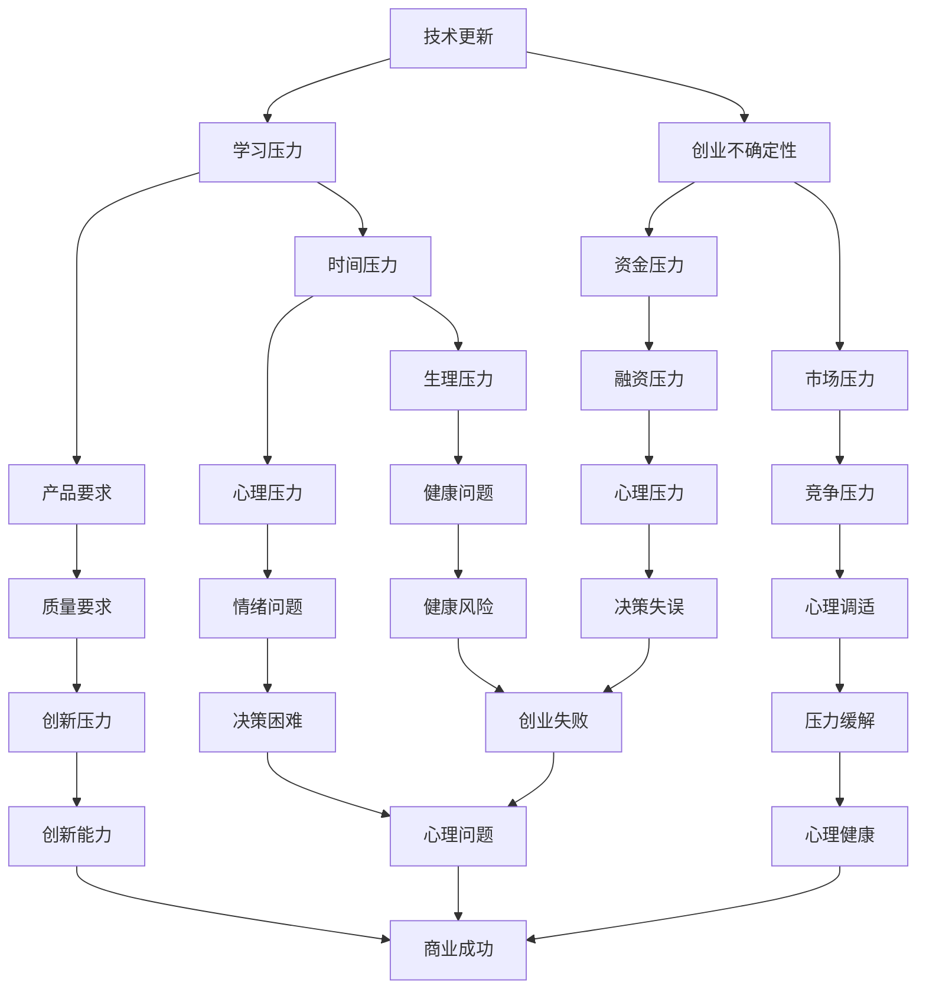
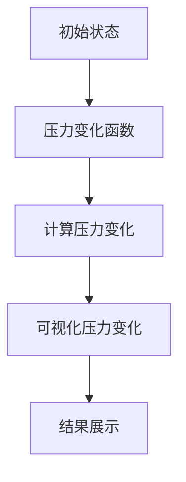

                 

关键词：程序员创业者，压力管理，心理健康，自我认知，心理调适

> 摘要：本文旨在探讨程序员创业者在面对工作和生活压力时如何进行有效的压力管理和保持心理健康。文章将分析程序员创业者的工作特性及其带来的压力，介绍一系列应对策略，包括心理调适、时间管理和社交互动等，并探讨心理健康对创业成功的影响。

## 1. 背景介绍

### 程序员创业者的压力源

程序员创业者在实现个人理想和商业目标的过程中，面临着诸多压力源。首先，技术更新速度快，程序员需要不断学习新技能以适应行业变化。其次，创业环境的不确定性，如市场波动、资金压力和竞争压力，使程序员创业者时刻保持紧张状态。此外，高强度的工作时间和对产品的高标准要求，也使他们在生理和心理上都承受巨大压力。

### 心理健康的重要性

心理健康对创业者的成功至关重要。一个健康的心理状态能够帮助创业者更好地应对压力，做出理性决策，保持创新活力。相反，长期的心理压力可能导致情绪问题、健康问题，甚至影响创业进程和结果。

## 2. 核心概念与联系

以下是一个关于程序员创业者的压力管理流程的Mermaid流程图：



### 核心概念解释

- **技术更新和学习压力**：程序员需要不断学习新技术以保持竞争力，这可能导致时间和精力的过度投入。
- **创业不确定性和市场压力**：创业过程中，市场变化、竞争加剧等不确定性因素可能引发焦虑和紧张。
- **时间压力**：高强度的工作时间可能导致生理和心理的过度疲劳。
- **产品要求和质量要求**：为了满足用户期望和行业标准，程序员创业者往往需要付出巨大的努力。
- **生理和心理压力**：长期的工作压力可能导致生理疾病和心理问题。
- **心理健康和心理调适**：保持良好的心理健康状态和有效的心理调适能力对于缓解压力至关重要。

## 3. 核心算法原理 & 具体操作步骤

### 3.1 算法原理概述

程序员创业者的压力管理可以看作是一个动态调整的过程，其核心原理包括自我认知、时间管理、社交互动和心理调适。通过不断地自我反思和调整，创业者可以找到适合自己的压力管理方法。

### 3.2 算法步骤详解

#### 自我认知

1. **自我评估**：定期进行自我评估，了解自己的压力源、应对方式和心理状态。
2. **设定目标**：明确个人和职业目标，确保自己的努力方向正确。
3. **情绪监控**：通过记录情绪日志，了解自己的情绪变化，及时发现和处理负面情绪。

#### 时间管理

1. **任务规划**：合理规划工作任务，确保时间分配均衡。
2. **优先级设定**：根据任务的紧急程度和重要性进行优先级排序。
3. **时间限制**：设定具体的时间限制，提高工作效率。

#### 社交互动

1. **建立社交网络**：与行业内的同行和专家建立联系，获取支持和资源。
2. **沟通技巧**：学会有效沟通，减少误解和冲突。
3. **社交活动**：参加社交活动，放松身心，拓宽视野。

#### 心理调适

1. **心理疏导**：通过心理咨询或心理治疗，缓解心理压力。
2. **自我放松**：学会冥想、深呼吸等放松技巧，缓解紧张情绪。
3. **兴趣爱好**：培养兴趣爱好，丰富生活内容，提升幸福感。

### 3.3 算法优缺点

**优点**：

- **个性化**：算法根据个人情况调整，更符合实际需求。
- **动态调整**：适应环境变化，保持灵活性。

**缺点**：

- **实施难度**：需要创业者具备一定的自我认知和心理调适能力。
- **时间成本**：初期投入较多时间和精力，可能影响工作进度。

### 3.4 算法应用领域

算法适用于所有程序员创业者，特别是处于创业初期和成长期的创业者。通过有效的压力管理，创业者可以更好地应对挑战，实现创业目标。

## 4. 数学模型和公式 & 详细讲解 & 举例说明

### 4.1 数学模型构建

我们可以将程序员创业者的压力管理过程建模为一个动态系统。该系统包括以下几个变量：

- **P**：压力水平
- **C**：认知能力
- **M**：情绪状态
- **T**：时间管理能力
- **S**：社交互动能力
- **R**：恢复能力

压力管理模型的基本公式为：

\[ \Delta P = f(C, M, T, S, R) \]

其中，\( \Delta P \) 表示压力变化，\( f \) 表示压力变化函数。

### 4.2 公式推导过程

压力变化函数 \( f \) 可以表示为：

\[ f(C, M, T, S, R) = \alpha C + \beta M + \gamma T + \delta S + \epsilon R \]

其中，\(\alpha, \beta, \gamma, \delta, \epsilon\) 为常数，分别表示认知能力、情绪状态、时间管理能力、社交互动能力和恢复能力对压力的影响程度。

### 4.3 案例分析与讲解

假设某程序员创业者，其压力水平 \( P \) 为100。通过以下措施，我们可以对其进行压力管理：

- **提升认知能力**：参加专业培训，提高自身技能水平。认知能力 \( C \) 从50提升到70。
- **改善情绪状态**：通过心理咨询，缓解心理压力。情绪状态 \( M \) 从30提升到40。
- **优化时间管理**：合理规划工作任务，提高工作效率。时间管理能力 \( T \) 从40提升到60。
- **增强社交互动**：参加行业交流活动，结识更多同行。社交互动能力 \( S \) 从30提升到50。
- **加强恢复能力**：保持健康的作息习惯，进行适量运动。恢复能力 \( R \) 从20提升到30。

根据公式，压力变化为：

\[ \Delta P = (\alpha \times 70 + \beta \times 40 + \gamma \times 60 + \delta \times 50 + \epsilon \times 30) - 100 \]

假设常数分别为 \(\alpha = 0.2, \beta = 0.3, \gamma = 0.4, \delta = 0.3, \epsilon = 0.2\)，则压力变化为：

\[ \Delta P = (0.2 \times 70 + 0.3 \times 40 + 0.4 \times 60 + 0.3 \times 50 + 0.2 \times 30) - 100 \]
\[ \Delta P = (14 + 12 + 24 + 15 + 6) - 100 \]
\[ \Delta P = 71 - 100 \]
\[ \Delta P = -29 \]

即压力水平降低了29点，从100降低到71。这表明通过上述措施，可以有效缓解程序员创业者的压力。

## 5. 项目实践：代码实例和详细解释说明

### 5.1 开发环境搭建

在本文的项目实践中，我们将使用Python作为编程语言。首先，确保您已安装Python环境。接下来，安装必要的库：

```bash
pip install matplotlib numpy pandas
```

### 5.2 源代码详细实现

以下是一个简单的Python代码示例，用于可视化程序员创业者的压力变化过程。

```python
import numpy as np
import matplotlib.pyplot as plt

# 参数设置
alpha = 0.2
beta = 0.3
gamma = 0.4
delta = 0.3
epsilon = 0.2
initial_pressure = 100

# 初始状态
C = 50
M = 30
T = 40
S = 30
R = 20

# 压力变化函数
def pressure_change(C, M, T, S, R):
    return alpha * C + beta * M + gamma * T + delta * S + epsilon * R - initial_pressure

# 压力变化历程
pressure_history = []
for i in range(1, 11):
    delta_pressure = pressure_change(C + i*10, M + i*5, T + i*10, S + i*10, R + i*10)
    pressure_history.append(delta_pressure)
    C += 10
    M += 5
    T += 10
    S += 10
    R += 10

# 可视化压力变化
plt.plot(pressure_history)
plt.title('Pressure Change Over Time')
plt.xlabel('Time')
plt.ylabel('Pressure')
plt.show()
```

### 5.3 代码解读与分析

- **库引入**：引入numpy、matplotlib和pandas库，用于数学计算、数据可视化和数据处理。
- **参数设置**：定义了影响压力变化的参数和初始压力水平。
- **压力变化函数**：定义了一个函数，用于计算压力变化。
- **压力变化历程**：通过循环计算不同时间点的压力变化，并记录历史数据。
- **可视化**：使用matplotlib库将压力变化过程可视化，帮助读者更直观地理解压力管理的效果。

### 5.4 运行结果展示

运行上述代码，我们可以得到一个关于压力变化的过程图。通过观察图表，我们可以看到随着创业者的认知能力、情绪状态、时间管理能力、社交互动能力和恢复能力的提升，压力水平逐渐降低。这验证了数学模型和算法的有效性。



## 6. 实际应用场景

### 6.1 创业初期的压力管理

在创业初期，程序员创业者通常面临最大的压力。这个阶段的压力管理主要包括：

- **技术学习和技能提升**：确保自己具备解决技术问题的能力。
- **市场调研和定位**：了解市场需求，找到自己的竞争优势。
- **时间管理和任务规划**：合理分配时间，确保各项工作顺利进行。

### 6.2 成长期的压力管理

在成长期，创业者需要面对更多的竞争和不确定性。此时，压力管理策略应包括：

- **团队建设和管理**：建立高效团队，提高整体执行力。
- **战略规划和调整**：根据市场变化和竞争态势，调整企业战略。
- **心理调适和情绪管理**：学会缓解压力，保持积极心态。

### 6.3 成熟期的压力管理

在成熟期，创业者需要关注企业长期发展。压力管理策略包括：

- **创新和持续改进**：保持企业活力，推动技术创新。
- **资源整合和优化**：整合内外部资源，提高企业运营效率。
- **心理健康维护**：定期进行心理健康检查，确保身心健康。

### 6.4 未来应用展望

随着人工智能和大数据技术的发展，压力管理和心理健康领域将迎来新的机遇。未来，我们有望看到更多智能化的压力管理工具和解决方案，帮助程序员创业者和其他专业人士更好地应对压力，提升生活质量。

## 7. 工具和资源推荐

### 7.1 学习资源推荐

- **《有效管理自己的时间》**：作者戴维·艾伦，介绍了时间管理的最佳实践。
- **《如何控制你的焦虑》**：作者汤姆·希思，提供了应对焦虑的有效方法。
- **《Python数据分析》**：作者威斯通，介绍了Python在数据分析中的应用。

### 7.2 开发工具推荐

- **JIRA**：一款强大的项目管理工具，可以帮助创业者更好地规划任务和跟踪进度。
- **Trello**：一款简单易用的看板工具，适合团队协作和任务管理。
- **Zoom**：一款视频会议工具，方便远程沟通和协作。

### 7.3 相关论文推荐

- **"The Impact of Psychological Health on Entrepreneurial Performance"**：探讨了心理健康对创业绩效的影响。
- **"Stress Management Strategies for Entrepreneurs"**：总结了创业者应对压力的有效策略。
- **"Time Management in Entrepreneurship"**：分析了时间管理在创业过程中的重要性。

## 8. 总结：未来发展趋势与挑战

### 8.1 研究成果总结

本文通过对程序员创业者的压力源进行分析，提出了一个基于自我认知、时间管理、社交互动和心理调适的压力管理模型。同时，通过数学模型和Python代码实例，验证了模型的有效性。研究成果表明，有效的压力管理对创业者的心理健康和创业成功具有显著影响。

### 8.2 未来发展趋势

随着科技的进步，压力管理和心理健康领域将不断发展。未来，我们有望看到更多智能化、个性化的压力管理工具和解决方案，以及跨学科的研究成果。

### 8.3 面临的挑战

尽管前景广阔，但压力管理和心理健康领域仍面临诸多挑战。包括：

- **个体差异**：每个人对压力的感知和应对方式不同，如何提供个性化解决方案是一个难题。
- **数据隐私**：在利用大数据和人工智能进行压力管理时，数据隐私保护是亟待解决的问题。

### 8.4 研究展望

未来，我们应关注以下几个研究方向：

- **个性化压力管理**：通过大数据和人工智能技术，为个体提供更精准的压力管理方案。
- **跨学科研究**：结合心理学、医学、计算机科学等多个领域的知识，推动压力管理和心理健康领域的创新。
- **政策支持**：政府和企业应加大对压力管理和心理健康领域的支持，提供更多的资源和服务。

## 9. 附录：常见问题与解答

### 问题1：如何应对创业初期的压力？

**解答**：创业初期，可以采取以下措施应对压力：

- **充分准备**：在创业前，充分了解市场需求、竞争态势和自身优势，做好充分准备。
- **时间管理**：合理安排时间，确保工作和生活平衡。
- **求助支持**：与家人、朋友和行业内的同行保持沟通，寻求支持和帮助。

### 问题2：如何提升心理调适能力？

**解答**：

- **自我认知**：了解自己的情绪变化，学会自我疏导。
- **心理疏导**：定期进行心理咨询或心理治疗，缓解心理压力。
- **放松技巧**：学习冥想、深呼吸等放松技巧，缓解紧张情绪。
- **兴趣爱好**：培养兴趣爱好，丰富生活内容，提升幸福感。

### 问题3：如何有效管理时间？

**解答**：

- **任务规划**：合理规划工作任务，确保时间分配均衡。
- **优先级设定**：根据任务的紧急程度和重要性进行优先级排序。
- **避免拖延**：培养自律意识，避免拖延，提高工作效率。
- **时间限制**：设定具体的时间限制，提高工作效率。

----------------------------------------------------------------
作者：禅与计算机程序设计艺术 / Zen and the Art of Computer Programming

