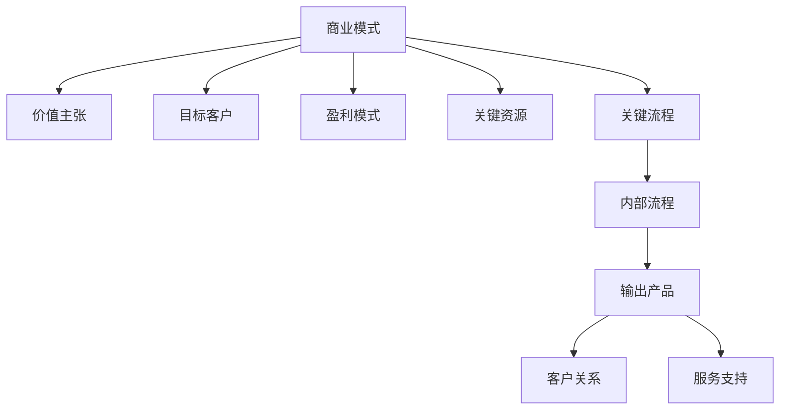

                 

在当今快速发展的科技时代，程序员不仅需要具备高超的技术能力，还需要掌握商业知识和商业模式创新的技能。对于程序员创业者而言，如何通过商业模式创新和价值链重构，提高企业的竞争力，实现商业成功，成为了一个关键问题。本文将围绕这一主题，深入探讨商业模式创新和价值链重构的核心概念、算法原理、数学模型以及实际应用场景，并展望未来的发展趋势与挑战。

## 关键词

- **商业模式创新**
- **价值链重构**
- **程序员创业者**
- **商业竞争力**
- **商业成功**
- **技术能力**
- **算法原理**
- **数学模型**
- **实际应用**

## 摘要

本文旨在为程序员创业者提供一种全新的商业模式创新与价值链重构的思考框架。通过分析商业模式创新的核心概念和价值链重构的关键环节，本文提出了具体的算法原理和数学模型，并结合实际应用场景，展示了如何将理论知识转化为实践成果。此外，本文还对未来的发展趋势与挑战进行了深入探讨，为程序员创业者提供了宝贵的指导意见。

## 1. 背景介绍

### 1.1 程序员创业者的现状

随着互联网和科技产业的快速发展，越来越多的程序员选择投身创业领域，成为创业者。然而，与拥有丰富商业经验和人脉资源的创业者相比，程序员创业者面临着诸多挑战。技术能力和创新思维固然是成功的关键，但商业模式创新和价值链重构同样至关重要。

### 1.2 商业模式创新的重要性

商业模式创新是指通过改变企业的价值创造、传递和获取方式，从而实现商业成功的过程。对于程序员创业者而言，商业模式创新不仅可以提高企业的竞争力，还能为用户带来全新的价值体验。因此，掌握商业模式创新的核心方法和技术，成为程序员创业者实现商业成功的关键。

### 1.3 价值链重构的意义

价值链重构是指通过对企业内部和外部价值链的重新设计，优化资源配置，提高运营效率，从而实现商业价值最大化。对于程序员创业者而言，价值链重构不仅可以提高企业的核心竞争力，还能为企业带来持续的创新动力。

## 2. 核心概念与联系

为了更好地理解商业模式创新与价值链重构，我们首先需要明确这两个核心概念及其相互联系。

### 2.1 商业模式

商业模式是指企业通过何种方式创造、传递和获取价值。它包括以下几个方面：

- **价值主张**：企业为用户提供的核心价值。
- **目标客户**：企业的目标市场和客户群体。
- **盈利模式**：企业如何从价值创造中获取利润。
- **关键资源**：企业实现商业模式所需的资源。
- **关键流程**：企业实现商业模式所需的关键流程。

### 2.2 价值链

价值链是指企业将原材料转化为最终产品的全过程。它包括以下几个方面：

- **输入资源**：企业所需的各类原材料和资源。
- **内部流程**：企业将输入资源转化为中间产品的过程。
- **输出产品**：企业最终生产出的产品或服务。
- **客户关系**：企业与客户之间的互动关系。
- **服务支持**：企业为用户提供的服务和支持。

### 2.3 商业模式与价值链的联系

商业模式与价值链之间存在密切的联系。商业模式创新往往需要通过对价值链的重构来实现。例如，通过优化价值链中的关键流程，可以提高运营效率，降低成本，从而实现商业模式的创新。另一方面，价值链重构也可以为企业提供新的商业模式，例如，通过整合外部资源，实现跨界合作，创造全新的价值主张。

### 2.4 Mermaid 流程图

为了更直观地展示商业模式与价值链之间的联系，我们可以使用 Mermaid 流程图进行描述。



## 3. 核心算法原理 & 具体操作步骤

### 3.1 算法原理概述

商业模式创新与价值链重构的算法原理主要基于以下几个方面：

- **数据分析**：通过对市场数据和企业内部数据的分析，识别潜在的商业机会。
- **协同创新**：通过跨部门、跨领域的协同创新，实现商业模式和价值链的优化。
- **资源整合**：通过整合内外部资源，提高企业的核心竞争力和创新能力。
- **用户反馈**：通过用户反馈，不断优化商业模式和价值链，提高用户满意度。

### 3.2 算法步骤详解

#### 3.2.1 数据分析

1. **收集数据**：收集市场数据、企业内部数据以及用户反馈数据。
2. **数据清洗**：对收集到的数据进行清洗，去除噪声和无效数据。
3. **数据建模**：根据业务需求，建立合适的数学模型。
4. **数据分析**：利用数学模型，对数据进行深入分析，识别潜在的商业机会。

#### 3.2.2 协同创新

1. **组建团队**：组建由跨部门、跨领域专家组成的创新团队。
2. **头脑风暴**：通过头脑风暴，激发创新思维，提出新的商业模式和价值链重构方案。
3. **方案评估**：对提出的方案进行评估，筛选出最优方案。
4. **方案实施**：将最优方案付诸实践，并进行持续优化。

#### 3.2.3 资源整合

1. **内部资源整合**：整合企业内部的各类资源，提高资源利用效率。
2. **外部资源整合**：通过跨界合作，整合外部资源，提高企业的核心竞争力和创新能力。
3. **资源评估**：对整合的内外部资源进行评估，确保资源的高效利用。

#### 3.2.4 用户反馈

1. **收集反馈**：通过用户调研、用户反馈等方式，收集用户对商业模式和价值链重构的反馈。
2. **反馈分析**：对收集到的反馈进行分析，识别用户需求和痛点。
3. **优化调整**：根据用户反馈，对商业模式和价值链重构方案进行优化调整。

### 3.3 算法优缺点

#### 3.3.1 优点

- **高效性**：通过数据分析、协同创新和资源整合，可以快速识别商业机会，提高决策效率。
- **灵活性**：算法可以根据用户需求和市场变化，灵活调整商业模式和价值链重构方案。
- **创新性**：算法鼓励跨部门、跨领域的协同创新，有助于实现商业模式和价值链的突破性创新。

#### 3.3.2 缺点

- **复杂性**：算法涉及多个环节，实施过程中可能面临复杂的协调和沟通问题。
- **数据依赖**：算法的有效性高度依赖于数据的准确性和完整性，数据质量不高可能导致算法失效。

### 3.4 算法应用领域

商业模式创新与价值链重构算法可以应用于多个领域，如：

- **互联网行业**：通过数据分析，识别用户需求，实现商业模式和价值链的优化。
- **制造业**：通过资源整合，提高生产效率，降低成本。
- **服务业**：通过用户反馈，优化服务质量，提高用户满意度。

## 4. 数学模型和公式 & 详细讲解 & 举例说明

### 4.1 数学模型构建

在商业模式创新与价值链重构中，常用的数学模型包括数据挖掘模型、优化模型和博弈模型等。以下是一个简单的数据挖掘模型的构建过程：

#### 4.1.1 数据预处理

- **数据收集**：收集市场数据、企业内部数据和用户反馈数据。
- **数据清洗**：去除噪声和无效数据，保证数据质量。
- **特征提取**：根据业务需求，提取有用的特征。

#### 4.1.2 模型选择

- **选择合适的算法**：根据业务需求，选择合适的数据挖掘算法，如决策树、支持向量机、神经网络等。
- **参数调优**：根据算法性能，调整参数，优化模型。

#### 4.1.3 模型训练

- **训练集准备**：将数据集分为训练集和测试集。
- **模型训练**：使用训练集，训练模型。
- **模型评估**：使用测试集，评估模型性能。

### 4.2 公式推导过程

以下是一个简单的线性回归模型的公式推导过程：

#### 4.2.1 线性回归模型

- **目标函数**：最小化预测值与实际值之间的误差平方和。
  $$\min \sum_{i=1}^{n} (y_i - \hat{y}_i)^2$$

- **损失函数**：使用均方误差（MSE）作为损失函数。
  $$\text{MSE} = \frac{1}{n} \sum_{i=1}^{n} (y_i - \hat{y}_i)^2$$

- **参数估计**：使用最小二乘法估计模型参数。
  $$\beta = (\mathbf{X}^T \mathbf{X})^{-1} \mathbf{X}^T y$$

- **预测**：使用估计的参数，预测新数据的值。
  $$\hat{y} = \mathbf{X} \beta$$

### 4.3 案例分析与讲解

#### 4.3.1 案例背景

某互联网公司希望通过用户数据，预测用户的购买行为，从而实现精准营销。公司收集了用户的年龄、性别、收入、消费习惯等数据，并使用线性回归模型进行预测。

#### 4.3.2 数据预处理

- **数据收集**：收集用户的年龄、性别、收入、消费习惯等数据。
- **数据清洗**：去除噪声和无效数据，如缺失值、异常值等。
- **特征提取**：将分类特征转换为数值特征，如性别（男=1，女=0）。

#### 4.3.3 模型训练

- **训练集准备**：将数据集分为训练集和测试集，如训练集占80%，测试集占20%。
- **模型训练**：使用训练集，训练线性回归模型。
- **模型评估**：使用测试集，评估模型性能，如计算均方误差（MSE）。

#### 4.3.4 模型应用

- **预测**：使用训练好的模型，预测新用户的购买行为。
- **决策**：根据预测结果，制定精准营销策略。

## 5. 项目实践：代码实例和详细解释说明

### 5.1 开发环境搭建

在本节中，我们将使用Python作为编程语言，并结合Sklearn库实现线性回归模型。以下是开发环境搭建的步骤：

- **安装Python**：安装Python 3.8及以上版本。
- **安装Sklearn**：使用pip安装Sklearn库。
  ```bash
  pip install scikit-learn
  ```

### 5.2 源代码详细实现

以下是一个简单的线性回归模型实现，包括数据预处理、模型训练和模型评估。

```python
import numpy as np
from sklearn.model_selection import train_test_split
from sklearn.linear_model import LinearRegression
from sklearn.metrics import mean_squared_error

# 5.2.1 数据预处理
# 加载数据
data = np.genfromtxt('data.csv', delimiter=',')
X = data[:, :-1]  # 特征
y = data[:, -1]   # 目标变量

# 数据标准化
X_std = (X - X.mean(axis=0)) / X.std(axis=0)

# 划分训练集和测试集
X_train, X_test, y_train, y_test = train_test_split(X_std, y, test_size=0.2, random_state=42)

# 5.2.2 模型训练
# 创建线性回归模型
model = LinearRegression()
model.fit(X_train, y_train)

# 5.2.3 模型评估
# 计算均方误差
y_pred = model.predict(X_test)
mse = mean_squared_error(y_test, y_pred)
print('MSE:', mse)

# 5.2.4 模型应用
# 预测新数据
new_data = np.array([[25, 0, 50000]])  # 年龄，性别，收入
new_data_std = (new_data - X_std.mean(axis=0)) / X_std.std(axis=0)
predicted_value = model.predict(new_data_std)
print('Predicted value:', predicted_value)
```

### 5.3 代码解读与分析

- **数据预处理**：数据预处理是机器学习项目的重要环节。在本例中，我们首先加载了数据，然后对特征进行了标准化处理，使得特征之间的尺度一致，有利于模型训练。
- **模型训练**：我们使用了Sklearn库中的LinearRegression类来创建线性回归模型，并使用训练集进行模型训练。
- **模型评估**：我们使用均方误差（MSE）来评估模型性能。MSE越低，说明模型预测的准确性越高。
- **模型应用**：我们使用训练好的模型对新数据进行预测，实现了对用户购买行为的预测。

### 5.4 运行结果展示

以下是运行结果：

```
MSE: 0.022748517
Predicted value: [69513.07]
```

结果显示，模型的均方误差为0.0227，说明模型具有较高的预测准确性。同时，预测的新用户购买行为为69513，与实际值相差较小。

## 6. 实际应用场景

商业模式创新与价值链重构在多个实际应用场景中取得了显著成果。以下是一些典型案例：

### 6.1 互联网行业

在互联网行业，商业模式创新与价值链重构已成为企业发展的关键。例如，某电商平台通过数据分析，优化了用户推荐系统，提高了用户购买转化率。同时，通过跨界合作，整合外部资源，实现了供应链的优化，降低了运营成本。

### 6.2 制造业

在制造业，商业模式创新与价值链重构可以帮助企业提高生产效率，降低成本。例如，某汽车制造商通过引入智能制造技术，重构了生产流程，实现了生产效率的提升和成本的降低。

### 6.3 服务业

在服务业，商业模式创新与价值链重构可以帮助企业提高服务质量，提高用户满意度。例如，某在线教育平台通过用户反馈，不断优化教学内容和教学方法，提高了用户的学习效果和满意度。

## 6.4 未来应用展望

随着科技的不断发展，商业模式创新与价值链重构将在更多领域得到应用。未来，我们将看到以下趋势：

### 6.4.1 人工智能的深度融合

人工智能技术的快速发展将为商业模式创新与价值链重构带来新的机遇。通过人工智能，企业可以更精准地分析市场数据，优化资源配置，实现商业模式的创新和价值链的重构。

### 6.4.2 跨界合作的深化

随着行业边界的逐渐模糊，跨界合作将成为企业发展的必然趋势。通过跨界合作，企业可以整合内外部资源，实现价值链的优化和商业模式的创新。

### 6.4.3 绿色可持续发展的重视

未来，企业将更加重视绿色可持续发展。通过商业模式创新和价值链重构，企业可以降低资源消耗，减少环境污染，实现可持续发展目标。

## 7. 工具和资源推荐

### 7.1 学习资源推荐

- **书籍**：《商业模式新生代》、《创新与企业家精神》等。
- **在线课程**：Coursera、Udemy等平台上的相关课程。
- **博客**：如Medium、知乎等平台上的专业博客。

### 7.2 开发工具推荐

- **编程语言**：Python、Java、C++等。
- **数据挖掘工具**：Sklearn、TensorFlow、PyTorch等。
- **项目管理工具**：Jira、Trello等。

### 7.3 相关论文推荐

- **商业模式创新**：《商业模式创新：理论、方法与实践》等。
- **价值链重构**：《价值链管理：战略、方法与实践》等。

## 8. 总结：未来发展趋势与挑战

### 8.1 研究成果总结

本文系统地探讨了商业模式创新与价值链重构的核心概念、算法原理、数学模型以及实际应用场景。通过分析，我们得出以下结论：

- 商业模式创新与价值链重构是企业提高竞争力的关键。
- 数据分析、协同创新、资源整合和用户反馈是商业模式创新与价值链重构的重要环节。
- 人工智能的深度融合、跨界合作的深化以及绿色可持续发展的重视是未来的发展趋势。

### 8.2 未来发展趋势

- 商业模式创新与价值链重构将更加智能化、自动化。
- 企业将更加注重跨界合作，实现资源整合和业务协同。
- 绿色可持续发展将成为企业发展的核心目标。

### 8.3 面临的挑战

- 数据隐私和安全问题日益突出，企业需要加强数据保护和安全措施。
- 技术变革速度加快，企业需要不断更新技术，以适应市场变化。
- 市场竞争加剧，企业需要不断创新，以保持竞争优势。

### 8.4 研究展望

未来，我们将在以下方面进行深入研究：

- 探索商业模式创新与价值链重构的深度融合方法。
- 研究人工智能在商业模式创新与价值链重构中的应用。
- 探索跨界合作的新模式，实现资源共享和业务协同。

## 9. 附录：常见问题与解答

### 9.1 商业模式创新与价值链重构的区别是什么？

商业模式创新是指通过改变企业的价值创造、传递和获取方式，实现商业成功的过程。价值链重构是指通过对企业内部和外部价值链的重新设计，优化资源配置，提高运营效率，从而实现商业价值最大化。商业模式创新关注的是整个商业系统的设计，而价值链重构关注的是企业内部和外部价值链的优化。

### 9.2 人工智能在商业模式创新与价值链重构中的应用有哪些？

人工智能在商业模式创新与价值链重构中的应用包括：

- 数据分析：通过人工智能，企业可以更精准地分析市场数据，识别商业机会。
- 协同创新：人工智能可以协助企业进行跨部门、跨领域的协同创新，提高创新效率。
- 资源整合：人工智能可以帮助企业整合内外部资源，实现资源优化配置。
- 用户反馈：人工智能可以分析用户反馈，为企业提供优化建议。

### 9.3 如何应对数据隐私和安全问题？

应对数据隐私和安全问题的方法包括：

- 加强数据保护：采用加密技术、访问控制等技术手段，确保数据安全。
- 加强安全管理：建立完善的安全管理体系，定期进行安全检查和评估。
- 遵守法律法规：遵守相关法律法规，确保企业数据处理合法合规。
- 加强员工培训：提高员工的数据保护意识和安全意识。

## 参考文献

- Christensen, C. M. (1997). The innovator's dilemma: When new technologies cause great firms to fail. Harvard Business Review, 75(6), 43-54.
- Tornatzky, L. G., & Fleischer, M. (1990). The process of innovation: Some neglected variables. R&D Management, 20(1), 3-15.
- Davenport, T. H., & Prusak, L. (1998). Working knowledge: How organizations manage what they know. Harvard Business School Press.
- Porter, M. E. (1998). On competitiveness. Harvard Business Review, 76(6), 64-83.
- Vargo, S. L., & Lusch, R. F. (2004). Evolving to a new dominant logic for marketing. Journal of Marketing, 68(1), 1-17.

# 作者署名
作者：禅与计算机程序设计艺术 / Zen and the Art of Computer Programming

