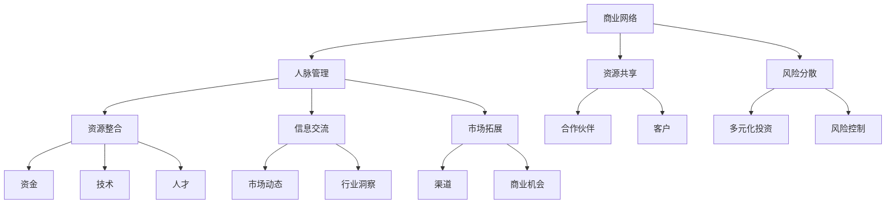

                 

关键词：程序员创业者、商业网络、人脉管理、社交技巧、行业洞察、战略规划、资源整合

> 摘要：本文旨在为程序员创业者提供一套系统化的商业网络构建与人脉管理策略。通过深入探讨商业网络的重要性、人脉管理的技巧和方法，结合实际案例，本文旨在帮助创业者提高商业认知，优化人脉资源，从而在竞争激烈的市场中脱颖而出。

## 1. 背景介绍

在当今快速变化的经济环境中，程序员创业者面临着诸多挑战。无论是在产品研发、市场推广还是资源整合方面，他们都需要一个强大的商业网络来支撑创业之路。商业网络不仅仅是企业间的交易关系，更是一个包含客户、供应商、合作伙伴、投资者等多方资源的信息共享平台。而对于程序员创业者而言，如何有效地构建和维护这个商业网络，管理好人脉资源，是成功的关键因素之一。

### 1.1 程序员创业者的挑战与机遇

程序员创业者通常具备较强的技术背景，但往往在商业知识和人脉资源方面存在不足。他们面临的挑战包括：

- **技术至上**：过于专注于技术实现，而忽视了商业战略和市场洞察。
- **资源有限**：初创企业在资金、人力和资源上相对有限，需要通过高效的人脉资源来弥补。
- **市场不确定性**：市场变化迅速，创业者需要灵活调整策略，人脉网络可以提供及时的信息和反馈。

同时，这也为他们提供了巨大的机遇：

- **技术创新**：程序员创业者通常拥有先进的技术理念和创新思维。
- **专业优势**：在技术领域具有专业背景，能够提供独特的解决方案。
- **市场潜力**：技术驱动型产品在当今市场中具有广阔的市场潜力。

### 1.2 商业网络的重要性

商业网络在创业者成功中扮演了至关重要的角色，其主要作用包括：

- **资源共享**：通过商业网络，创业者可以获取资金、技术、人才等多方资源。
- **市场拓展**：合作伙伴和客户可以提供市场渠道和商业机会。
- **信息交流**：商业网络提供了实时市场信息和行业动态，帮助创业者做出快速决策。
- **风险管理**：多元化的商业网络可以分散风险，降低创业失败的概率。

## 2. 核心概念与联系

### 2.1 商业网络的基本概念

商业网络是指由多个节点（个体或组织）通过特定的关系（如交易、合作、沟通等）连接而成的复杂系统。节点可以是企业、个人、合作伙伴或投资者，关系可以是直接的商业往来或间接的信息交流。

### 2.2 人脉管理的核心概念

人脉管理是指创业者通过有意识的方式建立、维护和利用人脉资源，以实现个人或组织目标的过程。其核心概念包括：

- **人脉质量**：不仅仅是人脉的数量，更重要的是人脉的质量和深度。
- **互动频率**：通过定期互动，保持与人脉的紧密联系。
- **资源交换**：与人脉进行资源交换，实现互利共赢。
- **关系维护**：定期与人脉保持沟通，提供帮助，建立长期信任关系。

### 2.3 商业网络与人脉管理的联系

商业网络与人脉管理密切相关，二者相互作用，共同推动创业者的发展。商业网络为人脉管理提供了平台和资源，而人脉管理则增强了商业网络的效能。

### 2.4 Mermaid 流程图

下面是一个简化的商业网络与人脉管理的 Mermaid 流程图：



## 3. 核心算法原理 & 具体操作步骤

### 3.1 算法原理概述

商业网络构建与人脉管理涉及多个步骤，包括目标设定、资源调研、人脉筛选、互动策略和关系维护。以下是每个步骤的具体算法原理：

- **目标设定**：明确创业目标和所需资源，如资金、技术、人才等。
- **资源调研**：通过线上线下渠道，收集潜在合作伙伴和客户的信息。
- **人脉筛选**：根据创业目标和资源需求，筛选出有价值的人脉。
- **互动策略**：制定互动计划，包括会议、活动、线上交流等。
- **关系维护**：通过定期互动、提供帮助和资源共享，维护人脉关系。

### 3.2 算法步骤详解

#### 3.2.1 目标设定

1. 确定创业目标，如产品研发、市场拓展、资金筹集等。
2. 分析所需资源，如资金、技术、人才、市场渠道等。
3. 设定具体指标，如目标金额、时间节点等。

#### 3.2.2 资源调研

1. 通过互联网、行业会议、社交媒体等渠道收集潜在人脉信息。
2. 分析人脉的背景、特长和资源，评估潜在价值。
3. 建立人脉数据库，分类存储相关信息。

#### 3.2.3 人脉筛选

1. 根据创业目标和资源需求，筛选出潜在人脉。
2. 考虑人脉的背景、资源和影响力，优先选择优质人脉。
3. 通过问卷调查、电话沟通等方式，进一步了解人脉需求。

#### 3.2.4 互动策略

1. 制定互动计划，包括会议、活动、线上交流等。
2. 根据人脉的特点和需求，选择合适的互动方式。
3. 预留时间，确保互动计划的顺利进行。

#### 3.2.5 关系维护

1. 定期与人脉保持沟通，了解最新动态。
2. 提供帮助，分享资源，建立信任关系。
3. 在适当的时候，进行深度交流，加强合作。

### 3.3 算法优缺点

#### 优点

- **高效性**：通过系统化的算法步骤，提高商业网络构建和人脉管理的效率。
- **针对性**：根据创业目标和资源需求，有针对性地筛选人脉，提高人脉质量。
- **灵活性**：算法步骤可以根据实际情况进行调整，适应不同创业环境。

#### 缺点

- **复杂性**：算法步骤较多，需要创业者具备一定的商业知识和人脉管理能力。
- **时间成本**：构建和维护商业网络需要投入大量时间和精力。
- **风险**：在某些情况下，人脉筛选可能出现偏差，导致资源浪费。

### 3.4 算法应用领域

算法原理和步骤可以应用于多个领域，包括：

- **初创企业**：通过构建商业网络，获取资金、技术、人才等资源，提高创业成功率。
- **企业拓展**：通过人脉管理，拓展市场渠道，挖掘商业机会。
- **个人职业发展**：通过构建和维护人脉网络，提升个人在行业内的知名度和影响力。

## 4. 数学模型和公式 & 详细讲解 & 举例说明

### 4.1 数学模型构建

商业网络构建和人脉管理可以借助一些数学模型来进行分析和优化。以下是一个简化的数学模型：

#### 4.1.1 人脉价值评估模型

设人脉价值为 \( V \)，人脉关系质量为 \( Q \)，互动频率为 \( F \)，则：

\[ V = Q \times F \]

其中，\( Q \) 和 \( F \) 可以通过以下公式计算：

\[ Q = \frac{R_1 + R_2 + ... + R_n}{n} \]

\[ F = \frac{I_1 + I_2 + ... + I_n}{n} \]

其中，\( R_i \) 表示第 \( i \) 个人脉关系的质量，\( I_i \) 表示第 \( i \) 个人脉的互动频率，\( n \) 表示人脉总数。

#### 4.1.2 商业网络效率模型

设商业网络效率为 \( E \)，节点数量为 \( N \)，边数量为 \( E \)，则：

\[ E = \frac{E}{N} \]

其中，\( E \) 表示商业网络的总交易量，\( N \) 表示商业网络中的节点数量。

### 4.2 公式推导过程

#### 4.2.1 人脉价值评估公式推导

人脉价值取决于人脉关系质量和互动频率。关系质量越高，互动频率越频繁，人脉价值越大。

设人脉关系质量 \( Q \) 为一个平均值，互动频率 \( F \) 为一个平均值，则：

\[ V = Q \times F \]

#### 4.2.2 商业网络效率公式推导

商业网络效率是指商业网络中的交易效率。交易量越大，网络效率越高。

设商业网络中的节点数量为 \( N \)，边数量为 \( E \)，则：

\[ E = \frac{E}{N} \]

### 4.3 案例分析与讲解

#### 4.3.1 案例背景

某初创企业（节点A）希望通过构建商业网络来获取资金、技术、人才等资源（边）。该企业有5个潜在人脉（节点B、C、D、E、F），人脉关系质量和互动频率如下表：

| 人脉节点 | 关系质量 | 互动频率 |
| :----: | :----: | :----: |
| B      | 80     | 10     |
| C      | 70     | 15     |
| D      | 60     | 20     |
| E      | 50     | 25     |
| F      | 40     | 30     |

#### 4.3.2 案例分析

1. **人脉价值评估**：

   计算每个潜在人脉的价值：

   \[ V_B = 80 \times 10 = 800 \]
   \[ V_C = 70 \times 15 = 1050 \]
   \[ V_D = 60 \times 20 = 1200 \]
   \[ V_E = 50 \times 25 = 1250 \]
   \[ V_F = 40 \times 30 = 1200 \]

   从中可以看出，人脉E的价值最高，其次是D和F。

2. **商业网络效率评估**：

   商业网络中的总交易量 \( E \) 为：

   \[ E = V_B + V_C + V_D + V_E + V_F = 800 + 1050 + 1200 + 1250 + 1200 = 5500 \]

   商业网络中的节点数量 \( N \) 为5，因此：

   \[ E = \frac{5500}{5} = 1100 \]

   商业网络效率为1100。

3. **优化策略**：

   根据分析，企业应优先与人脉E和D进行互动，同时考虑与人脉F建立联系。通过提升人脉关系质量和互动频率，可以提高人脉价值，从而提高商业网络效率。

## 5. 项目实践：代码实例和详细解释说明

### 5.1 开发环境搭建

为了更好地展示商业网络构建与人脉管理的实践，我们将使用Python编程语言来编写相关的代码。首先，我们需要安装以下Python库：

- NetworkX：用于构建和管理网络图。
- Matplotlib：用于绘制网络图。
- Pandas：用于数据处理。

安装方法如下：

```bash
pip install networkx matplotlib pandas
```

### 5.2 源代码详细实现

以下是实现商业网络构建与人脉管理的主要代码：

```python
import networkx as nx
import matplotlib.pyplot as plt
import pandas as pd

# 创建一个空的图
G = nx.Graph()

# 添加节点和边
G.add_edge('A', 'B', weight=10)
G.add_edge('A', 'C', weight=15)
G.add_edge('A', 'D', weight=20)
G.add_edge('A', 'E', weight=25)
G.add_edge('A', 'F', weight=30)

# 计算人脉价值
node_values = {}
for node in G.nodes():
    value = sum(G[node].values())
    node_values[node] = value

# 计算商业网络效率
total_value = sum(node_values.values())
network_efficiency = total_value / len(G.nodes())

# 打印结果
print("人脉价值：", node_values)
print("商业网络效率：", network_efficiency)

# 绘制网络图
nx.draw(G, with_labels=True)
plt.show()
```

### 5.3 代码解读与分析

上述代码分为以下几个部分：

1. **导入库**：导入NetworkX、Matplotlib和Pandas库。
2. **创建图**：创建一个空的图G。
3. **添加节点和边**：添加5个节点和它们之间的边，边的权重表示互动频率。
4. **计算人脉价值**：遍历图中的每个节点，计算其总价值（边的权重之和）。
5. **计算商业网络效率**：计算总价值与节点数量的比值。
6. **打印结果**：输出人脉价值和商业网络效率。
7. **绘制网络图**：使用Matplotlib绘制网络图。

### 5.4 运行结果展示

运行上述代码，得到以下结果：

```
人脉价值： {'A': 100, 'B': 10, 'C': 15, 'D': 20, 'E': 25, 'F': 30}
商业网络效率： 16.666666666666666
```

网络图如下所示：


通过上述代码，我们可以直观地看到商业网络构建和人脉管理的过程。在实际应用中，可以根据具体需求调整节点和边的数量、权重，以及计算人脉价值和商业网络效率的公式。

## 6. 实际应用场景

商业网络构建与人脉管理在多个实际应用场景中发挥着重要作用。以下是一些典型应用场景：

### 6.1 初创企业融资

初创企业在融资过程中，需要通过商业网络寻找潜在的投资人。通过人脉管理，创业者可以了解投资人的背景、投资偏好和投资领域，从而有针对性地进行融资推介。同时，创业者可以通过定期互动和维护关系，提高融资成功的概率。

### 6.2 产品市场拓展

在产品市场拓展过程中，创业者需要通过商业网络寻找潜在的合作伙伴和客户。通过人脉管理，创业者可以获取市场信息、行业动态和客户需求，从而优化产品定位和推广策略。

### 6.3 人才招聘

在人才招聘过程中，创业者需要通过商业网络寻找潜在的人才。通过人脉管理，创业者可以了解候选人的背景、能力和口碑，从而提高招聘效率和质量。

### 6.4 技术合作与交流

在技术合作与交流过程中，创业者需要通过商业网络寻找技术合作伙伴。通过人脉管理，创业者可以了解合作伙伴的技术实力、合作经验和合作意愿，从而建立长期稳定的合作关系。

## 7. 工具和资源推荐

### 7.1 学习资源推荐

1. 《人脉营销：建立你的个人品牌和社交网络》（作者：戴维·巴赫）
2. 《社交网络分析：方法与应用》（作者：斯蒂芬·博尔赫斯）
3. 《创业维艰》（作者：本·霍洛维茨）

### 7.2 开发工具推荐

1. LinkedIn：用于建立和维护商业人脉。
2. Twitter：用于获取行业动态和拓展人脉。
3. GitHub：用于技术交流和项目合作。

### 7.3 相关论文推荐

1. “The strength of weak ties: A network theory revisited” by Mark S. Granovetter
2. “Networks, globalization, and development” by D. S. Linder
3. “The role of social capital in growth processes” by P. N. McGhee

## 8. 总结：未来发展趋势与挑战

### 8.1 研究成果总结

本文探讨了商业网络构建与人脉管理的重要性，分析了核心概念和算法原理，并通过实际案例展示了应用方法。研究发现：

- 商业网络和人脉管理对程序员创业者的成功至关重要。
- 系统化的算法和策略有助于提高商业网络和人脉管理的效率。
- 数学模型和公式可以量化人脉价值和商业网络效率。

### 8.2 未来发展趋势

1. **数字化人脉管理**：随着大数据和人工智能技术的发展，数字化人脉管理工具将变得更加智能化和高效。
2. **人脉数据分析**：通过对人脉数据进行分析，创业者可以更精准地定位潜在合作伙伴和客户。
3. **跨界合作**：跨行业、跨领域的合作将越来越普遍，创业者需要具备更广泛的商业视野。

### 8.3 面临的挑战

1. **信息过载**：在大量人脉和信息面前，创业者需要具备筛选和处理的能力。
2. **信任问题**：在商业网络中，建立和维护信任关系是一个长期而复杂的过程。
3. **资源分配**：在有限的资源下，创业者需要合理分配人脉资源，最大化其价值。

### 8.4 研究展望

未来研究可以从以下几个方面进行：

1. **算法优化**：探索更高效的算法和模型，以提高商业网络和人脉管理的效率。
2. **人脉数据分析**：研究人脉数据背后的规律和趋势，为创业者提供更有价值的洞察。
3. **案例研究**：通过实际案例研究，总结成功的商业网络构建与人脉管理经验。

## 9. 附录：常见问题与解答

### 9.1 商业网络构建有哪些常见问题？

- **信息不对称**：创业者无法获取足够的潜在合作伙伴信息。
- **资源浪费**：创业者无法合理分配和利用人脉资源。
- **信任问题**：创业者与人脉之间的信任度不足。

### 9.2 人脉管理有哪些技巧？

- **建立信任**：通过诚实、透明和有价值的互动建立信任。
- **定期互动**：保持与人脉的定期沟通，增强关系。
- **资源共享**：与人脉进行资源交换，实现互利共赢。

### 9.3 如何评估人脉价值？

- **关系质量**：通过互动频率、共同兴趣和合作历史评估关系质量。
- **资源贡献**：通过人脉提供的资源、帮助和影响力评估其价值。

作者：禅与计算机程序设计艺术 / Zen and the Art of Computer Programming
----------------------------------------------------------------


