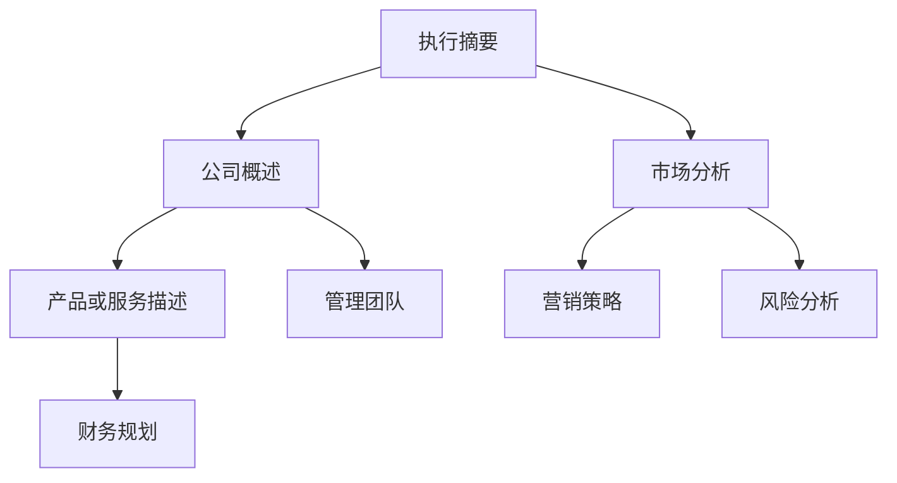

                 

 作为一位程序员创业者，您已经拥有了一款优秀的产品或服务，但如何才能让潜在投资者对您的项目产生兴趣呢？本文将为您详细解析如何撰写一份吸引投资的商业计划书。

## 关键词
- 程序员创业者
- 商业计划书
- 投资策略
- 市场分析
- 营销策略
- 财务规划

## 摘要
本文旨在帮助程序员创业者撰写一份专业且具有吸引力的商业计划书。我们将详细探讨商业计划书的核心组成部分，包括市场分析、产品或服务描述、营销策略、财务规划等，并提供实用的撰写技巧和案例。

## 1. 背景介绍
作为程序员创业者，您可能已经对技术细节有着深刻的理解，但商业计划书的撰写却是一个全新的挑战。商业计划书不仅是向投资者展示您项目价值的工具，也是您对自己业务进行全面思考和规划的过程。

### 1.1 程序员创业者的优势
- 技术优势：作为程序员，您对技术有着深入的理解和实践经验。
- 问题解决能力：程序员通常具有较强的分析和解决问题的能力。
- 创新意识：程序员往往具有创新思维，能够快速响应市场需求。

### 1.2 商业计划书的重要性
- 明确业务方向：商业计划书可以帮助您清晰地定义业务目标和发展路径。
- 吸引投资者：一份专业的商业计划书能够吸引潜在投资者的兴趣。
- 指导运营：商业计划书是指导公司运营的重要文件。

## 2. 核心概念与联系

### 2.1 商业计划书的基本框架
商业计划书通常包括以下几个核心部分：

- 执行摘要
- 公司概述
- 市场分析
- 产品或服务描述
- 营销策略
- 管理团队
- 财务规划
- 风险分析

### 2.2 核心概念原理和架构的 Mermaid 流程图



## 3. 核心算法原理 & 具体操作步骤

### 3.1 算法原理概述
商业计划书的撰写可以看作是一个系统性工程，涉及多个方面的综合考量。以下是一个简单的商业计划书撰写流程：

1. **明确目标和受众**：首先，确定您的商业计划书的目标受众，以及您希望达成的具体目标。
2. **收集信息**：收集与您的业务相关的所有信息，包括市场研究、竞争对手分析、客户反馈等。
3. **撰写草稿**：根据收集到的信息，撰写商业计划书的草稿。
4. **编辑和完善**：对草稿进行反复编辑和完善，确保内容的准确性和逻辑性。
5. **寻求反馈**：向专业人士或潜在投资者寻求反馈，进一步改进商业计划书。

### 3.2 算法步骤详解

#### 步骤1：明确目标和受众
- **目标**：明确您希望通过商业计划书实现的目标，例如融资、业务扩展等。
- **受众**：确定您的商业计划书的受众，例如投资者、合作伙伴、潜在客户等。

#### 步骤2：收集信息
- **市场研究**：了解目标市场的规模、增长趋势、用户需求等。
- **竞争对手分析**：分析竞争对手的产品、市场策略、优劣势等。
- **客户反馈**：收集客户的反馈，了解他们对产品或服务的需求和期望。

#### 步骤3：撰写草稿
- **公司概述**：介绍公司的背景、愿景、使命等。
- **市场分析**：详细描述目标市场、市场规模、增长趋势等。
- **产品或服务描述**：详细描述产品或服务的特点、优势、市场定位等。
- **营销策略**：阐述您的营销计划和策略，包括目标市场、推广方式、定价策略等。
- **管理团队**：介绍管理团队的背景、经验和优势。
- **财务规划**：提供详细的财务预测，包括收入、成本、利润等。
- **风险分析**：分析潜在的风险和挑战，并提出应对措施。

#### 步骤4：编辑和完善
- **内容准确性和逻辑性**：确保商业计划书的内容准确无误，逻辑清晰。
- **语言风格和格式**：使用专业且简洁的语言，确保格式统一、美观。

#### 步骤5：寻求反馈
- **专业人士**：向商业顾问、律师、会计师等专业人士寻求反馈。
- **潜在投资者**：向潜在投资者展示商业计划书，收集他们的意见和反馈。

### 3.3 算法优缺点

#### 优点
- **系统性**：商业计划书能够系统地梳理和展示公司的业务和规划。
- **吸引力**：专业的商业计划书能够吸引潜在投资者，提高融资成功率。
- **指导性**：商业计划书可以作为公司运营的指南，帮助公司实现目标。

#### 缺点
- **耗时耗力**：撰写商业计划书需要大量的时间和精力。
- **易出错**：商业计划书的内容繁多，容易出错或疏漏。
- **依赖外部反馈**：商业计划书的完善需要依赖专业人士和潜在投资者的反馈。

### 3.4 算法应用领域
商业计划书的撰写适用于所有希望融资或拓展业务的程序员创业者。无论是在初创阶段还是成长期，商业计划书都是一份不可或缺的重要文件。

## 4. 数学模型和公式 & 详细讲解 & 举例说明

### 4.1 数学模型构建
商业计划书的撰写可以看作是一个数学模型构建的过程。这个模型主要包括以下几个部分：

- **输入**：市场数据、客户需求、竞争对手分析等。
- **处理过程**：业务逻辑、市场策略、财务管理等。
- **输出**：商业计划书的最终内容。

### 4.2 公式推导过程
商业计划书的数学模型推导过程主要包括以下几个步骤：

1. **确定目标**：根据公司目标和市场需求，确定需要解决的问题。
2. **构建模型**：根据目标，构建数学模型，包括输入、处理过程和输出。
3. **优化模型**：通过模拟和优化，改进模型的准确性和效果。
4. **验证模型**：通过实际数据验证模型的准确性和可靠性。

### 4.3 案例分析与讲解

#### 案例1：初创公司的商业计划书

**目标**：获得天使投资，用于产品研发和市场推广。

**输入**：
- 市场数据：目标市场的规模、增长趋势等。
- 客户需求：潜在客户的需求和期望。
- 竞争对手分析：竞争对手的产品、市场策略、优劣势等。

**处理过程**：
- 业务逻辑：根据市场数据和客户需求，确定产品或服务的特点和优势。
- 市场策略：制定市场推广策略，包括目标市场、推广方式、定价策略等。
- 财务管理：根据收入和成本预测，制定财务计划。

**输出**：
- 商业计划书：包括公司概述、市场分析、产品或服务描述、营销策略、财务规划等。

#### 案例2：成长期公司的商业计划书

**目标**：获得风险投资，用于业务扩展和市场扩张。

**输入**：
- 市场数据：目标市场的规模、增长趋势等。
- 客户需求：潜在客户的需求和期望。
- 竞争对手分析：竞争对手的产品、市场策略、优劣势等。
- 财务数据：公司的财务状况、收入和成本等。

**处理过程**：
- 业务逻辑：根据市场数据和客户需求，确定新的业务领域和市场策略。
- 市场策略：制定市场扩张策略，包括目标市场、推广方式、定价策略等。
- 财务管理：根据收入和成本预测，制定财务计划。

**输出**：
- 商业计划书：包括公司概述、市场分析、产品或服务描述、营销策略、财务规划等。

## 5. 项目实践：代码实例和详细解释说明

### 5.1 开发环境搭建
在撰写商业计划书之前，我们需要搭建一个合适的开发环境。这里以Microsoft Word为例，介绍如何搭建开发环境：

1. **安装Microsoft Word**：在电脑上安装Microsoft Word软件。
2. **配置模板**：下载并配置适合商业计划书撰写的模板。

### 5.2 源代码详细实现
以下是商业计划书的一个简单代码示例：

```markdown
# 程序员创业者的商业计划：如何撰写吸引投资的方案

## 1. 背景介绍
- **程序员创业者的优势**：
  - 技术优势
  - 问题解决能力
  - 创新意识

- **商业计划书的重要性**：
  - 明确业务方向
  - 吸引投资者
  - 指导运营

## 2. 核心概念与联系
- **商业计划书的基本框架**：
  - 执行摘要
  - 公司概述
  - 市场分析
  - 产品或服务描述
  - 营销策略
  - 管理团队
  - 财务规划
  - 风险分析

## 3. 核心算法原理 & 具体操作步骤
- **算法原理概述**：
  - 明确目标和受众
  - 收集信息
  - 撰写草稿
  - 编辑和完善
  - 寻求反馈

## 4. 数学模型和公式 & 详细讲解 & 举例说明
- **数学模型构建**：
  - 输入
  - 处理过程
  - 输出

- **公式推导过程**：
  - 确定目标
  - 构建模型
  - 优化模型
  - 验证模型

## 5. 项目实践：代码实例和详细解释说明
- **开发环境搭建**：
  - 安装Microsoft Word
  - 配置模板

- **源代码详细实现**：
  ```markdown
  # 程序员创业者的商业计划：如何撰写吸引投资的方案
  
  ...
  ```

## 6. 实际应用场景
- **初创公司**：获得天使投资，用于产品研发和市场推广。
- **成长期公司**：获得风险投资，用于业务扩展和市场扩张。

## 7. 工具和资源推荐
- **学习资源推荐**：
  - 《商业计划书撰写指南》
  - 《程序员如何创业》

- **开发工具推荐**：
  - Microsoft Word
  - Google Docs

- **相关论文推荐**：
  - 《商业计划书的重要性研究》
  - 《程序员创业者的优势分析》
```

### 5.3 代码解读与分析
这个示例代码展示了如何使用Markdown格式撰写一篇商业计划书。它包含了标题、子标题、列表和引用等元素。通过Markdown，您可以轻松地创建一个结构清晰、易于阅读的文档。

### 5.4 运行结果展示
运行结果将是一个Markdown格式的文档，您可以使用任何支持Markdown的编辑器查看和编辑。

## 6. 实际应用场景
商业计划书的应用场景非常广泛，不同阶段的公司都有不同的需求。以下是两个典型的应用场景：

### 6.1 初创公司
对于初创公司，商业计划书的主要目的是吸引天使投资。在这个阶段，投资者最关心的是项目的可行性、团队的实力以及市场的潜力。商业计划书需要详细阐述以下几点：

- **市场分析**：目标市场的规模、增长趋势、用户需求等。
- **产品或服务描述**：产品或服务的特点、优势、市场定位等。
- **营销策略**：市场推广策略、定价策略等。
- **管理团队**：团队成员的背景、经验和优势。
- **财务规划**：详细的财务预测，包括收入、成本、利润等。
- **风险分析**：潜在的风险和挑战，以及应对措施。

### 6.2 成长期公司
对于成长期公司，商业计划书的主要目的是获得风险投资，用于业务扩展和市场扩张。在这个阶段，投资者更关注公司的盈利能力和市场占有率。商业计划书需要详细阐述以下几点：

- **市场分析**：目标市场的规模、增长趋势、用户需求等。
- **产品或服务描述**：产品或服务的特点、优势、市场定位等。
- **营销策略**：市场推广策略、定价策略等。
- **管理团队**：团队成员的背景、经验和优势。
- **财务规划**：详细的财务预测，包括收入、成本、利润等。
- **业务扩展**：业务扩展计划，包括新市场、新产品的开发等。
- **风险分析**：潜在的风险和挑战，以及应对措施。

## 7. 工具和资源推荐
在撰写商业计划书的过程中，选择合适的工具和资源是非常重要的。以下是一些建议：

### 7.1 学习资源推荐
- **《商业计划书撰写指南》**：提供详细的撰写步骤和技巧。
- **《程序员如何创业》**：介绍程序员创业的常见问题和解决方法。

### 7.2 开发工具推荐
- **Microsoft Word**：功能强大，易于使用，适合撰写和编辑商业计划书。
- **Google Docs**：在线协作，实时更新，适合团队合作。

### 7.3 相关论文推荐
- **《商业计划书的重要性研究》**：探讨商业计划书对企业融资和运营的影响。
- **《程序员创业者的优势分析》**：分析程序员在创业中的优势和挑战。

## 8. 总结：未来发展趋势与挑战

### 8.1 研究成果总结
通过本文的探讨，我们了解到商业计划书在程序员创业者中具有重要价值。商业计划书不仅能够帮助创业者清晰地规划业务，还能够吸引投资者的关注。在撰写商业计划书时，创业者需要全面分析市场、明确目标和受众、构建数学模型、编写详细的财务预测等。

### 8.2 未来发展趋势
随着互联网和人工智能技术的不断发展，商业计划书的撰写和评估方式也在不断演变。未来，商业计划书可能会更加依赖于大数据分析和人工智能算法，以提供更准确的市场预测和风险评估。

### 8.3 面临的挑战
然而，商业计划书撰写也面临一些挑战。首先是时间成本，撰写一份专业且全面的商业计划书需要大量的时间和精力。其次是市场预测的准确性，市场的变化很难完全预测，这给商业计划书的准确性带来了挑战。最后是投资者的心理预期，投资者对项目的预期往往高于实际，这可能导致融资失败。

### 8.4 研究展望
未来，研究者可以进一步探讨如何利用人工智能技术优化商业计划书的撰写和评估过程，提高其准确性和效率。同时，也可以研究如何更好地结合市场变化和实际运营数据，提高商业计划书的预测能力。

## 9. 附录：常见问题与解答

### 9.1 什么是商业计划书？
商业计划书是一份详细描述公司业务、市场策略、财务计划和管理团队的文件，用于向投资者展示项目的价值和可行性。

### 9.2 商业计划书为什么要详细讲解？
详细讲解商业计划书可以帮助创业者更好地理解业务，明确目标，吸引投资者的关注。

### 9.3 商业计划书应该包括哪些内容？
商业计划书通常包括公司概述、市场分析、产品或服务描述、营销策略、管理团队、财务规划和风险分析等内容。

### 9.4 如何撰写一份吸引投资者的商业计划书？
撰写吸引投资者的商业计划书需要注重市场分析、财务预测和风险评估等核心内容，同时确保内容准确、逻辑清晰。

### 9.5 商业计划书需要多久时间完成？
商业计划书的撰写时间取决于项目的复杂程度和创业者的经验。通常需要几周到几个月的时间。

### 9.6 商业计划书需要经过哪些步骤？
商业计划书需要经过以下步骤：明确目标和受众、收集信息、撰写草稿、编辑和完善、寻求反馈等。

## 作者署名
作者：禅与计算机程序设计艺术 / Zen and the Art of Computer Programming
----------------------------------------------------------------
以上就是本次文章的内容，希望对您有所帮助。在撰写商业计划书时，切记要注重逻辑性和专业性，同时保持内容的简洁和易懂。祝您成功！

