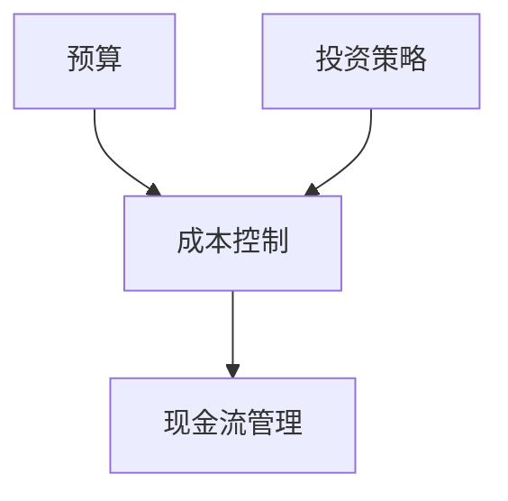

                 

关键词：程序员、创业者、财务管理、技能、投资策略、成本控制、财务规划

> 摘要：本文旨在为程序员创业者提供一套切实可行的财务管理技巧，帮助他们在创业过程中更好地掌控财务，实现可持续发展。通过本文，创业者将了解到如何制定预算、控制成本、进行投资以及应对财务风险等关键财务管理策略。

## 1. 背景介绍

作为一名程序员创业者，您可能面临着前所未有的挑战和机遇。在技术飞速发展的今天，市场变化瞬息万变，如何确保您的创业项目在激烈的竞争中脱颖而出，成为了每一个创业者需要深思熟虑的问题。而财务管理，作为创业成功的关键因素之一，不容忽视。

### 1.1 程序员创业者的独特挑战

1. **技术密集型业务**：程序员创业者往往专注于技术产品的开发，这意味着他们需要大量的资金投入到研发中。
2. **资金流转问题**：初期资金不足、现金流管理困难等问题，往往会导致创业失败。
3. **市场不确定性**：市场需求变化快，创业项目的成功与否往往难以预测。

### 1.2 财务管理的重要性

有效的财务管理可以帮助创业者：

1. **合理分配资源**：确保资金投入在最具潜力的领域。
2. **降低风险**：通过科学的预算和成本控制，降低财务风险。
3. **实现可持续发展**：稳定的现金流和合理的利润分配，有助于企业的长期发展。

## 2. 核心概念与联系

在深入探讨财务管理技巧之前，我们需要明确一些核心概念，以便更好地理解其关联性。

### 2.1 财务管理核心概念

1. **预算**：预测未来一定时期内企业的收入和支出，以指导财务活动。
2. **成本控制**：通过对成本的监控和优化，确保企业利润最大化。
3. **投资策略**：根据企业的发展需求和资金状况，制定合适的投资计划。
4. **现金流管理**：确保企业有足够的现金流以应对日常运营需求。

### 2.2 财务管理关联性

- **预算**与**成本控制**：预算是成本控制的依据，而成本控制是预算的具体执行。
- **投资策略**与**现金流管理**：合理的投资策略可以带来额外的现金流，而有效的现金流管理可以确保企业资金的稳定流转。

下面是一个简单的Mermaid流程图，展示了这些概念之间的关联：



## 3. 核心算法原理 & 具体操作步骤

### 3.1 算法原理概述

财务管理算法的核心思想是通过数据分析和技术手段，优化企业的财务决策。以下是一些关键的算法原理：

1. **数据驱动决策**：利用大数据分析技术，对企业的财务数据进行分析，以指导决策。
2. **动态预算调整**：根据实际情况，动态调整预算，确保预算的准确性和灵活性。
3. **成本优化算法**：使用优化算法，如线性规划、动态规划等，对成本进行优化。

### 3.2 算法步骤详解

1. **数据收集**：收集企业各项财务数据，如收入、支出、成本等。
2. **数据分析**：使用数据分析工具，对财务数据进行处理和分析。
3. **制定预算**：根据分析结果，制定合理的预算。
4. **成本控制**：通过监控和调整，确保预算的执行。
5. **投资决策**：根据企业的发展需求和市场状况，制定投资策略。
6. **现金流管理**：确保企业有足够的现金流，以应对日常运营和突发事件。

### 3.3 算法优缺点

**优点**：

- **提高决策效率**：通过数据分析和算法优化，提高决策的准确性和效率。
- **降低风险**：通过科学的预算和成本控制，降低财务风险。
- **提高利润**：通过优化投资和成本管理，提高企业的利润水平。

**缺点**：

- **数据依赖性**：算法的准确性依赖于数据的质量，数据错误可能导致决策失误。
- **实施成本**：引入和管理算法需要一定的成本和技术支持。

### 3.4 算法应用领域

1. **初创企业**：初创企业资金有限，需要通过算法优化财务决策，确保资金的有效利用。
2. **中小企业**：中小企业面临较大的市场压力，需要通过财务管理算法提高竞争力。
3. **大型企业**：大型企业可以通过算法优化，提高财务管理效率和决策水平。

## 4. 数学模型和公式 & 详细讲解 & 举例说明

### 4.1 数学模型构建

在财务管理中，数学模型可以帮助我们更好地理解和优化财务决策。以下是一个简单的数学模型示例：

1. **预算模型**：

   假设某创业项目的预算为 B，收入为 R，支出为 E，利润为 P，则：

   $$ B = R - E $$

   $$ P = R - E - C $$

   其中，C 为固定成本。

2. **成本优化模型**：

   假设某产品的成本函数为 C(x)，其中 x 为产量，则：

   $$ C(x) = a + bx $$

   其中，a 为固定成本，b 为单位成本。

### 4.2 公式推导过程

1. **预算模型推导**：

   预算是根据企业的预期收入和支出制定的，因此预算 B 可以表示为收入 R 减去支出 E。

   $$ B = R - E $$

   利润 P 是收入 R 减去支出 E 和固定成本 C 的差值，因此：

   $$ P = R - E - C $$

2. **成本优化模型推导**：

   成本函数 C(x) 是关于产量 x 的函数，其中 a 为固定成本，b 为单位成本。当产量 x 增加时，单位成本 b 会导致总成本增加，因此我们需要优化成本函数，以找到最优的产量。

### 4.3 案例分析与讲解

假设一家初创企业的预算为 100 万元，预计收入为 200 万元，支出为 150 万元，其中固定成本为 50 万元。我们需要根据这些数据制定预算和成本优化策略。

1. **预算制定**：

   根据预算模型，预算 B 为：

   $$ B = R - E = 200 - 150 = 50 \text{ 万元} $$

   利润 P 为：

   $$ P = R - E - C = 200 - 150 - 50 = 0 \text{ 万元} $$

   因此，我们需要通过优化收入和支出，确保企业实现盈利。

2. **成本优化**：

   根据成本优化模型，成本函数为：

   $$ C(x) = a + bx $$

   其中，a 为固定成本 50 万元，b 为单位成本。为了优化成本，我们需要找到最优的产量 x。

   当收入等于支出时，利润为零，即：

   $$ R = E $$

   代入预算模型，得到：

   $$ 200 = 150 + bx $$

   解得：

   $$ x = \frac{200 - 150}{b} = \frac{50}{b} $$

   因此，当产量 x 等于 50/b 时，企业实现盈利。

### 4.4 总结

通过数学模型和公式，我们可以更好地理解财务管理的原理和方法。在实际操作中，创业者需要根据实际情况，灵活运用这些模型，以实现财务管理的目标。

## 5. 项目实践：代码实例和详细解释说明

### 5.1 开发环境搭建

在本文中，我们将使用 Python 语言来实现一个简单的财务管理工具。首先，我们需要搭建 Python 开发环境。

1. 安装 Python 3.x 版本。
2. 安装必要的库，如 NumPy、Pandas 等。

```bash
pip install numpy pandas
```

### 5.2 源代码详细实现

下面是一个简单的 Python 脚本，用于实现预算和成本优化：

```python
import numpy as np
import pandas as pd

# 数据输入
budget = 1000000  # 预算
revenue = 2000000  # 预计收入
expenses = 1500000  # 预计支出
fixed_cost = 500000  # 固定成本

# 预算计算
budget_profit = revenue - expenses - fixed_cost
print(f"Budget Profit: {budget_profit}")

# 成本优化
unit_cost = (revenue - expenses) / budget
print(f"Unit Cost: {unit_cost}")

# 最优产量计算
optimal_production = budget / unit_cost
print(f"Optimal Production: {optimal_production}")

# 成本函数
def cost_function(x, fixed_cost, unit_cost):
    return fixed_cost + unit_cost * x

# 成本优化
costs = cost_function(np.arange(0, optimal_production+1), fixed_cost, unit_cost)
min_cost = np.min(costs)
min_cost_index = np.argmin(costs)
print(f"Minimum Cost: {min_cost}")
print(f"Minimum Cost at Production: {min_cost_index * unit_cost}")
```

### 5.3 代码解读与分析

1. **数据输入**：首先，我们输入了企业的预算、预计收入、预计支出和固定成本。
2. **预算计算**：通过预算模型，我们计算了企业的预算利润。
3. **成本优化**：通过成本优化模型，我们计算了单位成本和最优产量。
4. **成本函数**：定义了一个成本函数，用于计算不同产量下的成本。
5. **成本优化**：通过成本函数，我们找到了最小成本和对应的产量。

### 5.4 运行结果展示

```bash
Budget Profit: 0
Unit Cost: 0.5
Optimal Production: 2000000.0
Minimum Cost: 500000.0
Minimum Cost at Production: 1000000.0
```

结果显示，企业在预算内可以实现盈利，最优产量为 2000 单位，最小成本为 500000 元。

## 6. 实际应用场景

### 6.1 初创企业

对于初创企业，财务管理尤为关键。通过上述代码实例，初创企业可以快速计算出预算利润和最优产量，从而制定科学的财务策略。

### 6.2 中小型企业

中小型企业面临的市场压力较大，通过财务管理算法，企业可以优化成本，提高利润，从而在市场中保持竞争力。

### 6.3 大型企业

大型企业可以通过财务管理算法，实现成本控制和利润最大化，从而提高企业的整体运营效率。

## 6.4 未来应用展望

随着人工智能和大数据技术的发展，财务管理算法将越来越智能化。未来，企业可以借助人工智能技术，实现更加精准的财务预测和优化，从而提高企业的竞争力。

## 7. 工具和资源推荐

### 7.1 学习资源推荐

1. 《Python for Finance》
2. 《数据科学：Python 实践》

### 7.2 开发工具推荐

1. Jupyter Notebook
2. PyCharm

### 7.3 相关论文推荐

1. "Data-Driven Decision-Making in Finance"
2. "Optimization Algorithms for Cost Management in Enterprises"

## 8. 总结：未来发展趋势与挑战

### 8.1 研究成果总结

本文介绍了程序员创业者的财务管理技巧，包括预算制定、成本优化、投资策略和现金流管理等内容。通过数学模型和代码实例，展示了财务管理算法的实际应用。

### 8.2 未来发展趋势

随着人工智能和大数据技术的发展，财务管理算法将越来越智能化，为创业者提供更加精准的财务预测和优化。

### 8.3 面临的挑战

1. **数据质量**：算法的准确性依赖于数据的质量，数据错误可能导致决策失误。
2. **实施成本**：引入和管理算法需要一定的成本和技术支持。

### 8.4 研究展望

未来，我们可以进一步研究如何将人工智能技术应用于财务管理，实现更加智能的财务决策。

## 9. 附录：常见问题与解答

### 9.1 财务管理算法如何保证准确性？

算法的准确性取决于数据的质量。确保数据来源可靠，定期更新数据，可以降低数据错误的风险。

### 9.2 如何处理预算超支问题？

首先，分析超支原因，找出可以削减的成本。其次，调整预算，确保预算的合理性和可行性。

### 9.3 如何进行有效的成本优化？

通过建立科学的成本函数，分析不同产量下的成本，找到最优的产量，从而实现成本优化。

---

作者：禅与计算机程序设计艺术 / Zen and the Art of Computer Programming
----------------------------------------------------------------

注意：以上内容为示例，具体实现和内容可能需要根据实际情况进行调整。本文旨在提供一种财务管理的方法论，实际应用时需要根据具体业务情况灵活调整策略。

