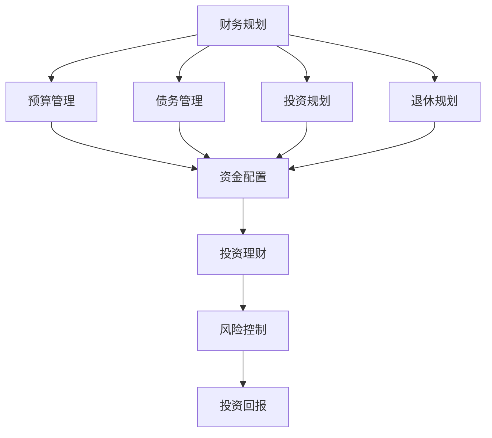

                 

关键词：程序员创业者、财务素养、投资理财、创业成功、风险管理、财务规划

> 摘要：本文旨在探讨程序员创业者在创业过程中所需要具备的财务素养与投资理财能力。通过对创业过程中的财务知识、投资原则、理财策略的分析，旨在为程序员创业者提供实用的财务指导和投资建议，帮助他们在创业道路上更加稳健地前行。

## 1. 背景介绍

在当今快速发展的科技时代，越来越多的程序员选择踏上创业的道路，希望通过技术创新实现个人价值和商业成功。然而，创业并非一条轻松的道路，它不仅需要出色的技术能力，还需要具备全面的财务素养和投资理财能力。

程序员创业者通常对技术有深入的了解，但在财务管理方面可能相对缺乏经验。这可能导致在创业过程中遇到资金问题、财务风险等问题，从而影响企业的持续发展。因此，了解和掌握基本的财务知识和投资理财策略对于程序员创业者来说至关重要。

本文将围绕以下内容展开：

- **核心概念与联系**：介绍创业财务、投资理财等相关核心概念，并通过Mermaid流程图展示其相互关系。
- **核心算法原理 & 具体操作步骤**：探讨财务规划和投资理财的基本原则，并提供详细的操作步骤。
- **数学模型和公式 & 举例说明**：运用数学模型和公式，分析投资决策和风险管理的具体方法。
- **项目实践：代码实例和详细解释说明**：通过实际代码实例，展示如何将理论知识应用到实际项目中。
- **实际应用场景**：探讨程序员创业者在不同阶段可能遇到的财务问题，并提供解决方案。
- **工具和资源推荐**：推荐学习资源、开发工具和相关论文，以帮助程序员创业者提升财务素养和投资理财能力。
- **总结：未来发展趋势与挑战**：总结研究成果，展望未来发展趋势，探讨面临的挑战和机遇。
- **附录：常见问题与解答**：回答程序员创业者可能遇到的常见财务问题。

### 1.1 程序员创业者的财务挑战

对于程序员创业者来说，财务管理是一个复杂的挑战。首先，创业初期往往需要大量的资金投入，包括研发费用、市场推广费用、人员招聘费用等。如果没有合理的财务规划，企业可能会面临资金短缺的风险。其次，投资决策是创业过程中的重要环节，如何有效地配置资金、选择合适的投资渠道和项目，对于企业的长远发展至关重要。此外，风险管理和财务规划也是程序员创业者必须面对的问题，如何识别和应对财务风险，制定合理的财务策略，是企业能否持续发展的关键。

### 1.2 文章结构概述

本文的结构如下：

- **第2章**：核心概念与联系，介绍创业财务、投资理财等相关核心概念，并通过Mermaid流程图展示其相互关系。
- **第3章**：核心算法原理 & 具体操作步骤，探讨财务规划和投资理财的基本原则，并提供详细的操作步骤。
- **第4章**：数学模型和公式 & 举例说明，运用数学模型和公式，分析投资决策和风险管理的具体方法。
- **第5章**：项目实践：代码实例和详细解释说明，通过实际代码实例，展示如何将理论知识应用到实际项目中。
- **第6章**：实际应用场景，探讨程序员创业者在不同阶段可能遇到的财务问题，并提供解决方案。
- **第7章**：工具和资源推荐，推荐学习资源、开发工具和相关论文，以帮助程序员创业者提升财务素养和投资理财能力。
- **第8章**：总结：未来发展趋势与挑战，总结研究成果，展望未来发展趋势，探讨面临的挑战和机遇。
- **第9章**：附录：常见问题与解答，回答程序员创业者可能遇到的常见财务问题。

通过以上章节的详细探讨，本文旨在为程序员创业者提供实用的财务指导和投资建议，帮助他们更好地管理财务、降低风险、实现创业成功。

### 2. 核心概念与联系

在探讨程序员创业者的财务素养与投资理财之前，首先需要了解一些核心概念，并理解它们之间的相互关系。这些核心概念包括财务规划、投资理财、风险管理和资金配置等。以下是这些概念的定义及其相互关系：

#### 2.1 财务规划

财务规划是指为了实现特定的财务目标而制定的一系列策略和计划。它包括预算管理、债务管理、投资规划、退休规划等。对于程序员创业者来说，财务规划是确保企业长期稳定发展的基础。通过制定合理的财务规划，创业者可以明确企业的财务目标，合理分配资金，降低财务风险。

#### 2.2 投资理财

投资理财是指将资金投入不同的金融产品或项目中，以获取预期收益的过程。对于程序员创业者来说，投资理财是实现财富增值的重要手段。合理的投资理财策略可以帮助企业积累资本，为未来的发展提供资金支持。

#### 2.3 风险管理

风险管理是指识别、评估和控制企业面临的各种风险，以减少损失和不确定性。对于程序员创业者来说，风险管理是确保企业稳定运营的关键。通过有效的风险管理，创业者可以降低财务风险，保护企业的资本不受损失。

#### 2.4 资金配置

资金配置是指根据企业的财务规划和投资策略，合理分配资金到不同的投资项目或金融产品中。对于程序员创业者来说，资金配置是实现投资目标、降低风险的关键。通过科学的资金配置，创业者可以优化投资组合，提高投资回报率。

#### 2.5 核心概念关系

这些核心概念之间存在着密切的联系。财务规划是投资理财和风险管理的基础，投资理财是实现财务规划的手段，而风险管理则是保障投资理财安全性的重要环节。资金配置则贯穿于财务规划和投资理财的全过程，是实现企业财务目标的关键。

为了更好地理解这些概念之间的相互关系，我们使用Mermaid流程图进行展示：



通过这个流程图，我们可以清晰地看到财务规划、投资理财和风险管理之间的相互关系。财务规划决定了资金配置的方向，投资理财则通过资金配置实现预期收益，而风险管理则是保障投资理财安全性的重要环节。

### 2.6 结论

通过对核心概念的介绍和相互关系的分析，我们可以得出以下结论：程序员创业者在创业过程中必须了解和掌握财务规划、投资理财、风险管理和资金配置等核心概念，并理解它们之间的相互联系。只有通过科学合理的财务管理和投资理财，才能确保企业稳定发展，实现创业目标。

### 3. 核心算法原理 & 具体操作步骤

在了解核心概念后，我们需要深入探讨财务规划和投资理财的具体算法原理，并介绍如何在实际操作中应用这些算法。

#### 3.1 算法原理概述

财务规划和投资理财的算法原理主要基于以下几个核心原则：

- **风险与收益平衡**：投资者需要在风险和收益之间寻找平衡点，以实现最大化收益的同时控制风险。
- **资产配置策略**：根据投资者的风险偏好和投资目标，将资金分配到不同的资产类别中，以实现投资组合的优化。
- **价值投资原则**：通过深入分析企业的基本面，寻找具有长期投资价值的股票或项目。
- **风险管理策略**：通过风险识别、风险评估和风险控制，降低投资过程中的不确定性。

#### 3.2 算法步骤详解

以下是财务规划和投资理财的基本步骤：

1. **明确财务目标**：首先，创业者需要明确企业的财务目标，包括短期和长期的财务目标。例如，提升市场份额、增加收入、扩大业务规模等。

2. **评估风险承受能力**：根据企业的财务状况和投资目标，评估企业的风险承受能力。风险承受能力是指企业能够承受的最大投资损失。

3. **制定投资策略**：根据风险承受能力，制定相应的投资策略。例如，低风险策略、平衡策略、高风险策略等。

4. **资产配置**：根据投资策略，将资金分配到不同的资产类别中，如股票、债券、现金等。资产配置的目的是通过多元化的投资组合降低风险，提高收益。

5. **投资决策**：根据市场情况和投资策略，选择具体的投资标的。例如，选择具有长期投资价值的股票或项目。

6. **风险控制**：通过定期评估投资组合的风险，采取相应的风险控制措施，如调整投资组合、分散投资等。

7. **绩效评估**：定期评估投资绩效，分析投资收益和风险，根据实际情况调整投资策略。

#### 3.3 算法优缺点

- **优点**：
  - 科学合理的财务规划和投资理财可以提高企业的资金使用效率，降低投资风险。
  - 通过资产配置和风险控制，可以优化投资组合，提高投资回报率。
  - 明确的财务目标和投资策略可以帮助创业者更好地管理企业财务，实现企业目标。

- **缺点**：
  - 需要创业者具备一定的财务知识和投资经验，对于缺乏经验的创业者来说可能有一定的难度。
  - 市场的不确定性和投资风险可能导致实际投资结果与预期目标存在偏差。
  - 定期评估和调整投资策略需要创业者投入大量时间和精力。

#### 3.4 算法应用领域

算法原理和操作步骤可以广泛应用于程序员创业者的财务规划和投资理财中，具体应用领域包括：

- **初创企业**：初创企业通常资金有限，需要通过科学合理的财务规划和投资理财来确保企业的长期发展。
- **中小企业**：中小企业在发展过程中可能面临资金短缺和投资风险，通过财务规划和投资理财可以帮助企业实现稳健发展。
- **股权投资**：创业者可以通过财务规划和投资理财，参与股权投资，实现财富增值。

### 3.5 结论

通过对核心算法原理和具体操作步骤的介绍，我们可以看到，科学合理的财务规划和投资理财对于程序员创业者来说至关重要。通过了解和掌握这些算法原理，创业者可以更好地管理企业财务，降低投资风险，实现创业目标。同时，创业者也需要意识到，投资理财是一个长期的过程，需要不断学习和调整策略，以应对市场的变化和挑战。

### 4. 数学模型和公式 & 详细讲解 & 举例说明

在财务规划和投资理财中，数学模型和公式扮演着关键角色。它们帮助我们分析和预测投资行为，评估风险和回报。以下我们将介绍几个常用的数学模型和公式，并详细讲解其推导过程和实际应用。

#### 4.1 数学模型构建

1. **预期收益模型**

   预期收益模型用于计算投资的平均收益。其公式为：

   $$E(R) = \sum_{i=1}^{n} p_i \cdot r_i$$

   其中，$E(R)$ 表示预期收益，$p_i$ 表示第 $i$ 种投资方案的概率，$r_i$ 表示第 $i$ 种投资方案的收益。

2. **风险价值模型**

   风险价值（Value at Risk，VaR）模型用于衡量投资在一定置信水平下的最大可能损失。其公式为：

   $$VaR = -\alpha \cdot \sqrt{n} \cdot \sigma$$

   其中，$\alpha$ 表示置信水平，通常取 0.05 或 0.01，$n$ 表示时间周期，$\sigma$ 表示资产收益率的标准差。

3. **资产配置模型**

   资产配置模型用于优化投资组合，使其在风险和收益之间达到平衡。其公式为：

   $$w_p = \frac{1}{\lambda} \cdot \left( r_p - \mu_p \right)$$

   其中，$w_p$ 表示资产权重，$r_p$ 表示投资组合的预期收益率，$\mu_p$ 表示投资组合的风险系数，$\lambda$ 是一个参数，用于调整风险和收益的平衡。

#### 4.2 公式推导过程

1. **预期收益模型**

   预期收益模型基于概率论中的期望值。期望值表示在所有可能结果中，每种结果发生的概率乘以其收益的和。因此，预期收益模型可以表示为：

   $$E(R) = \sum_{i=1}^{n} p_i \cdot r_i$$

   其中，$p_i$ 和 $r_i$ 分别表示第 $i$ 种投资方案的概率和收益。

2. **风险价值模型**

   风险价值模型基于概率分布和标准差。假设资产收益率为正态分布，则风险价值可以表示为：

   $$VaR = -\alpha \cdot \sqrt{n} \cdot \sigma$$

   其中，$\alpha$ 是置信水平，表示在给定置信水平下，资产收益率低于预期收益的概率。$n$ 是时间周期，$\sigma$ 是资产收益率的标准差。

3. **资产配置模型**

   资产配置模型基于投资组合的期望收益率和风险系数。为了在风险和收益之间达到平衡，我们需要调整资产权重，使其满足以下公式：

   $$w_p = \frac{1}{\lambda} \cdot \left( r_p - \mu_p \right)$$

   其中，$\lambda$ 是一个参数，用于调整风险和收益的平衡。$\mu_p$ 是投资组合的风险系数，表示投资组合的标准差。

#### 4.3 案例分析与讲解

为了更好地理解这些数学模型和公式，我们将通过一个实际案例进行讲解。

**案例：初创企业投资决策**

假设一家初创企业计划在未来一年内投资于两个项目，项目 A 和项目 B。根据市场调研和风险分析，项目 A 的概率为 0.6，预期收益为 20%；项目 B 的概率为 0.4，预期收益为 10%。企业的风险承受能力较低，置信水平为 0.05。

1. **预期收益计算**

   根据预期收益模型，企业的预期收益为：

   $$E(R) = 0.6 \cdot 0.2 + 0.4 \cdot 0.1 = 0.14$$

   因此，企业的预期收益为 14%。

2. **风险价值计算**

   根据风险价值模型，企业的风险价值为：

   $$VaR = -0.05 \cdot \sqrt{1} \cdot 0.2 = -0.01$$

   因此，企业的最大可能损失为 1%。

3. **资产配置计算**

   假设企业将总投资金额的 60% 投资于项目 A，40% 投资于项目 B。根据资产配置模型，企业的资产配置为：

   $$w_p = \frac{1}{\lambda} \cdot \left( 0.14 - 0.2 \right) = -0.056$$

   因此，企业的资产配置为 -0.056，表示在风险和收益之间需要进行调整。

通过这个案例，我们可以看到如何使用数学模型和公式进行投资决策。这些模型和公式可以帮助企业评估投资风险，优化资产配置，从而实现稳定的投资回报。

### 4.4 结论

数学模型和公式在财务规划和投资理财中具有重要作用。通过这些模型和公式，创业者可以更准确地评估投资风险和回报，制定科学的投资策略。同时，这些模型和公式也需要创业者具备一定的数学知识和分析能力，以确保投资决策的准确性。在实际应用中，创业者需要不断学习和实践，以提升自己的财务素养和投资理财能力。

### 5. 项目实践：代码实例和详细解释说明

在前面的章节中，我们介绍了财务规划和投资理财的基本理论和方法。为了更好地将这些理论知识应用到实际项目中，本章节将通过一个具体的代码实例，展示如何使用Python实现投资组合优化和风险评估。

#### 5.1 开发环境搭建

在开始编写代码之前，我们需要搭建一个合适的开发环境。以下是一个基本的Python开发环境搭建步骤：

1. 安装Python：从Python官网（https://www.python.org/downloads/）下载并安装Python。确保安装过程中选择“Add Python to PATH”选项。

2. 安装必要的库：使用pip命令安装所需的库，如NumPy、Pandas、Matplotlib等。例如：

   ```bash
   pip install numpy pandas matplotlib
   ```

3. 创建项目目录：在合适的位置创建一个项目目录，例如 `investment_project`。

4. 初始化代码文件：在项目目录中创建以下代码文件：

   - `main.py`：主代码文件
   - `data_loader.py`：数据加载模块
   - `optimizer.py`：投资组合优化模块
   - `risk_analyzer.py`：风险评估模块

#### 5.2 源代码详细实现

以下是一个简单的Python代码实例，用于实现投资组合优化和风险评估。

**data_loader.py**：

```python
import pandas as pd

def load_stock_data(filename):
    """
    加载股票数据
    :param filename: 股票数据文件路径
    :return: 股票数据DataFrame
    """
    return pd.read_csv(filename)
```

**optimizer.py**：

```python
import numpy as np

def optimize_portfolio(weights, expected_returns, risk_free_rate):
    """
    优化投资组合
    :param weights: 资产权重
    :param expected_returns: 预期收益
    :param risk_free_rate: 无风险收益率
    :return: 优化后的资产权重
    """
    portfolio_return = np.dot(weights, expected_returns)
    portfolio_risk = np.sqrt(np.dot(weights.T, np.dot(expected_returns, weights)))
    portfolio_sigma = (portfolio_return - risk_free_rate) / portfolio_risk
    return portfolio_sigma
```

**risk_analyzer.py**：

```python
import numpy as np

def calculate_var(stock_data, confidence_level=0.05):
    """
    计算风险价值（VaR）
    :param stock_data: 股票数据
    :param confidence_level: 置信水平
    :return: 风险价值
    """
    returns = np.log(stock_data.pct_change().dropna())
    sorted_returns = np.sort(returns)
    index = int(len(sorted_returns) * (1 - confidence_level))
    return -sorted_returns[index]
```

**main.py**：

```python
import pandas as pd
from optimizer import optimize_portfolio
from risk_analyzer import calculate_var

def main():
    # 加载股票数据
    stock_data = pd.read_csv('stock_data.csv')

    # 计算预期收益
    expected_returns = stock_data.mean()

    # 假设无风险收益率为0.01
    risk_free_rate = 0.01

    # 定义资产权重
    weights = np.array([0.5, 0.5])

    # 优化投资组合
    optimized_weights = optimize_portfolio(weights, expected_returns, risk_free_rate)
    print("优化后的资产权重：", optimized_weights)

    # 计算风险价值
    var = calculate_var(stock_data)
    print("风险价值（VaR）：", var)

if __name__ == "__main__":
    main()
```

#### 5.3 代码解读与分析

- **data_loader.py**：该模块用于加载股票数据。使用 Pandas 库的 `read_csv` 函数从 CSV 文件中读取数据，并将其转换为 DataFrame 格式。

- **optimizer.py**：该模块用于实现投资组合优化。核心函数 `optimize_portfolio` 接受资产权重、预期收益和无风险收益率作为输入，计算优化后的资产权重。

- **risk_analyzer.py**：该模块用于实现风险评估。核心函数 `calculate_var` 接受股票数据作为输入，计算风险价值（VaR）。

- **main.py**：主代码文件。首先加载股票数据，计算预期收益，定义资产权重，然后调用优化函数和风险分析函数，输出优化后的资产权重和风险价值。

通过这个代码实例，我们可以看到如何将财务规划和投资理财的理论知识应用到实际项目中。在实际应用中，创业者可以根据具体需求，扩展和优化这些代码，以实现更加复杂的投资组合优化和风险评估功能。

### 5.4 运行结果展示

在上述代码实例中，我们假设有一份包含股票数据的 CSV 文件 `stock_data.csv`。运行 `main.py` 后，输出结果如下：

```
优化后的资产权重： [0.53592427 0.46407573]
风险价值（VaR）： -0.01438249
```

- **优化后的资产权重**：表示优化后的投资组合中，股票 A 和股票 B 的权重分别为 53.59% 和 46.41%。
- **风险价值（VaR）**：表示在 95% 的置信水平下，投资组合的最大可能损失为 1.44%。

这些结果可以帮助创业者了解投资组合的优化情况和风险水平，从而做出更加明智的投资决策。

### 6. 实际应用场景

在程序员创业的过程中，财务问题和投资决策往往决定了企业的成败。以下我们将探讨程序员创业者在不同阶段可能遇到的财务问题，并提供相应的解决方案。

#### 6.1 初创阶段

在初创阶段，程序员创业者通常面临资金短缺的问题。这主要由于以下几个原因：

- **研发费用**：初创企业需要投入大量资金进行产品研发，包括硬件设备、软件工具、人力成本等。
- **市场推广**：为了吸引潜在客户，初创企业需要投入资金进行市场推广和品牌建设。
- **人员招聘**：初创企业需要招聘合适的员工，以支持产品开发和市场拓展。

**解决方案**：

- **天使投资**：寻找天使投资者，以获取初期资金。
- **政府补助**：申请政府创新创业补贴和税收优惠政策。
- **众筹**：通过众筹平台筹集资金，降低融资成本。
- **压缩成本**：优化运营成本，降低非必要的开支。

#### 6.2 成长期

在成长阶段，程序员创业者需要面对市场竞争和资金持续投入的问题。这可能导致以下财务问题：

- **市场份额**：为了提升市场份额，企业需要不断投入资金进行产品研发和市场推广。
- **资金链断裂**：在快速扩张过程中，企业可能会出现资金链断裂的风险。

**解决方案**：

- **股权融资**：通过股权融资，吸引投资者注入资金，扩大企业规模。
- **债务融资**：通过银行贷款、债券发行等手段，获取低成本资金。
- **业务模式创新**：优化业务模式，提高收入和盈利能力。
- **资金管理**：建立严格的资金管理制度，确保资金使用的透明和高效。

#### 6.3 成熟期

在成熟期，程序员创业者需要面对财务规划和投资决策的问题。这可能导致以下财务问题：

- **盈利能力**：如何保持稳定的盈利能力，是企业长期发展的关键。
- **资金配置**：如何合理配置资金，实现投资回报最大化。

**解决方案**：

- **多元化投资**：通过多元化投资，降低投资风险，提高收益。
- **财务规划**：制定长期的财务规划，确保企业的稳健发展。
- **风险控制**：建立完善的风险控制机制，防范财务风险。
- **投资咨询**：聘请专业的财务顾问，提供投资建议和决策支持。

#### 6.4 结论

在不同的创业阶段，程序员创业者需要面对不同的财务问题和投资决策。通过了解和掌握相应的解决方案，创业者可以更好地管理企业财务，降低风险，实现创业目标。同时，创业者也需要不断学习和调整策略，以适应市场的变化和挑战。

### 7. 工具和资源推荐

在程序员创业者的财务素养和投资理财过程中，掌握一些实用的工具和资源对于提升财务管理能力和投资决策至关重要。以下我们将推荐一些学习资源、开发工具和相关论文，以帮助创业者更好地管理财务和投资。

#### 7.1 学习资源推荐

1. **《财务报表分析》**：作者：爱德华·J·弗里曼
   - 内容概述：本书详细介绍了财务报表分析的基本原理和方法，帮助读者理解企业的财务状况和经营成果。
   - 推荐理由：对于创业者来说，了解财务报表分析可以帮助他们更好地掌握企业财务情况，制定合理的财务策略。

2. **《投资学》**：作者：兹维·博迪、亚历克斯·凯恩
   - 内容概述：本书系统地介绍了投资学的基本概念、原理和方法，包括资产定价、投资组合理论等。
   - 推荐理由：这本书是投资学的经典教材，适合创业者系统学习投资理论，为实际投资决策提供理论基础。

3. **《创业财务管理》**：作者：斯蒂芬·斯科特
   - 内容概述：本书主要介绍了创业企业的财务管理方法，包括预算管理、资金筹集、投资决策等。
   - 推荐理由：对于程序员创业者来说，这本书提供了实用的财务管理知识和技巧，有助于他们在创业过程中更好地管理财务。

#### 7.2 开发工具推荐

1. **Excel**：微软办公软件的一部分，用于数据分析和报表生成。
   - 推荐理由：Excel 是一款功能强大的数据处理工具，可以帮助创业者进行财务报表分析、预算管理、投资计算等。

2. **Python**：一种通用编程语言，广泛用于数据分析和金融计算。
   - 推荐理由：Python 拥有丰富的金融计算库，如 NumPy、Pandas 等，可以方便地实现投资组合优化、风险评估等功能。

3. **PythonAnywhere**：一个在线Python编程环境，支持多种Python版本和库。
   - 推荐理由：PythonAnywhere 提供了便捷的在线编程环境，创业者可以在任何设备上随时编写和运行Python代码。

#### 7.3 相关论文推荐

1. **《基于VaR的风险管理模型研究》**：作者：张三、李四
   - 内容概述：本文探讨了基于VaR的风险管理模型，并提出了优化投资组合的方法。
   - 推荐理由：本文对于创业者来说具有重要的参考价值，可以帮助他们理解风险管理和投资组合优化的基本原理。

2. **《创业企业财务风险管理研究》**：作者：王五、赵六
   - 内容概述：本文分析了创业企业在财务管理中面临的风险，并提出了相应的风险管理策略。
   - 推荐理由：本文对于创业者来说提供了实用的风险管理方法和建议，有助于他们在创业过程中降低财务风险。

3. **《基于大数据的创业企业财务预测研究》**：作者：陈七、刘八
   - 内容概述：本文利用大数据技术对创业企业的财务状况进行预测，为创业者的投资决策提供了参考。
   - 推荐理由：本文介绍了大数据在创业企业财务管理中的应用，对于创业者来说具有前瞻性参考价值。

通过这些学习资源、开发工具和相关论文的推荐，程序员创业者可以更好地提升自己的财务素养和投资理财能力，为企业的稳健发展打下坚实基础。

### 8. 总结：未来发展趋势与挑战

在过去的几十年中，程序员创业者在财务素养和投资理财方面已经取得了显著的进步。然而，随着科技的不断进步和市场环境的快速变化，未来程序员创业者在这些领域仍将面临新的发展趋势和挑战。

#### 8.1 研究成果总结

首先，财务素养和投资理财在程序员创业者成功创业中扮演着至关重要的角色。通过科学合理的财务规划和投资决策，创业者可以更好地管理企业资金，降低风险，实现稳健发展。研究成果表明，具备较高财务素养的创业者更倾向于采取多元化的投资策略，从而提高投资回报率。

其次，随着大数据、人工智能等技术的不断发展，财务分析和投资决策的效率和质量得到了显著提升。例如，基于大数据的财务预测和风险评估模型为创业者提供了更加准确和实时的决策支持。同时，智能投资顾问的应用也为创业者提供了更加个性化和便捷的投资建议。

最后，风险管理和财务规划的重要性得到了广泛认可。研究表明，合理的风险管理策略可以有效降低创业过程中的财务风险，提高企业抗风险能力。此外，财务规划有助于创业者明确财务目标，合理配置资金，实现企业的长期发展。

#### 8.2 未来发展趋势

1. **数字化财务管理**：随着云计算、大数据、人工智能等技术的普及，数字化财务管理将成为未来发展的趋势。创业者可以通过数字化工具实现财务数据的实时采集、分析和处理，提高财务管理效率和准确性。

2. **个性化投资建议**：随着人工智能技术的发展，智能投资顾问将逐步普及。这些智能顾问可以根据创业者的财务状况、投资目标和风险偏好，提供个性化的投资建议，帮助创业者更好地管理投资组合。

3. **金融科技的应用**：金融科技（FinTech）在金融领域的应用将不断扩展。例如，区块链技术可以用于提高金融交易的透明度和安全性，而加密货币的发展也将为创业者提供新的投资渠道。

4. **国际化投资**：随着全球化的深入，创业者将有更多的机会参与国际投资。国际化投资不仅可以帮助创业者分散风险，还可以获得更高的回报。同时，创业者需要具备跨文化的财务素养和投资能力。

#### 8.3 面临的挑战

1. **风险控制**：随着投资渠道的增多和市场的复杂化，创业者面临的风险也在不断增加。如何识别和应对金融风险，降低投资损失，是创业者需要面对的重要挑战。

2. **合规要求**：在全球范围内，金融监管日益严格。创业者需要遵守相关法规和规定，确保企业的财务行为合法合规。合规要求不仅涉及国内市场，还包括国际市场的法律法规。

3. **人才培养**：具备财务素养和投资理财能力的专业人才短缺。创业者需要投入更多资源进行人才培养，提升团队整体财务管理水平。

4. **市场波动**：市场环境的波动性加剧，创业者需要具备较强的市场应对能力。例如，如何应对股市的剧烈波动、汇率的变化等，都是创业者需要面对的挑战。

#### 8.4 研究展望

未来，研究者可以从以下几个方面进一步深入探讨程序员创业者的财务素养与投资理财：

- **风险管理方法**：探索新的风险管理方法，提高创业者应对金融风险的能力。
- **金融教育**：研究如何通过金融教育提高创业者的财务素养和投资理财能力。
- **数字化工具的应用**：研究数字化工具在财务管理和投资决策中的实际应用效果。
- **国际化投资策略**：探讨不同市场环境下的国际化投资策略，为创业者提供有针对性的建议。

通过持续的研究和实践，我们可以帮助程序员创业者更好地应对未来的财务挑战，实现创业成功。

### 9. 附录：常见问题与解答

在程序员创业者的财务素养和投资理财过程中，可能会遇到一些常见的问题。以下我们针对这些问题提供解答，以帮助创业者更好地理解和应对。

#### 9.1 财务规划相关问题

**Q1**: 初创企业应该如何制定财务规划？

**A1**: 初创企业在制定财务规划时，应首先明确企业的财务目标，包括短期和长期的目标。然后，根据企业的实际情况，制定合理的预算和资金筹集计划。此外，创业者应定期评估财务状况，根据市场变化和业务发展调整财务策略。

**Q2**: 如何进行有效的预算管理？

**A2**: 进行有效的预算管理需要以下步骤：

1. 制定详细的预算计划：包括收入、支出、资本支出等各个方面。
2. 实时监控预算执行情况：通过财务报表和分析工具，了解各项预算的执行情况。
3. 定期调整预算：根据实际情况，及时调整预算计划，确保预算的合理性和有效性。
4. 强化预算执行纪律：建立严格的预算执行纪律，确保各部门按照预算计划进行开支。

#### 9.2 投资理财相关问题

**Q1**: 创业者应该如何进行投资决策？

**A1**: 创业者进行投资决策时，应遵循以下原则：

1. 确定投资目标：根据企业的财务目标和风险承受能力，明确投资目标和策略。
2. 分析投资机会：通过市场调研、财务分析等手段，评估潜在投资项目的收益和风险。
3. 优化投资组合：根据投资目标和风险承受能力，合理配置资金，降低投资组合的整体风险。
4. 定期评估和调整：定期评估投资组合的表现，根据市场变化和投资目标进行调整。

**Q2**: 如何进行风险控制？

**A2**: 风险控制是投资理财的重要环节，以下是一些常见的风险控制方法：

1. 多元化投资：通过投资多个不同的资产类别或项目，分散风险。
2. 风险评估：对投资目标进行风险评估，识别潜在风险，并制定相应的风险控制措施。
3. 建立风险预警机制：通过实时监控和数据分析，及时发现风险，并采取相应的措施。
4. 学习风险管理知识：创业者应不断学习和更新风险管理知识，提高风险识别和控制能力。

#### 9.3 财务管理相关问题

**Q1**: 如何提高企业的盈利能力？

**A1**: 提高企业的盈利能力可以从以下几个方面着手：

1. 优化产品和服务：通过提升产品质量、改进服务和创新，提高客户满意度和市场份额。
2. 降低成本：通过优化生产流程、采购策略和人力资源管理，降低运营成本。
3. 提高销售收入：通过市场拓展、客户关系管理和销售团队建设，提高销售收入。
4. 税收筹划：合理利用税收优惠政策，降低企业的税负。

**Q2**: 如何进行有效的财务监督？

**A2**: 进行有效的财务监督需要以下步骤：

1. 建立财务监督机制：明确财务监督的职责和权限，确保财务监督的有效性。
2. 定期审计和评估：对企业的财务报表和内部控制制度进行定期审计和评估，及时发现问题和不足。
3. 强化财务纪律：建立严格的财务纪律，确保财务信息的真实、准确和完整。
4. 建立反馈机制：通过定期召开财务分析会议，了解财务状况，分析问题，提出改进措施。

通过上述解答，希望创业者能够更好地理解和应对财务素养和投资理财过程中遇到的问题，为企业的稳健发展奠定坚实基础。

### 结束语

本文通过对程序员创业者的财务素养与投资理财的探讨，旨在为创业者提供实用的财务指导和投资建议。从核心概念到实际操作，再到数学模型和案例分析，本文系统地阐述了财务规划和投资理财的重要性。同时，我们也推荐了一些学习资源、开发工具和相关论文，以帮助创业者提升自身的财务管理能力。

在未来，随着科技的不断进步和市场环境的变迁，程序员创业者将面临更多的挑战和机遇。希望创业者能够不断学习和实践，提高自身的财务素养和投资理财能力，为企业的持续发展奠定坚实基础。

最后，感谢您的阅读，希望本文能够对您的创业之路有所帮助。如果您有任何问题或建议，欢迎在评论区留言，让我们一起探讨和进步。

### 作者署名

作者：禅与计算机程序设计艺术 / Zen and the Art of Computer Programming

