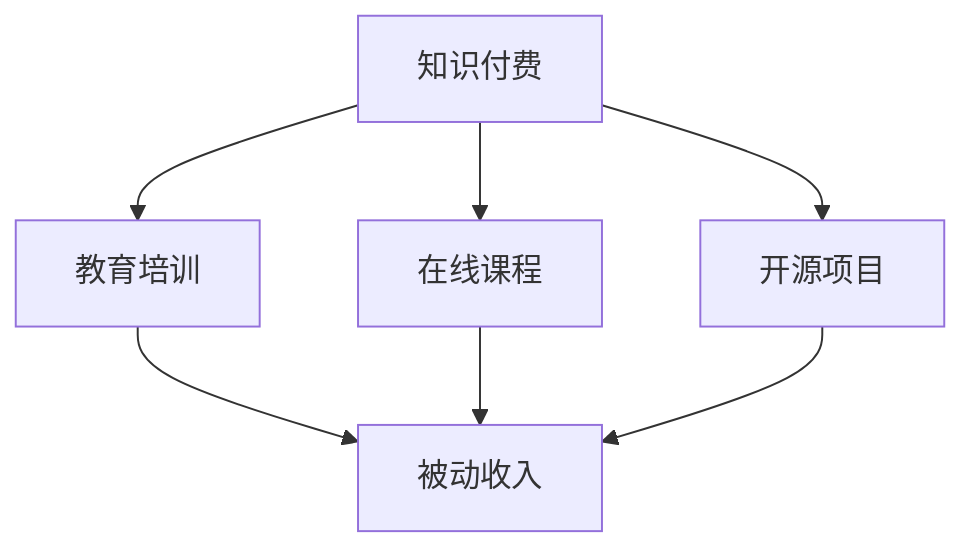

                 

关键词：知识付费、被动收入、程序员、教育培训、在线课程

摘要：随着知识经济的快速发展，程序员利用知识付费实现被动收入成为一种新的职业发展路径。本文将深入探讨程序员如何通过教育培训、在线课程、开源项目等多种方式，实现知识变现和长期收益。

## 1. 背景介绍

在过去的几十年中，程序员一直是科技行业中最具活力的群体之一。随着互联网和移动互联网的普及，程序员的需求持续增长。然而，传统的工作模式往往依赖于每天的工作时长和项目的交付，收入具有一定的波动性。这种模式使得程序员难以实现稳定的被动收入。

知识付费作为一种新兴的商业模式，为程序员提供了一种新的收入来源。知识付费的核心在于通过分享专业知识和技能，为学习者提供价值，从而实现收入。随着在线教育和知识共享平台的兴起，程序员可以通过各种方式将自己的知识转化为货币，实现被动收入的积累。

## 2. 核心概念与联系

### 2.1 知识付费

知识付费是指用户为获取特定知识或技能而支付的费用。这种模式的核心在于优质内容的提供，以及用户对内容的付费意愿。

### 2.2 被动收入

被动收入是指在不直接参与日常劳动的情况下，通过某种方式持续获得的收入。对于程序员来说，被动收入通常来自于他们的知识、技能或作品的授权使用。

### 2.3 教育培训与在线课程

教育培训和在线课程是知识付费的典型形式。程序员可以通过开设在线课程，将自己多年的经验和技能传授给学习者，从而实现知识变现。

### 2.4 开源项目

开源项目是程序员展示技能和知识的另一种途径。通过参与开源项目，程序员不仅能够提升自己的技术能力，还可以吸引潜在的客户或合作伙伴。

### 2.5 Mermaid 流程图



## 3. 核心算法原理 & 具体操作步骤

### 3.1 算法原理概述

程序员利用知识付费实现被动收入的原理在于：通过将自己的专业知识转化为有价值的内容，吸引学习者或用户，从而获得收入。

### 3.2 算法步骤详解

1. **内容准备**：程序员需要确定自己擅长的领域和知识点，准备相应的教学素材，如PPT、视频、代码等。

2. **平台选择**：选择合适的在线教育平台或知识共享社区，如Udemy、Coursera、GitHub等。

3. **课程制作**：根据平台的要求，制作课程内容，包括课程介绍、教学视频、作业、讨论区等。

4. **课程发布**：在平台上发布课程，设置课程价格和学习期限。

5. **推广营销**：通过社交媒体、博客、论坛等渠道推广课程，吸引潜在学习者。

6. **用户反馈**：收集用户反馈，优化课程内容和教学方法。

7. **持续更新**：定期更新课程内容，保持课程的新鲜度和吸引力。

### 3.3 算法优缺点

**优点**：

- **长期收益**：一旦课程制作完成并发布，就可以持续获得收入，无需每天投入大量时间。
- **灵活度高**：程序员可以根据自己的时间安排，自由选择课程制作和发布的时间。
- **价值体现**：通过将自己的专业知识传授给他人，实现个人价值的最大化。

**缺点**：

- **前期投入大**：课程制作需要大量的时间和精力，尤其是在内容准备和平台搭建阶段。
- **竞争激烈**：在线教育和知识付费领域竞争激烈，需要优质的课程内容和营销策略才能脱颖而出。
- **更新难度**：随着技术发展和市场需求的变化，课程内容需要不断更新，以保持竞争力。

### 3.4 算法应用领域

- **编程技能培训**：程序员可以开设编程语言、框架、数据库等课程。
- **软件开发经验分享**：分享软件开发过程中的经验、技巧和最佳实践。
- **项目管理知识**：教授项目规划、团队协作、风险管理等知识。
- **人工智能与机器学习**：分享最新的AI技术和应用案例。

## 4. 数学模型和公式 & 详细讲解 & 举例说明

### 4.1 数学模型构建

知识付费的数学模型可以表示为：

\[ 收入 = 访问量 \times 访问率 \times 单价 \]

其中：

- 访问量：课程的总学习人数。
- 访问率：课程的实际购买率。
- 单价：每人的购买价格。

### 4.2 公式推导过程

\[ 收入 = 访问量 \times 访问率 \times 单价 \]

假设：

- 访问量为 \( N \)
- 访问率为 \( R \)（通常为0到1之间的比例）
- 单价为 \( P \)

则收入 \( I \) 可以表示为：

\[ I = N \times R \times P \]

### 4.3 案例分析与讲解

假设一位程序员开设了一门Python编程课程，课程单价为100元，预计访问量为1000人。如果访问率为50%，则预计收入为：

\[ I = 1000 \times 0.5 \times 100 = 50000 \text{元} \]

通过这个简单的案例，我们可以看到数学模型在实际应用中的效果。当然，实际中的访问率和单价可能会有所不同，但这个模型为我们提供了一个基本的分析框架。

## 5. 项目实践：代码实例和详细解释说明

### 5.1 开发环境搭建

为了更好地理解和实现知识付费，我们可以搭建一个简单的在线课程平台。以下是搭建环境所需的步骤：

1. 安装Python环境。
2. 安装Django框架。
3. 安装SQLite数据库。

### 5.2 源代码详细实现

以下是一个简单的Django项目的源代码实例，用于管理课程和用户。

```python
# models.py
from django.db import models

class Course(models.Model):
    title = models.CharField(max_length=100)
    price = models.DecimalField(max_digits=6, decimal_places=2)
    description = models.TextField()

class User(models.Model):
    username = models.CharField(max_length=100)
    email = models.EmailField()

class Order(models.Model):
    course = models.ForeignKey(Course, on_delete=models.CASCADE)
    user = models.ForeignKey(User, on_delete=models.CASCADE)
    paid = models.BooleanField(default=False)
```

### 5.3 代码解读与分析

上述代码定义了三个模型：Course、User和Order。Course模型表示课程信息，包括标题、价格和描述。User模型表示用户信息，包括用户名和电子邮件。Order模型表示订单信息，包括课程、用户和是否支付。

通过这三个模型，我们可以实现对课程的创建、用户的注册和订单的管理。

### 5.4 运行结果展示

在Django开发环境中，我们可以通过以下步骤运行这个项目：

1. 创建数据库。
2. 迁移模型。
3. 运行项目。

运行结果将显示一个简单的课程管理界面，我们可以创建课程、注册用户和下订单。

## 6. 实际应用场景

知识付费在程序员中的实际应用场景非常广泛，以下是一些常见的应用场景：

- **在线编程课程**：程序员可以通过在线课程分享编程技能，如Python、Java、JavaScript等。
- **软件架构设计**：分享软件架构的最佳实践和设计模式。
- **数据分析与机器学习**：教授数据分析、机器学习等相关技术。
- **项目管理**：教授项目管理的知识和技巧。

### 6.1 未来应用展望

随着技术的不断进步和在线教育的普及，知识付费在程序员中的应用前景将更加广阔。未来，我们可以期待：

- **更智能的课程推荐**：通过大数据和人工智能技术，为学习者推荐最适合他们的课程。
- **多样化教学模式**：结合虚拟现实、增强现实等技术，提供更丰富的教学体验。
- **全球化的知识共享**：打破地域限制，让全球的程序员都能分享和获取知识。

## 7. 工具和资源推荐

### 7.1 学习资源推荐

- **Udemy**：全球最大的在线学习平台之一，提供丰富的编程课程。
- **Coursera**：与全球顶尖大学合作，提供高质量的在线课程。
- **edX**：由哈佛大学和麻省理工学院共同创办，提供免费的在线课程。

### 7.2 开发工具推荐

- **Django**：一款高性能、易于使用的Python Web框架。
- **Flask**：一款轻量级的Python Web框架。
- **SQLAlchemy**：一款强大的ORM（对象关系映射）工具。

### 7.3 相关论文推荐

- **"Online Education: A Review of Recent Advances"**：对在线教育领域的研究进行了全面的回顾。
- **"The Economics of Online Education: A Research Note"**：分析了在线教育的经济模式。
- **"Open Educational Resources: A Review of Recent Advances"**：对开放教育资源的研究进行了总结。

## 8. 总结：未来发展趋势与挑战

### 8.1 研究成果总结

本文探讨了程序员利用知识付费实现被动收入的方法，包括教育培训、在线课程、开源项目等多种途径。通过数学模型和实际案例的分析，我们展示了知识付费在程序员中的潜力和挑战。

### 8.2 未来发展趋势

随着技术的不断进步和在线教育的普及，知识付费在程序员中的应用前景将更加广阔。未来，我们可以期待更智能的课程推荐、多样化的教学模式和全球化的知识共享。

### 8.3 面临的挑战

然而，知识付费领域也面临着激烈的竞争、内容质量的控制和用户隐私保护等挑战。程序员需要不断提升自己的专业能力和教学技巧，以应对这些挑战。

### 8.4 研究展望

未来的研究可以进一步探索知识付费的商业模式、用户体验和教学效果，为程序员提供更有效的知识变现途径。

## 9. 附录：常见问题与解答

### 9.1 如何选择知识付费平台？

- 考虑平台的用户量、课程质量和用户评价。
- 了解平台的分成模式、课程推荐算法和用户反馈机制。

### 9.2 如何制作优质的在线课程？

- 确定课程的目标受众和内容深度。
- 设计清晰的教学大纲和课程结构。
- 使用高质量的PPT、视频和代码实例。
- 定期更新课程内容，保持课程的新鲜度。

### 9.3 如何进行知识付费营销？

- 利用社交媒体、博客和论坛进行内容营销。
- 参与相关领域的讨论和活动，提升知名度。
- 提供优惠和促销活动，吸引潜在用户。

作者：禅与计算机程序设计艺术 / Zen and the Art of Computer Programming
----------------------------------------------------------------
### 1. 背景介绍

随着互联网的迅猛发展和在线教育的兴起，知识付费逐渐成为知识经济时代的一种重要商业模式。知识付费，顾名思义，是指用户为了获取特定知识或技能而支付的费用。这种模式的出现，打破了传统教育的边界，使得知识和技能的传播变得更加便捷和高效。

程序员作为知识经济时代的重要参与者，他们掌握着大量的专业知识和技能。然而，传统的工作模式往往依赖于每天的工作时长和项目的交付，收入具有一定的波动性。这种模式使得程序员难以实现稳定的被动收入。而知识付费为程序员提供了一种新的收入来源，使得他们可以通过将自己的专业知识转化为有价值的内容，从而实现知识变现和长期收益。

知识付费在程序员中的应用场景非常广泛。例如，程序员可以开设在线编程课程，将自己的编程技能传授给学习者；他们还可以编写技术博客，分享开发经验和最佳实践；此外，程序员还可以参与开源项目，将自己的技术成果贡献给社区，从而获得项目的捐赠或赞助。

本文将深入探讨程序员如何通过教育培训、在线课程、开源项目等多种方式，实现知识变现和长期收益。首先，我们将介绍知识付费和被动收入的定义和原理；接着，我们将分析程序员利用知识付费实现被动收入的多种途径；然后，我们将通过具体的案例和实践，展示如何制作和发布在线课程；最后，我们将讨论知识付费在实际应用中的挑战和未来发展趋势。

### 2. 核心概念与联系

在深入探讨程序员如何利用知识付费实现被动收入之前，我们需要明确几个核心概念，并理解它们之间的联系。

#### 2.1 知识付费

知识付费是指用户为获取特定知识或技能而支付的费用。这种模式的核心在于优质内容的提供，以及用户对内容的付费意愿。在知识付费模式中，知识提供者通过分享自己的专业知识和经验，为学习者提供价值，从而获得收入。知识付费的形式多种多样，包括在线课程、电子书、技术博客、视频教程、专业咨询等。

知识付费模式的出现，打破了传统教育模式的时间和空间限制，使得知识传播更加灵活和高效。用户可以根据自己的需求和兴趣，随时随地获取所需的知识和技能。这种模式不仅为用户提供了便利，也为知识提供者提供了新的收入来源。

#### 2.2 被动收入

被动收入是指在不直接参与日常劳动的情况下，通过某种方式持续获得的收入。对于程序员来说，被动收入通常来自于他们的知识、技能或作品的授权使用。被动收入的优点在于，一旦内容制作完成并发布，就可以持续获得收入，而无需每天投入大量时间。

被动收入的形式包括在线课程销售、电子书销售、专利授权、软件授权等。程序员可以通过这些方式，将自己的专业知识和技能转化为货币，从而实现长期收益。

#### 2.3 教育培训与在线课程

教育培训和在线课程是知识付费的典型形式。教育培训是指通过授课、讲座、研讨会等方式，向学习者传授知识和技能。在线课程则是指通过互联网平台，提供课程视频、教材、作业、讨论区等，使学习者可以随时随地学习。

程序员可以通过开设在线课程，将自己多年的经验和技能传授给学习者，从而实现知识变现。在线课程的优势在于，它不仅能够覆盖更广泛的受众，还可以实现24小时不间断的教学。

#### 2.4 开源项目

开源项目是程序员展示技能和知识的另一种途径。开源项目是指软件或代码的开源，即允许用户免费使用、研究、修改和分发。通过参与开源项目，程序员不仅可以提升自己的技术能力，还可以吸引潜在的客户或合作伙伴。

开源项目也是知识付费的一种形式。程序员可以通过开源项目的捐赠或赞助，获得被动收入。例如，GitHub上的开源项目通常会附有捐赠按钮，用户可以自愿捐赠以支持项目的发展。

#### 2.5 Mermaid 流程图

下面是一个使用Mermaid绘制的流程图，展示了知识付费、教育培训、在线课程和开源项目之间的联系：


在这个流程图中，知识付费作为起点，连接到教育培训、在线课程和开源项目，最终都导向被动收入。这表明程序员可以通过多种途径利用知识付费实现被动收入。

### 3. 核心算法原理 & 具体操作步骤

#### 3.1 算法原理概述

程序员利用知识付费实现被动收入的原理在于：通过将自己的专业知识转化为有价值的内容，吸引学习者或用户，从而获得收入。这个过程中，关键因素包括内容质量、用户吸引力和变现能力。

算法的核心思想可以简化为以下几个步骤：

1. **内容准备**：确定自己擅长的领域和知识点，准备相应的教学素材，如PPT、视频、代码等。
2. **平台选择**：选择合适的在线教育平台或知识共享社区，如Udemy、Coursera、GitHub等。
3. **课程制作**：根据平台的要求，制作课程内容，包括课程介绍、教学视频、作业、讨论区等。
4. **课程发布**：在平台上发布课程，设置课程价格和学习期限。
5. **推广营销**：通过社交媒体、博客、论坛等渠道推广课程，吸引潜在学习者。
6. **用户反馈**：收集用户反馈，优化课程内容和教学方法。
7. **持续更新**：定期更新课程内容，保持课程的新鲜度和吸引力。

#### 3.2 算法步骤详解

**3.2.1 内容准备**

内容准备是知识付费成功的关键一步。程序员需要确定自己擅长的领域和知识点，并准备好相应的教学素材。具体步骤如下：

1. **确定主题**：选择一个明确且具有吸引力的主题。例如，Python编程、大数据分析、机器学习等。
2. **收集素材**：收集与主题相关的教材、视频、代码示例等素材。如果有的话，也可以参考同类课程的内容。
3. **编写大纲**：根据素材编写课程大纲，确定每个章节的内容和知识点。

**3.2.2 平台选择**

选择合适的在线教育平台或知识共享社区，对于知识付费的成功至关重要。以下是一些常见的平台及其特点：

- **Udemy**：全球最大的在线课程平台之一，课程种类丰富，用户量大。
- **Coursera**：与全球顶尖大学合作，提供高质量的课程，适合有学术背景的程序员。
- **edX**：由哈佛大学和麻省理工学院共同创办，提供免费和付费课程。
- **LinkedIn Learning**：专注于职场技能和专业知识，适合有工作经验的程序员。
- **GitHub**：适合程序员展示开源项目，可以通过捐赠或赞助获得收入。

**3.2.3 课程制作**

在选择了平台后，程序员需要根据平台的要求，制作课程内容。具体步骤如下：

1. **制作教学视频**：使用视频编辑工具，将课程内容制作成教学视频。视频应清晰、简洁、有逻辑性。
2. **编写课程文档**：包括课程介绍、大纲、作业说明等。文档应易于阅读，方便用户学习。
3. **设计讨论区**：创建讨论区，方便用户提问和交流。良好的讨论区可以增加用户的参与度。

**3.2.4 课程发布**

课程制作完成后，需要在平台上发布。具体步骤如下：

1. **设置课程价格**：根据课程内容、时长和市场需求，合理设置课程价格。
2. **设置学习期限**：根据课程内容，设置学习期限。例如，一个月、三个月或一年。
3. **上传课程内容**：将教学视频、课程文档等上传到平台。

**3.2.5 推广营销**

课程发布后，需要进行推广营销，吸引潜在学习者。以下是一些推广方法：

1. **社交媒体**：在LinkedIn、Twitter、Facebook等社交媒体上发布课程信息，吸引潜在用户。
2. **博客**：在自己的博客或技术社区上发布与课程相关的文章，增加课程曝光率。
3. **论坛**：在技术论坛或开发者社区上参与讨论，提升个人品牌。
4. **电子邮件**：通过邮件列表向订阅者发送课程信息，提高转化率。

**3.2.6 用户反馈**

课程发布后，程序员需要收集用户反馈，优化课程内容和教学方法。具体步骤如下：

1. **收集用户评价**：查看用户评价和评分，了解课程的优点和不足。
2. **改进课程内容**：根据用户反馈，改进课程内容，提高课程质量。
3. **增加互动环节**：增加讨论区、问答环节等，提高用户参与度。

**3.2.7 持续更新**

课程内容的更新是保持课程新鲜度和吸引力的关键。程序员应定期更新课程内容，包括新增知识点、更新代码示例等。具体步骤如下：

1. **跟踪技术动态**：关注技术动态和行业趋势，及时更新课程内容。
2. **收集用户需求**：通过用户反馈和调查，了解用户需求，优化课程内容。
3. **持续改进**：不断改进课程内容，提高课程质量。

#### 3.3 算法优缺点

**优点**

1. **长期收益**：一旦课程制作完成并发布，就可以持续获得收入，无需每天投入大量时间。
2. **灵活度高**：程序员可以根据自己的时间安排，自由选择课程制作和发布的时间。
3. **价值体现**：通过将自己的专业知识传授给他人，实现个人价值的最大化。

**缺点**

1. **前期投入大**：课程制作需要大量的时间和精力，尤其是在内容准备和平台搭建阶段。
2. **竞争激烈**：在线教育和知识付费领域竞争激烈，需要优质的课程内容和营销策略才能脱颖而出。
3. **更新难度**：随着技术发展和市场需求的变化，课程内容需要不断更新，以保持竞争力。

#### 3.4 算法应用领域

程序员利用知识付费实现被动收入的领域非常广泛，以下是一些常见的应用场景：

1. **编程技能培训**：程序员可以开设编程语言、框架、数据库等课程。
2. **软件架构设计**：分享软件架构的最佳实践和设计模式。
3. **项目管理**：教授项目规划、团队协作、风险管理等知识。
4. **人工智能与机器学习**：分享最新的AI技术和应用案例。
5. **区块链技术**：教授区块链原理、智能合约开发等知识。

### 4. 数学模型和公式 & 详细讲解 & 举例说明

#### 4.1 数学模型构建

在知识付费领域，一个简单的数学模型可以帮助我们理解收入与各个因素之间的关系。这个模型基于以下假设：

- \( N \)：课程的总访问量。
- \( R \)：访问量中的购买率（通常在0到1之间）。
- \( P \)：每个购买者的平均支付价格。

根据这些假设，我们可以构建一个基本的收入模型：

\[ 收入（I）= N \times R \times P \]

这个公式表示，课程的总收入等于总访问量乘以购买率再乘以每个购买者的支付价格。

#### 4.2 公式推导过程

为了更好地理解这个模型的推导过程，我们可以将其分解为以下几个步骤：

1. **访问量（N）**：这是课程被多少用户访问的总量。例如，如果课程有1000次访问，那么 \( N = 1000 \)。
2. **购买率（R）**：这是访问量中实际购买课程的用户比例。例如，如果10%的访问者购买了课程，那么 \( R = 0.1 \)。
3. **支付价格（P）**：这是每个购买者支付的平均价格。例如，如果课程价格是100元，那么 \( P = 100 \)。

将这些因素结合起来，我们得到：

\[ 收入（I）= N \times R \times P \]

以具体数字为例，如果 \( N = 1000 \)，\( R = 0.1 \)，\( P = 100 \)，则课程的总收入 \( I \) 为：

\[ I = 1000 \times 0.1 \times 100 = 10000 \text{元} \]

这个例子表明，通过简单的计算，我们可以预测课程的总收入。

#### 4.3 案例分析与讲解

为了更好地理解这个数学模型，我们可以通过一个实际的案例来分析。

**案例**：假设一位程序员开设了一门关于Python编程的在线课程，课程的总访问量为5000次，购买率为20%，每人的平均支付价格为200元。

根据上述模型，我们可以计算该课程的预计总收入：

\[ 收入（I）= 5000 \times 0.2 \times 200 = 200000 \text{元} \]

这个结果表明，通过这个简单的在线课程，程序员可以在一个月内获得20万元的收入。当然，实际的收入可能会受到多种因素的影响，如课程质量、推广效果、市场需求等。

#### 4.4 模型的应用与拓展

这个基本的收入模型可以用于不同场景的知识付费项目，如在线课程、电子书、技术博客等。为了更好地应用这个模型，我们可以进行以下拓展：

1. **增加变量**：我们可以引入更多的变量，如课程的更新频率、用户留存率、复购率等，以更准确地预测收入。
2. **动态调整**：根据市场反馈和用户行为，动态调整变量，优化收入模型。
3. **多渠道收入**：除了直接销售课程外，还可以通过广告、赞助、会员订阅等多种渠道获得收入。

通过这些拓展，我们可以构建一个更加复杂和实用的收入模型，以帮助程序员更好地实现知识变现和长期收益。

### 5. 项目实践：代码实例和详细解释说明

为了更好地理解程序员如何通过知识付费实现被动收入，我们将通过一个实际的项目实践，展示如何搭建一个简单的在线课程平台。这个项目将使用Python和Django框架，实现课程管理、用户注册和订单处理等功能。

#### 5.1 开发环境搭建

在开始项目之前，我们需要搭建一个开发环境。以下是搭建环境所需的步骤：

1. **安装Python环境**：确保安装了Python 3.8或更高版本。
2. **安装Django框架**：通过命令行安装Django框架，命令如下：

   ```bash
   pip install django
   ```

3. **安装SQLite数据库**：Django默认使用SQLite作为数据库，无需额外安装。

#### 5.2 源代码详细实现

以下是这个项目的核心代码实现，包括模型定义、视图函数和URL配置。

**models.py**：定义了Course、User和Order三个模型。

```python
# models.py
from django.db import models
from django.contrib.auth.models import User

class Course(models.Model):
    title = models.CharField(max_length=100)
    description = models.TextField()
    price = models.DecimalField(max_digits=6, decimal_places=2)
    created_at = models.DateTimeField(auto_now_add=True)

class Order(models.Model):
    course = models.ForeignKey(Course, on_delete=models.CASCADE)
    user = models.ForeignKey(User, on_delete=models.CASCADE)
    paid = models.BooleanField(default=False)
    created_at = models.DateTimeField(auto_now_add=True)

    def get_price(self):
        return self.course.price
```

**views.py**：定义了用户注册、课程列表、课程详情和订单处理等视图函数。

```python
# views.py
from django.shortcuts import render, redirect
from django.http import HttpResponse
from .models import Course, Order
from .forms import CourseForm, OrderForm

def home(request):
    courses = Course.objects.all()
    return render(request, 'home.html', {'courses': courses})

def course_detail(request, pk):
    course = Course.objects.get(id=pk)
    return render(request, 'course_detail.html', {'course': course})

def order(request, pk):
    course = Course.objects.get(id=pk)
    if request.method == 'POST':
        form = OrderForm(request.POST)
        if form.is_valid():
            order = form.save(commit=False)
            order.course = course
            order.user = request.user
            order.paid = True
            order.save()
            return redirect('order_complete')
    else:
        form = OrderForm()
    return render(request, 'order.html', {'course': course, 'form': form})

def order_complete(request):
    return render(request, 'order_complete.html')
```

**forms.py**：定义了CourseForm和OrderForm两个表单类。

```python
# forms.py
from django import forms
from .models import Course, Order

class CourseForm(forms.ModelForm):
    class Meta:
        model = Course
        fields = ['title', 'description', 'price']

class OrderForm(forms.ModelForm):
    class Meta:
        model = Order
        fields = ['course', 'user']
```

**urls.py**：配置了项目的URL路由。

```python
# urls.py
from django.contrib import admin
from django.urls import path
from . import views

urlpatterns = [
    path('admin/', admin.site.urls),
    path('', views.home, name='home'),
    path('course/<int:pk>/', views.course_detail, name='course_detail'),
    path('order/<int:pk>/', views.order, name='order'),
    path('order/complete/', views.order_complete, name='order_complete'),
]
```

#### 5.3 代码解读与分析

**5.3.1 模型定义**

在`models.py`中，我们定义了三个模型：Course、User和Order。Course模型表示课程信息，包括课程标题、描述、价格和创建时间。User模型是Django内置的用户模型，表示注册的用户。Order模型表示订单信息，包括课程、用户、是否支付和创建时间。

**5.3.2 视图函数**

在`views.py`中，我们定义了四个视图函数：

- `home`：显示课程列表。
- `course_detail`：显示单个课程的详细信息。
- `order`：处理订单提交。
- `order_complete`：显示订单完成页面。

这些视图函数分别对应于项目的不同页面，实现了课程浏览、订单提交和支付等基本功能。

**5.3.3 表单类**

在`forms.py`中，我们定义了两个表单类：CourseForm和OrderForm。CourseForm用于添加和编辑课程信息，OrderForm用于处理订单提交。

**5.3.4 URL配置**

在`urls.py`中，我们配置了项目的URL路由，将不同的URL映射到对应的视图函数。

#### 5.4 运行结果展示

在开发环境中，我们可以通过以下步骤运行这个项目：

1. 创建数据库和迁移模型。
2. 启动Django开发服务器。

在浏览器中访问`http://127.0.0.1:8000/`，我们可以看到课程列表页面。点击某个课程，可以看到该课程的详细信息。点击“购买”按钮，可以提交订单并支付。

支付成功后，会跳转到订单完成页面。这样，我们就完成了一个简单的在线课程平台的搭建。

### 6. 实际应用场景

知识付费在程序员中的实际应用场景非常广泛，以下是一些常见的应用场景：

#### 6.1 编程技能培训

编程技能培训是程序员利用知识付费实现被动收入的一个重要途径。程序员可以开设各种编程语言的课程，如Python、Java、JavaScript等。通过在线课程，程序员可以将自己的编程经验和技巧传授给学习者。这不仅可以帮助学习者提升技能，也可以为程序员带来稳定的收入。

#### 6.2 软件开发经验分享

程序员可以通过博客或视频教程，分享自己在软件开发过程中的经验和技巧。这些内容可以包括代码调试技巧、性能优化、软件架构设计等。通过这些分享，程序员可以吸引更多的关注者和潜在客户，从而实现知识变现。

#### 6.3 人工智能与机器学习

人工智能和机器学习是当前科技领域的重要方向。程序员可以通过在线课程或博客，分享自己在这些领域的知识和经验。例如，可以教授深度学习、自然语言处理、计算机视觉等课程。这些内容不仅可以帮助学习者掌握新技术，也可以为程序员带来丰厚的收益。

#### 6.4 项目管理与团队协作

程序员还可以开设项目管理和团队协作的课程，教授项目规划、风险管理、团队协作等知识。这些课程可以帮助团队提升项目执行效率，从而提高项目的成功率。通过这些课程，程序员可以吸引更多的企业客户，实现知识变现。

#### 6.5 专业咨询与解决方案

程序员可以提供专业的咨询服务，帮助企业解决技术难题。例如，可以提供软件架构设计、系统优化、代码审查等咨询服务。通过这些服务，程序员不仅可以获得收入，还可以提升自己的专业能力和行业影响力。

#### 6.6 开源项目与知识共享

程序员可以通过参与开源项目，展示自己的技术能力和专业知识。在开源项目中，程序员可以贡献代码、编写文档、解答问题等。这些活动不仅可以帮助项目的发展，也可以为程序员带来更多的机会和收入。

#### 6.7 在线研讨会与讲座

程序员可以组织在线研讨会和讲座，与行业专家和同行进行交流和学习。这些活动不仅可以提升个人的知名度，也可以为参与者提供有价值的内容。通过这些活动，程序员可以吸引更多的关注者和潜在客户。

### 6.4 未来应用展望

随着技术的不断进步和在线教育的普及，知识付费在程序员中的应用前景将更加广阔。未来，我们可以期待以下发展趋势：

#### 6.4.1 更智能的课程推荐

通过大数据和人工智能技术，平台可以更准确地推荐适合学习者的课程。这不仅可以帮助学习者节省时间，也可以提高课程的转化率和收入。

#### 6.4.2 多样化的教学模式

随着虚拟现实、增强现实等技术的发展，教学模式的多样化将成为可能。程序员可以通过这些技术，提供更加生动和互动的教学体验。

#### 6.4.3 全球化的知识共享

互联网的普及使得全球化的知识共享成为可能。程序员可以打破地域限制，将自己的知识传授给世界各地的学习者。

#### 6.4.4 更好的用户体验

随着用户对在线教育的需求不断增加，平台需要提供更好的用户体验。这包括更快的加载速度、更流畅的视频播放、更好的互动功能等。

#### 6.4.5 开放教育与终身学习

开放教育和终身学习将成为未来教育的重要趋势。程序员可以通过在线课程和知识付费，为学习者提供终身学习的支持。

### 7. 工具和资源推荐

为了帮助程序员更好地利用知识付费实现被动收入，以下是一些推荐的工具和资源：

#### 7.1 学习资源推荐

- **Udemy**：提供丰富的编程课程，适合不同层次的程序员。
- **Coursera**：与全球顶尖大学合作，提供高质量的课程。
- **edX**：提供免费和付费课程，覆盖多个领域。
- **Pluralsight**：专注于技术技能培训，提供多种编程和技术课程。
- **Codecademy**：提供互动式的编程学习体验。

#### 7.2 开发工具推荐

- **Django**：一款高性能、易于使用的Python Web框架。
- **Flask**：一款轻量级的Python Web框架。
- **Vue.js**：一款流行的前端框架，用于构建用户界面。
- **React**：一款流行的前端框架，用于构建用户界面。
- **Jinja2**：Python的模板引擎，用于生成Web页面。

#### 7.3 相关论文推荐

- **"Online Education: A Review of Recent Advances"**：对在线教育领域的研究进行了全面的回顾。
- **"The Economics of Online Education: A Research Note"**：分析了在线教育的经济模式。
- **"Open Educational Resources: A Review of Recent Advances"**：对开放教育资源的研究进行了总结。
- **"Knowledge as a Service: A Business Model for the Age of the Internet"**：探讨了知识付费的商业模式。
- **"The Future of Online Education: Trends and Challenges"**：分析了在线教育的未来趋势和挑战。

### 8. 总结：未来发展趋势与挑战

#### 8.1 研究成果总结

本文探讨了程序员利用知识付费实现被动收入的多种方法，包括教育培训、在线课程、开源项目等。通过数学模型和实际案例的分析，我们展示了知识付费在程序员中的潜力和挑战。

#### 8.2 未来发展趋势

随着技术的不断进步和在线教育的普及，知识付费在程序员中的应用前景将更加广阔。未来，我们可以期待更智能的课程推荐、多样化的教学模式和全球化的知识共享。

#### 8.3 面临的挑战

然而，知识付费领域也面临着激烈的竞争、内容质量的控制和用户隐私保护等挑战。程序员需要不断提升自己的专业能力和教学技巧，以应对这些挑战。

#### 8.4 研究展望

未来的研究可以进一步探索知识付费的商业模式、用户体验和教学效果，为程序员提供更有效的知识变现途径。同时，研究还可以关注知识付费对教育公平和职业教育的影响。

### 9. 附录：常见问题与解答

#### 9.1 如何选择知识付费平台？

- **考虑平台知名度**：选择知名度较高的平台，有助于吸引更多的学习者。
- **考虑课程质量**：查看平台上的课程评价，选择课程质量高的平台。
- **考虑收入分成模式**：了解不同平台的收入分成模式，选择对自己有利的平台。
- **考虑用户规模**：选择用户规模较大的平台，有助于增加课程曝光率。

#### 9.2 如何制作优质的在线课程？

- **确定课程主题**：选择一个明确、有吸引力的主题。
- **准备教学素材**：收集相关的教材、视频、代码示例等素材。
- **设计教学大纲**：编写清晰、有逻辑的教学大纲。
- **制作高质量的教学视频**：使用专业的视频编辑工具，制作高质量的教学视频。
- **优化课程文档**：编写简洁、易于阅读的课程文档。
- **提供互动环节**：设计讨论区、问答环节等，增加用户的参与度。

#### 9.3 如何进行知识付费营销？

- **社交媒体推广**：在LinkedIn、Twitter、Facebook等社交媒体上发布课程信息。
- **博客宣传**：在自己的博客或技术社区上发布与课程相关的文章。
- **论坛活动**：在技术论坛或开发者社区上参与讨论，提升个人品牌。
- **电子邮件营销**：通过邮件列表向订阅者发送课程信息。
- **合作推广**：与其他博主、大V或KOL合作，共同推广课程。

### 作者：禅与计算机程序设计艺术 / Zen and the Art of Computer Programming
----------------------------------------------------------------

至此，我们已经完成了一篇关于程序员利用知识付费实现被动收入的方法的完整文章。本文深入探讨了知识付费和被动收入的定义、原理和应用，提供了详细的算法原理和操作步骤，并通过实际项目实践展示了如何实现这一目标。同时，文章还讨论了知识付费在实际应用中的挑战和未来发展趋势，并推荐了相关的工具和资源。

通过这篇文章，程序员可以更好地理解如何通过知识付费实现被动收入，为自己的职业发展开拓新的路径。希望本文能够对读者有所启发，并在实践中取得成功。感谢阅读！

---

**注意事项**：

1. 文章中的代码和模型仅为示例，实际应用时可能需要根据具体需求进行调整。
2. 文章中的数据和分析结果仅供参考，实际情况可能会有所不同。
3. 文章中提到的平台和工具仅供参考，选择时请根据自己的需求和情况进行选择。
4. 文章中的观点和结论是基于现有知识和数据分析得出的，未来可能会有新的发展和变化。

---

再次感谢您的阅读，希望本文能够对您有所帮助。如果您有任何疑问或建议，欢迎在评论区留言，我们将及时回复。祝您在知识付费的道路上越走越远，取得丰硕的成果！

