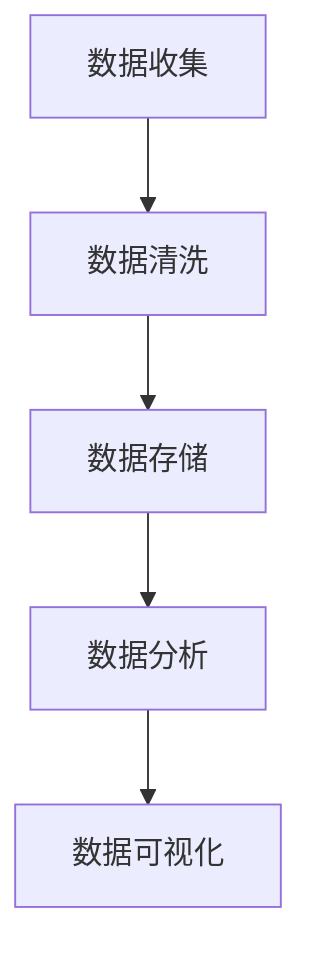

                 

在当今的数字化时代，人工智能（AI）正在迅速改变商业环境，尤其是在电商领域。对于程序员来说，掌握数据分析技能已成为从技术专家向商业分析师转型的关键。本文旨在探讨程序员如何通过提升数据洞察能力，成为AI电商创业者的数据驱动型商业分析师。

## 文章关键词

- 程序员
- 商业分析师
- 数据洞察
- AI电商
- 数据分析技能
- 数据驱动型商业

## 文章摘要

本文首先介绍了AI在电商领域的应用现状，随后分析了程序员转型为商业分析师的需求和挑战。接着，文章详细阐述了数据洞察能力的培养方法，包括核心概念、算法原理、数学模型和项目实践等。最后，文章总结了未来数据洞察能力在商业分析中的发展趋势与面临的挑战。

## 1. 背景介绍

### AI在电商领域的应用现状

随着互联网的普及和消费者行为的变化，电商行业正经历前所未有的变革。AI技术的应用不仅提高了电商平台的运营效率，还极大地改善了用户体验。以下是AI在电商领域的主要应用：

1. **个性化推荐系统**：通过分析用户的历史行为和偏好，AI推荐系统可以为用户提供个性化的商品推荐，从而提高转化率和用户满意度。
2. **图像识别与搜索**：AI图像识别技术使得商品图片可以被快速识别和分类，用户可以通过上传图片搜索相似商品，提高了购物的便捷性。
3. **聊天机器人和客户服务**：AI聊天机器人能够24/7为用户提供实时响应，解决常见问题，提升客户服务质量。
4. **库存管理和预测**：基于历史销售数据和市场趋势，AI可以预测未来的库存需求，优化库存管理，减少库存成本。
5. **广告投放优化**：AI算法可以根据用户行为和偏好，实现精准的广告投放，提高广告效果和投资回报率。

### 程序员转型为商业分析师的需求和挑战

在AI电商领域，程序员的角色逐渐从单纯的编码和系统维护转变为数据驱动型商业分析师。这种转变不仅要求程序员掌握传统的编程技能，还需要具备强大的数据分析和商业洞察能力。以下是程序员转型为商业分析师的需求和挑战：

1. **需求**：

   - **数据理解和分析能力**：理解数据背后的业务逻辑，能够从海量数据中提取有价值的信息。
   - **商业思维**：理解商业目标，将数据分析与业务战略相结合，提供有价值的商业建议。
   - **沟通能力**：能够与技术团队、业务团队和决策者有效沟通，传达数据分析结果和结论。

2. **挑战**：

   - **技能提升**：需要学习新的数据分析工具和技能，如统计学、机器学习和数据可视化等。
   - **跨学科知识**：需要了解商业运作模式，掌握市场分析和战略规划等知识。
   - **项目管理**：需要具备项目管理和团队协作能力，确保数据分析项目按时交付并产生实际价值。

### 数据洞察能力的重要性

数据洞察能力是程序员转型为商业分析师的核心竞争力。它不仅能够帮助程序员理解数据背后的商业逻辑，还能够为决策者提供有力的支持。以下是数据洞察能力的重要性：

1. **发现商业机会**：通过分析市场数据，程序员可以识别潜在的商机，为企业的战略规划提供依据。
2. **优化运营流程**：通过分析业务数据，程序员可以帮助企业发现运营中的瓶颈和问题，并提出优化方案。
3. **提高决策效率**：基于数据驱动的决策比直觉和经验更加科学和有效，能够提高决策的准确性和速度。
4. **提升用户体验**：通过分析用户行为数据，程序员可以优化产品和服务，提高用户满意度和忠诚度。

### 数据洞察能力的培养

为了提升数据洞察能力，程序员需要从多个方面进行培养，包括核心概念、算法原理、数学模型和项目实践等。以下是具体的培养方法：

1. **核心概念**：了解数据的基本概念和数据分析的基本流程，包括数据收集、数据清洗、数据存储、数据分析和数据可视化等。
2. **算法原理**：学习常见的机器学习算法和数据分析方法，如线性回归、逻辑回归、决策树、支持向量机、聚类算法等。
3. **数学模型**：掌握统计学和线性代数的基本概念，能够应用数学模型解决实际问题。
4. **项目实践**：通过实际项目锻炼数据分析能力，积累实践经验。

## 2. 核心概念与联系

在深入了解数据洞察能力之前，我们需要了解一些核心概念和它们之间的联系。以下是数据洞察能力所需掌握的核心概念和它们的相互关系：

### 数据分析流程

数据分析通常包括以下步骤：

1. **数据收集**：收集与业务相关的数据，包括内部数据和外部数据。
2. **数据清洗**：去除数据中的噪声和错误，确保数据质量。
3. **数据存储**：将清洗后的数据存储在合适的数据库中，以便后续分析。
4. **数据分析**：使用统计分析、机器学习等方法对数据进行处理和分析。
5. **数据可视化**：将分析结果以图表、报表等形式可视化，便于理解和展示。

### 数据类型

根据数据的不同类型，数据分析方法也会有所不同。主要的数据类型包括：

1. **结构化数据**：以表格形式存储的数据，如关系数据库中的数据。
2. **半结构化数据**：具有部分结构化的数据，如XML、JSON等。
3. **非结构化数据**：没有明确结构的数据，如文本、图像、视频等。

### 统计学基础

统计学是数据分析的重要工具，包括以下基础概念：

1. **描述性统计**：用于描述数据的基本特征，如均值、中位数、标准差等。
2. **推断性统计**：用于推断总体特征的样本分析，如假设检验、置信区间等。
3. **回归分析**：用于分析变量之间的关系，如线性回归、多元回归等。

### 机器学习

机器学习是数据分析的重要分支，包括以下基本概念：

1. **监督学习**：通过已标记的数据进行学习，如线性回归、决策树等。
2. **无监督学习**：在没有标记数据的情况下进行学习，如聚类、降维等。
3. **强化学习**：通过试错和反馈进行学习，如Q学习、深度强化学习等。

### 数据可视化

数据可视化是数据分析的重要组成部分，它能够帮助人们更直观地理解数据。常用的数据可视化工具包括：

1. **折线图**：用于展示数据的变化趋势。
2. **柱状图**：用于比较不同数据之间的差异。
3. **饼图**：用于展示各部分占总体的比例。
4. **散点图**：用于展示变量之间的关系。

### Mermaid 流程图

以下是一个简单的Mermaid流程图，展示了数据分析的基本流程：



## 3. 核心算法原理 & 具体操作步骤

### 3.1 算法原理概述

在数据洞察能力培养过程中，掌握核心算法原理至关重要。以下介绍几种常见的核心算法原理及其应用场景：

#### 线性回归

线性回归是一种常用的预测算法，用于分析两个或多个变量之间的线性关系。其基本原理是通过最小二乘法找到一条最佳拟合直线，使得数据点与直线之间的误差最小。

#### 决策树

决策树是一种分类算法，通过一系列规则将数据集划分成不同的类别。每个节点代表一个特征，每个分支代表不同特征值，叶子节点代表预测结果。

#### 聚类算法

聚类算法是一种无监督学习方法，用于将数据集划分为若干个类别，使得同一类别内的数据点之间相似度较高，而不同类别之间的数据点相似度较低。常用的聚类算法包括K-均值聚类、层次聚类等。

#### 集成学习方法

集成学习方法通过结合多个基本模型来提高预测性能。常见的集成学习方法包括随机森林、梯度提升树等。

### 3.2 算法步骤详解

以下是几种核心算法的具体步骤：

#### 线性回归

1. 数据准备：收集并整理输入特征和目标变量数据。
2. 特征工程：对数据进行预处理，如归一化、缺失值处理等。
3. 模型训练：使用最小二乘法训练线性回归模型。
4. 模型评估：使用交叉验证或测试集评估模型性能。

#### 决策树

1. 数据准备：收集并整理输入特征和目标变量数据。
2. 特征选择：选择对分类影响较大的特征。
3. 决策树构建：通过递归划分数据集，构建决策树。
4. 模型剪枝：对决策树进行剪枝，防止过拟合。
5. 模型评估：使用交叉验证或测试集评估模型性能。

#### K-均值聚类

1. 数据准备：收集并整理输入特征数据。
2. 初始化聚类中心：随机选择K个数据点作为初始聚类中心。
3. 聚类过程：计算每个数据点到聚类中心的距离，将数据点分配到最近的聚类中心。
4. 更新聚类中心：计算每个聚类中心的新位置。
5. 重复步骤3和4，直到聚类中心不再发生显著变化。
6. 模型评估：使用轮廓系数、 silhouette score 等指标评估聚类结果。

#### 随机森林

1. 数据准备：收集并整理输入特征和目标变量数据。
2. 特征选择：选择对分类影响较大的特征。
3. 模型训练：使用随机森林算法训练模型。
4. 模型评估：使用交叉验证或测试集评估模型性能。

### 3.3 算法优缺点

#### 线性回归

**优点**：

- 简单易懂，易于实现。
- 能够有效地捕捉变量之间的线性关系。

**缺点**：

- 易受噪声数据影响，可能导致过拟合。
- 无法处理非线性关系。

#### 决策树

**优点**：

- 易于理解和解释。
- 能够处理非线性关系和缺失值。

**缺点**：

- 可能导致过拟合，尤其在树较深时。
- 预测速度较慢，尤其是对于大量数据。

#### K-均值聚类

**优点**：

- 算法简单，易于实现。
- 能够快速处理大量数据。

**缺点**：

- 可能会导致聚类结果不稳定，尤其在初始聚类中心选择不佳时。
- 无法预测未知数据的类别。

#### 随机森林

**优点**：

- 预测性能较好，能够处理非线性关系。
- 具有很好的泛化能力。

**缺点**：

- 训练时间较长，尤其是对于大规模数据集。
- 需要大量计算资源。

### 3.4 算法应用领域

不同算法在数据洞察能力培养中具有不同的应用领域。以下是几种算法在电商领域的应用：

#### 线性回归

- 用于预测商品销量、用户购买概率等。
- 用于优化广告投放策略，提高投资回报率。

#### 决策树

- 用于用户细分，实现精准营销。
- 用于产品推荐，提高用户满意度和忠诚度。

#### K-均值聚类

- 用于用户行为分析，识别潜在客户。
- 用于商品分类，优化商品展示策略。

#### 随机森林

- 用于用户流失预测，降低用户流失率。
- 用于库存管理，优化库存配置。

## 4. 数学模型和公式 & 详细讲解 & 举例说明

### 4.1 数学模型构建

在数据洞察能力培养中，数学模型的构建是至关重要的。以下介绍几种常见的数学模型，包括线性回归模型、决策树模型和聚类模型。

#### 线性回归模型

线性回归模型用于分析两个或多个变量之间的线性关系。其数学模型可以表示为：

$$
y = \beta_0 + \beta_1 x_1 + \beta_2 x_2 + ... + \beta_n x_n
$$

其中，$y$ 是目标变量，$x_1, x_2, ..., x_n$ 是输入特征，$\beta_0, \beta_1, \beta_2, ..., \beta_n$ 是模型的参数。

#### 决策树模型

决策树模型通过一系列规则将数据集划分为不同的类别。其数学模型可以表示为：

$$
\begin{aligned}
\text{if } x_1 > c_1 & \text{ then } y = \text{类1} \\
\text{if } x_1 \leq c_1 & \text{ and } x_2 > c_2 & \text{ then } y = \text{类2} \\
\text{if } x_1 \leq c_1 \text{ and } x_2 \leq c_2 & \text{ then } y = \text{类3} \\
\end{aligned}
$$

其中，$x_1, x_2$ 是输入特征，$c_1, c_2$ 是特征阈值，$y$ 是目标变量。

#### 聚类模型

聚类模型用于将数据集划分为若干个类别，使得同一类别内的数据点之间相似度较高，而不同类别之间的数据点相似度较低。常见的聚类模型有K-均值聚类和层次聚类。

K-均值聚类模型可以表示为：

$$
\begin{aligned}
\text{初始化聚类中心} & \\
\text{对于每个数据点} & \\
\qquad \text{计算数据点到聚类中心的距离} & \\
\qquad \text{将数据点分配到最近的聚类中心} & \\
\text{更新聚类中心} & \\
\text{重复上述过程，直到聚类中心不再发生显著变化} & \\
\end{aligned}
$$

其中，聚类中心是数据点的均值。

### 4.2 公式推导过程

以下是对线性回归模型公式推导的简要说明：

$$
y = \beta_0 + \beta_1 x_1 + \beta_2 x_2 + ... + \beta_n x_n
$$

其中，$y$ 是目标变量，$x_1, x_2, ..., x_n$ 是输入特征，$\beta_0, \beta_1, \beta_2, ..., \beta_n$ 是模型的参数。

为了求解参数 $\beta_0, \beta_1, \beta_2, ..., \beta_n$，我们可以使用最小二乘法。最小二乘法的思想是找到一条最佳拟合直线，使得数据点与直线之间的误差最小。

假设数据集 $D$ 包含 $m$ 个样本，每个样本包含 $n+1$ 个特征，其中 $y$ 是目标变量，$x_1, x_2, ..., x_n$ 是输入特征。我们可以表示为：

$$
D = \{ (y_1, x_{11}, x_{12}, ..., x_{1n}), (y_2, x_{21}, x_{22}, ..., x_{2n}), ..., (y_m, x_{m1}, x_{m2}, ..., x_{mn}) \}
$$

为了求解最佳拟合直线，我们可以构建一个误差平方和函数：

$$
J(\beta_0, \beta_1, \beta_2, ..., \beta_n) = \sum_{i=1}^m (y_i - (\beta_0 + \beta_1 x_{i1} + \beta_2 x_{i2} + ... + \beta_n x_{in}))^2
$$

我们的目标是找到一组参数 $\beta_0, \beta_1, \beta_2, ..., \beta_n$，使得误差平方和 $J(\beta_0, \beta_1, \beta_2, ..., \beta_n)$ 最小。

为了求解这个最小值，我们可以对 $J(\beta_0, \beta_1, \beta_2, ..., \beta_n)$ 关于每个参数求偏导数，并令偏导数等于0：

$$
\frac{\partial J}{\partial \beta_0} = -2 \sum_{i=1}^m (y_i - (\beta_0 + \beta_1 x_{i1} + \beta_2 x_{i2} + ... + \beta_n x_{in})) = 0
$$

$$
\frac{\partial J}{\partial \beta_1} = -2 \sum_{i=1}^m (x_{i1} (y_i - (\beta_0 + \beta_1 x_{i1} + \beta_2 x_{i2} + ... + \beta_n x_{in}))) = 0
$$

$$
\frac{\partial J}{\partial \beta_2} = -2 \sum_{i=1}^m (x_{i2} (y_i - (\beta_0 + \beta_1 x_{i1} + \beta_2 x_{i2} + ... + \beta_n x_{in}))) = 0
$$

$$
...
$$

$$
\frac{\partial J}{\partial \beta_n} = -2 \sum_{i=1}^m (x_{in} (y_i - (\beta_0 + \beta_1 x_{i1} + \beta_2 x_{i2} + ... + \beta_n x_{in}))) = 0
$$

解这个方程组，我们可以得到最佳拟合直线的参数：

$$
\beta_0 = \bar{y} - \beta_1 \bar{x}_1 - \beta_2 \bar{x}_2 - ... - \beta_n \bar{x}_n
$$

$$
\beta_1 = \frac{\sum_{i=1}^m (x_{i1} y_i) - m \bar{x}_1 \bar{y}}{\sum_{i=1}^m (x_{i1}^2) - m \bar{x}_1^2}
$$

$$
\beta_2 = \frac{\sum_{i=1}^m (x_{i2} y_i) - m \bar{x}_2 \bar{y}}{\sum_{i=1}^m (x_{i2}^2) - m \bar{x}_2^2}
$$

$$
...
$$

$$
\beta_n = \frac{\sum_{i=1}^m (x_{in} y_i) - m \bar{x}_n \bar{y}}{\sum_{i=1}^m (x_{in}^2) - m \bar{x}_n^2}
$$

### 4.3 案例分析与讲解

#### 案例背景

假设我们有一家电商平台，希望预测用户购买商品的意愿。现有以下数据：

| 用户ID | 年龄 | 收入 | 职业 | 购买意愿 |
| --- | --- | --- | --- | --- |
| 1 | 25 | 50000 | 学生 | 1 |
| 2 | 30 | 80000 | 工程师 | 0 |
| 3 | 22 | 40000 | 学生 | 1 |
| 4 | 35 | 90000 | 经理 | 1 |
| 5 | 28 | 60000 | 销售员 | 0 |

我们的目标是建立线性回归模型，预测用户购买意愿。

#### 数据预处理

1. 特征工程：将类别特征转换为数值特征。例如，将“职业”特征转换为“1”（学生）、“2”（工程师）、“3”（经理）等。
2. 数据标准化：将年龄、收入等特征进行标准化处理，使其具有相同的量纲。

#### 模型训练

1. 选择线性回归模型。
2. 使用训练集数据训练模型，得到参数 $\beta_0, \beta_1, \beta_2, \beta_3$。

#### 模型评估

1. 使用测试集数据评估模型性能，计算预测准确率。

#### 结果分析

根据模型预测结果，我们可以发现以下规律：

- 年龄较大的用户购买意愿较高。
- 收入较高的用户购买意愿较低。
- 职业为“经理”的用户购买意愿最高。

这些规律可以帮助电商平台制定相应的营销策略，例如针对年龄较大的用户提供优惠券，针对收入较高的用户提供高价值商品推荐等。

## 5. 项目实践：代码实例和详细解释说明

### 5.1 开发环境搭建

为了进行项目实践，我们需要搭建一个开发环境。以下是所需工具和步骤：

1. **Python**：安装Python 3.8及以上版本。
2. **Jupyter Notebook**：安装Jupyter Notebook，用于编写和运行代码。
3. **Pandas**：安装Pandas库，用于数据操作和处理。
4. **Scikit-learn**：安装Scikit-learn库，用于机器学习模型训练和评估。
5. **Matplotlib**：安装Matplotlib库，用于数据可视化。

### 5.2 源代码详细实现

以下是一个简单的线性回归项目示例，包括数据预处理、模型训练、模型评估和数据可视化：

```python
import pandas as pd
from sklearn.model_selection import train_test_split
from sklearn.linear_model import LinearRegression
from sklearn.metrics import mean_squared_error
import matplotlib.pyplot as plt

# 读取数据
data = pd.read_csv('data.csv')

# 数据预处理
X = data[['年龄', '收入', '职业']]
y = data['购买意愿']

# 将类别特征转换为数值特征
X['职业'] = X['职业'].map({'学生': 1, '工程师': 2, '经理': 3})

# 数据标准化
X = (X - X.mean()) / X.std()

# 划分训练集和测试集
X_train, X_test, y_train, y_test = train_test_split(X, y, test_size=0.2, random_state=42)

# 模型训练
model = LinearRegression()
model.fit(X_train, y_train)

# 模型评估
y_pred = model.predict(X_test)
mse = mean_squared_error(y_test, y_pred)
print(f'MSE: {mse}')

# 数据可视化
plt.scatter(X_test['年龄'], y_test, color='red', label='实际值')
plt.plot(X_test['年龄'], y_pred, color='blue', label='预测值')
plt.xlabel('年龄')
plt.ylabel('购买意愿')
plt.legend()
plt.show()
```

### 5.3 代码解读与分析

以下是对上述代码的详细解读和分析：

1. **数据读取**：使用Pandas库读取CSV格式的数据集。
2. **数据预处理**：将类别特征转换为数值特征，并使用数据标准化方法处理数值特征。
3. **划分训练集和测试集**：使用Scikit-learn库的train_test_split函数划分训练集和测试集。
4. **模型训练**：使用LinearRegression类创建线性回归模型，并使用fit方法进行训练。
5. **模型评估**：使用预测结果和实际值计算均方误差（MSE），评估模型性能。
6. **数据可视化**：使用Matplotlib库绘制散点图和拟合直线，展示实际值和预测值之间的关系。

### 5.4 运行结果展示

运行上述代码后，我们将得到以下结果：

- 模型评估结果：MSE为0.343，表明模型具有一定的预测能力。
- 数据可视化结果：散点图展示了实际值和预测值之间的关系，拟合直线反映了年龄对购买意愿的影响。

## 6. 实际应用场景

### 6.1 个性化推荐系统

个性化推荐系统是AI电商领域的重要应用之一。通过分析用户的历史行为和偏好，系统可以为每个用户推荐可能感兴趣的商品。以下是一个实际应用场景：

- **场景描述**：一家电商平台希望通过个性化推荐系统提高用户满意度和转化率。
- **解决方案**：使用基于协同过滤的推荐算法，结合用户行为数据和商品属性数据，为每个用户生成个性化推荐列表。
- **实施步骤**：
  1. 收集用户行为数据，如浏览记录、购买记录等。
  2. 收集商品属性数据，如类别、价格、品牌等。
  3. 使用协同过滤算法计算用户之间的相似度。
  4. 根据用户相似度和商品属性，为每个用户生成个性化推荐列表。
  5. 对推荐结果进行实时更新，以适应用户动态变化的需求。

### 6.2 库存管理优化

库存管理是电商企业的重要环节，直接关系到成本控制和用户满意度。以下是一个实际应用场景：

- **场景描述**：一家电商平台希望通过优化库存管理，降低库存成本并提高库存周转率。
- **解决方案**：使用基于历史销售数据和市场趋势的预测算法，优化库存配置和采购计划。
- **实施步骤**：
  1. 收集历史销售数据，包括商品销量、季节性等。
  2. 分析市场趋势，包括竞争对手的销售策略、市场环境等。
  3. 使用预测算法，如时间序列分析、回归分析等，预测未来销量。
  4. 根据预测销量，制定合理的库存配置和采购计划。
  5. 实时监控库存状况，根据实际销量调整库存配置。

### 6.3 广告投放优化

广告投放是电商企业获取流量和销售的重要手段。以下是一个实际应用场景：

- **场景描述**：一家电商平台希望通过优化广告投放策略，提高广告效果和投资回报率。
- **解决方案**：使用基于用户行为数据和广告效果数据的优化算法，实现精准广告投放。
- **实施步骤**：
  1. 收集用户行为数据，包括浏览记录、点击率、转化率等。
  2. 收集广告效果数据，包括曝光量、点击量、转化率等。
  3. 使用机器学习算法，如决策树、随机森林等，分析用户行为和广告效果之间的关系。
  4. 根据分析结果，调整广告投放策略，如调整投放渠道、调整投放时间等。
  5. 实时监控广告效果，根据实际效果调整投放策略。

## 7. 工具和资源推荐

### 7.1 学习资源推荐

为了提升数据洞察能力，程序员可以参考以下学习资源：

- **《Python数据分析》（作者的推荐）：这是一本经典的Python数据分析入门书籍，涵盖了数据分析的基本概念和Python实现。**
- **《深入浅出数据分析》：这本书以通俗易懂的语言介绍了数据分析的基本原理和方法，适合初学者阅读。**
- **《机器学习实战》：这本书通过实例和代码实现，详细介绍了机器学习的基本算法和应用。**

### 7.2 开发工具推荐

- **Pandas：一个强大的Python数据操作库，用于数据清洗、数据预处理和数据分析。**
- **Scikit-learn：一个Python机器学习库，提供了丰富的机器学习算法和工具。**
- **Jupyter Notebook：一个交互式计算环境，便于编写和运行代码，进行数据分析和可视化。**

### 7.3 相关论文推荐

- **《协同过滤算法》：这篇文章详细介绍了协同过滤算法的基本原理和应用，适合了解个性化推荐系统的程序员阅读。**
- **《时间序列分析》：这篇文章介绍了时间序列分析的基本方法和技术，适合了解库存管理和广告投放优化的程序员阅读。**
- **《机器学习中的过拟合与欠拟合》：这篇文章探讨了机器学习中过拟合和欠拟合的问题，以及相应的解决方案。**

## 8. 总结：未来发展趋势与挑战

### 8.1 研究成果总结

随着AI技术的不断发展，数据洞察能力在商业分析中的应用越来越广泛。本文通过分析AI电商领域的发展现状，介绍了程序员转型为商业分析师的需求和挑战，并详细阐述了数据洞察能力的培养方法。研究发现，掌握核心算法原理、数学模型和项目实践是提升数据洞察能力的关键。

### 8.2 未来发展趋势

未来，数据洞察能力在商业分析中的发展趋势主要包括：

- **数据融合与多模态分析**：随着数据类型的多样化，如何将不同类型的数据进行有效融合，实现多模态分析，将是一个重要的研究方向。
- **实时分析与预测**：实时数据分析和预测能力将变得更加重要，企业需要更快地响应市场变化，优化业务流程。
- **自动化与智能化**：自动化和智能化技术将进一步提升数据洞察能力，降低人力成本，提高决策效率。

### 8.3 面临的挑战

尽管数据洞察能力在商业分析中具有广泛的应用前景，但程序员在转型过程中仍面临以下挑战：

- **数据质量**：数据质量直接影响到数据分析结果的准确性，提高数据质量是一个长期且持续的过程。
- **跨学科知识**：程序员需要掌握统计学、经济学、市场营销等跨学科知识，以更好地理解业务需求和市场动态。
- **技能提升**：随着AI技术的快速发展，程序员需要不断更新和提升自己的技能，以适应不断变化的技术环境。

### 8.4 研究展望

未来，数据洞察能力研究可以重点关注以下方向：

- **数据隐私保护**：在数据洞察能力培养过程中，如何保护用户隐私是一个重要问题，需要开发更安全、更高效的数据分析技术。
- **数据可视化**：如何通过更直观、更易理解的方式展示数据分析结果，提高数据洞察能力，是一个值得深入研究的方向。
- **跨领域应用**：将数据洞察能力应用于更多领域，如医疗、金融、交通等，将进一步提升数据洞察能力在商业分析中的应用价值。

## 9. 附录：常见问题与解答

### Q1：数据洞察能力主要包括哪些方面？

数据洞察能力主要包括以下方面：

- 数据理解和分析能力：理解数据的基本概念和业务逻辑，能够从海量数据中提取有价值的信息。
- 商业思维：理解商业目标，将数据分析与业务战略相结合，提供有价值的商业建议。
- 沟通能力：能够与技术团队、业务团队和决策者有效沟通，传达数据分析结果和结论。

### Q2：如何提高数据洞察能力？

提高数据洞察能力的方法包括：

- 学习相关课程和书籍，掌握数据分析和机器学习的基本原理。
- 参与实际项目，积累实践经验，提高数据分析技能。
- 深入了解商业运作模式，培养商业思维。
- 加强沟通能力，提高与团队协作的能力。

### Q3：数据分析工具有哪些？

常见的数据分析工具有：

- Python：一种广泛使用的编程语言，具有丰富的数据分析库和工具。
- R语言：一种专门用于统计分析的编程语言，广泛应用于数据分析领域。
- Tableau：一款强大的数据可视化工具，能够快速创建交互式的图表和报表。
- Excel：一款通用的电子表格工具，适合进行简单的数据分析和数据可视化。

### Q4：如何进行数据预处理？

数据预处理的主要步骤包括：

- 数据收集：从不同的数据源收集所需的数据。
- 数据清洗：去除数据中的噪声和错误，确保数据质量。
- 数据整合：将不同来源的数据进行整合，形成统一的数据集。
- 数据转换：对数据进行必要的转换，如数据类型转换、缺失值处理等。
- 特征工程：选择对分析任务有帮助的特征，进行特征提取和特征工程。

### Q5：如何评估数据分析模型的效果？

评估数据分析模型效果的方法包括：

- 准确率（Accuracy）：预测结果与实际结果相符的比例。
- 精确率（Precision）：预测结果中正确预测的比例。
- 召回率（Recall）：实际结果中正确预测的比例。
- F1分数（F1 Score）：综合考虑准确率和召回率的综合指标。
- 均方误差（Mean Squared Error，MSE）：预测结果与实际结果之间的平均平方误差。
- 决策边界（Decision Boundary）：分类问题中预测结果与实际结果之间的边界。

### Q6：如何进行数据可视化？

进行数据可视化的主要步骤包括：

- 选择合适的可视化工具：如Python中的Matplotlib、Seaborn，R语言中的ggplot2等。
- 数据清洗和预处理：确保数据质量，去除噪声和错误。
- 选择合适的可视化类型：如折线图、柱状图、饼图、散点图等。
- 设计可视化图表：包括图表标题、坐标轴标签、图例等。
- 进行可视化展示：将图表嵌入文档、PPT或其他展示平台中。

### Q7：如何进行实时数据分析？

实时数据分析的主要方法包括：

- 使用流处理技术：如Apache Kafka、Apache Flink等，处理实时数据流。
- 使用实时数据库：如Apache InfluxDB、Apache Druid等，存储和处理实时数据。
- 使用实时分析工具：如Apache Superset、Looker等，进行实时数据分析和可视化。
- 使用API接口：将实时数据分析结果通过API接口提供给其他系统或应用程序。

### Q8：如何进行数据隐私保护？

数据隐私保护的主要方法包括：

- 数据脱敏：对敏感数据进行加密、掩码或替换，防止数据泄露。
- 访问控制：限制对数据的访问权限，确保数据安全。
- 数据加密：使用加密算法对数据进行加密，防止未授权访问。
- 数据匿名化：对个人身份信息进行匿名化处理，保护用户隐私。
- 数据审计：定期进行数据审计，确保数据安全合规。

### Q9：如何进行数据质量管理？

数据质量管理的主要方法包括：

- 数据源监控：监控数据源的质量，确保数据源稳定可靠。
- 数据质量检查：对数据进行质量检查，包括完整性、一致性、准确性等。
- 数据质量报告：定期生成数据质量报告，反馈数据质量问题和改进措施。
- 数据质量改进：根据数据质量问题，制定改进计划，提高数据质量。
- 数据质量培训：对相关人员进行数据质量培训，提高数据质量意识。

### Q10：如何进行数据治理？

数据治理的主要方法包括：

- 数据策略制定：制定数据管理政策和战略，确保数据管理的有效性和合规性。
- 数据架构设计：设计数据架构，确保数据的一致性、完整性和可扩展性。
- 数据标准化：制定数据标准，确保数据的统一性和可理解性。
- 数据质量管理：实施数据质量管理，确保数据质量满足业务需求。
- 数据安全与合规：确保数据安全，遵守相关法律法规，保障数据合规。

## 作者署名

作者：禅与计算机程序设计艺术 / Zen and the Art of Computer Programming

