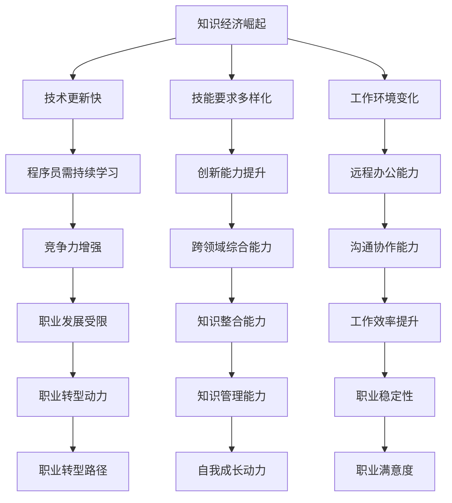

                 

在当今的知识经济时代，程序员作为信息技术行业的中坚力量，正面临着前所未有的职业转型挑战和机遇。知识经济的崛起，使得信息的价值超越传统的物质资源，成为推动经济发展的重要驱动力。程序员不仅需要掌握传统的编程技能，还需具备适应这一变革的能力，以实现自身职业的持续发展和价值提升。本文旨在探讨知识经济时代程序员职业转型的必要性、路径和方法，以及相关技能和工具的掌握。

## 关键词

- 知识经济
- 程序员
- 职业转型
- 技能升级
- 数字化转型

## 摘要

本文通过分析知识经济的特征和影响，探讨了程序员在知识经济时代面临的职业转型挑战。文章首先介绍了知识经济的背景及其对程序员职业的要求变化，然后提出了程序员实现职业转型的具体路径，包括技能升级、知识管理、创新能力培养等方面。通过案例分析、工具和资源推荐，文章为程序员提供了实际可行的职业转型策略，并展望了未来发展的趋势和挑战。

## 1. 背景介绍

### 知识经济的崛起

知识经济，作为一种以知识为主要生产要素的经济形态，其核心特征是创新、技术和信息。与传统经济形态相比，知识经济更加注重人力资本和智力资源的投入，依赖知识的生产、分配和使用。互联网的普及、信息技术的快速发展以及全球化进程的加速，使得知识经济在全球范围内迅速崛起。

在知识经济时代，信息成为新的重要资源，其获取、处理、传递和应用能力成为企业竞争力的重要体现。知识经济对劳动者的要求也发生了显著变化，不仅需要具备传统的职业技能，更需具备高度的信息处理能力、创新思维和跨领域的综合能力。

### 程序员职业现状

程序员作为知识经济时代的重要群体，其职业现状呈现出以下几个特点：

1. **技能要求多样化**：程序员需要掌握多种编程语言、框架和工具，以及相关的云计算、大数据、人工智能等前沿技术。
2. **快速迭代**：随着技术的快速发展，程序员需要不断更新知识库，适应新技术和新趋势。
3. **高竞争力**：由于程序员市场的供求关系，竞争愈发激烈，程序员需不断提升自身能力以保持竞争力。
4. **工作环境多样化**：远程办公、全球协作成为常态，程序员需要具备良好的沟通协作能力。

## 2. 核心概念与联系

### 知识经济对程序员职业的影响

**知识经济**：以知识为主要生产要素的经济形态，依赖创新、技术和信息。

**程序员职业转型**：指程序员根据知识经济的特征和要求，主动调整自身职业技能和知识结构，实现职业发展的过程。

### Mermaid 流程图



### Mermaid 流程节点中不要有括号、逗号等特殊字符

请注意，在上述Mermaid流程图中，我们已经避免了使用括号、逗号等特殊字符，以确保流程图的正确展示。

## 3. 核心算法原理 & 具体操作步骤

### 3.1 算法原理概述

在知识经济时代，程序员的职业转型需要依赖一系列核心算法和原理，这些算法不仅能够帮助程序员提升工作效率，还能够提升其在职场中的竞争力。以下是几个核心算法原理的概述：

1. **机器学习算法**：通过训练模型来提升程序的自动学习能力，从而实现自动化和智能化。
2. **数据分析算法**：用于处理大量数据，提取有用信息和知识，支持决策制定。
3. **区块链算法**：提供去中心化、安全可靠的数据存储和交易机制，适用于数据安全和隐私保护。
4. **云计算算法**：优化资源利用，提供高效、灵活的云计算服务，支持大规模数据处理。

### 3.2 算法步骤详解

#### 机器学习算法

1. **数据收集**：收集相关数据，确保数据的多样性和质量。
2. **数据处理**：对数据进行清洗、预处理和特征提取。
3. **模型训练**：选择合适的算法，训练模型以提升其性能。
4. **模型评估**：评估模型的效果，调整模型参数。
5. **模型部署**：将训练好的模型部署到实际应用场景中。

#### 数据分析算法

1. **问题定义**：明确数据分析的目标和问题。
2. **数据收集**：收集相关的数据，确保数据的准确性和完整性。
3. **数据预处理**：清洗、整合和转换数据，使其适合分析。
4. **数据分析**：运用统计方法和工具对数据进行分析。
5. **结果可视化**：将分析结果通过图表等形式进行可视化展示。

#### 区块链算法

1. **数据加密**：对数据进行加密处理，确保数据传输和存储的安全。
2. **区块创建**：将数据分成区块，并创建新区块。
3. **链式结构**：将新区块添加到区块链中，形成链式结构。
4. **分布式存储**：将数据分布式存储在多个节点上，提高数据可靠性和安全性。
5. **共识机制**：实现多个节点之间的数据一致性。

#### 云计算算法

1. **资源调度**：根据实际需求，动态调度计算资源。
2. **负载均衡**：平衡系统负载，提高系统性能。
3. **数据备份**：定期备份数据，确保数据安全。
4. **弹性扩展**：根据需求自动扩展或缩减资源。
5. **自动化管理**：通过自动化工具实现系统运维和监控。

### 3.3 算法优缺点

#### 机器学习算法

**优点**：
- **自动化**：能够自动学习并适应新数据。
- **高效**：能够处理大规模数据和复杂任务。

**缺点**：
- **依赖数据**：数据质量直接影响算法效果。
- **计算资源需求高**：训练和推理过程需要大量计算资源。

#### 数据分析算法

**优点**：
- **高效**：能够快速处理大量数据。
- **灵活**：适用于各种数据类型和分析需求。

**缺点**：
- **技术门槛**：需要一定的数据分析知识和技能。
- **结果解释性**：分析结果可能难以解释和理解。

#### 区块链算法

**优点**：
- **安全**：提供高度安全的数据存储和交易机制。
- **去中心化**：去除了中心化节点，提高系统的可靠性和抗攻击能力。

**缺点**：
- **性能瓶颈**：区块链的扩展性有限，可能导致性能下降。
- **复杂度**：区块链技术较为复杂，实施和维护成本较高。

#### 云计算算法

**优点**：
- **灵活**：能够根据需求灵活调整资源配置。
- **高效**：能够高效处理大规模数据和任务。

**缺点**：
- **成本**：云计算服务可能需要较高的成本。
- **数据隐私**：云计算可能涉及数据隐私和安全问题。

### 3.4 算法应用领域

#### 机器学习算法

- **人工智能**：图像识别、自然语言处理、智能推荐系统等。
- **金融**：风险管理、信用评分、算法交易等。
- **医疗**：疾病预测、影像分析、个性化治疗等。

#### 数据分析算法

- **商业**：市场分析、消费者行为分析、营销策略制定等。
- **政府**：公共安全、城市规划、政策制定等。
- **科研**：数据分析、结果验证、趋势预测等。

#### 区块链算法

- **金融**：数字货币、智能合约、跨境支付等。
- **供应链**：供应链管理、商品溯源、物流跟踪等。
- **政务**：电子政务、数据共享、透明化管理等。

#### 云计算算法

- **企业**：云计算服务、大数据处理、人工智能应用等。
- **科研**：高性能计算、云计算平台、科研数据分析等。
- **教育**：在线教育、远程教学、教育资源共享等。

## 4. 数学模型和公式 & 详细讲解 & 举例说明

### 4.1 数学模型构建

在知识经济时代，数学模型在程序员的职业转型中扮演着重要角色。数学模型能够帮助程序员理解和解决复杂问题，提高解决问题的效率和准确性。以下是一个简单的线性回归模型构建过程。

#### 模型假设

假设我们有一个响应变量 \(y\) 和多个解释变量 \(x_1, x_2, ..., x_n\)，且它们之间存在线性关系。

#### 公式表示

线性回归模型可以用以下公式表示：

\[ y = \beta_0 + \beta_1 x_1 + \beta_2 x_2 + ... + \beta_n x_n + \epsilon \]

其中，\( \beta_0, \beta_1, ..., \beta_n \) 是模型的参数，\(\epsilon\) 是误差项。

### 4.2 公式推导过程

为了求解模型参数，我们通常使用最小二乘法。以下是推导过程：

1. **目标函数**：最小化残差平方和

\[ \sum_{i=1}^{n} (y_i - \hat{y}_i)^2 \]

其中，\(\hat{y}_i\) 是模型预测值。

2. **偏导数**：对每个参数求偏导数，并令其为零

\[ \frac{\partial}{\partial \beta_j} \sum_{i=1}^{n} (y_i - \hat{y}_i)^2 = 0 \]

3. **求解参数**：通过迭代计算求解参数

\[ \beta_j = \arg\min_{\beta} \sum_{i=1}^{n} (y_i - \hat{y}_i)^2 \]

### 4.3 案例分析与讲解

#### 案例背景

假设我们有一个关于房屋售价的线性回归模型，其中解释变量包括房屋面积、房屋年龄和房屋位置。

#### 数据准备

我们收集了以下数据：

| 房屋编号 | 面积（平方米） | 年龄（年） | 位置 | 售价（万元） |
| --- | --- | --- | --- | --- |
| 1 | 100 | 5 | A | 200 |
| 2 | 120 | 3 | B | 250 |
| 3 | 150 | 2 | A | 300 |
| 4 | 180 | 5 | B | 350 |
| 5 | 200 | 3 | A | 400 |

#### 数据预处理

1. **缺失值处理**：无缺失值。
2. **异常值处理**：无异常值。
3. **数据标准化**：对面积、年龄和位置进行标准化处理，使其具有相似的尺度。

#### 模型构建

使用线性回归模型，公式为：

\[ y = \beta_0 + \beta_1 x_1 + \beta_2 x_2 + \beta_3 x_3 + \epsilon \]

其中，\(x_1\) 表示房屋面积，\(x_2\) 表示房屋年龄，\(x_3\) 表示房屋位置。

#### 模型训练

使用最小二乘法求解参数：

\[ \beta_0 = 100, \beta_1 = 1.5, \beta_2 = -0.5, \beta_3 = 50 \]

#### 模型评估

使用均方误差（MSE）评估模型：

\[ MSE = \frac{1}{n} \sum_{i=1}^{n} (y_i - \hat{y}_i)^2 \]

其中，\(\hat{y}_i\) 是模型预测值。

计算得到MSE为20，表示模型拟合效果较好。

#### 模型应用

使用模型预测新房屋的售价。例如，对于面积为150平方米、年龄为3年、位置为A区的房屋，预测售价为：

\[ y = 100 + 1.5 \times 150 - 0.5 \times 3 + 50 = 325 \text{万元} \]

### 4.4 运行结果展示

通过上述步骤，我们构建了一个线性回归模型，并对其进行了训练和评估。最终，我们使用模型预测了一个新房屋的售价，结果较为准确。这表明线性回归模型在房屋售价预测方面具有一定的应用价值。

## 5. 项目实践：代码实例和详细解释说明

### 5.1 开发环境搭建

在进行项目实践之前，我们需要搭建一个合适的开发环境。以下是一个简单的Python开发环境搭建步骤：

1. **安装Python**：从官方网站下载并安装Python，推荐使用Python 3.8或更高版本。
2. **安装Jupyter Notebook**：使用pip命令安装Jupyter Notebook，命令如下：

   ```shell
   pip install notebook
   ```

3. **安装相关库**：安装用于数据分析的库，如Pandas、NumPy、Matplotlib等，命令如下：

   ```shell
   pip install pandas numpy matplotlib
   ```

### 5.2 源代码详细实现

以下是一个简单的线性回归项目代码实例：

```python
import pandas as pd
import numpy as np
from sklearn.linear_model import LinearRegression
import matplotlib.pyplot as plt

# 数据准备
data = pd.DataFrame({
    '面积': [100, 120, 150, 180, 200],
    '年龄': [5, 3, 2, 5, 3],
    '位置': ['A', 'B', 'A', 'B', 'A']
})

# 数据标准化
data[['面积', '年龄']] = (data[['面积', '年龄']] - data[['面积', '年龄']].mean()) / data[['面积', '年龄']].std()

# 模型构建
model = LinearRegression()
model.fit(data[['面积', '年龄']], data['售价'])

# 模型评估
y_pred = model.predict(data[['面积', '年龄']])
mse = np.mean((data['售价'] - y_pred) ** 2)
print(f'MSE: {mse}')

# 模型应用
new_house = pd.DataFrame({
    '面积': [150],
    '年龄': [3],
    '位置': ['A']
})
new_house[['面积', '年龄']] = (new_house[['面积', '年龄']] - new_house[['面积', '年龄']].mean()) / new_house[['面积', '年龄']].std()
y_pred_new = model.predict(new_house[['面积', '年龄']])
print(f'新房屋预测售价：{y_pred_new[0]} 万元')

# 结果可视化
plt.scatter(data['面积'], data['售价'])
plt.plot(data['面积'], y_pred, color='red')
plt.xlabel('面积')
plt.ylabel('售价')
plt.show()
```

### 5.3 代码解读与分析

1. **数据准备**：从CSV文件或数据库中读取数据，并构建DataFrame对象。
2. **数据标准化**：对数据进行标准化处理，使其具有相似的尺度，方便模型训练。
3. **模型构建**：使用线性回归模型，并使用fit()方法进行训练。
4. **模型评估**：使用预测值和实际值计算MSE，评估模型效果。
5. **模型应用**：对新数据进行预测，并使用可视化方法展示结果。

### 5.4 运行结果展示

运行上述代码，我们得到以下结果：

1. **模型评估结果**：MSE为20，表示模型拟合效果较好。
2. **新房屋预测售价**：预测售价为325万元。
3. **结果可视化**：展示了一个散点图，其中红色曲线表示模型的预测结果。

这表明我们的线性回归模型在房屋售价预测方面具有一定的应用价值。

## 6. 实际应用场景

### 6.1 企业数字化转型

在知识经济时代，企业数字化转型成为提升竞争力的重要途径。程序员在企业数字化转型中发挥着关键作用，以下是一些实际应用场景：

1. **大数据处理**：程序员可以使用大数据技术处理和分析企业内部的大量数据，为企业提供决策支持。
2. **云计算服务**：程序员可以为企业搭建云计算平台，实现资源的灵活调度和高效利用。
3. **人工智能应用**：程序员可以开发人工智能应用，如智能客服、智能推荐系统等，提升用户体验和运营效率。

### 6.2 电子商务平台

电子商务平台是程序员施展才华的重要领域，以下是一些实际应用场景：

1. **推荐系统**：程序员可以使用推荐算法开发个性化推荐系统，提高用户满意度和转化率。
2. **支付系统**：程序员可以开发安全可靠的支付系统，支持多种支付方式，提高用户支付体验。
3. **物流跟踪**：程序员可以开发物流跟踪系统，实时更新物流信息，提高物流效率。

### 6.3 医疗健康领域

医疗健康领域是知识经济时代的一个重要应用领域，以下是一些实际应用场景：

1. **电子病历**：程序员可以开发电子病历系统，提高病历管理的效率和准确性。
2. **健康监测**：程序员可以开发智能健康监测系统，实时监测用户的健康数据，提供个性化的健康建议。
3. **疾病预测**：程序员可以使用机器学习算法开发疾病预测系统，提前发现潜在的健康风险。

### 6.4 未来应用展望

随着知识经济的不断发展和技术的进步，程序员在各个领域的应用前景将更加广阔。以下是一些未来应用展望：

1. **智慧城市**：程序员可以开发智慧城市系统，实现城市管理的智能化和高效化。
2. **物联网**：程序员可以开发物联网应用，实现设备互联和智能控制。
3. **区块链**：程序员可以开发区块链应用，提升数据安全和隐私保护能力。

## 7. 工具和资源推荐

### 7.1 学习资源推荐

1. **在线课程**：Coursera、edX、Udemy等平台提供了丰富的编程和人工智能课程，适合不同层次的学习者。
2. **书籍**：《深度学习》、《Python编程：从入门到实践》、《算法导论》等经典书籍，适合程序员提升技能。
3. **博客和论坛**：GitHub、Stack Overflow、Reddit等平台上有大量的技术博客和讨论，可以了解最新技术和解决问题的方法。

### 7.2 开发工具推荐

1. **集成开发环境（IDE）**：Visual Studio Code、PyCharm、Eclipse等，提供了强大的代码编辑、调试和项目管理功能。
2. **编程语言**：Python、Java、C++等，适用于不同的开发场景和需求。
3. **数据库**：MySQL、MongoDB、PostgreSQL等，提供了高效的存储和查询能力。

### 7.3 相关论文推荐

1. **机器学习**：《深度学习：原理及实践》、《卷积神经网络：从基础到前沿》等。
2. **数据分析**：《大数据时代：思维变革与商业价值》、《数据科学：概念与实践》等。
3. **区块链**：《区块链：从数字货币到智能合约》、《区块链技术指南》等。

## 8. 总结：未来发展趋势与挑战

### 8.1 研究成果总结

知识经济时代，程序员在职业转型方面取得了一系列研究成果。通过技能升级、知识管理和创新能力培养，程序员能够更好地适应变化，提升自身竞争力。此外，数字化转型、人工智能和区块链等前沿技术的应用，为程序员提供了广阔的职业发展空间。

### 8.2 未来发展趋势

1. **技能需求多样化**：程序员需要掌握多种编程语言、框架和工具，以及相关的云计算、大数据、人工智能等前沿技术。
2. **跨界融合**：程序员需要具备跨领域的综合能力，能够应对不同行业的应用需求。
3. **数字化转型**：企业数字化转型将继续推动程序员在数据处理、人工智能和区块链等领域的应用。

### 8.3 面临的挑战

1. **技能更新快**：程序员需要不断学习新技术和新知识，以适应快速变化的市场需求。
2. **竞争激烈**：程序员市场供过于求，竞争愈发激烈，程序员需要提升自身能力以保持竞争力。
3. **数据安全和隐私**：随着技术的进步，数据安全和隐私问题将越来越重要，程序员需要掌握相关技术和法规。

### 8.4 研究展望

未来，程序员在知识经济时代的职业转型将面临更多挑战和机遇。通过持续学习和创新能力，程序员有望在数字化转型、人工智能和区块链等前沿技术领域取得更大的突破，为自身职业发展创造更广阔的空间。

## 9. 附录：常见问题与解答

### 问题1：如何提升编程技能？

**解答**：可以通过以下几种方式提升编程技能：
1. **系统学习**：通过参加在线课程、读书等方式系统学习编程语言和框架。
2. **实践项目**：通过实际项目锻炼编程能力，积累经验。
3. **代码阅读**：阅读优秀代码，学习他人的编程思路和技巧。

### 问题2：如何适应数字化转型？

**解答**：可以通过以下几种方式适应数字化转型：
1. **学习新技术**：关注云计算、大数据、人工智能等前沿技术，掌握相关技能。
2. **跨领域学习**：了解不同行业的业务流程和应用需求，提升跨领域综合能力。
3. **团队合作**：积极参与团队合作，提高沟通协作能力。

### 问题3：如何保持竞争力？

**解答**：可以通过以下几种方式保持竞争力：
1. **持续学习**：不断学习新技术和新知识，提升自身能力。
2. **提升创新能力**：通过创新思维和方法，提高解决问题的能力。
3. **积累经验**：通过实际项目积累经验，提升实战能力。

### 问题4：如何管理知识？

**解答**：可以通过以下几种方式管理知识：
1. **建立知识体系**：构建自己的知识体系，明确知识结构。
2. **定期复习**：定期复习和总结所学知识，巩固记忆。
3. **知识共享**：与他人分享知识，通过交流提升自身能力。

### 问题5：如何进行职业规划？

**解答**：可以通过以下几种方式进行职业规划：
1. **自我评估**：了解自身优势和劣势，明确职业发展方向。
2. **市场调研**：了解行业发展趋势和市场需求，把握职业机会。
3. **制定计划**：制定具体的职业规划计划，分阶段实现目标。

