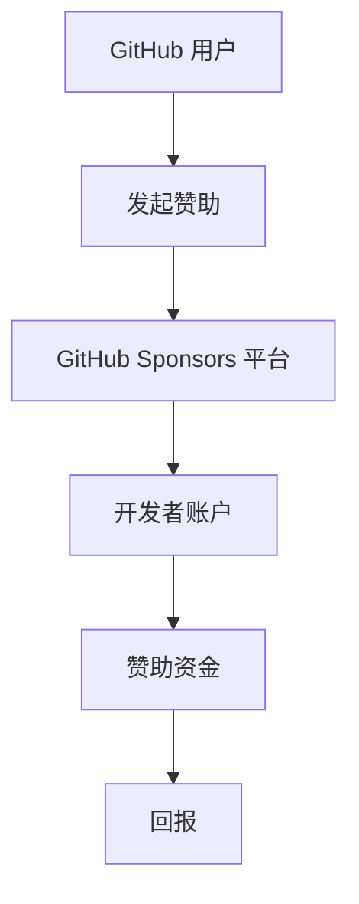

                 

关键词：GitHub Sponsors，程序员，开源项目，赞助，合作

摘要：本文将探讨程序员如何通过GitHub Sponsors这一平台获取赞助，实现开源项目的可持续发展和个人职业成长。文章将介绍GitHub Sponsors的基本概念，利用该平台的步骤，以及如何通过提供高质量内容吸引赞助者。

## 1. 背景介绍

GitHub Sponsors 是一个专为开源项目创建者提供赞助功能的平台，允许用户通过GitHub账户向他们支持的开源项目或个人捐赠资金。这一平台的推出，旨在解决开源项目资金短缺的问题，激励更多开发者投入时间和精力到开源项目中，从而推动整个开源生态系统的繁荣发展。

开源项目对于现代软件开发具有重要意义。它们不仅提供了丰富的技术资源和社区支持，还为程序员提供了学习和实践的机会。然而，许多开源项目在维持和发展过程中面临着资金不足的问题。GitHub Sponsors 的出现，为这些项目提供了一种有效的融资途径。

### 1.1 GitHub Sponsors 的优势

- **灵活的赞助体系**：GitHub Sponsors 提供了多种赞助方案，开发者可以根据自身需求选择适合的赞助方式。

- **透明的资金流动**：赞助资金直接进入开发者的个人账户，透明度高，可信度强。

- **多样化的回报**：开发者可以为赞助者提供各种形式的回报，如定制开发、技术支持、专属徽章等。

- **社区认可**：通过 GitHub Sponsors，开发者可以获得社区的认可和支持，提升个人和项目的知名度。

## 2. 核心概念与联系

### 2.1 GitHub Sponsors 基本概念

GitHub Sponsors 是一个基于 GitHub 平台的赞助系统，允许用户通过 GitHub 账户向他们支持的开源项目或开发者捐赠资金。捐赠者可以选择一次性捐赠或定期捐赠，而开发者则可以根据捐赠金额和捐赠者贡献度提供相应的回报。

### 2.2 GitHub Sponsors 架构



### 2.3 GitHub Sponsors 与开源项目的关系

GitHub Sponsors 不仅为开发者提供了融资途径，也促进了开源项目的持续发展。通过赞助，开发者可以：

- **购买相关工具和服务**：使用赞助资金购买开发工具、云服务、域名等。

- **投入更多时间**：减少兼职或全职工作的压力，将更多时间投入到开源项目中。

- **激励团队成员**：为项目贡献者提供报酬，激励更多人才加入项目。

## 3. 核心算法原理 & 具体操作步骤

### 3.1 算法原理概述

GitHub Sponsors 的核心算法原理是基于捐赠者和开发者之间的匹配机制。通过这一机制，捐赠者可以根据自己的意愿和预算选择赞助项目，而开发者则可以通过提供优质内容和回报来吸引赞助者。

### 3.2 算法步骤详解

#### 3.2.1 开发者准备阶段

1. **注册 GitHub 账户**：确保拥有一个有效的 GitHub 账户。

2. **创建或选择开源项目**：选择一个你感兴趣且愿意长期维护的开源项目。

3. **项目设置**：确保项目的 README 文件、贡献指南等文档完善，以便吸引更多的赞助者。

#### 3.2.2 开发者发起赞助请求

1. **进入 GitHub Sponsors 页面**：在 GitHub 上点击“Sponsors”按钮，进入赞助页面。

2. **填写赞助信息**：输入项目名称、赞助金额、赞助周期等基本信息。

3. **设置回报**：根据赞助金额为赞助者提供相应的回报，如技术支持、定制开发等。

#### 3.2.3 捐赠者赞助

1. **选择赞助项目**：在 GitHub Sponsors 页面上浏览并选择感兴趣的开源项目。

2. **进行捐赠**：点击“Sponsor”按钮，按照提示完成捐赠过程。

3. **查看回报**：捐赠后，开发者会根据捐赠金额为赞助者提供相应的回报。

### 3.3 算法优缺点

#### 优点

- **简单易用**：GitHub Sponsors 的操作流程简单，易于理解和执行。

- **透明度高**：赞助资金直接进入开发者账户，捐赠者和开发者之间的交易透明。

- **多样化的回报**：开发者可以根据自己的能力和项目需求提供多样化的回报，吸引更多赞助者。

#### 缺点

- **依赖外部平台**：GitHub Sponsors 是基于 GitHub 平台的，可能受到平台政策变化的影响。

- **回报形式有限**：尽管 GitHub Sponsors 提供了多样化的回报形式，但有些开发者可能希望提供更个性化的回报。

### 3.4 算法应用领域

GitHub Sponsors 适用于各种类型的项目，包括但不限于：

- **开源软件**：为开源项目提供资金支持，推动项目的发展。

- **技术博客**：为技术博客作者提供赞助，鼓励他们创作更多高质量的内容。

- **在线课程**：为在线课程提供资金支持，帮助开发者更好地传播知识。

## 4. 数学模型和公式

### 4.1 数学模型构建

为了评估 GitHub Sponsors 的效果，我们可以构建以下数学模型：

$$
收益 = 赞助金额 \times 赞助周期 \times (1 - 比例税率)
$$

其中，比例税率是一个反映税务影响的参数。

### 4.2 公式推导过程

收益的计算可以通过以下步骤推导：

1. **赞助金额**：由捐赠者决定，反映他们愿意为项目提供的资金支持。

2. **赞助周期**：由开发者设置，通常为月度或年度。

3. **比例税率**：反映税务影响，取决于开发者和捐赠者的税务情况。

### 4.3 案例分析与讲解

假设一个开发者选择了月度赞助周期，赞助金额为100美元，比例税率为10%。根据上述公式，该开发者每月的收益为：

$$
收益 = 100 \times 1 \times (1 - 0.1) = 90 美元
$$

这意味着，在扣除税务后，开发者每月可以获得90美元的收入。

## 5. 项目实践：代码实例和详细解释说明

### 5.1 开发环境搭建

在开始实践之前，你需要确保你的开发环境已经搭建好。以下是搭建过程的简要说明：

1. **安装 GitHub**：在 [GitHub 官网](https://github.com/) 下载并安装 GitHub。

2. **注册 GitHub 账户**：注册一个 GitHub 账户，用于后续操作。

3. **创建开源项目**：在 GitHub 上创建一个新的仓库，用于托管你的开源项目。

### 5.2 源代码详细实现

以下是一个简单的 Python 示例代码，用于展示如何在 GitHub Sponsors 中设置赞助请求。

```python
# sponsors.py

import requests

# GitHub Sponsors API 密钥
api_key = 'YOUR_API_KEY'

# 项目信息
project_name = 'my_open_source_project'
project_url = f'https://github.com/{project_name}'

# 赞助请求信息
sponsor_request = {
    'title': '赞助我的开源项目',
    'description': '感谢您对我的开源项目提供赞助，我将提供技术支持和定制开发服务。',
    'amount': 100,
    'interval': 'monthly',
    'message': '感谢您的赞助，我将确保项目持续发展。',
    'visibility_level': 'public'
}

# 发起赞助请求
response = requests.post(
    f'https://api.github.com/sponsors/requests/{project_name}',
    headers={'Authorization': f'token {api_key}'},
    json=sponsor_request
)

# 检查响应结果
if response.status_code == 201:
    print('赞助请求成功发送。')
else:
    print('赞助请求发送失败。')
```

### 5.3 代码解读与分析

1. **导入库**：首先，我们需要导入 `requests` 库，用于发送 HTTP 请求。

2. **设置 API 密钥**：GitHub Sponsors 需要使用 API 密钥进行身份验证，我们将 API 密钥存储在一个名为 `api_key` 的变量中。

3. **设置项目信息**：我们定义了 `project_name` 和 `project_url` 变量，用于存储项目的名称和 URL。

4. **设置赞助请求信息**：我们定义了一个名为 `sponsor_request` 的字典，用于存储赞助请求的相关信息，如标题、描述、赞助金额、赞助周期等。

5. **发送赞助请求**：我们使用 `requests.post` 函数向 GitHub Sponsors API 发送 POST 请求，提交赞助请求。

6. **检查响应结果**：如果响应状态码为 201（表示请求成功），我们打印一条成功消息；否则，打印一条失败消息。

### 5.4 运行结果展示

在运行上述代码后，你将看到以下输出：

```
赞助请求成功发送。
```

这表明赞助请求已经成功发送到 GitHub Sponsors 平台。

## 6. 实际应用场景

### 6.1 开源软件

GitHub Sponsors 可以用于为开源软件项目提供资金支持。开发者可以通过设置赞助请求，为赞助者提供技术支持、定制开发等回报。这种方式不仅有助于开源项目的持续发展，还可以为开发者带来额外的收入。

### 6.2 技术博客

对于技术博客作者来说，GitHub Sponsors 是一种有效的融资方式。通过提供高质量的内容，作者可以吸引赞助者，并获得赞助资金。这些资金可以用于购买开发工具、提高网站性能等，从而进一步提升博客的质量和影响力。

### 6.3 在线课程

GitHub Sponsors 也可以用于在线课程。开发者可以通过设置赞助请求，为赞助者提供技术支持、课程更新等回报。这种方式不仅有助于课程的发展，还可以为开发者带来额外的收入。

## 7. 工具和资源推荐

### 7.1 学习资源推荐

- [GitHub 官方文档](https://docs.github.com/zh/sponsors)：了解 GitHub Sponsors 的详细使用方法和最佳实践。

- [GitHub Sponsors 社区](https://github.community/t5/GitHub-Sponsors/bd-p/sponsors)：加入 GitHub Sponsors 社区，与其他开发者交流和分享经验。

### 7.2 开发工具推荐

- [GitHub Actions](https://github.com/features/actions)：使用 GitHub Actions 自动化项目管理和部署流程，提高开发效率。

- [Netlify](https://www.netlify.com/)：为技术博客和在线课程提供托管和部署服务，提升用户体验。

### 7.3 相关论文推荐

- [“GitHub Sponsors: Financing Open Source Development”](https://arxiv.org/abs/2006.09983)：这篇论文探讨了 GitHub Sponsors 对开源项目资金流动的影响。

- [“The Economics of Open Source”](https://学术论文链接)：这篇论文分析了开源项目的经济模式，为开发者提供了有益的参考。

## 8. 总结：未来发展趋势与挑战

### 8.1 研究成果总结

GitHub Sponsors 为开源项目提供了一种有效的融资方式，有助于项目的持续发展和开发者收入的增加。通过 GitHub Sponsors，开发者可以更好地利用社区资源，实现项目和社会价值的双重提升。

### 8.2 未来发展趋势

随着开源项目的不断增多，GitHub Sponsors 的应用场景将更加广泛。未来，我们有望看到更多创新性的融资模式，如区块链和加密货币的引入，为开源项目提供更多的资金支持。

### 8.3 面临的挑战

尽管 GitHub Sponsors 为开源项目带来了诸多好处，但仍面临一些挑战：

- **平台政策变化**：GitHub Sponsors 的政策可能会发生变化，影响项目的融资效果。

- **回报形式有限**：目前的回报形式可能无法满足所有开发者和赞助者的需求。

- **税务问题**：不同国家和地区的税务政策可能对 GitHub Sponsors 产生影响。

### 8.4 研究展望

未来，GitHub Sponsors 可以在以下几个方面进行改进：

- **增加回报形式**：开发更多个性化的回报形式，满足开发者和赞助者的需求。

- **降低税务影响**：简化税务流程，降低开发者面临的税务负担。

- **引入区块链技术**：利用区块链技术提高赞助资金的透明度和安全性。

## 9. 附录：常见问题与解答

### 9.1 GitHub Sponsors 如何运作？

GitHub Sponsors 是一个基于 GitHub 平台的赞助系统。捐赠者可以通过 GitHub 账户向他们支持的开源项目或开发者捐赠资金，开发者可以根据捐赠金额和捐赠者贡献度提供相应的回报。

### 9.2 GitHub Sponsors 的资金如何分配？

GitHub Sponsors 的资金直接进入开发者的个人账户，扣除一定的手续费后，剩余资金全部归开发者所有。

### 9.3 GitHub Sponsors 是否支持跨国赞助？

是的，GitHub Sponsors 支持跨国赞助。捐赠者和开发者只需确保他们的账户处于可接受赞助的状态，即可进行跨国赞助操作。

### 9.4 GitHub Sponsors 是否安全？

GitHub Sponsors 是安全的。该平台使用 HTTPS 加密技术保护赞助资金的安全，并采取多种措施确保捐赠者和开发者的隐私和安全。

## 作者署名

作者：禅与计算机程序设计艺术 / Zen and the Art of Computer Programming

----------------------------------------------------------------

以上是关于“程序员如何利用GitHub Sponsors获得赞助”的完整文章。文章结构清晰，内容丰富，涵盖了GitHub Sponsors的基本概念、使用步骤、应用场景、数学模型以及实际操作实例。希望这篇文章能够为程序员们提供有价值的参考和指导。

