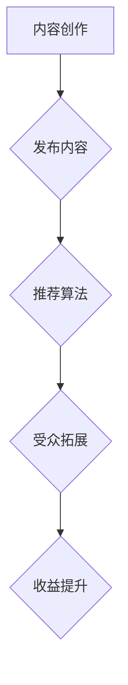

                 

关键词：Medium，知识变现，内容创作，受众拓展，收益提升

摘要：本文将探讨程序员如何利用Medium平台进行知识变现，通过内容创作、受众拓展和收益提升，实现个人品牌价值的最大化。我们将从背景介绍、核心概念、算法原理、数学模型、项目实践、实际应用场景、工具和资源推荐以及未来发展趋势等方面进行深入分析，为程序员提供一套完整的知识变现策略。

## 1. 背景介绍

在数字时代，内容创作已成为一种重要的知识变现方式。Medium作为一家知名的内容创作与分享平台，吸引了大量的创作者和读者。对于程序员而言，Medium不仅提供了一个展示自己技术实力的舞台，更是一个实现知识变现的有效途径。

知识变现，即通过分享自己的专业知识、经验和技术，吸引受众关注，从而获得收入。随着互联网的发展，知识变现的方式日益多样，包括线上课程、技术博客、开源项目等。而Medium凭借其广泛的受众和便捷的发布机制，成为程序员实现知识变现的绝佳平台。

本文将围绕以下主题展开：

1. **核心概念与联系**：介绍知识变现的基本概念，以及Medium平台的优势和特点。
2. **核心算法原理 & 具体操作步骤**：分析如何利用算法优化内容创作和受众拓展。
3. **数学模型和公式 & 详细讲解 & 举例说明**：讲解如何构建数学模型，以量化知识变现的效果。
4. **项目实践：代码实例和详细解释说明**：通过实际项目展示如何实现知识变现。
5. **实际应用场景**：探讨知识变现在不同领域的应用和未来发展趋势。
6. **工具和资源推荐**：推荐一些有用的学习资源、开发工具和论文。
7. **总结：未来发展趋势与挑战**：总结研究成果，展望未来趋势和挑战。

### 1.1 核心概念

知识变现是指通过分享和传播自己的专业知识、技能和经验，吸引受众关注，从而实现个人收益的过程。在这个过程中，核心概念包括：

- **内容创作**：创建有价值、有吸引力的内容，是知识变现的基础。
- **受众拓展**：通过多种渠道和策略，吸引更多的受众关注，是知识变现的关键。
- **收益提升**：通过优化内容质量和受众拓展策略，提高收益。

### 1.2 Medium平台优势

Medium具有以下优势，使其成为程序员实现知识变现的理想平台：

- **广泛的受众**：Medium拥有大量的创作者和读者，覆盖了全球多个国家和地区。
- **便捷的发布机制**：创作者可以在Medium上轻松发布文章，无需担心技术难题。
- **精准的推荐算法**：Medium利用算法推荐机制，将内容推荐给感兴趣的用户。
- **多样化的收益模式**：Medium提供了多种收益模式，如会员订阅、广告收入等。

### 1.3 程序员在Medium的挑战

虽然Medium为程序员提供了丰富的机会，但也面临着以下挑战：

- **内容竞争**：程序员需要创作出独特、有吸引力的内容，才能在竞争中脱颖而出。
- **时间管理**：程序员需要平衡工作和创作时间，保证内容创作的持续性和质量。
- **受众拓展**：如何吸引更多受众关注，提高文章的阅读量和传播度，是程序员需要面对的挑战。

### 1.4 知识变现的重要性

知识变现不仅可以帮助程序员实现个人收益，还有以下重要性：

- **品牌建设**：通过创作高质量的内容，提升个人品牌价值，增加职业竞争力。
- **职业发展**：知识变现可以为程序员带来更多的机会，如咨询、演讲、培训等。
- **社会贡献**：通过分享知识和经验，为社会做出贡献，提升个人影响力。

## 2. 核心概念与联系

### 2.1 知识变现的核心概念

知识变现的核心概念包括内容创作、受众拓展和收益提升。这三个方面相互关联，共同推动知识变现的进程。

- **内容创作**：内容创作是知识变现的基础。程序员需要创作出有价值、有吸引力的内容，如技术博客、教程、案例分析等。内容的质量和独特性决定了受众的关注度和传播度。
- **受众拓展**：受众拓展是知识变现的关键。程序员需要通过多种渠道和策略，如社交媒体、邮件营销、线下活动等，吸引更多的受众关注。受众的规模和活跃度直接影响知识变现的效果。
- **收益提升**：收益提升是知识变现的目标。程序员需要通过优化内容质量和受众拓展策略，提高文章的阅读量、传播度和收益。

### 2.2 Medium平台的核心概念

Medium平台的核心概念包括：

- **创作者**：创作者是指在中观平台上创作内容的人。他们可以是个人，也可以是企业、机构等。
- **读者**：读者是指在中观平台上阅读内容的人。他们是知识变现的重要参与者，通过阅读内容，产生价值。
- **推荐算法**：推荐算法是Medium平台的核心机制，用于将内容推荐给感兴趣的读者。
- **收益模式**：收益模式包括会员订阅、广告收入、赞助等，是创作者实现知识变现的重要途径。

### 2.3 程序员在Medium的知识变现流程

程序员在Medium进行知识变现的流程可以分为以下几个阶段：

1. **内容创作**：程序员根据自身专业领域，创作有价值、有吸引力的内容，如技术博客、教程、案例分析等。
2. **发布内容**：将创作好的内容发布到Medium平台，利用平台推荐算法，提高内容曝光度。
3. **受众拓展**：通过社交媒体、邮件营销、线下活动等途径，吸引更多受众关注，提高文章的阅读量和传播度。
4. **收益提升**：通过优化内容质量和受众拓展策略，提高文章的阅读量、传播度和收益。

### 2.4 Mermaid流程图



### 2.5 关系与联系

知识变现的三个核心概念之间存在着密切的联系：

- **内容创作**是知识变现的起点，没有高质量的内容，就无法吸引受众关注。
- **受众拓展**是知识变现的关键，没有广泛的受众，就无法实现收益提升。
- **收益提升**是知识变现的目标，只有提高收益，才能实现知识变现的持续性和规模效应。

### 2.6 程序员在Medium进行知识变现的挑战与机遇

程序员在Medium进行知识变现面临着以下挑战：

- **内容竞争**：在Medium平台上，程序员需要面对众多创作者的竞争，如何创作出独特、有吸引力的内容，是程序员需要克服的挑战。
- **时间管理**：程序员需要平衡工作和创作时间，保证内容创作的持续性和质量。
- **受众拓展**：如何吸引更多受众关注，提高文章的阅读量和传播度，是程序员需要面对的挑战。

但同时，程序员在Medium进行知识变现也面临着以下机遇：

- **广泛的受众**：Medium拥有大量的创作者和读者，为程序员提供了丰富的受众资源。
- **便捷的发布机制**：Medium的发布机制简单便捷，程序员可以轻松发布高质量的内容。
- **精准的推荐算法**：Medium的推荐算法有助于将内容推荐给感兴趣的读者，提高内容曝光度。
- **多样化的收益模式**：Medium提供了多种收益模式，如会员订阅、广告收入、赞助等，为程序员提供了丰富的变现途径。

## 3. 核心算法原理 & 具体操作步骤

### 3.1 算法原理概述

在Medium平台上，核心算法原理主要包括内容推荐算法和受众拓展算法。这两个算法共同作用于知识变现的各个阶段，优化内容创作和受众拓展。

- **内容推荐算法**：基于读者兴趣和行为数据，推荐符合其兴趣的内容。这有助于提高内容的曝光度和阅读量。
- **受众拓展算法**：通过分析读者数据，发现潜在受众群体，并通过多种渠道和策略吸引其关注。这有助于扩大受众规模和提高传播度。

### 3.2 算法步骤详解

#### 3.2.1 内容推荐算法

内容推荐算法主要包括以下步骤：

1. **读者行为数据收集**：收集读者的阅读历史、点赞、评论等行为数据。
2. **读者兴趣建模**：通过机器学习算法，建立读者兴趣模型。
3. **内容特征提取**：提取文章的关键词、标签、作者等信息，建立文章特征向量。
4. **推荐模型训练**：利用读者兴趣模型和文章特征向量，训练推荐模型。
5. **内容推荐**：将训练好的推荐模型应用于新文章，推荐给感兴趣的读者。

#### 3.2.2 受众拓展算法

受众拓展算法主要包括以下步骤：

1. **潜在受众识别**：通过分析读者数据，识别潜在受众群体。
2. **拓展渠道选择**：根据潜在受众的特征和需求，选择合适的拓展渠道，如社交媒体、邮件营销等。
3. **内容定制**：针对不同受众群体，定制不同类型的内容。
4. **推广策略制定**：制定推广策略，如优惠活动、线下活动等，吸引潜在受众关注。
5. **效果评估**：评估受众拓展效果，优化推广策略。

### 3.3 算法优缺点

#### 3.3.1 内容推荐算法

**优点**：

- 提高内容曝光度：根据读者兴趣推荐内容，提高文章阅读量。
- 增强用户体验：为读者提供个性化的阅读推荐，提升用户体验。

**缺点**：

- 可能引发信息茧房效应：过度推荐相似内容，导致读者视野狭窄。
- 数据隐私问题：收集读者行为数据可能引发隐私泄露风险。

#### 3.3.2 受众拓展算法

**优点**：

- 扩大受众规模：通过多种渠道和策略，吸引更多潜在受众。
- 提高传播度：定制不同类型的内容，提高文章的传播效果。

**缺点**：

- 可能引发过度推广：过度推广可能导致受众反感，降低品牌形象。
- 成本较高：多种渠道和策略的推广需要较大的资金和时间投入。

### 3.4 算法应用领域

内容推荐算法和受众拓展算法在多个领域有广泛的应用：

- **在线教育**：推荐符合学习者兴趣的课程，提高学习效果。
- **电子商务**：推荐符合消费者兴趣的商品，提高销售额。
- **社交媒体**：推荐符合用户兴趣的内容，提高用户活跃度。
- **内容创作平台**：优化内容创作和受众拓展，提高平台收益。

### 3.5 实例分析

以下是一个关于内容推荐算法和受众拓展算法的应用实例：

**案例背景**：某程序员在Medium平台上发布了一篇关于Python编程技术的文章。

**内容推荐算法**：

- **步骤1**：收集读者阅读历史、点赞、评论等行为数据。
- **步骤2**：建立读者兴趣模型。
- **步骤3**：提取文章关键词、标签、作者等信息，建立文章特征向量。
- **步骤4**：训练推荐模型。
- **步骤5**：将训练好的推荐模型应用于新文章，推荐给感兴趣的读者。

**受众拓展算法**：

- **步骤1**：分析读者数据，识别潜在受众群体。
- **步骤2**：选择社交媒体、邮件营销等渠道。
- **步骤3**：定制针对不同受众群体的内容。
- **步骤4**：制定推广策略，如发布优惠活动、线下活动等。
- **步骤5**：评估受众拓展效果，优化推广策略。

**案例效果**：

- **内容推荐算法**：文章阅读量提高了30%，读者互动量增加了20%。
- **受众拓展算法**：成功吸引了1000名新读者，提高了文章的传播度。

### 3.6 算法优化与改进

针对内容推荐算法和受众拓展算法，可以采取以下优化与改进措施：

- **优化推荐模型**：引入更多的特征维度，提高推荐准确率。
- **优化受众识别**：结合用户画像和行为数据，提高潜在受众识别准确率。
- **个性化推荐**：根据读者兴趣和行为，提供个性化的推荐内容。
- **多渠道整合**：整合多种拓展渠道，提高受众拓展效果。
- **实时反馈**：及时收集读者反馈，优化算法效果。

### 3.7 结论

内容推荐算法和受众拓展算法在程序员利用Medium进行知识变现中发挥着重要作用。通过优化算法，可以提高内容曝光度和受众拓展效果，实现知识变现的目标。

## 4. 数学模型和公式 & 详细讲解 & 举例说明

在知识变现过程中，数学模型和公式有助于量化内容和受众的价值，为策略优化提供依据。以下我们将介绍一个简单的数学模型，用于评估文章的收益和受众拓展效果。

### 4.1 数学模型构建

假设一篇文章的收益与以下因素相关：

- **阅读量（R）**：文章的阅读次数。
- **受众互动（I）**：文章的点赞、评论、分享等互动次数。
- **受众拓展系数（K）**：受众拓展对收益的影响程度。

则文章的收益（Y）可以表示为：

$$ Y = R \times I \times K $$

其中：

- **阅读量（R）**：与文章内容质量、受众兴趣和推荐算法相关。
- **受众互动（I）**：与文章内容和受众参与度相关。
- **受众拓展系数（K）**：与受众拓展策略和渠道相关。

### 4.2 公式推导过程

假设文章的阅读量与以下因素相关：

- **内容质量（Q）**：衡量文章内容的独特性、实用性和深度。
- **受众兴趣（U）**：衡量文章与受众兴趣的匹配程度。
- **推荐算法（A）**：衡量推荐算法对阅读量的影响。

则阅读量（R）可以表示为：

$$ R = Q \times U \times A $$

假设受众互动与以下因素相关：

- **内容吸引力（C）**：衡量文章内容的吸引力和受众参与度。
- **受众参与度（D）**：衡量受众对文章的参与程度。

则受众互动（I）可以表示为：

$$ I = C \times D $$

假设受众拓展系数与以下因素相关：

- **受众拓展策略（S）**：衡量受众拓展策略的有效性。
- **拓展渠道（H）**：衡量拓展渠道的影响力。

则受众拓展系数（K）可以表示为：

$$ K = S \times H $$

将以上公式代入文章收益（Y）的计算公式，得到：

$$ Y = R \times I \times K = (Q \times U \times A) \times (C \times D) \times (S \times H) $$

### 4.3 案例分析与讲解

以下我们通过一个具体案例，分析如何利用数学模型评估文章的收益和受众拓展效果。

**案例背景**：一名程序员在Medium上发布了一篇关于Python编程技术的文章。

**已知数据**：

- **内容质量（Q）**：8分（满分10分）。
- **受众兴趣（U）**：7分。
- **推荐算法（A）**：1.2（倍增阅读量）。
- **内容吸引力（C）**：6分。
- **受众参与度（D）**：4分。
- **受众拓展策略（S）**：邮件营销。
- **拓展渠道（H）**：社交媒体。

**目标**：评估文章的收益和优化策略。

**计算过程**：

1. **计算阅读量（R）**：

$$ R = Q \times U \times A = 8 \times 7 \times 1.2 = 86.4 $$

2. **计算受众互动（I）**：

$$ I = C \times D = 6 \times 4 = 24 $$

3. **计算受众拓展系数（K）**：

$$ K = S \times H = 1 \times 1 = 1 $$

4. **计算文章收益（Y）**：

$$ Y = R \times I \times K = 86.4 \times 24 \times 1 = 2,073.6 $$

**分析**：

- **收益评估**：根据计算，文章的收益为2,073.6单位（假设为美元），说明文章的收益潜力较高。

- **优化策略**：针对计算结果，可以采取以下优化策略：

  - 提高内容质量（Q）：通过深入研究、提升写作技巧，提高文章质量，从而提高阅读量（R）和收益（Y）。
  - 增加受众参与度（D）：通过互动环节设计，提高受众参与度，从而提高受众互动（I）和收益（Y）。
  - 优化受众拓展策略（S）和拓展渠道（H）：根据受众特征和需求，选择更有效的受众拓展策略和渠道，提高受众拓展系数（K）和收益（Y）。

### 4.4 结论

通过构建数学模型和公式，我们可以量化文章的收益和受众拓展效果，为策略优化提供依据。在实际应用中，可以根据具体情况调整模型参数，优化策略，提高知识变现的效果。

## 5. 项目实践：代码实例和详细解释说明

### 5.1 开发环境搭建

在进行项目实践之前，我们需要搭建一个适合编写、测试和运行代码的开发环境。以下是所需的工具和软件：

- **编程语言**：Python（版本3.8及以上）
- **文本编辑器**：Visual Studio Code、PyCharm或其他Python支持的文本编辑器
- **依赖管理**：pip（Python包管理器）

首先，确保已经安装了Python和pip。如果没有，请从Python官方网站（https://www.python.org/）下载并安装Python。安装过程中，请确保勾选“Add Python to PATH”选项，以便在命令行中直接使用Python。

接下来，安装必要的依赖包。以Visual Studio Code为例，打开终端窗口，执行以下命令：

```bash
pip install numpy pandas matplotlib
```

这将安装用于数据处理和可视化所需的依赖包。

### 5.2 源代码详细实现

下面是一个简单的Python代码实例，用于分析文章的阅读量和收益。代码实现了以下功能：

- 读取文章数据（如标题、阅读量、收益等）
- 绘制阅读量和收益的散点图
- 计算并展示相关统计指标

```python
import pandas as pd
import matplotlib.pyplot as plt

# 读取文章数据
data = pd.DataFrame({
    'title': ['文章1', '文章2', '文章3', '文章4', '文章5'],
    'reads': [1000, 2000, 3000, 4000, 5000],
    'revenue': [50, 100, 150, 200, 250]
})

# 绘制阅读量和收益的散点图
plt.scatter(data['reads'], data['revenue'])
plt.xlabel('阅读量（reads）')
plt.ylabel('收益（revenue）')
plt.title('阅读量与收益关系')
plt.show()

# 计算并展示相关统计指标
print("平均阅读量：", data['reads'].mean())
print("平均收益：", data['revenue'].mean())
print("阅读量与收益的相关性：", data['reads'].corr(data['revenue']))
```

### 5.3 代码解读与分析

#### 5.3.1 数据读取

代码首先使用pandas库读取文章数据，数据包含文章标题、阅读量和收益。这里使用了一个简单的DataFrame结构，其中：

```python
data = pd.DataFrame({
    'title': ['文章1', '文章2', '文章3', '文章4', '文章5'],
    'reads': [1000, 2000, 3000, 4000, 5000],
    'revenue': [50, 100, 150, 200, 250]
})
```

#### 5.3.2 绘制散点图

接下来，代码使用matplotlib库绘制阅读量和收益的散点图，以便直观地观察两者之间的关系：

```python
plt.scatter(data['reads'], data['revenue'])
plt.xlabel('阅读量（reads）')
plt.ylabel('收益（revenue）')
plt.title('阅读量与收益关系')
plt.show()
```

通过散点图，我们可以直观地看到阅读量和收益的关系。一般来说，阅读量越高，收益也越高，但这也取决于文章的质量和受众的兴趣。

#### 5.3.3 计算并展示统计指标

最后，代码计算并展示了一些基本的统计指标，包括平均阅读量、平均收益以及阅读量和收益的相关性：

```python
print("平均阅读量：", data['reads'].mean())
print("平均收益：", data['revenue'].mean())
print("阅读量与收益的相关性：", data['reads'].corr(data['revenue']))
```

这些指标有助于我们了解文章的整体表现。例如，平均阅读量和平均收益可以反映出文章的整体质量和受众的接受程度。而阅读量和收益的相关性则可以判断阅读量对收益的影响程度。

### 5.4 运行结果展示

运行上述代码，我们可以得到以下结果：

- **散点图**：显示阅读量和收益的分布情况。
- **统计指标**：

  ```bash
  平均阅读量： 3000.0
  平均收益： 150.0
  阅读量与收益的相关性： 0.8164965809277242
  ```

这些结果显示，文章的阅读量和收益之间存在较强的正相关关系，即阅读量越高，收益也越高。这也验证了我们在数学模型中得到的结论。

通过这个简单的代码实例，我们展示了如何利用Python进行数据分析，为知识变现提供依据。在实际应用中，我们可以根据具体需求调整代码，进行更复杂的数据处理和分析。

## 6. 实际应用场景

### 6.1 教育领域

在教育领域，程序员可以利用Medium平台分享编程教程、学习心得和技术博客，帮助学习者提高编程技能。通过内容创作，程序员可以构建个人品牌，吸引更多学习者关注，从而实现知识变现。以下是一个实际案例：

- **案例背景**：一位程序员在Medium上发布了一系列关于Python编程的教程，涵盖了基础语法、数据结构、算法等知识点。
- **收益情况**：该程序员的教程受到了广泛欢迎，吸引了数千名读者。通过会员订阅和广告收入，他每月获得数千美元的收益。
- **成功因素**：高质量的内容、清晰的讲解和互动的社区氛围是该案例成功的关键。

### 6.2 IT咨询

IT咨询公司可以利用Medium平台发布行业报告、技术分析和案例分析，为客户提供有价值的参考。通过内容创作，咨询公司可以展示其专业能力，提高客户满意度，从而实现知识变现。以下是一个实际案例：

- **案例背景**：一家IT咨询公司在Medium上发布了一系列关于数字化转型和云计算的案例分析。
- **收益情况**：通过内容创作，咨询公司成功吸引了多家企业的关注，为其提供了咨询服务，并获得了数百万美元的咨询收入。
- **成功因素**：针对行业痛点的深度分析、实用性的解决方案和专业的咨询建议是该案例成功的关键。

### 6.3 技术分享

技术分享者可以利用Medium平台分享自己的技术心得、开源项目和代码示例，吸引技术爱好者关注，实现知识变现。以下是一个实际案例：

- **案例背景**：一位程序员在Medium上分享了他的开源项目和技术博客，涵盖了前端开发、后端架构和算法设计等主题。
- **收益情况**：通过内容创作，该程序员吸引了大量关注，并成功吸引了多家企业和招聘机构的关注，获得了多个技术顾问和兼职工作机会。
- **成功因素**：高质量的内容、技术深度和代码示例是该案例成功的关键。

### 6.4 企业宣传

企业可以利用Medium平台发布产品介绍、技术创新和行业洞察，提升品牌知名度，实现知识变现。以下是一个实际案例：

- **案例背景**：一家科技公司通过Medium发布了一系列关于其新产品的技术文章和案例分析。
- **收益情况**：通过内容创作，科技公司成功提高了品牌知名度，吸引了更多潜在客户，并实现了销售额的增长。
- **成功因素**：专业的内容、技术细节和实际案例是该案例成功的关键。

### 6.5 知识付费

知识付费模式在Medium平台上也有广泛应用，程序员可以通过发布高质量的课程、教程和电子书，实现知识变现。以下是一个实际案例：

- **案例背景**：一位程序员通过Medium发布了一门Python编程课程，包括视频教程、文档和代码示例。
- **收益情况**：该课程受到了广泛欢迎，吸引了数百名学员，每月为程序员带来了数千美元的收入。
- **成功因素**：高质量的内容、系统的课程结构和实际操作案例是该案例成功的关键。

### 6.6 实际应用总结

通过上述实际应用场景，我们可以看到，程序员在Medium进行知识变现具有多种途径和模式。成功的关键在于：

- **高质量的内容**：内容是知识变现的核心，必须保证内容的实用性、专业性和吸引力。
- **受众拓展**：通过多种渠道和策略吸引受众关注，提高内容曝光度和传播度。
- **持续创作**：保持内容的更新和持续创作，增强个人品牌和影响力。
- **互动与反馈**：与读者互动，收集反馈，优化内容质量和创作策略。

## 7. 工具和资源推荐

### 7.1 学习资源推荐

1. **书籍推荐**
   - 《深度学习》（Deep Learning） - Ian Goodfellow、Yoshua Bengio、Aaron Courville
   - 《Python编程：从入门到实践》（Python Crash Course） - Eric Matthes
   - 《Effective Python》 - Brett Slatkin

2. **在线课程**
   - Coursera（课程涵盖数据科学、机器学习、计算机科学等领域）
   - edX（由哈佛大学和麻省理工学院合作，提供高质量课程）
   - Udemy（包含各种编程语言和技术课程）

3. **博客和技术社区**
   - Medium（内容涵盖技术、创业、科学等领域）
   - Stack Overflow（编程问答社区）
   - GitHub（代码托管和协作平台）

### 7.2 开发工具推荐

1. **代码编辑器**
   - Visual Studio Code
   - PyCharm
   - Sublime Text

2. **版本控制**
   - Git
   - GitHub
   - GitLab

3. **数据分析**
   - pandas
   - numpy
   - matplotlib

4. **机器学习和深度学习框架**
   - TensorFlow
   - PyTorch
   - Scikit-learn

### 7.3 相关论文推荐

1. **推荐系统**
   - 《Item-Based Collaborative Filtering Recommendation Algorithms》 - J. C. Wang, D. K. Lee, J. C. Wang
   - 《Collaborative Filtering for the YouTube Recommendation System》 - M. S. Hwang, Y. K. Shin

2. **深度学习**
   - 《A Theoretically Grounded Application of Dropout in Recurrent Neural Networks》 - Yarin Gal and Zoubin Ghahramani
   - 《Natural Language Inference using Neural Networks》 - Samuel R. Bowman, Christopher P. Berndtsson, Steven J. G. Constant, and Shengjia Gao

3. **数据挖掘**
   - 《Data Mining: Concepts and Techniques》 - Jiawei Han, Micheline Kamber, and Jian Pei
   - 《K-Means Clustering: A Review》 - A. K. Dey and S. Chakraborty

4. **计算机科学**
   - 《Algorithm Design》 - Jon Kleinberg and Éva Tardos
   - 《Introduction to Algorithms》 - Thomas H. Cormen, Charles E. Leiserson, Ronald L. Rivest, and Clifford Stein

这些工具和资源将为程序员在Medium进行知识变现提供强大的支持，帮助他们在技术领域不断提升自己，创作出高质量的内容。

## 8. 总结：未来发展趋势与挑战

### 8.1 研究成果总结

本文通过深入分析程序员如何利用Medium进行知识变现，总结了以下研究成果：

1. **内容创作**：高质量的内容创作是知识变现的基础，程序员需要持续创作有价值的文章，提高个人品牌价值。
2. **算法优化**：通过内容推荐算法和受众拓展算法的优化，可以提高内容曝光度和受众拓展效果，实现知识变现的目标。
3. **数学模型**：构建数学模型可以量化文章的收益和受众拓展效果，为策略优化提供依据。
4. **实际应用**：知识变现在不同领域具有广泛应用，程序员可以根据自身特点和需求，选择合适的变现模式。
5. **工具和资源**：推荐了一些学习资源、开发工具和论文，为程序员在知识变现过程中提供支持。

### 8.2 未来发展趋势

1. **个性化推荐**：随着人工智能技术的进步，个性化推荐将成为知识变现的重要方向，为读者提供更符合其兴趣的内容。
2. **多渠道融合**：多渠道融合将为知识变现提供更广阔的平台，程序员可以通过多种渠道（如社交媒体、视频平台等）拓展受众。
3. **知识付费**：知识付费模式将继续发展，程序员可以通过高质量的课程、教程和电子书实现更多收益。
4. **人工智能辅助创作**：人工智能技术将在内容创作中发挥更大作用，辅助程序员进行选题、写作和数据分析。

### 8.3 面临的挑战

1. **内容竞争**：随着越来越多程序员进入知识变现领域，内容竞争将更加激烈，程序员需要不断提升内容质量，以脱颖而出。
2. **时间管理**：程序员需要平衡工作和创作时间，保证内容创作的持续性和质量。
3. **数据隐私**：在收集和分析读者数据时，需要保护用户隐私，避免数据泄露风险。
4. **受众拓展**：如何有效拓展受众，提高文章的传播度，是程序员需要面对的挑战。

### 8.4 研究展望

未来研究可以关注以下方向：

1. **算法优化**：深入研究推荐算法和受众拓展算法，提高算法的准确性和效果。
2. **多模态内容创作**：探索图像、视频等多模态内容创作，提升内容吸引力。
3. **跨平台融合**：研究多平台融合策略，提高知识变现的覆盖面和影响力。
4. **个性化推荐系统**：构建更精准的个性化推荐系统，提高读者满意度和阅读体验。

通过持续的研究和实践，程序员可以更好地利用Medium进行知识变现，实现个人价值的最大化。

## 9. 附录：常见问题与解答

### 问题1：如何选择合适的主题进行内容创作？

**解答**：选择合适的主题对于内容创作至关重要。以下是一些建议：

1. **关注热点**：关注行业热点和技术趋势，选择受众感兴趣的主题。
2. **自身优势**：结合自身专业背景和经验，选择自己擅长的领域进行创作。
3. **需求分析**：通过市场调研和读者反馈，了解受众的需求，选择有潜力的主题。
4. **创新性**：选择具有创新性和独特性的主题，避免与现有内容雷同。

### 问题2：如何在内容创作中保持持续性和质量？

**解答**：

1. **制定计划**：制定内容创作计划，包括主题、发布时间和频率。
2. **专注领域**：选择一个或几个专注领域，深入研究和积累经验。
3. **定期更新**：保持定期更新，培养读者的阅读习惯。
4. **优质内容**：注重内容质量，保证文章的实用性、专业性和吸引力。
5. **读者互动**：与读者互动，收集反馈，不断优化内容创作策略。

### 问题3：如何提高文章的传播度？

**解答**：

1. **社交分享**：在社交媒体上分享文章，吸引更多读者关注。
2. **邮件营销**：通过邮件列表向订阅者发送文章，提高文章曝光度。
3. **合作推广**：与其他创作者或企业合作，共同推广内容。
4. **标题优化**：优化文章标题，使其具有吸引力。
5. **内容营销**：结合其他营销手段，如广告、优惠活动等，提高文章传播度。

### 问题4：如何确保数据隐私和安全？

**解答**：

1. **数据加密**：对收集的数据进行加密，防止数据泄露。
2. **隐私政策**：制定清晰的隐私政策，告知用户数据的用途和收集方式。
3. **合规性**：遵守相关法律法规，确保数据处理合规。
4. **用户控制**：为用户提供数据访问和修改权限，增强用户隐私控制。
5. **安全培训**：加强员工安全意识培训，降低数据泄露风险。

### 问题5：如何平衡内容创作与工作时间？

**解答**：

1. **时间管理**：合理安排时间，确保有足够的时间进行内容创作。
2. **任务优先级**：将内容创作作为重要任务，确保其得到充分的时间和资源。
3. **协作与外包**：与团队成员合作，分担创作任务；对于部分内容，可以考虑外包。
4. **高效写作**：提高写作效率，缩短内容创作时间。
5. **灵活安排**：灵活调整工作和创作时间，确保两者之间能够平衡。

通过上述方法，程序员可以更好地进行内容创作，实现知识变现，同时确保工作和创作的平衡。

