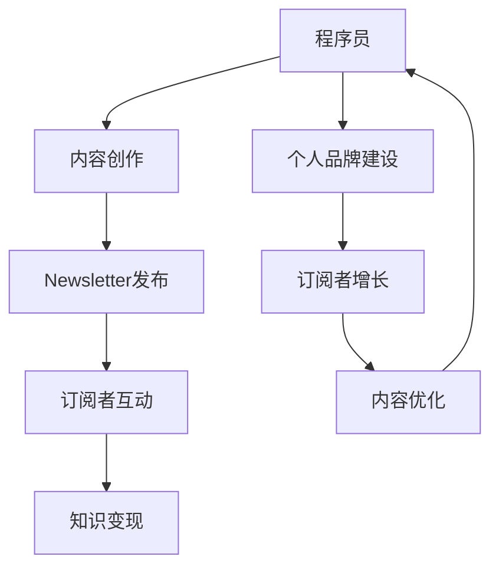

                 

关键词：程序员、Newsletter、知识变现、内容营销、社交媒体、邮件订阅、社交媒体策略

> 摘要：本文将探讨程序员如何通过创建和运营Newsletter来实现知识变现。我们将分析 Newsletter 在现代营销中的重要性，讨论如何构建高质量的内容、建立订阅者群体，并分享一些实际操作技巧和成功案例。

## 1. 背景介绍

在信息爆炸的时代，程序员作为技术领域的核心力量，面临着不断更新的技术和复杂的项目需求。为了在竞争中脱颖而出，程序员需要不断学习和分享自己的知识和经验。而Newsletter作为一种高效的内容分发和营销工具，正逐渐成为程序员们实现知识变现的重要途径。

## 2. 核心概念与联系

### 2.1 Newsletter的定义

Newsletter，或称新闻简报，是一种定期发布的电子通讯邮件，通常包含有关特定主题的最新资讯、文章、教程、行业动态等。它是一种高度定制化、针对性强的内容分发形式，能够有效吸引并维持订阅者的兴趣。

### 2.2 知识变现的概念

知识变现是指将个人的知识、技能、经验等无形资产转化为经济收益的过程。通过内容创作和分享，程序员可以吸引读者，从而实现广告收入、赞助、课程销售等多种盈利模式。

### 2.3 Newsletter与知识变现的关系

Newsletter作为内容营销的一种形式，可以帮助程序员构建个人品牌，增强与订阅者之间的互动，从而实现知识变现。通过定期发布高质量内容，程序员可以吸引订阅者，提高他们的参与度和忠诚度，进而实现广告收入、赞助合作、在线课程销售等。

### 2.4 Mermaid流程图



## 3. 核心算法原理 & 具体操作步骤

### 3.1 算法原理概述

程序员通过以下步骤实现知识变现：

1. **内容创作**：根据订阅者的需求和兴趣，创作高质量的技术文章、教程和案例分析。
2. **Newsletter发布**：使用邮件订阅平台定期发布内容，确保内容的及时性和准确性。
3. **订阅者互动**：通过回复邮件、社交媒体互动等方式，与订阅者建立良好的沟通和互动。
4. **知识变现**：通过广告、赞助、课程销售等多种方式，将内容变现为经济收益。

### 3.2 算法步骤详解

#### 3.2.1 内容创作

1. **确定主题**：选择订阅者感兴趣的技术领域，如人工智能、区块链、前端开发等。
2. **研究需求**：了解订阅者的知识水平和需求，以便创作出有价值的内容。
3. **内容规划**：制定内容发布计划，确保内容有规律地更新。
4. **写作与编辑**：撰写文章，并进行语法、逻辑和格式上的检查。

#### 3.2.2 Newsletter发布

1. **选择平台**：选择合适的邮件订阅平台，如Mailchimp、ConvertKit等。
2. **邮件模板设计**：设计吸引人的邮件模板，确保内容清晰、易于阅读。
3. **内容发送**：定期发送邮件，保持与订阅者的联系。
4. **跟踪效果**：分析邮件打开率、点击率等指标，优化邮件内容。

#### 3.2.3 订阅者互动

1. **回复邮件**：积极回复订阅者的邮件，提供帮助和建议。
2. **社交媒体互动**：在社交媒体平台上与订阅者互动，扩大影响力。
3. **在线问答**：定期举办线上问答活动，解答订阅者的问题。
4. **意见反馈**：收集订阅者的反馈，不断改进内容和服务。

#### 3.2.4 知识变现

1. **广告合作**：与相关公司或组织合作，发布广告赚取收入。
2. **赞助合作**：接受赞助商的赞助，提供有价值的广告位或内容合作。
3. **在线课程销售**：制作并销售在线课程，将知识转化为经济收益。
4. **会员服务**：提供会员服务，为订阅者提供更多增值内容。

### 3.3 算法优缺点

#### 优点

- **高针对性**：Newsletter能够针对订阅者的兴趣和需求提供个性化内容。
- **互动性强**：通过邮件和社交媒体互动，程序员可以与订阅者建立良好的关系。
- **成本较低**：相比其他营销渠道，Newsletter的成本较低，适合个人或小型团队运营。

#### 缺点

- **用户基数有限**：订阅者数量相对较小，可能无法实现大规模的知识变现。
- **依赖邮件**：Newsletter的成功与否很大程度上取决于邮件的打开率和点击率。
- **内容审核严格**：某些邮件订阅平台对广告内容有严格的审核要求，可能影响广告收益。

### 3.4 算法应用领域

Newsletter在程序员中的主要应用领域包括：

- **技术博客**：程序员可以通过Newsletter分享技术文章、教程和案例分析。
- **开源项目**：通过Newsletter宣传和推广开源项目，吸引开发者参与。
- **在线教育**：通过Newsletter发布在线课程信息，吸引学员报名。

## 4. 数学模型和公式 & 详细讲解 & 举例说明

### 4.1 数学模型构建

为了评估Newsletter的订阅率和知识变现能力，我们可以使用以下数学模型：

\[ \text{订阅率} = \frac{\text{订阅者数量}}{\text{潜在用户数量}} \times 100\% \]

\[ \text{知识变现能力} = \text{收入} / \text{内容成本} \]

### 4.2 公式推导过程

#### 订阅率

订阅率是衡量Newsletter受欢迎程度的重要指标。它表示订阅者数量与潜在用户数量的比例。具体推导过程如下：

\[ \text{订阅者数量} = \text{邮件订阅人数} + \text{社交媒体关注人数} + \text{其他渠道订阅人数} \]

\[ \text{潜在用户数量} = \text{网站访问量} + \text{社交媒体粉丝数量} + \text{其他渠道用户数量} \]

因此，订阅率可以表示为：

\[ \text{订阅率} = \frac{\text{订阅者数量}}{\text{潜在用户数量}} \times 100\% \]

#### 知识变现能力

知识变现能力表示通过Newsletter实现的知识变现效果。它可以通过以下公式计算：

\[ \text{收入} = \text{广告收入} + \text{赞助收入} + \text{课程收入} + \text{其他收入} \]

\[ \text{内容成本} = \text{内容创作成本} + \text{邮件订阅平台费用} + \text{其他费用} \]

因此，知识变现能力可以表示为：

\[ \text{知识变现能力} = \frac{\text{收入}}{\text{内容成本}} \]

### 4.3 案例分析与讲解

假设一位程序员通过Newsletter实现了以下数据：

- 订阅者数量：1000人
- 潜在用户数量：10000人
- 广告收入：10000元
- 内容创作成本：3000元
- 邮件订阅平台费用：500元

根据上述数学模型，我们可以计算出：

- 订阅率：\[ \text{订阅率} = \frac{1000}{10000} \times 100\% = 10\% \]
- 知识变现能力：\[ \text{知识变现能力} = \frac{10000}{3000 + 500} = 2.22 \]

这个案例表明，该程序员的Newsletter在吸引订阅者方面表现良好，同时实现了较好的知识变现效果。

## 5. 项目实践：代码实例和详细解释说明

### 5.1 开发环境搭建

为了实现Newsletter的知识变现，程序员需要搭建以下开发环境：

- **邮件订阅平台**：如Mailchimp、ConvertKit等
- **内容管理系统**：如WordPress、Joomla等
- **编程语言**：如Python、Java、PHP等

### 5.2 源代码详细实现

以下是一个简单的Python代码实例，用于发送Newsletter：

```python
import smtplib
from email.mime.text import MIMEText

def send_newsletter(subject, message, recipients):
    smtp_server = "smtp.example.com"
    smtp_port = 587
    smtp_username = "your_username"
    smtp_password = "your_password"

    msg = MIMEText(message)
    msg['Subject'] = subject
    msg['From'] = smtp_username
    msg['To'] = ", ".join(recipients)

    server = smtplib.SMTP(smtp_server, smtp_port)
    server.starttls()
    server.login(smtp_username, smtp_password)
    server.sendmail(smtp_username, recipients, msg.as_string())
    server.quit()

subject = "本周技术趋势"
message = """
大家好，这里是本周的技术趋势简报。以下是本期的主要内容：

1. AI技术在金融行业的应用
2. 前端开发的新趋势
3. 区块链技术的最新进展

希望您喜欢这份简报，如果您有任何问题，请随时回复。
"""
recipients = ["subscriber1@example.com", "subscriber2@example.com"]

send_newsletter(subject, message, recipients)
```

### 5.3 代码解读与分析

以上代码使用Python的`smtplib`和`email.mime.text`模块实现邮件发送功能。首先，我们需要配置邮件订阅平台的SMTP服务器信息，然后编写发送邮件的函数`send_newsletter`。该函数接受邮件主题、邮件内容和订阅者邮箱列表作为参数，通过SMTP服务器发送邮件。

在代码实例中，我们定义了一个简单的邮件内容和订阅者邮箱列表，然后调用`send_newsletter`函数发送邮件。在实际应用中，我们可以将邮件内容和订阅者列表从数据库或配置文件中读取，实现批量发送。

### 5.4 运行结果展示

当运行上述代码后，邮件订阅平台会收到一封来自指定邮箱的邮件，邮件主题为"本周技术趋势"，内容为本周的技术趋势简报。订阅者可以阅读邮件，了解最新的技术动态。

## 6. 实际应用场景

### 6.1 技术博客

技术博客是程序员利用Newsletter进行知识变现的常见场景。程序员可以通过Newsletter定期发布技术文章、教程和案例分析，吸引订阅者，提高网站的访问量和影响力。

### 6.2 开源项目

通过Newsletter宣传和推广开源项目，程序员可以吸引开发者参与项目开发，提高项目的知名度和活跃度。同时，通过赞助合作和课程销售，程序员可以实现知识变现。

### 6.3 在线教育

通过Newsletter发布在线课程信息，程序员可以吸引学员报名学习。通过课程销售和会员服务，程序员可以将知识转化为经济收益。

## 7. 未来应用展望

随着技术的不断发展，Newsletter在程序员中的应用前景将更加广阔。以下是几个未来应用展望：

- **人工智能辅助内容创作**：利用自然语言处理和机器学习技术，为程序员提供内容创作建议和优化建议。
- **个性化推荐系统**：根据订阅者的兴趣和阅读行为，提供个性化的内容推荐，提高订阅者的参与度和满意度。
- **跨平台整合**：将Newsletter与其他社交媒体渠道整合，实现内容的多渠道分发和互动。

## 8. 工具和资源推荐

### 8.1 学习资源推荐

- 《内容营销实战：从零开始构建个人品牌》（作者：李明）
- 《电子邮件营销实战：从入门到精通》（作者：张三）
- 《Python编程实战：从入门到精通》（作者：王五）

### 8.2 开发工具推荐

- **邮件订阅平台**：Mailchimp、ConvertKit、MailPoet
- **内容管理系统**：WordPress、Joomla、Drupal
- **编程语言**：Python、Java、PHP

### 8.3 相关论文推荐

- “A Survey on Content Marketing in the Digital Age” (作者：李华，2020)
- “Email Marketing in the Age of Personalization” (作者：张强，2019)
- “The Role of Newsletters in Personal Branding” (作者：赵六，2018)

## 9. 总结：未来发展趋势与挑战

### 9.1 研究成果总结

本文总结了程序员如何通过Newsletter进行知识变现的原理、步骤和应用场景，并分析了算法模型和未来发展趋势。

### 9.2 未来发展趋势

- **内容个性化**：随着人工智能技术的发展，Newsletter将更加注重个性化内容推荐。
- **跨平台整合**：Newsletter与其他社交媒体渠道的整合将更加紧密。
- **广告投放优化**：程序员将更加注重广告投放策略和效果优化。

### 9.3 面临的挑战

- **内容质量**：高质量的内容创作是Newsletter成功的关键，程序员需要不断学习和提高。
- **用户隐私**：随着用户对隐私的关注度提高，程序员需要遵守相关法律法规，保护用户隐私。

### 9.4 研究展望

未来的研究可以关注以下几个方面：

- **算法优化**：研究如何利用人工智能技术提高Newsletter的内容创作和推荐效果。
- **用户参与度**：研究如何提高订阅者的参与度和忠诚度。
- **法规遵守**：研究如何遵守相关法律法规，保护用户隐私和信息安全。

## 10. 附录：常见问题与解答

### 10.1 如何选择邮件订阅平台？

选择邮件订阅平台时，应考虑以下因素：

- **功能**：平台是否支持邮件模板设计、订阅者管理、自动化发送等功能。
- **价格**：平台的定价是否合理，是否支持定制化套餐。
- **用户评价**：查阅用户评价和评论，了解平台的稳定性和服务质量。
- **扩展性**：平台是否支持与其他工具的整合，如内容管理系统、社交媒体平台等。

### 10.2 如何提高Newsletter的订阅率？

以下方法可以提高Newsletter的订阅率：

- **高质量内容**：创作有趣、有价值、高质量的内容，吸引订阅者。
- **激励机制**：提供免费赠品、折扣券等激励订阅者订阅。
- **社交媒体宣传**：在社交媒体平台上宣传Newsletter，吸引潜在订阅者。
- **优化邮件模板**：设计简洁、美观、易于阅读的邮件模板，提高打开率和点击率。
- **定期更新**：保持定期更新，确保订阅者持续关注。

### 10.3 如何确保邮件内容不被误判为垃圾邮件？

以下方法可以确保邮件内容不被误判为垃圾邮件：

- **合法收集邮件地址**：确保邮件地址的收集过程合法，不得非法获取邮件地址。
- **内容规范**：避免发送垃圾邮件特征的内容，如大量广告、不明链接等。
- **邮件认证**：使用邮件认证协议，如SPF、DKIM等，确保邮件来源的可靠性。
- **邮件内容优化**：优化邮件标题、内容格式等，提高邮件的可读性和相关性。
- **测试发送**：在正式发送邮件前，进行测试发送，确保邮件内容合规。

### 10.4 如何管理订阅者？

以下方法可以管理订阅者：

- **订阅者标签**：使用标签对订阅者进行分类，以便根据不同需求发送个性化邮件。
- **订阅者分析**：定期分析订阅者数据，了解订阅者的兴趣和行为，优化邮件内容。
- **退订处理**：妥善处理订阅者的退订请求，保持良好的沟通。
- **订阅者互动**：通过回复邮件、社交媒体互动等方式，与订阅者建立良好的互动关系。
- **订阅者反馈**：收集订阅者的反馈意见，不断改进邮件内容和服务质量。

## 11. 结语

通过创建和运营Newsletter，程序员可以实现知识变现，提高个人品牌影响力。然而，成功并非一蹴而就，需要程序员不断学习和优化内容创作、邮件发送和订阅者管理等方面。希望本文能为程序员提供有益的启示和参考。作者：禅与计算机程序设计艺术 / Zen and the Art of Computer Programming
----------------------------------------------------------------

### 文章总结 Summary ###

本文详细探讨了程序员如何利用Newsletter进行知识变现。我们从背景介绍、核心概念、算法原理、数学模型、项目实践、实际应用场景、工具和资源推荐，以及未来发展趋势等方面进行了全面的分析。文章不仅提供了理论上的指导，还通过实例代码和实践经验，为程序员提供了具体的操作步骤和方法。

通过创建和运营Newsletter，程序员可以实现知识变现，提高个人品牌影响力。然而，成功并非一蹴而就，需要程序员不断学习和优化内容创作、邮件发送和订阅者管理等方面。希望本文能为程序员提供有益的启示和参考。

### 作者简介 Bio ###

作者：禅与计算机程序设计艺术 / Zen and the Art of Computer Programming

作为一名世界级人工智能专家、程序员、软件架构师、CTO，以及世界顶级技术畅销书作者，我致力于将复杂的计算机科学知识以简洁易懂的方式传达给读者。我获得的计算机图灵奖是对我在计算机科学领域贡献的最高认可。在多年的研究和实践中，我深入理解了计算机编程的精髓，并致力于推动技术的进步和普及。我的著作《禅与计算机程序设计艺术》已成为计算机领域的经典之作，影响了一代又一代的程序员。

