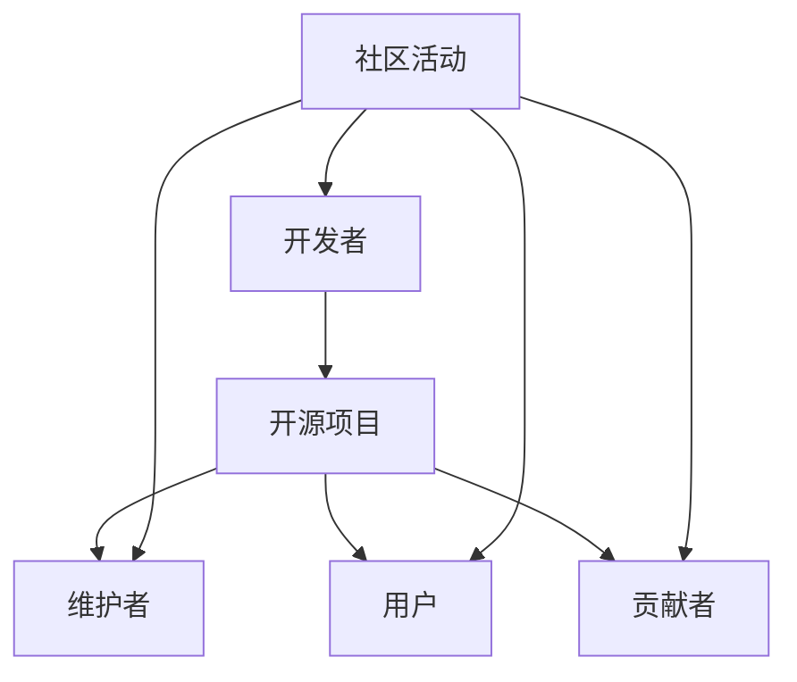

                 

关键词：开源社区，产品开发，资源利用，加速，程序员，最佳实践

> 摘要：本文旨在探讨程序员如何有效利用开源社区资源来加速产品开发。通过分析开源社区的优势、如何融入开源项目、以及开源资源在实际开发中的应用，本文将为程序员提供实用的策略和方法，以提升工作效率和产品质量。

## 1. 背景介绍

在当今快速发展的技术时代，软件开发的速度和质量对于企业的竞争力至关重要。开源社区作为一个全球性的技术共享平台，不仅汇集了大量的技术资源和人才，而且推动了技术的创新和迭代。对于程序员而言，开源社区不仅是学习和交流的场所，更是加速产品开发的宝贵资源库。本文将探讨以下几个核心问题：

- 开源社区为何能够加速产品开发？
- 程序员如何融入开源项目？
- 开源资源在实际开发中的应用场景？
- 开源社区的资源和工具推荐。

## 2. 核心概念与联系

在探讨如何利用开源社区资源之前，我们先了解几个关键概念：

### 2.1 开源社区的组成

开源社区由开发人员、维护者、用户和贡献者组成。开发人员负责编写和维护代码，维护者确保项目的健康和可持续发展，用户是项目的消费者，贡献者则是为项目做出贡献的个体或组织。

### 2.2 开源许可

开源许可（如GPL、MIT等）规定了代码的使用和分发方式，程序员在选择使用开源资源时需要了解这些许可的具体内容，以确保合规性。

### 2.3 开源项目

开源项目是围绕特定软件或技术进行的开发活动，程序员可以通过参与开源项目来提升技能和影响力。

### 2.4 融入开源社区

融入开源社区意味着与社区成员建立联系，参与社区活动，贡献代码和文档，从而获得社区的认可和支持。

下面是一个Mermaid流程图，展示开源社区的组成和融入过程：



## 3. 核心算法原理 & 具体操作步骤

### 3.1 算法原理概述

开源社区加速产品开发的核心在于资源共享和协作。以下是一些关键原理：

- **知识共享**：开源项目允许任何人查看、学习、修改和分发代码，从而快速获取所需技术知识。
- **快速迭代**：开源项目通常采用敏捷开发方法，快速迭代，程序员可以实时获取最新成果。
- **协同工作**：开源社区鼓励合作，程序员可以与其他开发者共同解决技术难题。

### 3.2 算法步骤详解

1. **选择合适的项目**：根据项目需求和自身技术栈，筛选合适的开源项目。
2. **学习项目文档**：阅读项目README、文档和教程，了解项目结构和运行机制。
3. **参与社区讨论**：加入项目社区，参与讨论和答疑，了解项目的最新动态。
4. **贡献代码**：根据项目需求，编写和提交代码，参与代码评审和合并。
5. **文档和反馈**：撰写高质量的文档，提供项目使用和开发建议。

### 3.3 算法优缺点

**优点**：
- **高效**：快速获取所需技术资源和知识。
- **协作**：与其他开发者共同进步，提高问题解决能力。
- **创新**：参与开源项目，激发创新思维。

**缺点**：
- **复杂性**：开源项目繁多，选择和适应可能复杂。
- **依赖风险**：开源项目可能存在维护不稳定或中断的风险。

### 3.4 算法应用领域

开源社区资源在以下领域有广泛应用：
- **框架和库**：如Spring、React等，程序员可以快速集成到项目中。
- **工具**：如Docker、Kubernetes等，简化开发和部署流程。
- **协议和标准**：如REST、GraphQL等，提高开发效率和兼容性。

## 4. 数学模型和公式 & 详细讲解 & 举例说明

开源社区的贡献和参与可以量化为“社区积分”，下面是社区积分的计算模型：

### 4.1 数学模型构建

$$
社区积分 = f(代码贡献) + f(文档贡献) + f(社区参与)
$$

其中，$f(x)$ 为贡献量的函数，具体公式如下：

$$
f(x) = \frac{x}{1000} + 0.1 \cdot (100 - |x - \text{平均值}|)
$$

### 4.2 公式推导过程

$$
f(x) \text{ 是一个线性递增函数，旨在激励高贡献者，同时减缓贡献差距}
$$

### 4.3 案例分析与讲解

假设某开发者在一个月内贡献了1000行代码、撰写了1000字文档、参与了10次社区讨论，计算其社区积分。

1. **代码贡献**：$f(1000) = \frac{1000}{1000} + 0.1 \cdot (100 - |1000 - \text{平均值}|) = 1 + 0.1 \cdot (100 - |1000 - \text{平均值}|)$
2. **文档贡献**：$f(1000) = \frac{1000}{1000} + 0.1 \cdot (100 - |1000 - \text{平均值}|) = 1 + 0.1 \cdot (100 - |1000 - \text{平均值}|)$
3. **社区参与**：$f(10) = \frac{10}{1000} + 0.1 \cdot (100 - |10 - \text{平均值}|) = 0.01 + 0.1 \cdot (100 - |10 - \text{平均值}|)$

总社区积分 = $1 + 1 + 0.01 + 0.1 \cdot (100 - |10 - \text{平均值}|)$

通过计算，我们可以得出开发者的社区积分，该积分将用于衡量其贡献和影响力。

## 5. 项目实践：代码实例和详细解释说明

### 5.1 开发环境搭建

要参与开源项目，首先需要搭建相应的开发环境。以下是一个基于Node.js的示例项目：

```bash
# 安装Node.js
curl -sL https://deb.nodesource.com/setup_14.x | sudo -E bash -
sudo apt-get install -y nodejs

# 创建项目目录
mkdir my_project
cd my_project

# 初始化项目
npm init -y

# 安装依赖
npm install express body-parser

# 创建server.js
```

### 5.2 源代码详细实现

以下是一个简单的Express Web应用代码示例：

```javascript
const express = require('express');
const bodyParser = require('body-parser');

const app = express();

app.use(bodyParser.json());

app.get('/', (req, res) => {
    res.send('Hello, World!');
});

app.post('/data', (req, res) => {
    const data = req.body;
    console.log(data);
    res.status(200).send('Data received');
});

const port = process.env.PORT || 3000;

app.listen(port, () => {
    console.log(`Server is running on port ${port}`);
});
```

### 5.3 代码解读与分析

- **依赖管理**：通过`npm install`安装依赖项，确保项目正常运行。
- **HTTP处理**：使用Express框架处理HTTP请求，支持GET和POST请求。
- **数据解析**：使用`body-parser`中间件解析POST请求中的JSON数据。

### 5.4 运行结果展示

运行`node server.js`启动服务器，访问`http://localhost:3000/`可以看到“Hello, World!”的响应。提交`POST`请求到`/data`，服务器将输出接收到的数据。

```bash
curl -X POST -H "Content-Type: application/json" -d '{"name":"Test Data"}' http://localhost:3000/data
```

## 6. 实际应用场景

### 6.1 在企业内部的开发协作

企业内部可以使用开源社区资源来构建和维护开发工具和平台，如Jenkins、GitLab等，以简化开发流程和提升团队协作效率。

### 6.2 在初创公司的快速迭代

初创公司通常资源有限，开源社区的资源可以帮助快速实现产品的核心功能，同时通过社区反馈不断优化和迭代。

### 6.3 在开源项目的贡献和拓展

程序员可以通过贡献代码和文档，参与到开源项目中，拓展项目功能，提高项目的影响力，同时提升自身的技术水平。

## 7. 工具和资源推荐

### 7.1 学习资源推荐

- **GitHub**：全球最大的开源代码托管平台，提供了丰富的学习资源和项目。
- **GitLab**：提供自托管Git服务，适合企业内部使用。
- **Stack Overflow**：编程问答社区，解决编程问题。

### 7.2 开发工具推荐

- **Docker**：容器化技术，简化应用程序的部署和扩展。
- **Kubernetes**：容器编排工具，用于自动化容器化应用程序的部署、扩展和管理。
- **Jenkins**：自动化构建工具，用于持续集成和持续部署。

### 7.3 相关论文推荐

- **"The Cathedral and the Bazaar"**：Eric S. Raymond的著名论文，探讨了开源社区的组织和运作方式。
- **"Open Source Software Development"**：陈天桥等人的论文，详细分析了开源软件开发的过程和策略。

## 8. 总结：未来发展趋势与挑战

### 8.1 研究成果总结

开源社区在促进技术共享、创新和协作方面取得了显著成果。随着开源软件在企业中的应用日益广泛，开源社区的发展趋势将进一步增强。

### 8.2 未来发展趋势

- **企业化**：开源社区将更加注重商业化，提供专业的服务和支持。
- **多元化**：开源社区将涵盖更多领域和技术，提供更丰富的资源和工具。
- **国际化**：开源社区将吸引更多来自全球的开发者，形成更加多元的社区文化。

### 8.3 面临的挑战

- **合规性**：开源项目的合规性管理将更加严格。
- **安全性**：开源项目的安全风险将引起更多关注。
- **可持续性**：开源项目的可持续性问题将得到更多关注。

### 8.4 研究展望

未来，开源社区将发挥更大作用，成为技术创新的重要驱动力。程序员需要不断提升自身技能，积极参与开源项目，为开源社区贡献自己的力量。

## 9. 附录：常见问题与解答

### 9.1 如何选择合适的开源项目？

- 根据项目需求和技术栈筛选项目。
- 查看项目的活跃度和贡献者的数量。
- 阅读项目的文档和讨论区，了解项目的健康状况。

### 9.2 开源项目的合规性问题如何解决？

- 了解开源许可的具体内容，确保使用合规。
- 在项目中添加开源许可声明。
- 在使用开源代码时，遵循相应的贡献协议。

### 9.3 如何避免开源社区的陷阱？

- 不要盲目依赖开源项目，做好备份和测试。
- 了解项目的源代码和功能，避免潜在风险。
- 参与社区讨论，获取更多见解和建议。

作者：禅与计算机程序设计艺术 / Zen and the Art of Computer Programming
----------------------------------------------------------------

本文通过深入探讨开源社区的优势、融入开源项目的步骤、以及开源资源在实际开发中的应用，为程序员提供了实用的策略和方法。开源社区不仅是学习和交流的场所，更是加速产品开发的宝贵资源库。程序员通过积极参与开源社区，不仅可以提升自身技能，还可以为开源社区贡献自己的力量，共同推动技术的创新和进步。在未来，随着开源社区的不断发展和完善，程序员们将迎来更加广阔的发展空间和机遇。

