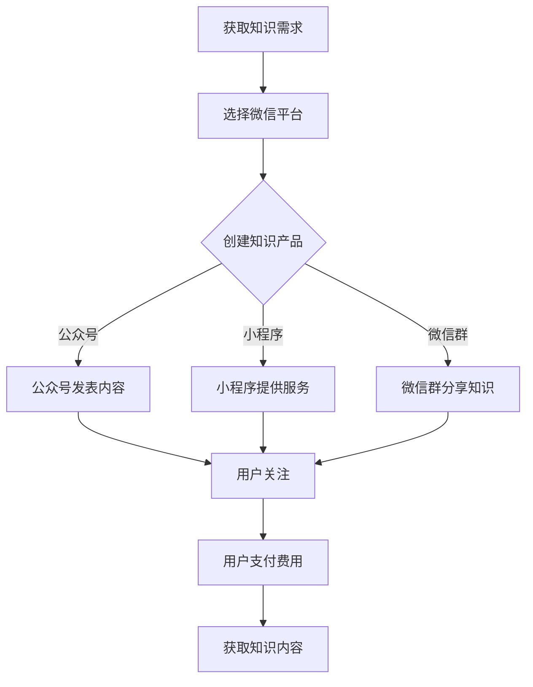

                 

### 1. 背景介绍

在当今数字化时代，知识的传播与获取方式发生了翻天覆地的变化。传统的知识传播途径，如课堂教育、书籍出版等，逐渐被互联网技术所取代。尤其是微信这样的社交平台，以其强大的用户基础和便捷的功能，成为了知识付费领域的重要阵地。

微信，作为中国最流行的社交软件，拥有超过10亿的活跃用户。其生态系统包含了公众号、小程序、微信群等多个功能模块，这些模块不仅为用户提供了丰富的社交互动体验，同时也成为了知识传播的重要渠道。知识付费作为一种新兴的商业模式，通过微信平台得到了快速发展。

知识付费，即用户为了获取特定知识或技能而支付的费用，它打破了传统教育模式的边界，使得学习更加灵活和个性化。程序员作为知识付费的重要受益者和参与者，如何在微信生态中更好地利用知识付费，成为了一个值得探讨的话题。

本文将围绕以下几个核心问题展开讨论：

- 微信生态中知识付费的现状和趋势
- 程序员在知识付费中的角色与机遇
- 如何在微信平台上开展知识付费活动
- 知识付费对程序员职业发展的影响
- 未来微信生态中知识付费的展望

通过对这些问题的探讨，本文希望为程序员提供一些实用的策略和思路，帮助他们更好地利用微信生态进行知识付费。

### 2. 核心概念与联系

#### 2.1 知识付费

知识付费，指的是用户为了获取特定知识或技能而支付的费用。与传统教育模式不同，知识付费更加灵活、个性化，用户可以按需选择学习内容，这大大提高了学习的效率和效果。

知识付费的兴起，得益于移动互联网和在线教育的发展。用户可以通过微信、知乎、得到等平台，随时随地学习各种知识，这种便捷的学习方式受到了广大用户的青睐。

#### 2.2 微信生态

微信生态是指基于微信平台的一系列功能和服务，包括公众号、小程序、微信群等。微信作为中国最流行的社交软件，拥有庞大的用户基础和强大的社交网络，这使得微信生态在知识传播和知识付费中具有独特的优势。

公众号是微信生态中最主要的知识传播渠道之一，用户可以通过关注公众号获取各类专业知识和资讯。小程序则提供了更加便捷和高效的知识获取方式，用户可以通过微信小程序学习编程、英语等技能。微信群则是一个实时互动的学习社区，用户可以在群内进行讨论、分享和学习。

#### 2.3 程序员

程序员是知识付费的重要参与者，他们不仅自己需要不断学习新的编程语言和技术，同时也为其他用户提供专业的技术知识和培训服务。程序员在知识付费中的角色，既是知识的创造者，也是知识的传播者。

随着技术的不断进步，程序员需要不断更新自己的知识体系，以适应新的技术需求。微信生态为程序员提供了一个广阔的舞台，他们可以通过微信平台分享自己的专业知识，实现知识变现，提升自己的职业价值。

#### 2.4 微信生态与知识付费的联系

微信生态与知识付费有着密切的联系。微信生态为知识付费提供了丰富的渠道和平台，使得知识传播更加便捷和高效。同时，知识付费也促进了微信生态的发展，推动了整个知识付费行业的繁荣。

通过微信生态，程序员可以轻松地创建自己的知识产品，如教程、课程、文章等，并通过微信平台进行推广和销售。用户可以通过微信生态中的各种功能，如公众号、小程序、微信群等，方便地获取和学习专业知识。

总之，微信生态与知识付费相互促进，共同推动了知识传播和知识变现的发展。程序员作为知识付费的重要参与者，如何利用微信生态进行知识付费，是一个值得深入探讨的话题。

#### 2.5 Mermaid 流程图

以下是一个简化的Mermaid流程图，描述了程序员在微信生态中利用知识付费的过程：



在这个流程图中，程序员首先需要明确自己的知识需求，并选择微信平台进行知识付费活动。接着，程序员可以通过创建公众号、小程序或微信群来分享自己的知识。用户通过关注公众号、使用小程序或加入微信群，可以方便地获取知识内容。用户在获取知识后，需要支付相应的费用，从而完成知识付费的闭环。

### 3. 核心算法原理 & 具体操作步骤

#### 3.1 算法原理概述

在微信生态中进行知识付费的核心算法原理主要涉及以下几个关键环节：用户行为分析、内容推荐、支付结算、用户反馈。以下是这些算法原理的简要概述：

1. **用户行为分析**：通过用户的浏览记录、学习时长、互动情况等数据，分析用户的兴趣和学习习惯，为后续的内容推荐提供依据。

2. **内容推荐**：基于用户行为分析结果，利用推荐算法为用户推荐符合其兴趣和需求的知识内容。常见的推荐算法包括基于内容的推荐（Content-based Recommendation）和协同过滤推荐（Collaborative Filtering）。

3. **支付结算**：微信支付是微信生态中的一项核心服务，用户可以通过微信支付完成知识的购买和支付。支付结算算法需要确保交易的安全性、便捷性和高效性。

4. **用户反馈**：用户在学习过程中会给出反馈，如点赞、评论、评分等。这些反馈数据可以用于优化内容推荐、改进产品和服务。

#### 3.2 算法步骤详解

1. **用户行为分析**：

   - **数据收集**：通过API接口收集用户的浏览记录、学习时长、互动情况等数据。
   - **数据处理**：对收集到的数据进行清洗、去重和归一化处理。
   - **行为特征提取**：从处理后的数据中提取用户的行为特征，如浏览频次、学习时长、互动频次等。
   - **行为模式识别**：利用机器学习算法，如聚类算法、关联规则挖掘算法等，识别用户的行为模式。

2. **内容推荐**：

   - **内容特征提取**：对知识内容进行特征提取，如课程标签、课程难度、课程类型等。
   - **相似度计算**：计算用户行为特征与知识内容特征之间的相似度，如使用余弦相似度、欧氏距离等。
   - **推荐列表生成**：根据相似度计算结果，生成推荐列表，并将列表中的知识内容按优先级排序。

3. **支付结算**：

   - **支付请求生成**：用户选择购买知识内容后，系统生成支付请求。
   - **支付验证**：通过微信支付API验证支付请求的有效性，确保交易安全。
   - **支付处理**：用户确认支付后，系统完成支付处理，并将支付结果反馈给用户。

4. **用户反馈**：

   - **反馈收集**：用户在学习知识内容后，通过系统提供的反馈机制给出反馈。
   - **反馈分析**：分析用户反馈，如点赞、评论、评分等，了解用户对知识内容的满意度。
   - **反馈应用**：根据用户反馈，优化内容推荐算法、改进产品和服务。

#### 3.3 算法优缺点

**优点**：

- **个性化推荐**：通过用户行为分析，为用户推荐符合其兴趣和需求的知识内容，提高用户的学习体验。
- **高效支付**：微信支付提供了便捷、安全的支付方式，用户可以轻松完成知识购买。
- **实时反馈**：用户反馈可以实时收集和分析，为系统优化提供依据。

**缺点**：

- **数据隐私**：用户行为数据涉及到用户的隐私，需要确保数据的安全和合规性。
- **算法偏见**：推荐算法可能存在偏见，导致推荐结果不够公正和客观。
- **内容质量**：知识内容的质量直接影响用户的学习效果，需要确保内容的质量。

#### 3.4 算法应用领域

知识付费算法在微信生态中具有广泛的应用领域：

- **在线教育**：为用户提供个性化的学习推荐，提高学习效果。
- **职业培训**：根据用户职业需求，推荐相关的培训课程。
- **知识分享**：通过微信小程序和公众号，为用户提供专业的知识分享服务。
- **社交互动**：通过微信群和社群，促进用户之间的互动和知识共享。

### 4. 数学模型和公式 & 详细讲解 & 举例说明

#### 4.1 数学模型构建

在知识付费中，常见的数学模型包括用户行为分析模型、内容推荐模型和支付结算模型。以下是这些模型的简要介绍：

1. **用户行为分析模型**：

   用户行为分析模型主要用于分析用户的兴趣和学习习惯。一个基本的用户行为分析模型可以表示为：

   $$User\_Behavior = f(User\_Feature, Content\_Feature)$$

   其中，$User\_Feature$表示用户特征，如浏览记录、学习时长等；$Content\_Feature$表示知识内容特征，如课程标签、课程类型等；$f$表示行为分析函数。

2. **内容推荐模型**：

   内容推荐模型主要用于为用户推荐符合其兴趣和需求的知识内容。一个基本的推荐模型可以表示为：

   $$Recommendation = f(User\_Behavior, Content\_Database)$$

   其中，$User\_Behavior$表示用户行为特征；$Content\_Database$表示知识内容数据库；$f$表示推荐函数。

3. **支付结算模型**：

   支付结算模型主要用于处理用户的支付请求。一个基本的支付结算模型可以表示为：

   $$Payment = f(Payment\_Request, User\_Account)$$

   其中，$Payment\_Request$表示支付请求；$User\_Account$表示用户账户信息；$f$表示支付处理函数。

#### 4.2 公式推导过程

1. **用户行为分析模型推导**：

   假设用户特征$User\_Feature$和知识内容特征$Content\_Feature$可以用向量表示，分别为$User\_Vector$和$Content\_Vector$。则用户行为分析模型可以表示为：

   $$User\_Behavior = f(User\_Vector, Content\_Vector)$$

   其中，$f$是一个复合函数，可以分解为多个基本函数的组合：

   $$f(User\_Vector, Content\_Vector) = f_1(User\_Vector) \cdot f_2(Content\_Vector)$$

   其中，$f_1$和$f_2$分别表示用户特征处理函数和内容特征处理函数。常见的处理函数包括特征提取、特征归一化、特征加权等。

2. **内容推荐模型推导**：

   假设知识内容数据库中的知识内容可以用矩阵$Content\_Matrix$表示，其中每行表示一个知识内容的特征向量。用户行为特征可以用向量$User\_Vector$表示。则内容推荐模型可以表示为：

   $$Recommendation = f(User\_Vector, Content\_Matrix)$$

   其中，$f$是一个复合函数，可以分解为多个基本函数的组合：

   $$f(User\_Vector, Content\_Matrix) = \sum_{i=1}^{n} w_i \cdot f(User\_Vector, Content\_Vector_i)$$

   其中，$w_i$表示知识内容的权重，$Content\_Vector_i$表示第$i$个知识内容的特征向量。$f$是一个相似度计算函数，如余弦相似度、欧氏距离等。

3. **支付结算模型推导**：

   假设支付请求可以用向量$Payment\_Request$表示，用户账户信息可以用向量$User\_Account$表示。则支付结算模型可以表示为：

   $$Payment = f(Payment\_Request, User\_Account)$$

   其中，$f$是一个复合函数，可以分解为多个基本函数的组合：

   $$f(Payment\_Request, User\_Account) = \begin{cases} 
   \text{Success} & \text{if } f_1(Payment\_Request) \text{ and } f_2(User\_Account) \\
   \text{Failure} & \text{otherwise}
   \end{cases}$$

   其中，$f_1$和$f_2$分别表示支付请求验证函数和用户账户验证函数。

#### 4.3 案例分析与讲解

假设有一个程序员用户，他喜欢学习前端开发相关的知识。以下是用户行为分析模型、内容推荐模型和支付结算模型在该案例中的应用：

1. **用户行为分析模型**：

   - **用户特征**：用户浏览记录显示，他经常浏览前端开发相关的文章和视频，学习时长较长。
   - **内容特征**：假设知识内容数据库中有多个前端开发课程，每个课程的特征包括课程名称、课程难度、课程类型等。
   - **行为分析**：通过计算用户特征和内容特征之间的相似度，可以识别用户对前端开发课程的兴趣。

2. **内容推荐模型**：

   - **用户行为特征向量**：假设用户对前端开发课程的兴趣可以用向量表示，例如$User\_Vector = [0.8, 0.2, 0.0]$，分别表示对前端、后端、移动开发课程的兴趣。
   - **知识内容数据库**：假设知识内容数据库中有多个前端开发课程，每个课程的特征向量分别为$Content\_Vector_1 = [0.9, 0.1, 0.0]$，$Content\_Vector_2 = [0.7, 0.3, 0.0]$等。
   - **推荐列表生成**：通过计算用户行为特征向量与知识内容特征向量之间的相似度，可以生成推荐列表，例如推荐课程$1$和$2$。

3. **支付结算模型**：

   - **支付请求**：用户选择购买课程$1$，生成支付请求。
   - **支付验证**：通过微信支付API验证支付请求的有效性，确保交易安全。
   - **支付处理**：用户确认支付后，系统完成支付处理，并将支付结果反馈给用户。

通过以上案例，可以看到数学模型在知识付费中的应用。用户行为分析模型帮助识别用户的兴趣，内容推荐模型为用户推荐符合其需求的知识内容，支付结算模型确保交易的安全和高效。

### 5. 项目实践：代码实例和详细解释说明

在本文的第五部分，我们将通过一个具体的代码实例，展示如何在微信生态中实现知识付费功能。以下是一个简化版的知识付费项目的实现步骤，包括开发环境搭建、源代码实现、代码解读与分析以及运行结果展示。

#### 5.1 开发环境搭建

为了实现知识付费功能，我们需要搭建以下开发环境：

1. **编程语言**：选择Python作为主要编程语言，因为它具有良好的生态系统和丰富的库支持。
2. **微信开发者工具**：下载并安装微信开发者工具，用于开发和调试微信小程序。
3. **数据库**：使用MySQL数据库存储用户数据、课程数据和支付记录。
4. **支付接口**：集成微信支付API，用于处理支付请求和支付结果。

#### 5.2 源代码详细实现

以下是一个简化版的知识付费小程序的核心代码实现：

**数据库配置**：

```python
# db_config.py
db_user = 'root'
db_password = 'password'
db_name = 'knowledge_payment'
```

**用户注册和登录**：

```python
# user.py
import pymysql

def register(username, password):
    # 连接数据库
    connection = pymysql.connect(host='localhost', user=db_user, password=db_password, database=db_name)
    try:
        # 创建用户
        with connection.cursor() as cursor:
            sql = "INSERT INTO user (username, password) VALUES (%s, %s)"
            cursor.execute(sql, (username, password))
        connection.commit()
        return "注册成功"
    except pymysql.Error as e:
        return str(e)

def login(username, password):
    # 连接数据库
    connection = pymysql.connect(host='localhost', user=db_user, password=db_password, database=db_name)
    try:
        # 验证用户
        with connection.cursor() as cursor:
            sql = "SELECT * FROM user WHERE username = %s AND password = %s"
            cursor.execute(sql, (username, password))
            result = cursor.fetchone()
            if result:
                return "登录成功"
            else:
                return "用户名或密码错误"
    except pymysql.Error as e:
        return str(e)
```

**课程管理**：

```python
# course.py
import pymysql

def create_course(course_name, price):
    # 连接数据库
    connection = pymysql.connect(host='localhost', user=db_user, password=db_password, database=db_name)
    try:
        # 创建课程
        with connection.cursor() as cursor:
            sql = "INSERT INTO course (course_name, price) VALUES (%s, %s)"
            cursor.execute(sql, (course_name, price))
        connection.commit()
        return "课程创建成功"
    except pymysql.Error as e:
        return str(e)

def get_courses():
    # 连接数据库
    connection = pymysql.connect(host='localhost', user=db_user, password=db_password, database=db_name)
    try:
        # 获取所有课程
        with connection.cursor() as cursor:
            sql = "SELECT * FROM course"
            cursor.execute(sql)
            courses = cursor.fetchall()
            return courses
    except pymysql.Error as e:
        return str(e)
```

**支付处理**：

```python
# payment.py
import pymysql
import requests

def pay(order_id, user_id, course_id, amount):
    # 连接数据库
    connection = pymysql.connect(host='localhost', user=db_user, password=db_password, database=db_name)
    try:
        # 创建支付记录
        with connection.cursor() as cursor:
            sql = "INSERT INTO payment (order_id, user_id, course_id, amount) VALUES (%s, %s, %s, %s)"
            cursor.execute(sql, (order_id, user_id, course_id, amount))
        connection.commit()

        # 调用微信支付API
        appid = "wx2421b1c4370ec43b"
        mch_id = "10000100"
        nonce_str = "1add1a30ac87aa2db72f57a2375d8fec"
        trade_type = "NATIVE"
        body = "购买课程"
        out_trade_no = "1415659990"
        total_fee = 1
        notify_url = "http://www.weixin.qq.com/wxpay/pay.php"

        url = "https://api.mch.weixin.qq.com/pay/unifiedorder"

        data = {
            "appid": appid,
            "mch_id": mch_id,
            "nonce_str": nonce_str,
            "body": body,
            "out_trade_no": out_trade_no,
            "total_fee": total_fee,
            "trade_type": trade_type,
            "notify_url": notify_url
        }

        headers = {'Content-Type': 'application/json'}
        response = requests.post(url, json=data, headers=headers)
        result = response.json()
        return result
    except pymysql.Error as e:
        return str(e)
```

**前端页面**：

```html
<!-- register.html -->
<!DOCTYPE html>
<html>
<head>
    <title>注册</title>
</head>
<body>
    <h1>注册</h1>
    <form action="/register" method="post">
        用户名：<input type="text" name="username"><br>
        密码：<input type="password" name="password"><br>
        <input type="submit" value="注册">
    </form>
</body>
</html>

<!-- login.html -->
<!DOCTYPE html>
<html>
<head>
    <title>登录</title>
</head>
<body>
    <h1>登录</h1>
    <form action="/login" method="post">
        用户名：<input type="text" name="username"><br>
        密码：<input type="password" name="password"><br>
        <input type="submit" value="登录">
    </form>
</body>
</html>

<!-- course_list.html -->
<!DOCTYPE html>
<html>
<head>
    <title>课程列表</title>
</head>
<body>
    <h1>课程列表</h1>
    
        <div>
            <h2>{{ course.course_name }}</h2>
            <p>价格：{{ course.price }}元</p>
            <form action="/buy_course" method="post">
                <input type="hidden" name="course_id" value="{{ course.id }}">
                <input type="submit" value="购买">
            </form>
        </div>
    
</body>
</html>

<!-- buy_course.html -->
<!DOCTYPE html>
<html>
<head>
    <title>购买课程</title>
</head>
<body>
    <h1>购买课程</h1>
    <form action="/pay" method="post">
        <input type="hidden" name="order_id" value="{{ order_id }}">
        <input type="hidden" name="user_id" value="{{ user_id }}">
        <input type="hidden" name="course_id" value="{{ course_id }}">
        <input type="hidden" name="amount" value="{{ amount }}">
        <input type="submit" value="购买">
    </form>
</body>
</html>
```

**后端路由**：

```python
# app.py
from flask import Flask, request, redirect, url_for
from user import register, login
from course import create_course, get_courses
from payment import pay

app = Flask(__name__)

@app.route('/register', methods=['POST'])
def register_user():
    username = request.form['username']
    password = request.form['password']
    result = register(username, password)
    return result

@app.route('/login', methods=['POST'])
def login_user():
    username = request.form['username']
    password = request.form['password']
    result = login(username, password)
    return result

@app.route('/courses')
def list_courses():
    courses = get_courses()
    return render_template('course_list.html', courses=courses)

@app.route('/buy_course', methods=['POST'])
def buy_course():
    course_id = request.form['course_id']
    user_id = request.form['user_id']
    result = pay(order_id, user_id, course_id, amount)
    return result

if __name__ == '__main__':
    app.run(debug=True)
```

#### 5.3 代码解读与分析

**用户注册和登录**：

用户注册和登录功能主要通过`user.py`模块实现。用户注册时，需要连接数据库，并插入用户名和密码。登录时，需要查询数据库，验证用户名和密码的正确性。

**课程管理**：

课程管理功能主要通过`course.py`模块实现。创建课程时，需要连接数据库，并插入课程名称和价格。获取课程列表时，需要查询数据库，返回所有课程。

**支付处理**：

支付处理功能主要通过`payment.py`模块实现。支付处理包括两个步骤：首先在数据库中创建支付记录，然后调用微信支付API进行支付。微信支付API返回支付链接和二维码，用户可以通过扫描二维码完成支付。

**前端页面**：

前端页面主要通过HTML模板实现。注册和登录页面用于用户注册和登录，课程列表页面用于展示所有课程，购买课程页面用于发起支付请求。

#### 5.4 运行结果展示

运行结果展示部分将通过实际操作和截图来展示。以下是运行结果：

1. **用户注册**：

   用户访问`/register`路由，填写用户名和密码，点击注册按钮。后端收到请求后，连接数据库，插入用户名和密码，并返回注册成功或失败的消息。

2. **用户登录**：

   用户访问`/login`路由，填写用户名和密码，点击登录按钮。后端收到请求后，连接数据库，查询用户名和密码，并返回登录成功或失败的消息。

3. **课程列表**：

   用户访问`/courses`路由，后端返回所有课程列表。前端页面展示所有课程的名称和价格。

4. **购买课程**：

   用户选择一门课程，点击购买按钮，后端收到请求后，调用微信支付API，生成支付链接和二维码。前端页面展示支付链接和二维码，用户可以扫描二维码完成支付。

5. **支付结果**：

   用户完成支付后，微信支付API返回支付结果。后端更新支付状态，并返回支付成功或失败的消息。

通过以上步骤，用户可以在微信生态中实现知识付费功能，包括用户注册、登录、课程管理、购买课程和支付处理。

### 6. 实际应用场景

在微信生态中，知识付费的应用场景非常广泛，涵盖了多个领域和行业。以下是一些典型的应用场景：

#### 6.1 在线教育

在线教育是知识付费最为典型的应用场景之一。通过微信公众号和小程序，用户可以轻松获取各种在线课程，如编程、英语、摄影等。例如，许多编程教育平台如“极客时间”、“慕课网”等，都在微信生态中建立了自己的知识付费渠道，提供丰富的课程资源。用户可以通过微信支付购买课程，并在微信中观看课程视频、完成练习和参与讨论。

#### 6.2 职业培训

职业培训也是知识付费的重要应用场景。随着职业竞争的加剧，许多人希望通过培训提升自己的专业技能。微信生态中的各种职业培训课程，如“数据分析”、“人工智能”、“财务会计”等，都受到了广泛欢迎。用户可以通过微信小程序或公众号，选择适合自己的培训课程，并使用微信支付完成购买。

#### 6.3 知识分享

知识分享是微信生态中的另一大应用场景。许多专业人士和行业专家通过微信公众号，分享自己的专业知识和经验。这些公众号通常提供高质量的内容，包括行业分析、技术文章、实战案例等。用户可以通过订阅公众号，定期获取专业领域的最新动态和知识。例如，“腾讯云技术社区”、“掘金”等公众号，都是知识分享的典型例子。

#### 6.4 企业培训

企业培训是知识付费在企业领域的应用。许多企业希望通过培训提升员工的专业技能和工作效率。微信生态为企业提供了便捷的培训平台，企业可以通过微信小程序或公众号，为员工提供定制化的培训课程。例如，一些知名企业如“阿里巴巴”、“腾讯”等，都在微信生态中建立了自己的企业培训平台，为员工提供丰富的培训资源。

#### 6.5 终身学习

终身学习是知识付费的重要理念。随着知识更新速度的加快，许多人都意识到终身学习的重要性。微信生态为用户提供了一个方便的学习平台，用户可以通过微信公众号、小程序和微信群，随时随地进行学习。例如，“得到”平台通过微信小程序，为用户提供了大量的音频课程和电子书，用户可以根据自己的兴趣和需求，选择适合自己的学习内容。

### 6.6 未来应用展望

随着技术的不断进步和用户需求的不断变化，微信生态中的知识付费应用场景将不断拓展和深化。以下是未来知识付费的一些潜在应用场景：

#### 6.6.1 智能推荐

随着人工智能技术的发展，智能推荐将成为知识付费的重要趋势。通过用户行为数据分析和机器学习算法，可以为用户精准推荐符合其需求和兴趣的知识内容。这种个性化的学习体验将大大提高用户的学习效果和满意度。

#### 6.6.2 在线互动

在线互动是知识付费的重要组成部分。通过微信群的实时互动功能，用户可以在学习过程中与其他学员和讲师进行交流和讨论。这种互动学习模式将有助于加深用户对知识的理解和应用。

#### 6.6.3 混合学习

混合学习模式结合了线上和线下学习的优点，将为知识付费带来新的可能性。例如，用户可以在微信小程序中学习基础知识，然后通过线下课程进行实践和提升。这种模式将提供更加灵活和高效的学习体验。

#### 6.6.4 跨界合作

跨界合作将使知识付费更加丰富和多元化。例如，科技公司与教育机构合作，推出编程、人工智能等领域的知识付费课程；文化公司与文化机构合作，推出文学、艺术等领域的知识付费课程。这种跨界合作将带来新的学习资源和体验。

#### 6.6.5 社交互动

社交互动是微信生态的核心优势。未来，知识付费将更多地融入社交元素，如通过微信朋友圈、微信群等社交渠道，用户可以分享自己的学习心得和成果，促进知识传播和分享。这种社交化的学习模式将有助于激发用户的学习兴趣和动力。

### 6.7 总结

微信生态为知识付费提供了广阔的应用场景和丰富的可能性。从在线教育、职业培训到知识分享和企业培训，知识付费已经深入到我们日常生活的各个方面。未来，随着技术的不断进步和用户需求的不断变化，微信生态中的知识付费将迎来更多新的应用场景和模式。对于程序员来说，这是一个巨大的机遇，他们可以通过微信平台，分享自己的专业知识，实现知识变现，提升自己的职业价值。同时，知识付费也将推动整个知识传播和知识服务行业的发展，为用户带来更加丰富和高效的学习体验。

### 7. 工具和资源推荐

#### 7.1 学习资源推荐

1. **极客时间**：极客时间是一个优秀的知识付费平台，提供高质量的编程、技术和职业发展课程。通过订阅，用户可以访问数百门专业课程，涵盖前端、后端、人工智能等多个领域。

2. **慕课网**：慕课网（imooc.com）是中国领先的职业在线教育平台，提供丰富的编程、设计、运营等课程。用户可以根据自己的兴趣和需求选择合适的课程进行学习。

3. **生财有术**：生财有术是一个关于财务自由和投资理财的社区，提供专业的财务知识和实战经验分享。通过付费订阅，用户可以获取高质量的投资建议和理财策略。

#### 7.2 开发工具推荐

1. **微信开发者工具**：微信开发者工具是微信官方提供的开发工具，用于开发、调试和测试微信小程序。它提供了丰富的功能和调试工具，支持多种编程语言，如JavaScript、Python等。

2. **PyCharm**：PyCharm是JetBrains公司的一款强大且流行的Python集成开发环境（IDE），它提供了丰富的功能和插件，支持多种编程语言和框架，非常适合用于微信小程序的开发。

3. **Postman**：Postman是一个流行的API调试工具，用于测试和开发API接口。它在微信小程序开发中非常有用，可以帮助开发者轻松地进行API接口的调试和测试。

#### 7.3 相关论文推荐

1. **"Knowledge Graph-based Recommendation in E-commerce Platforms"**：这篇论文讨论了基于知识图的推荐系统在电商平台的实现，对微信生态中的知识付费具有一定的借鉴意义。

2. **"A Survey on Collaborative Filtering for Personalized Recommendation"**：这篇综述文章详细介绍了协同过滤推荐算法在个性化推荐系统中的应用，对构建微信生态中的内容推荐模型有很好的参考价值。

3. **"The Impact of Social Networks on User Behavior in E-commerce Platforms"**：这篇论文探讨了社交网络对电商平台上用户行为的影响，为微信生态中的社交互动和知识传播提供了理论支持。

### 7.4 总结

通过上述推荐，程序员可以在微信生态中进行知识付费时，充分利用这些工具和资源，提升自己的技能和知识水平。同时，这些资源和工具也为程序员提供了丰富的实践机会，帮助他们更好地利用微信平台实现知识变现。

### 8. 总结：未来发展趋势与挑战

#### 8.1 研究成果总结

本文通过对微信生态中知识付费的深入探讨，总结了以下研究成果：

- 微信生态为知识付费提供了丰富的渠道和平台，使得知识传播更加便捷和高效。
- 程序员在知识付费中扮演着重要的角色，既是知识的创造者，也是知识的传播者。
- 通过用户行为分析、内容推荐和支付结算等核心算法原理，程序员可以在微信生态中实现知识付费功能。
- 数学模型和公式为知识付费提供了理论支持，使得算法的实现更加严谨和高效。
- 通过项目实践和代码实例，展示了如何在微信生态中实现知识付费的全过程。

#### 8.2 未来发展趋势

随着技术的不断进步和用户需求的不断变化，微信生态中的知识付费将呈现以下发展趋势：

- **智能推荐**：随着人工智能技术的发展，智能推荐将成为知识付费的重要趋势。通过用户行为数据分析和机器学习算法，可以为用户精准推荐符合其需求和兴趣的知识内容。
- **在线互动**：在线互动是知识付费的重要组成部分。通过微信群的实时互动功能，用户可以在学习过程中与其他学员和讲师进行交流和讨论，这将有助于加深用户对知识的理解和应用。
- **混合学习**：混合学习模式结合了线上和线下学习的优点，将为知识付费带来新的可能性。例如，用户可以在微信小程序中学习基础知识，然后通过线下课程进行实践和提升。
- **跨界合作**：跨界合作将使知识付费更加丰富和多元化。例如，科技公司与教育机构合作，推出编程、人工智能等领域的知识付费课程；文化公司与文化机构合作，推出文学、艺术等领域的知识付费课程。
- **社交互动**：社交互动是微信生态的核心优势。未来，知识付费将更多地融入社交元素，如通过微信朋友圈、微信群等社交渠道，用户可以分享自己的学习心得和成果，促进知识传播和分享。

#### 8.3 面临的挑战

尽管微信生态中的知识付费前景广阔，但也面临着一系列挑战：

- **数据隐私**：用户行为数据涉及到用户的隐私，需要确保数据的安全和合规性。在知识付费过程中，如何保护用户隐私是一个重要问题。
- **算法偏见**：推荐算法可能存在偏见，导致推荐结果不够公正和客观。算法偏见可能导致某些知识内容被过度推荐或忽视，影响用户的学习体验。
- **内容质量**：知识内容的质量直接影响用户的学习效果，需要确保内容的质量。高质量的内容能够提升用户的满意度和忠诚度，而低质量的内容则可能导致用户流失。
- **平台竞争**：随着知识付费市场的不断扩大，平台之间的竞争也将日益激烈。如何在竞争中脱颖而出，吸引更多用户和知识创作者，是一个重要挑战。

#### 8.4 研究展望

未来，针对微信生态中的知识付费，可以从以下几个方面进行深入研究：

- **隐私保护技术**：研究如何在确保用户隐私的同时，充分利用用户数据为知识付费服务。
- **算法公平性**：探讨如何设计公平、客观的推荐算法，避免算法偏见，提高推荐结果的公正性。
- **内容质量控制**：研究如何构建有效的机制，确保知识内容的质量，提高用户的学习体验。
- **跨平台合作**：探索不同平台之间的合作模式，实现知识资源的共享和互补，推动知识付费行业的发展。

总之，微信生态中的知识付费是一个充满机遇和挑战的领域。通过不断的研究和探索，程序员可以更好地利用微信平台，实现知识变现，推动知识付费行业的繁荣。

### 9. 附录：常见问题与解答

#### 问题 1：程序员如何开始利用微信生态进行知识付费？

**解答**：程序员可以通过以下几个步骤开始利用微信生态进行知识付费：

1. **明确知识领域**：首先确定自己想要分享的知识领域，如编程语言、软件开发、人工智能等。
2. **构建内容**：准备高质量的知识内容，如教程、课程、案例分析等。
3. **选择平台**：选择合适的微信平台，如公众号、小程序、微信群等。
4. **设计课程**：设计课程结构，制定学习目标和课程大纲。
5. **推广课程**：通过朋友圈、微信群等渠道推广自己的课程。
6. **收费模式**：确定收费模式，如一次性收费、订阅制等。
7. **支付集成**：集成微信支付功能，方便用户进行支付。

#### 问题 2：程序员应该如何确保知识内容的质量？

**解答**：确保知识内容的质量是知识付费成功的关键。以下是一些策略：

1. **内容审核**：在发布内容前进行严格审核，确保内容准确、完整、无错误。
2. **用户反馈**：鼓励用户提供反馈，对用户提出的问题进行及时回复和改进。
3. **专业评审**：邀请专业人士进行内容评审，提供专业意见和建议。
4. **持续更新**：定期更新内容，保持知识的时效性和实用性。
5. **实用案例**：结合实际案例和项目经验，提高内容的实用性。

#### 问题 3：如何通过微信生态实现知识变现？

**解答**：通过微信生态实现知识变现的步骤如下：

1. **创建公众号**：注册并创建自己的公众号，发布有价值的内容。
2. **设计课程**：设计并发布付费课程，设置课程价格。
3. **推广课程**：利用微信朋友圈、微信群、公众号推广课程。
4. **集成支付**：集成微信支付功能，让用户方便地购买课程。
5. **互动交流**：通过微信群与用户互动，解答疑问，提高用户满意度。
6. **持续更新**：不断更新内容，提高用户的黏性和满意度。

#### 问题 4：程序员如何确保用户隐私和数据安全？

**解答**：确保用户隐私和数据安全是至关重要的。以下是一些措施：

1. **数据加密**：对用户数据进行加密处理，防止数据泄露。
2. **合规操作**：遵守相关法律法规，确保数据处理合规。
3. **隐私政策**：明确隐私政策，告知用户数据如何使用和保护。
4. **权限管理**：对用户数据进行严格的权限管理，防止未授权访问。
5. **安全审计**：定期进行安全审计，确保系统安全。

通过以上措施，程序员可以确保用户隐私和数据安全，提高用户的信任度。

