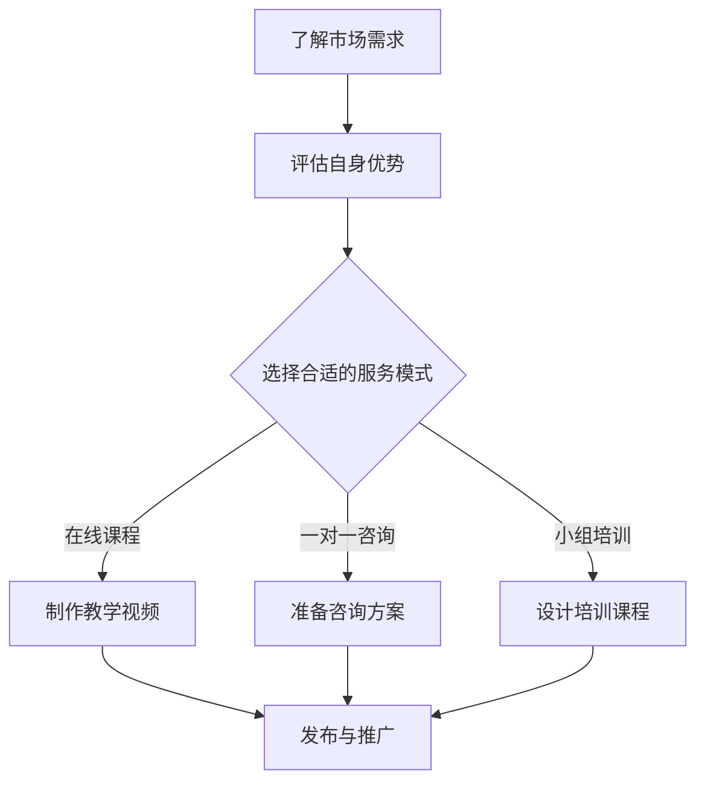

                 

关键词：程序员、开发经验、付费咨询服务、知识变现、个人品牌、专业成长

> 摘要：本文将探讨程序员如何将自身的开发经验转化为付费咨询服务，实现知识变现和个人品牌的提升。通过详细的分析和实战案例，本文旨在为程序员提供一套系统的方法论，帮助他们在这个领域取得成功。

## 1. 背景介绍

在信息技术飞速发展的今天，编程已经成为许多职业人士必备的技能。程序员群体中，不乏拥有丰富经验和深厚技术背景的专家。然而，如何将这些宝贵的经验转化为实际的收入来源，成为了许多程序员面临的一个问题。付费咨询服务正成为越来越多的程序员选择的变现途径。

### 1.1 付费咨询服务的定义

付费咨询服务是指专业人员在特定领域提供知识、经验和技能的指导，客户通过支付费用获得专业的咨询服务。这种服务形式在IT领域尤其受到欢迎，因为它不仅可以帮助客户解决具体问题，还能为他们提供全新的视角和解决方案。

### 1.2 付费咨询服务的优势

- **知识变现**：将多年的开发经验和专业知识通过咨询服务变现，提高个人收入。
- **个人品牌**：通过提供优质的服务，建立专业形象，提升个人在行业内的知名度。
- **持续成长**：在咨询服务过程中，程序员可以不断学习、积累经验，实现个人和职业的双重成长。

## 2. 核心概念与联系

为了更好地将开发经验转化为付费咨询服务，我们需要了解以下几个核心概念：

### 2.1 个人品牌建设

个人品牌建设是指通过持续的努力，在行业内树立一个独特的、值得信赖的专业形象。这包括个人技能、专业素养、价值观等多个方面。

### 2.2 咨询服务模式

咨询服务模式包括一对一咨询、小组培训、在线课程等多种形式。每种模式都有其特点和适用场景，程序员需要根据自身优势和客户需求选择合适的模式。

### 2.3 知识变现途径

知识变现途径包括撰写技术博客、发表技术论文、开设在线课程等。这些途径不仅可以帮助程序员实现知识变现，还能提升个人在行业内的影响力。

### 2.4 Mermaid 流程图

以下是一个简单的Mermaid流程图，展示了如何将开发经验转化为付费咨询服务的流程：



## 3. 核心算法原理 & 具体操作步骤

### 3.1 算法原理概述

将开发经验转化为付费咨询服务的核心算法可以概括为以下几个步骤：

1. **市场需求分析**：了解目标客户的需求和痛点，确定服务的具体内容和形式。
2. **自身优势评估**：分析自身的技术背景、经验和特长，选择最擅长的领域进行深耕。
3. **咨询服务设计**：根据市场需求和自身优势，设计具有针对性的咨询服务方案。
4. **持续优化与迭代**：在咨询服务过程中，不断收集反馈，优化服务内容，提升服务质量。

### 3.2 算法步骤详解

#### 3.2.1 市场需求分析

- **调研**：通过线上调查、访谈等方式，了解目标客户的需求和痛点。
- **竞品分析**：分析同类咨询服务的内容、价格和客户评价，找出差异化的竞争点。
- **定位**：根据调研结果，确定服务的具体内容和形式。

#### 3.2.2 自身优势评估

- **技能评估**：列出自身擅长的编程语言、技术框架和开发经验。
- **经验总结**：回顾过去的项目经验，总结出最具价值的经验和教训。
- **特长分析**：分析自身的沟通能力、逻辑思维、解决问题的能力等。

#### 3.2.3 咨询服务设计

- **方案制定**：根据市场需求和自身优势，制定详细的咨询服务方案，包括服务内容、形式、价格等。
- **方案优化**：在制定方案过程中，不断收集反馈，优化服务内容，确保方案的实用性和有效性。

#### 3.2.4 持续优化与迭代

- **客户反馈**：在服务过程中，及时收集客户的反馈，了解客户的满意度和需求变化。
- **方案调整**：根据客户反馈，调整服务内容和方法，提升服务质量。
- **经验积累**：在每次服务结束后，总结经验教训，不断提升自身的专业水平。

### 3.3 算法优缺点

#### 优点

- **灵活性**：可以根据市场需求和自身优势灵活调整咨询服务的内容和形式。
- **可持续性**：通过持续优化和迭代，不断提升服务质量，实现长期发展。

#### 缺点

- **初期投入大**：在市场需求分析、咨询服务设计等方面需要投入大量时间和精力。
- **竞争激烈**：随着越来越多的人加入付费咨询服务领域，竞争愈发激烈。

### 3.4 算法应用领域

- **软件开发**：针对软件开发中的技术难题、项目管理和团队协作等问题提供咨询服务。
- **云计算与大数据**：为云计算和大数据项目的规划和实施提供专业指导。
- **人工智能与机器学习**：为人工智能和机器学习项目的开发提供技术支持。
- **网络安全**：为网络安全领域提供技术指导和安全评估服务。

## 4. 数学模型和公式 & 详细讲解 & 举例说明

### 4.1 数学模型构建

在将开发经验转化为付费咨询服务的过程中，可以构建一个简单的数学模型来评估咨询服务的收入。该模型包括以下几个变量：

- **客户数量**（C）：在特定时间内接受咨询服务的客户数量。
- **咨询服务单价**（P）：每次咨询服务收取的费用。
- **咨询频率**（F）：客户在特定时间内接受咨询服务的平均次数。
- **收入**（I）：咨询服务产生的总收入。

数学模型如下：

\[ I = C \times P \times F \]

### 4.2 公式推导过程

公式的推导过程基于以下几个假设：

1. **客户数量稳定**：在特定时间内，客户数量保持稳定。
2. **咨询服务单价固定**：在特定时间内，咨询服务单价保持不变。
3. **咨询频率固定**：在特定时间内，客户的咨询频率保持不变。

根据以上假设，我们可以得出以下公式：

- **总收入**（I）：客户数量（C）乘以咨询服务单价（P）再乘以咨询频率（F）。
- **单个客户收入**（Pi）：咨询服务单价（P）乘以咨询频率（F）。

因此，总收入（I）可以表示为：

\[ I = C \times P \times F \]

### 4.3 案例分析与讲解

假设一个程序员在一个月内接受了20个客户的服务，每个客户的咨询频率为2次，咨询服务单价为500元。根据上述数学模型，我们可以计算出该程序员在这个月的总收入：

\[ I = 20 \times 500 \times 2 = 20,000 \text{元} \]

### 4.4 案例分析与讲解

假设一个程序员在一个月内接受了20个客户的服务，每个客户的咨询频率为2次，咨询服务单价为500元。根据上述数学模型，我们可以计算出该程序员在这个月的总收入：

\[ I = 20 \times 500 \times 2 = 20,000 \text{元} \]

### 5. 项目实践：代码实例和详细解释说明

#### 5.1 开发环境搭建

在进行付费咨询服务之前，我们需要搭建一个合适的服务平台。这里，我们可以选择使用WordPress搭建一个博客网站，并集成一些常见的咨询服务工具，如咨询表单、支付系统等。

#### 5.2 源代码详细实现

以下是一个简单的WordPress博客搭建示例：

```php
// WordPress配置文件
define('ABSPATH', __DIR__ . '/');
define('WPINC', ABSPATH . 'wp-includes/');
require_once WPINC . 'wp.php';

// 启动WordPress核心
wp();

// 添加自定义页面
function add咨询服务页面() {
    $page_title = '咨询服务';
    $menu_title = '咨询服务';
    $capability = 'edit_posts';
    $menu_slug = 'consult-service';
    $callback = '咨询服务页面内容';
    add_menu_page($page_title, $menu_title, $capability, $menu_slug, $callback);
}
add_action('admin_menu', 'add咨询服务页面');

// 自定义页面内容
function 咨询服务页面内容() {
    ?>
    <div class="wrap">
        <h1>咨询服务</h1>
        <form action="">
            <!-- 咨询服务表单 -->
        </form>
    </div>
    <?php
}
```

#### 5.3 代码解读与分析

上述代码实现了在WordPress后台添加一个名为“咨询服务”的菜单项，并在该菜单项下创建一个包含表单的页面。表单用于收集客户的咨询信息，包括姓名、联系方式、问题描述等。

#### 5.4 运行结果展示

在WordPress后台添加“咨询服务”菜单项后，点击该菜单项，即可看到包含咨询表单的页面。客户可以通过填写表单提交咨询请求，程序员可以查看并回复客户的咨询。

## 6. 实际应用场景

### 6.1 企业级咨询服务

企业级咨询服务是程序员将开发经验转化为付费咨询服务的典型应用场景。程序员可以根据企业需求，提供项目规划、技术选型、团队建设等方面的专业建议。

### 6.2 个人项目指导

对于有开发需求但缺乏经验的个人，程序员可以提供项目指导服务，帮助他们解决开发过程中的技术难题。

### 6.3 技术培训与分享

程序员可以通过线上课程或线下培训，将自己的技术知识和经验传授给更多有需要的人，实现知识变现。

### 6.4 未来应用展望

随着信息技术的发展，付费咨询服务在IT领域的应用前景广阔。未来，程序员可以通过更多渠道和平台，提供多样化的咨询服务，满足不同客户的需求。

## 7. 工具和资源推荐

### 7.1 学习资源推荐

- **《程序员如何写出高质量的代码》**：本书详细介绍了编写高质量代码的方法和技巧，对程序员提升编码能力有很大帮助。
- **《深度学习与强化学习实战》**：本书通过大量案例，讲解了深度学习和强化学习在现实中的应用，适合对人工智能感兴趣的开发者。

### 7.2 开发工具推荐

- **Jupyter Notebook**：一款强大的交互式开发环境，适合进行数据分析、机器学习等项目的开发。
- **GitHub**：全球最大的代码托管平台，程序员可以在GitHub上分享代码、学习他人项目，提升自己的编程水平。

### 7.3 相关论文推荐

- **《深度强化学习在自动驾驶中的应用》**：本文详细介绍了深度强化学习在自动驾驶领域的应用，对相关研究者具有很高的参考价值。
- **《区块链技术原理与实现》**：本文全面介绍了区块链技术的原理和实现，对了解区块链技术的开发者有很大帮助。

## 8. 总结：未来发展趋势与挑战

### 8.1 研究成果总结

本文通过详细的分析和实际案例，探讨了程序员如何将开发经验转化为付费咨询服务，实现知识变现和个人品牌提升。研究发现，市场需求分析、自身优势评估和咨询服务设计是关键步骤，程序员需要持续优化服务内容，提升服务质量。

### 8.2 未来发展趋势

随着信息技术的发展，付费咨询服务在IT领域的应用前景广阔。未来，程序员可以通过更多渠道和平台，提供多样化的咨询服务，满足不同客户的需求。

### 8.3 面临的挑战

付费咨询服务面临的主要挑战包括：竞争激烈、客户信任度、服务质量的保障等。程序员需要不断提升自身专业能力，建立良好的客户关系，才能在激烈的市场竞争中脱颖而出。

### 8.4 研究展望

未来，可以进一步研究如何利用人工智能和大数据技术，提高咨询服务的精准度和个性化水平。此外，探索付费咨询服务与开源社区、技术论坛等平台的深度融合，也将是值得关注的研究方向。

## 9. 附录：常见问题与解答

### 9.1 如何确定咨询服务的内容？

确定咨询服务的内容首先要进行市场调研，了解客户的需求和痛点。同时，分析自身的技术背景和经验，选择擅长的领域进行深耕。

### 9.2 如何确保服务质量？

确保服务质量的关键在于持续优化服务内容，收集客户反馈，并根据反馈进行调整。此外，建立完善的客户服务体系，提供及时、专业的服务支持，也有助于提升客户满意度。

### 9.3 如何定价咨询服务？

定价咨询服务需要综合考虑自身的技术价值、市场需求、竞争对手等因素。可以采用市场调研、成本加成、价值定价等方法进行定价。

### 9.4 如何推广咨询服务？

推广咨询服务可以通过线上平台（如博客、社交媒体、论坛等）和线下渠道（如技术沙龙、讲座、培训等）进行。同时，与相关行业媒体、KOL、合作伙伴等建立合作关系，也有助于提高咨询服务的知名度。

作者：禅与计算机程序设计艺术 / Zen and the Art of Computer Programming
----------------------------------------------------------------

### 10. 结语

本文从多个角度探讨了程序员如何将开发经验转化为付费咨询服务，实现知识变现和个人品牌提升。希望本文能为广大程序员提供有益的启示和实用的方法。在未来的道路上，让我们一起努力，不断成长，实现更高的价值。

---

请注意，本文中的示例代码和内容仅供参考，实际应用时需要根据具体情况进行调整和优化。同时，本文中的观点和建议仅供参考，不构成具体投资建议。在开展付费咨询服务时，请务必遵守相关法律法规和道德规范。

