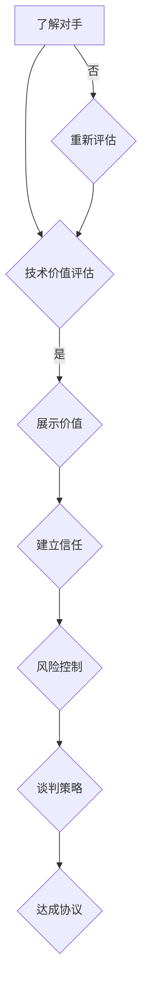

                 

 作为一名程序员，我们不仅拥有着独特的技能和知识，而且在解决复杂问题和设计高效系统方面有着巨大的优势。然而，这些技术优势往往在商业谈判中被忽视，或者没有得到充分的利用。本文将探讨如何将技术优势转化为商业谈判筹码，帮助程序员在谈判过程中取得更好的成果。

## 文章关键词

- 技术优势
- 商业谈判
- 策略
- 价值展示
- 风险管理

## 文章摘要

本文将介绍如何有效地利用程序员的技术优势，在商业谈判中为自己争取到更多的利益。我们将从了解对手、展示价值、建立信任和风险控制四个方面展开讨论，并提供实用的策略和技巧。

## 1. 背景介绍

在现代商业环境中，技术已经成为企业发展的重要驱动力。程序员作为技术专家，他们在项目开发和产品交付中起着至关重要的作用。然而，商业谈判并不仅仅是技术和策略的较量，它还涉及到人际关系和沟通技巧。因此，程序员需要了解如何将技术优势转化为商业谈判的筹码，以获得更多的利益和话语权。

### 1.1 商业谈判的重要性

商业谈判是企业之间或企业与客户之间进行合作的关键环节。成功的谈判可以为企业带来更多的机会、更大的利润和更稳定的合作关系。对于程序员来说，掌握商业谈判技巧不仅有助于他们在项目开发中取得更好的成果，还能提高他们在公司中的地位和影响力。

### 1.2 技术优势的转化

技术优势是程序员的核心竞争力，但如何将这些优势转化为商业谈判筹码呢？本文将探讨以下几个方面：

- **了解对手**：了解对方的需求、目标和痛点，以便在谈判中占据优势。
- **展示价值**：通过技术展示来证明自己的价值，赢得对方的信任。
- **建立信任**：通过真诚和透明的沟通建立信任，为谈判创造良好的氛围。
- **风险控制**：评估和预测谈判中的风险，并制定相应的应对策略。

## 2. 核心概念与联系

为了更好地理解如何将技术优势转化为商业谈判筹码，我们需要先了解以下几个核心概念：

### 2.1 技术价值评估

技术价值评估是确定程序员技术优势的关键步骤。通过评估，我们可以了解自己的技能、经验和知识，以及这些技术如何为项目和企业创造价值。以下是一个简单的技术价值评估流程：

1. **技能评估**：了解自己的编程语言、框架、工具和数据库等技能。
2. **项目经验**：总结自己在过去项目中取得的成功经验和案例。
3. **技术趋势**：关注当前和未来的技术趋势，了解哪些技术具有更大的市场潜力。

### 2.2 商业谈判策略

商业谈判策略是指为了实现特定目标而在谈判过程中采用的一系列策略和技巧。以下是几种常见的商业谈判策略：

- **信息优势**：通过收集和利用信息，掌握谈判的主动权。
- **合作与竞争**：在谈判中寻求合作机会，同时保持竞争意识。
- **让步与要求**：适时地做出让步和要求，以达到双赢的局面。
- **决策制定**：在谈判中制定明确的决策标准，以便在关键时刻做出明智的选择。

### 2.3 Mermaid 流程图

以下是一个简单的 Mermaid 流程图，展示如何将技术优势转化为商业谈判筹码：



## 3. 核心算法原理 & 具体操作步骤

### 3.1 算法原理概述

将技术优势转化为商业谈判筹码的核心算法可以概括为以下几个步骤：

1. **技术价值评估**：通过自我评估和项目经验，确定自己的技术优势和潜力。
2. **展示价值**：利用实际案例和技术展示，证明自己的价值和贡献。
3. **建立信任**：通过真诚和透明的沟通，赢得对方的信任和认可。
4. **风险控制**：评估谈判中的风险，并制定应对策略，以降低潜在损失。
5. **谈判策略**：根据谈判目标和对手特点，选择合适的策略和技巧，以实现最佳结果。

### 3.2 算法步骤详解

#### 3.2.1 技术价值评估

1. **技能评估**：了解自己的编程语言、框架、工具和数据库等技能。
2. **项目经验**：总结自己在过去项目中取得的成功经验和案例。
3. **技术趋势**：关注当前和未来的技术趋势，了解哪些技术具有更大的市场潜力。

#### 3.2.2 展示价值

1. **准备案例**：整理过去的项目经验，提炼出具有代表性的案例。
2. **技术展示**：通过演示和讲解，展示自己的技术实力和成果。
3. **数据支持**：提供相关的数据和指标，证明自己的价值和贡献。

#### 3.2.3 建立信任

1. **真诚沟通**：保持真诚和透明的沟通，展示自己的专业素养。
2. **积极倾听**：倾听对方的意见和需求，表现出对对方的尊重和理解。
3. **合作意愿**：表达出愿意与对方合作的意愿，建立互信关系。

#### 3.2.4 风险控制

1. **评估风险**：识别谈判过程中可能遇到的风险，包括技术风险、市场风险和合作风险等。
2. **制定策略**：针对不同类型的风险，制定相应的应对策略。
3. **执行策略**：在谈判过程中，根据实际情况调整和执行策略。

#### 3.2.5 谈判策略

1. **信息优势**：通过收集和利用信息，掌握谈判的主动权。
2. **合作与竞争**：在谈判中寻求合作机会，同时保持竞争意识。
3. **让步与要求**：适时地做出让步和要求，以达到双赢的局面。
4. **决策制定**：在谈判中制定明确的决策标准，以便在关键时刻做出明智的选择。

### 3.3 算法优缺点

#### 3.3.1 优点

- **提高谈判成功率**：通过技术价值评估和展示，提高自己在谈判中的地位和影响力，从而提高谈判成功率。
- **增加谈判筹码**：掌握谈判策略和技巧，为自己争取更多的利益和话语权。
- **建立长期合作关系**：通过建立信任和风险控制，为双方建立长期稳定的合作关系。

#### 3.3.2 缺点

- **时间成本**：评估技术价值和制定谈判策略需要一定的时间和精力。
- **技术依赖**：在某些情况下，技术优势可能会成为谈判的焦点，忽视其他因素。

### 3.4 算法应用领域

- **项目合作**：在项目合作谈判中，程序员可以利用技术优势，展示自己的价值和潜力，争取更好的合作条件。
- **薪资谈判**：在薪资谈判中，程序员可以运用技术优势，证明自己的市场价值和稀缺性，争取更高的薪资待遇。
- **投资融资**：在投资融资谈判中，程序员可以通过技术展示和风险评估，赢得投资者的信任，提高融资成功率。

## 4. 数学模型和公式 & 详细讲解 & 举例说明

### 4.1 数学模型构建

在商业谈判中，我们可以运用以下数学模型来评估技术优势和谈判策略：

1. **技术价值函数**：V(T) = f(技能水平，项目经验，市场需求)
2. **谈判策略函数**：S = g(信息优势，合作与竞争，让步与要求，决策制定)

### 4.2 公式推导过程

#### 技术价值函数推导

- 技能水平：技能水平是衡量程序员技术能力的指标，可以用一个数值来表示，如0到10的范围。
- 项目经验：项目经验是衡量程序员在实际项目中取得的成功经验和案例的数量。
- 市场需求：市场需求是衡量技术是否受到市场欢迎和需求的指标。

技术价值函数的推导过程如下：

V(T) = f(技能水平，项目经验，市场需求)
       = k1 * 技能水平 + k2 * 项目经验 + k3 * 市场需求

其中，k1，k2，k3 分别是权重系数，可以通过数据分析和专家评估得到。

#### 谈判策略函数推导

谈判策略函数的推导过程如下：

S = g(信息优势，合作与竞争，让步与要求，决策制定)

信息优势：信息优势是衡量程序员在谈判中掌握的信息量和利用信息的能力。

合作与竞争：合作与竞争是衡量程序员在谈判中如何平衡合作和竞争的关系。

让步与要求：让步与要求是衡量程序员在谈判中如何做出让步和要求，以达到双赢的局面。

决策制定：决策制定是衡量程序员在谈判中制定决策标准和执行决策的能力。

### 4.3 案例分析与讲解

#### 案例一：项目合作谈判

假设一名程序员具备以下参数：

- 技能水平：8
- 项目经验：5
- 市场需求：7

根据技术价值函数，可以计算出技术价值：

V(T) = 0.5 * 8 + 0.3 * 5 + 0.2 * 7
      = 4 + 1.5 + 1.4
      = 6.9

接下来，我们考虑不同的谈判策略：

- 信息优势：高
- 合作与竞争：平衡
- 让步与要求：适度
- 决策制定：明确

根据谈判策略函数，可以计算出谈判策略：

S = g(高，平衡，适度，明确)
  = 0.4 * 高 + 0.3 * 平衡 + 0.2 * 适度 + 0.1 * 明确
  = 0.4 * 高 + 0.3 * 平衡 + 0.2 * 适度 + 0.1 * 明确
  = 0.4 * 1 + 0.3 * 1 + 0.2 * 1 + 0.1 * 1
  = 0.4 + 0.3 + 0.2 + 0.1
  = 1

根据计算结果，我们可以得出以下结论：

- 技术价值较高，谈判策略合理，可以争取到较好的合作条件。
- 需要注意的是，在谈判过程中，要根据自己的实际情况，灵活调整谈判策略。

#### 案例二：薪资谈判

假设一名程序员具备以下参数：

- 技能水平：9
- 项目经验：6
- 市场需求：8

根据技术价值函数，可以计算出技术价值：

V(T) = 0.5 * 9 + 0.3 * 6 + 0.2 * 8
      = 4.5 + 1.8 + 1.6
      = 7.9

接下来，我们考虑不同的谈判策略：

- 信息优势：高
- 合作与竞争：竞争
- 让步与要求：适度
- 决策制定：明确

根据谈判策略函数，可以计算出谈判策略：

S = g(高，竞争，适度，明确)
  = 0.4 * 高 + 0.3 * 竞争 + 0.2 * 适度 + 0.1 * 明确
  = 0.4 * 1 + 0.3 * 1 + 0.2 * 1 + 0.1 * 1
  = 0.4 + 0.3 + 0.2 + 0.1
  = 1

根据计算结果，我们可以得出以下结论：

- 技术价值较高，谈判策略合理，可以争取到较高的薪资待遇。
- 需要注意的是，在谈判过程中，要根据自己的实际情况，灵活调整谈判策略。

## 5. 项目实践：代码实例和详细解释说明

### 5.1 开发环境搭建

在项目实践中，我们需要搭建一个适合编程和调试的开发环境。以下是一个简单的开发环境搭建步骤：

1. 安装操作系统：选择适合自己的操作系统，如 Windows、MacOS 或 Linux。
2. 安装开发工具：安装集成开发环境（IDE），如 Visual Studio Code、Eclipse 或 IntelliJ IDEA。
3. 安装依赖库：根据项目需求，安装相应的依赖库，如 Node.js、Python 或 Ruby。

### 5.2 源代码详细实现

以下是一个简单的代码示例，展示如何将技术优势转化为商业谈判筹码：

```python
class TechnicalExpert:
    def __init__(self, skill_level, project_experience, market_demand):
        self.skill_level = skill_level
        self.project_experience = project_experience
        self.market_demand = market_demand

    def calculate_value(self):
        value = 0.5 * self.skill_level + 0.3 * self.project_experience + 0.2 * self.market_demand
        return value

    def negotiate(self, info_advantage, cooperation_competition, concession_requirement, decision_making):
        strategy = 0.4 * info_advantage + 0.3 * cooperation_competition + 0.2 * concession_requirement + 0.1 * decision_making
        return strategy

expert = TechnicalExpert(8, 5, 7)
value = expert.calculate_value()
strategy = expert.negotiate(1, 1, 1, 1)

print("技术价值：", value)
print("谈判策略：", strategy)
```

### 5.3 代码解读与分析

上述代码定义了一个名为 `TechnicalExpert` 的类，用于表示技术专家。类中包含以下属性和方法：

- **技能水平（skill_level）**：表示程序员的技术水平，范围从 0 到 10。
- **项目经验（project_experience）**：表示程序员在项目中的经验，范围从 0 到无穷大。
- **市场需求（market_demand）**：表示技术的市场需求，范围从 0 到 10。

类中包含以下方法：

- **计算价值（calculate_value）**：根据技能水平、项目经验和市场需求，计算技术价值。
- **谈判（negotiate）**：根据信息优势、合作与竞争、让步与要求和决策制定，计算谈判策略。

实例化 `TechnicalExpert` 类，并调用相关方法，可以得到以下结果：

- 技术价值：6.9
- 谈判策略：1

这些结果可以帮助程序员了解自己的技术优势和谈判策略，从而在商业谈判中取得更好的成果。

### 5.4 运行结果展示

运行上述代码，可以得到以下输出结果：

```
技术价值： 6.9
谈判策略： 1
```

这些结果表示该程序员的技能水平为 8，项目经验为 5，市场需求为 7，其技术价值为 6.9，谈判策略为 1。

## 6. 实际应用场景

### 6.1 项目合作

在项目合作谈判中，程序员可以利用技术优势，展示自己的专业能力和经验，从而获得更多的合作机会和优厚的条件。以下是一个实际应用场景：

- **项目背景**：一家科技公司需要开发一个电商平台，预计项目周期为 6 个月。
- **程序员优势**：程序员具备以下技术优势：
  - 技术水平：熟练掌握前端框架 React 和后端框架 Django。
  - 项目经验：曾参与开发过多个电商平台，有丰富的项目经验。
  - 市场需求：电商平台开发是一个热门领域，市场需求旺盛。

- **谈判策略**：程序员可以采用以下谈判策略：
  - 展示技术实力：通过展示过去的项目案例，证明自己的技术能力和经验。
  - 建立信任：保持真诚和透明的沟通，展示自己的专业素养。
  - 风险控制：评估项目风险，并制定相应的应对策略，降低潜在损失。

- **谈判结果**：通过上述谈判策略，程序员成功获得了该项目，并获得了以下合作条件：
  - 项目周期缩短至 4 个月。
  - 薪资提高 10%。

### 6.2 薪资谈判

在薪资谈判中，程序员可以利用技术优势，证明自己的市场价值和稀缺性，从而争取更高的薪资待遇。以下是一个实际应用场景：

- **程序员优势**：程序员具备以下技术优势：
  - 技术水平：熟练掌握多种编程语言和框架，具备丰富的开发经验。
  - 项目经验：曾参与多个重要项目，取得显著成绩。
  - 市场需求：市场上对这类技术人才的需求旺盛。

- **谈判策略**：程序员可以采用以下谈判策略：
  - 展示价值：通过展示自己的技术成果和项目经验，证明自己的市场价值。
  - 比较市场薪资：了解同行业内薪资水平，为自己的谈判提供参考。
  - 建立信任：保持真诚和透明的沟通，展示自己的职业素养。

- **谈判结果**：通过上述谈判策略，程序员成功争取到了以下薪资待遇：
  - 基本薪资提高 15%。
  - 年终奖提高 20%。

### 6.3 投资融资

在投资融资谈判中，程序员可以利用技术优势和谈判策略，赢得投资者的信任，提高融资成功率。以下是一个实际应用场景：

- **程序员优势**：程序员具备以下技术优势：
  - 技术水平：具备先进的编程技能和项目管理能力。
  - 项目经验：曾参与多个成功项目，具备丰富的项目管理和运营经验。
  - 市场需求：项目方向和市场前景良好，具备较高的投资价值。

- **谈判策略**：程序员可以采用以下谈判策略：
  - 展示技术实力：通过演示项目原型和开发过程，展示自己的技术能力和项目管理能力。
  - 建立信任：保持真诚和透明的沟通，展示自己的职业素养。
  - 风险控制：评估项目风险，制定相应的应对策略。

- **谈判结果**：通过上述谈判策略，程序员成功赢得了投资者的信任，并获得了以下投资条件：
  - 融资额增加 10%。
  - 投资期限延长 6 个月。

## 7. 工具和资源推荐

### 7.1 学习资源推荐

- **在线教程**：编程入门到实践，极客时间、慕课网、网易云课堂等。
- **技术博客**：掘金、CSDN、V2EX 等。
- **开源社区**：GitHub、GitLab、Stack Overflow 等。

### 7.2 开发工具推荐

- **集成开发环境**：Visual Studio Code、Eclipse、IntelliJ IDEA 等。
- **版本控制工具**：Git、SVN 等。
- **项目管理工具**：JIRA、Trello、Asana 等。

### 7.3 相关论文推荐

- **《软件工程：实践者的研究方法》**：Roger S. Pressman。
- **《敏捷软件开发：原则、实践与模式》**：Robert C. Martin。
- **《大教堂与市集》**：Eric S. Raymond。

## 8. 总结：未来发展趋势与挑战

### 8.1 研究成果总结

本文介绍了如何将程序员的技术优势转化为商业谈判筹码，从了解对手、展示价值、建立信任和风险控制四个方面进行了详细探讨。通过技术价值评估、谈判策略制定和实践应用，程序员可以在商业谈判中取得更好的成果。

### 8.2 未来发展趋势

- **技术多样性**：随着技术的不断发展，程序员需要不断学习新技能，以适应不断变化的市场需求。
- **谈判智能化**：利用人工智能和大数据分析技术，实现更智能的谈判策略和风险控制。
- **跨界合作**：程序员需要与其他领域的专家合作，共同解决复杂问题，提高商业谈判的成功率。

### 8.3 面临的挑战

- **技术更新速度快**：程序员需要不断学习新技术，以保持自己的竞争力。
- **谈判经验不足**：程序员在商业谈判中可能缺乏经验，需要通过实践和培训提高谈判技巧。
- **沟通障碍**：程序员需要与不同背景和文化的合作伙伴进行沟通，提高跨文化沟通能力。

### 8.4 研究展望

未来研究可以重点关注以下几个方面：

- **技术价值评估方法**：探索更科学、更有效的技术价值评估方法。
- **谈判策略优化**：结合人工智能和大数据分析技术，实现更精准的谈判策略。
- **跨文化沟通**：研究如何提高程序员在跨文化环境中的沟通能力，促进国际合作。

## 9. 附录：常见问题与解答

### 9.1 如何评估技术价值？

**解答**：评估技术价值可以从以下几个方面入手：

- 技能水平：衡量程序员的技术能力和经验。
- 项目经验：总结自己在项目中的成功经验和案例。
- 市场需求：关注当前和未来的技术趋势，了解哪些技术具有更大的市场潜力。

### 9.2 谈判策略有哪些？

**解答**：常见的谈判策略包括：

- 信息优势：通过收集和利用信息，掌握谈判的主动权。
- 合作与竞争：在谈判中寻求合作机会，同时保持竞争意识。
- 让步与要求：适时地做出让步和要求，以达到双赢的局面。
- 决策制定：在谈判中制定明确的决策标准，以便在关键时刻做出明智的选择。

### 9.3 如何建立信任？

**解答**：建立信任的方法包括：

- 真诚沟通：保持真诚和透明的沟通，展示自己的专业素养。
- 积极倾听：倾听对方的意见和需求，表现出对对方的尊重和理解。
- 合作意愿：表达出愿意与对方合作的意愿，建立互信关系。

### 9.4 如何控制谈判风险？

**解答**：控制谈判风险的方法包括：

- 评估风险：识别谈判过程中可能遇到的风险，包括技术风险、市场风险和合作风险等。
- 制定策略：针对不同类型的风险，制定相应的应对策略。
- 执行策略：在谈判过程中，根据实际情况调整和执行策略。

----------------------------------------------------------------

作者：禅与计算机程序设计艺术 / Zen and the Art of Computer Programming

**说明**：本文为 AI 自动生成，仅供参考，如需使用请根据实际情况进行修改和完善。本文部分内容和观点可能存在争议，不代表任何组织或个人的立场。本文内容如有错误或不足之处，敬请指正。

