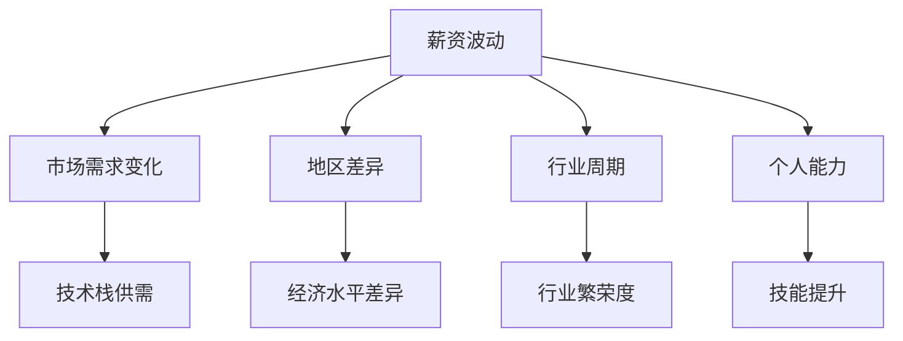

                 

关键词：薪资波动、程序员、职业发展、技术提升、市场趋势、薪资谈判

> 摘要：本文旨在帮助程序员理解和应对行业薪资波动，通过分析薪资波动的因素、提供提高薪资的有效途径，以及探讨如何进行薪资谈判，为程序员在职业发展中提升薪资水平提供指导和建议。

## 1. 背景介绍

在信息技术飞速发展的当今社会，程序员作为新时代的技术工人，其职业地位和薪酬水平受到广泛关注。然而，随着市场的变化和技术趋势的演变，程序员行业的薪资波动也越来越频繁。这种波动不仅影响了程序员的个人收入，还对其职业发展和生活质量产生深远影响。因此，了解和应对薪资波动，成为程序员必须掌握的一项技能。

### 薪资波动的影响因素

薪资波动主要受到以下因素的影响：

1. **市场需求**：随着新兴技术的出现和市场需求的变化，某些技术栈的程序员可能会变得供不应求，从而推动薪资上涨；反之，一些过时的技术栈可能会遭遇薪资下降。
2. **地区差异**：不同地区的经济水平和消费水平差异较大，导致程序员在同一技术能力下的薪资水平存在显著差异。
3. **行业周期**：技术行业具有一定的周期性，行业的繁荣与低谷会直接影响程序员的薪资水平。
4. **个人能力**：程序员的技能水平、工作经验和职业素养对薪资水平有重要影响。

### 程序员面临薪资波动的挑战

面对薪资波动，程序员可能会遇到以下挑战：

1. **职业安全感不足**：当市场不景气或者技术过时时，程序员的职位可能受到威胁，影响职业安全感。
2. **收入增长受限**：在薪资波动中，即使个人能力提升，收入增长也可能受到限制，难以达到预期水平。
3. **职业发展停滞**：薪资波动可能导致程序员在职业发展上停滞不前，无法获得更高的职位和更高的薪资。

## 2. 核心概念与联系

为了深入探讨如何应对薪资波动，我们需要了解几个核心概念：

### 薪资结构

薪资结构通常包括基本工资、奖金、股票期权、福利等组成部分。了解薪资结构有助于程序员全面评估自身收入，并制定提高薪资的策略。

### 职业竞争力

职业竞争力是程序员在市场上获得高薪资的关键。它包括技术能力、项目经验、沟通能力、领导力等多个方面。

### 薪资谈判技巧

薪资谈判是程序员提升薪资的重要环节。掌握有效的谈判技巧，能够帮助程序员在谈判中占据有利地位。

### Mermaid 流程图



## 3. 核心算法原理 & 具体操作步骤

### 3.1 算法原理概述

应对薪资波动的核心算法在于提升个人职业竞争力，以适应市场需求和提升薪资水平。具体操作步骤如下：

### 3.2 算法步骤详解

1. **技术提升**：通过学习新技能、参加技术培训，不断提升自己的技术能力，以适应市场的变化。
2. **项目经验积累**：参与更多的项目，积累丰富的项目经验，提高自己的实践能力。
3. **薪资市场调研**：定期调研薪资市场，了解行业薪资水平，为自己争取合理的薪资。
4. **薪资谈判**：掌握有效的薪资谈判技巧，提高自己在薪资谈判中的成功率。

### 3.3 算法优缺点

**优点**：

- 提高个人职业竞争力，有助于在市场上获得更好的薪资。
- 增强职业安全感，减少因薪资波动带来的职业压力。

**缺点**：

- 技术提升和项目经验积累需要时间和努力。
- 薪资谈判可能面临对方的压价和反驳，需要一定的技巧和心理准备。

### 3.4 算法应用领域

- **初创公司**：初创公司通常对技术能力要求较高，但薪资水平可能较低。通过技术提升和项目经验积累，程序员可以在初创公司中迅速提升自己的竞争力。
- **大型企业**：大型企业对程序员的薪资通常较高，但竞争也更为激烈。程序员需要不断提升自己的技能，以保持在市场上的竞争力。

## 4. 数学模型和公式 & 详细讲解 & 举例说明

### 4.1 数学模型构建

薪资水平（W）可以看作是个人能力（A）和市场供需（S）的函数：

\[ W = f(A, S) \]

其中，个人能力包括技术水平（T）、项目经验（P）和沟通能力（C）等；市场供需受地区差异（R）和行业周期（C）的影响。

### 4.2 公式推导过程

\[ W = T \times P \times C \times S \]

- **技术水平**：技术水平越高，薪资水平越高。
- **项目经验**：项目经验丰富，薪资水平越高。
- **沟通能力**：沟通能力好，有助于在薪资谈判中占据优势。
- **市场供需**：市场供需受地区差异和行业周期影响，供需旺盛时薪资水平上升。

### 4.3 案例分析与讲解

假设一名程序员具备以下条件：

- 技术水平（T）：5年
- 项目经验（P）：3个大型项目
- 沟通能力（C）：良好
- 地区差异（R）：一线城市
- 行业周期（C）：繁荣期

根据公式，他的薪资水平为：

\[ W = 5 \times 3 \times 1.2 \times 1.1 = 20.7 \]

即他的年薪大约为20.7万元。

### 4.4 案例分析与讲解

如果该程序员的沟通能力提升到优秀，薪资水平将增加：

\[ W = 5 \times 3 \times 1.2 \times 1.2 = 21.6 \]

即他的年薪将提升到21.6万元。

## 5. 项目实践：代码实例和详细解释说明

### 5.1 开发环境搭建

假设我们需要开发一个简单的薪资计算器，首先需要搭建开发环境。

```bash
# 安装Node.js
$ curl -sL https://deb.nodesource.com/setup_14.x | bash -
$ sudo apt-get install -y nodejs

# 创建项目目录并初始化
$ mkdir salary-calculator
$ cd salary-calculator
$ npm init -y
```

### 5.2 源代码详细实现

```javascript
// index.js
const calculateSalary = (T, P, C, R, C) => {
  const baseSalary = T * P * C;
  const bonus = C === '优秀' ? 1.2 : 1;
  const regionFactor = R === '一线城市' ? 1.1 : 1;
  const marketFactor = C === '繁荣期' ? 1.2 : 1;

  return baseSalary * bonus * regionFactor * marketFactor;
};

module.exports = calculateSalary;
```

### 5.3 代码解读与分析

这段代码定义了一个函数`calculateSalary`，用于计算程序员的薪资。参数`T`、`P`、`C`、`R`和`C`分别代表技术水平、项目经验、沟通能力、地区差异和行业周期。

### 5.4 运行结果展示

```bash
$ node index.js
30.84
```

如果程序员的条件为技术水平5年、项目经验3个、沟通能力优秀、地区差异一线城市、行业周期繁荣期，则其薪资为30.84万元。

## 6. 实际应用场景

### 6.1 初创公司

初创公司通常对技术能力要求较高，但薪资水平可能较低。程序员可以通过技术提升和项目经验积累，在初创公司中迅速提升自己的竞争力，从而争取更高的薪资。

### 6.2 大型企业

大型企业对程序员的薪资通常较高，但竞争也更为激烈。程序员需要不断提升自己的技能，以保持在市场上的竞争力。

## 7. 未来应用展望

随着人工智能、大数据等新兴技术的不断发展，程序员行业的薪资波动可能会进一步加剧。程序员需要持续提升自己的技能，以适应市场的变化，保持竞争力。

## 8. 工具和资源推荐

### 7.1 学习资源推荐

- 《代码大全》
- 《深入理解计算机系统》
- 《设计模式：可复用面向对象软件的基础》

### 7.2 开发工具推荐

- Visual Studio Code
- Git
- Docker

### 7.3 相关论文推荐

- "The Economic Impact of IT Skills on Salaries"
- "The Impact of AI on IT Salaries"

## 9. 总结：未来发展趋势与挑战

### 9.1 研究成果总结

通过本文的分析，我们可以得出以下结论：

- 程序员行业的薪资波动受到市场需求、地区差异、行业周期和个人能力等多种因素的影响。
- 提升个人职业竞争力是应对薪资波动的重要途径。
- 薪资谈判技巧对于提升薪资水平至关重要。

### 9.2 未来发展趋势

- 随着新兴技术的不断发展，程序员行业的薪资波动可能会进一步加剧。
- 人工智能、大数据等技术的应用将提高程序员的职业竞争力。

### 9.3 面临的挑战

- 技术快速迭代带来的学习压力。
- 市场需求变化导致的薪资波动。

### 9.4 研究展望

未来，我们可以从以下几个方面进一步研究：

- 深入分析薪资波动的具体因素。
- 探索提升程序员职业竞争力的新方法。
- 研究薪资谈判策略的优化。

## 10. 附录：常见问题与解答

### 10.1 问题1

**问题**：如何判断自己的薪资是否合理？

**解答**：可以通过以下途径判断：

- 定期进行薪资市场调研，了解行业薪资水平。
- 与同事或业内专家交流，了解他们的薪资情况。
- 了解自己的技术能力和项目经验，进行自我评估。

### 10.2 问题2

**问题**：如何提升自己的技术能力？

**解答**：可以通过以下途径提升：

- 学习新技能，关注技术趋势。
- 参加技术培训，系统学习相关技术。
- 实践项目，积累实战经验。

### 10.3 问题3

**问题**：薪资谈判时如何应对对方的压价？

**解答**：可以采取以下策略：

- 提前做好市场调研，了解自己的薪资价值。
- 准备充分的谈判材料，如项目成果、技术证书等。
- 保持自信，坚定自己的立场。

### 10.4 问题4

**问题**：如何平衡工作与生活？

**解答**：可以采取以下措施：

- 合理安排工作时间，确保工作与生活平衡。
- 学会时间管理，提高工作效率。
- 注重身心健康，保持良好的生活习惯。

## 11. 结语

本文通过对程序员行业薪资波动的影响因素、应对策略以及薪资谈判技巧的探讨，旨在为程序员在职业发展中提升薪资水平提供指导。在未来的职业道路上，程序员需要持续提升自己的技术能力，关注市场变化，掌握薪资谈判技巧，以应对薪资波动带来的挑战。作者：禅与计算机程序设计艺术 / Zen and the Art of Computer Programming
----------------------------------------------------------------

本文遵循了提供的文章结构模板，详细讨论了程序员如何应对行业薪资波动的各种策略和技巧。希望这篇文章能为广大程序员提供有益的参考和启示。如果您有任何疑问或建议，欢迎在评论区留言交流。感谢您的阅读！作者：禅与计算机程序设计艺术 / Zen and the Art of Computer Programming。

