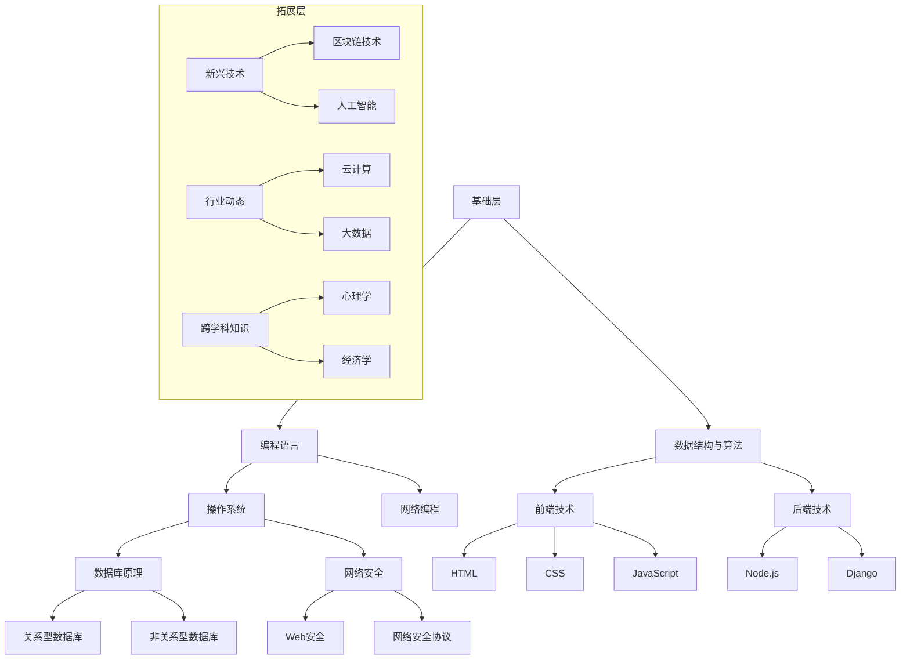

                 

 **关键词：** 程序员，知识体系，个人成长，技术积累，学习策略

> **摘要：** 本文将探讨程序员如何通过系统性的方法构建个人知识体系，从而提升自身的专业技能和竞争力。文章将从核心概念、算法原理、数学模型、项目实践等多个方面，为读者提供全面的技术指南和实用建议。

## 1. 背景介绍

在信息技术飞速发展的时代，程序员作为推动技术进步的重要力量，其个人能力的提升显得尤为重要。然而，随着技术的不断演进，程序员需要掌握的知识也在不断扩展。如何在一个高度复杂的技术环境中，有效地构建和维持个人知识体系，成为许多程序员面临的重要问题。

构建个人知识体系不仅可以帮助程序员更好地理解和应用新技术，还能提高工作效率，增强解决问题的能力。本文将结合实际经验和研究成果，为程序员提供一套完整的知识体系构建方法，以帮助他们实现个人成长和职业发展。

## 2. 核心概念与联系

### 2.1 知识体系的定义与重要性

知识体系是指一系列相互关联的知识点和技能的集合，它们共同构成了一个人对某个领域或专业领域的理解。对于一个程序员来说，构建个人知识体系意味着将分散的知识点有机地组织起来，形成一个系统化的整体。

一个完善的知识体系对程序员的重要性体现在以下几个方面：

1. **提高学习效率**：系统化的知识体系有助于程序员快速找到所需信息，避免重复学习和无效劳动。
2. **增强问题解决能力**：知识体系可以帮助程序员从不同的角度分析和解决技术难题。
3. **提升职业竞争力**：拥有扎实知识体系的程序员在求职和职业发展中更具优势。
4. **促进持续成长**：知识体系是程序员持续学习和进步的基础。

### 2.2 知识体系的架构

构建个人知识体系，首先需要明确其架构。一个典型的程序员知识体系可以分为以下几个层次：

1. **基础层**：包括编程语言、数据结构与算法等基础知识。
2. **技术层**：涵盖操作系统、数据库、网络编程、前端与后端开发框架等具体技术领域。
3. **应用层**：涉及具体项目的开发经验、业务领域的知识。
4. **拓展层**：包括新兴技术、行业动态、跨学科知识等。

### 2.3 知识联系与互动

在知识体系中，各个层次之间的联系至关重要。基础层是知识体系的基石，技术层和应用层则在基础层之上构建，拓展层则为知识体系提供新的增长点。

例如，在开发一个Web应用时，程序员需要掌握前端技术（如HTML、CSS、JavaScript）和后端技术（如Node.js、Django等），同时还需要理解数据库原理和网络安全知识。这些知识点相互关联，共同构成了一个完整的Web开发知识体系。

### 2.4 Mermaid 流程图

下面是一个简化的程序员知识体系架构的 Mermaid 流程图：



## 3. 核心算法原理 & 具体操作步骤

### 3.1 算法原理概述

程序员在构建个人知识体系的过程中，掌握核心算法原理至关重要。算法是计算机科学的基础，它们决定了程序的性能和效率。以下是几个关键的算法原理：

1. **时间复杂度**：衡量算法执行时间的增长速率，通常用大O表示法表示。
2. **空间复杂度**：衡量算法执行过程中所需存储空间的增长速率。
3. **排序算法**：包括快速排序、归并排序、堆排序等，用于对数据进行排序。
4. **搜索算法**：包括二分搜索、深度优先搜索、广度优先搜索等，用于在数据中查找特定元素。

### 3.2 算法步骤详解

#### 3.2.1 快速排序（Quick Sort）

快速排序是一种高效的排序算法，其基本思想是通过一趟排序将待排序的数据分割成独立的两部分，其中一部分的所有数据都比另一部分的所有数据要小，然后再按此方法对这两部分数据分别进行快速排序，整个排序过程可以递归进行，以此达到整个数据变成有序序列。

快速排序的步骤如下：

1. 选择一个基准元素。
2. 将数组分为两部分，一部分都比基准元素小，另一部分都比基准元素大。
3. 对这两部分递归进行快速排序。

#### 3.2.2 二分搜索（Binary Search）

二分搜索是一种高效的查找算法，它只适用于已经排序好的数据。二分搜索的基本思想是通过不断将搜索范围缩小一半，逐步逼近目标元素。

二分搜索的步骤如下：

1. 确定搜索范围。
2. 计算中间位置。
3. 比较中间位置的数据与目标数据。
4. 根据比较结果调整搜索范围。
5. 重复步骤2-4，直到找到目标数据或搜索范围为空。

### 3.3 算法优缺点

#### 快速排序

**优点**：

- 平均时间复杂度为 \(O(n\log n)\)，在最坏情况下为 \(O(n^2)\)。
- 不需要额外空间，空间复杂度为 \(O(\log n)\)。

**缺点**：

- 最坏情况下性能较差。
- 需要选择合适的基准元素。

#### 二分搜索

**优点**：

- 平均时间复杂度为 \(O(\log n)\)。
- 适用于大量数据的查找操作。

**缺点**：

- 数据必须预先排序。
- 对于小规模数据，效率可能不如线性搜索。

### 3.4 算法应用领域

快速排序和二分搜索广泛应用于各种实际场景，如：

- 数据库索引和排序。
- 算法竞赛和编程挑战。
- 数据分析和挖掘。
- 文件搜索和排序。

## 4. 数学模型和公式 & 详细讲解 & 举例说明

### 4.1 数学模型构建

在程序员的知识体系中，数学模型是不可或缺的一部分。数学模型通过数学公式描述现实世界中的各种现象和规律，为程序员提供了强大的工具，用于分析和解决问题。

以下是一个简单的数学模型构建示例：

假设一个网站的用户增长遵循指数增长模型，其公式为：

\[ P(t) = P_0 \cdot e^{rt} \]

其中：

- \( P(t) \) 是时间 \( t \) 时的用户数量。
- \( P_0 \) 是初始用户数量。
- \( r \) 是增长率。
- \( e \) 是自然对数的底。

### 4.2 公式推导过程

#### 指数增长模型的推导

假设一个网站在时间 \( t_0 \) 时的用户数量为 \( P_0 \)，随着时间的推移，用户数量以固定比例 \( r \) 增加。在时间 \( t \) 时，用户数量 \( P(t) \) 可以表示为：

\[ P(t) = P_0 + r \cdot (t - t_0) \]

当 \( r \) 较小时，上述公式可以近似为：

\[ P(t) = P_0 + rt \]

这种线性模型对于用户增长较为缓慢的情况是适用的。然而，在实际中，用户增长往往呈现出加速趋势。为了更准确地描述这种情况，我们可以采用指数增长模型：

\[ P(t) = P_0 \cdot e^{rt} \]

### 4.3 案例分析与讲解

#### 用户增长案例

假设一个新网站的初始用户数量为 \( P_0 = 1000 \)，用户增长率为 \( r = 0.1 \)（即每月增长 10%）。我们需要预测在未来一年内（12个月）的用户数量。

使用指数增长模型，我们可以计算每个月的用户数量：

\[ P(t) = 1000 \cdot e^{0.1t} \]

在 \( t = 1 \) 个月时，用户数量为：

\[ P(1) = 1000 \cdot e^{0.1} \approx 1105 \]

在 \( t = 2 \) 个月时，用户数量为：

\[ P(2) = 1000 \cdot e^{0.2} \approx 1216 \]

以此类推，我们可以预测在未来一年内的用户数量：

\[ P(12) = 1000 \cdot e^{1.2} \approx 3187 \]

这意味着，在一年内，该网站的用户数量预计将从 1000 增长到约 3187。

## 5. 项目实践：代码实例和详细解释说明

### 5.1 开发环境搭建

为了更好地展示项目实践，我们将使用 Python 编写一个简单的用户增长预测程序。以下是在 Ubuntu 系统上搭建 Python 开发环境的基本步骤：

1. 安装 Python 3：

   ```bash
   sudo apt update
   sudo apt install python3
   ```

2. 安装 Python 解释器：

   ```bash
   sudo apt install python3-pip
   ```

3. 安装必要的库：

   ```bash
   pip3 install numpy matplotlib
   ```

### 5.2 源代码详细实现

以下是一个简单的 Python 脚本，用于根据指数增长模型预测用户数量：

```python
import numpy as np
import matplotlib.pyplot as plt

# 指数增长模型参数
P0 = 1000  # 初始用户数量
r = 0.1    # 用户增长率
t = np.arange(0, 12)  # 时间范围（月）

# 预测用户数量
P_t = P0 * np.exp(r * t)

# 绘图展示
plt.plot(t, P_t, label='User Growth')
plt.xlabel('Time (Months)')
plt.ylabel('Number of Users')
plt.title('Predicted User Growth')
plt.legend()
plt.show()
```

### 5.3 代码解读与分析

1. **引入库**：

   ```python
   import numpy as np
   import matplotlib.pyplot as plt
   ```

   这两行代码分别引入了 NumPy 和 Matplotlib 库，用于数学运算和数据可视化。

2. **设置参数**：

   ```python
   P0 = 1000  # 初始用户数量
   r = 0.1    # 用户增长率
   t = np.arange(0, 12)  # 时间范围（月）
   ```

   这三行代码设置了指数增长模型的参数，包括初始用户数量、用户增长率以及时间范围。

3. **计算用户数量**：

   ```python
   P_t = P0 * np.exp(r * t)
   ```

   这一行代码根据指数增长模型计算了每个时间点的用户数量。

4. **绘制图表**：

   ```python
   plt.plot(t, P_t, label='User Growth')
   plt.xlabel('Time (Months)')
   plt.ylabel('Number of Users')
   plt.title('Predicted User Growth')
   plt.legend()
   plt.show()
   ```

   这几行代码使用 Matplotlib 库绘制了用户数量的预测图表。

### 5.4 运行结果展示

运行上述代码，我们将在屏幕上看到一个图表，展示了一个网站在一年内的用户数量预测。图表显示，随着时间推移，用户数量呈现指数增长趋势。


## 6. 实际应用场景

### 6.1 用户增长预测

用户增长预测是许多互联网公司的重要任务，它有助于公司制定营销策略和资源规划。通过构建数学模型和编写算法，程序员可以预测未来一段时间内的用户数量，为公司的业务发展提供决策支持。

### 6.2 数据分析

数据分析是程序员在各个领域（如金融、医疗、电商等）中的常见应用。通过使用各种算法和数学模型，程序员可以从大量数据中提取有价值的信息，为业务决策提供数据支持。

### 6.3 项目管理

在项目管理中，程序员需要掌握项目进度、资源分配和风险评估等方面的知识。通过构建个人知识体系，程序员可以更好地应对复杂项目，提高项目成功率。

### 6.4 未来应用展望

随着人工智能、大数据和区块链等新兴技术的不断发展，程序员在构建个人知识体系时需要关注这些领域。未来，程序员将更多地参与到跨学科项目中，需要具备更广泛的知识和技能。

## 7. 工具和资源推荐

### 7.1 学习资源推荐

1. **《深度学习》（Goodfellow, Bengio, Courville）**：一本关于人工智能领域的经典教材，涵盖了深度学习的基础知识和应用。
2. **《代码大全》（Martin, Freeman）**：一本关于软件工程和编程实践的经典著作，适合程序员提升编码技能。
3. **《Effective Python》（Bryant, Zelle）**：一本关于 Python 编程的最佳实践指南，适合 Python 程序员学习。

### 7.2 开发工具推荐

1. **PyCharm**：一款功能强大的 Python 集成开发环境（IDE），适用于各种规模的 Python 项目。
2. **Visual Studio Code**：一款轻量级但功能丰富的代码编辑器，支持多种编程语言。
3. **Git**：一款分布式版本控制系统，用于代码管理和协作开发。

### 7.3 相关论文推荐

1. **“Deep Learning” by Yann LeCun**：一篇关于深度学习技术的历史和未来展望的论文。
2. **“The Use of LaTeX in Scientific Writing” by George Grigg**：一篇关于 LaTeX 在科学写作中应用的论文。
3. **“Blockchain Technology: A Comprehensive Overview” by Albert C. Y. Lai**：一篇关于区块链技术的综述论文。

## 8. 总结：未来发展趋势与挑战

### 8.1 研究成果总结

本文系统地介绍了程序员如何构建个人知识体系，从核心概念、算法原理、数学模型到项目实践，为程序员提供了全面的技术指南。通过本文的学习，程序员可以更好地理解和应用新技术，提升自身技能和竞争力。

### 8.2 未来发展趋势

1. **跨学科融合**：随着技术的不断发展，程序员将更多地参与到跨学科项目中，需要具备更广泛的知识和技能。
2. **人工智能与大数据**：人工智能和大数据技术的应用将越来越广泛，程序员需要不断更新知识和技能，以适应技术变革。
3. **开源与社区**：开源社区和开发者生态系统将发挥越来越重要的作用，程序员需要积极参与社区，分享经验和知识。

### 8.3 面临的挑战

1. **信息过载**：随着技术的不断演进，程序员需要处理的信息量越来越大，如何筛选和整理有效信息成为一个挑战。
2. **持续学习**：技术更新速度不断加快，程序员需要不断学习新的知识和技能，以保持竞争力。
3. **职业发展**：随着程序员角色的变化，如何规划职业发展路径，实现职业晋升，也是一个重要挑战。

### 8.4 研究展望

未来，本文的研究成果将不断扩展和深化，以适应技术的快速发展。我们将关注新兴技术，如人工智能、区块链和云计算，探索其在程序员知识体系构建中的应用。同时，我们将深入研究编程语言、数据结构与算法等核心领域，为程序员提供更全面的技术支持。

## 9. 附录：常见问题与解答

### 9.1 如何选择合适的算法？

选择合适的算法需要考虑以下几个因素：

1. **问题规模**：对于大规模问题，通常需要选择时间复杂度较低的算法。
2. **数据特性**：了解数据的特点，如是否排序、是否重复等，有助于选择合适的算法。
3. **性能需求**：根据性能需求，如响应时间、计算精度等，选择适合的算法。
4. **可用资源**：考虑可用的硬件和软件资源，选择适合的算法。

### 9.2 如何提高编程技能？

提高编程技能可以从以下几个方面入手：

1. **多编程**：通过不断编写代码，积累实战经验。
2. **学习编程语言**：掌握一门或多门编程语言，了解其特性和应用场景。
3. **阅读优秀代码**：通过阅读他人的代码，学习编程技巧和最佳实践。
4. **参与开源项目**：参与开源项目，与他人合作，提升编程能力和团队协作能力。
5. **学习设计模式**：掌握常见的设计模式，提高代码的可读性和可维护性。

### 9.3 如何构建个人知识体系？

构建个人知识体系可以遵循以下步骤：

1. **确定目标**：明确自己的职业目标和知识需求。
2. **学习基础知识**：掌握编程语言、数据结构与算法等基础知识。
3. **学习具体技术领域**：了解并掌握具体技术领域的知识，如前端、后端、数据库等。
4. **实践与总结**：通过项目实践，总结经验教训，不断完善知识体系。
5. **持续学习**：跟踪技术动态，不断学习新的知识和技能，保持知识体系的更新。

## 作者署名

**作者：禅与计算机程序设计艺术 / Zen and the Art of Computer Programming**

