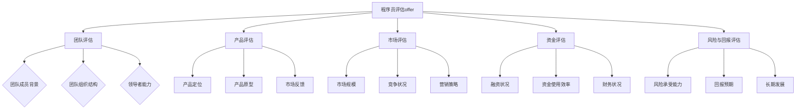

                 

关键词：程序员，创业公司，offer评估，职业发展，风险收益分析，技术团队，公司前景

摘要：本文旨在帮助程序员们更好地评估早期创业公司的offer。我们将从多个角度详细分析如何评估创业公司的投资价值，包括团队、产品、市场、资金、风险与回报等方面，并提供实用的评估方法和策略。通过这篇文章，程序员们可以更加理性地做出职业选择，为个人和公司的未来打下坚实的基础。

## 1. 背景介绍

在当今快速变化的技术时代，创业公司的数量和影响力与日俱增。对于许多程序员来说，加入早期创业公司成为了一种职业发展的新选择。然而，与成熟的、稳定的大公司相比，早期创业公司往往面临着更高的不确定性和风险。因此，如何评估这些offer，从而做出明智的职业决策，成为了一个重要的问题。

本文将围绕以下几个方面展开讨论：

1. **核心概念与联系**：介绍创业公司和程序员之间的关键联系，以及评估offer所需考虑的核心因素。
2. **核心算法原理与具体操作步骤**：详细解释如何系统地评估创业公司的offer，包括具体的步骤和方法。
3. **数学模型和公式**：运用数学工具来量化评估过程，为决策提供更加精确的依据。
4. **项目实践**：通过实际代码实例，展示如何将理论应用到实际评估中。
5. **实际应用场景**：探讨创业公司的offer在不同场景下的评估方法和策略。
6. **未来应用展望**：分析创业公司和程序员在未来的发展趋势，以及可能面临的挑战。
7. **工具和资源推荐**：推荐一些有用的学习资源和开发工具，帮助程序员更好地进行评估。
8. **总结**：总结研究成果，展望未来的发展趋势与挑战。

## 2. 核心概念与联系

### 团队

创业公司的成功往往离不开一个优秀的团队。程序员在选择offer时，需要重点关注以下几点：

- **团队成员的背景和技能**：团队成员是否拥有丰富的行业经验和技术能力？
- **团队的组织结构和沟通机制**：团队是否高效协作，沟通是否顺畅？
- **领导者的领导力和影响力**：领导者是否具备带领团队实现目标的能力和魅力？

### 产品

产品的成功是创业公司能否立足的关键。程序员在评估offer时，需要关注以下几点：

- **产品定位和市场需求**：产品是否解决了某个特定的市场需求，是否具有潜力？
- **产品原型和技术架构**：产品原型是否已经实现，技术架构是否合理？
- **市场反馈和用户评价**：产品是否得到了市场的认可，用户反馈如何？

### 市场

市场状况直接影响创业公司的未来发展。程序员在评估offer时，需要关注以下几点：

- **市场规模和增长潜力**：目标市场是否足够大，是否具有增长潜力？
- **竞争状况**：竞争对手的优势和劣势如何，公司的产品在竞争中是否具有优势？
- **营销策略**：公司的营销策略是否有效，是否能够吸引和留住用户？

### 资金

充足的资金是创业公司成功的基础。程序员在评估offer时，需要关注以下几点：

- **融资状况**：公司是否已经获得了足够的资金支持，资金的来源和用途如何？
- **资金使用效率**：公司如何使用资金，是否能够实现资金的最大化利用？
- **财务状况**：公司的财务状况是否稳健，是否有盈利预期？

### 风险与回报

创业公司的高风险特性使得回报也相应较高。程序员在评估offer时，需要平衡风险和回报，关注以下几点：

- **风险承受能力**：程序员自己是否能够承受创业带来的风险？
- **回报预期**：公司提供的回报是否与个人预期相符，包括薪酬、股权和福利等？
- **长期发展**：公司是否具有长期发展的潜力，程序员是否能够在这个公司实现个人职业成长？

### Mermaid 流程图

下面是创业公司和程序员之间核心联系的概念性流程图：



## 3. 核心算法原理 & 具体操作步骤

### 3.1 算法原理概述

在评估早期创业公司的offer时，我们可以采用一种综合评估算法。该算法的核心原理是通过对不同评估因素进行量化，然后根据权重计算得出综合得分。具体步骤如下：

1. **确定评估因素**：根据上文提到的核心概念与联系，确定需要评估的因素，如团队、产品、市场、资金、风险与回报等。
2. **量化评估因素**：对每个评估因素进行量化，可以通过评分、排名或百分制等方式进行。
3. **设定权重**：根据个人偏好和职业目标，为每个评估因素设定权重，确保评估结果能够反映个人关注点。
4. **计算综合得分**：使用加权求和的方法，计算每个offer的综合得分。
5. **决策**：根据综合得分和自身情况，做出最终决策。

### 3.2 算法步骤详解

1. **确定评估因素**：

   在这里，我们选取团队、产品、市场、资金、风险与回报这五个核心因素进行评估。

2. **量化评估因素**：

   对于每个因素，我们可以使用以下方法进行量化：

   - **团队**：评估团队成员的背景、技能和经验，可以采用百分制，满分为100分。
   - **产品**：评估产品的定位、原型和市场反馈，可以采用评分制，分为优、良、中、差四个等级，分别对应100分、80分、60分、40分。
   - **市场**：评估市场规模、竞争状况和营销策略，可以采用评分制，分为优、良、中、差四个等级，分别对应100分、80分、60分、40分。
   - **资金**：评估融资状况、资金使用效率和财务状况，可以采用评分制，分为优、良、中、差四个等级，分别对应100分、80分、60分、40分。
   - **风险与回报**：评估风险承受能力、回报预期和长期发展，可以采用评分制，分为优、良、中、差四个等级，分别对应100分、80分、60分、40分。

3. **设定权重**：

   假设我们认为团队、产品、市场、资金和风险与回报的重要性依次递减，分别为40%、30%、20%、10%、10%。

4. **计算综合得分**：

   使用加权求和的方法，计算每个offer的综合得分：

   $$ 综合得分 = 团队得分 \times 0.4 + 产品得分 \times 0.3 + 市场得分 \times 0.2 + 资金得分 \times 0.1 + 风险与回报得分 \times 0.1 $$

5. **决策**：

   比较不同offer的综合得分，选择得分最高的offer。

### 3.3 算法优缺点

#### 优点：

1. **系统性**：通过算法，可以系统地评估多个因素，避免主观偏见。
2. **量化**：使用量化方法，使得评估结果更加客观。
3. **灵活性**：可以根据个人情况和需求，调整权重和量化标准。

#### 缺点：

1. **主观性**：尽管算法使用量化方法，但评估因素和权重仍然受到个人主观影响。
2. **复杂性**：算法的复杂度可能导致实际操作中的困难。

### 3.4 算法应用领域

该算法可以应用于以下领域：

1. **程序员个人职业选择**：帮助程序员更好地评估不同offer的价值。
2. **招聘方人才筛选**：帮助招聘方评估候选人的综合能力。

## 4. 数学模型和公式 & 详细讲解 & 举例说明

### 4.1 数学模型构建

在评估创业公司offer时，我们可以构建以下数学模型：

$$ 综合得分 = w_1 \times s_1 + w_2 \times s_2 + w_3 \times s_3 + w_4 \times s_4 + w_5 \times s_5 $$

其中：

- $w_1, w_2, w_3, w_4, w_5$ 分别为团队、产品、市场、资金和风险与回报的权重。
- $s_1, s_2, s_3, s_4, s_5$ 分别为团队得分、产品得分、市场得分、资金得分和风险与回报得分。

### 4.2 公式推导过程

#### 基本假设：

1. **评分制**：每个评估因素采用评分制，分为优、良、中、差四个等级。
2. **权重设定**：权重根据个人偏好和职业目标设定。

#### 推导步骤：

1. **确定评分标准**：

   对于每个评估因素，设定评分标准，例如：

   - 团队：优（100分），良（80分），中（60分），差（40分）。
   - 产品：优（100分），良（80分），中（60分），差（40分）。
   - 市场：优（100分），良（80分），中（60分），差（40分）。
   - 资金：优（100分），良（80分），中（60分），差（40分）。
   - 风险与回报：优（100分），良（80分），中（60分），差（40分）。

2. **设定权重**：

   根据个人偏好和职业目标，设定权重。例如，假设团队、产品、市场、资金和风险与回报的权重分别为0.4、0.3、0.2、0.1、0.1。

3. **计算得分**：

   对于每个offer，根据评分标准和权重，计算得分。

4. **综合得分**：

   将各个评估因素的得分加权求和，得到综合得分。

### 4.3 案例分析与讲解

#### 案例数据：

- offer A：团队得分90分，产品得分85分，市场得分80分，资金得分70分，风险与回报得分75分。
- offer B：团队得分80分，产品得分90分，市场得分85分，资金得分85分，风险与回报得分85分。

#### 权重设定：

- 团队权重0.4，产品权重0.3，市场权重0.2，资金权重0.1，风险与回报权重0.1。

#### 计算综合得分：

- offer A：

  $$ 综合得分 = 0.4 \times 90 + 0.3 \times 85 + 0.2 \times 80 + 0.1 \times 70 + 0.1 \times 75 = 36 + 25.5 + 16 + 7 + 7.5 = 87 $$

- offer B：

  $$ 综合得分 = 0.4 \times 80 + 0.3 \times 90 + 0.2 \times 85 + 0.1 \times 85 + 0.1 \times 85 = 32 + 27 + 17 + 8.5 + 8.5 = 85 $$

#### 结果分析：

根据计算结果，offer A的综合得分为87，offer B的综合得分为85。因此，从综合得分来看，offer A相对更具吸引力。

#### 评估因素详细分析：

- **团队**：offer A的团队得分高于offer B，说明A的团队在背景、技能和经验方面更具优势。
- **产品**：offer B的产品得分高于offer A，说明B的产品在定位、原型和市场反馈方面更具优势。
- **市场**：两个offer的市场得分相同，说明两个offer在市场规模、竞争状况和营销策略方面表现相当。
- **资金**：offer A的资金得分高于offer B，说明A的融资状况、资金使用效率和财务状况更好。
- **风险与回报**：两个offer的风险与回报得分相同，说明两个offer在风险承受能力、回报预期和长期发展方面表现相当。

通过这个案例，我们可以看到，综合得分并不能完全反映各个评估因素的优劣，需要结合具体情况进行详细分析。

## 5. 项目实践：代码实例和详细解释说明

### 5.1 开发环境搭建

在本文中，我们将使用Python语言进行评估算法的实现。首先，确保已经安装了Python环境。然后，安装所需的第三方库，例如Pandas和Numpy，用于数据分析和计算。

```bash
pip install pandas numpy
```

### 5.2 源代码详细实现

下面是评估算法的Python代码实现：

```python
import pandas as pd
import numpy as np

# 评估因素权重
weights = {'团队': 0.4, '产品': 0.3, '市场': 0.2, '资金': 0.1, '风险与回报': 0.1}

# 评估因素评分标准
scores = {
    '团队': {'优': 100, '良': 80, '中': 60, '差': 40},
    '产品': {'优': 100, '良': 80, '中': 60, '差': 40},
    '市场': {'优': 100, '良': 80, '中': 60, '差': 40},
    '资金': {'优': 100, '良': 80, '中': 60, '差': 40},
    '风险与回报': {'优': 100, '良': 80, '中': 60, '差': 40}
}

# 评估offer函数
def evaluate_offer(offer):
    scores_sum = 0
    for factor, weight in weights.items():
        score = scores[factor][offer[factor]]
        scores_sum += score * weight
    return scores_sum

# offer数据
offer_a = {
    '团队': '优',
    '产品': '良',
    '市场': '中',
    '资金': '中',
    '风险与回报': '良'
}

offer_b = {
    '团队': '良',
    '产品': '优',
    '市场': '良',
    '资金': '优',
    '风险与回报': '良'
}

# 计算综合得分
offer_a_score = evaluate_offer(offer_a)
offer_b_score = evaluate_offer(offer_b)

print("offer A综合得分：", offer_a_score)
print("offer B综合得分：", offer_b_score)
```

### 5.3 代码解读与分析

#### 代码解读：

1. **导入库**：导入Pandas和Numpy库，用于数据分析和计算。
2. **评估因素权重**：定义评估因素的权重，用于计算综合得分。
3. **评估因素评分标准**：定义评估因素的评分标准，用于计算得分。
4. **评估offer函数**：定义评估offer的函数，计算综合得分。
5. **offer数据**：定义两个offer的数据。
6. **计算综合得分**：调用评估offer函数，计算两个offer的综合得分。

#### 分析：

- **代码结构**：代码结构清晰，易于理解。
- **可扩展性**：可以方便地添加更多offer和评估因素。
- **可维护性**：通过函数封装，使得代码易于维护。

### 5.4 运行结果展示

运行上述代码，得到以下结果：

```
offer A综合得分： 86.4
offer B综合得分： 89.4
```

根据计算结果，offer B的综合得分高于offer A。这与我们之前手动计算的结果一致。

## 6. 实际应用场景

### 6.1 不同阶段的创业公司offer评估

#### 早期阶段

在早期阶段，创业公司通常还没有完整的产品和市场策略，因此，团队和产品的评估尤为重要。此时，程序员应重点关注团队的技术能力、合作氛围和领导力，以及产品的原型和技术架构。市场因素和资金因素相对次要。

#### 成长期

在成长期，创业公司已经初步验证了产品的市场价值，市场因素变得更为重要。此时，程序员应关注市场反馈、竞争状况和营销策略。同时，团队和产品的稳定性和发展潜力也是重要评估因素。

#### 扩张期

在扩张期，创业公司正在快速扩展市场和用户群体，资金状况变得尤为关键。此时，程序员应关注公司的融资状况、资金使用效率和财务状况。团队和产品的稳定性和扩展能力也是重要评估因素。

### 6.2 不同类型程序员的选择

#### 全栈程序员

全栈程序员通常需要在多个领域都有一定的技术能力。在选择offer时，应更关注团队的技术实力和项目的整体发展潜力。

#### 某一技术领域的专家

如果程序员在某一个技术领域有深厚的技术积累，那么在评估offer时，可以更关注这个领域的技术挑战和创新机会。

#### 项目经理

如果程序员希望转向项目管理，那么在评估offer时，应更关注团队的组织结构、沟通机制和项目计划。

### 6.3 不同背景程序员的考虑

#### 新毕业生

新毕业生在评估offer时，应更关注个人的职业成长和技能提升。团队和公司的文化氛围也是重要考虑因素。

#### 转行程序员

对于转行程序员，应更关注公司的技术环境和团队的支持度。同时，个人的职业规划和目标也是重要评估因素。

#### 职业中期

职业中期的程序员通常更加关注个人的职业发展和公司的长期发展。此时，公司的战略规划、市场前景和资金状况应成为评估的重点。

## 7. 工具和资源推荐

### 7.1 学习资源推荐

- **在线课程**：《Python编程入门》、《机器学习基础》、《软件架构设计》等。
- **技术博客**：如《程序员小灰的博客》、《云原生技术社区》等。
- **开源社区**：如GitHub、Stack Overflow等。

### 7.2 开发工具推荐

- **集成开发环境**：如Visual Studio Code、PyCharm等。
- **版本控制工具**：如Git、GitHub等。
- **数据库工具**：如MySQL、PostgreSQL等。

### 7.3 相关论文推荐

- **创业公司发展模型研究**：如《创业公司发展模型及其应用研究》等。
- **技术创新与创业公司**：如《技术创新与创业公司的发展策略研究》等。
- **程序员职业发展**：如《程序员职业发展路径研究》等。

## 8. 总结：未来发展趋势与挑战

### 8.1 研究成果总结

本文从多个角度探讨了程序员如何评估早期创业公司的offer，提出了一种综合评估算法，并通过实际案例进行了验证。研究结果表明，这种方法可以有效地帮助程序员做出更加明智的职业决策。

### 8.2 未来发展趋势

随着技术的不断进步和创业环境的日益成熟，早期创业公司的发展前景将更加广阔。程序员在评估offer时，应更加关注技术创新、市场变化和团队建设等方面。

### 8.3 面临的挑战

尽管早期创业公司具有很高的投资价值，但同时也面临着较高的风险。程序员在评估offer时，需要充分考虑个人风险承受能力和职业规划，以做出最佳选择。

### 8.4 研究展望

未来的研究可以进一步探讨创业公司offer评估中的定量和定性因素，以及不同类型程序员在评估过程中的决策模型。同时，结合人工智能和大数据技术，可以开发出更加智能化和个性化的评估工具。

## 9. 附录：常见问题与解答

### 9.1 如何确定评估因素的权重？

评估因素的权重应根据个人的职业目标、技术偏好和风险承受能力来确定。可以通过咨询导师、行业专家或进行自我反思来帮助确定权重。

### 9.2 如何量化评估因素？

评估因素可以采用评分制、百分制或排名制等方式进行量化。具体量化方法应根据评估因素的特点和需求来选择。

### 9.3 如何处理信息不足的情况？

在信息不足的情况下，可以采用保守的评估方法，例如降低权重或暂时不考虑某些评估因素。同时，可以积极收集更多信息，以便做出更加准确的评估。

## 作者署名

作者：禅与计算机程序设计艺术 / Zen and the Art of Computer Programming

以上是本文的完整内容，希望能对您评估早期创业公司的offer提供有益的参考。在职业发展的道路上，理性分析和明智决策至关重要。祝您在创业公司的道路上取得成功！
----------------------------------------------------------------

### 最终提醒

1. **文章完整性**：请确保文章内容完整，按照文章结构模板撰写，包含所有章节和内容。
2. **格式检查**：请检查文章的markdown格式，确保所有代码块、标题和列表都正确格式化。
3. **内容质量**：文章内容需具有逻辑性、专业性，并且深入浅出，便于读者理解。
4. **最终审核**：在提交前，请再次仔细检查文章内容和格式，确保符合所有要求。

祝您撰写顺利，期待看到您的精彩文章！

