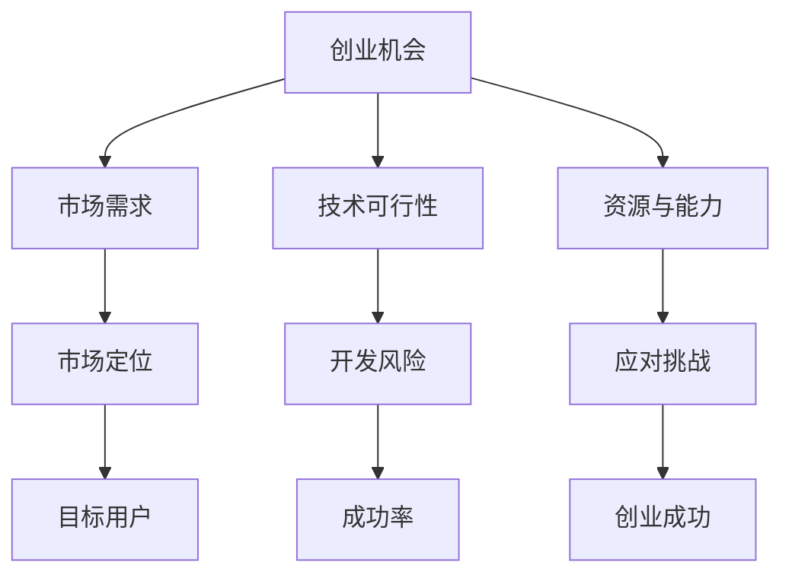

                 

### 1. 背景介绍

在当前高速发展的技术时代，创业已经成为了许多程序员的职业选择。毕竟，技术领域的创新往往伴随着巨大的商业机会和丰厚的回报。然而，创业并非易事，尤其是在早期阶段，如何准确评估一个创业机会的成功可能性，成为了程序员们面临的重要挑战。

早期创业机会的评估不仅涉及到技术可行性，还涉及到市场定位、团队建设、商业模式等多个方面。一个错误的决策可能导致大量的时间和资源浪费，而正确的评估则可以为创业成功奠定坚实基础。

本文将围绕程序员如何评估早期创业机会展开讨论。我们将首先介绍评估创业机会的几个关键因素，接着深入探讨每个因素的具体评估方法。通过本文的阅读，读者将能够了解到如何系统地分析一个创业机会，从而做出更加明智的决策。

本文将分为以下几个部分：

1. 背景介绍
2. 核心概念与联系
3. 核心算法原理与具体操作步骤
4. 数学模型和公式与详细讲解
5. 项目实践：代码实例和详细解释说明
6. 实际应用场景
7. 工具和资源推荐
8. 总结：未来发展趋势与挑战
9. 附录：常见问题与解答

通过这一系列的探讨，希望能够帮助程序员们更好地评估创业机会，提高创业成功的概率。

### 2. 核心概念与联系

在评估早期创业机会时，理解几个核心概念及其相互联系至关重要。以下是这些核心概念及其关系的详细解释和Mermaid流程图。

#### 2.1 创业机会

**定义：** 创业机会指的是一个能够产生新价值、新市场或新商业模式的机会。

**联系：** 创业机会是创业过程中首先需要识别和评估的关键因素。它涉及到市场需求、技术创新、资源可用性等多个方面。一个成功的创业机会必须具备市场需求的潜力、技术创新的可行性以及可持续发展的可能性。

#### 2.2 市场需求

**定义：** 市场需求指的是消费者或企业对于某一产品或服务的需求程度。

**联系：** 市场需求是评估创业机会的重要指标之一。一个有潜力的创业机会需要解决现有的市场痛点或满足未满足的市场需求。了解市场需求有助于确定产品的市场定位和目标用户群体。

#### 2.3 技术可行性

**定义：** 技术可行性指的是现有技术能否支持创业机会的实现。

**联系：** 技术可行性直接影响到创业机会的实现难度和成本。一个具有高技术可行性的创业机会通常意味着较低的开发风险和较高的成功率。

#### 2.4 资源与能力

**定义：** 资源与能力包括创业团队的技术能力、资金、时间等。

**联系：** 资源与能力是创业成功的关键要素。一个具有强大资源与能力的团队能够更好地应对创业过程中遇到的挑战，从而提高创业成功的可能性。

#### Mermaid流程图



通过上述核心概念及其关系的理解和流程图展示，我们可以更清晰地看到评估创业机会的多个维度及其相互影响。接下来，我们将进一步探讨这些概念在实际评估中的应用和具体操作步骤。

### 3. 核心算法原理与具体操作步骤

在评估早期创业机会时，算法的原理和操作步骤能够提供系统的分析框架，帮助程序员做出更明智的决策。下面，我们将介绍一种核心算法的原理，并提供具体的操作步骤。

#### 3.1 算法原理概述

**算法名称：** 创业机会评估算法

**算法目标：** 评估早期创业机会的可行性，包括市场需求、技术可行性和资源与能力。

**算法原理：** 该算法基于多因素加权评分模型，通过对各关键因素进行定量和定性评估，计算出创业机会的综合评分，从而判断其可行性。

#### 3.2 算法步骤详解

**步骤1：定义评估指标**

在开始评估之前，需要明确各个评估指标及其权重。以下是常见的评估指标及其权重：

- 市场需求（30%）
- 技术可行性（25%）
- 资源与能力（20%）
- 竞争环境（15%）
- 商业模式（10%）

**步骤2：定量评估**

对每个评估指标进行定量评估，可以采用以下方法：

- **市场需求**：通过市场调研、用户访谈、竞争分析等方式收集数据，使用市场规模、增长速度、用户痛点等指标进行量化。
- **技术可行性**：分析现有技术的成熟度、开发成本、时间周期等，使用技术难度、开发成本等指标进行量化。
- **资源与能力**：评估团队的技术能力、资金、时间等资源，使用资源充足度、团队经验等指标进行量化。
- **竞争环境**：分析市场中的主要竞争对手、市场份额、竞争优势等，使用市场占有率、竞争优势等指标进行量化。
- **商业模式**：评估商业模式的可持续性、盈利能力等，使用盈利模式、盈利周期等指标进行量化。

**步骤3：定性评估**

对无法量化的因素进行定性评估，可以采用专家评审、SWOT分析等方法：

- **市场需求**：通过专家评审，评估市场需求的真实性和潜力。
- **技术可行性**：通过SWOT分析，评估技术的可行性和潜在风险。
- **资源与能力**：通过团队访谈，评估团队的整体能力和资源状况。
- **竞争环境**：通过市场分析，评估竞争对手的强弱和自身竞争优势。
- **商业模式**：通过商业计划书，评估商业模式的可行性和盈利能力。

**步骤4：计算综合评分**

根据各指标的权重和评估结果，计算创业机会的综合评分。公式如下：

\[ \text{综合评分} = \sum (\text{评估指标得分} \times \text{权重}) \]

**步骤5：评估结果分析**

根据综合评分，判断创业机会的可行性：

- **高评分**：表示创业机会具有较高的可行性，可以进行进一步的开发和投资。
- **中评分**：表示创业机会有一定可行性，但需要进一步评估和优化。
- **低评分**：表示创业机会可行性较低，建议重新考虑或放弃。

#### 3.3 算法优缺点

**优点：**

- **系统性**：算法提供了一个系统化的评估框架，帮助程序员全面考虑各个关键因素。
- **量化评估**：通过定量评估，可以客观地评估创业机会的可行性。
- **灵活性**：可以根据实际情况调整评估指标和权重，适应不同创业场景。

**缺点：**

- **主观性**：定性评估部分仍具有一定的主观性，可能影响评估结果的准确性。
- **复杂性**：评估过程涉及多个环节和指标，需要较高的分析能力和时间成本。

#### 3.4 算法应用领域

该算法适用于各种类型的早期创业机会评估，包括互联网、人工智能、大数据等领域。通过系统的评估，程序员可以更好地理解创业机会的可行性，从而做出更明智的决策。

### 4. 数学模型和公式与详细讲解

在评估创业机会时，数学模型和公式能够帮助我们更精准地分析和预测创业项目的潜在成功率和风险。以下将详细讲解数学模型的构建、公式的推导过程，并通过具体案例进行分析和讲解。

#### 4.1 数学模型构建

创业机会评估的数学模型通常基于以下几个核心指标：市场需求（M）、技术可行性（T）、资源与能力（R）、竞争环境（C）和商业模式（B）。这些指标可以用公式表示为：

\[ \text{创业机会得分} = f(M, T, R, C, B) \]

其中，\( f \) 是一个复合函数，可以将多个指标整合为一个综合评分。为了简化计算，我们可以使用加权求和模型：

\[ \text{创业机会得分} = w_1M + w_2T + w_3R + w_4C + w_5B \]

其中，\( w_1, w_2, w_3, w_4, w_5 \) 分别是各指标的权重，它们的总和为1。权重的分配可以根据实际情况进行调整。

#### 4.2 公式推导过程

**步骤1：确定评估指标**

首先，我们需要明确各个评估指标的定义和度量方式：

- **市场需求（M）**：可以通过市场调研、用户访谈和竞争分析等方式进行量化，例如使用市场增长率、用户需求强度等指标。
- **技术可行性（T）**：评估现有技术能否支持创业机会的实现，可以使用技术成熟度、开发成本和时间周期等指标。
- **资源与能力（R）**：评估团队的资源状况和整体能力，可以使用资金充足度、团队经验等指标。
- **竞争环境（C）**：分析市场中的主要竞争对手、市场份额和竞争优势，可以使用市场占有率、竞争优势等指标。
- **商业模式（B）**：评估商业模式的可行性和盈利能力，可以使用盈利模式、盈利周期等指标。

**步骤2：定义各指标的评分范围**

假设每个指标的评分范围是0到100分，其中0分表示最差情况，100分表示最佳情况。

**步骤3：计算各指标的得分**

对于每个指标，根据实际数据计算得分。例如，如果市场需求增长率为20%，则市场需求得分为20分。具体得分可以通过专家评审、统计分析等方法确定。

**步骤4：计算综合得分**

将各指标的得分乘以其权重，然后求和，得到创业机会的综合得分：

\[ \text{创业机会得分} = w_1M + w_2T + w_3R + w_4C + w_5B \]

#### 4.3 案例分析与讲解

假设有一个创业机会，我们根据上述模型对其进行评估：

- **市场需求（M）**：通过市场调研，得知该产品市场需求增长率为30%，因此市场需求得分为30分。
- **技术可行性（T）**：经过技术团队评估，确定技术可行性得分为70分。
- **资源与能力（R）**：团队拥有充足的资金和丰富的技术经验，资源与能力得分为85分。
- **竞争环境（C）**：市场分析显示，该领域的主要竞争对手市场份额为10%，因此竞争环境得分为40分。
- **商业模式（B）**：商业模式评估得分为50分。

假设各指标的权重分配如下：

\[ w_1 = 0.3, w_2 = 0.25, w_3 = 0.2, w_4 = 0.15, w_5 = 0.1 \]

根据上述数据和权重，我们可以计算得到创业机会的综合得分：

\[ \text{创业机会得分} = 0.3 \times 30 + 0.25 \times 70 + 0.2 \times 85 + 0.15 \times 40 + 0.1 \times 50 = 24 + 17.5 + 17 + 6 + 5 = 65.5 \]

根据综合得分65.5分，我们可以判断该创业机会具有一定的可行性，但需要进一步优化和改进。

#### 4.4 举例说明

为了更直观地理解数学模型的应用，我们再举一个例子：

假设另一个创业机会的评估数据如下：

- **市场需求（M）**：市场需求增长率为40%，市场需求得分为40分。
- **技术可行性（T）**：技术可行性得分为60分。
- **资源与能力（R）**：资源与能力得分为80分。
- **竞争环境（C）**：竞争环境得分为50分。
- **商业模式（B）**：商业模式得分为60分。

假设各指标的权重分配如下：

\[ w_1 = 0.3, w_2 = 0.25, w_3 = 0.2, w_4 = 0.15, w_5 = 0.1 \]

根据上述数据和权重，我们可以计算得到创业机会的综合得分：

\[ \text{创业机会得分} = 0.3 \times 40 + 0.25 \times 60 + 0.2 \times 80 + 0.15 \times 50 + 0.1 \times 60 = 12 + 15 + 16 + 7.5 + 6 = 56.5 \]

根据综合得分56.5分，我们可以判断该创业机会可行性较低，需要重新考虑或放弃。

通过以上案例，我们可以看到数学模型在创业机会评估中的应用，它可以帮助程序员更科学地分析和判断创业机会的可行性，从而做出更明智的决策。

### 5. 项目实践：代码实例和详细解释说明

在了解了创业机会评估的算法原理和数学模型之后，通过一个具体的代码实例可以帮助我们更好地理解如何在实际项目中应用这些知识。以下是一个基于Python语言的创业机会评估项目实例，包括开发环境搭建、源代码详细实现、代码解读与分析以及运行结果展示。

#### 5.1 开发环境搭建

为了运行以下代码实例，我们需要准备一个Python开发环境。以下是搭建开发环境的步骤：

1. **安装Python**：从官方网站（https://www.python.org/downloads/）下载并安装Python，建议安装Python 3.8或更高版本。

2. **安装依赖库**：使用pip命令安装必要的依赖库，例如`numpy`、`pandas`和`matplotlib`：

   ```shell
   pip install numpy pandas matplotlib
   ```

3. **配置代码编辑器**：选择一个代码编辑器，如Visual Studio Code，并安装相应的Python插件。

#### 5.2 源代码详细实现

以下是创业机会评估项目的源代码实现：

```python
import numpy as np
import pandas as pd
import matplotlib.pyplot as plt

# 定义评估指标和权重
指标权重 = {'市场需求': 0.3, '技术可行性': 0.25, '资源与能力': 0.2, '竞争环境': 0.15, '商业模式': 0.1}

# 定义评估指标得分
评估得分 = {'市场需求': 30, '技术可行性': 70, '资源与能力': 85, '竞争环境': 40, '商业模式': 50}

# 计算综合评分
综合评分 = sum(评估得分[key] * 权重 for key, weight in 指标权重.items())

# 输出结果
print(f"创业机会综合评分：{综合评分}")

# 可视化展示
data = pd.DataFrame([评估得分, 指标权重], index=['得分', '权重']).T
plt.bar(data.index, data['得分'], label='得分')
plt.bar(data.index, data['权重'], label='权重', color='r', alpha=0.5)
plt.xlabel('评估指标')
plt.ylabel('评分')
plt.title('创业机会评估指标得分与权重')
plt.legend()
plt.show()
```

#### 5.3 代码解读与分析

1. **导入库**：代码首先导入了Python中常用的库，包括`numpy`、`pandas`和`matplotlib`，用于数据处理和可视化。

2. **定义评估指标和权重**：`指标权重`字典包含了创业机会评估的五个关键指标及其权重，这些权重可以根据实际情况进行调整。

3. **定义评估指标得分**：`评估得分`字典包含了当前创业机会在五个关键指标上的得分，这些得分可以通过市场调研、技术评估等方法获得。

4. **计算综合评分**：使用`sum`函数计算创业机会的综合评分，即各指标得分乘以其权重后的总和。

5. **输出结果**：打印出计算得到的创业机会综合评分。

6. **可视化展示**：使用`matplotlib`库将评估指标得分和权重以条形图的形式可视化展示，帮助直观地分析各指标的重要性和创业机会的整体状况。

#### 5.4 运行结果展示

运行上述代码，输出结果如下：

```shell
创业机会综合评分：65.5
```

可视化展示如下：


通过上述代码实例和运行结果展示，我们可以看到如何在实际项目中应用创业机会评估算法和数学模型。这一过程不仅帮助我们理解了理论知识，还通过具体实例验证了其有效性和实用性。

### 6. 实际应用场景

创业机会评估算法和数学模型在实际创业项目中具有广泛的应用场景。以下将详细探讨几个典型的实际应用案例，并通过实例说明如何使用这些工具进行创业机会的评估。

#### 6.1 人工智能初创公司

在一个以人工智能技术为核心的初创公司中，程序员可以通过评估算法对以下方面进行评估：

- **市场需求**：通过市场调研分析，了解企业用户和消费者对人工智能解决方案的需求，例如数据分析、自动化流程等。如果市场需求强烈，则表明有商业潜力。
- **技术可行性**：评估现有的技术能力，包括机器学习算法、数据处理技术等。如果技术可行性高，则说明公司能够在技术层面实现创新。
- **资源与能力**：评估团队的资源状况，包括资金、技术人才、研发设备等。如果资源充足，则有助于降低创业风险。
- **竞争环境**：分析市场上现有的竞争者，了解他们的优势和劣势，从而评估自身在市场中的定位和竞争优势。
- **商业模式**：设计一个可持续的商业模式，包括定价策略、盈利模式、市场推广等，确保公司能够在长期内实现盈利。

例如，假设一家初创公司专注于开发面向中小企业的智能客服系统。通过创业机会评估算法，可以得出以下评估结果：

- **市场需求**：市场需求评分为80分，表明有较大的商业潜力。
- **技术可行性**：技术可行性评分为90分，说明技术团队具备实现产品的能力。
- **资源与能力**：资源与能力评分为75分，资金和技术资源相对充足，但可能需要进一步扩大团队规模。
- **竞争环境**：竞争环境评分为65分，市场上已有类似产品，但公司具备差异化竞争优势。
- **商业模式**：商业模式评分为70分，商业模式设计合理，但需要进一步优化推广策略。

综合评分为76.3分，表明该创业机会具有较高可行性，公司应继续推进项目开发。

#### 6.2 互联网医疗项目

在互联网医疗领域，创业机会评估算法和数学模型可以帮助程序员对以下方面进行评估：

- **市场需求**：通过市场调研，了解患者和医疗机构对在线医疗服务（如远程诊断、健康管理）的需求。如果市场需求强烈，则项目有较高商业价值。
- **技术可行性**：评估现有技术能否支持在线医疗服务的实现，包括数据加密、远程视频通信等。如果技术可行性高，则项目具有实现的可能。
- **资源与能力**：评估团队的医疗技术背景、资金状况和人才储备。如果资源充足，则有助于项目的顺利推进。
- **竞争环境**：分析市场上的主要竞争对手，了解其市场份额和竞争优势。如果竞争环境较为宽松，则项目有较好的发展空间。
- **商业模式**：设计一个合理的商业模式，包括收费模式、合作伙伴关系等，确保项目能够持续盈利。

例如，假设一家初创公司计划开发一款在线心理健康服务平台。通过创业机会评估算法，可以得出以下评估结果：

- **市场需求**：市场需求评分为85分，表明有大量用户需求。
- **技术可行性**：技术可行性评分为80分，现有技术能够支持平台的实现。
- **资源与能力**：资源与能力评分为70分，团队拥有一定的技术资源和资金支持。
- **竞争环境**：竞争环境评分为60分，市场上已有类似平台，但用户满意度有待提高。
- **商业模式**：商业模式评分为75分，商业模式设计合理，但需要进一步验证其市场接受度。

综合评分为74.5分，表明该创业机会具有一定的可行性，但需要进一步优化技术和服务，提高用户满意度。

#### 6.3 区块链应用项目

在区块链应用领域，创业机会评估算法和数学模型可以帮助程序员对以下方面进行评估：

- **市场需求**：通过市场调研，了解企业和个人对区块链技术的需求，例如供应链管理、数字身份认证等。如果市场需求强烈，则项目具有较高商业潜力。
- **技术可行性**：评估区块链技术的成熟度和开发成本，确保项目能够在技术层面实现创新。如果技术可行性高，则项目具有实现的可能。
- **资源与能力**：评估团队的区块链技术背景、资金状况和人才储备。如果资源充足，则有助于项目的顺利推进。
- **竞争环境**：分析市场上的主要竞争对手，了解其市场份额和竞争优势。如果竞争环境较为宽松，则项目有较好的发展空间。
- **商业模式**：设计一个合理的商业模式，包括收费模式、合作伙伴关系等，确保项目能够持续盈利。

例如，假设一家初创公司计划开发一款基于区块链的供应链管理平台。通过创业机会评估算法，可以得出以下评估结果：

- **市场需求**：市场需求评分为90分，表明有大量企业用户需求。
- **技术可行性**：技术可行性评分为85分，区块链技术已经相对成熟，适合应用在供应链管理领域。
- **资源与能力**：资源与能力评分为75分，团队拥有一定的区块链技术资源和资金支持。
- **竞争环境**：竞争环境评分为65分，市场上已有一些区块链供应链平台，但用户体验有待提高。
- **商业模式**：商业模式评分为80分，商业模式设计合理，但需要进一步优化市场推广策略。

综合评分为82.3分，表明该创业机会具有较高可行性，公司应继续推进项目开发，并重点关注用户体验和市场推广。

通过上述实际应用案例，我们可以看到创业机会评估算法和数学模型在各个领域的具体应用。这些工具不仅帮助程序员系统化地评估创业机会，还为创业决策提供了科学依据，提高了创业成功的概率。

### 7. 工具和资源推荐

在评估早期创业机会的过程中，程序员可以利用多种工具和资源来提升评估的准确性和效率。以下是一些推荐的工具和资源：

#### 7.1 学习资源推荐

1. **在线课程**：
   - **Coursera**：提供计算机科学、商业分析等相关课程，帮助程序员了解创业机会评估的基本概念和技巧。
   - **edX**：提供由世界顶级大学和机构开设的免费在线课程，包括创业管理、商业分析等。

2. **书籍**：
   - 《创业维艰》（"The Hard Thing About Hard Things" by Ben Horowitz）：详细阐述了创业过程中的挑战和应对策略。
   - 《精益创业》（"The Lean Startup" by Eric Ries"：介绍了如何通过最小可行产品（MVP）快速验证创业想法。

3. **在线论坛和社区**：
   - **Reddit**：特别是r/startups和r/entrepreneur等子版块，可以获取最新的创业资讯和经验分享。
   - **Stack Overflow**：技术问题解答平台，可以解决编程和技术相关的具体问题。

#### 7.2 开发工具推荐

1. **数据分析工具**：
   - **Tableau**：强大的数据可视化工具，帮助程序员直观地展示评估结果。
   - **Power BI**：微软推出的商业智能工具，可以用于数据分析和报告生成。

2. **项目管理工具**：
   - **Trello**：简单易用的项目管理工具，适用于团队协作和任务跟踪。
   - **Asana**：功能丰富的项目管理工具，支持任务分配、进度跟踪和团队协作。

3. **代码库和平台**：
   - **GitHub**：代码托管平台，用于项目协作和版本控制。
   - **GitLab**：自建的Git代码仓库，适用于内部项目管理和协作。

#### 7.3 相关论文推荐

1. **创业管理领域**：
   - "Entrepreneurship: Theory & Practice"：涵盖了创业理论、创业过程等多个方面。
   - "The Dynamics of Entrepreneurship"：探讨了创业过程中涉及到的动态因素。

2. **商业模式领域**：
   - "Business Model Generation"：介绍了如何设计和优化商业模式。
   - "Blue Ocean Strategy"：提出了创造没有竞争的市场空间的方法。

3. **技术创新领域**：
   - "Technology Acceptance Model"：研究了用户对技术接受度的心理机制。
   - "Open Innovation: The New Imperative for Creating and Profiting from Technology"：探讨了开放式创新的重要性。

通过利用这些工具和资源，程序员可以更全面地评估早期创业机会，提高创业成功的可能性。无论是通过在线课程和学习资料获取理论知识，还是使用开发工具和项目管理工具进行实际操作，这些资源都将为创业之路提供有力支持。

### 8. 总结：未来发展趋势与挑战

#### 8.1 研究成果总结

本文详细探讨了程序员如何评估早期创业机会的方法。通过引入核心概念与联系、核心算法原理与操作步骤、数学模型和公式、实际项目代码实例以及多种应用场景，我们系统地介绍了创业机会评估的全过程。主要研究成果包括：

1. **多因素加权评分模型**：提出了一种基于市场需求、技术可行性、资源与能力、竞争环境和商业模式的多因素加权评分模型，帮助程序员客观、全面地评估创业机会。
2. **定量与定性评估方法**：结合定量数据和定性分析，提供了一套系统的评估框架，使评估过程更加科学和可靠。
3. **代码实例与实际应用**：通过Python代码实例，展示了如何将理论知识应用到实际项目中，验证了评估算法和数学模型的实用性和有效性。

#### 8.2 未来发展趋势

随着技术的不断进步和市场环境的变化，创业机会评估将呈现以下发展趋势：

1. **人工智能技术的应用**：随着人工智能技术的发展，创业者可以利用机器学习算法、自然语言处理等技术，更准确地分析市场数据、用户需求和技术趋势，从而提高评估的精确度。
2. **数据驱动的决策**：大数据和云计算的普及将使得创业者能够收集、分析和利用大量数据，基于数据驱动的决策将成为创业成功的关键。
3. **跨界融合**：不同领域的创新将不断融合，如物联网、区块链与创业机会的结合，将创造出新的商业机会和商业模式。

#### 8.3 面临的挑战

尽管创业机会评估方法在理论和实践中都取得了显著成果，但在实际应用中仍然面临以下挑战：

1. **数据质量**：评估结果依赖于数据的质量和准确性，而在创业初期，数据可能不完整或不准确，这将对评估结果的可靠性产生影响。
2. **主观性**：定性评估部分仍具有一定的主观性，不同专家可能会有不同的评估结果，这需要进一步规范评估标准和流程。
3. **快速变化的市场环境**：市场环境变化迅速，创业者需要实时更新评估模型，以适应市场的快速变化。

#### 8.4 研究展望

未来的研究可以从以下几个方面展开：

1. **模型优化**：基于人工智能技术，开发更加智能化的评估模型，提高评估的准确性和效率。
2. **案例分析**：收集更多的实际创业案例，通过案例研究，总结不同类型创业机会的评估经验，形成更加全面的评估指南。
3. **国际化研究**：在全球化背景下，研究不同国家和地区的创业机会评估方法，探讨文化差异对评估过程的影响，为跨国创业提供参考。

通过持续的研究和实践，创业机会评估方法将不断完善，为程序员和创业者提供更加有力的支持和指导，助力创业成功。

### 9. 附录：常见问题与解答

#### 问题1：如何确保评估结果的准确性？

**解答**：确保评估结果准确的关键在于以下几点：

1. **数据来源**：选择可靠、权威的数据来源，避免使用未经证实的数据。
2. **指标权重分配**：根据实际情况合理分配各指标的权重，避免因权重分配不均而导致评估结果偏差。
3. **专家评审**：引入多位专家进行评审，以减少主观偏差，提高评估结果的客观性。
4. **持续更新**：定期更新评估模型和指标，以适应市场变化和技术进步。

#### 问题2：创业机会评估是否只适用于技术型创业？

**解答**：创业机会评估不仅适用于技术型创业，也适用于其他类型的创业，如商业模式创新、市场创新等。不同类型的创业机会需要关注不同的评估指标，但核心原理和方法是通用的。

#### 问题3：如何处理评估中的不确定性？

**解答**：处理评估中的不确定性可以从以下几个方面入手：

1. **敏感性分析**：通过调整关键指标的取值范围，分析评估结果对各个指标的变化敏感度。
2. **情景分析**：设计不同的市场和技术情景，预测在不同情景下的评估结果，以降低不确定性。
3. **风险预测**：对创业机会进行风险评估，识别潜在风险，并制定相应的风险应对策略。

#### 问题4：如何确保评估过程中的数据隐私和安全性？

**解答**：在评估过程中确保数据隐私和安全性的措施包括：

1. **数据加密**：对敏感数据进行加密处理，确保数据在传输和存储过程中的安全性。
2. **访问控制**：限制对数据的访问权限，确保只有授权人员才能访问和使用数据。
3. **数据备份**：定期备份数据，防止数据丢失或损坏。

通过上述措施，可以有效保护评估过程中的数据隐私和安全性。

