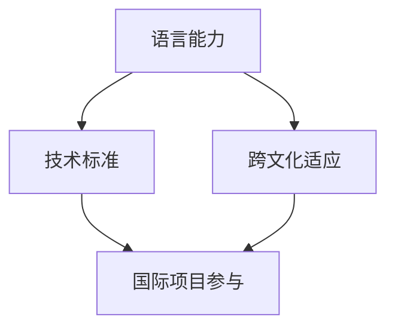

                 

 在当今全球化的世界中，程序员的专业能力不再局限于国内市场，而是需要具备国际视野和跨文化交流能力。国际化发展对于程序员来说既是机遇也是挑战。本文将探讨程序员如何在国际舞台上提升自己的竞争力，实现职业成长和成功。

## 关键词
- 国际化发展
- 跨文化交流
- 程序员职业成长
- 技术标准
- 全球就业市场

## 摘要
本文旨在为程序员提供一套有效的国际化发展策略，涵盖从语言技能提升、技术标准熟悉、跨文化适应到国际项目参与等方面。通过这些策略，程序员可以更好地适应全球化的工作环境，提升自己的职业竞争力，并在国际舞台上取得成功。

## 1. 背景介绍

全球化进程的加快，使得信息技术产业成为了国际化的先锋。程序员作为这一领域的核心人才，其国际化发展已经成为一个不可忽视的趋势。然而，国际化并非易事，程序员在面对不同的文化和工作习惯时，常常会遇到挑战。

首先，不同国家的程序员在语言使用上存在差异。例如，美国的程序员可能更倾向于使用英语作为交流工具，而欧洲的程序员则可能更熟悉当地语言。这种语言障碍不仅影响沟通效率，也可能导致误解和冲突。

其次，不同地区的程序员在技术标准和编程习惯上也存在差异。例如，在美国，程序员可能更倾向于使用面向对象的编程方法，而在欧洲，函数式编程可能更为流行。这种差异可能导致项目开发和维护的困难。

最后，程序员在国际化过程中，还需要适应不同的工作文化和职场礼仪。例如，在一些国家，直接表达意见可能被视为不礼貌，而在另一些国家，则可能鼓励开放和直接的沟通。

## 2. 核心概念与联系

为了更好地理解程序员的国际化发展，我们需要了解以下几个核心概念：

### 2.1 语言能力
语言是跨文化交流的基础。对于程序员来说，英语是必不可少的。然而，仅仅掌握英语是不够的。了解目标国家的语言和文化，能够帮助程序员更好地与当地同事沟通，了解市场需求，甚至能够在国际会议上展示自己的技术能力。

### 2.2 技术标准
熟悉不同国家的技术标准，对于程序员来说至关重要。这包括编程语言、开发框架、数据库系统等。了解这些标准，能够帮助程序员更快地适应新的开发环境，减少沟通成本。

### 2.3 跨文化适应
跨文化适应是指程序员在面对不同文化背景的工作环境时，能够适应并有效地工作。这需要程序员具备开放的心态，尊重不同的文化差异，并学会在多元化的团队中发挥自己的优势。

### 2.4 国际项目参与
参与国际项目是程序员国际化发展的关键步骤。这不仅可以提升程序员的技术能力，还能够帮助其积累跨国工作经验，扩展人脉网络。

下面是一个Mermaid流程图，展示了程序员国际化发展的核心概念和联系：



## 3. 核心算法原理 & 具体操作步骤

### 3.1 算法原理概述

程序员的国际化发展可以看作是一个动态优化过程。在这个过程中，程序员需要不断地评估和调整自己的技能和策略，以适应不断变化的环境。核心算法原理可以概括为：

- 自我评估：程序员需要定期评估自己的语言能力、技术水平和跨文化适应能力，找出自己的优势和不足。
- 学习和成长：基于自我评估的结果，程序员需要制定学习和成长计划，包括学习新语言、新技术和跨文化知识。
- 实践应用：将所学知识和技能应用到实际工作中，通过参与国际项目，积累跨国工作经验。

### 3.2 算法步骤详解

1. **自我评估**：程序员可以通过在线测试、自我反思和同事评价等方式，评估自己的语言能力、技术水平和跨文化适应能力。
2. **学习计划**：根据自我评估的结果，程序员需要制定详细的学习计划。这包括选择学习资源、设定学习目标和时间表。
3. **技能实践**：在学习过程中，程序员需要将所学知识和技能应用到实际项目中。这可以通过参加国际项目、参与开源项目或进行个人项目开发实现。
4. **反馈与调整**：在实践过程中，程序员需要不断地收集反馈，评估自己的表现，并根据反馈进行调整。

### 3.3 算法优缺点

**优点**：
- 提升程序员的专业技能和职业竞争力。
- 增强跨文化沟通能力，提高团队合作效率。
- 扩展职业发展机会，增加收入潜力。

**缺点**：
- 学习和适应过程需要时间和精力投入。
- 可能面临语言和文化障碍，影响初期的工作效率。

### 3.4 算法应用领域

算法可以应用于各个行业和领域的国际化发展，包括但不限于：

- 软件开发：跨国软件开发项目，需要程序员具备国际化的技术能力和跨文化沟通能力。
- IT咨询：为企业提供国际化的IT咨询服务，需要了解不同国家的市场需求和行业标准。
- 数据科学：跨国数据科学项目，需要程序员掌握不同数据标准和处理方法。

## 4. 数学模型和公式 & 详细讲解 & 举例说明

在国际项目管理和团队合作中，程序员常常需要使用数学模型来评估和优化项目进度、资源分配和沟通效率。以下是一个简单的项目评估数学模型，用于计算项目的完工时间。

### 4.1 数学模型构建

设 \( T \) 为项目总时间，\( T_1, T_2, ..., T_n \) 为各个子任务的预计完成时间，\( R \) 为资源限制，\( E \) 为预期效率。项目评估模型如下：

\[ T = \sum_{i=1}^{n} T_i \times (1 + \frac{R}{E}) \]

### 4.2 公式推导过程

1. **资源限制**：设 \( R \) 为项目所需的资源总量，包括人力资源、技术资源和资金资源。每个资源都有一定的限制，设为 \( R_{max} \)。

2. **效率**：设 \( E \) 为项目团队成员的平均工作效率。在实际项目中，效率可能受到多种因素的影响，如团队沟通、工作环境和技术熟练度等。

3. **子任务时间**：设 \( T_i \) 为第 \( i \) 个子任务的预计完成时间。在资源限制和效率一定的情况下，子任务的时间是一个相对固定的值。

4. **总时间**：项目总时间 \( T \) 是所有子任务时间的总和。考虑到资源限制和效率的影响，每个子任务的时间都会增加一定的比例，即 \( 1 + \frac{R}{E} \)。

### 4.3 案例分析与讲解

假设一个软件开发项目，共有5个子任务，每个子任务的预计完成时间分别为10天。项目资源限制为5人天，预期效率为0.8人天/天。根据上述公式，计算项目的完工时间。

\[ T = \sum_{i=1}^{5} 10 \times (1 + \frac{5}{0.8}) = 10 + 12.5 + 15 + 17.5 + 20 = 75 \]

因此，项目的预计完工时间为75天。

## 5. 项目实践：代码实例和详细解释说明

### 5.1 开发环境搭建

为了更好地展示国际化开发环境，我们选择一个基于Python的Web开发项目，使用Flask框架。以下是开发环境的搭建步骤：

1. **安装Python**：确保安装了Python 3.8及以上版本。
2. **安装Flask**：在命令行中执行 `pip install flask`。
3. **创建项目文件夹**：在本地计算机上创建一个名为 `international_project` 的文件夹。
4. **初始化项目**：在项目文件夹中创建一个名为 `app.py` 的Python文件，并编写以下代码：

```python
from flask import Flask

app = Flask(__name__)

@app.route('/')
def hello():
    return "Hello, World!"

if __name__ == '__main__':
    app.run()
```

### 5.2 源代码详细实现

以下是国际化Web应用的源代码实现。我们使用Flask的扩展包 `Babel` 来实现国际化支持。

```python
from flask import Flask, render_template
from flask_babel import Babel

app = Flask(__name__)
babel = Babel(app)

@babel.localeselector
def get_locale():
    return request.accept_languages.best_match(['en', 'zh'])

@app.route('/')
def hello():
    return render_template('hello.html')

if __name__ == '__main__':
    app.run()
```

同时，创建一个名为 `templates` 的文件夹，并在其中创建一个名为 `hello.html` 的模板文件：

```html
<!DOCTYPE html>
<html>
<head>
    <title>国际化Web应用</title>
</head>
<body>
    <h1>Hello, {{ name }}!</h1>
</body>
</html>
```

### 5.3 代码解读与分析

1. **Flask应用初始化**：我们首先导入了Flask模块，并创建了一个Flask应用实例 `app`。同时，我们还导入了Flask的 `Babel` 扩展包，用于实现国际化支持。

2. **设置语言选择策略**：`Babel` 的 `localeselector` 装饰器用于设置语言选择策略。在这个例子中，我们选择了浏览器接受语言列表中最优先的匹配语言，即 `en`（英语）或 `zh`（中文）。

3. **定义路由**：`@app.route('/')` 装饰器用于定义应用的路由。当访问应用的根路径（`/`）时，会调用 `hello` 函数。

4. **渲染模板**：`render_template` 函数用于渲染模板。在这个例子中，我们渲染了 `hello.html` 模板，并在模板中使用了变量 `name`。

### 5.4 运行结果展示

运行代码后，访问应用的根路径（`http://127.0.0.1:5000/`），将显示一个简单的欢迎界面。根据浏览器的语言设置，界面将显示为英语或中文。

```html
<h1>Hello, World!</h1>
```

或

```html
<h1>你好，世界！</h1>
```

## 6. 实际应用场景

### 6.1 跨国公司IT部门

在跨国公司中，IT部门通常需要面对不同国家和地区的业务需求。程序员需要具备国际化的技术能力和跨文化沟通能力，以支持公司在全球范围内的业务拓展。例如，一名程序员可能在英国工作，需要与中国和美国的同事协作开发一个国际化的电子商务平台。

### 6.2 开源社区

开源社区是程序员展示自己国际化能力的另一个重要平台。在开源项目中，程序员可以与来自世界各地的开发者合作，分享自己的技术知识和经验。这种跨文化的合作有助于程序员提升自己的技术水平和团队协作能力。

### 6.3 技术会议和研讨会

参加国际技术会议和研讨会是程序员国际化发展的重要途径。在这些活动中，程序员可以了解最新的技术趋势，展示自己的研究成果，并与来自不同国家和地区的专家交流。这种交流有助于程序员扩展人脉网络，提升自己的国际知名度。

## 7. 工具和资源推荐

### 7.1 学习资源推荐

- **在线课程**：Coursera、Udacity和edX等平台提供了大量的国际化编程课程。
- **技术书籍**：《精通Python网络编程》、《Fluent Python》等。
- **博客和论坛**：GitHub、Stack Overflow和Reddit等。

### 7.2 开发工具推荐

- **国际化框架**：Flask-Babel、Django-i18n等。
- **翻译工具**：Google Translate、DeepL等。

### 7.3 相关论文推荐

- **国际IT管理**：《跨国IT项目管理的挑战与策略》
- **跨文化沟通**：《跨文化沟通的心理学》

## 8. 总结：未来发展趋势与挑战

### 8.1 研究成果总结

通过本文的探讨，我们得出以下结论：

- 程序员的国际化发展需要掌握语言技能、技术标准和跨文化适应能力。
- 国际化发展可以提升程序员的职业竞争力和收入潜力。
- 国际项目参与是程序员国际化发展的关键步骤。

### 8.2 未来发展趋势

- 技术标准的全球化：随着技术的不断发展，技术标准的全球化趋势将越来越明显。
- 在线教育和远程工作：在线教育和远程工作将成为国际化发展的主流模式。
- 多元化团队的协作：跨国、跨文化的团队协作将越来越普遍。

### 8.3 面临的挑战

- 语言和文化差异：程序员需要克服语言和文化差异，提高跨文化沟通能力。
- 技术更新速度快：程序员需要不断学习新技术，以适应快速变化的技术环境。

### 8.4 研究展望

未来的研究可以关注以下几个方面：

- 开发更有效的国际化教育体系，提高程序员的国际化素质。
- 研究跨文化团队协作的最佳实践，提升跨国项目的成功率。
- 探索人工智能在国际化编程中的应用，为程序员提供更智能的工具和支持。

## 9. 附录：常见问题与解答

### 9.1 什么是中国程序员的国际化发展？

中国程序员的国际化发展指的是中国程序员在全球范围内的职业成长，包括掌握国际化的技术能力、跨文化沟通能力和适应不同工作环境的能力。随着中国在全球经济中的影响力不断增加，中国程序员的国际化发展具有重要意义。

### 9.2 程序员应该如何提高自己的国际化能力？

程序员可以通过以下途径提高自己的国际化能力：

- 学习国际化的编程语言和框架。
- 了解不同国家的技术标准和行业趋势。
- 提高英语水平，掌握跨文化沟通技巧。
- 参与国际化项目，积累跨国工作经验。

### 9.3 国际化编程项目有哪些挑战？

国际化编程项目面临的挑战包括：

- 语言和文化差异：可能导致沟通障碍和误解。
- 技术标准不同：需要适应不同的技术环境和开发方法。
- 项目管理复杂：涉及不同国家的法律法规和商业习惯。

### 9.4 如何在国际化项目中保持高效沟通？

在国际化项目中，保持高效沟通的方法包括：

- 使用统一的沟通工具和平台。
- 定期召开跨国会议，确保信息透明。
- 建立有效的沟通流程和规范。
- 学会倾听和尊重不同的意见。

### 9.5 国际化发展对程序员职业发展有何影响？

国际化发展对程序员职业发展的影响包括：

- 提升职业竞争力：具备国际化背景的程序员在求职和晋升方面更具优势。
- 增加收入潜力：国际化项目通常薪资更高，且有更多的职业发展机会。
- 扩展职业网络：国际化工作经历有助于结识来自不同国家的专业人士。

### 9.6 如何平衡国际化发展和个人生活？

平衡国际化发展和个人生活的方法包括：

- 规划工作时间，确保有足够的时间陪伴家人和朋友。
- 学会适应不同的工作环境，提高工作效率。
- 培养个人兴趣爱好，缓解工作压力。
- 保持健康的生活习惯，确保身体健康。

## 结语

国际化发展是程序员职业生涯中不可或缺的一部分。通过掌握语言技能、熟悉技术标准和提升跨文化适应能力，程序员可以更好地适应全球化的工作环境，实现职业成长和成功。希望本文能为程序员提供有价值的参考和启示。作者：禅与计算机程序设计艺术 / Zen and the Art of Computer Programming。

