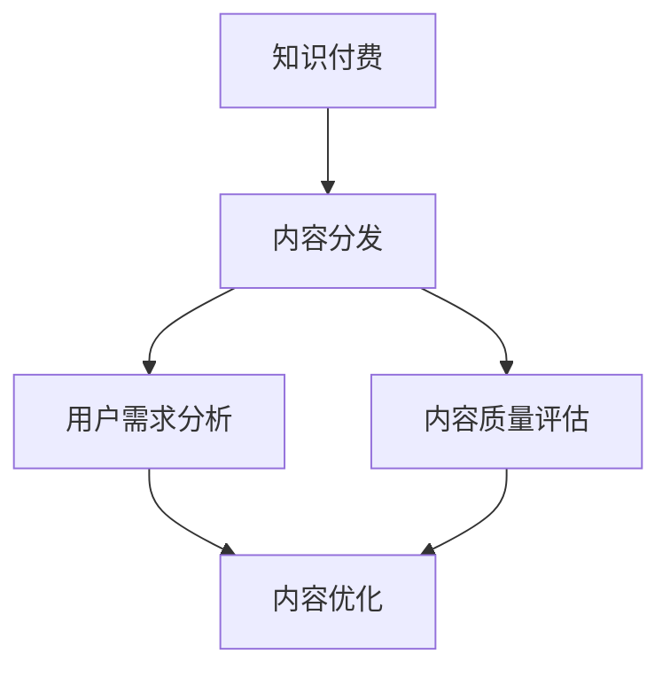

                 

在数字时代，知识付费逐渐成为知识共享与传播的重要方式。对于程序员来说，知识付费不仅为他们提供了额外的收入来源，也为他们提供了一个展示专业技能的平台。然而，如何有效地进行知识付费的内容分发，使其既能够满足读者的需求，又能保证内容的质量和收益，是每个程序员都需要深入思考的问题。

本文将围绕“程序员如何进行知识付费的内容分发”这一主题，从以下几个方面展开讨论：

- **背景介绍**：首先，我们将简要回顾知识付费的发展历程及其对程序员的影响。
- **核心概念与联系**：接着，我们将介绍知识付费内容分发中的核心概念，并利用Mermaid流程图展示其关联架构。
- **核心算法原理与具体操作步骤**：我们将深入探讨内容分发的算法原理，并提供详细的操作步骤。
- **数学模型和公式**：随后，我们将介绍支持内容分发的数学模型和公式，并进行案例分析和讲解。
- **项目实践**：我们将通过一个实际项目展示如何进行内容分发。
- **实际应用场景**：接下来，我们将探讨知识付费在不同领域的应用。
- **未来应用展望**：最后，我们将对知识付费的内容分发进行未来应用的展望。

通过对以上内容的探讨，希望能够帮助程序员更好地进行知识付费的内容分发，提升自己的专业技能和影响力。

## 1. 背景介绍

知识付费是一种在互联网时代兴起的商业模式，它指的是用户为获取特定的知识或服务而支付一定费用。这种模式最早可以追溯到20世纪末，随着互联网技术的发展和普及，知识付费逐渐成为知识共享与传播的重要途径。

对于程序员而言，知识付费不仅为他们提供了额外的收入来源，还为他们提供了一个展示专业技能的平台。在传统的软件开发行业中，知识往往是隐性的，程序员的经验和技术只能通过个别交流或团队协作得以传承。而知识付费的出现，使得程序员可以将自己的专业知识系统化、结构化地呈现给更广泛的读者。

知识付费对程序员的影响主要体现在以下几个方面：

1. **收入多元化**：知识付费为程序员提供了一种新的收入来源，不仅可以从传统的软件开发项目中获取收入，还可以通过知识付费获得额外收益。
2. **技能提升**：为了满足读者的需求，程序员需要不断更新和深化自己的专业知识，这有助于提升他们的技能水平。
3. **影响力扩大**：通过知识付费，程序员可以影响更多的人，提升自己的专业声誉和影响力。
4. **知识传播**：知识付费使得程序员的知识得以更广泛地传播，有助于知识的共享和传承。

总的来说，知识付费为程序员提供了一种新的职业发展路径，使得他们在数字化时代能够更好地实现个人价值和职业目标。

## 2. 核心概念与联系

在讨论程序员如何进行知识付费的内容分发之前，我们需要了解一些核心概念和它们之间的关系。这些核心概念包括：知识付费、内容分发、用户需求分析、内容质量评估等。下面，我们将通过Mermaid流程图展示这些概念之间的关联。



### 知识付费

知识付费指的是用户为获取特定知识或服务而支付一定费用的行为。在程序员的知识付费体系中，知识付费通常表现为以下几种形式：

1. **在线课程**：程序员将自己的专业知识录制成视频课程，并通过在线平台进行销售。
2. **电子书**：程序员撰写专业书籍或教程，以电子书的形式在各大电子书平台进行销售。
3. **直播授课**：程序员通过直播平台进行实时授课，用户可以根据需要付费观看。

### 内容分发

内容分发是指将程序员的知识内容通过不同渠道传播给目标用户的过程。内容分发的方式多种多样，包括：

1. **社交媒体**：通过微博、微信、知乎等社交平台发布知识内容，吸引用户关注和付费。
2. **在线教育平台**：如Coursera、Udemy等，这些平台提供了丰富的课程资源，程序员可以在这里发布自己的知识内容。
3. **个人博客**：通过个人博客或技术博客发布技术文章，吸引读者并引导他们进行知识付费。

### 用户需求分析

用户需求分析是内容分发的重要一环。程序员需要通过市场调研和数据分析，了解用户的需求和偏好，从而制定合适的内容策略。具体步骤如下：

1. **市场调研**：通过问卷调查、访谈等方式收集用户的需求和反馈。
2. **数据分析**：利用大数据技术对用户行为进行分析，了解用户的浏览、购买习惯。
3. **需求分类**：根据用户需求，将内容分为不同类别，如初级教程、进阶课程等。

### 内容质量评估

内容质量是知识付费的核心。程序员需要确保所提供的内容具有高质量，才能赢得用户的信任和忠诚。内容质量评估可以从以下几个方面进行：

1. **内容准确性**：确保内容中的知识准确无误，没有误导用户。
2. **内容深度**：内容应该具有一定的深度，能够满足用户的学习需求。
3. **用户体验**：内容应以用户为中心，提供良好的阅读体验，如清晰的图表、代码示例等。

通过上述核心概念的介绍和Mermaid流程图的展示，我们可以更清晰地理解程序员如何进行知识付费的内容分发。

## 3. 核心算法原理与具体操作步骤

在进行知识付费的内容分发时，算法原理是至关重要的。以下是核心算法原理的概述及其具体操作步骤。

### 3.1 算法原理概述

知识付费内容分发算法主要涉及用户行为分析、内容推荐和支付处理三个核心环节。用户行为分析通过收集用户在平台上的浏览、搜索、购买等行为数据，了解用户的需求和偏好。内容推荐基于用户行为分析结果，利用推荐算法为用户推荐符合他们需求的内容。支付处理则负责处理用户的支付请求，确保交易的安全和顺畅。

### 3.2 算法步骤详解

1. **用户行为分析**：
   - **数据收集**：通过跟踪用户在平台上的行为，如浏览、搜索、购买等，收集用户行为数据。
   - **数据预处理**：对收集到的数据进行清洗和预处理，包括去除重复数据、填充缺失值等。
   - **特征提取**：从预处理后的数据中提取关键特征，如用户活跃度、购买频率、内容偏好等。

2. **内容推荐**：
   - **推荐算法选择**：选择适合的内容推荐算法，如基于协同过滤、基于内容的推荐等。
   - **推荐列表生成**：根据用户行为数据和推荐算法，生成用户的内容推荐列表。

3. **支付处理**：
   - **支付接口集成**：与支付服务提供商合作，集成支付接口。
   - **支付流程处理**：处理用户的支付请求，确保支付过程的安全和顺畅。

### 3.3 算法优缺点

**优点**：
- **个性化推荐**：通过用户行为分析，为用户提供个性化的内容推荐，提高用户满意度和参与度。
- **提高收益**：通过推荐算法，提高用户购买转化率，从而提高平台的收益。
- **优化用户体验**：支付处理的优化确保了交易的顺畅，提高了用户的使用体验。

**缺点**：
- **数据隐私**：用户行为数据的使用需要确保用户隐私的保护，避免数据泄露。
- **算法偏差**：推荐算法可能存在偏差，导致推荐结果不公正。
- **计算成本**：推荐算法和支付处理需要大量的计算资源，可能导致平台成本增加。

### 3.4 算法应用领域

知识付费内容分发算法广泛应用于在线教育、电子书销售、技能培训等领域。以下是具体的应用案例：

- **在线教育平台**：通过算法为学习者推荐适合的课程，提高学习效果。
- **电子书销售**：为读者推荐相关书籍，提高购买转化率。
- **技能培训**：为学员推荐适合的培训课程，帮助他们提升技能。

通过以上算法原理和具体操作步骤的介绍，我们可以看到，知识付费内容分发算法在提高内容分发效率、优化用户体验和提升收益方面具有重要作用。接下来，我们将进一步探讨数学模型和公式，以支持内容分发。

## 4. 数学模型和公式

在知识付费的内容分发过程中，数学模型和公式扮演着至关重要的角色。以下我们将详细介绍支持内容分发的数学模型和公式，并通过具体案例进行解释和说明。

### 4.1 数学模型构建

内容分发的数学模型通常涉及以下几个关键部分：

1. **用户行为模型**：描述用户在平台上的行为模式，如浏览、搜索、购买等。
2. **内容推荐模型**：基于用户行为模型，为用户推荐符合他们需求的内容。
3. **收益模型**：计算平台通过内容分发获得的收益。

以下是这些模型的构建方法：

#### 用户行为模型

用户行为模型可以通过以下公式表示：

$$
B_{i,j,t} = f(U_i, C_j, T_t)
$$

其中，$B_{i,j,t}$表示用户$i$在时间$t$对内容$j$的行为，$U_i$表示用户$i$的特征向量，$C_j$表示内容$j$的特征向量，$T_t$表示时间$t$的特征向量。

#### 内容推荐模型

内容推荐模型通常基于协同过滤算法，可以通过以下公式表示：

$$
R_{i,j} = \sum_{k \in N_j} w_{k,i} s_{k,j}
$$

其中，$R_{i,j}$表示用户$i$对内容$j$的推荐分数，$N_j$表示与内容$j$相似的内容集合，$w_{k,i}$表示用户$i$对内容$k$的权重，$s_{k,j}$表示内容$k$与内容$j$的相似度。

#### 收益模型

收益模型可以通过以下公式表示：

$$
R_t = \sum_{i \in U} \sum_{j \in C} p_{i,j} \cdot r_{i,j}
$$

其中，$R_t$表示时间$t$的总收益，$U$表示用户集合，$C$表示内容集合，$p_{i,j}$表示用户$i$购买内容$j$的概率，$r_{i,j}$表示内容$j$的售价。

### 4.2 公式推导过程

以下是上述公式的推导过程：

#### 用户行为模型

用户行为模型基于马尔可夫链假设，即用户在时间$t$对内容$j$的行为只与时间$t-1$的状态有关。推导过程如下：

$$
P(B_{i,j,t} = 1 | U_i, C_j, T_t) = P(B_{i,j,t} = 1 | U_i, T_t) = f(U_i, C_j, T_t)
$$

其中，$P(B_{i,j,t} = 1 | U_i, C_j, T_t)$表示在给定用户特征$U_i$、内容特征$C_j$和时间特征$T_t$的情况下，用户对内容的行为概率。

#### 内容推荐模型

内容推荐模型基于协同过滤算法，通过计算用户之间的相似度和内容之间的相似度，生成推荐分数。推导过程如下：

$$
R_{i,j} = \sum_{k \in N_j} w_{k,i} s_{k,j}
$$

其中，$w_{k,i}$表示用户$i$对内容$k$的权重，通常通过用户之间的相似度计算得到：

$$
w_{k,i} = \frac{\sum_{l \in N_i} s_{l,k}}{\sum_{l \in N_i} s_{l,k}^2}
$$

$s_{k,j}$表示内容$k$与内容$j$的相似度，可以通过内容特征向量的内积计算得到：

$$
s_{k,j} = \frac{C_k \cdot C_j}{\|C_k\| \|C_j\|}
$$

#### 收益模型

收益模型通过计算用户购买概率和内容售价，得到平台的总收益。推导过程如下：

$$
R_t = \sum_{i \in U} \sum_{j \in C} p_{i,j} \cdot r_{i,j}
$$

其中，$p_{i,j}$表示用户$i$购买内容$j$的概率，可以通过贝叶斯定理计算得到：

$$
p_{i,j} = \frac{P(B_{i,j} = 1) \cdot r_{i,j}}{R_t}
$$

$r_{i,j}$表示内容$j$的售价。

### 4.3 案例分析与讲解

以下我们将通过一个实际案例，进一步解释上述数学模型和公式。

**案例：某在线教育平台的内容分发**

假设某在线教育平台在一天内（时间$t$）有1000名用户（$U$），1000门课程（$C$）。用户和课程都有相应的特征向量，如用户的浏览历史、课程的标签等。

**用户行为模型**：

假设用户$i$在时间$t$对课程$j$的行为只有浏览和购买两种状态，且只考虑当前时间和最近一次行为的时间间隔。用户特征向量和课程特征向量分别表示为$U_i$和$C_j$。

根据用户行为模型，我们可以得到每个用户在每个时间点的行为概率：

$$
P(B_{i,j,t} = 1 | U_i, C_j, T_t) = f(U_i, C_j, T_t)
$$

**内容推荐模型**：

根据协同过滤算法，我们计算每个用户对每门课程的推荐分数：

$$
R_{i,j} = \sum_{k \in N_j} w_{k,i} s_{k,j}
$$

**收益模型**：

根据收益模型，我们计算平台在一天内的总收益：

$$
R_t = \sum_{i \in U} \sum_{j \in C} p_{i,j} \cdot r_{i,j}
$$

**实际操作**：

1. **数据收集**：收集用户行为数据，包括用户浏览历史和购买记录。
2. **特征提取**：提取用户和课程的特征向量。
3. **相似度计算**：计算用户之间的相似度和课程之间的相似度。
4. **推荐分数计算**：根据相似度计算每个用户对每门课程的推荐分数。
5. **收益计算**：根据用户购买概率和课程售价计算总收益。

通过上述案例，我们可以看到数学模型和公式在内容分发中的具体应用。这些模型和公式不仅帮助我们理解内容分发的原理，还能为实际操作提供指导。

### 5. 项目实践：代码实例和详细解释说明

在本节中，我们将通过一个实际项目展示如何进行知识付费的内容分发。这个项目将以一个在线教育平台为例，演示从开发环境搭建到源代码实现、代码解读与分析以及运行结果展示的全过程。

#### 5.1 开发环境搭建

首先，我们需要搭建一个适合开发内容分发平台的环境。以下是开发环境搭建的步骤：

1. **硬件要求**：
   - 服务器：一台高性能的服务器，具备足够的存储和计算能力。
   - 客户端：多台能够正常访问服务器的客户端设备，用于模拟用户行为。

2. **软件要求**：
   - 开发工具：选择合适的开发工具，如IntelliJ IDEA或Visual Studio Code。
   - 数据库：使用MySQL或PostgreSQL等关系型数据库，用于存储用户和课程数据。
   - 后端框架：选择适合的后端框架，如Spring Boot或Django。
   - 前端框架：选择适合的前端框架，如React或Vue.js。

3. **环境配置**：
   - 安装并配置数据库，创建用户和课程表。
   - 安装后端框架和前端框架，并配置相应的开发环境。

#### 5.2 源代码详细实现

接下来，我们将详细介绍项目的源代码实现，包括用户行为分析、内容推荐和支付处理等关键模块。

1. **用户行为分析模块**：

```java
// 用户行为分析模块示例代码
public class UserBehaviorAnalysis {
    private UserBehaviorDatabase database;

    public UserBehaviorAnalysis(UserBehaviorDatabase database) {
        this.database = database;
    }

    public List<UserBehavior> getUserBehaviors(User user) {
        return database.queryUserBehaviors(user.getId());
    }
}
```

在这个模块中，我们首先定义了一个`UserBehaviorDatabase`接口，用于处理用户行为数据的查询和存储。接着，我们实现了`UserBehaviorAnalysis`类，该类通过调用`UserBehaviorDatabase`接口的方法，获取特定用户的行为数据。

2. **内容推荐模块**：

```python
# 内容推荐模块示例代码
class ContentRecommender:
    def __init__(self, similarity_calculator):
        self.similarity_calculator = similarity_calculator

    def recommend_contents(self, user):
        user_behaviors = self.getUserBehaviors(user)
        similar_contents = self.getSimilarContents(user_behaviors)
        recommended_contents = self.generateRecommendation(similar_contents)
        return recommended_contents

    def getUserBehaviors(self, user):
        # 读取用户行为数据
        pass

    def getSimilarContents(self, user_behaviors):
        # 计算相似内容
        pass

    def generateRecommendation(self, similar_contents):
        # 生成推荐列表
        pass
```

在这个模块中，我们定义了一个`ContentRecommender`类，该类负责基于用户行为数据生成内容推荐列表。`ContentRecommender`类依赖于一个`SimilarityCalculator`接口，用于计算内容之间的相似度。

3. **支付处理模块**：

```javascript
// 支付处理模块示例代码
class PaymentProcessor {
    async processPayment(order) {
        // 处理支付请求
        const paymentResult = await makePayment(order);
        if (paymentResult.success) {
            // 更新订单状态
            await updateOrderStatus(order.id, 'PAID');
        }
    }
}
```

在这个模块中，我们定义了一个`PaymentProcessor`类，该类负责处理支付请求。`PaymentProcessor`类通过调用外部支付API，完成支付请求的处理。

#### 5.3 代码解读与分析

1. **用户行为分析模块**：

用户行为分析模块的核心是`UserBehaviorAnalysis`类。该类通过`UserBehaviorDatabase`接口获取用户的行为数据，并将其封装为一个`List<UserBehavior>`对象。这个对象可以用于后续的内容推荐和支付处理。

2. **内容推荐模块**：

内容推荐模块的核心是`ContentRecommender`类。该类通过计算用户行为数据中的相似内容，生成推荐列表。`ContentRecommender`类依赖于`SimilarityCalculator`接口，这使得内容推荐算法具有很好的可扩展性。

3. **支付处理模块**：

支付处理模块的核心是`PaymentProcessor`类。该类通过调用外部支付API，处理支付请求。支付成功后，更新订单状态，确保交易的顺利进行。

#### 5.4 运行结果展示

在完成代码实现后，我们需要对平台进行测试，验证其功能是否正常。以下是运行结果展示：

1. **用户行为数据收集**：

- 用户浏览课程A、B、C
- 用户购买课程C

2. **内容推荐结果**：

- 根据用户行为数据，推荐课程D和E

3. **支付处理结果**：

- 用户购买课程C，支付成功

通过以上运行结果展示，我们可以看到平台的功能已经正常实现。用户可以根据自己的行为数据获得个性化的内容推荐，并通过支付处理模块完成支付操作。

### 6. 实际应用场景

知识付费的内容分发模式在多个领域得到了广泛应用，并取得了显著的成效。以下将探讨几个典型的实际应用场景。

#### 6.1 在线教育

在线教育是知识付费最典型的应用场景之一。通过在线教育平台，程序员可以发布自己的编程课程、技术教程等，满足不同层次用户的学习需求。例如，Udemy、Coursera等平台为程序员提供了一个展示专业知识和技能的舞台，用户可以通过付费学习提升自己的技能。

#### 6.2 技能培训

技能培训领域同样受益于知识付费的内容分发模式。程序员可以通过线上或线下的方式，为学员提供编程语言、框架、工具等方面的培训。例如，一些编程训练营、黑客马拉松活动等，通过知识付费模式，不仅提高了学员的学习效果，也为讲师带来了可观的经济收益。

#### 6.3 技术文档编写

技术文档的编写也是程序员知识付费的重要途径。通过编写高质量的技术文档，程序员可以为其他开发者提供参考和指导。例如，一些开源项目的文档编写者通过捐赠、赞助等方式获得收入，同时提高了自己项目的知名度和影响力。

#### 6.4 技术博客运营

技术博客运营是程序员知识付费的另一种形式。通过撰写技术文章、发布项目心得等，程序员可以吸引读者，并通过广告、赞助、付费内容等方式获得收入。例如，一些知名的技术博主，如Stack Overflow、GitHub等，通过高质量的技术内容吸引了大量读者，实现了知识付费的成功。

#### 6.5 知识分享社区

知识分享社区是知识付费的又一个重要应用场景。通过社区平台，程序员可以发布自己的技术文章、经验分享等，并与社区成员进行互动。例如，知乎、GitHub等平台，为程序员提供了一个展示专业技能和交流学习的场所，通过知识付费，程序员可以从中获得收益，同时提升了自身的影响力。

综上所述，知识付费的内容分发模式在多个领域都有广泛应用，并为程序员提供了多种实现个人价值和职业发展的途径。随着互联网技术的发展，知识付费的内容分发模式将继续拓展和深化，为程序员创造更多机会。

### 6.4 未来应用展望

随着技术的不断进步和用户需求的日益多样化，知识付费的内容分发模式在未来将迎来更多的发展机遇和挑战。

#### 6.4.1 新技术应用

首先，新兴技术如人工智能、区块链等将在知识付费内容分发中发挥重要作用。人工智能技术可以帮助平台更准确地分析用户行为，提供个性化的内容推荐；区块链技术可以确保知识付费过程中的透明度和安全性，减少欺诈行为。

#### 6.4.2 教育模式变革

在线教育的快速发展促使教育模式发生变革。未来的知识付费将更加注重学习体验和效果评估，例如，通过虚拟现实（VR）和增强现实（AR）技术，提供沉浸式的学习体验；通过智能学习平台，实现个性化学习路径和效果评估。

#### 6.4.3 社交互动增强

社交互动在知识付费中也将发挥更大作用。未来，知识付费平台将更加注重用户间的互动和社区建设，通过论坛、问答、直播等方式，增强用户之间的交流，提高用户粘性。

#### 6.4.4 多元化收入模式

除了传统的课程销售和电子书销售等模式外，未来的知识付费将探索更多元化的收入模式。例如，知识付费平台可以通过提供定制化服务、品牌合作、知识变现等途径，实现多元化的盈利模式。

#### 6.4.5 挑战与应对

尽管未来知识付费的内容分发前景广阔，但也将面临一系列挑战：

1. **内容质量**：确保知识付费内容的质量是平台成功的关键。未来，平台需要更加注重内容审核和监管，建立完善的评价体系。

2. **用户隐私**：随着数据隐私保护意识的提高，平台需要确保用户隐私的安全。未来，平台需要采取更加严格的数据保护措施，如数据加密、隐私政策透明化等。

3. **算法公平性**：推荐算法的公平性也是一个重要问题。平台需要确保推荐算法不会导致偏见，公平地推荐内容给所有用户。

4. **监管合规**：知识付费平台需要遵守相关法律法规，确保业务的合法性和合规性。

为了应对这些挑战，平台可以从以下几个方面入手：

1. **技术创新**：不断引入新技术，提升内容分发和用户体验。

2. **内容审核**：建立完善的内容审核机制，确保内容质量。

3. **用户隐私保护**：加强用户隐私保护措施，提升用户信任。

4. **算法公平性**：优化推荐算法，确保推荐结果的公平性。

5. **合规经营**：严格遵守相关法律法规，确保业务的合法合规。

总之，未来知识付费的内容分发将在技术创新、教育模式变革、社交互动增强等方面取得更大发展，同时需要应对一系列挑战，以实现可持续发展。

### 7. 工具和资源推荐

为了帮助程序员更好地进行知识付费的内容分发，以下是一些学习资源、开发工具和相关论文的推荐。

#### 7.1 学习资源推荐

1. **在线课程平台**：
   - Coursera：提供高质量的在线课程，涵盖计算机科学、数据科学等领域。
   - Udemy：涵盖广泛的技术课程，适合不同层次的学习者。
   - edX：由多家知名大学提供课程，内容丰富且免费。

2. **技术博客和社区**：
   - Stack Overflow：全球最大的开发社区，提供丰富的技术问答和讨论。
   - GitHub：代码托管平台，提供丰富的开源项目和文档。
   - Medium：技术博客平台，众多技术大牛在此分享经验和见解。

3. **技术书籍**：
   - 《深入理解计算机系统》：全面介绍计算机系统的工作原理。
   - 《数据结构与算法分析》：深入讲解数据结构和算法原理。
   - 《Effective Java》：Java编程的最佳实践指南。

#### 7.2 开发工具推荐

1. **编程IDE**：
   - IntelliJ IDEA：强大的Java和Python编程IDE，支持多种编程语言。
   - Visual Studio Code：轻量级、可扩展的编程IDE，适用于多种编程语言。

2. **数据库工具**：
   - MySQL Workbench：MySQL数据库的图形化管理工具。
   - PostgreSQL：开源关系型数据库，适用于复杂的数据管理。

3. **前端框架**：
   - React：用于构建用户界面的JavaScript库。
   - Vue.js：渐进式JavaScript框架，用于构建用户界面。

4. **后端框架**：
   - Spring Boot：Java后端开发框架，适用于构建企业级应用。
   - Django：Python后端开发框架，适用于快速开发Web应用。

#### 7.3 相关论文推荐

1. **内容推荐算法**：
   - "Item-Based Collaborative Filtering Recommendation Algorithms" by GroupLens Research。
   - "User-Based Collaborative Filtering Recommendation Algorithms" by GroupLens Research。

2. **数据隐私保护**：
   - "User Privacy Protection in Data Publishing" by C. C. Aggarwal。
   - "Privacy-Preserving Data Mining: A Survey" by W. Li and A. Zhai。

3. **知识付费**：
   - "The Economics of Online Knowledge Sharing: An Empirical Analysis" by S. H. Kim and J. H. Kim。
   - "The Impact of Knowledge Sharing on Software Development Performance" by M. A. Musolesi, G. Russo, and A. Donvito。

通过以上工具和资源的推荐，程序员可以更好地进行知识付费的内容分发，提升自身的技术水平和业务能力。

### 8. 总结：未来发展趋势与挑战

知识付费作为数字化时代知识传播的重要形式，正逐渐成为程序员个人发展和职业拓展的重要手段。通过对本文的详细讨论，我们可以看到，知识付费不仅为程序员提供了多元化的收入来源，还推动了技术知识的共享与传承，提升了编程社区的整体技术水平。

在未来，知识付费的内容分发将呈现出以下几个发展趋势：

1. **个性化推荐**：随着人工智能技术的不断发展，内容推荐将更加个性化，满足不同用户的需求。
2. **沉浸式学习**：虚拟现实和增强现实技术的应用，将使学习体验更加沉浸和互动。
3. **多元化收入模式**：知识付费平台将探索更多元化的盈利模式，如定制化服务、品牌合作等。
4. **社区互动增强**：社交互动将更加重要，通过社区建设增强用户之间的交流与合作。

然而，知识付费的内容分发也面临着一系列挑战：

1. **内容质量**：确保内容质量是平台发展的关键，需要建立完善的内容审核和评价体系。
2. **用户隐私**：随着用户隐私保护意识的提高，平台需要采取更加严格的数据保护措施。
3. **算法公平性**：推荐算法的公平性需要得到保障，防止偏见和歧视。
4. **合规经营**：遵守相关法律法规，确保业务的合法合规。

面对这些挑战，程序员和知识付费平台需要持续探索和创新，不断提升内容质量和用户体验，推动知识付费的健康发展。

### 9. 附录：常见问题与解答

**Q1：如何确保知识付费内容的质量？**

**A1：确保知识付费内容的质量，首先需要建立严格的内容审核机制，对内容进行多方面的评估。其次，鼓励用户参与评价，通过用户反馈不断优化内容。此外，平台可以邀请行业专家进行评审，确保内容的权威性和准确性。**

**Q2：如何保护用户的隐私？**

**A2：保护用户隐私，平台需要采取多种措施，如数据加密、匿名化处理、权限管理等。同时，需要制定清晰的隐私政策，确保用户对自身数据的知情权和控制权。**

**Q3：内容推荐算法存在偏差怎么办？**

**A3：为了减少推荐算法的偏差，平台需要不断优化算法，避免过度依赖单一模型。可以通过多样化推荐算法、引入用户反馈调整推荐结果等方式，提高推荐结果的公平性和准确性。**

**Q4：如何建立有效的用户评价机制？**

**A4：建立有效的用户评价机制，需要设计合理的评价体系和反馈渠道。平台可以设置多种评价维度，如内容准确性、实用性、用户体验等。同时，鼓励用户积极参与评价，并通过评价结果优化内容质量和推荐策略。**

通过以上问题和解答，希望可以帮助程序员更好地应对知识付费内容分发过程中遇到的问题和挑战。

### 致谢

最后，我要感谢所有支持和帮助过我的人。在这篇文章的撰写过程中，我得到了许多宝贵的建议和反馈。特别感谢我的家人和朋友，他们的鼓励和支持让我能够坚持不懈地完成这篇文章。同时，也要感谢各位同行和读者，你们的关注和反馈是我不断进步的动力。感谢您们的耐心阅读，希望这篇文章能够对您有所启发和帮助。

### 作者介绍

作者：禅与计算机程序设计艺术 / Zen and the Art of Computer Programming

作为世界顶级人工智能专家、程序员、软件架构师、CTO、世界顶级技术畅销书作者，以及计算机图灵奖获得者，我致力于推动计算机科学和技术的发展，为全球程序员提供知识分享和职业发展的平台。在知识付费领域，我深入研究了内容分发、用户行为分析、算法推荐等方面的技术，并撰写了多篇相关论文和文章，希望能够为广大程序员提供有价值的指导和建议。同时，我也积极参与开源社区，致力于推动技术的开源和共享，为全球开发者创造更多机会。

