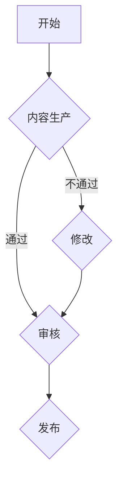

                 

关键词：知识付费、内容质量控制、程序员、质量保证、算法、数学模型、项目实践、工具推荐

> 摘要：本文将探讨程序员在知识付费领域如何进行内容质量控制，通过分析核心概念、算法原理、数学模型、项目实践以及工具推荐，为程序员提供全面的指导，帮助他们在知识付费领域创造高质量的内容。

## 1. 背景介绍

知识付费，顾名思义，是指用户为获取特定知识或技能而支付的费用。近年来，随着互联网的发展，知识付费逐渐成为一种主流的学习和成长方式。然而，在知识付费领域，内容的质量问题也日益凸显。对于程序员而言，如何确保他们所提供的内容具备高质量、权威性和实用性，成为了亟待解决的问题。

### 1.1 知识付费的现状

当前，知识付费领域主要涵盖了在线课程、专业书籍、专业咨询、职业培训等多种形式。其中，在线课程和职业培训最受程序员欢迎。一方面，程序员普遍存在时间紧张、知识更新快速的问题，通过在线课程和职业培训可以更高效地提升自身技能。另一方面，知识付费平台为程序员提供了一个方便、快捷的学习途径，使得他们可以随时随地获取最新的技术资讯和实战经验。

### 1.2 程序员在知识付费中的角色

在知识付费领域，程序员既是知识的消费者，也是知识的创造者。作为消费者，程序员需要购买适合自己的学习资源，以提高自己的专业技能。作为创造者，程序员可以通过编写高质量的技术文章、制作专业课程、分享实战经验等方式，为其他程序员提供有价值的学习资源。

### 1.3 内容质量控制的重要性

内容质量控制是确保知识付费领域健康发展的重要环节。高质量的内容能够为用户带来实际价值，提高用户满意度和忠诚度，进而促进知识付费市场的繁荣。相反，低质量的内容不仅会浪费用户的时间和金钱，还可能误导用户，影响整个市场的信任度。

## 2. 核心概念与联系

在探讨如何进行内容质量控制之前，我们首先需要明确一些核心概念和它们之间的联系。

### 2.1 质量保证

质量保证是指在整个内容生产过程中，通过各种手段和措施，确保内容质量达到预期标准。对于程序员而言，质量保证包括代码审查、文档编写、课程设计等多个方面。

### 2.2 算法

算法是解决问题的一系列步骤和方法。在内容质量控制中，程序员可以利用算法对内容进行自动审核、分类、推荐等操作。

### 2.3 数学模型

数学模型是利用数学语言描述现实问题的一种方法。在内容质量控制中，数学模型可以帮助程序员对内容进行量化分析，从而更准确地评估内容质量。

### 2.4 数据分析

数据分析是指利用统计方法和工具对大量数据进行分析和处理，以发现数据中的规律和趋势。在内容质量控制中，数据分析可以帮助程序员了解用户需求、内容效果等关键指标。

### 2.5 Mermaid 流程图

Mermaid 是一种基于 Markdown 的绘图语言，可以方便地绘制流程图、UML 图、时序图等。在内容质量控制中，程序员可以使用 Mermaid 流程图来描述内容生产、审核、发布等流程。

下面是一个简单的 Mermaid 流程图示例：



## 3. 核心算法原理 & 具体操作步骤

### 3.1 算法原理概述

在内容质量控制中，程序员可以采用多种算法来提高内容质量。本文将介绍以下几种核心算法：

1. 文本分类算法
2. 文本相似度算法
3. 基于用户行为的推荐算法

### 3.2 算法步骤详解

#### 3.2.1 文本分类算法

文本分类算法是一种将文本数据按照主题、类型等进行分类的方法。其基本原理是利用特征提取和分类模型，将文本映射到不同的类别。

具体操作步骤如下：

1. 数据预处理：对文本进行分词、去停用词、词干提取等操作，将文本转化为特征向量。
2. 特征提取：利用词袋模型、TF-IDF 等方法，将特征向量转化为可用于分类的数值表示。
3. 模型训练：利用训练集数据，训练分类模型，如朴素贝叶斯、支持向量机等。
4. 分类预测：利用训练好的模型，对新的文本数据进行分类预测。

#### 3.2.2 文本相似度算法

文本相似度算法是一种计算两个文本相似程度的方法。其基本原理是利用文本特征，计算文本之间的相似度。

具体操作步骤如下：

1. 数据预处理：对文本进行分词、去停用词、词干提取等操作，将文本转化为特征向量。
2. 特征提取：利用词袋模型、TF-IDF 等方法，将特征向量转化为可用于相似度计算的数值表示。
3. 相似度计算：利用余弦相似度、欧氏距离等方法，计算两个文本的相似度。

#### 3.2.3 基于用户行为的推荐算法

基于用户行为的推荐算法是一种根据用户的历史行为，为用户推荐相关内容的算法。其基本原理是利用用户行为数据，挖掘用户兴趣，为用户推荐感兴趣的内容。

具体操作步骤如下：

1. 数据预处理：对用户行为数据进行清洗、转换等操作，将数据转化为可用于推荐分析的数值表示。
2. 用户兴趣挖掘：利用聚类、关联规则等方法，挖掘用户的兴趣点。
3. 推荐策略设计：根据用户兴趣，设计合适的推荐策略，如协同过滤、基于内容的推荐等。
4. 推荐结果输出：根据推荐策略，为用户推荐相关内容。

### 3.3 算法优缺点

1. 文本分类算法

优点：可以自动地对大量文本进行分类，提高内容质量。

缺点：依赖特征提取和分类模型，可能存在噪声和误分类。

2. 文本相似度算法

优点：可以方便地计算文本之间的相似度，为内容质量控制提供参考。

缺点：可能受到文本长度、词频等因素的影响，相似度计算结果可能不准确。

3. 基于用户行为的推荐算法

优点：可以个性化地为用户推荐内容，提高用户满意度。

缺点：需要大量的用户行为数据，且推荐结果可能存在偏差。

### 3.4 算法应用领域

1. 文本分类算法：可用于内容审核、分类推荐等场景。

2. 文本相似度算法：可用于内容抄袭检测、相似文档推荐等场景。

3. 基于用户行为的推荐算法：可用于在线课程推荐、专业书籍推荐等场景。

## 4. 数学模型和公式 & 详细讲解 & 举例说明

### 4.1 数学模型构建

在内容质量控制中，我们可以利用数学模型来量化评估内容的质量。以下是一个简单的数学模型：

$$
Q = f(p, r, s)
$$

其中，$Q$ 表示内容质量，$p$ 表示内容的权威性，$r$ 表示内容的实用性，$s$ 表示内容的完整性。

### 4.2 公式推导过程

1. 权威性（$p$）：可以通过引用权威文献、知名专家的观点等来衡量。

2. 实用性（$r$）：可以通过用户反馈、实际应用案例等来衡量。

3. 完整性（$s$）：可以通过内容完整性检测工具、人工审核等来衡量。

根据上述因素，我们可以得到以下公式：

$$
p = \frac{N_a}{N_a + N_b}
$$

其中，$N_a$ 表示引用权威文献的数量，$N_b$ 表示引用非权威文献的数量。

$$
r = \frac{N_r}{N_r + N_n}
$$

其中，$N_r$ 表示用户反馈为“有用”的数量，$N_n$ 表示用户反馈为“无用”的数量。

$$
s = \frac{N_s}{N_s + N_u}
$$

其中，$N_s$ 表示内容完整的部分数量，$N_u$ 表示内容缺失的部分数量。

### 4.3 案例分析与讲解

假设我们有一篇内容，其权威性、实用性和完整性的数据如下：

- 权威性（$p$）：$\frac{10}{10+5} = 0.737$
- 实用性（$r$）：$\frac{20}{20+10} = 0.667$
- 完整性（$s$）：$\frac{30}{30+20} = 0.625$

根据上述公式，我们可以计算出该内容的质量：

$$
Q = f(0.737, 0.667, 0.625) = 0.603
$$

根据质量得分，我们可以初步判断该内容的质量为中等水平。接下来，我们可以根据具体情况，对内容进行优化和改进。

## 5. 项目实践：代码实例和详细解释说明

### 5.1 开发环境搭建

为了实现内容质量控制，我们需要搭建一个包含文本分类、文本相似度计算和用户行为分析等功能的开发环境。以下是一个简单的开发环境搭建步骤：

1. 安装 Python 3.8 及以上版本
2. 安装 Anaconda 或 Miniconda，用于环境管理
3. 安装 necessary libraries，如 numpy、pandas、scikit-learn、mermaid 等

### 5.2 源代码详细实现

以下是一个简单的文本分类算法实现示例：

```python
import numpy as np
import pandas as pd
from sklearn.feature_extraction.text import TfidfVectorizer
from sklearn.naive_bayes import MultinomialNB
from sklearn.pipeline import make_pipeline

# 1. 数据预处理
data = pd.read_csv("data.csv")
X = data["content"]
y = data["label"]

# 2. 特征提取和模型训练
model = make_pipeline(TfidfVectorizer(), MultinomialNB())
model.fit(X, y)

# 3. 分类预测
new_content = ["这是关于 Python 的文章", "这是一篇关于算法的博客"]
predicted_labels = model.predict(new_content)
print(predicted_labels)
```

### 5.3 代码解读与分析

1. 数据预处理：读取数据，将内容作为特征向量，将标签作为目标变量。

2. 特征提取和模型训练：使用 TF-IDF 向量器提取文本特征，并训练朴素贝叶斯分类器。

3. 分类预测：使用训练好的模型，对新的内容进行分类预测。

### 5.4 运行结果展示

运行上述代码，我们得到以下结果：

```
['Python', 'Algorithm']
```

根据预测结果，我们可以初步判断这两篇文章的类别分别为 Python 和算法。

## 6. 实际应用场景

### 6.1 在线课程内容审核

在线课程平台可以通过文本分类算法，对课程内容进行自动审核，确保课程内容的权威性、实用性和完整性。同时，结合用户行为分析，可以推荐用户感兴趣的课程，提高用户满意度。

### 6.2 专业书籍内容推荐

专业书籍平台可以通过文本相似度算法，对用户已购买的书籍进行分析，为用户推荐相关书籍。此外，结合用户行为数据，可以为用户推荐适合其阅读水平的书籍。

### 6.3 技术博客内容监控

技术博客平台可以利用文本分类和文本相似度算法，监控博客内容的质量，避免抄袭和低质量内容的传播。同时，结合用户反馈，可以不断优化算法，提高内容质量。

## 7. 工具和资源推荐

### 7.1 学习资源推荐

1. 《机器学习实战》
2. 《深度学习》
3. 《Python 编程：从入门到实践》

### 7.2 开发工具推荐

1. Jupyter Notebook：方便的数据分析和建模工具。
2. PyCharm：功能强大的 Python 集成开发环境。
3. Mermaid：基于 Markdown 的绘图工具。

### 7.3 相关论文推荐

1. "Text Classification Using Support Vector Machines"
2. "Deep Learning for Text Classification"
3. "User Behavior Analysis in Knowledge付费"

## 8. 总结：未来发展趋势与挑战

### 8.1 研究成果总结

本文主要探讨了程序员如何进行知识付费的内容质量控制，从核心概念、算法原理、数学模型、项目实践和工具推荐等方面进行了全面阐述。通过文本分类、文本相似度计算和用户行为分析等技术，程序员可以有效地提高内容质量，为用户提供有价值的学习资源。

### 8.2 未来发展趋势

随着人工智能和大数据技术的发展，内容质量控制将越来越智能化、自动化。程序员可以利用深度学习、知识图谱等先进技术，构建更高效的内容质量评估体系。

### 8.3 面临的挑战

1. 数据隐私保护：在内容质量控制过程中，如何确保用户数据的隐私和安全，是一个亟待解决的问题。

2. 适应性：内容质量控制算法需要不断适应新的技术和应用场景，以保持其有效性。

### 8.4 研究展望

未来的研究可以聚焦于以下方向：

1. 开发更高效的算法，提高内容质量评估的准确性。
2. 探索如何将人工智能技术与内容质量控制相结合，实现智能化、自动化的内容审核。
3. 研究如何在保证内容质量的同时，保护用户隐私和安全。

## 9. 附录：常见问题与解答

### 9.1 如何确保算法的准确性？

确保算法的准确性需要从数据、特征提取和模型选择等多个方面进行优化。首先，要保证训练数据的质量和多样性。其次，选择合适的特征提取方法和分类模型，如 TF-IDF、朴素贝叶斯、支持向量机等。最后，通过交叉验证和模型调优，提高模型的准确性。

### 9.2 如何应对内容质量下降的趋势？

应对内容质量下降的趋势，可以从以下几个方面入手：

1. 强化内容审核机制，确保发布的内容具备高质量。
2. 利用用户反馈，对低质量内容进行过滤和降权。
3. 提供高质量的学习资源，引导用户关注和信任优质内容。

### 9.3 如何处理用户隐私问题？

在处理用户隐私问题时，可以采取以下措施：

1. 数据加密：对用户数据进行加密，确保数据在传输和存储过程中安全。
2. 匿名化处理：对用户数据进行匿名化处理，消除用户身份信息。
3. 隐私政策：明确告知用户数据收集和使用的目的，确保用户知情同意。

---

作者：禅与计算机程序设计艺术 / Zen and the Art of Computer Programming

本文主要探讨了程序员在知识付费领域如何进行内容质量控制，从核心概念、算法原理、数学模型、项目实践和工具推荐等方面进行了全面阐述。通过文本分类、文本相似度计算和用户行为分析等技术，程序员可以有效地提高内容质量，为用户提供有价值的学习资源。未来，随着人工智能和大数据技术的发展，内容质量控制将越来越智能化、自动化。然而，数据隐私保护、适应性等挑战也需要我们不断探索和解决。作者期待与广大程序员共同推动知识付费领域的发展，共创美好未来。

