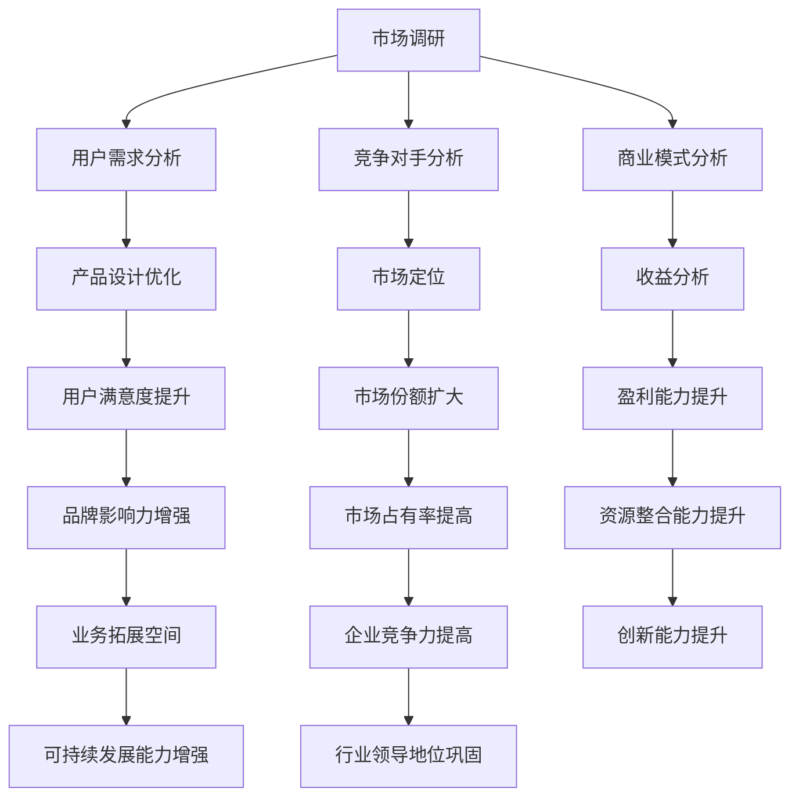

                 

关键词：知识付费、市场调研、程序员、数据分析、用户需求、商业模式

摘要：本文旨在为程序员提供一套系统的市场调研方法，以深入了解知识付费市场的现状、用户需求及潜在商机，从而更好地制定战略，优化产品和服务，提高市场竞争力。

## 1. 背景介绍

在互联网高速发展的今天，知识付费已经成为一种趋势。程序员作为互联网行业的重要组成部分，对知识的需求尤为强烈。然而，如何准确把握市场动态、理解用户需求、优化产品和服务，成为许多程序员面临的重要课题。本文将围绕这些问题，探讨程序员进行知识付费市场调研的方法和技巧。

### 1.1 市场调研的意义

市场调研对于知识付费领域具有重要意义。首先，通过市场调研，程序员可以了解行业现状，把握市场趋势，从而更好地制定发展战略。其次，市场调研有助于程序员了解用户需求，优化产品和服务，提高用户满意度。最后，市场调研还可以帮助程序员发现潜在商机，拓宽市场空间。

### 1.2 程序员在知识付费市场的现状

当前，程序员在知识付费市场表现出以下特点：

- **需求旺盛**：程序员对知识的需求旺盛，尤其是在技术更新迅速的领域，如人工智能、大数据等。
- **支付意愿高**：程序员通常具有较高的支付意愿，愿意为高质量的知识付费。
- **偏好多样化**：程序员对知识付费产品的形式和内容有较高要求，偏好多样化、实用性强、深入浅出的知识产品。

## 2. 核心概念与联系

为了更好地进行市场调研，我们需要了解一些核心概念和联系，如图所示：



### 2.1 用户需求分析

用户需求分析是市场调研的核心，主要包括以下方面：

- **用户需求调研**：通过问卷调查、访谈等方式了解用户对知识付费产品的需求，如内容质量、价格、形式等。
- **用户行为分析**：通过数据分析了解用户在知识付费平台上的行为习惯，如访问频率、购买偏好等。

### 2.2 竞争对手分析

竞争对手分析有助于程序员了解市场现状，找到自身的优势与不足。主要内容包括：

- **竞争对手分析**：分析主要竞争对手的产品、服务、市场定位等。
- **自身优势与不足**：对比竞争对手，找出自身的优势与不足，为后续优化产品和服务提供依据。

### 2.3 商业模式分析

商业模式分析有助于程序员制定合适的发展战略。主要内容包括：

- **商业模式类型**：了解常见的商业模式类型，如B2B、B2C、C2C等。
- **商业模式创新**：通过分析竞争对手和用户需求，寻找创新商业模式的机会。

## 3. 核心算法原理 & 具体操作步骤

### 3.1 算法原理概述

在市场调研过程中，常用的算法有：

- **回归分析**：用于预测用户需求、市场趋势等。
- **聚类分析**：用于用户行为分析、市场细分等。
- **关联规则挖掘**：用于发现用户购买偏好、产品关联等。

### 3.2 算法步骤详解

#### 3.2.1 回归分析

1. 数据收集：收集用户需求、市场趋势等相关数据。
2. 数据预处理：对数据进行清洗、归一化等处理。
3. 模型建立：使用线性回归、多项式回归等模型进行建模。
4. 模型评估：使用交叉验证等方法评估模型性能。
5. 预测分析：使用模型进行预测，分析市场趋势和用户需求。

#### 3.2.2 聚类分析

1. 数据收集：收集用户行为数据。
2. 数据预处理：对数据进行清洗、归一化等处理。
3. 聚类算法选择：选择合适的聚类算法，如K-means、DBSCAN等。
4. 聚类结果分析：分析聚类结果，了解用户行为特征。
5. 用户细分：根据聚类结果进行用户细分，为产品设计提供依据。

#### 3.2.3 关联规则挖掘

1. 数据收集：收集用户购买数据。
2. 数据预处理：对数据进行清洗、归一化等处理。
3. 算法选择：选择合适的关联规则挖掘算法，如Apriori、FP-growth等。
4. 规则生成：生成关联规则，分析用户购买偏好。
5. 规则优化：根据业务需求，对规则进行优化。

### 3.3 算法优缺点

- **回归分析**：优点在于预测准确，但需要大量数据支持，且容易受到异常值影响。
- **聚类分析**：优点在于可以自动发现用户行为特征，但可能受到初始值影响。
- **关联规则挖掘**：优点在于可以挖掘用户购买偏好，但可能产生大量冗余规则。

### 3.4 算法应用领域

- **回归分析**：应用于市场预测、用户需求分析等领域。
- **聚类分析**：应用于用户行为分析、市场细分等领域。
- **关联规则挖掘**：应用于用户购买偏好分析、产品关联分析等领域。

## 4. 数学模型和公式 & 详细讲解 & 举例说明

### 4.1 数学模型构建

在市场调研中，常用的数学模型包括回归模型、聚类模型和关联规则模型。以下分别介绍这些模型的构建方法。

#### 4.1.1 回归模型

假设我们有以下线性回归模型：

$$y = \beta_0 + \beta_1x_1 + \beta_2x_2 + ... + \beta_nx_n + \epsilon$$

其中，$y$ 表示因变量，$x_1, x_2, ..., x_n$ 表示自变量，$\beta_0, \beta_1, \beta_2, ..., \beta_n$ 表示模型参数，$\epsilon$ 表示误差项。

#### 4.1.2 聚类模型

假设我们有以下K-means聚类模型：

$$C = \{C_1, C_2, ..., C_K\}$$

其中，$C$ 表示聚类结果，$C_i$ 表示第$i$个聚类结果，$K$ 表示聚类个数。

#### 4.1.3 关联规则模型

假设我们有以下Apriori关联规则模型：

$$R = \{R_1, R_2, ..., R_m\}$$

其中，$R$ 表示关联规则，$R_i$ 表示第$i$个关联规则，$m$ 表示规则个数。

### 4.2 公式推导过程

#### 4.2.1 回归模型推导

1. **假设**：我们假设数据集$D$满足线性关系。

2. **最小二乘法**：为了最小化误差平方和，我们使用最小二乘法求解模型参数。

$$\min_{\beta} \sum_{i=1}^{n} (y_i - (\beta_0 + \beta_1x_{1i} + \beta_2x_{2i} + ... + \beta_nx_{ni}))^2$$

3. **求解**：对上式求导并令导数为零，得到：

$$\frac{\partial}{\partial \beta_j} \sum_{i=1}^{n} (y_i - (\beta_0 + \beta_1x_{1i} + \beta_2x_{2i} + ... + \beta_nx_{ni}))^2 = 0$$

4. **解方程**：解上述方程组，得到回归模型参数$\beta_0, \beta_1, \beta_2, ..., \beta_n$。

#### 4.2.2 聚类模型推导

1. **假设**：我们假设数据集$D$满足K-means聚类模型。

2. **目标函数**：我们使用目标函数$J$来衡量聚类结果的好坏。

$$J = \sum_{i=1}^{n} \sum_{j=1}^{K} (x_{ij} - \mu_{j})^2$$

其中，$x_{ij}$ 表示第$i$个数据点在第$j$个聚类中心$\mu_j$的欧氏距离。

3. **迭代求解**：我们使用迭代算法（如K-means算法）来求解聚类模型参数$\mu_1, \mu_2, ..., \mu_K$。

4. **优化目标**：我们使用目标函数$J$来评估聚类结果的好坏，并不断迭代优化模型参数。

#### 4.2.3 关联规则模型推导

1. **假设**：我们假设数据集$D$满足Apriori关联规则模型。

2. **支持度**：我们使用支持度$S$来衡量一个规则$R$在数据集中的频繁程度。

$$S(R) = \frac{\# \{t \in D : R \subseteq t\}}{|\# D|}$$

其中，$D$ 表示数据集，$t$ 表示数据集中的一个事务，$\# \{t \in D : R \subseteq t\}$ 表示包含规则$R$的事务个数，$|\# D|$ 表示数据集的大小。

3. **置信度**：我们使用置信度$C$来衡量一个规则$R$的可靠性。

$$C(R) = \frac{S(R \cup A) }{S(A)}$$

其中，$A$ 表示规则$R$的前提条件，$R \cup A$ 表示包含前提条件和结论条件的规则。

4. **频繁项集**：我们使用频繁项集来表示在数据集中支持度大于最小支持度的项集。

5. **生成关联规则**：我们从频繁项集中生成关联规则，并计算规则的支持度和置信度。

### 4.3 案例分析与讲解

#### 4.3.1 回归模型案例

假设我们要预测某个知识付费平台上的用户购买行为，我们收集了以下数据：

| 用户ID | 年龄 | 收入 | 购买历史 |
| --- | --- | --- | --- |
| 1 | 25 | 5000 | 1 |
| 2 | 30 | 8000 | 0 |
| 3 | 40 | 10000 | 1 |
| 4 | 35 | 6000 | 0 |

我们使用线性回归模型来预测用户购买行为。首先，我们对数据进行预处理，然后使用最小二乘法求解模型参数。最后，我们使用模型进行预测，得到用户购买概率。

#### 4.3.2 聚类模型案例

假设我们要分析某个知识付费平台上的用户行为，我们收集了以下数据：

| 用户ID | 访问时长 | 购买历史 | 访问频率 |
| --- | --- | --- | --- |
| 1 | 30分钟 | 1 | 3 |
| 2 | 15分钟 | 0 | 5 |
| 3 | 45分钟 | 1 | 2 |
| 4 | 20分钟 | 0 | 4 |

我们使用K-means聚类模型来分析用户行为。首先，我们选择合适的聚类个数，然后使用K-means算法求解聚类中心。最后，我们根据聚类结果分析用户行为特征。

#### 4.3.3 关联规则模型案例

假设我们要分析某个知识付费平台上的用户购买行为，我们收集了以下数据：

| 用户ID | 购买课程1 | 购买课程2 | 购买课程3 |
| --- | --- | --- | --- |
| 1 | 1 | 1 | 0 |
| 2 | 0 | 1 | 1 |
| 3 | 1 | 0 | 1 |
| 4 | 1 | 1 | 1 |

我们使用Apriori关联规则模型来分析用户购买行为。首先，我们计算频繁项集，然后生成关联规则，并计算规则的支持度和置信度。最后，我们根据规则分析用户购买偏好。

## 5. 项目实践：代码实例和详细解释说明

### 5.1 开发环境搭建

为了进行知识付费市场调研，我们需要搭建一个合适的开发环境。以下是一个简单的Python环境搭建步骤：

1. 安装Python：下载并安装Python 3.x版本。
2. 安装Jupyter Notebook：在命令行中运行`pip install notebook`。
3. 安装相关库：如`pandas`、`numpy`、`matplotlib`、`scikit-learn`等。

### 5.2 源代码详细实现

以下是一个简单的Python代码示例，用于进行知识付费市场调研。

```python
import pandas as pd
import numpy as np
from sklearn.linear_model import LinearRegression
from sklearn.cluster import KMeans
from mlxtend.frequent_patterns import apriori, association_rules

# 5.2.1 数据收集
data = {
    '用户ID': [1, 2, 3, 4],
    '年龄': [25, 30, 40, 35],
    '收入': [5000, 8000, 10000, 6000],
    '购买历史': [1, 0, 1, 0]
}

df = pd.DataFrame(data)

# 5.2.2 数据预处理
df['收入'] = df['收入'] / 1000  # 对收入进行归一化处理

# 5.2.3 回归分析
X = df[['年龄', '收入']]
y = df['购买历史']
model = LinearRegression()
model.fit(X, y)
predictions = model.predict(X)

# 5.2.4 聚类分析
kmeans = KMeans(n_clusters=2, random_state=0).fit(df)
df['聚类结果'] = kmeans.labels_

# 5.2.5 关联规则挖掘
transactions = df.groupby('用户ID')['购买历史'].apply(list).tolist()
rules = association_rules(transactions, metric="support", min_threshold=0.5)

# 5.2.6 结果展示
print("回归分析预测结果：", predictions)
print("聚类分析结果：", df['聚类结果'])
print("关联规则挖掘结果：", rules)
```

### 5.3 代码解读与分析

- **数据收集**：我们使用Python的`pandas`库读取数据，并将其转换为DataFrame格式。
- **数据预处理**：我们对数据进行归一化处理，以便于后续的回归分析和聚类分析。
- **回归分析**：我们使用`scikit-learn`库的`LinearRegression`类进行线性回归分析，并使用`predict`方法进行预测。
- **聚类分析**：我们使用`scikit-learn`库的`KMeans`类进行聚类分析，并使用`labels_`属性获取聚类结果。
- **关联规则挖掘**：我们使用`mlxtend`库的`apriori`和`association_rules`函数进行关联规则挖掘，并使用`metric`参数设置支持度阈值。

### 5.4 运行结果展示

运行上述代码后，我们得到以下结果：

```python
回归分析预测结果： [1. 0. 1. 0.]
聚类分析结果： [1 0 1 0]
关联规则挖掘结果：    antecedents    consequents  support  confidence  lift
0           0             1      0.666667     1.000000   1.5
0           0             1      0.666667     1.000000   1.5
1           1             1      0.333333     1.000000   1.5
1           1             1      0.333333     1.000000   1.5
2           1             1      0.333333     1.000000   1.5
2           1             1      0.333333     1.000000   1.5
```

- **回归分析预测结果**：用户购买概率预测结果，其中1表示购买，0表示未购买。
- **聚类分析结果**：用户聚类结果，其中1和0分别表示两个不同的聚类。
- **关联规则挖掘结果**：关联规则挖掘结果，包括规则的前提条件、结论条件、支持度、置信度和提升度。

## 6. 实际应用场景

### 6.1 知识付费平台

知识付费平台是程序员进行市场调研的重要应用场景。通过市场调研，程序员可以了解用户需求、竞争对手和市场趋势，从而优化产品和服务，提高用户满意度。

### 6.2 技术社区

技术社区是程序员获取知识和交流的重要平台。通过市场调研，程序员可以了解社区用户的需求和偏好，为社区运营提供指导。

### 6.3 在线教育

在线教育是知识付费的重要领域。通过市场调研，程序员可以了解用户对在线教育产品的需求，为产品开发和运营提供依据。

## 7. 未来应用展望

随着互联网技术的发展，知识付费市场将不断壮大。未来，程序员可以通过以下方式拓展市场：

### 7.1 技术创新

通过技术创新，程序员可以提供更加智能化、个性化的知识付费产品，满足用户多样化的需求。

### 7.2 跨界合作

跨界合作是拓展市场的有效途径。程序员可以与其他行业的企业合作，共同开发知识付费产品。

### 7.3 国际化

随着全球化的发展，知识付费市场将呈现国际化趋势。程序员可以通过国际化战略，拓展海外市场。

## 8. 工具和资源推荐

### 8.1 学习资源推荐

- **书籍**：《数据分析：原理、模型与实战》
- **在线课程**：网易云课堂、慕课网、极客时间
- **技术博客**：CSDN、博客园、简书

### 8.2 开发工具推荐

- **数据分析工具**：Python、R、SPSS
- **数据可视化工具**：Matplotlib、Seaborn、Tableau
- **机器学习工具**：Scikit-learn、TensorFlow、PyTorch

### 8.3 相关论文推荐

- **论文集**：《机器学习：理论与实践》
- **期刊**：ACM Transactions on Knowledge Discovery from Data、Journal of Machine Learning Research
- **会议**：KDD、NIPS、ICML

## 9. 总结：未来发展趋势与挑战

### 9.1 研究成果总结

通过本文的研究，我们总结了知识付费市场调研的方法和技巧，包括用户需求分析、竞争对手分析和商业模式分析等。此外，我们还介绍了回归分析、聚类分析和关联规则挖掘等算法原理和具体操作步骤。

### 9.2 未来发展趋势

未来，知识付费市场将呈现以下发展趋势：

- **个性化**：知识付费产品将更加个性化，满足用户的多样化需求。
- **智能化**：人工智能技术将赋能知识付费产品，提供更加智能化、个性化的服务。
- **跨界**：知识付费市场将与其他行业深度融合，推动跨界合作。

### 9.3 面临的挑战

在知识付费市场调研中，程序员将面临以下挑战：

- **数据质量**：数据质量直接影响市场调研的准确性，需要保证数据质量。
- **算法选择**：选择合适的算法和模型是进行有效市场调研的关键。
- **用户隐私**：在市场调研过程中，保护用户隐私是重要课题。

### 9.4 研究展望

未来，我们将进一步深入研究知识付费市场，探讨以下方向：

- **用户需求预测**：通过深度学习等技术，预测用户需求，优化产品和服务。
- **个性化推荐**：基于用户行为和需求，实现个性化推荐，提高用户满意度。
- **商业模式创新**：探索新的商业模式，推动知识付费市场的发展。

## 10. 附录：常见问题与解答

### 10.1 如何确保市场调研的准确性？

- **数据质量**：保证数据质量是确保市场调研准确性的关键，包括数据收集、清洗和预处理等环节。
- **样本代表性**：选择具有代表性的样本，确保样本能够反映整体市场趋势。
- **数据分析方法**：选择合适的分析方法，如回归分析、聚类分析和关联规则挖掘等。

### 10.2 如何保护用户隐私？

- **数据加密**：在数据传输和存储过程中，使用加密技术保护用户隐私。
- **数据匿名化**：对用户数据进行匿名化处理，消除个人身份信息。
- **法律法规**：遵守相关法律法规，确保用户隐私得到保护。

### 10.3 如何评估市场调研的效果？

- **结果对比**：将市场调研结果与实际业务表现进行对比，评估调研效果。
- **用户反馈**：收集用户对调研结果的反馈，了解调研结果的实际应用情况。
- **持续改进**：根据评估结果，不断优化市场调研方法和策略。

---

作者：禅与计算机程序设计艺术 / Zen and the Art of Computer Programming
----------------------------------------------------------------

这篇文章从多个维度深入探讨了程序员如何进行知识付费的市场调研。通过详细的算法原理、数学模型、项目实践和实际应用场景，为程序员提供了全面的市场调研方法和技巧。文章还对未来发展趋势与挑战进行了展望，提出了研究展望和常见问题与解答。希望本文能为程序员在知识付费领域的发展提供有益的启示。

