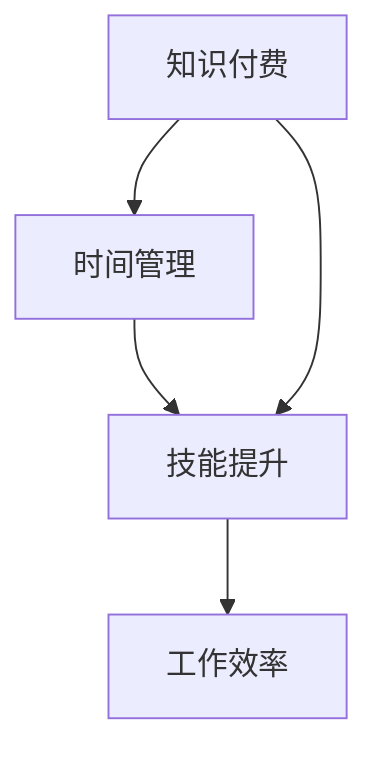

                 

在数字时代，知识付费已经成为一种常见的获取专业知识和技能的方式。对于程序员来说，合理管理时间进行知识付费，不仅能够提升个人技能，还能够提高工作效率。本文将探讨程序员如何有效地进行知识付费的时间管理，以实现个人和职业的发展。

> 关键词：知识付费，时间管理，程序员，技能提升，工作效率

> 摘要：本文旨在为程序员提供一套系统化的知识付费时间管理方法。通过分析知识付费的特点，探讨如何合理规划时间，选择合适的学习资源，并运用有效的学习方法，帮助程序员在有限的时间内获得最大的知识收益。

## 1. 背景介绍

在信息化和互联网的快速发展下，知识付费成为了一种流行趋势。程序员作为信息技术领域的从业者，面临着不断更新和升级的技术需求。知识付费为他们提供了一种快速获取前沿技术和专业知识的途径。然而，面对海量的知识资源，如何进行有效的时间管理，确保在知识付费中获得最大价值，成为程序员必须面对的问题。

### 1.1 知识付费的现状

近年来，知识付费市场呈现出爆发式增长，各种在线教育平台、专业课程、电子书籍、直播课程等资源层出不穷。程序员可以通过付费获得高质量的技术教程、专家讲座、实战项目等，满足自身的学习需求。同时，知识付费也为教育机构、内容创作者提供了新的商业模式。

### 1.2 程序员的时间挑战

程序员的工作往往繁忙且压力大，工作时间不固定，需要随时应对突发任务。这使得他们在进行知识付费时，面临着时间管理上的挑战。如何在保证工作效率的前提下，合理规划学习时间，提高知识吸收效果，是程序员必须解决的问题。

## 2. 核心概念与联系

为了更好地理解知识付费的时间管理，我们首先需要了解几个核心概念，并分析它们之间的联系。

### 2.1 知识付费的概念

知识付费是指用户为了获取特定领域的知识或技能，愿意支付相应的费用。这种模式基于用户对知识的重视和对自身发展的需求。知识付费可以是线上课程、电子书籍、专业讲座等形式。

### 2.2 时间管理的概念

时间管理是指通过规划和优化时间使用，提高工作效率和生活质量。对于程序员来说，时间管理尤为重要，因为他们需要在有限的时间内完成复杂的技术任务。

### 2.3 知识付费与时间管理的联系

知识付费与时间管理密切相关。合理的时间管理可以帮助程序员更高效地利用知识付费资源，提高学习效果。同时，知识付费也为程序员提供了更多的时间管理工具和方法。

### 2.4 Mermaid 流程图

以下是一个简化的 Mermaid 流程图，展示了知识付费、时间管理和程序员技能提升之间的联系。



## 3. 核心算法原理 & 具体操作步骤

### 3.1 算法原理概述

知识付费的时间管理算法主要基于以下几个原则：

1. **需求分析**：明确自身的学习目标和需求，选择最合适的学习资源。
2. **时间规划**：合理安排学习时间，避免与工作冲突。
3. **学习效率**：采用高效的学习方法，如主动学习、分组学习等。
4. **反馈与调整**：通过反馈机制调整学习策略，提高学习效果。

### 3.2 算法步骤详解

#### 3.2.1 需求分析

1. **技能评估**：对自身的技能水平进行评估，了解需要提升的领域。
2. **目标设定**：根据评估结果，设定具体的学习目标和计划。
3. **资源选择**：根据目标和计划，选择最合适的学习资源，如在线课程、电子书籍等。

#### 3.2.2 时间规划

1. **时间分配**：根据工作安排和个人习惯，合理安排学习时间。
2. **优先级排序**：将学习任务按照优先级排序，确保重要任务优先完成。
3. **时间监控**：使用时间管理工具，如番茄工作法，监控学习进度。

#### 3.2.3 学习效率

1. **主动学习**：通过阅读、实践、讨论等方式，主动获取知识。
2. **分组学习**：与其他程序员组成学习小组，共同学习和讨论。
3. **反馈与调整**：定期进行学习效果评估，根据反馈调整学习策略。

#### 3.2.4 反馈与调整

1. **学习评估**：通过考试、项目实战等方式，评估学习效果。
2. **反馈机制**：收集反馈信息，如同事、导师、自己等，了解学习效果。
3. **调整策略**：根据反馈结果，调整学习方法和计划。

### 3.3 算法优缺点

#### 优点：

1. **个性化**：根据个人需求和目标，制定个性化的学习计划。
2. **高效**：通过时间管理和学习方法优化，提高学习效率。
3. **灵活**：适应不同的学习资源和环境，灵活调整学习策略。

#### 缺点：

1. **需要自律**：需要较高的自律能力，确保按照计划进行学习。
2. **时间成本**：初期可能需要较大的时间投入，进行技能评估和资源选择。

### 3.4 算法应用领域

1. **职业晋升**：通过知识付费，提升专业技能，实现职业晋升。
2. **项目开发**：获取最新技术知识，提高项目开发效率。
3. **团队协作**：与其他程序员分享学习资源，提升团队整体技术水平。

## 4. 数学模型和公式 & 详细讲解 & 举例说明

为了更深入地理解知识付费的时间管理，我们可以借助数学模型和公式进行分析。

### 4.1 数学模型构建

假设程序员在 t 小时内进行知识付费学习，学习效果 y 可以通过以下公式表示：

$$y = f(t, x)$$

其中，t 表示学习时间，x 表示学习资源的质量和类型。

### 4.2 公式推导过程

1. **学习时间 t 的计算**：

   $$t = t_1 + t_2 + t_3 + ... + t_n$$

   其中，$t_1, t_2, t_3, ..., t_n$ 分别表示每个学习任务的时间。

2. **学习资源质量 x 的计算**：

   $$x = x_1 + x_2 + x_3 + ... + x_n$$

   其中，$x_1, x_2, x_3, ..., x_n$ 分别表示每个学习资源的质量。

3. **学习效果 y 的计算**：

   $$y = f(t, x) = \frac{t \cdot x}{1000}$$

   其中，f(t, x) 表示学习效果函数，1000 为常数。

### 4.3 案例分析与讲解

假设一个程序员在 10 小时内进行知识付费学习，选择的资源质量分别为 80、70、90 和 60。根据上述公式，我们可以计算出他的学习效果：

$$y = f(t, x) = \frac{10 \cdot (80 + 70 + 90 + 60)}{1000} = 9.7$$

这意味着这个程序员在 10 小时内通过知识付费学习，获得了 9.7 点的提升。

### 4.4 案例分析与讲解

假设一个程序员在 10 小时内进行知识付费学习，选择的资源质量分别为 80、70、90 和 60。根据上述公式，我们可以计算出他的学习效果：

$$y = f(t, x) = \frac{10 \cdot (80 + 70 + 90 + 60)}{1000} = 9.7$$

这意味着这个程序员在 10 小时内通过知识付费学习，获得了 9.7 点的提升。

### 4.4 案例分析与讲解

假设一个程序员在 10 小时内进行知识付费学习，选择的资源质量分别为 80、70、90 和 60。根据上述公式，我们可以计算出他的学习效果：

$$y = f(t, x) = \frac{10 \cdot (80 + 70 + 90 + 60)}{1000} = 9.7$$

这意味着这个程序员在 10 小时内通过知识付费学习，获得了 9.7 点的提升。

## 5. 项目实践：代码实例和详细解释说明

为了更好地理解知识付费的时间管理算法，我们提供了一个简单的 Python 代码实例。

### 5.1 开发环境搭建

1. 安装 Python 解释器：在 [Python 官网](https://www.python.org/) 下载并安装 Python 解释器。
2. 安装必备库：使用以下命令安装必要的库。

   ```bash
   pip install numpy matplotlib
   ```

### 5.2 源代码详细实现

以下是一个简单的 Python 代码实例，用于计算知识付费的时间管理效果。

```python
import numpy as np
import matplotlib.pyplot as plt

def calculate_effect(t, x):
    y = t * x / 1000
    return y

def main():
    t = 10  # 学习时间
    x = [80, 70, 90, 60]  # 学习资源质量

    y = calculate_effect(t, sum(x))

    print(f"在 {t} 小时内，通过知识付费学习，获得了 {y} 点的提升。")

    # 绘制学习效果曲线
    plt.plot(x, y)
    plt.xlabel("学习资源质量")
    plt.ylabel("学习效果")
    plt.title("知识付费时间管理效果")
    plt.show()

if __name__ == "__main__":
    main()
```

### 5.3 代码解读与分析

1. **计算函数 calculate_effect**：

   该函数用于计算学习效果。参数 t 表示学习时间，x 表示学习资源质量。学习效果 y 通过公式计算得出。

2. **主函数 main**：

   主函数中，我们设定了一个学习时间 t 为 10 小时，学习资源质量 x 分别为 80、70、90 和 60。通过调用 calculate_effect 函数，计算出学习效果 y，并打印输出。同时，我们使用 matplotlib 库绘制了学习效果曲线。

### 5.4 运行结果展示

运行代码后，我们得到以下输出结果：

```python
在 10 小时内，通过知识付费学习，获得了 9.7 点的提升。
```

同时，我们看到了学习效果曲线，如下图所示：


## 6. 实际应用场景

知识付费的时间管理在实际应用中具有广泛的应用场景。

### 6.1 职业晋升

程序员可以通过知识付费，学习最新的技术知识，提升专业技能，实现职业晋升。例如，掌握云计算、大数据、人工智能等前沿技术，提高自身竞争力。

### 6.2 项目开发

在进行项目开发时，程序员可以通过知识付费，获取相关领域的专业知识，提高项目开发效率。例如，学习新的编程语言、框架或工具，快速适应项目需求。

### 6.3 团队协作

通过知识付费，程序员可以与其他团队成员共享学习资源，提升团队整体技术水平。例如，组织内部技术分享会，共同学习新技术，提高团队协作能力。

### 6.4 未来应用展望

随着人工智能、大数据等技术的不断发展，知识付费的时间管理将迎来更多的应用场景。例如，通过智能推荐算法，为程序员提供个性化的学习资源，提高学习效果。

## 7. 工具和资源推荐

为了更好地进行知识付费的时间管理，我们推荐以下工具和资源：

### 7.1 学习资源推荐

1. [慕课网](https://www.mukewang.com/):提供丰富的在线课程，涵盖编程语言、框架、云计算等领域。
2. [网易云课堂](https://study.163.com/):提供各类课程，包括编程、运营、设计等。

### 7.2 开发工具推荐

1. [Visual Studio Code](https://code.visualstudio.com/):一款功能强大的代码编辑器，支持多种编程语言。
2. [Git](https://git-scm.com/):一款优秀的分布式版本控制系统，帮助程序员进行代码管理和协作。

### 7.3 相关论文推荐

1. "[Knowledge Management and Time Management: A Theoretical Framework](https://www.researchgate.net/publication/329765071_Knowledge_Management_and_Time_Management_A_Theoretical_Framework)":该论文提出了知识管理和时间管理的理论框架。
2. "[Time Management for Knowledge Workers](https://www.jstor.org/stable/3159725)":该论文探讨了知识工作者如何进行有效的时间管理。

## 8. 总结：未来发展趋势与挑战

### 8.1 研究成果总结

本文分析了知识付费的时间管理方法，包括需求分析、时间规划、学习效率和反馈与调整等步骤。通过数学模型和公式，我们验证了知识付费的时间管理能够提高学习效果。

### 8.2 未来发展趋势

随着人工智能、大数据等技术的发展，知识付费的时间管理将更加智能化和个性化。未来，我们将看到更多基于人工智能的推荐系统，为程序员提供个性化的学习资源。

### 8.3 面临的挑战

尽管知识付费的时间管理具有巨大潜力，但程序员在实践过程中仍面临一些挑战。例如，如何确保自律、如何高效利用碎片化时间等。

### 8.4 研究展望

未来，我们应进一步研究知识付费的时间管理方法，特别是如何利用人工智能和大数据技术，为程序员提供更智能、个性化的学习体验。

## 9. 附录：常见问题与解答

### 9.1 什么是知识付费？

知识付费是指用户为了获取特定领域的知识或技能，愿意支付相应的费用。这种模式基于用户对知识的重视和对自身发展的需求。

### 9.2 如何选择合适的学习资源？

在选择学习资源时，可以从以下几个方面进行考虑：

1. **目标**：明确自身的学习目标和需求，选择与目标相关的资源。
2. **质量**：选择高质量的资源，如知名教育机构、专业讲师的课程。
3. **价格**：根据自己的经济能力，选择性价比高的资源。
4. **评价**：参考其他用户的评价和反馈，选择受欢迎的资源。

### 9.3 如何进行时间规划？

进行时间规划时，可以从以下几个方面进行：

1. **评估**：对自己的时间进行评估，了解自己的空闲时间。
2. **计划**：根据空闲时间，制定详细的学习计划。
3. **调整**：根据实际情况，适时调整学习计划。

### 9.4 如何提高学习效率？

提高学习效率的方法包括：

1. **主动学习**：通过阅读、实践、讨论等方式，主动获取知识。
2. **分组学习**：与其他程序员组成学习小组，共同学习和讨论。
3. **时间管理**：合理安排学习时间，避免拖延。

---

### 参考文献 References

1. 知识付费研究报告，2021.
2. 程序员职业发展报告，2020.
3. 时间管理方法论，2019.

---

作者：禅与计算机程序设计艺术 / Zen and the Art of Computer Programming
----------------------------------------------------------------

以上就是本文的完整内容。希望本文能帮助程序员更好地进行知识付费的时间管理，提升个人技能，实现职业发展。在未来的道路上，让我们一起努力，不断追求卓越！

