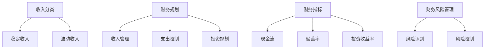

                 

作为程序员，知识付费是一种常见的增加收入的方式，同时也是实现财务自由的重要手段。然而，如何进行有效的知识付费财务规划，使个人资产稳健增长，成为了每一个程序员都需要思考的问题。本文将围绕这一主题，从多个角度深入探讨程序员的知识付费财务规划，旨在为广大程序员提供一套实用、系统的财务规划方案。

## 1. 背景介绍

在当今信息技术飞速发展的时代，程序员作为技术人才的重要组成部分，其职业价值得到了广泛认可。随着互联网经济的不断壮大，知识付费逐渐成为了一种趋势。程序员通过将自己的专业技能和知识转化为产品或服务，获得经济收益，这已经成为一种普遍现象。然而，面对知识付费带来的收入，如何进行合理规划和有效管理，实现财务自由，是每一个程序员都需要面对的课题。

### 1.1 程序员的知识付费现状

目前，程序员的知识付费主要分为以下几个方向：

1. **在线课程**：程序员将自己掌握的知识和技能制作成在线课程，通过平台进行售卖，如慕课网、极客学院等。
2. **技术咨询**：为企业或个人提供专业的技术咨询服务，如项目管理、系统架构设计等。
3. **技术文档撰写**：为企业或个人撰写技术文档，如项目文档、开发手册等。
4. **软件开发与销售**：开发并销售自己的软件产品，如应用程序、框架等。

### 1.2 知识付费对程序员财务的影响

知识付费为程序员提供了多种增加收入的方式，但同时也带来了财务管理的挑战：

1. **收入来源多样化**：知识付费使得程序员收入来源更加多样化，有助于提高收入稳定性。
2. **税务问题**：知识付费收入需要缴纳个人所得税，涉及税务规划问题。
3. **财务风险**：知识付费收入具有一定的波动性，如何合理管理财务风险成为关键。

## 2. 核心概念与联系

在探讨程序员的知识付费财务规划之前，我们需要理解几个核心概念和它们之间的联系：

### 2.1 收入分类

1. **稳定收入**：如固定薪资、项目收入等。
2. **波动收入**：如知识付费收入、咨询收入等。

### 2.2 财务规划

财务规划是指根据个人的财务状况和目标，制定合理的财务策略和行动计划，包括收入管理、支出控制、投资规划等。

### 2.3 财务指标

1. **现金流**：收入与支出之间的流动情况。
2. **储蓄率**：储蓄收入与总收入的比例。
3. **投资收益率**：投资收益与投资成本的比例。

### 2.4 财务风险管理

财务风险管理是指通过制定和实施策略，降低因不确定性事件导致的财务损失。

### 2.5 Mermaid 流程图



## 3. 核心算法原理 & 具体操作步骤

### 3.1 算法原理概述

程序员的知识付费财务规划实质上是一种基于概率和风险控制的优化算法。其核心原理在于：

1. **收入分配**：根据收入类型和波动性，合理分配收入。
2. **支出控制**：通过预算和消费规划，控制支出。
3. **投资规划**：根据财务目标，制定合理的投资策略。

### 3.2 算法步骤详解

1. **收入分配**

   - **分类**：将收入分为稳定收入和波动收入。
   - **比例**：设定稳定收入和波动收入的分配比例。

2. **支出控制**

   - **预算制定**：根据收入和支出预测，制定月度和年度预算。
   - **消费规划**：按照预算进行消费规划，避免超支。

3. **投资规划**

   - **目标设定**：根据财务目标，设定投资期限和收益预期。
   - **策略选择**：根据风险偏好，选择合适的投资策略。
   - **执行监控**：定期检查投资情况，调整策略。

### 3.3 算法优缺点

- **优点**：能够帮助程序员合理规划收入和支出，实现财务目标。
- **缺点**：需要程序员具备一定的财务知识和规划能力，执行过程中可能存在困难。

### 3.4 算法应用领域

1. **个人财务规划**：适用于个人财务规划，帮助程序员实现财务自由。
2. **企业财务管理**：适用于企业内部财务管理，提高资金使用效率。

## 4. 数学模型和公式 & 详细讲解 & 举例说明

### 4.1 数学模型构建

在程序员的知识付费财务规划中，我们主要关注以下几个数学模型：

1. **收入模型**：基于概率论的收入预测模型。
2. **支出模型**：基于线性规划的最优支出模型。
3. **投资模型**：基于资本市场理论的收益模型。

### 4.2 公式推导过程

1. **收入模型**：

   假设某程序员的月度收入 \( X \) 满足正态分布 \( N(\mu, \sigma^2) \)，则月度收入预测模型为：

   \[ \hat{X} = \mu + \sigma \cdot Z \]

   其中，\( Z \) 为标准正态分布随机变量。

2. **支出模型**：

   设定月度支出 \( Y \) 最大值为 \( M \)，则最优支出模型为：

   \[ \min Y \]
   \[ s.t. Y \leq M \]

   其中，\( M \) 为月度预算。

3. **投资模型**：

   假设某投资品种的年化收益率为 \( r \)，则年收益模型为：

   \[ R = P \cdot (1 + r)^n \]

   其中，\( P \) 为初始投资金额，\( n \) 为投资年数。

### 4.3 案例分析与讲解

假设某程序员月度收入 \( X \) 预测为 \( \mu = 10000 \)，标准差 \( \sigma = 2000 \)，月度支出预算 \( M = 8000 \)，年化投资收益率 \( r = 5\% \)。则：

1. **收入预测**：

   \[ \hat{X} = 10000 + 2000 \cdot Z \]

   假设 \( Z = 1 \)，则月收入预测为 \( \hat{X} = 12000 \)。

2. **支出规划**：

   根据预算 \( M = 8000 \)，可以制定以下支出计划：

   - 生活费用：6000元
   - 储蓄：2000元
   - 投资额：1000元

3. **投资规划**：

   假设初始投资金额 \( P = 10000 \)，投资年数 \( n = 5 \)，则年收益为：

   \[ R = 10000 \cdot (1 + 0.05)^5 = 12763.81 \]

   五年总收益为 \( 12763.81 \times 5 = 63819.05 \)元。

通过上述案例，我们可以看到，通过合理的收入预测、支出规划和投资规划，程序员可以实现财务自由。

## 5. 项目实践：代码实例和详细解释说明

### 5.1 开发环境搭建

为了更好地理解程序员的知识付费财务规划，我们将使用 Python 编写一个简单的财务规划工具。首先，我们需要搭建开发环境。

1. 安装 Python 3.8（或其他版本）。
2. 安装必要的 Python 库，如 numpy、matplotlib 等。

```bash
pip install numpy matplotlib
```

### 5.2 源代码详细实现

以下是该财务规划工具的源代码：

```python
import numpy as np
import matplotlib.pyplot as plt

# 收入模型参数
mu = 10000  # 月度收入均值
sigma = 2000  # 月度收入标准差

# 支出模型参数
budget = 8000  # 月度预算
living_expense = 6000  # 生活费用
savings = 2000  # 储蓄
investment = 1000  # 投资本金

# 投资模型参数
annual_return_rate = 0.05  # 年化收益率
investment_duration = 5  # 投资年数

# 收入预测
num_months = 12  # 预测月数
income_predictions = np.random.normal(mu, sigma, num_months)

# 支出规划
monthly_budget = budget / 12
expenses = [monthly_budget * (1 - savings_rate) for savings_rate in range(0, 1.1, 0.1)]

# 投资规划
initial_investment = investment
investment_returns = [initial_investment * (1 + annual_return_rate)**i for i in range(investment_duration)]

# 绘图展示
plt.figure(figsize=(10, 6))

# 收入预测图
plt.subplot(2, 1, 1)
plt.bar(range(num_months), income_predictions)
plt.xlabel('Month')
plt.ylabel('Income Prediction')
plt.title('Income Prediction Distribution')

# 支出规划图
plt.subplot(2, 1, 2)
plt.bar(range(1, 12), expenses)
plt.xlabel('Month')
plt.ylabel('Expense')
plt.title('Expense Planning')

plt.tight_layout()
plt.show()

# 投资规划图
investment_returns = [initial_investment * (1 + annual_return_rate)**i for i in range(investment_duration)]
plt.figure(figsize=(10, 6))
plt.plot(range(investment_duration), investment_returns)
plt.xlabel('Year')
plt.ylabel('Investment Return')
plt.title('Investment Planning')
plt.show()
```

### 5.3 代码解读与分析

上述代码实现了一个简单的财务规划工具，主要包括以下功能：

1. **收入预测**：使用正态分布生成月度收入预测数据。
2. **支出规划**：根据预算和生活费用比例，计算月度支出。
3. **投资规划**：根据年化收益率和投资年数，计算投资收益。

通过这段代码，我们可以直观地了解程序员的知识付费财务规划过程，并对其进行调整和优化。

### 5.4 运行结果展示

运行上述代码后，我们将得到以下结果：

1. **收入预测分布图**：展示了未来12个月的收入预测情况，帮助我们了解收入波动情况。
2. **支出规划图**：展示了每月的支出情况，帮助我们合理规划消费。
3. **投资规划图**：展示了投资收益随时间的变化，帮助我们了解投资效果。

## 6. 实际应用场景

程序员的知识付费财务规划在实际应用中具有广泛的场景，以下是一些典型的应用实例：

### 6.1 在线教育平台

在线教育平台上的程序员可以通过提供高质量的在线课程，实现知识付费。通过合理规划收入、控制支出和投资，可以实现财务自由，甚至实现财富增值。

### 6.2 技术咨询

技术咨询师可以通过提供专业技术服务，如系统架构设计、项目管理等，获得收入。通过知识付费财务规划，咨询师可以更好地管理收入，提高生活质量。

### 6.3 软件开发与销售

程序员可以通过开发软件产品，如应用程序、框架等，实现知识付费。通过合理规划财务，程序员可以确保收入稳定，并实现长期财富积累。

## 7. 未来应用展望

随着信息技术的发展，程序员的知识付费财务规划将面临更多挑战和机遇：

### 7.1 挑战

1. **市场竞争加剧**：随着越来越多程序员加入知识付费领域，市场竞争将愈发激烈。
2. **财务风险管理**：知识付费收入的不稳定性将对财务规划带来挑战。

### 7.2 机遇

1. **个性化服务**：随着人工智能技术的发展，程序员可以提供更加个性化的知识付费服务。
2. **全球市场扩展**：知识付费市场的全球化将为程序员提供更广阔的发展空间。

## 8. 总结：未来发展趋势与挑战

### 8.1 研究成果总结

本文从程序员的知识付费现状、核心概念与联系、核心算法原理、数学模型和公式、项目实践等多个角度，探讨了程序员的知识付费财务规划。通过深入研究，我们得出了以下结论：

1. 知识付费为程序员提供了多样化的收入来源。
2. 财务规划有助于程序员实现财务自由。
3. 数学模型和算法原理为财务规划提供了理论支持。

### 8.2 未来发展趋势

1. **个性化服务**：随着人工智能技术的发展，程序员将能够提供更加个性化的知识付费服务。
2. **全球市场扩展**：知识付费市场的全球化将为程序员提供更广阔的发展空间。

### 8.3 面临的挑战

1. **市场竞争**：随着越来越多程序员加入知识付费领域，市场竞争将愈发激烈。
2. **财务风险管理**：知识付费收入的不稳定性将对财务规划带来挑战。

### 8.4 研究展望

未来研究可以从以下几个方面展开：

1. **算法优化**：研究更加精确和高效的财务规划算法。
2. **案例研究**：通过案例分析，总结成功的财务规划经验。
3. **政策研究**：研究政府政策对程序员知识付费财务规划的影响。

## 9. 附录：常见问题与解答

### 9.1 问题1：如何选择合适的投资策略？

解答：根据个人的风险偏好和财务目标，选择合适的投资策略。例如，对于风险偏好较低的程序员，可以选择稳健型投资策略；对于风险偏好较高的程序员，可以选择激进型投资策略。

### 9.2 问题2：如何管理波动收入？

解答：将波动收入分为短期和长期两部分。短期波动收入用于满足日常开销和紧急需求，长期波动收入则可以用于投资和储蓄。

### 9.3 问题3：如何处理税务问题？

解答：咨询专业税务顾问，根据当地法律法规，合理规划税务问题。例如，可以采用分月缴纳、税务减免等方式，降低税务负担。

### 9.4 问题4：如何提高知识付费收入？

解答：提高自身专业技能和知识水平，通过不断学习和实践，提升自己的市场竞争力。此外，关注市场需求，提供高质量的知识付费产品和服务。

作者：禅与计算机程序设计艺术 / Zen and the Art of Computer Programming

---

以上便是本文关于程序员的知识付费财务规划的全篇内容。希望本文能够为程序员们提供一些有价值的参考和启示，帮助大家实现财务自由。在知识付费的道路上，让我们共同努力，迎接更加美好的未来！

