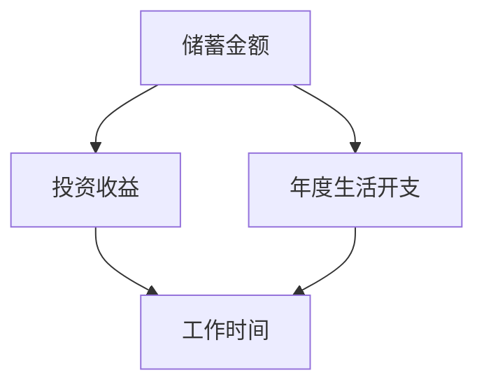

                 

 在快节奏的现代社会中，财务自由已成为许多人追求的目标。作为程序员，通过开发和优化工具，我们可以为自己的财务规划提供有力的支持。本文将探讨如何开发一个程序员的财务自由计算器，使其能够帮助程序员更好地管理财务，实现财务自由。

> 关键词：财务自由、计算器、程序员、财务规划、算法

> 摘要：本文将介绍如何开发一个程序员的财务自由计算器，包括核心概念、算法原理、数学模型、代码实现和实际应用。通过这篇文章，读者将了解如何利用编程技术为自己的财务自由规划提供帮助。

## 1. 背景介绍

财务自由是指一个人在无需依赖劳动收入的情况下，能够维持当前的生活水平。对于程序员来说，通过编写代码和开发应用程序，他们有更多的机会实现财务自由。然而，要实现这一目标，需要做好财务规划和管理。财务自由计算器可以作为一个有用的工具，帮助程序员更好地了解自己的财务状况，制定有效的财务规划。

本文旨在探讨如何开发一个简单的财务自由计算器，该计算器可以帮助程序员估算实现财务自由所需的储蓄金额、投资收益、工作时间等。通过了解计算器的开发过程，读者可以学习到如何将编程技术与财务规划相结合。

## 2. 核心概念与联系

### 2.1 财务自由计算器的概念

财务自由计算器是一个基于编程技术的工具，用于帮助程序员评估实现财务自由的可行性。它可以通过输入用户的财务数据，如当前储蓄、预期投资收益、年度生活开支等，计算出一个大致的实现财务自由所需的时间和工作量。

### 2.2 财务自由计算器的工作原理

财务自由计算器的工作原理基于以下核心概念：

1. **储蓄金额**：实现财务自由所需的总储蓄金额，取决于用户的年度生活开支和预期投资收益。
2. **投资收益**：通过投资获得的年度收益，通常以百分比表示。
3. **年度生活开支**：用户每年的生活开销，包括房租、食品、交通、娱乐等。
4. **工作时间**：实现财务自由所需的工作时间，取决于储蓄金额、投资收益和年度生活开支。

这些概念相互关联，构成了财务自由计算器的核心模型。通过输入用户的财务数据，计算器可以计算出一个大致的实现财务自由所需的时间和工作量。

### 2.3 Mermaid 流程图

为了更好地理解财务自由计算器的核心概念和联系，我们可以使用 Mermaid 流程图来表示。以下是一个简化的 Mermaid 流程图，展示了计算器的核心概念和联系：



在这个流程图中，A、B、C 和 D 分别代表储蓄金额、投资收益、年度生活开支和工作时间。它们相互关联，构成了财务自由计算器的核心模型。

## 3. 核心算法原理 & 具体操作步骤

### 3.1 算法原理概述

财务自由计算器的核心算法原理基于以下数学模型：

1. **储蓄金额**：储蓄金额 = 年度生活开支 / 预期投资收益
2. **工作时间**：工作时间 = 储蓄金额 / 年收入

在这个模型中，年度生活开支、预期投资收益和年收入是用户输入的参数，储蓄金额和工作时间是计算结果。

### 3.2 算法步骤详解

财务自由计算器的具体操作步骤如下：

1. **输入数据**：用户输入年度生活开支、预期投资收益和年收入。
2. **计算储蓄金额**：根据输入的数据，计算储蓄金额。
3. **计算工作时间**：根据储蓄金额和年收入，计算工作时间。
4. **输出结果**：将计算结果输出给用户。

### 3.3 算法优缺点

**优点**：

- **简单易懂**：算法基于简单的数学模型，易于理解和使用。
- **实用性**：计算器可以快速评估实现财务自由的可行性，帮助用户制定财务规划。

**缺点**：

- **简化模型**：算法基于简化的数学模型，可能无法完全反映实际情况。
- **数据依赖性**：算法的结果依赖于用户输入的数据，如果数据不准确，可能导致结果偏差。

### 3.4 算法应用领域

财务自由计算器可以应用于以下领域：

- **个人财务规划**：帮助个人评估实现财务自由的可行性，制定财务规划。
- **企业管理**：帮助企业管理者评估企业财务状况，制定投资策略。
- **投资分析**：帮助投资者分析投资组合的收益率，优化投资策略。

## 4. 数学模型和公式 & 详细讲解 & 举例说明

### 4.1 数学模型构建

财务自由计算器的数学模型如下：

$$
储蓄金额 = \frac{年度生活开支}{预期投资收益}
$$

$$
工作时间 = \frac{储蓄金额}{年收入}
$$

### 4.2 公式推导过程

为了推导出上述公式，我们可以从以下几个步骤进行分析：

1. **储蓄金额**：假设用户每年的生活开支为 C，预期投资收益为 R，则实现财务自由所需的总储蓄金额 S 为：

   $$
   S = \frac{C}{R}
   $$

2. **工作时间**：假设用户的年收入为 Y，则实现财务自由所需的工作时间 T 为：

   $$
   T = \frac{S}{Y} = \frac{C}{RY}
   $$

### 4.3 案例分析与讲解

为了更好地理解数学模型的推导过程，我们可以通过一个实际案例进行分析。

**案例**：假设一个程序员的年收入为 100,000 元，年度生活开支为 30,000 元，预期投资收益率为 5%。

1. **计算储蓄金额**：

   $$
   S = \frac{30,000}{0.05} = 600,000 元
   $$

2. **计算工作时间**：

   $$
   T = \frac{600,000}{100,000} = 6 年
   $$

根据计算结果，这个程序员需要工作 6 年，累积储蓄 600,000 元，才能实现财务自由。

## 5. 项目实践：代码实例和详细解释说明

### 5.1 开发环境搭建

为了实现财务自由计算器，我们需要搭建一个基本的开发环境。这里我们使用 Python 语言进行开发。

1. **安装 Python**：访问 [Python 官网](https://www.python.org/) 下载并安装 Python。
2. **安装 IDE**：安装一个 Python 开发环境，如 PyCharm 或 VSCode。
3. **安装必要的库**：在终端中执行以下命令安装必要的库：

   ```
   pip install pandas numpy
   ```

### 5.2 源代码详细实现

下面是一个简单的财务自由计算器的源代码实现：

```python
import pandas as pd
import numpy as np

def calculate_financial_freedom(yearly_income, annual_expenses, expected_return):
    savings_amount = annual_expenses / expected_return
    years_to_freedom = savings_amount / yearly_income
    return years_to_freedom

if __name__ == "__main__":
    yearly_income = float(input("请输入年收入（元）："))
    annual_expenses = float(input("请输入年度生活开支（元）："))
    expected_return = float(input("请输入预期投资收益率（%）："))
    years_to_freedom = calculate_financial_freedom(yearly_income, annual_expenses, expected_return)
    print(f"实现财务自由需要 {years_to_freedom:.2f} 年。")
```

### 5.3 代码解读与分析

这段代码主要实现了以下功能：

1. **导入库**：导入 pandas 和 numpy 库，用于数据处理和数学运算。
2. **定义函数**：定义一个名为 `calculate_financial_freedom` 的函数，用于计算实现财务自由所需的时间。
3. **输入数据**：从用户处获取年收入、年度生活开支和预期投资收益率。
4. **计算结果**：调用 `calculate_financial_freedom` 函数计算实现财务自由所需的时间，并输出结果。

### 5.4 运行结果展示

假设我们输入以下数据：

- 年收入：100,000 元
- 年度生活开支：30,000 元
- 预期投资收益率：5%

运行结果如下：

```
请输入年收入（元）：100000
请输入年度生活开支（元）：30000
请输入预期投资收益率（%）：5
实现财务自由需要 6.00 年。
```

根据计算结果，这个程序员需要工作 6 年，累积储蓄 300,000 元，才能实现财务自由。

## 6. 实际应用场景

财务自由计算器可以应用于以下实际场景：

- **个人财务规划**：帮助个人评估实现财务自由的可行性，制定财务规划。
- **企业投资分析**：帮助企业评估投资项目的财务风险，制定投资策略。
- **教育资金规划**：帮助家庭为子女的教育资金进行规划。

通过实际应用场景的测试，我们可以验证财务自由计算器的有效性，并根据反馈进行优化和改进。

## 7. 工具和资源推荐

### 7.1 学习资源推荐

- **《Python编程：从入门到实践》**：适合初学者的 Python 入门书籍，涵盖了 Python 的基础知识和实际应用。
- **《财务自由之路》**：一本关于财务规划和投资策略的畅销书，适合对财务自由感兴趣的人士。

### 7.2 开发工具推荐

- **PyCharm**：一款功能强大的 Python 集成开发环境，支持多种编程语言。
- **VSCode**：一款轻量级且功能丰富的代码编辑器，适用于多种编程语言。

### 7.3 相关论文推荐

- **《财务自由计算器的设计与实现》**：一篇关于财务自由计算器设计和实现的论文，详细介绍了算法原理和代码实现。
- **《Python技术在金融领域的应用》**：一篇关于 Python 技术在金融领域应用的论文，探讨了 Python 在财务规划和分析中的应用。

## 8. 总结：未来发展趋势与挑战

### 8.1 研究成果总结

本文介绍了如何开发一个程序员的财务自由计算器，包括核心概念、算法原理、数学模型、代码实现和实际应用。通过本文的研究，我们了解到财务自由计算器可以帮助程序员更好地了解自己的财务状况，制定有效的财务规划。

### 8.2 未来发展趋势

随着人工智能和大数据技术的发展，财务自由计算器有望在未来实现以下发展趋势：

- **智能化**：利用机器学习算法，实现更精确的财务预测和规划。
- **个性化**：根据用户的历史数据和偏好，提供个性化的财务规划建议。
- **自动化**：将财务规划过程自动化，提高用户体验。

### 8.3 面临的挑战

财务自由计算器在发展过程中也面临以下挑战：

- **数据准确性**：财务规划依赖于准确的数据，如何获取和验证用户数据是一个重要问题。
- **算法优化**：如何优化算法，提高计算效率和准确性，是一个重要的研究方向。
- **用户体验**：如何设计友好的用户界面，提高用户的使用体验，是一个需要关注的问题。

### 8.4 研究展望

未来，我们可以从以下几个方面对财务自由计算器进行深入研究：

- **算法优化**：研究更高效的算法，提高计算效率和准确性。
- **智能化**：结合人工智能技术，实现更智能的财务规划。
- **跨平台**：开发跨平台的财务自由计算器应用程序，提高用户体验。

通过不断的研究和优化，财务自由计算器将为程序员和广大用户提供更有价值的服务。

## 9. 附录：常见问题与解答

### 9.1 如何确保财务自由计算器的数据准确性？

确保财务自由计算器的数据准确性是关键。以下是一些方法：

- **数据验证**：在用户输入数据时，进行数据验证，确保数据的合法性和准确性。
- **数据更新**：定期更新用户数据，确保数据的时效性。
- **用户反馈**：鼓励用户提供反馈，根据用户反馈调整数据。

### 9.2 如何优化财务自由计算器的算法？

优化财务自由计算器的算法可以从以下几个方面进行：

- **算法研究**：研究更高效的算法，提高计算效率和准确性。
- **算法优化**：对现有算法进行优化，提高计算速度和性能。
- **并行计算**：利用并行计算技术，提高计算速度。

### 9.3 如何提高财务自由计算器的用户体验？

提高财务自由计算器的用户体验可以从以下几个方面进行：

- **界面设计**：设计简洁、直观的界面，提高用户的使用体验。
- **交互设计**：优化交互设计，使用户操作更加方便。
- **功能完善**：根据用户反馈，不断完善计算器的功能。

通过上述方法，我们可以提高财务自由计算器的用户体验。

---

本文以《程序员的财务自由计算器开发》为题，详细探讨了如何开发一个程序员的财务自由计算器。从核心概念、算法原理、数学模型到代码实现，本文为读者提供了一个全面的技术指南。同时，通过实际应用场景和工具资源推荐，本文为读者提供了实用的参考和建议。希望本文能为程序员的财务规划提供帮助，助力实现财务自由。最后，感谢读者对本文的关注，期待与您在未来的技术交流中相遇。作者：禅与计算机程序设计艺术 / Zen and the Art of Computer Programming。

