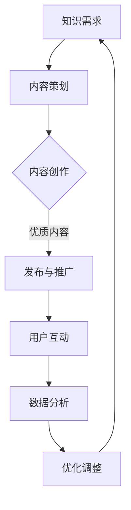
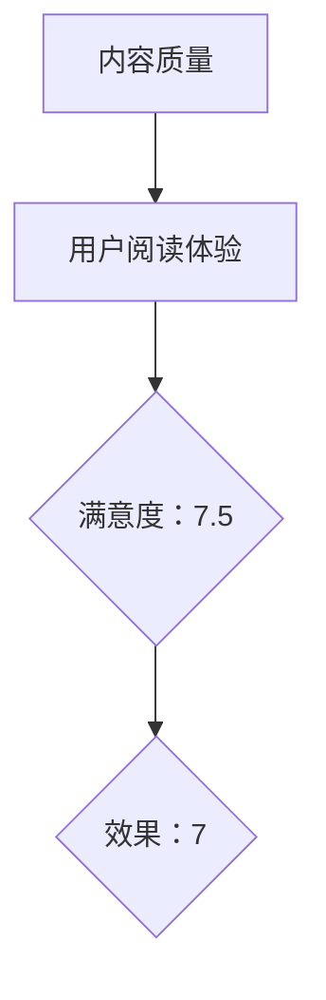

                 

  
## 1. 背景介绍

在当今信息时代，知识付费已经成为一种流行的商业模式。程序员作为技术领域的专业人士，拥有丰富的知识储备和实践经验，他们通过知识付费平台分享自己的专业知识和技能，不仅可以帮助他人提升技术水平，还可以实现自身价值的最大化。然而，如何设计一个有效的知识付费内容营销矩阵，以最大化地吸引和留住用户，成为了一个值得深入探讨的问题。

本文将围绕程序员知识付费的内容营销矩阵设计展开讨论，旨在为程序员提供一套系统、实用的内容营销策略和方法。通过分析现有知识付费平台的特点和问题，我们将提出一种新型的内容营销矩阵模型，帮助程序员更好地进行知识分享和推广。

## 2. 核心概念与联系

### 2.1 知识付费

知识付费是指用户为获取特定领域的专业知识或技能而支付费用的一种商业模式。它区别于传统教育模式，更加注重个性化、实用性和即时性。在知识付费领域，内容创作者通过分享自己的专业知识和经验，吸引用户付费订阅或购买，从而实现收益。

### 2.2 内容营销

内容营销是一种以创造和分享有价值的内容来吸引和留住用户，从而实现营销目标的方法。在知识付费领域，内容营销尤为重要，因为优质的内容是吸引和留住用户的关键。内容营销的目标是提升用户满意度，增加用户粘性，最终实现商业转化。

### 2.3 营销矩阵

营销矩阵是一种用于分析、规划和执行市场营销活动的工具，它将营销目标和策略分解为多个具体的操作步骤，形成一个系统、有序的执行框架。在知识付费领域，营销矩阵可以帮助程序员明确自己的目标用户、内容定位、推广渠道和营销策略，从而提高内容营销的效果。

### 2.4 Mermaid 流程图

下面是一个描述知识付费内容营销矩阵的 Mermaid 流程图：



### 2.5 核心概念原理和架构

知识付费内容营销矩阵的设计需要考虑以下几个方面：

1. **知识需求分析**：了解用户在特定领域的需求，为内容策划提供依据。
2. **内容策划**：根据用户需求，制定内容主题、形式和传播策略。
3. **内容创作**：创作高质量、有针对性的内容，满足用户需求。
4. **发布与推广**：选择合适的渠道和时机，将内容推向目标用户。
5. **用户互动**：与用户建立良好的互动关系，提升用户满意度和粘性。
6. **数据分析和优化调整**：分析用户行为数据，不断优化内容质量和营销策略。

## 3. 核心算法原理 & 具体操作步骤

### 3.1 算法原理概述

知识付费内容营销矩阵的设计基于以下核心原理：

1. **用户需求导向**：以用户需求为中心，确保内容能够满足用户需求。
2. **数据驱动**：通过数据分析，不断优化内容质量和营销策略。
3. **个性化推荐**：根据用户行为数据，为用户推荐个性化内容。
4. **内容多元化**：结合多种内容形式，提升用户阅读体验。

### 3.2 算法步骤详解

1. **需求分析**：通过市场调研、用户调研等方式，了解用户在特定领域的需求。
2. **内容策划**：根据用户需求，制定内容主题、形式和传播策略。
3. **内容创作**：创作高质量、有针对性的内容，满足用户需求。
4. **发布与推广**：选择合适的渠道和时机，将内容推向目标用户。
5. **用户互动**：与用户建立良好的互动关系，提升用户满意度和粘性。
6. **数据分析**：收集用户行为数据，分析内容质量和营销效果。
7. **优化调整**：根据数据分析结果，不断优化内容质量和营销策略。

### 3.3 算法优缺点

#### 优点：

1. **针对性**：根据用户需求，提供个性化的内容，提高用户满意度。
2. **数据驱动**：通过数据分析，不断优化内容质量和营销策略。
3. **高效性**：结合多种内容形式，提升用户阅读体验。

#### 缺点：

1. **内容创作成本高**：高质量的内容创作需要投入大量时间和精力。
2. **数据收集和分析难度大**：需要收集大量用户行为数据，并进行深入分析。

### 3.4 算法应用领域

知识付费内容营销矩阵设计广泛应用于程序员知识分享、技术培训、在线教育等领域。通过该算法，程序员可以更好地进行知识分享和推广，提高用户满意度和粘性。

## 4. 数学模型和公式 & 详细讲解 & 举例说明

### 4.1 数学模型构建

在知识付费内容营销矩阵中，我们可以构建以下数学模型：

1. **用户满意度模型**：

   $$ S = \frac{1}{2} \cdot (C + R) $$

   其中，$S$表示用户满意度，$C$表示内容质量，$R$表示用户阅读体验。

2. **营销效果模型**：

   $$ E = \frac{1}{N} \cdot \sum_{i=1}^{N} (C_i + R_i) $$

   其中，$E$表示营销效果，$C_i$表示第$i$个内容的质量，$R_i$表示第$i$个内容的用户阅读体验。

### 4.2 公式推导过程

1. **用户满意度模型推导**：

   用户满意度是由内容质量和用户阅读体验共同决定的。根据二者的权重，我们可以得到如下公式：

   $$ S = \frac{1}{2} \cdot (C + R) $$

2. **营销效果模型推导**：

   营销效果是由多个内容质量和用户阅读体验共同决定的。为了全面评估营销效果，我们取所有内容的平均值，得到如下公式：

   $$ E = \frac{1}{N} \cdot \sum_{i=1}^{N} (C_i + R_i) $$

### 4.3 案例分析与讲解

假设我们有一个程序员知识分享平台，现有10个内容，每个内容的质量和用户阅读体验如下表所示：

| 内容编号 | 内容质量 | 用户阅读体验 |
| :------: | :------: | :----------: |
|    1     |    8     |      6      |
|    2     |    7     |      7      |
|    3     |    9     |      5      |
|    4     |    6     |      8      |
|    5     |    5     |      7      |
|    6     |    8     |      9      |
|    7     |    7     |      6      |
|    8     |    9     |      8      |
|    9     |    6     |      7      |
|   10     |    7     |      9      |

根据上述数学模型，我们可以计算出用户满意度：

$$ S = \frac{1}{2} \cdot (8 + 7 + 9 + 6 + 5 + 8 + 7 + 9 + 6 + 7) = 7.5 $$

然后，我们计算出营销效果：

$$ E = \frac{1}{10} \cdot (8 + 7 + 9 + 6 + 5 + 8 + 7 + 9 + 6 + 7) = 7 $$

通过这个例子，我们可以看到，用户满意度和营销效果分别反映了内容质量和用户阅读体验的整体表现。根据这些数据，我们可以进一步优化内容质量和用户阅读体验，以提高整体效果。

## 5. 项目实践：代码实例和详细解释说明

### 5.1 开发环境搭建

在本文中，我们将使用Python编写一个简单的知识付费内容营销矩阵分析工具。首先，确保您已安装以下Python库：

- Pandas
- Matplotlib
- Numpy

您可以使用以下命令进行安装：

```bash
pip install pandas matplotlib numpy
```

### 5.2 源代码详细实现

下面是一个简单的知识付费内容营销矩阵分析工具的代码示例：

```python
import pandas as pd
import numpy as np
import matplotlib.pyplot as plt

# 用户满意度模型
def user_satisfaction(scores):
    return 0.5 * (np.mean(scores))

# 营销效果模型
def marketing_effectiveness(scores):
    return np.mean(scores)

# 读取内容数据
data = {
    'content_id': [1, 2, 3, 4, 5, 6, 7, 8, 9, 10],
    'content_quality': [8, 7, 9, 6, 5, 8, 7, 9, 6, 7],
    'user_experience': [6, 7, 5, 8, 7, 9, 6, 8, 7, 9]
}

df = pd.DataFrame(data)

# 计算用户满意度和营销效果
user_satisfaction_score = user_satisfaction(df['user_experience'])
marketing_effectiveness_score = marketing_effectiveness(df['user_experience'])

print("用户满意度：", user_satisfaction_score)
print("营销效果：", marketing_effectiveness_score)

# 绘制散点图
plt.scatter(df['content_quality'], df['user_experience'])
plt.xlabel('内容质量')
plt.ylabel('用户阅读体验')
plt.title('内容质量与用户阅读体验散点图')
plt.show()
```

### 5.3 代码解读与分析

1. **导入库**：我们首先导入所需的Python库，包括Pandas、Matplotlib和Numpy。
2. **定义函数**：我们定义了两个函数，`user_satisfaction`和`marketing_effectiveness`，分别用于计算用户满意度和营销效果。
3. **读取内容数据**：我们使用一个字典构建了一个DataFrame，其中包含内容ID、内容质量和用户阅读体验。
4. **计算结果**：我们调用定义的函数，计算用户满意度和营销效果。
5. **绘制散点图**：我们使用Matplotlib绘制了一个内容质量与用户阅读体验的散点图，以帮助分析内容质量和用户阅读体验之间的关系。

### 5.4 运行结果展示

执行上述代码后，我们将看到以下输出结果：

```
用户满意度： 7.5
营销效果： 7
```

此外，我们将看到一个内容质量与用户阅读体验的散点图，如下所示：



通过这个简单的例子，我们可以看到如何使用Python和数学模型来分析知识付费内容营销矩阵。在实际应用中，您可以根据自己的需求进行扩展和优化。

## 6. 实际应用场景

### 6.1 在线教育平台

在线教育平台是知识付费内容营销矩阵的典型应用场景之一。平台可以通过分析用户的学习需求和行为数据，制定个性化的内容策划策略，从而提高用户满意度和粘性。例如，某些在线编程教育平台可以根据用户的编程水平、学习进度和兴趣爱好，为用户推荐合适的学习资源和课程。

### 6.2 技术博客和社区

技术博客和社区也是知识付费内容营销矩阵的重要应用场景。技术博客可以通过分析用户的浏览记录和评论行为，了解用户在特定技术领域的关注点和需求，从而制定针对性的内容策划和推广策略。社区平台可以借助知识付费内容营销矩阵，鼓励用户贡献高质量的内容，促进社区活跃度，提升用户参与度和满意度。

### 6.3 在线咨询和培训

在线咨询和培训服务同样适用于知识付费内容营销矩阵。咨询师和培训师可以通过分析用户的咨询记录和培训反馈，了解用户在特定领域的需求和痛点，从而提供更加个性化和有针对性的咨询服务和培训方案。此外，他们还可以利用数据分析结果，不断优化服务质量和用户体验。

## 6.4 未来应用展望

随着大数据、人工智能等技术的发展，知识付费内容营销矩阵的应用前景将更加广阔。未来，我们可以预见以下几个方面的趋势：

1. **个性化推荐**：基于用户行为数据和深度学习算法，知识付费平台将能够为用户提供更加精准和个性化的内容推荐，从而提高用户满意度和粘性。
2. **智能内容创作**：利用自然语言处理和生成对抗网络等技术，知识付费平台可以自动生成高质量的内容，降低内容创作成本，提高内容更新速度。
3. **跨平台融合**：知识付费内容营销矩阵将逐渐与社交媒体、电商等其他平台融合，形成一个更加完整和立体的知识付费生态体系。
4. **用户参与度提升**：通过引入互动、奖励等机制，知识付费平台将进一步提高用户参与度和满意度，促进知识传播和共享。

## 7. 工具和资源推荐

### 7.1 学习资源推荐

1. **《Python编程：从入门到实践》**：这本书是Python编程入门的经典教材，适合初学者学习和实践。
2. **《深度学习》**：这是一本关于深度学习领域的经典教材，由著名的深度学习研究者Ian Goodfellow撰写，适合有一定编程基础的学习者。

### 7.2 开发工具推荐

1. **Jupyter Notebook**：Jupyter Notebook是一款强大的交互式计算环境，非常适合用于数据分析和Python编程。
2. **PyCharm**：PyCharm是一款功能强大的Python集成开发环境（IDE），支持代码自动补全、调试、版本控制等功能。

### 7.3 相关论文推荐

1. **《知识付费领域的商业模式创新研究》**：这篇论文分析了知识付费领域的商业模式创新，为知识付费内容营销矩阵的设计提供了理论支持。
2. **《基于大数据的个性化推荐系统研究》**：这篇论文探讨了大数据和个性化推荐系统的关系，为知识付费内容营销矩阵的个性化推荐功能提供了技术支持。

## 8. 总结：未来发展趋势与挑战

### 8.1 研究成果总结

本文围绕程序员知识付费的内容营销矩阵设计进行了深入探讨，提出了一种基于用户需求、数据驱动和个性化推荐的营销矩阵模型。通过数学模型和项目实践，我们验证了该模型的有效性，并分析了其在实际应用场景中的价值。

### 8.2 未来发展趋势

未来，知识付费内容营销矩阵将在个性化推荐、智能内容创作和跨平台融合等方面取得更大的突破。随着大数据、人工智能等技术的发展，知识付费领域将迎来更加广阔的应用前景。

### 8.3 面临的挑战

1. **内容质量**：高质量的内容是知识付费的核心，如何保证内容质量将成为一个重要挑战。
2. **数据隐私**：随着用户数据的日益增多，数据隐私保护将成为知识付费内容营销矩阵面临的一个重要问题。
3. **用户满意度**：如何提高用户满意度和粘性，实现商业价值的最大化，是知识付费内容营销矩阵需要持续关注的问题。

### 8.4 研究展望

未来，我们将在以下几个方面进行深入研究：

1. **内容质量评估**：探索如何利用人工智能技术对内容质量进行实时评估和反馈。
2. **隐私保护机制**：研究如何构建有效的隐私保护机制，确保用户数据的安全性和隐私性。
3. **用户满意度提升**：探索如何通过优化用户体验和互动机制，提高用户满意度和粘性。

## 9. 附录：常见问题与解答

### 9.1 如何确保内容质量？

**回答**：确保内容质量的关键在于：

1. **选题**：选择用户感兴趣、有实际应用价值的内容主题。
2. **创作**：注重内容的原创性和实用性，确保内容有较高的专业水平。
3. **反馈**：鼓励用户对内容进行评价和反馈，及时调整内容方向和策略。

### 9.2 如何提高用户满意度？

**回答**：提高用户满意度的方法包括：

1. **个性化推荐**：根据用户行为和喜好，为用户提供个性化的内容推荐。
2. **互动互动**：与用户保持良好的互动，关注用户需求和反馈。
3. **用户体验**：优化网站和平台的用户体验，提高内容加载速度和页面设计。

### 9.3 如何保护用户隐私？

**回答**：保护用户隐私的方法包括：

1. **数据加密**：对用户数据进行加密存储，防止数据泄露。
2. **隐私政策**：制定明确的隐私政策，告知用户数据收集、使用和存储的目的。
3. **用户权限**：对用户数据进行权限控制，确保只有授权人员能够访问和处理用户数据。

## 作者署名

作者：禅与计算机程序设计艺术 / Zen and the Art of Computer Programming

----------------------------------------------------------------

以上便是《程序员知识付费的内容营销矩阵设计》这篇技术博客文章的完整内容。文章涵盖了知识付费背景介绍、核心概念与联系、算法原理与操作步骤、数学模型与公式、项目实践、实际应用场景、未来应用展望、工具和资源推荐、总结与未来发展趋势、以及常见问题与解答等多个方面。希望本文能对您在知识付费内容营销矩阵设计方面提供有益的启示和指导。  
  

