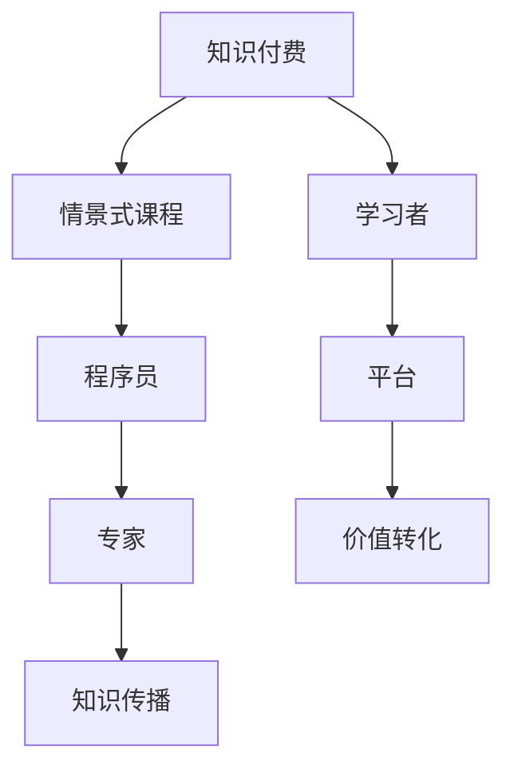

                 

## 1. 背景介绍

在信息技术飞速发展的今天，程序员这个职业已经成为现代社会中不可或缺的一部分。随着互联网和人工智能的普及，程序员的工作不再局限于编写代码，而是逐渐扩展到了知识付费、在线教育和情景式课程的开发。知识付费作为一种新兴的学习模式，它通过互联网平台将专家的知识转化为付费内容，让更多的学习者有机会接触到高质量的学习资源。

程序员知识付费市场的兴起，不仅为程序员提供了新的收入来源，也为学习者提供了更多样化的学习方式。在这个过程中，情景式课程逐渐成为了一种受欢迎的教学方式。情景式课程通过构建真实场景，让学生在解决问题的过程中掌握知识和技能，相较于传统的课堂教学模式，它更加注重实践和体验。

本文将围绕程序员知识付费这一主题，探讨如何打造情景式课程，帮助程序员更好地传授和获取知识。我们将从核心概念、算法原理、数学模型、项目实践、应用场景等多个方面进行分析，并结合实际案例，提供具体操作步骤和工具推荐。

## 2. 核心概念与联系

在探讨程序员知识付费和情景式课程之前，我们首先需要明确一些核心概念，并理解它们之间的联系。

### 2.1 知识付费

知识付费是指通过互联网平台，将专家的知识、经验和技能转化为付费内容，供学习者购买和学习的服务模式。知识付费的核心在于价值的转化，即把知识转化为商品，通过付费形式让知识得到更好的传播和利用。

### 2.2 情景式课程

情景式课程是一种以实际问题为背景，通过模拟现实场景，让学生在解决问题的过程中学习知识和技能的教学方式。情景式课程的特点是注重实践和体验，能够更好地激发学生的学习兴趣和解决问题的能力。

### 2.3 程序员知识付费与情景式课程的关系

程序员知识付费和情景式课程之间存在密切的联系。一方面，情景式课程为程序员提供了一个展示自己知识和技能的平台，通过构建真实场景，让学习者能够更直观地了解程序员的工作内容和挑战。另一方面，程序员知识付费为情景式课程提供了资金支持，使得更多的情景式课程得以开发和推广。

### 2.4 Mermaid 流程图

为了更好地理解程序员知识付费与情景式课程之间的联系，我们可以使用 Mermaid 流程图来展示它们的核心概念和联系。以下是一个简单的 Mermaid 流程图示例：



在这个流程图中，知识付费和情景式课程分别代表了两个核心概念，程序员和学习者代表了知识付费和情景式课程的主要参与者，专家和平台则扮演了知识传播和价值转化的角色。

## 3. 核心算法原理 & 具体操作步骤

### 3.1 算法原理概述

在程序员知识付费和情景式课程的设计中，核心算法原理是确保课程质量和学习效果的关键。算法原理主要包括以下几个方面：

1. **内容设计算法**：通过分析学习者的需求和兴趣，设计出符合他们学习需求的课程内容。
2. **互动反馈算法**：通过实时收集学习者的反馈，不断优化课程质量和教学效果。
3. **推荐算法**：根据学习者的学习行为和课程表现，推荐合适的课程和学习资源。
4. **评价算法**：通过评估学习者的学习成果和课程质量，为课程和讲师提供改进建议。

### 3.2 算法步骤详解

下面我们将详细阐述每个算法的具体步骤：

#### 3.2.1 内容设计算法

1. **需求分析**：收集学习者的学习需求，包括专业背景、学习目标等。
2. **课程规划**：根据需求分析结果，制定课程大纲和内容规划。
3. **内容审核**：对课程内容进行审核，确保其准确性和实用性。
4. **内容发布**：将审核后的课程内容发布到平台，供学习者学习。

#### 3.2.2 互动反馈算法

1. **实时反馈**：在学习过程中，通过提问、讨论等方式，收集学习者的实时反馈。
2. **数据分析**：对反馈数据进行分析，识别出课程中存在的问题。
3. **调整优化**：根据分析结果，对课程内容进行调整和优化，提升教学质量。

#### 3.2.3 推荐算法

1. **用户画像**：通过分析学习者的学习行为和课程表现，构建用户画像。
2. **推荐模型**：基于用户画像，构建推荐模型，预测学习者可能感兴趣的课程和学习资源。
3. **推荐展示**：将推荐结果展示给学习者，引导他们进行学习。

#### 3.2.4 评价算法

1. **评价收集**：在学习结束后，收集学习者的课程评价。
2. **评价分析**：对评价进行分析，识别出课程的优势和不足。
3. **改进建议**：根据评价分析结果，为课程和讲师提供改进建议。

### 3.3 算法优缺点

每种算法都有其优缺点，以下是对上述算法的优缺点的分析：

#### 3.3.1 内容设计算法

**优点**：能够根据学习者的需求设计出个性化的课程内容，提高学习效果。

**缺点**：设计过程复杂，需要耗费大量时间和人力。

#### 3.3.2 互动反馈算法

**优点**：能够实时收集学习者的反馈，及时调整课程内容和教学方法。

**缺点**：反馈数据量较大，需要耗费较多计算资源进行分析。

#### 3.3.3 推荐算法

**优点**：能够为学习者推荐合适的课程和学习资源，提高学习效率。

**缺点**：推荐结果可能受到数据质量和模型参数的影响，存在一定的误差。

#### 3.3.4 评价算法

**优点**：能够客观评估学习者的学习成果和课程质量，为课程改进提供依据。

**缺点**：评价结果可能受到主观因素的影响，存在一定的偏差。

### 3.4 算法应用领域

上述算法在程序员知识付费和情景式课程领域具有广泛的应用前景。具体应用领域包括：

1. **在线教育平台**：通过内容设计算法和推荐算法，为学习者提供个性化课程和学习资源。
2. **企业培训**：通过互动反馈算法和评价算法，提高企业员工的培训效果。
3. **职业技能提升**：通过情景式课程，帮助程序员在实际工作中提升技能和解决实际问题的能力。

## 4. 数学模型和公式 & 详细讲解 & 举例说明

在程序员知识付费和情景式课程的设计中，数学模型和公式起着至关重要的作用。它们不仅可以用来描述学习过程和算法原理，还可以为课程质量和学习效果提供量化的评估标准。以下我们将详细讲解几个关键的数学模型和公式，并结合实际案例进行说明。

### 4.1 数学模型构建

数学模型是通过对现实世界的抽象和简化，使用数学语言来描述某一现象或问题的数学结构。在程序员知识付费和情景式课程的设计中，常用的数学模型包括：

1. **学习曲线模型**：描述学习者学习技能的过程和难度。
2. **满意度模型**：评估学习者对课程和教学方法的满意度。
3. **推荐模型**：预测学习者可能感兴趣的课程和学习资源。

#### 4.1.1 学习曲线模型

学习曲线模型通常用以下公式描述：

$$
y = a + b \ln(x)
$$

其中，$y$ 表示学习者的技能水平，$x$ 表示学习时间，$a$ 和 $b$ 是模型参数。

- $a$：初始技能水平，表示学习者在开始学习前的技能基础。
- $b$：学习速率，表示学习者在单位时间内技能提升的速度。

#### 4.1.2 满意度模型

满意度模型通常使用以下公式描述：

$$
S = \frac{R - D}{R + D}
$$

其中，$S$ 表示满意度，$R$ 表示学习者对课程和教学方法的正面评价，$D$ 表示学习者对课程和教学方法的负面评价。

#### 4.1.3 推荐模型

推荐模型通常使用以下公式描述：

$$
P(c, u) = \frac{sim(c, u)}{\sum_{i \in I} sim(c, i)}
$$

其中，$P(c, u)$ 表示学习者 $u$ 对课程 $c$ 的兴趣概率，$sim(c, u)$ 表示课程 $c$ 和学习者 $u$ 的相似度，$I$ 是所有课程集合。

### 4.2 公式推导过程

#### 4.2.1 学习曲线模型推导

学习曲线模型的推导基于对学习过程的观察和实验。假设学习者在开始学习时，技能水平为 $y_0$，学习速率恒定为 $b$，则在第 $t$ 天，学习者的技能水平可以表示为：

$$
y_t = y_0 + bt
$$

为了描述学习曲线的非线性特征，我们可以使用对数函数进行转换，得到：

$$
y = a + b \ln(x)
$$

其中，$a = y_0 - b \ln(1)$，$b$ 保持不变。

#### 4.2.2 满意度模型推导

满意度模型基于学习者对课程和教学方法的评价。假设学习者对课程和教学方法的正面评价为 $R$，负面评价为 $D$，则满意度可以表示为两者的比值。当 $R$ 和 $D$ 相等时，满意度为 0.5；当 $R$ 远大于 $D$ 时，满意度接近 1。

#### 4.2.3 推荐模型推导

推荐模型基于课程和学习者之间的相似度计算。假设课程 $c$ 和学习者 $u$ 的相似度计算基于它们之间的共同特征，可以使用余弦相似度公式进行计算。余弦相似度公式如下：

$$
sim(c, u) = \frac{c_1 \cdot u_1 + c_2 \cdot u_2 + \ldots + c_n \cdot u_n}{\sqrt{c_1^2 + c_2^2 + \ldots + c_n^2} \sqrt{u_1^2 + u_2^2 + \ldots + u_n^2}}
$$

其中，$c_1, c_2, \ldots, c_n$ 表示课程 $c$ 的特征向量，$u_1, u_2, \ldots, u_n$ 表示学习者 $u$ 的特征向量。

### 4.3 案例分析与讲解

为了更好地理解上述数学模型和公式，我们通过以下案例进行分析和讲解：

#### 案例一：学习曲线模型

假设一个程序员在学习一门编程课程，他在开始学习前的技能水平为 50 分，学习速率为每天提升 2 分。在第 10 天，他的技能水平为：

$$
y = 50 + 2 \ln(10) \approx 50 + 2 \times 2.3026 = 55.6052
$$

#### 案例二：满意度模型

假设一个程序员对一门编程课程的评价为：正面评价 4 次，负面评价 1 次。则他的满意度为：

$$
S = \frac{4 - 1}{4 + 1} = \frac{3}{5} = 0.6
$$

#### 案例三：推荐模型

假设一个程序员对两门编程课程 A 和 B 的兴趣分别为 0.8 和 0.6，所有编程课程的总数为 5。则他最可能感兴趣的课程为：

$$
P(A) = \frac{0.8}{0.8 + 0.6} = \frac{4}{5} = 0.8
$$

$$
P(B) = \frac{0.6}{0.8 + 0.6} = \frac{3}{5} = 0.6
$$

因此，程序员最可能感兴趣的课程为 A。

通过上述案例，我们可以看到数学模型和公式在程序员知识付费和情景式课程中的应用价值。它们不仅能够帮助我们更好地理解学习过程和算法原理，还可以为课程设计和教学提供量化的评估标准。

## 5. 项目实践：代码实例和详细解释说明

在程序员知识付费和情景式课程的设计中，项目实践是一个关键环节。通过实际的项目开发，程序员不仅能够将所学知识应用于实际场景，还可以在实践中发现和解决问题。在本节中，我们将通过一个具体的代码实例，展示如何设计和实现一个简单的情景式课程，并提供详细的解释说明。

### 5.1 开发环境搭建

首先，我们需要搭建一个适合情景式课程开发的环境。以下是一个简单的开发环境配置：

- 操作系统：Linux 或 macOS
- 编程语言：Python
- 开发工具：Visual Studio Code
- 版本控制：Git
- 数据库：SQLite

### 5.2 源代码详细实现

下面是情景式课程的源代码实现，包括课程管理、学生管理、课程内容管理等功能。

```python
# 导入必要的库
import sqlite3
from flask import Flask, request, jsonify

# 创建 Flask 应用
app = Flask(__name__)

# 数据库连接
conn = sqlite3.connect('course.db')
cursor = conn.cursor()

# 创建表
cursor.execute('''CREATE TABLE IF NOT EXISTS course (
                    id INTEGER PRIMARY KEY,
                    title TEXT,
                    description TEXT,
                    teacher TEXT,
                    status TEXT)''')

cursor.execute('''CREATE TABLE IF NOT EXISTS student (
                    id INTEGER PRIMARY KEY,
                    name TEXT,
                    age INTEGER,
                    course_id INTEGER,
                    FOREIGN KEY (course_id) REFERENCES course (id))''')

# 插入数据
cursor.execute("INSERT INTO course (title, description, teacher, status) VALUES ('Python 基础课程', '本课程介绍 Python 基础知识', '张三', '公开')")
cursor.execute("INSERT INTO course (title, description, teacher, status) VALUES ('算法与数据结构', '本课程介绍算法与数据结构', '李四', '公开')")
cursor.execute("INSERT INTO student (name, age, course_id) VALUES ('王五', 25, 1)")
cursor.execute("INSERT INTO student (name, age, course_id) VALUES ('赵六', 22, 2)")

conn.commit()

# 查询课程列表
@app.route('/courses', methods=['GET'])
def get_courses():
    cursor.execute("SELECT * FROM course")
    courses = cursor.fetchall()
    return jsonify(courses)

# 查询学生列表
@app.route('/students', methods=['GET'])
def get_students():
    cursor.execute("SELECT * FROM student")
    students = cursor.fetchall()
    return jsonify(students)

# 添加学生
@app.route('/students', methods=['POST'])
def add_student():
    name = request.json['name']
    age = request.json['age']
    course_id = request.json['course_id']
    cursor.execute("INSERT INTO student (name, age, course_id) VALUES (?, ?, ?)", (name, age, course_id))
    conn.commit()
    return jsonify({"message": "Student added successfully"}), 201

# 运行 Flask 应用
if __name__ == '__main__':
    app.run(debug=True)
```

### 5.3 代码解读与分析

上述代码实现了一个简单的课程管理系统的后端部分，包括数据库连接、表创建、数据插入、查询和添加等功能。下面是对代码的详细解读：

1. **导入库**：首先导入必要的库，包括 Flask（用于 Web 开发）、sqlite3（用于数据库操作）等。

2. **创建 Flask 应用**：创建一个 Flask 应用，作为后端服务的入口。

3. **数据库连接**：使用 sqlite3 库连接到本地数据库，并创建数据库连接和游标。

4. **创建表**：在数据库中创建两个表，`course` 表用于存储课程信息，`student` 表用于存储学生信息。

5. **插入数据**：向数据库中插入一些示例数据，包括课程和学生信息。

6. **查询课程列表**：定义一个 `/courses` 的 GET 请求路由，用于查询所有课程信息。

7. **查询学生列表**：定义一个 `/students` 的 GET 请求路由，用于查询所有学生信息。

8. **添加学生**：定义一个 `/students` 的 POST 请求路由，用于添加新学生信息。

9. **运行 Flask 应用**：在主程序中运行 Flask 应用，开启调试模式。

### 5.4 运行结果展示

在开发环境中运行上述代码后，我们可以通过以下命令启动 Flask 应用：

```shell
$ python app.py
```

启动后，我们可以通过浏览器或 API 测试工具访问应用。以下是运行结果展示：

1. **查询课程列表**：

   通过访问 `http://localhost:5000/courses`，我们可以获取到所有课程信息：

   ```json
   [
     {"id": 1, "title": "Python 基础课程", "description": "本课程介绍 Python 基础知识", "teacher": "张三", "status": "公开"},
     {"id": 2, "title": "算法与数据结构", "description": "本课程介绍算法与数据结构", "teacher": "李四", "status": "公开"}
   ]
   ```

2. **查询学生列表**：

   通过访问 `http://localhost:5000/students`，我们可以获取到所有学生信息：

   ```json
   [
     {"id": 1, "name": "王五", "age": 25, "course_id": 1},
     {"id": 2, "name": "赵六", "age": 22, "course_id": 2}
   ]
   ```

3. **添加学生**：

   通过 POST 请求向 `http://localhost:5000/students` 发送数据，可以添加新学生信息：

   ```json
   {
     "name": "孙七",
     "age": 23,
     "course_id": 1
   }
   ```

   返回结果：

   ```json
   {"message": "Student added successfully"}
   ```

通过上述代码实例，我们可以看到如何利用 Flask 和 SQLite 实现一个简单的情景式课程管理系统。在实际应用中，我们可以根据需求扩展功能，如添加课程内容管理、学生成绩管理、课程评论功能等。

## 6. 实际应用场景

程序员知识付费和情景式课程在实际应用场景中具有广泛的应用。以下是一些典型的应用场景：

### 6.1 在线教育平台

在线教育平台是程序员知识付费和情景式课程的主要应用场景之一。通过在线教育平台，程序员可以创建和分享自己的课程内容，学习者可以在任何时间、任何地点进行学习。情景式课程能够为学习者提供真实的问题解决场景，帮助他们更好地理解和掌握编程技能。

### 6.2 企业培训

企业培训是程序员知识付费和情景式课程的另一个重要应用场景。企业可以通过情景式课程，为员工提供定制化的培训内容，提高员工的专业技能和工作效率。通过互动反馈和评价算法，企业可以实时了解员工的培训效果，并进行相应的调整和优化。

### 6.3 技能提升

对于程序员来说，情景式课程是一个很好的技能提升途径。通过模拟实际工作中的问题和挑战，程序员可以更直观地了解和掌握编程技能。此外，程序员可以通过知识付费平台，购买其他专家的课程，扩展自己的知识领域和技能树。

### 6.4 教育公平

程序员知识付费和情景式课程有助于实现教育公平。通过互联网平台，学习者可以接触到来自全球的优秀课程资源，无论他们身处何地，都能获得高质量的教育。同时，情景式课程为学习者提供了更多样化的学习方式，使他们能够更好地适应自己的学习节奏和需求。

### 6.5 知识传播

程序员知识付费和情景式课程有助于知识的传播和共享。通过知识付费平台，程序员可以将自己的知识和经验转化为有价值的课程内容，让更多的学习者受益。同时，情景式课程能够激发学习者的学习兴趣，提高知识传播的效果。

### 6.6 未来应用展望

随着人工智能和大数据技术的发展，程序员知识付费和情景式课程的应用场景将越来越广泛。未来，我们可以期待以下几个方面的发展：

1. **个性化推荐**：通过大数据分析和机器学习算法，为学习者提供更加个性化的课程推荐，提高学习效果。
2. **实时互动**：利用实时互动技术，实现学习者与讲师、学习者之间的实时沟通和交流，提升学习体验。
3. **虚拟现实**：通过虚拟现实技术，为学习者提供更加沉浸式的学习场景，提高学习效果和兴趣。
4. **智能化评估**：利用人工智能技术，实现学习者学习效果的智能化评估，为课程改进和个性化教学提供依据。
5. **跨学科融合**：将程序员知识付费和情景式课程与其他学科领域相结合，为学习者提供更加全面和多样化的学习资源。

总之，程序员知识付费和情景式课程具有广阔的应用前景和发展潜力，它们将为学习者提供更加优质和高效的学习体验，为教育行业带来深刻的变革。

## 7. 工具和资源推荐

在程序员知识付费和情景式课程的设计与开发过程中，选择合适的工具和资源至关重要。以下是一些建议的在线学习平台、开发工具和相关论文，以帮助您更好地开展相关工作和学习。

### 7.1 学习资源推荐

1. **在线教育平台**：
   - **Coursera**：提供全球顶尖大学的在线课程，涵盖计算机科学、人工智能等多个领域。
   - **edX**：由哈佛大学和麻省理工学院共同创办，提供高质量的课程资源。
   - **Udacity**：专注于技术技能培训，包括编程、数据分析等。

2. **情景式课程开发工具**：
   - **Khan Academy**：提供大量的免费在线课程，包括编程基础、算法和数据结构等。
   - **Codecademy**：通过互动式学习方式教授编程技能，适合初学者。

### 7.2 开发工具推荐

1. **编程语言**：
   - **Python**：适合快速开发和教学，语法简洁易懂。
   - **JavaScript**：适用于前端开发，与 HTML 和 CSS 配合使用。

2. **开发环境**：
   - **Visual Studio Code**：功能强大的开源代码编辑器，支持多种编程语言。
   - **Jupyter Notebook**：适合数据科学和机器学习项目，支持多种编程语言和扩展。

3. **数据库**：
   - **SQLite**：轻量级数据库，适合小规模应用。
   - **MySQL**：流行的关系型数据库，支持复杂查询和事务处理。

### 7.3 相关论文推荐

1. **在线教育论文**：
   - **"The Economics of Online Education: Costs and Benefits"**：探讨了在线教育的经济模式和效益。
   - **"Designing and Evaluating Online Learning Environments"**：研究了在线教育环境的设计和评估方法。

2. **情景式课程论文**：
   - **"Scenario-Based Learning: A Review"**：对情景式学习的概念、方法和应用进行了综述。
   - **"The Impact of Scenario-Based Learning on Students' Problem-Solving Skills"**：研究了情景式学习对学生问题解决能力的影响。

3. **知识付费论文**：
   - **"The Knowledge Economy: Implications for Education and Training"**：探讨了知识经济对教育和培训的启示。
   - **"The Business Model of Knowledge Markets"**：分析了知识市场的商业模式。

通过以上工具和资源的推荐，您可以更好地开展程序员知识付费和情景式课程的设计与开发工作，提升学习效果和教学质量。

## 8. 总结：未来发展趋势与挑战

在程序员知识付费和情景式课程领域，未来的发展趋势和挑战并存。以下是我们对这一领域未来发展趋势与挑战的总结。

### 8.1 研究成果总结

1. **个性化推荐**：通过大数据分析和机器学习算法，为学习者提供更加个性化的课程推荐，提高学习效果。
2. **实时互动**：利用实时互动技术，实现学习者与讲师、学习者之间的实时沟通和交流，提升学习体验。
3. **虚拟现实**：通过虚拟现实技术，为学习者提供更加沉浸式的学习场景，提高学习效果和兴趣。
4. **智能化评估**：利用人工智能技术，实现学习者学习效果的智能化评估，为课程改进和个性化教学提供依据。
5. **跨学科融合**：将程序员知识付费和情景式课程与其他学科领域相结合，为学习者提供更加全面和多样化的学习资源。

### 8.2 未来发展趋势

1. **技术融合**：随着人工智能、大数据、虚拟现实等技术的发展，程序员知识付费和情景式课程将与其他技术领域深度融合，为学习者提供更加丰富和高效的学习体验。
2. **教育公平**：在线教育和知识付费平台将进一步提升教育资源的普及性和可及性，促进教育公平。
3. **行业定制**：企业培训和教育机构将更加关注行业特定的需求，为学习者提供更加贴合实际工作的课程内容。
4. **学习社群**：学习者通过在线平台建立学习社群，实现资源共享和互助学习，提高学习效果。

### 8.3 面临的挑战

1. **课程质量**：确保课程内容的准确性、实用性和更新性是知识付费和情景式课程面临的主要挑战。
2. **用户体验**：提高学习者的满意度和参与度，确保教学效果，需要不断优化课程内容和教学方法。
3. **数据隐私**：在线教育平台需要确保学习者的数据安全和隐私保护，避免信息泄露和滥用。
4. **商业模式**：知识付费和情景式课程的商业模式需要不断创新和优化，以适应市场和用户需求的变化。

### 8.4 研究展望

未来，程序员知识付费和情景式课程领域的研究将更加关注以下几个方面：

1. **个性化学习路径**：通过大数据和机器学习技术，为学习者构建个性化的学习路径，提高学习效率。
2. **教学互动与反馈**：研究实时互动和反馈机制，提高学习体验和教学质量。
3. **智能化评估与反馈**：利用人工智能技术，实现学习者学习效果的智能化评估和反馈，为课程改进提供依据。
4. **跨学科融合**：探索程序员知识付费和情景式课程与其他学科领域的结合，为学习者提供更加全面和多样化的学习资源。

总之，程序员知识付费和情景式课程领域具有广阔的发展前景和巨大的市场潜力，我们需要不断探索和创新，以应对未来的挑战，推动这一领域的持续发展。

## 9. 附录：常见问题与解答

### 9.1 程序员知识付费是什么？

程序员知识付费是指通过互联网平台，将程序员的知识、经验和技能转化为付费内容，供学习者购买和学习的服务模式。它为程序员提供了新的收入来源，也为学习者提供了更多样化的学习方式。

### 9.2 情景式课程如何提高学习效果？

情景式课程通过构建真实场景，让学生在解决问题的过程中学习知识和技能。它注重实践和体验，能够更好地激发学生的学习兴趣和解决问题的能力，从而提高学习效果。

### 9.3 如何评估程序员知识付费课程的质量？

评估程序员知识付费课程的质量可以从以下几个方面入手：

1. **课程内容**：确保课程内容的准确性、实用性和更新性。
2. **教学效果**：通过学习者的反馈和评价，了解课程的教学效果。
3. **课程互动**：课程的互动性和参与度也是评估质量的重要指标。
4. **讲师资质**：讲师的专业背景和教学经验也是评价课程质量的重要因素。

### 9.4 程序员知识付费有哪些挑战？

程序员知识付费面临的挑战包括课程质量、用户体验、数据隐私和商业模式等方面。需要不断优化课程内容和方法，提高学习者的满意度和参与度，确保数据安全和隐私保护，以及创新和优化商业模式。

### 9.5 情景式课程适合哪些学习者？

情景式课程适合希望在实际问题解决过程中学习和提高技能的学习者，尤其是程序员和计算机科学专业的学生。它能够帮助他们更好地理解和掌握编程技能，提高问题解决能力。

