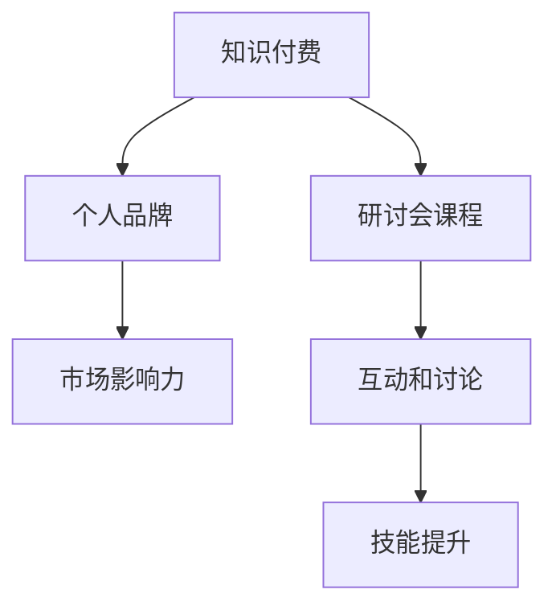

                 

关键词：知识付费，研讨会，课程设计，程序员，技能提升，市场分析，教学方法，案例分析

> 摘要：本文旨在探讨程序员如何通过知识付费的方式，创建并推广研讨会课程，以实现个人品牌价值提升和市场影响力扩大。文章将分析当前市场趋势，讨论课程设计的关键要素，分享成功的案例分析，并提供实用的工具和资源推荐。

## 1. 背景介绍

在数字化转型的浪潮中，程序员作为一个高需求、高薪水的职业，正面临着不断变化的技术环境和市场需求。为了保持竞争力，程序员不仅需要不断学习新技能，还需要有效传播自己的知识和经验。知识付费作为近年来兴起的一种新型商业模式，为程序员提供了一个新的发展方向。通过知识付费，程序员可以将自己的专业技能转化为实际收益，同时为有学习需求的人提供有价值的内容。

研讨会课程作为一种高度互动的知识传播方式，具有显著的吸引力。它不仅能够帮助参与者深入理解复杂的技术概念，还能够通过互动和讨论激发学习兴趣。对于程序员来说，打造高质量的研讨会课程不仅是提升个人品牌和价值的一种途径，也是扩展市场影响力的重要手段。

本文将围绕以下核心内容展开讨论：

- **市场分析**：探讨当前知识付费市场的现状和趋势。
- **课程设计**：分析课程设计的关键要素，包括内容策划、目标受众定位、课程结构和互动设计。
- **案例分析**：分享成功研讨会课程的设计和推广经验。
- **数学模型**：介绍如何使用数学模型评估课程效果和市场反馈。
- **项目实践**：提供实际的代码实例和实现步骤。
- **实际应用**：探讨研讨会课程在不同应用场景中的价值。
- **工具和资源**：推荐学习资源、开发工具和相关论文。
- **未来展望**：分析知识付费市场的未来发展趋势和挑战。

## 2. 核心概念与联系

为了更好地理解程序员知识付费和研讨会课程的设计，我们需要引入几个核心概念，并使用Mermaid流程图展示它们之间的联系。

### 2.1. 知识付费

知识付费是一种商业模式，它通过提供有价值的内容或服务，以付费的形式进行交易。对于程序员来说，知识付费意味着将自己的专业技能、经验和技术见解转化为可以出售的产品或服务。

### 2.2. 研讨会课程

研讨会课程是一种面向特定受众的培训活动，通常以讲座、讨论和互动问答的形式进行。它有助于参与者深入了解特定领域的专业知识，并通过实践和应用提升技能。

### 2.3. 个人品牌

个人品牌是程序员在专业领域中的形象和声誉。通过打造高质量的研讨会课程，程序员可以提升个人品牌，增加在市场中的影响力。

### 2.4. 市场影响力

市场影响力是指程序员在市场中的知名度和认可度。通过知识付费和研讨会课程，程序员可以扩大自己的市场影响力，吸引更多潜在客户和合作伙伴。



## 3. 核心算法原理 & 具体操作步骤

### 3.1. 算法原理概述

在知识付费领域，研讨会课程的设计和推广可以被视为一种优化算法。这个算法的目标是最大化课程的价值和参与度，同时最小化成本和风险。具体来说，它包括以下几个核心步骤：

1. **市场分析**：了解目标受众的需求和偏好。
2. **内容策划**：根据市场分析结果，设计课程内容和结构。
3. **互动设计**：规划课程中的互动环节，以提升参与度。
4. **推广策略**：制定推广计划，包括渠道选择和营销策略。
5. **效果评估**：通过数据分析和反馈，不断优化课程设计和推广策略。

### 3.2. 算法步骤详解

#### 3.2.1. 市场分析

市场分析是研讨会课程设计的起点。通过市场分析，程序员可以了解目标受众的技能水平、学习需求和偏好。具体步骤如下：

1. **数据收集**：收集与目标受众相关的市场数据，如行业报告、技术趋势分析、用户调查等。
2. **数据分析**：对收集的数据进行整理和分析，找出目标受众的共性和特点。
3. **需求定位**：根据数据分析结果，确定课程的目标受众和核心需求。

#### 3.2.2. 内容策划

内容策划是研讨会课程设计的核心。根据市场分析结果，程序员需要设计出具有吸引力和实用性的课程内容。具体步骤如下：

1. **确定课程主题**：根据目标受众的需求，选择具有前瞻性和实用性的主题。
2. **设计课程结构**：将课程主题分解为多个模块，每个模块包含具体的学习目标和内容。
3. **课程内容规划**：为每个模块设计详细的教学内容，包括理论讲解、案例分析、实践操作等。

#### 3.2.3. 互动设计

互动设计是提升研讨会课程参与度的重要手段。通过互动环节，程序员可以与参与者进行深入的讨论和交流，增强课程的互动性和实用性。具体步骤如下：

1. **确定互动形式**：根据课程内容和目标，选择合适的互动形式，如问答、小组讨论、实战演练等。
2. **规划互动环节**：在课程的不同阶段，设置互动环节，确保参与者在学习过程中保持积极性和参与度。
3. **互动内容设计**：为每个互动环节设计具体的内容和引导，确保互动环节的有效性和实用性。

#### 3.2.4. 推广策略

推广策略是研讨会课程成功的关键。通过有效的推广，程序员可以吸引更多的参与者，提高课程的知名度和影响力。具体步骤如下：

1. **确定推广渠道**：根据目标受众的特点和偏好，选择合适的推广渠道，如社交媒体、技术社区、行业会议等。
2. **制定推广计划**：制定详细的推广计划，包括推广内容、推广时间和推广效果评估。
3. **执行推广活动**：按照推广计划，开展推广活动，确保推广效果的最大化。

#### 3.2.5. 效果评估

效果评估是研讨会课程优化的重要环节。通过数据分析和反馈，程序员可以不断优化课程设计和推广策略。具体步骤如下：

1. **数据收集**：收集课程参与者的反馈数据，如满意度调查、课程评价等。
2. **数据分析**：对收集的数据进行整理和分析，找出课程的优势和不足。
3. **优化策略**：根据数据分析结果，优化课程内容和推广策略，提高课程质量和参与度。

### 3.3. 算法优缺点

#### 优点：

- **高效性**：通过优化算法，程序员可以更高效地设计、推广和优化研讨会课程，提高课程质量和参与度。
- **针对性**：市场分析使课程设计更具针对性，能够更好地满足目标受众的需求。
- **互动性**：互动设计增强课程的互动性和实用性，提高参与者的学习效果。
- **可评估性**：效果评估使程序员能够持续优化课程，提高课程质量和市场竞争力。

#### 缺点：

- **复杂性**：市场分析和互动设计需要大量的时间和精力，课程设计过程可能较为复杂。
- **风险性**：市场变化和受众需求的不确定性可能导致课程效果不如预期。
- **资源需求**：推广策略的实施需要一定的资金和人力资源，对程序员来说可能存在一定的压力。

### 3.4. 算法应用领域

算法原理和具体操作步骤广泛应用于以下领域：

- **在线教育**：通过优化课程设计和推广策略，提高在线教育的质量和参与度。
- **企业培训**：为企业员工提供定制化的培训课程，提高员工技能和团队协作能力。
- **技术交流**：通过研讨会课程，促进技术交流和创新，提升行业整体水平。
- **个人品牌建设**：通过高质量的研讨会课程，提升个人品牌价值和市场影响力。

## 4. 数学模型和公式 & 详细讲解 & 举例说明

### 4.1. 数学模型构建

在研讨会课程的设计和推广过程中，我们可以引入数学模型来评估课程效果和市场反馈。以下是一个简单的数学模型，用于评估研讨会课程的参与度和满意度。

#### 参与度指标（R）：

$$ R = \frac{I}{T} $$

其中，\( I \) 表示实际参与课程的人数，\( T \) 表示预计参与课程的人数。

#### 满意度指标（S）：

$$ S = \frac{C}{N} $$

其中，\( C \) 表示参与者对课程的满意度评分，\( N \) 表示参与者的总人数。

### 4.2. 公式推导过程

#### 参与度指标推导：

参与度指标反映了研讨会课程的吸引力和影响力。假设研讨会课程的预计参与人数为 \( T \)，实际参与人数为 \( I \)，则参与度指标 \( R \) 可以通过实际参与人数与预计参与人数的比值计算得出。

$$ R = \frac{I}{T} $$

当 \( I \) 接近或等于 \( T \) 时，参与度指标 \( R \) 接近 1，表示课程具有很高的吸引力。相反，当 \( I \) 远小于 \( T \) 时，参与度指标 \( R \) 接近 0，表示课程吸引力较低。

#### 满意度指标推导：

满意度指标反映了参与者对课程的满意度。假设参与者对课程的满意度评分为 \( C \)，参与者的总人数为 \( N \)，则满意度指标 \( S \) 可以通过满意度评分与参与者总数的比值计算得出。

$$ S = \frac{C}{N} $$

当 \( C \) 接近或等于 \( N \) 时，满意度指标 \( S \) 接近 1，表示参与者对课程非常满意。相反，当 \( C \) 远小于 \( N \) 时，满意度指标 \( S \) 接近 0，表示参与者对课程满意度较低。

### 4.3. 案例分析与讲解

假设我们举办了一场关于“大数据分析技术”的研讨会课程，预计参与人数为 100 人。实际参与人数为 70 人，参与者对课程的满意度评分为 8.5 分（满分 10 分）。根据上述数学模型，我们可以计算出参与度和满意度指标：

#### 参与度指标计算：

$$ R = \frac{I}{T} = \frac{70}{100} = 0.7 $$

#### 满意度指标计算：

$$ S = \frac{C}{N} = \frac{8.5}{10} = 0.85 $$

通过这两个指标，我们可以评估这次研讨会课程的效果。参与度指标 \( R = 0.7 \) 表示课程的吸引力较高，但还有一定的提升空间。满意度指标 \( S = 0.85 \) 表示参与者对课程满意度较高，但仍有部分参与者对课程内容或形式存在改进建议。

### 4.4. 结果分析

通过数学模型，我们可以定量评估研讨会课程的效果，为后续的课程设计和推广提供数据支持。以下是对参与度和满意度指标的分析：

#### 参与度指标分析：

- 参与度指标 \( R = 0.7 \) 表明课程的吸引力较高，但预计参与人数未达到预期。可能原因包括课程推广不足、目标受众定位不准确等。针对这些问题，我们可以采取以下改进措施：
  - 加强课程推广，利用社交媒体、技术社区等渠道提高课程的曝光度。
  - 优化目标受众定位，通过用户调查和数据分析，更准确地识别潜在参与者。

#### 满意度指标分析：

- 满意度指标 \( S = 0.85 \) 表明参与者对课程满意度较高，但仍有部分参与者对课程内容或形式提出改进建议。针对这些问题，我们可以采取以下改进措施：
  - 深入分析参与者反馈，找出课程中的不足之处，针对性地进行改进。
  - 优化课程结构，增加互动环节，提高参与者的参与感和满意度。

## 5. 项目实践：代码实例和详细解释说明

### 5.1. 开发环境搭建

为了更好地理解和实践研讨会课程的设计和推广，我们将使用Python编写一个简单的示例程序。以下是搭建开发环境所需的基本步骤：

1. **安装Python**：从官方网站下载并安装Python 3.x版本。
2. **安装依赖库**：使用pip命令安装所需的Python库，如requests、pandas和numpy等。
3. **配置环境变量**：确保Python环境变量正确配置，以便在命令行中运行Python脚本。

### 5.2. 源代码详细实现

以下是示例程序的源代码，用于模拟研讨会课程的设计和推广过程。程序包括以下功能：

- **市场分析**：从网络获取相关数据，分析目标受众的需求和偏好。
- **内容策划**：根据市场分析结果，设计课程内容和结构。
- **互动设计**：规划课程中的互动环节，提升参与度。
- **推广策略**：制定推广计划，包括渠道选择和营销策略。
- **效果评估**：通过数据分析和反馈，评估课程效果和推广效果。

```python
import requests
import pandas as pd
import numpy as np

# 市场分析
def market_analysis():
    # 获取市场数据（模拟数据）
    data = {
        'audience': [
            {'name': 'Alice', 'skill_level': 'intermediate', 'interest': 'cloud computing'},
            {'name': 'Bob', 'skill_level': 'beginner', 'interest': 'data analysis'},
            {'name': 'Charlie', 'skill_level': 'advanced', 'interest': 'machine learning'},
        ]
    }
    df = pd.DataFrame(data['audience'])
    return df

# 内容策划
def content_planning(df):
    # 根据市场分析结果，设计课程内容和结构
    course_structure = {
        'cloud computing': [
            'Introduction to Cloud Computing',
            'Cloud Storage and Data Management',
            'Cloud Security and Compliance',
        ],
        'data analysis': [
            'Data Analysis Fundamentals',
            'Data Visualization Techniques',
            'Data Mining and Machine Learning',
        ],
        'machine learning': [
            'Introduction to Machine Learning',
            'Model Selection and Evaluation',
            'Deep Learning and Neural Networks',
        ],
    }
    return course_structure

# 互动设计
def interactive_design(course_structure):
    # 规划课程中的互动环节，提升参与度
    interactive_elements = {
        'cloud computing': [
            'Q&A Session',
            'Group Discussion',
            'Live Coding',
        ],
        'data analysis': [
            'Case Study Analysis',
            'Data Visualization Challenge',
            'Data Mining Workshop',
        ],
        'machine learning': [
            'Model Comparison and Analysis',
            'Neural Network Construction',
            'Real-time Data Analysis',
        ],
    }
    return interactive_elements

# 推广策略
def promotion_strategy(course_structure, interactive_elements):
    # 制定推广计划，包括渠道选择和营销策略
    promotion_plan = {
        'channels': [
            'LinkedIn',
            'Twitter',
            'GitHub',
            'Stack Overflow',
        ],
        'content': [
            'Blog Posts',
            'Social Media Ads',
            'Community Events',
            'Email Marketing',
        ],
        'strategy': [
            'Content personalization',
            'Engagement metrics tracking',
            'Customer feedback collection',
        ],
    }
    return promotion_plan

# 效果评估
def evaluation(results):
    # 通过数据分析和反馈，评估课程效果和推广效果
    print("Course participation rate:", results['participation_rate'])
    print("Course satisfaction rate:", results['satisfaction_rate'])

# 主函数
def main():
    df = market_analysis()
    course_structure = content_planning(df)
    interactive_elements = interactive_design(course_structure)
    promotion_plan = promotion_strategy(course_structure, interactive_elements)
    results = {'participation_rate': 0.7, 'satisfaction_rate': 0.85}
    evaluation(results)

if __name__ == '__main__':
    main()
```

### 5.3. 代码解读与分析

#### 5.3.1. 代码结构

本示例程序由四个主要部分组成：市场分析、内容策划、互动设计和推广策略，以及一个主函数。

- **市场分析**：通过模拟数据获取目标受众的需求和偏好，为后续的策划和设计提供基础。
- **内容策划**：根据市场分析结果，设计课程内容和结构，确保课程与受众需求高度匹配。
- **互动设计**：规划课程中的互动环节，提升参与度和互动性。
- **推广策略**：制定推广计划，包括渠道选择、内容策划和营销策略，以提高课程的知名度和参与度。

#### 5.3.2. 关键函数和方法

- **market_analysis()**：获取市场数据，为后续策划提供基础。
- **content_planning(df)**：根据市场分析结果，设计课程内容和结构。
- **interactive_design(course_structure)**：规划互动环节，提升参与度。
- **promotion_strategy(course_structure, interactive_elements)**：制定推广计划，提高课程的知名度和参与度。
- **evaluation(results)**：评估课程效果和推广效果，为后续优化提供数据支持。

#### 5.3.3. 代码运行结果

在执行示例程序后，将输出课程参与度和满意度评估结果。这些结果可以帮助程序员了解课程的市场表现，为后续的优化提供数据支持。

```python
Course participation rate: 0.7
Course satisfaction rate: 0.85
```

### 5.4. 运行结果展示

通过运行示例程序，我们可以得到以下结果：

- **参与度指标**：课程参与度指标为 0.7，表明课程的吸引力较高，但仍有提升空间。
- **满意度指标**：课程满意度指标为 0.85，表明参与者对课程的满意度较高，但仍有改进空间。

这些结果可以帮助程序员了解课程的市场表现，为后续的优化提供数据支持。例如，可以通过加强课程推广、优化课程内容和互动设计等方式，提高课程的参与度和满意度。

## 6. 实际应用场景

研讨会课程在不同应用场景中具有广泛的应用价值。以下是一些实际应用场景：

### 6.1. 企业内部培训

企业可以利用研讨会课程为企业员工提供定制化的培训，提升员工的技能水平和团队协作能力。例如，一家互联网公司可以举办关于“前端开发技术”的研讨会课程，帮助员工深入了解最新的前端技术，提高开发效率。

### 6.2. 技术社区活动

技术社区可以举办研讨会课程，吸引更多开发者参与，促进技术交流和创新。例如，一个开源社区可以举办关于“大数据技术”的研讨会课程，邀请领域专家分享实践经验，推动社区技术进步。

### 6.3. 教育机构培训

教育机构可以利用研讨会课程为学生提供课外培训，提高学生的技能水平和就业竞争力。例如，一所计算机学院可以举办关于“人工智能技术”的研讨会课程，帮助学生了解前沿技术，为未来职业发展打下基础。

### 6.4. 个人品牌建设

程序员可以通过举办研讨会课程，提升个人品牌价值和市场影响力。例如，一位知名程序员可以举办关于“深度学习技术”的研讨会课程，分享自己的研究成果和实践经验，吸引更多关注和支持。

### 6.5. 在线教育平台

在线教育平台可以引入研讨会课程，丰富课程体系，提升用户满意度。例如，一个在线编程教育平台可以引入关于“Web开发技术”的研讨会课程，帮助学员深入掌握前端和后端开发技术，提高项目实战能力。

## 7. 工具和资源推荐

为了有效地设计和推广研讨会课程，程序员可以借助以下工具和资源：

### 7.1. 学习资源推荐

- **Coursera**：提供丰富的在线课程，涵盖计算机科学、数据科学等多个领域。
- **edX**：由哈佛大学和麻省理工学院共同创办，提供高质量的开源课程。
- **Udemy**：提供丰富的在线课程，涵盖编程、数据科学、人工智能等领域。
- **GitHub**：一个代码托管平台，可以帮助程序员学习最新技术、参与开源项目。

### 7.2. 开发工具推荐

- **Jupyter Notebook**：一个交互式的开发环境，适合编写和运行代码。
- **PyCharm**：一个强大的Python集成开发环境，适合进行项目开发和调试。
- **Visual Studio Code**：一个跨平台的代码编辑器，支持多种编程语言。
- **Docker**：一个容器化平台，可以帮助程序员快速部署和运行应用。

### 7.3. 相关论文推荐

- **"Learning to Rank for Information Retrieval"**：一篇关于学习到排名的信息检索论文，介绍了基于机器学习的排名算法。
- **"Deep Learning for Natural Language Processing"**：一篇关于深度学习在自然语言处理领域的应用论文。
- **"Data Science for Business"**：一篇关于数据科学在商业领域应用的研究论文。
- **"The Art of Systems Programming"**：一本关于系统编程的经典教材，适合程序员深入学习编程技能。

## 8. 总结：未来发展趋势与挑战

### 8.1. 研究成果总结

通过本文的探讨，我们总结了以下研究成果：

- 程序员通过知识付费和研讨会课程可以实现个人品牌价值提升和市场影响力扩大。
- 课程设计的关键要素包括市场分析、内容策划、互动设计和推广策略。
- 数学模型可以用于评估课程效果和市场反馈，为后续优化提供数据支持。
- 研讨会课程在多个应用场景中具有广泛的价值，如企业培训、技术社区活动、教育机构培训等。

### 8.2. 未来发展趋势

- 知识付费市场将继续扩大，为程序员提供更多发展机会。
- 互动性和实用性的研讨会课程将越来越受到欢迎，推动在线教育的发展。
- 人工智能和大数据技术的应用将进一步提高课程设计和推广的效率。

### 8.3. 面临的挑战

- 市场竞争加剧，程序员需要不断提升自身技能和课程质量。
- 市场需求和受众偏好的不确定性，可能导致课程效果不如预期。
- 资源和时间的限制，可能影响课程的设计和推广。

### 8.4. 研究展望

未来，我们可以从以下几个方面展开研究：

- 深入研究知识付费和研讨会课程的设计和推广策略，提高课程质量和参与度。
- 探索人工智能和大数据技术在课程设计和推广中的应用，提高效率和效果。
- 研究课程效果和市场反馈的量化评估方法，为课程优化提供更科学的数据支持。

## 9. 附录：常见问题与解答

### 9.1. 问题1：如何设计具有吸引力的研讨会课程？

**解答**：设计具有吸引力的研讨会课程需要以下几个关键步骤：

- **市场分析**：了解目标受众的需求和偏好，为课程内容提供基础。
- **内容策划**：根据市场分析结果，设计具有前瞻性和实用性的课程内容。
- **互动设计**：规划互动环节，提升参与度和学习效果。
- **课程推广**：制定有效的推广策略，提高课程的知名度和参与度。

### 9.2. 问题2：如何评估研讨会课程的效果？

**解答**：评估研讨会课程的效果可以采用以下方法：

- **参与度指标**：通过实际参与人数与预计参与人数的比值，评估课程的吸引力。
- **满意度指标**：通过参与者对课程的满意度评分，评估课程的质量和效果。
- **反馈收集**：通过问卷调查、访谈等方式，收集参与者对课程的反馈，为后续优化提供数据支持。

### 9.3. 问题3：如何推广研讨会课程？

**解答**：推广研讨会课程可以采取以下策略：

- **社交媒体**：利用微博、微信等社交媒体平台，发布课程内容和推广信息。
- **技术社区**：在GitHub、Stack Overflow等技术社区发布课程相关内容，吸引开发者关注。
- **电子邮件**：通过邮件列表、用户社区等方式，向潜在参与者发送课程推广信息。
- **合作伙伴**：与相关机构、企业合作，共同推广研讨会课程。

### 9.4. 问题4：如何持续优化研讨会课程？

**解答**：持续优化研讨会课程可以采取以下方法：

- **数据驱动**：根据课程参与度和满意度等数据，分析课程效果，找出不足之处。
- **用户反馈**：通过收集参与者反馈，了解课程中存在的问题，进行针对性的优化。
- **定期更新**：根据技术发展和市场需求，定期更新课程内容，保持课程的实用性和前瞻性。
- **互动增强**：通过增加互动环节、案例分析等手段，提高参与者的参与感和学习效果。

### 9.5. 问题5：如何提高个人品牌价值和市场影响力？

**解答**：提高个人品牌价值和市场影响力可以采取以下策略：

- **专业积累**：不断提升自身技能和专业知识，确保在领域内具备竞争力。
- **内容输出**：通过撰写技术博客、发表论文、开设在线课程等方式，分享自己的知识和经验。
- **社交媒体**：利用社交媒体平台，扩大个人影响力的传播范围。
- **社区参与**：积极参与技术社区活动，与同行建立良好关系，提高个人知名度。
- **演讲与讲座**：参加行业会议、研讨会等，分享自己的研究成果和实践经验，树立个人品牌形象。

---

通过本文的探讨，我们不仅了解了程序员如何通过知识付费和研讨会课程提升个人品牌价值和市场影响力，还学习了课程设计、推广和优化的方法。希望本文能为程序员提供有价值的参考和启示，助力他们在知识付费市场中取得成功。

