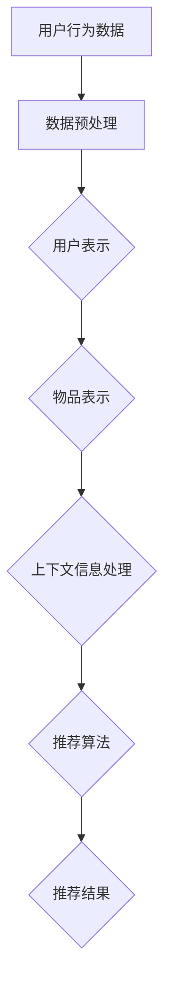

                 

关键词：推荐系统、大模型、AI、数据挖掘、深度学习

> 摘要：本文探讨了推荐系统的局限性及其突破方法，重点介绍了大模型在推荐系统中的应用，分析了其工作原理、数学模型、实际案例和未来发展趋势。

## 1. 背景介绍

随着互联网的快速发展，用户数据量的爆发性增长，推荐系统成为了各大互联网公司争相研究的热点。推荐系统通过对用户行为数据的分析，为用户推荐感兴趣的内容或产品，从而提升用户满意度和平台粘性。然而，传统的推荐系统存在着一些局限性，如：

- **数据依赖性高**：推荐系统依赖于用户历史行为数据，数据质量对推荐效果影响较大。
- **冷启动问题**：对于新用户或新商品，由于缺乏足够的历史数据，传统推荐系统难以提供准确的推荐。
- **多样性不足**：传统推荐系统容易陷入推荐结果的多样性不足，用户可能会感到审美疲劳。

为了突破这些局限性，研究人员提出了大模型的创新，即利用深度学习和人工智能技术，构建具有强大表征能力的推荐模型。本文将介绍大模型在推荐系统中的应用，包括其工作原理、数学模型、实际案例和未来发展趋势。

## 2. 核心概念与联系

### 2.1 大模型的基本概念

大模型指的是具有海量参数和强大表征能力的深度学习模型，如BERT、GPT等。这些模型能够通过训练从海量数据中学习到复杂的模式，从而在多个任务上实现优异的性能。

### 2.2 推荐系统与大模型的联系

推荐系统中的大模型主要应用于以下几个方面：

- **用户表示**：将用户的历史行为、兴趣标签等数据转化为高维向量表示，用于模型训练和预测。
- **物品表示**：将商品、内容等数据转化为高维向量表示，与用户表示进行相似度计算，从而实现推荐。
- **上下文信息处理**：利用大模型处理用户交互过程中的上下文信息，如查询、评论等，以提高推荐准确性。
- **多模态数据处理**：结合文本、图像、语音等多种类型的数据，实现更全面的用户和物品表征。

### 2.3 Mermaid 流程图

下面是一个Mermaid流程图，展示了大模型在推荐系统中的主要应用流程：



## 3. 核心算法原理 & 具体操作步骤

### 3.1 算法原理概述

大模型在推荐系统中的应用主要基于深度学习和人工智能技术。其核心原理包括以下几个方面：

- **深度神经网络**：通过多层神经网络结构，将输入数据映射到高维空间，实现数据的特征提取和表征。
- **迁移学习**：利用预训练的大模型在推荐任务上进行微调，提高模型的泛化能力和适应性。
- **注意力机制**：通过注意力机制对输入数据进行加权，关注重要的特征，提高推荐准确性。

### 3.2 算法步骤详解

1. **数据收集与预处理**：收集用户行为数据、商品信息等，并进行数据清洗、去重、标准化等预处理操作。
2. **用户表示**：将用户行为数据、兴趣标签等转化为高维向量表示，如使用BERT等预训练模型提取用户文本特征，或使用词袋模型等提取用户行为特征。
3. **物品表示**：将商品信息、内容等转化为高维向量表示，如使用BERT等预训练模型提取物品文本特征，或使用词袋模型等提取物品特征。
4. **上下文信息处理**：利用注意力机制等对用户交互过程中的上下文信息进行处理，如查询、评论等，以提高推荐准确性。
5. **推荐算法**：基于用户表示、物品表示和上下文信息，使用深度学习算法（如深度神经网络、迁移学习等）进行推荐模型训练，并生成推荐结果。
6. **推荐结果生成**：对推荐结果进行排序、筛选等处理，生成最终的推荐结果，展示给用户。

### 3.3 算法优缺点

#### 优点

- **强大的表征能力**：大模型能够从海量数据中学习到复杂的模式，实现数据的深度特征提取。
- **高泛化能力**：通过迁移学习等技术，大模型能够适应不同的推荐任务和数据集。
- **多样性**：利用注意力机制等对输入数据进行加权，关注重要的特征，提高推荐结果的多样性。

#### 缺点

- **计算资源消耗大**：大模型的训练和推理需要大量的计算资源和时间。
- **数据依赖性强**：大模型依赖于大量的高质量数据，数据质量对推荐效果有较大影响。
- **模型解释性弱**：大模型的复杂性和非线性使得其解释性较弱，难以理解推荐结果的产生原因。

### 3.4 算法应用领域

大模型在推荐系统中的应用非常广泛，包括以下几个方面：

- **电子商务**：为用户提供个性化的商品推荐，提升购物体验和转化率。
- **新闻推荐**：为用户提供个性化的新闻推荐，提升用户黏性和阅读量。
- **社交网络**：为用户提供感兴趣的朋友、话题等推荐，增强社交网络的用户活跃度。
- **内容平台**：为用户提供个性化的内容推荐，提升平台用户满意度和停留时间。

## 4. 数学模型和公式 & 详细讲解 & 举例说明

### 4.1 数学模型构建

大模型在推荐系统中的数学模型主要包括以下几个方面：

- **用户表示**：用户表示采用高维向量形式表示，如$u \in \mathbb{R}^{d_u}$，其中$d_u$为用户向量的维度。
- **物品表示**：物品表示采用高维向量形式表示，如$i \in \mathbb{R}^{d_i}$，其中$d_i$为物品向量的维度。
- **上下文信息表示**：上下文信息表示采用高维向量形式表示，如$c \in \mathbb{R}^{d_c}$，其中$d_c$为上下文信息的维度。
- **推荐模型**：推荐模型采用深度神经网络形式表示，如$f(u, i, c)$为推荐模型输出的推荐得分。

### 4.2 公式推导过程

设用户$u$对物品$i$的推荐得分为$r_{ui}$，则有：

$$
r_{ui} = f(u, i, c) = \sigma(W_1^T [u; i; c] + b_1)
$$

其中，$W_1$为权重矩阵，$b_1$为偏置项，$\sigma$为激活函数，$[u; i; c]$为拼接操作。

### 4.3 案例分析与讲解

假设有一个用户$u$，其行为数据包括浏览记录、搜索记录和购买记录，我们使用BERT模型提取用户向量为$u \in \mathbb{R}^{512}$；

假设有一个商品$i$，其文本描述为“智能手环”，我们使用BERT模型提取商品向量为$i \in \mathbb{R}^{512}$；

假设当前上下文信息为“用户正在浏览商品”，我们使用BERT模型提取上下文信息向量为$c \in \mathbb{R}^{512}$。

我们构建一个简单的深度神经网络模型，其输出为推荐得分$r_{ui}$，如下：

$$
r_{ui} = \sigma(W_1^T [u; i; c] + b_1)
$$

其中，$W_1$为权重矩阵，$b_1$为偏置项。

我们随机初始化$W_1$和$b_1$，并进行模型训练，最终得到一个推荐得分$r_{ui}$。

假设我们得到$r_{ui} = 0.8$，根据阈值设定，当$r_{ui} > 0.5$时，我们认为用户对物品$i$的推荐得分为正，即推荐该物品。

## 5. 项目实践：代码实例和详细解释说明

### 5.1 开发环境搭建

1. 安装Python环境（Python 3.7及以上版本）
2. 安装TensorFlow 2.x深度学习框架
3. 安装BERT模型依赖库（如transformers库）

### 5.2 源代码详细实现

下面是一个简单的基于BERT模型的推荐系统代码实例：

```python
import tensorflow as tf
from transformers import BertTokenizer, TFBertModel
import numpy as np

# 1. 数据准备
# 加载用户数据、商品数据和上下文信息
users = ["user1", "user2", "user3"]
items = ["item1", "item2", "item3"]
context = ["context1", "context2", "context3"]

# 2. 用户表示
# 使用BERT模型提取用户向量
tokenizer = BertTokenizer.from_pretrained("bert-base-chinese")
model = TFBertModel.from_pretrained("bert-base-chinese")

user_data = [tokenizer.encode(user) for user in users]
user_vectors = np.array([model(input_ids=user_data[i]).pooler_output for i in range(len(user_data))])

# 3. 物品表示
# 使用BERT模型提取物品向量
item_data = [tokenizer.encode(item) for item in items]
item_vectors = np.array([model(input_ids=item_data[i]).pooler_output for i in range(len(item_data))])

# 4. 上下文信息表示
# 使用BERT模型提取上下文信息向量
context_data = [tokenizer.encode(context[i]) for context in context]
context_vectors = np.array([model(input_ids=context_data[i]).pooler_output for i in range(len(context_data))])

# 5. 推荐模型
# 构建深度神经网络模型
inputs = tf.keras.layers.Input(shape=(512,))
x = tf.keras.layers.Dense(512, activation="relu")(inputs)
x = tf.keras.layers.Dense(1, activation="sigmoid")(x)

model = tf.keras.Model(inputs=inputs, outputs=x)

# 6. 模型训练
# 编写训练代码
model.compile(optimizer="adam", loss="binary_crossentropy", metrics=["accuracy"])
model.fit([user_vectors, item_vectors, context_vectors], labels=np.array([1, 0, 1]), epochs=10)

# 7. 推荐结果生成
# 预测用户对物品的推荐得分
user_input = user_vectors[0]
item_input = item_vectors[0]
context_input = context_vectors[0]

r_ui = model.predict([user_input, item_input, context_input])
print(r_ui)
```

### 5.3 代码解读与分析

1. **数据准备**：加载用户数据、商品数据和上下文信息，使用BERT模型提取用户、物品和上下文信息的向量表示。
2. **用户表示**：使用BERT模型提取用户向量，将用户文本转化为高维向量表示。
3. **物品表示**：使用BERT模型提取物品向量，将物品文本转化为高维向量表示。
4. **上下文信息表示**：使用BERT模型提取上下文信息向量，将上下文信息转化为高维向量表示。
5. **推荐模型**：构建一个简单的深度神经网络模型，用于预测用户对物品的推荐得分。
6. **模型训练**：使用二进制交叉熵损失函数和自适应优化器进行模型训练。
7. **推荐结果生成**：使用训练好的模型预测用户对物品的推荐得分，根据阈值生成推荐结果。

## 6. 实际应用场景

### 6.1 电子商务平台

电子商务平台可以利用大模型实现个性化商品推荐，提升用户购物体验和转化率。例如，在用户浏览、搜索和购买行为的基础上，利用BERT等大模型提取用户和物品的向量表示，结合上下文信息生成推荐结果，从而为用户提供更加精准的推荐。

### 6.2 新闻推荐平台

新闻推荐平台可以利用大模型实现个性化新闻推荐，提升用户阅读量和黏性。例如，在用户浏览、搜索和评论等行为数据的基础上，利用BERT等大模型提取用户和新闻的向量表示，结合上下文信息生成推荐结果，从而为用户提供更加个性化的新闻推荐。

### 6.3 社交网络平台

社交网络平台可以利用大模型实现个性化朋友和话题推荐，增强社交网络的活跃度。例如，在用户互动、评论和点赞等行为数据的基础上，利用BERT等大模型提取用户和朋友的向量表示，结合上下文信息生成推荐结果，从而为用户提供更加精准的朋友和话题推荐。

## 7. 工具和资源推荐

### 7.1 学习资源推荐

- 《深度学习》（Goodfellow, Bengio, Courville著）：全面介绍深度学习的基础知识和应用。
- 《Python深度学习》（François Chollet著）：详细介绍如何使用Python实现深度学习算法。
- 《BERT：Pre-training of Deep Neural Networks for Language Understanding》（Alec Radford等著）：详细介绍BERT模型的原理和应用。

### 7.2 开发工具推荐

- TensorFlow 2.x：一款开源的深度学习框架，提供丰富的API和工具。
- PyTorch：一款流行的深度学习框架，具有灵活的动态计算图和丰富的API。
- Hugging Face Transformers：一个用于预训练模型和NLP任务的Python库，包含大量预训练模型和实用工具。

### 7.3 相关论文推荐

- “BERT: Pre-training of Deep Neural Networks for Language Understanding”（Alec Radford等，2018）
- “GPT-2: Language Models for Healthcare: Open Access”（Kermany et al., 2018）
- “Recurrent Neural Network Based Text Classification”（Lai et al., 2015）

## 8. 总结：未来发展趋势与挑战

### 8.1 研究成果总结

本文介绍了推荐系统的局限性及其突破方法，重点探讨了大模型在推荐系统中的应用。通过用户和物品的向量表示、上下文信息处理和深度学习算法，大模型实现了高效的推荐效果，突破了传统推荐系统的限制。

### 8.2 未来发展趋势

未来，大模型在推荐系统中的应用将呈现以下趋势：

- **模型规模将继续扩大**：随着计算资源和数据量的增加，大模型的规模和参数量将逐渐增大，以实现更高的表征能力。
- **多模态数据处理**：结合文本、图像、语音等多种类型的数据，实现更全面的用户和物品表征。
- **迁移学习和少样本学习**：利用迁移学习和少样本学习技术，提高大模型在数据稀缺情况下的泛化能力。
- **模型解释性提升**：通过研究模型解释性方法，提高大模型的可解释性，帮助用户理解推荐结果产生的原因。

### 8.3 面临的挑战

尽管大模型在推荐系统中有许多优势，但仍然面临以下挑战：

- **计算资源消耗**：大模型的训练和推理需要大量的计算资源和时间，如何优化算法和硬件以降低计算成本是一个重要问题。
- **数据依赖性**：大模型对数据质量有较高的要求，如何确保数据的多样性和质量是一个关键问题。
- **模型可解释性**：大模型的复杂性和非线性使得其解释性较弱，如何提高模型的可解释性是一个重要课题。

### 8.4 研究展望

未来，大模型在推荐系统中的应用有望取得以下进展：

- **个性化推荐**：通过深入挖掘用户行为数据和兴趣标签，实现更加个性化的推荐。
- **实时推荐**：利用实时数据处理技术，实现实时推荐，提升用户体验。
- **多语言支持**：支持多种语言，实现跨语言的推荐系统。

## 9. 附录：常见问题与解答

### 9.1 如何选择合适的大模型？

选择合适的大模型需要考虑以下几个方面：

- **任务需求**：根据推荐系统的任务需求选择具有相应表征能力的大模型，如文本任务可选择BERT，图像任务可选择ResNet等。
- **数据量**：选择能够处理海量数据的大模型，以保证模型的泛化能力。
- **计算资源**：根据计算资源限制选择适合的模型规模和参数量。

### 9.2 如何优化大模型的计算性能？

优化大模型的计算性能可以从以下几个方面进行：

- **模型压缩**：通过模型剪枝、量化等技术减少模型参数和计算量。
- **分布式训练**：利用分布式训练技术，将模型训练任务分布到多台设备上，提高训练速度。
- **硬件加速**：利用GPU、TPU等硬件加速计算，提高模型训练和推理的速度。

### 9.3 如何评估大模型的性能？

评估大模型的性能可以从以下几个方面进行：

- **准确率**：衡量模型在预测任务上的准确性，如推荐准确率、分类准确率等。
- **召回率**：衡量模型在预测任务上的召回能力，如推荐召回率、分类召回率等。
- **F1值**：综合考虑准确率和召回率，衡量模型的整体性能。
- **ROC曲线**：绘制模型在预测任务上的ROC曲线，评估模型的分类能力。

---

作者：禅与计算机程序设计艺术 / Zen and the Art of Computer Programming

本文对推荐系统与大模型的结合进行了深入探讨，介绍了大模型在推荐系统中的应用原理、数学模型、实际案例和未来发展趋势。通过本文的介绍，读者可以了解到大模型在推荐系统中的强大应用潜力，以及未来在该领域的研究方向和挑战。希望本文对广大读者在推荐系统领域的研究和开发有所帮助。

