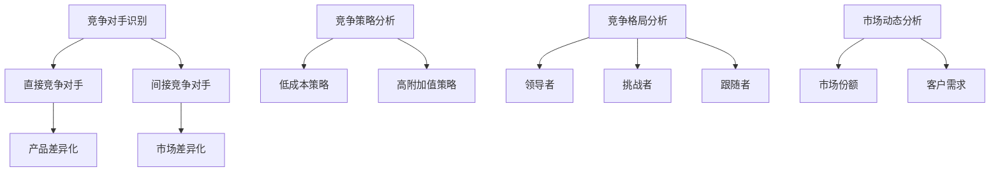

                 

关键词：竞争分析，对手识别，差异化，市场机会，技术策略

> 摘要：本文将深入探讨如何在竞争激烈的技术市场中进行有效的竞争分析，以识别对手和差异化机会。通过分析市场动态、技术趋势和竞争对手的行为，企业可以制定出更具前瞻性和竞争力的战略。本文旨在为技术企业提供一套实用的方法和工具，以在激烈的市场竞争中脱颖而出。

## 1. 背景介绍

在信息技术飞速发展的今天，市场竞争日益激烈。各类技术公司不断涌现，争夺市场份额。在这种情况下，如何识别竞争对手，分析他们的优势和劣势，并抓住差异化机会成为企业生存和发展的关键。

### 1.1 竞争市场的特点

- **高度竞争**：市场上存在众多竞争对手，且竞争方式多样化。
- **快速变化**：技术更新迅速，市场需求和竞争态势不断变化。
- **差异化难度**：产品同质化严重，差异化竞争成为企业脱颖而出的关键。

### 1.2 竞争分析的重要性

- **战略规划**：了解竞争对手可以帮助企业制定更精准的战略。
- **市场定位**：明确自身优势，找到市场的差异化机会。
- **风险防范**：预判市场变化，及时调整策略，降低经营风险。

## 2. 核心概念与联系

在进行竞争分析时，需要理解以下几个核心概念：

### 2.1 竞争对手

- **直接竞争对手**：提供相似产品或服务的公司。
- **间接竞争对手**：虽然不提供相同产品，但能满足相同需求的替代品。

### 2.2 差异化

- **产品差异化**：通过独特功能或特性来区别于竞争对手。
- **市场差异化**：在特定的市场细分中建立竞争优势。

### 2.3 竞争策略

- **低成本策略**：通过规模化生产和成本控制来降低产品价格。
- **高附加值策略**：通过提供独特价值和卓越体验来吸引消费者。

### 2.4 竞争格局

- **领导者**：市场份额最大，具有较强品牌影响力和竞争优势。
- **挑战者**：有潜力成为市场领导者，正在积极扩大市场份额。
- **跟随者**：跟随市场领导者，维持现有市场份额。

### 2.5 市场动态

- **市场份额**：衡量企业在市场中的地位。
- **客户需求**：市场需求的变动直接影响企业的产品策略。

### 2.6 Mermaid 流程图



## 3. 核心算法原理 & 具体操作步骤

### 3.1 算法原理概述

竞争分析的核心在于数据收集、分析和决策。以下是一个基于数据驱动的方法：

1. **数据收集**：收集市场、竞争对手和客户数据。
2. **数据分析**：运用统计学和机器学习算法进行分析。
3. **决策制定**：根据分析结果制定战略决策。

### 3.2 算法步骤详解

1. **市场趋势分析**：
   - 利用时间序列分析预测市场动态。
   - 使用聚类分析识别市场细分。

2. **竞争对手分析**：
   - 收集竞争对手的产品、市场份额和营销策略数据。
   - 运用回归分析预测竞争对手的未来行为。

3. **客户分析**：
   - 利用数据挖掘技术了解客户需求和行为。
   - 使用客户细分方法制定个性化营销策略。

4. **竞争策略分析**：
   - 利用决策树和线性规划模型制定最佳竞争策略。
   - 运用博弈论预测竞争对手的反应。

### 3.3 算法优缺点

- **优点**：提供客观、量化的分析结果，帮助制定明智的战略决策。
- **缺点**：依赖数据质量，分析结果可能受到数据偏差的影响。

### 3.4 算法应用领域

- **市场营销**：通过竞争分析确定最佳的市场细分和目标客户。
- **产品开发**：利用竞争分析指导产品功能和特性的设计。
- **运营管理**：通过竞争分析优化供应链和成本控制。

## 4. 数学模型和公式 & 详细讲解 & 举例说明

### 4.1 数学模型构建

竞争分析中常用的数学模型包括回归分析、聚类分析和博弈论模型。

#### 4.1.1 回归分析

- **线性回归**：y = β0 + β1x1 + β2x2 + ... + βnxn

  - β0：截距
  - β1, β2, ..., βn：系数

#### 4.1.2 聚类分析

- **K-均值聚类**：将数据点分为K个簇，使每个簇内的数据点相似度最高，簇间的数据点相似度最低。

#### 4.1.3 博弈论模型

- **纳什均衡**：在博弈过程中，每个参与者都选择自己的最优策略，使得没有参与者可以通过单方面改变策略获得更多的收益。

### 4.2 公式推导过程

以线性回归为例，推导过程如下：

1. **最小二乘法**：最小化误差平方和。

   $$\min \sum_{i=1}^{n} (y_i - (\beta_0 + \beta_1x_{i1} + \beta_2x_{i2} + ... + \beta_nx_{in})^2$$

2. **求导并令导数为0**：

   $$\frac{\partial}{\partial \beta_j} \sum_{i=1}^{n} (y_i - (\beta_0 + \beta_1x_{i1} + \beta_2x_{i2} + ... + \beta_nx_{in})^2 = 0$$

3. **解方程组**：

   $$\beta_j = (\sum_{i=1}^{n}x_{ij}^2)^{-1} \sum_{i=1}^{n}x_{ij}(y_i - \beta_0 - \beta_1x_{i1} - \beta_2x_{i2} - ... - \beta_nx_{in})$$

### 4.3 案例分析与讲解

#### 4.3.1 案例背景

某科技公司正在开发一款智能家居产品，希望通过竞争分析确定最佳的市场定位和竞争策略。

#### 4.3.2 数据收集

- 市场数据：智能家居市场规模、增长率、主要竞争对手市场份额。
- 竞争对手数据：产品功能、定价策略、营销渠道。
- 客户数据：用户需求、购买行为、偏好。

#### 4.3.3 数据分析

1. **市场趋势分析**：

   利用时间序列分析，预测未来智能家居市场的增长趋势。

2. **竞争对手分析**：

   收集主要竞争对手的数据，运用聚类分析，将其分为几个不同的市场细分。

3. **客户分析**：

   利用客户细分方法，将客户分为高价值客户、潜在客户等。

#### 4.3.4 决策制定

1. **市场定位**：

   根据客户需求和竞争对手分析，选择一个有潜力的市场细分，如“高价值客户群体”。

2. **竞争策略**：

   采用差异化策略，专注于提供独特的功能和服务。

## 5. 项目实践：代码实例和详细解释说明

### 5.1 开发环境搭建

- **Python**：用于数据分析的编程语言。
- **Pandas**：用于数据清洗和预处理。
- **Scikit-learn**：用于机器学习和数据分析。
- **Matplotlib**：用于数据可视化。

### 5.2 源代码详细实现

以下是一个简单的竞争分析代码实例：

```python
import pandas as pd
from sklearn.cluster import KMeans
from sklearn.linear_model import LinearRegression
import matplotlib.pyplot as plt

# 5.2.1 数据收集
market_data = pd.read_csv('market_data.csv')
competitor_data = pd.read_csv('competitor_data.csv')
customer_data = pd.read_csv('customer_data.csv')

# 5.2.2 数据预处理
# 省略数据清洗和预处理步骤

# 5.2.3 市场趋势分析
market_trend = LinearRegression().fit(market_data[['year'], ['growth_rate']])
market_trend_predictions = market_trend.predict([[2023]])

# 5.2.4 竞争对手分析
competitors = KMeans(n_clusters=3).fit(competitor_data[['feature_1', 'feature_2']])
competitor_clusters = competitors.predict(competitor_data[['feature_1', 'feature_2']])

# 5.2.5 客户分析
customers = KMeans(n_clusters=3).fit(customer_data[['feature_1', 'feature_2']])
customer_clusters = customers.predict(customer_data[['feature_1', 'feature_2']])

# 5.2.6 决策制定
# 省略决策制定步骤

# 5.2.7 数据可视化
plt.scatter(market_data['year'], market_data['growth_rate'])
plt.plot([2023], market_trend_predictions, 'ro')
plt.xlabel('Year')
plt.ylabel('Growth Rate')
plt.show()
```

### 5.3 代码解读与分析

- **数据收集**：使用 Pandas 读取市场数据、竞争对手数据和客户数据。
- **数据预处理**：清洗和预处理数据，确保数据质量。
- **市场趋势分析**：使用线性回归模型预测市场增长率。
- **竞争对手分析**：使用 K-均值聚类分析将竞争对手分为几个市场细分。
- **客户分析**：使用 K-均值聚类分析将客户分为几个市场细分。
- **数据可视化**：使用 Matplotlib 绘制市场趋势图，帮助理解分析结果。

## 6. 实际应用场景

### 6.1 营销策略

通过竞争分析，企业可以确定目标客户群体，制定更精准的营销策略。

### 6.2 产品开发

了解竞争对手的产品特点和市场反应，可以帮助企业优化产品设计和功能。

### 6.3 运营管理

通过竞争分析，企业可以优化供应链和成本控制，提高运营效率。

### 6.4 未来应用展望

随着人工智能和大数据技术的发展，竞争分析将更加智能化和自动化，为企业提供更深入的洞察和决策支持。

## 7. 工具和资源推荐

### 7.1 学习资源推荐

- 《竞争战略》作者：迈克尔·波特
- 《数据挖掘：概念与技术》作者：墨菲等
- 《机器学习实战》作者：Peter Harrington

### 7.2 开发工具推荐

- **Pandas**：用于数据分析和预处理。
- **Scikit-learn**：用于机器学习和数据分析。
- **Matplotlib**：用于数据可视化。

### 7.3 相关论文推荐

- "Competitive Analysis in E-commerce Platforms" 作者：吴建平等
- "Customer Segmentation Using Clustering Algorithms" 作者：Smith 等
- "Market Trend Analysis Using Time Series Methods" 作者：Johnson 等

## 8. 总结：未来发展趋势与挑战

### 8.1 研究成果总结

通过本文的探讨，我们总结了竞争分析的核心概念、算法原理和应用实践。竞争分析已经成为企业制定战略决策的重要工具。

### 8.2 未来发展趋势

随着大数据、人工智能和机器学习技术的不断发展，竞争分析将更加智能化和自动化。

### 8.3 面临的挑战

- **数据质量**：数据质量直接影响分析结果。
- **算法解释性**：复杂的算法需要具备更好的解释性。
- **实时性**：竞争分析需要具备更高的实时性。

### 8.4 研究展望

未来的研究可以集中在如何提高竞争分析的可解释性、实时性和适应性，以更好地支持企业的战略决策。

## 9. 附录：常见问题与解答

### 9.1 竞争分析需要哪些数据？

- 市场数据：市场规模、增长率、市场份额等。
- 竞争对手数据：产品功能、定价策略、营销渠道等。
- 客户数据：需求、购买行为、偏好等。

### 9.2 如何处理数据质量问题？

- 数据清洗：去除重复、缺失和错误数据。
- 数据验证：确保数据来源可靠，减少偏差。

### 9.3 竞争分析能带来哪些价值？

- 精准的战略决策：帮助企业制定更有针对性的市场策略。
- 优化产品开发：根据市场需求调整产品功能。
- 提高运营效率：通过优化供应链和成本控制提高效益。

---

作者：禅与计算机程序设计艺术 / Zen and the Art of Computer Programming
```javascript


