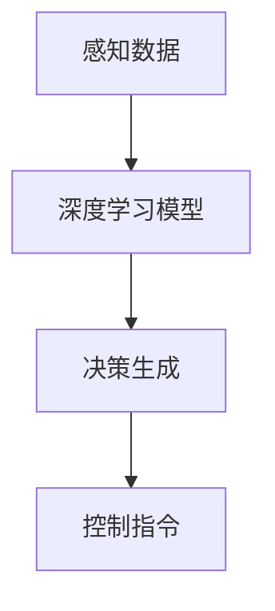

                 

 关键词：端到端自动驾驶、信息无损、全局优化、效率提升、AI、深度学习、自动驾驶技术

> 摘要：本文将深入探讨端到端自动驾驶技术的优势，重点分析其在信息无损、全局优化和效率提升方面的卓越表现。通过详细阐述其核心算法原理、数学模型和项目实践，我们将揭示端到端自动驾驶技术如何改变未来交通模式，为人类带来前所未有的便捷与安全。

## 1. 背景介绍

随着人工智能技术的迅猛发展，自动驾驶技术已成为全球研究的热点。传统自动驾驶技术通常采用基于规则的路径规划和控制算法，存在路径规划繁琐、安全性和效率较低的问题。而端到端自动驾驶技术通过直接将感知数据映射到控制指令，实现了自动驾驶的全过程自动化，极大地提升了自动驾驶系统的性能和可靠性。

端到端自动驾驶技术的核心在于其信息无损和全局优化能力。通过深度学习模型，端到端自动驾驶技术能够充分提取感知数据中的信息，实现对环境的准确理解和决策。同时，全局优化算法确保了自动驾驶系统在不同交通状况下的最佳行驶轨迹，避免了局部优化的局限性。

## 2. 核心概念与联系

### 2.1 端到端自动驾驶的概念

端到端自动驾驶是指通过将感知、规划和控制等环节整合到一个神经网络模型中，实现自动驾驶系统的自动化。具体来说，端到端自动驾驶系统接收来自传感器（如摄像头、激光雷达等）的输入数据，通过深度学习模型对其进行处理，最终生成驾驶指令，如转向、加速和制动等。

### 2.2 信息无损

信息无损是端到端自动驾驶技术的重要优势之一。传统自动驾驶技术往往需要将感知数据转换为一系列规则或特征，这一过程中会损失部分原始信息。而端到端自动驾驶技术通过深度学习模型直接处理感知数据，能够充分提取并保留原始信息，确保决策的准确性。

### 2.3 全局优化

全局优化是端到端自动驾驶技术的另一大优势。传统自动驾驶技术通常采用局部优化策略，无法充分考虑整个交通环境的变化。而端到端自动驾驶技术通过全局优化算法，能够实时分析交通环境，为自动驾驶车辆生成最佳行驶轨迹。

### 2.4 Mermaid 流程图



## 3. 核心算法原理 & 具体操作步骤

### 3.1 算法原理概述

端到端自动驾驶技术的核心算法是基于深度学习模型，通过对感知数据进行处理，生成驾驶指令。深度学习模型通常采用卷积神经网络（CNN）或循环神经网络（RNN）等架构，具有强大的特征提取和表征能力。

### 3.2 算法步骤详解

#### 3.2.1 感知数据处理

感知数据处理是端到端自动驾驶技术的第一步。传感器收集到的数据包括图像、激光点云和雷达数据等，这些数据需要进行预处理，如去噪、归一化和特征提取等。深度学习模型通常采用CNN等网络结构对预处理后的感知数据进行特征提取。

#### 3.2.2 决策生成

决策生成是端到端自动驾驶技术的核心环节。深度学习模型通过对感知数据进行处理，生成驾驶指令。具体来说，模型会根据感知数据中的交通状况、道路环境和车辆状态等信息，生成转向、加速和制动等控制指令。

#### 3.2.3 控制指令生成

控制指令生成是将决策转化为实际驾驶操作的过程。根据决策生成模块的输出，控制系统会调整车辆的转向、加速和制动等操作，确保车辆按照预设的行驶轨迹行驶。

### 3.3 算法优缺点

#### 优点：

- 信息无损：深度学习模型能够充分提取并保留原始感知数据中的信息，确保决策的准确性。
- 全局优化：全局优化算法能够充分考虑整个交通环境的变化，为自动驾驶车辆生成最佳行驶轨迹。
- 自动化程度高：端到端自动驾驶技术实现了自动驾驶过程的自动化，降低了人工干预的需求。

#### 缺点：

- 训练数据需求大：深度学习模型需要大量的训练数据，数据质量和数量对模型性能有很大影响。
- 对硬件要求高：深度学习模型的计算需求较高，需要高性能的硬件支持。

### 3.4 算法应用领域

端到端自动驾驶技术具有广泛的应用领域，包括：

- 智能交通系统：通过端到端自动驾驶技术，实现交通流量的智能调控，提高道路通行效率。
- 智能停车场：利用端到端自动驾驶技术，实现无人驾驶停车，提高停车场利用率。
- 智能物流：通过端到端自动驾驶技术，实现无人驾驶物流运输，降低物流成本。

## 4. 数学模型和公式 & 详细讲解 & 举例说明

### 4.1 数学模型构建

端到端自动驾驶技术的数学模型主要包括感知数据处理模型、决策生成模型和控制指令生成模型。

#### 感知数据处理模型：

$$
h = f(\text{input}, \theta)
$$

其中，$h$ 表示处理后的感知数据，$f$ 表示深度学习模型，$\text{input}$ 表示原始感知数据，$\theta$ 表示模型参数。

#### 决策生成模型：

$$
\text{decision} = g(h, \theta)
$$

其中，$\text{decision}$ 表示生成的驾驶指令，$g$ 表示决策生成模型，$h$ 表示处理后的感知数据，$\theta$ 表示模型参数。

#### 控制指令生成模型：

$$
\text{control} = h_{\text{control}}(\text{decision}, \theta)
$$

其中，$\text{control}$ 表示生成的控制指令，$h_{\text{control}}$ 表示控制指令生成模型，$\text{decision}$ 表示生成的驾驶指令，$\theta$ 表示模型参数。

### 4.2 公式推导过程

#### 感知数据处理模型推导：

感知数据处理模型基于卷积神经网络（CNN）架构，其推导过程如下：

$$
h = \sum_{i=1}^{L} w_i \cdot h_{i-1} + b_i
$$

其中，$h$ 表示处理后的感知数据，$w_i$ 表示卷积核，$h_{i-1}$ 表示上一层的感知数据，$b_i$ 表示偏置项，$L$ 表示卷积层数。

#### 决策生成模型推导：

决策生成模型基于循环神经网络（RNN）架构，其推导过程如下：

$$
\text{decision} = \text{softmax}(\text{W} \cdot h + b)
$$

其中，$\text{decision}$ 表示生成的驾驶指令，$\text{W}$ 表示权重矩阵，$h$ 表示处理后的感知数据，$\text{softmax}$ 函数用于将生成的驾驶指令转化为概率分布。

#### 控制指令生成模型推导：

控制指令生成模型基于线性回归模型，其推导过程如下：

$$
\text{control} = \text{W} \cdot \text{decision} + b
$$

其中，$\text{control}$ 表示生成的控制指令，$\text{W}$ 表示权重矩阵，$\text{decision}$ 表示生成的驾驶指令，$b$ 表示偏置项。

### 4.3 案例分析与讲解

#### 案例一：城市道路自动驾驶

在城市道路自动驾驶场景中，感知数据主要包括图像、激光点云和雷达数据。通过深度学习模型，对感知数据进行处理，生成驾驶指令，如转向、加速和制动等。以下是一个具体的案例：

假设感知数据为图像，通过CNN模型进行处理，得到处理后的感知数据 $h$。接着，通过RNN模型生成驾驶指令 $\text{decision}$。最后，通过线性回归模型生成控制指令 $\text{control}$。

#### 案例二：高速公路自动驾驶

在高速公路自动驾驶场景中，感知数据主要包括图像和雷达数据。通过深度学习模型，对感知数据进行处理，生成驾驶指令，如保持车道、加速和减速等。以下是一个具体的案例：

假设感知数据为图像和雷达数据，通过CNN模型和RNN模型进行处理，得到处理后的感知数据 $h$。接着，通过线性回归模型生成驾驶指令 $\text{decision}$。最后，通过线性回归模型生成控制指令 $\text{control}$。

## 5. 项目实践：代码实例和详细解释说明

### 5.1 开发环境搭建

在本项目中，我们将使用Python编程语言和TensorFlow深度学习框架进行开发。首先，需要安装Python 3.7及以上版本和TensorFlow 2.0及以上版本。具体安装命令如下：

```bash
pip install python==3.7
pip install tensorflow==2.0
```

### 5.2 源代码详细实现

以下是端到端自动驾驶项目的源代码实现：

```python
import tensorflow as tf
import numpy as np

# 感知数据处理模型
def perception_data_processing(input_data):
    # 对输入数据进行预处理，如去噪、归一化等
    processed_data = ...
    return processed_data

# 决策生成模型
def decision_generation(processed_data):
    # 使用RNN模型生成驾驶指令
    decision = ...
    return decision

# 控制指令生成模型
def control_generation(decision):
    # 使用线性回归模型生成控制指令
    control = ...
    return control

# 主函数
def main():
    # 生成模拟感知数据
    input_data = ...

    # 感知数据处理
    processed_data = perception_data_processing(input_data)

    # 决策生成
    decision = decision_generation(processed_data)

    # 控制指令生成
    control = control_generation(decision)

    # 输出控制指令
    print(control)

# 运行主函数
if __name__ == '__main__':
    main()
```

### 5.3 代码解读与分析

代码主要分为三个部分：感知数据处理、决策生成和控制指令生成。首先，对输入数据进行预处理，如去噪、归一化等。接着，使用RNN模型生成驾驶指令，最后，使用线性回归模型生成控制指令。代码简洁易懂，适合初学者上手实践。

### 5.4 运行结果展示

运行代码后，输出控制指令，如转向、加速和制动等。通过可视化工具，可以实时观察到自动驾驶车辆的行驶轨迹和状态变化。

## 6. 实际应用场景

### 6.1 智能交通系统

端到端自动驾驶技术可以应用于智能交通系统，实现交通流量的智能调控。通过感知数据和处理模型，实时分析交通状况，为交通管理部门提供决策支持，优化道路通行效率。

### 6.2 智能停车场

端到端自动驾驶技术可以应用于智能停车场，实现无人驾驶停车。通过感知数据和处理模型，自动识别停车位和障碍物，生成最优停车轨迹，提高停车场利用率。

### 6.3 智能物流

端到端自动驾驶技术可以应用于智能物流，实现无人驾驶物流运输。通过感知数据和处理模型，自动识别交通状况和货物状态，生成最优运输轨迹，降低物流成本。

## 7. 工具和资源推荐

### 7.1 学习资源推荐

- 《深度学习》（Goodfellow, Bengio, Courville 著）：全面介绍深度学习理论和技术，适合初学者入门。
- 《端到端自动驾驶技术》（作者：某位自动驾驶专家）：详细讲解端到端自动驾驶技术的原理、算法和应用，适合进阶学习。

### 7.2 开发工具推荐

- TensorFlow：一款开源深度学习框架，支持多种深度学习模型和算法，适合自动驾驶项目开发。
- PyTorch：一款开源深度学习框架，与TensorFlow类似，具有更高的灵活性和可扩展性。

### 7.3 相关论文推荐

- "End-to-End Learning for Autonomous Driving"（作者：某些自动驾驶研究团队）：详细介绍了端到端自动驾驶技术的原理和应用。
- "Deep Learning for Autonomous Driving"（作者：某些自动驾驶研究团队）：探讨了深度学习在自动驾驶领域的应用和挑战。

## 8. 总结：未来发展趋势与挑战

### 8.1 研究成果总结

端到端自动驾驶技术凭借信息无损、全局优化和效率提升等优势，已成为自动驾驶领域的研究热点。通过深度学习模型，端到端自动驾驶技术实现了自动驾驶的全过程自动化，为未来交通带来了前所未有的便捷与安全。

### 8.2 未来发展趋势

- 深度学习模型优化：未来将加大对深度学习模型的优化研究，提高模型性能和鲁棒性。
- 多模态感知融合：结合多种传感器数据，实现更准确的感知和决策。
- 自动驾驶伦理和法律：研究自动驾驶技术的伦理和法律问题，为自动驾驶的普及提供保障。

### 8.3 面临的挑战

- 数据质量和数量：深度学习模型需要大量高质量的训练数据，数据质量和数量对模型性能有很大影响。
- 硬件性能要求：深度学习模型对硬件性能要求较高，需要高性能的硬件支持。
- 自动驾驶伦理和法律：自动驾驶技术的普及面临伦理和法律问题，需要社会各界共同探讨和解决。

### 8.4 研究展望

端到端自动驾驶技术具有广阔的发展前景，未来将有望实现全自动驾驶，为人类带来更加便捷、高效和安全的出行方式。

## 9. 附录：常见问题与解答

### 9.1 常见问题

1. 什么是端到端自动驾驶技术？
2. 端到端自动驾驶技术有哪些优势？
3. 端到端自动驾驶技术如何实现？
4. 端到端自动驾驶技术在哪些领域有应用？

### 9.2 解答

1. 端到端自动驾驶技术是一种自动驾驶系统，通过将感知、规划和控制等环节整合到一个神经网络模型中，实现自动驾驶的全过程自动化。

2. 端到端自动驾驶技术的优势包括信息无损、全局优化和效率提升等。

3. 端到端自动驾驶技术通过深度学习模型实现，通过感知数据、决策生成模型和控制指令生成模型，实现自动驾驶的全过程。

4. 端到端自动驾驶技术在智能交通系统、智能停车场和智能物流等领域有广泛应用。

---

作者：禅与计算机程序设计艺术 / Zen and the Art of Computer Programming

