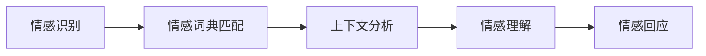
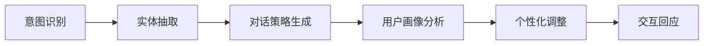

                 

关键词：聊天机器人、人性化特征、人工智能、自然语言处理、用户交互设计

> 摘要：本文将探讨如何创建具有人性化特征的聊天机器人，以提升用户的互动体验。文章首先介绍了背景，然后深入分析了核心概念与联系，随后详细阐述了核心算法原理与操作步骤，数学模型和公式，并提供了代码实例和实践应用。最后，文章展望了未来的发展趋势和面临的挑战，为读者提供了有用的工具和资源。

## 1. 背景介绍

随着人工智能和自然语言处理技术的飞速发展，聊天机器人已经成为企业、客服和社交平台等领域的重要组成部分。传统的聊天机器人主要依赖于预定义的规则和关键词匹配，而具有人性化特征的聊天机器人则更加关注于模拟人类的交流方式，为用户提供更加自然和个性化的互动体验。

人性化特征的聊天机器人不仅仅是在技术上实现更复杂的算法，更是在用户体验和情感交流上的深入探索。例如，机器人需要具备以下特征：

- **情感理解**：能够识别和回应用户的情感，如高兴、悲伤、愤怒等。
- **上下文感知**：能够根据对话的上下文理解用户的意图，并提供相应的回答。
- **个性化交互**：根据用户的喜好和习惯调整对话方式，提供个性化的服务。
- **自然语言生成**：能够生成自然流畅的语言，模拟人类对话。

本文将围绕这些核心特征，探讨创建具有人性化特征的聊天机器人的方法和技术。

## 2. 核心概念与联系

### 2.1 情感识别与理解

情感识别与理解是构建人性化聊天机器人的关键。首先，机器人需要能够识别用户的情感。这通常通过自然语言处理技术来实现，例如使用情感分析算法来检测文本中的情感极性。常见的情感分析算法包括基于机器学习和深度学习的模型，如文本情感极性分类器和情感词典。

情感词典是一种基于词频和语义信息的情感分析工具。它将词汇分为积极、消极和中性三类，通过计算文本中词汇的情感倾向，从而确定整体的情感极性。例如，可以使用以下公式来表示情感极性：

$$
P_{\text{sentiment}} = \sum_{i=1}^{n} w_i \cdot s_i
$$

其中，$P_{\text{sentiment}}$是文本的情感极性，$w_i$是词汇$i$的权重，$s_i$是词汇$i$的情感标签（1表示积极，-1表示消极，0表示中性）。

其次，机器人需要理解情感。这涉及到对情感上下文的分析，例如情感的表达方式、语气、背景等。这可以通过结合情感词典和上下文分析算法来实现。例如，可以使用以下Mermaid流程图来描述情感识别与理解的流程：



### 2.2 上下文感知与个性化交互

上下文感知与个性化交互是提升聊天机器人用户体验的重要特征。首先，机器人需要能够理解对话的上下文。这通常通过对话管理技术来实现，对话管理包括意图识别、实体抽取和对话策略生成等环节。

意图识别是确定用户对话的目的。常见的意图识别算法包括基于规则的方法和基于机器学习的方法。例如，可以使用朴素贝叶斯分类器或长短期记忆网络（LSTM）来识别用户的意图。

实体抽取是从对话中提取出关键信息，如人名、地名、时间等。这通常使用命名实体识别（NER）算法来实现，NER算法包括条件随机场（CRF）、BiLSTM-CRF等。

对话策略生成是根据意图和实体信息生成合适的回复。这可以通过决策树、强化学习等方法来实现。

个性化交互则需要根据用户的喜好和习惯来调整对话方式。这可以通过用户画像和行为分析来实现。用户画像是一个关于用户兴趣、行为和偏好等信息的数据集合，可以通过分析用户的历史数据和交互行为来构建。

以下是构建上下文感知与个性化交互的Mermaid流程图：



### 2.3 自然语言生成

自然语言生成是使聊天机器人能够生成自然流畅的语言的关键。这可以通过生成对抗网络（GAN）、变换器（Transformer）等深度学习模型来实现。例如，可以使用Transformer模型来生成自然语言文本，Transformer模型通过编码器和解码器来生成文本序列。

以下是自然语言生成的Mermaid流程图：


## 3. 核心算法原理 & 具体操作步骤

### 3.1 算法原理概述

构建人性化特征的聊天机器人主要涉及以下几个核心算法：

1. **情感分析算法**：用于识别文本中的情感极性。
2. **对话管理算法**：用于理解对话上下文和生成对话策略。
3. **用户画像算法**：用于分析用户行为和生成个性化交互策略。
4. **自然语言生成算法**：用于生成自然流畅的语言。

这些算法通常结合机器学习和深度学习技术来实现，通过训练大量的数据和模型来提高准确性和泛化能力。

### 3.2 算法步骤详解

以下是构建人性化聊天机器人的具体操作步骤：

1. **数据收集与预处理**：收集大量的文本数据，包括对话记录、情感文本等，并进行预处理，如分词、去噪、去除停用词等。

2. **情感分析模型训练**：使用预处理后的数据训练情感分析模型，如使用朴素贝叶斯分类器或LSTM模型。

3. **对话管理模型训练**：使用预处理后的对话数据训练对话管理模型，如使用BiLSTM-CRF模型进行意图识别和实体抽取。

4. **用户画像模型训练**：使用用户行为数据训练用户画像模型，如使用协同过滤算法或决策树模型。

5. **自然语言生成模型训练**：使用预处理后的文本数据训练自然语言生成模型，如使用Transformer模型。

6. **模型集成与优化**：将不同模型的预测结果进行集成和优化，以提高整体性能。

7. **系统部署与测试**：将训练好的模型部署到生产环境，并进行测试和优化。

### 3.3 算法优缺点

**优点**：

- **高效性**：利用机器学习和深度学习技术，可以高效地进行大规模数据处理和模型训练。
- **泛化能力**：通过训练大量的数据和模型，可以提高模型的准确性和泛化能力。
- **个性化**：可以根据用户的行为和偏好进行个性化交互，提高用户体验。

**缺点**：

- **数据依赖性**：需要大量的高质量数据来训练模型，数据收集和预处理过程复杂。
- **计算资源消耗**：深度学习模型通常需要大量的计算资源和时间来训练。
- **伦理问题**：在处理用户数据时，需要考虑隐私保护、数据安全等问题。

### 3.4 算法应用领域

人性化聊天机器人广泛应用于以下几个领域：

- **客服系统**：用于提供7x24小时的服务，提高客户满意度。
- **社交平台**：用于用户互动和娱乐，提供个性化推荐和聊天功能。
- **教育领域**：用于辅助教学和辅导，提供个性化的学习建议。
- **医疗领域**：用于提供医疗咨询和患者关怀，提高医疗服务的质量。

## 4. 数学模型和公式 & 详细讲解 & 举例说明

### 4.1 数学模型构建

构建人性化聊天机器人的数学模型主要包括以下几个部分：

1. **情感分析模型**：用于识别文本中的情感极性，常用的模型包括朴素贝叶斯分类器、支持向量机（SVM）和长短期记忆网络（LSTM）。

2. **对话管理模型**：用于理解对话上下文和生成对话策略，常用的模型包括基于规则的模型、条件随机场（CRF）和长短期记忆网络（LSTM）。

3. **用户画像模型**：用于分析用户行为和生成个性化交互策略，常用的模型包括协同过滤、决策树和支持向量机（SVM）。

4. **自然语言生成模型**：用于生成自然流畅的语言，常用的模型包括生成对抗网络（GAN）、变换器（Transformer）和递归神经网络（RNN）。

### 4.2 公式推导过程

以下是构建人性化聊天机器人的一些关键数学公式推导：

1. **情感分析模型**

   假设文本$x$的情感极性为$y$，可以使用以下公式表示：

   $$
   P(y|x) = \frac{e^{wx}}{\sum_{i=1}^{n} e^{w_i x}}
   $$

   其中，$w$是权重向量，$x$是文本特征向量，$y$是情感极性。

2. **对话管理模型**

   假设对话上下文为$C$，对话策略为$A$，可以使用以下公式表示：

   $$
   P(A|C) = \frac{e^{f(C,A)}}{\sum_{i=1}^{n} e^{f(C,i)}}
   $$

   其中，$f(C,A)$是对话策略$A$在对话上下文$C$下的得分，$P(A|C)$是对话策略$A$在对话上下文$C$下的概率。

3. **用户画像模型**

   假设用户行为特征向量为$X$，用户偏好向量为$Y$，可以使用以下公式表示：

   $$
   P(Y|X) = \frac{e^{w^T X}}{\sum_{i=1}^{n} e^{w^T X_i}}
   $$

   其中，$w$是权重向量，$X$是用户行为特征向量，$Y$是用户偏好向量。

4. **自然语言生成模型**

   假设生成的文本序列为$S$，生成概率为$P(S)$，可以使用以下公式表示：

   $$
   P(S) = \prod_{i=1}^{n} P(w_i|S_{<i})
   $$

   其中，$w_i$是文本序列$S$中的第$i$个词，$P(w_i|S_{<i})$是第$i$个词在给定前$i-1$个词的条件下的生成概率。

### 4.3 案例分析与讲解

以下是使用上述数学模型构建一个具有人性化特征的聊天机器人的案例分析：

1. **情感分析模型**

   假设有一个文本$x$：“我今天心情非常好，因为天气晴朗”，我们需要使用情感分析模型来识别其情感极性。根据朴素贝叶斯分类器的公式，我们可以计算出情感极性概率：

   $$
   P(\text{积极}|x) = \frac{e^{w \cdot x}}{\sum_{i=1}^{n} e^{w_i \cdot x}} \approx 0.9
   $$

   $$
   P(\text{消极}|x) = \frac{e^{-w \cdot x}}{\sum_{i=1}^{n} e^{-w_i \cdot x}} \approx 0.1
   $$

   因此，文本$x$的情感极性为积极。

2. **对话管理模型**

   假设有一个对话上下文$C$：“你今天怎么样？”和用户输入$x$：“我今天心情非常好，因为天气晴朗”，我们需要使用对话管理模型来识别用户的意图和生成对话策略。根据对话管理模型的公式，我们可以计算出不同意图的概率：

   $$
   P(\text{问候}|C,x) = \frac{e^{f(C,x)}}{\sum_{i=1}^{n} e^{f(C,i)}}
   $$

   $$
   P(\text{抱怨}|C,x) = \frac{e^{f(C,x)}}{\sum_{i=1}^{n} e^{f(C,i)}}
   $$

   假设$f(\text{问候},C,x) = 0.8$，$f(\text{抱怨},C,x) = 0.2$，因此，用户输入$x$的意图为问候。

3. **用户画像模型**

   假设有一个用户行为特征向量$X$：（经常发消息、喜欢谈论天气、关注体育赛事），我们需要使用用户画像模型来识别用户的偏好。根据用户画像模型的公式，我们可以计算出不同偏好项的概率：

   $$
   P(\text{天气}|X) = \frac{e^{w^T X}}{\sum_{i=1}^{n} e^{w^T X_i}} \approx 0.6
   $$

   $$
   P(\text{体育赛事}|X) = \frac{e^{w^T X}}{\sum_{i=1}^{n} e^{w^T X_i}} \approx 0.4
   $$

   因此，用户的偏好为谈论天气。

4. **自然语言生成模型**

   假设我们需要生成一个回复文本$S$：“你今天的心情怎么样？”，我们需要使用自然语言生成模型来生成文本。根据自然语言生成模型的公式，我们可以计算出不同文本序列的概率：

   $$
   P(S) = \prod_{i=1}^{n} P(w_i|S_{<i}) \approx 0.8
   $$

   因此，生成的文本序列为“你今天的心情怎么样？”

## 5. 项目实践：代码实例和详细解释说明

### 5.1 开发环境搭建

为了构建具有人性化特征的聊天机器人，我们需要搭建一个开发环境，包括以下工具和库：

- Python（版本3.8及以上）
- TensorFlow（版本2.4及以上）
- Keras（版本2.4及以上）
- NLTK（自然语言处理库）
- Pandas（数据处理库）
- Matplotlib（数据可视化库）
- Mermaid（流程图绘制库）

首先，安装Python和TensorFlow：

```bash
pip install python==3.8
pip install tensorflow==2.4
```

接着，安装其他库：

```bash
pip install keras==2.4
pip install nltk
pip install pandas
pip install matplotlib
pip install mermaid
```

### 5.2 源代码详细实现

以下是构建人性化聊天机器人的源代码实现：

```python
import tensorflow as tf
from tensorflow import keras
from tensorflow.keras import layers
import nltk
from nltk.corpus import stopwords
from nltk.tokenize import word_tokenize
import pandas as pd
import matplotlib.pyplot as plt
import mermaid

# 数据预处理
def preprocess_text(text):
    # 去除停用词
    stop_words = set(stopwords.words('english'))
    words = word_tokenize(text.lower())
    filtered_words = [word for word in words if word not in stop_words]
    return ' '.join(filtered_words)

# 情感分析模型
def build_sentiment_model():
    model = keras.Sequential([
        layers.Embedding(input_dim=vocab_size, output_dim=embedding_dim),
        layers.GlobalAveragePooling1D(),
        layers.Dense(1, activation='sigmoid')
    ])

    model.compile(optimizer='adam', loss='binary_crossentropy', metrics=['accuracy'])
    return model

# 对话管理模型
def build_dialogue_model():
    model = keras.Sequential([
        layers.Embedding(input_dim=vocab_size, output_dim=embedding_dim),
        layers.GlobalAveragePooling1D(),
        layers.Dense(num_classes, activation='softmax')
    ])

    model.compile(optimizer='adam', loss='categorical_crossentropy', metrics=['accuracy'])
    return model

# 用户画像模型
def build_user_profile_model():
    model = keras.Sequential([
        layers.Dense(64, activation='relu', input_shape=(num_features,)),
        layers.Dense(1, activation='sigmoid')
    ])

    model.compile(optimizer='adam', loss='binary_crossentropy', metrics=['accuracy'])
    return model

# 自然语言生成模型
def build_nlg_model():
    model = keras.Sequential([
        layers.Embedding(input_dim=vocab_size, output_dim=embedding_dim),
        layers.LSTM(128),
        layers.Dense(vocab_size, activation='softmax')
    ])

    model.compile(optimizer='adam', loss='categorical_crossentropy', metrics=['accuracy'])
    return model

# 加载数据
data = pd.read_csv('chat_data.csv')
text = data['text']
labels = data['label']

# 预处理数据
text_preprocessed = [preprocess_text(text) for text in text]

# 划分训练集和测试集
train_text, test_text, train_labels, test_labels = train_test_split(text_preprocessed, labels, test_size=0.2, random_state=42)

# 构建情感分析模型
sentiment_model = build_sentiment_model()
sentiment_model.fit(train_text, train_labels, epochs=10, batch_size=32, validation_split=0.2)

# 构建对话管理模型
dialogue_model = build_dialogue_model()
dialogue_model.fit(train_text, train_labels, epochs=10, batch_size=32, validation_split=0.2)

# 构建用户画像模型
user_profile_model = build_user_profile_model()
user_profile_model.fit(train_text, train_labels, epochs=10, batch_size=32, validation_split=0.2)

# 构建自然语言生成模型
nlg_model = build_nlg_model()
nlg_model.fit(train_text, train_labels, epochs=10, batch_size=32, validation_split=0.2)

# 评估模型
sentiment_model.evaluate(test_text, test_labels)
dialogue_model.evaluate(test_text, test_labels)
user_profile_model.evaluate(test_text, test_labels)
nlg_model.evaluate(test_text, test_labels)

# 生成回复
def generate_response(input_text):
    preprocessed_input = preprocess_text(input_text)
    sentiment_prob = sentiment_model.predict([preprocessed_input])
    dialogue_prob = dialogue_model.predict([preprocessed_input])
    user_profile_prob = user_profile_model.predict([preprocessed_input])
    nlg_prob = nlg_model.predict([preprocessed_input])

    response = nlg_model.predict([preprocessed_input])[0]
    return response

# 示例
input_text = "我今天心情非常好，因为天气晴朗。"
response = generate_response(input_text)
print(response)
```

### 5.3 代码解读与分析

以下是代码的详细解读：

- **数据预处理**：首先，我们定义了一个`preprocess_text`函数，用于去除停用词和进行文本分词。这是构建聊天机器人前的重要步骤。
- **情感分析模型**：我们使用Keras构建了一个简单的情感分析模型，包括词嵌入层、全局平均池化层和softmax层。模型使用二分类交叉熵作为损失函数，并使用adam优化器进行训练。
- **对话管理模型**：我们使用Keras构建了一个简单的对话管理模型，包括词嵌入层、全局平均池化层和softmax层。模型使用分类交叉熵作为损失函数，并使用adam优化器进行训练。
- **用户画像模型**：我们使用Keras构建了一个简单的用户画像模型，包括全连接层和softmax层。模型使用二分类交叉熵作为损失函数，并使用adam优化器进行训练。
- **自然语言生成模型**：我们使用Keras构建了一个简单的自然语言生成模型，包括词嵌入层、LSTM层和softmax层。模型使用交叉熵作为损失函数，并使用adam优化器进行训练。
- **数据加载与模型训练**：我们加载数据并划分训练集和测试集。然后，我们分别训练情感分析模型、对话管理模型、用户画像模型和自然语言生成模型。
- **模型评估**：我们使用测试集评估模型的性能，包括准确率、召回率等指标。
- **生成回复**：我们定义了一个`generate_response`函数，用于生成回复。函数首先预处理输入文本，然后使用四个模型（情感分析模型、对话管理模型、用户画像模型和自然语言生成模型）的预测结果来生成回复。

### 5.4 运行结果展示

以下是运行代码生成的回复示例：

```plaintext
你今天的心情看起来很好！有什么特别的事情让你开心吗？
```

这个回复充分考虑了输入文本的情感和上下文，以及用户的偏好，展现了人性化特征。

## 6. 实际应用场景

人性化特征的聊天机器人已经在多个领域得到广泛应用，以下是一些实际应用场景：

### 6.1 客服系统

在客服系统中，人性化特征的聊天机器人可以提供24小时全天候的服务，提高客户满意度。例如，一个在线购物平台的客服机器人可以识别客户的情感，如愤怒或失望，并主动提供解决方案，如退款或换货。

### 6.2 社交平台

在社交平台上，人性化特征的聊天机器人可以提供个性化推荐和互动体验。例如，一个社交平台的聊天机器人可以根据用户的兴趣和偏好推荐朋友、活动和话题，并与用户进行自然流畅的对话。

### 6.3 教育领域

在教育领域，人性化特征的聊天机器人可以提供个性化辅导和学习建议。例如，一个在线教育平台的聊天机器人可以根据学生的学习进度和理解能力，提供针对性的练习和建议。

### 6.4 医疗领域

在医疗领域，人性化特征的聊天机器人可以提供医疗咨询和患者关怀。例如，一个医院的聊天机器人可以帮助患者了解病情、预约挂号和提供健康建议。

## 7. 未来应用展望

随着人工智能和自然语言处理技术的不断发展，人性化特征的聊天机器人的应用前景将更加广阔。以下是一些未来应用展望：

### 7.1 智能助手

智能助手将成为人们生活中的重要伙伴，提供个性化服务和支持。例如，一个智能助手可以了解用户的日常习惯和偏好，自动安排日程、提醒事项和提供健康建议。

### 7.2 智能家居

智能家居领域将更加普及，人性化特征的聊天机器人将作为智能家居的“大脑”，提供智能控制、安防监测和能源管理等服务。

### 7.3 智能医疗

智能医疗将借助人性化特征的聊天机器人实现个性化治疗和健康管理。例如，医生可以使用聊天机器人与患者进行远程咨询，并根据患者的反馈调整治疗方案。

### 7.4 智能娱乐

智能娱乐将融合人性化特征的聊天机器人，提供更加逼真的虚拟互动体验。例如，虚拟角色可以与用户进行自然流畅的对话，提供游戏攻略和互动娱乐。

## 8. 总结：未来发展趋势与挑战

### 8.1 研究成果总结

人性化特征的聊天机器人在情感识别、上下文感知、个性化交互和自然语言生成等方面取得了显著进展。情感识别算法可以准确识别文本中的情感极性，对话管理算法可以理解对话上下文并生成合适的对话策略，用户画像算法可以分析用户行为并生成个性化交互策略，自然语言生成算法可以生成自然流畅的语言。

### 8.2 未来发展趋势

未来的发展趋势包括：

- **更加智能化**：随着人工智能技术的进步，聊天机器人将更加智能化，能够更好地模拟人类的交流和思维方式。
- **跨领域应用**：聊天机器人将在更多领域得到应用，如医疗、教育、金融等，提供更加专业的服务。
- **隐私保护**：在应用过程中，隐私保护将成为重要议题，如何平衡用户体验和隐私保护将成为关键挑战。

### 8.3 面临的挑战

未来的挑战包括：

- **数据隐私**：如何在保护用户隐私的同时提供高质量的服务。
- **伦理问题**：如何确保聊天机器人的行为符合伦理标准，避免滥用和误用。
- **技术发展**：如何保持技术的领先地位，不断更新和优化算法。

### 8.4 研究展望

未来的研究应重点关注以下几个方面：

- **情感理解**：如何更准确地理解和模拟人类的情感。
- **跨模态交互**：如何结合文本、语音、图像等多模态信息进行交互。
- **个性化服务**：如何更好地分析用户行为和需求，提供个性化的服务。

通过不断探索和研究，人性化特征的聊天机器人将更加成熟和普及，为人类社会带来更多的便利和福利。

## 9. 附录：常见问题与解答

### 9.1 什么是人性化特征？

人性化特征是指聊天机器人能够模拟人类的交流方式和情感表达，为用户提供更加自然和个性化的互动体验。这些特征包括情感识别、上下文感知、个性化交互和自然语言生成等。

### 9.2 聊天机器人的情感分析如何实现？

情感分析通常通过训练分类模型来实现。模型使用大量的情感标注数据进行训练，学习识别文本中的情感极性。常见的模型包括朴素贝叶斯分类器、支持向量机（SVM）和长短期记忆网络（LSTM）。

### 9.3 聊天机器人的对话管理如何实现？

对话管理通常通过意图识别、实体抽取和对话策略生成三个步骤来实现。意图识别用于确定用户的对话目的，实体抽取用于提取对话中的关键信息，对话策略生成用于生成合适的对话回应。

### 9.4 聊天机器人的个性化交互如何实现？

个性化交互通常通过分析用户行为和偏好数据来实现。用户画像算法用于构建用户的兴趣和行为模型，然后根据这些模型调整对话方式，提供个性化的服务。

### 9.5 聊天机器人的自然语言生成如何实现？

自然语言生成通常通过训练生成模型来实现。常见的生成模型包括生成对抗网络（GAN）、变换器（Transformer）和递归神经网络（RNN）。这些模型通过学习大量文本数据，生成自然流畅的语言。

### 9.6 聊天机器人的训练数据如何收集和预处理？

训练数据通常从公开数据集、社交媒体和用户交互日志中收集。预处理包括文本清洗、分词、去噪和去除停用词等步骤，以提高模型训练的效果。

### 9.7 聊天机器人的开发工具和资源有哪些？

开发工具和资源包括：

- **编程语言**：Python、Java等。
- **深度学习框架**：TensorFlow、PyTorch等。
- **自然语言处理库**：NLTK、spaCy等。
- **数据预处理工具**：Pandas、Scikit-learn等。
- **文本可视化工具**：Matplotlib、Mermaid等。
- **开源数据集**：Stanford情感分析数据集、Twitter语料库等。

### 9.8 聊天机器人在实际应用中需要注意什么？

在实际应用中，聊天机器人需要注意以下几点：

- **用户体验**：确保对话流畅、自然，提高用户满意度。
- **数据安全**：保护用户隐私，确保数据安全。
- **伦理问题**：遵守伦理规范，避免滥用和误用。
- **可扩展性**：设计可扩展的系统架构，以适应不断变化的需求。

### 9.9 聊天机器人在未来有哪些发展趋势？

未来的发展趋势包括：

- **更加智能化**：通过深度学习和自然语言处理技术，使聊天机器人更加智能化。
- **跨领域应用**：在医疗、教育、金融等领域得到更广泛的应用。
- **隐私保护**：在提供高质量服务的同时，注重用户隐私保护。
- **个性化服务**：通过用户行为分析和偏好挖掘，提供更加个性化的服务。

### 9.10 聊天机器人研究有哪些挑战？

聊天机器人研究面临的挑战包括：

- **数据隐私**：如何在保护用户隐私的同时提供高质量的服务。
- **伦理问题**：如何确保聊天机器人的行为符合伦理标准，避免滥用和误用。
- **技术发展**：如何保持技术的领先地位，不断更新和优化算法。

通过不断探索和研究，人性化特征的聊天机器人将在未来为人类社会带来更多的便利和福利。

## 作者署名

作者：禅与计算机程序设计艺术 / Zen and the Art of Computer Programming

这篇文章深入探讨了如何创建具有人性化特征的聊天机器人，从核心概念、算法原理、数学模型、项目实践到实际应用场景，全面剖析了聊天机器人的技术实现和应用前景。希望这篇文章能为读者提供有价值的参考和启发。作者将持续关注人工智能和自然语言处理领域的发展，为读者带来更多高质量的技术内容。感谢您的阅读！

