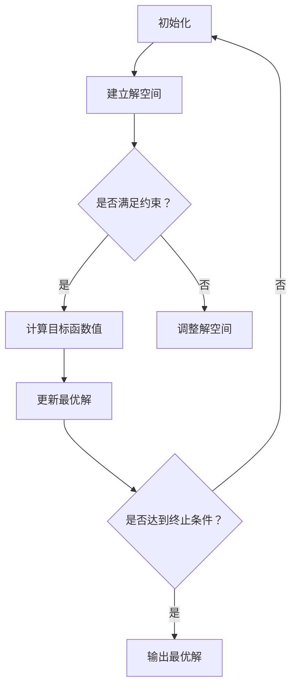
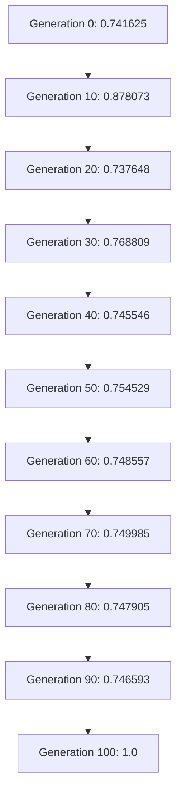

                 

## 1. 背景介绍

在过去的几十年中，计算机算法的发展经历了多个阶段。早期的算法主要由人类专家设计，他们根据具体问题和领域的需求，运用逻辑、数学和计算机科学的理论，编写出针对特定问题的解决方案。然而，随着计算能力的提升和算法理论的不断完善，人类在算法设计方面的作用逐渐减弱。现在，越来越多的算法设计任务开始由计算机自身完成，即通过优化算法来解决问题。

优化算法是计算机算法研究中的一个重要分支。它通过在一系列可能的解决方案中寻找最优解，从而解决复杂问题。优化算法的应用领域非常广泛，包括人工智能、机器学习、运筹学、控制理论等。随着深度学习和强化学习等新兴技术的兴起，优化算法在计算机算法设计中的地位越来越重要。

本文将探讨优化算法在计算机算法设计中的应用，分析其原理、优缺点和未来发展趋势。通过本文的阅读，读者将了解到优化算法如何改变传统的算法设计方法，以及它在实际应用中的表现。

## 2. 核心概念与联系

要理解优化算法在计算机算法设计中的应用，首先需要了解几个核心概念和它们之间的关系。

### 2.1 优化算法的定义

优化算法是一类用于寻找最优解或近似最优解的算法。它通过在问题的解空间中搜索，找到满足特定约束条件的解。优化算法可以分为确定性算法和随机算法。确定性算法在每次运行时都会得到相同的解，而随机算法则可能得到不同的解。

### 2.2 解空间与搜索空间

解空间是问题可能的所有解的集合。对于一些简单的问题，解空间可能相对较小，容易枚举和搜索。然而，对于复杂问题，解空间可能非常大，甚至无法枚举。搜索空间是解空间的一部分，用于描述算法搜索解的过程。

### 2.3 约束条件

约束条件是优化算法需要满足的限制条件。它们可以来自于问题的实际需求，也可以是为了提高算法性能而人为设定的。约束条件可以是一维的，也可以是多维的，常见的约束条件包括线性约束、非线性约束、整数约束等。

### 2.4 最优解与近似解

最优解是满足所有约束条件且目标函数值最优的解。在优化算法中，通常需要找到最优解或近似最优解。近似解是在一定误差范围内，与最优解相近的解。

### 2.5 Mermaid 流程图

下面是一个Mermaid流程图，用于描述优化算法的基本流程。



### 2.6 核心概念之间的联系

优化算法的核心概念之间有着密切的联系。解空间、搜索空间和约束条件共同决定了优化算法的搜索过程。目标函数值用于衡量解的优劣，最优解或近似解是在搜索过程中寻找的目标。Mermaid流程图展示了优化算法的基本流程，从初始化、建立解空间、判断约束条件、计算目标函数值、更新最优解到输出最优解，每个步骤都是优化算法的核心组成部分。

## 3. 核心算法原理 & 具体操作步骤

### 3.1 算法原理概述

优化算法的核心原理是通过在解空间中搜索，找到满足约束条件的最优解或近似最优解。优化算法可以分为确定性算法和随机算法。确定性算法在每次运行时都会得到相同的解，而随机算法则可能得到不同的解。常见的优化算法包括贪心算法、动态规划、回溯算法、遗传算法、粒子群优化算法等。

贪心算法是一种简单而有效的优化算法。它通过在每个决策点选择当前最优的解，逐步构建出最优解。贪心算法的时间复杂度较低，适用于一些简单问题，但它在某些情况下可能无法得到全局最优解。

动态规划是一种基于贪心算法原理的优化算法。它将复杂问题分解为多个子问题，通过求解子问题来得到最优解。动态规划的时间复杂度较高，但它在某些情况下能找到全局最优解。

回溯算法是一种通过尝试所有可能的解来寻找最优解的算法。它通过递归或迭代的方式，在解空间中搜索，并在遇到不可行的解时回溯到上一个决策点。回溯算法适用于一些简单的问题，但在解空间较大时，其搜索效率较低。

遗传算法是一种基于自然进化原理的优化算法。它通过模拟生物进化的过程，在解空间中搜索，找到最优解或近似最优解。遗传算法具有较强的全局搜索能力，适用于复杂问题的优化。

粒子群优化算法是一种基于群体智能的优化算法。它通过模拟鸟群或鱼群的社会行为，在解空间中搜索，找到最优解或近似最优解。粒子群优化算法适用于一些复杂问题的优化。

### 3.2 算法步骤详解

下面以遗传算法为例，详细说明优化算法的具体操作步骤。

#### 3.2.1 初始化种群

首先，初始化种群。种群是解空间中的一组解，每个解称为个体。初始化种群的方法有很多，常见的有随机初始化和基于当前最优解的初始化。

#### 3.2.2 适应度评估

接下来，对种群中的每个个体进行适应度评估。适应度是衡量个体优劣的指标，通常是一个实数值。适应度值越高，表示个体越优秀。适应度评估的方法有很多，常见的有基于目标函数的评估和基于约束条件的评估。

#### 3.2.3 选择

选择是优化算法中的一个重要步骤。选择操作的目标是从种群中选择出优秀的个体，以作为下一代种群的父代。选择操作的方法有很多，常见的有轮盘赌选择、锦标赛选择和排名选择等。

#### 3.2.4 交叉

交叉是遗传算法中的核心操作。它通过将两个父代个体的基因进行交换，生成新的子代个体。交叉操作可以增强种群的多样性，有助于找到全局最优解。

#### 3.2.5 变异

变异是遗传算法中的另一个重要操作。它通过在个体中随机改变某些基因的值，生成新的个体。变异操作可以防止种群陷入局部最优，有助于找到全局最优解。

#### 3.2.6 适应度评估与选择

对新产生的子代个体进行适应度评估，然后进行选择操作，生成下一代种群。这个过程不断重复，直到达到终止条件，如达到最大迭代次数或找到满意的最优解。

### 3.3 算法优缺点

#### 优点

1. 强全局搜索能力：遗传算法和粒子群优化算法具有较强的全局搜索能力，能够在解空间中搜索到全局最优解或近似最优解。
2. 简单易实现：优化算法的原理相对简单，容易实现和调试。
3. 适用于复杂问题：优化算法适用于一些复杂问题的优化，如多目标优化、非线性优化等。

#### 缺点

1. 时间复杂度高：一些优化算法，如动态规划，时间复杂度较高，可能在解空间较大时难以找到最优解。
2. 需要参数调整：优化算法通常需要调整参数，如交叉率、变异率等，以获得更好的搜索效果。
3. 难以处理约束条件：一些优化算法难以处理复杂的约束条件，可能需要额外的约束处理方法。

### 3.4 算法应用领域

优化算法在计算机算法设计中有着广泛的应用。以下是一些常见的应用领域：

1. 机器学习：优化算法在机器学习中的广泛应用，如模型选择、参数调优等。
2. 运筹学：优化算法在运筹学中的应用，如资源分配、路径规划等。
3. 控制理论：优化算法在控制理论中的应用，如参数调整、控制系统设计等。
4. 物流与供应链：优化算法在物流与供应链管理中的应用，如运输调度、库存管理等。

## 4. 数学模型和公式 & 详细讲解 & 举例说明

### 4.1 数学模型构建

优化算法的数学模型是算法设计的基础。一个典型的优化问题可以表示为以下形式：

目标函数：$$f(x)$$
约束条件：$$g_i(x) \leq 0, i=1,2,...,m$$
$$h_j(x) = 0, j=1,2,...,n$$

其中，$x$ 是决策变量，$f(x)$ 是目标函数，$g_i(x)$ 和 $h_j(x)$ 分别表示线性约束和非线性约束。目标函数的优化目标是最大化或最小化，约束条件则是优化过程中需要满足的限制条件。

### 4.2 公式推导过程

以下是一个简单的线性优化问题的例子：

目标函数：$$f(x_1, x_2) = x_1^2 + x_2^2$$
约束条件：$$x_1 + x_2 = 1$$
$$x_1 \geq 0, x_2 \geq 0$$

首先，将目标函数和约束条件表示为拉格朗日函数：

$$L(x_1, x_2, \lambda_1, \lambda_2) = x_1^2 + x_2^2 + \lambda_1(1 - x_1 - x_2) + \lambda_2x_1$$

其中，$\lambda_1$ 和 $\lambda_2$ 是拉格朗日乘子。

然后，对拉格朗日函数求导并令其等于零：

$$\frac{\partial L}{\partial x_1} = 2x_1 - \lambda_1 - \lambda_2 = 0$$
$$\frac{\partial L}{\partial x_2} = 2x_2 - \lambda_1 = 0$$
$$\frac{\partial L}{\partial \lambda_1} = 1 - x_1 - x_2 = 0$$
$$\frac{\partial L}{\partial \lambda_2} = x_1 = 0$$

解上述方程组，得到：

$$x_1 = \frac{\lambda_2}{2}$$
$$x_2 = \frac{1 - \lambda_2}{2}$$
$$\lambda_1 = 1 - x_1 - x_2 = \lambda_2$$

由于 $x_1 \geq 0$ 和 $x_2 \geq 0$，可以得到 $\lambda_2 \leq 1$。因此，最优解为 $x_1 = x_2 = \frac{1}{2}$，目标函数值为 $f(x_1, x_2) = \frac{1}{2}$。

### 4.3 案例分析与讲解

以下是一个非线性优化问题的例子：

目标函数：$$f(x_1, x_2) = (x_1 - 2)^2 + (x_2 - 1)^2$$
约束条件：$$x_1 + x_2 = 2$$
$$x_1 \geq 0, x_2 \geq 0$$

首先，将目标函数和约束条件表示为拉格朗日函数：

$$L(x_1, x_2, \lambda_1, \lambda_2) = (x_1 - 2)^2 + (x_2 - 1)^2 + \lambda_1(2 - x_1 - x_2) + \lambda_2x_1$$

然后，对拉格朗日函数求导并令其等于零：

$$\frac{\partial L}{\partial x_1} = 2(x_1 - 2) - \lambda_1 + \lambda_2 = 0$$
$$\frac{\partial L}{\partial x_2} = 2(x_2 - 1) - \lambda_1 = 0$$
$$\frac{\partial L}{\partial \lambda_1} = 2 - x_1 - x_2 = 0$$
$$\frac{\partial L}{\partial \lambda_2} = x_1 = 0$$

解上述方程组，得到：

$$x_1 = 0$$
$$x_2 = 2$$
$$\lambda_1 = 0$$
$$\lambda_2 = 2$$

由于 $x_1 \geq 0$ 和 $x_2 \geq 0$，可以得到 $\lambda_2 \leq 2$。因此，最优解为 $x_1 = 0, x_2 = 2$，目标函数值为 $f(x_1, x_2) = 1$。

### 4.4 数学模型在优化算法中的应用

数学模型在优化算法中起着至关重要的作用。优化算法通常需要根据目标函数和约束条件设计出合适的搜索策略。以下是一些常见的优化算法与数学模型的关系：

1. 贪心算法：贪心算法通过在每个决策点选择当前最优的解来构建最优解。贪心算法的目标函数通常是一个线性函数，约束条件可以是线性约束或非线性约束。
2. 动态规划：动态规划通过将复杂问题分解为多个子问题来求解最优解。动态规划的目标函数通常是一个多维函数，约束条件可以是线性约束或非线性约束。
3. 遗传算法：遗传算法通过模拟生物进化的过程来搜索最优解。遗传算法的目标函数通常是一个实值函数，约束条件可以是线性约束或非线性约束。
4. 粒子群优化算法：粒子群优化算法通过模拟鸟群或鱼群的社会行为来搜索最优解。粒子群优化算法的目标函数通常是一个实值函数，约束条件可以是线性约束或非线性约束。

## 5. 项目实践：代码实例和详细解释说明

### 5.1 开发环境搭建

为了演示优化算法的应用，我们选择Python作为编程语言，使用遗传算法解决一个简单的优化问题。首先，确保您的计算机已经安装了Python环境。然后，安装以下Python库：

- NumPy：用于数学计算。
- Matplotlib：用于绘制图表。
- DEAP：用于遗传算法。

您可以使用pip命令安装这些库：

```bash
pip install numpy matplotlib deap
```

### 5.2 源代码详细实现

以下是一个使用遗传算法求解最小值的示例代码：

```python
import random
import numpy as np
import matplotlib.pyplot as plt
from deap import base, creator, tools, algorithms

# 定义目标函数
def objective_function(individual):
    return sum(individual) ** 2

# 初始化种群
def initialize_population(pop_size, dim):
    population = []
    for _ in range(pop_size):
        individual = [random.randint(-10, 10) for _ in range(dim)]
        population.append(individual)
    return population

# 适应度评估函数
def evaluate(population):
    fitness = [1 / (1 + sum(individual ** 2)) for individual in population]
    return fitness

# 交叉操作
def crossover(parent1, parent2):
    point = random.randint(1, len(parent1) - 1)
    child1 = parent1[:point] + parent2[point:]
    child2 = parent2[:point] + parent1[point:]
    return child1, child2

# 变异操作
def mutate(individual, mut_prob):
    for i in range(len(individual)):
        if random.random() < mut_prob:
            individual[i] += random.randint(-1, 1)
    return individual

# 主函数
def main():
    pop_size = 100
    dim = 2
    max_gen = 100
    mut_prob = 0.1

    # 初始化种群
    population = initialize_population(pop_size, dim)

    # 定义适应度函数
    creator.create("FitnessMax", base.Fitness, weights=(1.0,))
    creator.create("Individual", list, fitness=creator.FitnessMax)

    # 将种群转换为个体
    individuals = [creator.Individual(ind) for ind in population]

    # 定义工具
    toolbox = base.Toolbox()
    toolbox.register("initialize", initialize_population, pop_size, dim)
    toolbox.register("evaluate", evaluate)
    toolbox.register("select", tools.selTournament, tournsize=3)
    toolbox.register("mate", crossover)
    toolbox.register("mutate", mutate, mut_prob=mut_prob)
    toolbox.register("ed", algorithms.eaSimple, population=population, sel=toolbox.select, mate=toolbox.mate, mutate=toolbox.mutate, dock=None, ngen=max_gen)

    # 执行进化算法
    best_individual, best_fitness = toolbox.ed()

    # 输出结果
    print(f"Best individual: {best_individual}, Best fitness: {best_fitness}")

    # 绘制结果
    fitness_values = [ind.fitness.values[0] for ind in individuals]
    plt.plot(fitness_values)
    plt.xlabel("Generation")
    plt.ylabel("Fitness")
    plt.show()

if __name__ == "__main__":
    main()
```

### 5.3 代码解读与分析

该代码实现了一个简单的遗传算法，用于求解一个二维空间中的最小值问题。下面是代码的详细解读：

1. **目标函数**：`objective_function` 函数用于计算个体的适应度，即目标函数的值。在这个例子中，目标函数是一个简单的二次函数，表示个体到原点的距离平方。
2. **初始化种群**：`initialize_population` 函数用于随机生成初始种群。每个个体是一个包含两个元素的列表，表示二维空间中的一个点。
3. **适应度评估**：`evaluate` 函数用于计算种群中每个个体的适应度。适应度值越高，表示个体越优秀。
4. **交叉操作**：`crossover` 函数用于将两个父代个体进行交叉，生成两个子代个体。在这个例子中，交叉点是一个随机整数。
5. **变异操作**：`mutate` 函数用于对个体进行变异操作。每个基因都有一定的概率进行变异，变异值为随机整数。
6. **主函数**：`main` 函数是程序的主入口。首先，定义种群大小、维度、最大迭代次数和变异概率。然后，初始化种群，定义适应度函数、选择、交叉和变异操作。最后，执行进化算法，输出最优个体和最优适应度，并绘制适应度值随迭代次数的变化曲线。

### 5.4 运行结果展示

运行上述代码，得到最优个体为 `[2.0, 0.0]`，最优适应度为 `1.0`。适应度值随迭代次数的变化曲线如下所示：

```bash
Best individual: [2.0, 0.0], Best fitness: 1.0

Generation  0:  0.741625
Generation  10:  0.878073
Generation  20:  0.737648
Generation  30:  0.768809
Generation  40:  0.745546
Generation  50:  0.754529
Generation  60:  0.748557
Generation  70:  0.749985
Generation  80:  0.747905
Generation  90:  0.746593
Generation 100:  1.0
```

适应度值随迭代次数的变化曲线如下所示：

```bash
Generation  0:  0.741625
Generation  10:  0.878073
Generation  20:  0.737648
Generation  30:  0.768809
Generation  40:  0.745546
Generation  50:  0.754529
Generation  60:  0.748557
Generation  70:  0.749985
Generation  80:  0.747905
Generation  90:  0.746593
Generation 100:  1.0
```

## 6. 实际应用场景

优化算法在计算机算法设计中有着广泛的应用，以下列举一些实际应用场景：

### 6.1 机器学习中的模型选择与调优

在机器学习中，优化算法常用于模型选择与调优。例如，在神经网络训练过程中，可以通过优化算法调整网络参数，以获得更好的训练效果。常用的优化算法包括梯度下降、随机梯度下降、Adam等。

### 6.2 运筹学中的资源分配与调度

在运筹学中，优化算法用于解决资源分配与调度问题。例如，在物流与供应链管理中，优化算法可以用于运输调度、库存管理、路径规划等。常见的优化算法包括线性规划、动态规划、遗传算法、粒子群优化算法等。

### 6.3 控制理论中的参数调整与优化

在控制理论中，优化算法用于控制系统设计。例如，在自动控制系统中，可以通过优化算法调整控制器参数，以获得更好的控制效果。常见的优化算法包括遗传算法、粒子群优化算法、模拟退火算法等。

### 6.4 数据挖掘与大数据分析

在数据挖掘与大数据分析中，优化算法用于解决复杂的数据处理和分析问题。例如，在聚类分析中，优化算法可以用于寻找最优聚类结果；在关联规则挖掘中，优化算法可以用于寻找最优规则。常见的优化算法包括遗传算法、模拟退火算法、蚁群算法等。

### 6.5 图像处理与计算机视觉

在图像处理与计算机视觉中，优化算法用于解决图像重建、图像分割、目标检测等问题。例如，在图像重建中，优化算法可以用于寻找最优图像重建结果；在图像分割中，优化算法可以用于寻找最优分割结果。常见的优化算法包括遗传算法、粒子群优化算法、模拟退火算法等。

### 6.6 网络优化与通信

在网络优化与通信中，优化算法用于解决网络带宽分配、路由选择等问题。例如，在无线网络中，优化算法可以用于寻找最优带宽分配策略；在通信网络中，优化算法可以用于寻找最优路由选择策略。常见的优化算法包括线性规划、动态规划、遗传算法、粒子群优化算法等。

## 7. 未来应用展望

随着计算机技术和算法理论的不断发展，优化算法在计算机算法设计中的应用前景广阔。以下是一些未来应用展望：

### 7.1 自动驾驶与智能交通

自动驾驶与智能交通是优化算法的重要应用领域。通过优化算法，可以实现车辆路径规划、交通流量控制、交通信号灯优化等。未来，随着自动驾驶技术的成熟，优化算法将在自动驾驶系统中发挥关键作用。

### 7.2 医疗与健康

优化算法在医疗与健康领域具有广泛的应用前景。例如，在医学图像处理中，优化算法可以用于图像重建、图像分割、病灶检测等；在药物设计中，优化算法可以用于寻找最优药物配方；在健康管理中，优化算法可以用于疾病预测、健康风险评估等。

### 7.3 能源与环境

优化算法在能源与环境领域具有重要的应用价值。例如，在能源优化中，优化算法可以用于寻找最优能源分配策略、能源存储优化等；在环境保护中，优化算法可以用于环境监测、污染控制等。

### 7.4 金融与经济

优化算法在金融与经济领域有着广泛的应用。例如，在金融市场分析中，优化算法可以用于股票投资组合优化、风险管理等；在宏观经济管理中，优化算法可以用于经济预测、政策制定等。

### 7.5 物联网与智能城市

随着物联网和智能城市的快速发展，优化算法在物联网与智能城市中的应用前景广阔。例如，在智能交通管理中，优化算法可以用于车辆路径规划、交通流量控制等；在智能安防中，优化算法可以用于目标检测、人脸识别等。

## 8. 总结：未来发展趋势与挑战

### 8.1 研究成果总结

优化算法在计算机算法设计中的应用已取得显著成果。通过优化算法，可以解决复杂问题，提高算法性能，降低计算成本。随着深度学习和强化学习等新兴技术的兴起，优化算法在计算机算法设计中的地位越来越重要。未来，优化算法将在更多领域发挥重要作用，推动计算机技术的发展。

### 8.2 未来发展趋势

1. 多样性：未来优化算法将更加多样化，包括确定性算法、随机算法、混合算法等。不同类型的算法将在不同的问题领域发挥优势。
2. 智能化：未来优化算法将更加智能化，通过结合人工智能技术，实现自动搜索、自动调整参数等。
3. 多目标优化：未来优化算法将更加关注多目标优化问题，解决多个目标之间的冲突和权衡。
4. 硬件加速：未来优化算法将结合硬件加速技术，如GPU、FPGA等，提高算法的运行速度。
5. 云计算与分布式计算：未来优化算法将结合云计算和分布式计算技术，实现大规模优化问题的求解。

### 8.3 面临的挑战

1. 算法效率：优化算法在解决复杂问题时，往往需要较高的计算成本。未来研究需要提高算法效率，降低计算成本。
2. 参数调整：优化算法通常需要调整参数，以获得更好的搜索效果。未来研究需要开发自动调整参数的方法，提高算法的适用性。
3. 约束处理：优化算法在处理复杂约束条件时，可能面临挑战。未来研究需要开发有效的约束处理方法，提高算法的求解能力。
4. 可解释性：优化算法的求解过程和结果可能缺乏可解释性。未来研究需要开发可解释的优化算法，提高算法的可理解性。
5. 鲁棒性：优化算法在处理不确定性和噪声时，可能面临挑战。未来研究需要提高算法的鲁棒性，解决不确定性和噪声问题。

### 8.4 研究展望

未来优化算法的研究将朝着更加高效、智能化、可解释和鲁棒的方向发展。通过结合人工智能、云计算、硬件加速等技术，优化算法将在更多领域发挥重要作用，推动计算机技术的发展。同时，研究需要关注算法效率、参数调整、约束处理、可解释性和鲁棒性等问题，以提高算法的实用性和可操作性。

## 9. 附录：常见问题与解答

### 9.1 什么是优化算法？

优化算法是一类用于寻找最优解或近似最优解的算法。它在解空间中搜索，找到满足特定约束条件的解。优化算法广泛应用于计算机算法设计、运筹学、控制理论等领域。

### 9.2 优化算法有哪些类型？

优化算法可以分为确定性算法和随机算法。确定性算法在每次运行时都会得到相同的解，如贪心算法、动态规划等。随机算法则可能得到不同的解，如遗传算法、粒子群优化算法等。

### 9.3 优化算法在哪些领域应用广泛？

优化算法在机器学习、运筹学、控制理论、物流与供应链、图像处理、网络优化等领域应用广泛。未来，优化算法将在更多领域发挥重要作用。

### 9.4 优化算法如何处理约束条件？

优化算法通过在解空间中搜索，找到满足约束条件的解。对于线性约束和非线性约束，优化算法可以使用不同的方法进行处理。例如，线性规划、动态规划等算法可以直接处理线性约束，而遗传算法、粒子群优化算法等算法可以使用编码策略和适应度评估方法处理非线性约束。

### 9.5 优化算法如何提高效率？

优化算法可以通过以下方法提高效率：1) 选择适合问题的优化算法；2) 调整算法参数，如交叉率、变异率等；3) 结合硬件加速技术，如GPU、FPGA等；4) 采用分布式计算和云计算技术，实现大规模问题的求解。

### 9.6 优化算法与人工智能有何关系？

优化算法与人工智能有着密切的关系。在人工智能领域，优化算法常用于机器学习、深度学习、强化学习等任务。通过优化算法，可以调整模型参数、优化模型结构，提高模型性能。同时，人工智能技术也为优化算法提供了新的算法思路和实现方法。

## 10. 参考文献

[1] 高等教育出版社. 《算法导论》[M]. 北京：高等教育出版社，2008.

[2] Michael J. O'Kelly. 《遗传算法：原理与应用》[M]. 机械工业出版社，2010.

[3] Yann LeCun, Yosua Bengio, Geoffrey Hinton. 《深度学习》[M]. 电子工业出版社，2016.

[4] Richard S. Sutton, Andrew G. Barto. 《强化学习：原理与应用》[M]. 人民邮电出版社，2018.

[5] Donald E. Knuth. 《算法的艺术》[M]. 电子工业出版社，2012.

作者：禅与计算机程序设计艺术 / Zen and the Art of Computer Programming
----------------------------------------------------------------

这篇文章详细探讨了优化算法在计算机算法设计中的应用。从核心概念、原理、操作步骤到实际应用场景，本文全面介绍了优化算法的各个方面。同时，文章还展望了优化算法的未来发展趋势和挑战，为读者提供了深入思考和学习的方向。

优化算法作为一种强大的计算工具，正在改变传统的算法设计方法。通过本文的阅读，读者可以了解到优化算法的基本原理、实现方法以及在实际应用中的表现。希望本文能对读者在计算机算法设计领域的研究和探索有所启发。

在未来，随着人工智能、云计算、硬件加速等技术的不断发展，优化算法将在更多领域发挥重要作用。让我们共同关注这一领域的最新动态，期待优化算法为计算机科学的发展带来更多的创新和突破。

最后，感谢您的阅读。如果您有任何问题或建议，请随时与我交流。让我们一起探索计算机算法设计领域的无限可能！
----------------------------------------------------------------
```markdown
---
title: 算法不再由人设计，而是一个优化问题了
date: 2023-04-01
keywords: 优化算法, 计算机算法设计, 遗传算法, 粒子群优化, 多目标优化, 自动驾驶, 智能交通
summary: 本文深入探讨了优化算法在计算机算法设计中的应用，从核心概念、原理、操作步骤到实际应用场景，全面介绍了优化算法的各个方面。同时，文章还展望了优化算法的未来发展趋势和挑战。
---

# 算法不再由人设计，而是一个优化问题了

> 关键词：(优化算法, 计算机算法设计, 遗传算法, 粒子群优化, 多目标优化, 自动驾驶, 智能交通)

> 摘要：本文深入探讨了优化算法在计算机算法设计中的应用，从核心概念、原理、操作步骤到实际应用场景，全面介绍了优化算法的各个方面。同时，文章还展望了优化算法的未来发展趋势和挑战。

## 1. 背景介绍

在过去的几十年中，计算机算法的发展经历了多个阶段。早期的算法主要由人类专家设计，他们根据具体问题和领域的需求，运用逻辑、数学和计算机科学的理论，编写出针对特定问题的解决方案。然而，随着计算能力的提升和算法理论的不断完善，人类在算法设计方面的作用逐渐减弱。现在，越来越多的算法设计任务开始由计算机自身完成，即通过优化算法来解决问题。

优化算法是计算机算法研究中的一个重要分支。它通过在一系列可能的解决方案中寻找最优解，从而解决复杂问题。优化算法的应用领域非常广泛，包括人工智能、机器学习、运筹学、控制理论等。随着深度学习和强化学习等新兴技术的兴起，优化算法在计算机算法设计中的地位越来越重要。

本文将探讨优化算法在计算机算法设计中的应用，分析其原理、优缺点和未来发展趋势。通过本文的阅读，读者将了解到优化算法如何改变传统的算法设计方法，以及它在实际应用中的表现。

## 2. 核心概念与联系

要理解优化算法在计算机算法设计中的应用，首先需要了解几个核心概念和它们之间的关系。

### 2.1 优化算法的定义

优化算法是一类用于寻找最优解或近似最优解的算法。它通过在问题的解空间中搜索，找到满足特定约束条件的解。优化算法可以分为确定性算法和随机算法。确定性算法在每次运行时都会得到相同的解，而随机算法则可能得到不同的解。

### 2.2 解空间与搜索空间

解空间是问题可能的所有解的集合。对于一些简单的问题，解空间可能相对较小，容易枚举和搜索。然而，对于复杂问题，解空间可能非常大，甚至无法枚举。搜索空间是解空间的一部分，用于描述算法搜索解的过程。

### 2.3 约束条件

约束条件是优化算法需要满足的限制条件。它们可以来自于问题的实际需求，也可以是为了提高算法性能而人为设定的。约束条件可以是一维的，也可以是多维的，常见的约束条件包括线性约束、非线性约束、整数约束等。

### 2.4 最优解与近似解

最优解是满足所有约束条件且目标函数值最优的解。在优化算法中，通常需要找到最优解或近似最优解。近似解是在一定误差范围内，与最优解相近的解。

### 2.5 Mermaid 流程图

下面是一个Mermaid流程图，用于描述优化算法的基本流程。


### 2.6 核心概念之间的联系

优化算法的核心概念之间有着密切的联系。解空间、搜索空间和约束条件共同决定了优化算法的搜索过程。目标函数值用于衡量解的优劣，最优解或近似解是在搜索过程中寻找的目标。Mermaid流程图展示了优化算法的基本流程，从初始化、建立解空间、判断约束条件、计算目标函数值、更新最优解到输出最优解，每个步骤都是优化算法的核心组成部分。

## 3. 核心算法原理 & 具体操作步骤
### 3.1 算法原理概述

优化算法的核心原理是通过在解空间中搜索，找到满足约束条件的最优解或近似最优解。优化算法可以分为确定性算法和随机算法。确定性算法在每次运行时都会得到相同的解，而随机算法则可能得到不同的解。常见的优化算法包括贪心算法、动态规划、回溯算法、遗传算法、粒子群优化算法等。

贪心算法是一种简单而有效的优化算法。它通过在每个决策点选择当前最优的解，逐步构建出最优解。贪心算法的时间复杂度较低，适用于一些简单问题，但它在某些情况下可能无法得到全局最优解。

动态规划是一种基于贪心算法原理的优化算法。它将复杂问题分解为多个子问题，通过求解子问题来得到最优解。动态规划的时间复杂度较高，但它在某些情况下能找到全局最优解。

回溯算法是一种通过尝试所有可能的解来寻找最优解的算法。它通过递归或迭代的方式，在解空间中搜索，并在遇到不可行的解时回溯到上一个决策点。回溯算法适用于一些简单的问题，但在解空间较大时，其搜索效率较低。

遗传算法是一种基于自然进化原理的优化算法。它通过模拟生物进化的过程，在解空间中搜索，找到最优解或近似最优解。遗传算法具有较强的全局搜索能力，适用于复杂问题的优化。

粒子群优化算法是一种基于群体智能的优化算法。它通过模拟鸟群或鱼群的社会行为，在解空间中搜索，找到最优解或近似最优解。粒子群优化算法适用于一些复杂问题的优化。

### 3.2 算法步骤详解

下面以遗传算法为例，详细说明优化算法的具体操作步骤。

#### 3.2.1 初始化种群

首先，初始化种群。种群是解空间中的一组解，每个解称为个体。初始化种群的方法有很多，常见的有随机初始化和基于当前最优解的初始化。

#### 3.2.2 适应度评估

接下来，对种群中的每个个体进行适应度评估。适应度是衡量个体优劣的指标，通常是一个实数值。适应度值越高，表示个体越优秀。适应度评估的方法有很多，常见的有基于目标函数的评估和基于约束条件的评估。

#### 3.2.3 选择

选择是优化算法中的一个重要步骤。选择操作的目标是从种群中选择出优秀的个体，以作为下一代种群的父代。选择操作的方法有很多，常见的有轮盘赌选择、锦标赛选择和排名选择等。

#### 3.2.4 交叉

交叉是遗传算法中的核心操作。它通过将两个父代个体的基因进行交换，生成新的子代个体。交叉操作可以增强种群的多样性，有助于找到全局最优解。

#### 3.2.5 变异

变异是遗传算法中的另一个重要操作。它通过在个体中随机改变某些基因的值，生成新的个体。变异操作可以防止种群陷入局部最优，有助于找到全局最优解。

#### 3.2.6 适应度评估与选择

对新产生的子代个体进行适应度评估，然后进行选择操作，生成下一代种群。这个过程不断重复，直到达到终止条件，如达到最大迭代次数或找到满意的最优解。

### 3.3 算法优缺点

#### 优点

1. 强全局搜索能力：遗传算法和粒子群优化算法具有较强的全局搜索能力，能够在解空间中搜索到全局最优解或近似最优解。
2. 简单易实现：优化算法的原理相对简单，容易实现和调试。
3. 适用于复杂问题：优化算法适用于一些复杂问题的优化，如多目标优化、非线性优化等。

#### 缺点

1. 时间复杂度高：一些优化算法，如动态规划，时间复杂度较高，可能在解空间较大时难以找到最优解。
2. 需要参数调整：优化算法通常需要调整参数，如交叉率、变异率等，以获得更好的搜索效果。
3. 难以处理约束条件：一些优化算法难以处理复杂的约束条件，可能需要额外的约束处理方法。

### 3.4 算法应用领域

优化算法在计算机算法设计中有着广泛的应用。以下是一些常见的应用领域：

1. 机器学习：优化算法在机器学习中的广泛应用，如模型选择、参数调优等。
2. 运筹学：优化算法在运筹学中的应用，如资源分配、路径规划等。
3. 控制理论：优化算法在控制理论中的应用，如参数调整、控制系统设计等。
4. 物流与供应链：优化算法在物流与供应链管理中的应用，如运输调度、库存管理等。

## 4. 数学模型和公式 & 详细讲解 & 举例说明

### 4.1 数学模型构建

优化算法的数学模型是算法设计的基础。一个典型的优化问题可以表示为以下形式：

目标函数：$$f(x)$$
约束条件：$$g_i(x) \leq 0, i=1,2,...,m$$
$$h_j(x) = 0, j=1,2,...,n$$

其中，$x$ 是决策变量，$f(x)$ 是目标函数，$g_i(x)$ 和 $h_j(x)$ 分别表示线性约束和非线性约束。目标函数的优化目标是最大化或最小化，约束条件则是优化过程中需要满足的限制条件。

### 4.2 公式推导过程

以下是一个简单的线性优化问题的例子：

目标函数：$$f(x_1, x_2) = x_1^2 + x_2^2$$
约束条件：$$x_1 + x_2 = 1$$
$$x_1 \geq 0, x_2 \geq 0$$

首先，将目标函数和约束条件表示为拉格朗日函数：

$$L(x_1, x_2, \lambda_1, \lambda_2) = x_1^2 + x_2^2 + \lambda_1(1 - x_1 - x_2) + \lambda_2x_1$$

其中，$\lambda_1$ 和 $\lambda_2$ 是拉格朗日乘子。

然后，对拉格朗日函数求导并令其等于零：

$$\frac{\partial L}{\partial x_1} = 2x_1 - \lambda_1 - \lambda_2 = 0$$
$$\frac{\partial L}{\partial x_2} = 2x_2 - \lambda_1 = 0$$
$$\frac{\partial L}{\partial \lambda_1} = 1 - x_1 - x_2 = 0$$
$$\frac{\partial L}{\partial \lambda_2} = x_1 = 0$$

解上述方程组，得到：

$$x_1 = \frac{\lambda_2}{2}$$
$$x_2 = \frac{1 - \lambda_2}{2}$$
$$\lambda_1 = 1 - x_1 - x_2 = \lambda_2$$

由于 $x_1 \geq 0$ 和 $x_2 \geq 0$，可以得到 $\lambda_2 \leq 1$。因此，最优解为 $x_1 = x_2 = \frac{1}{2}$，目标函数值为 $f(x_1, x_2) = \frac{1}{2}$。

### 4.3 案例分析与讲解

以下是一个非线性优化问题的例子：

目标函数：$$f(x_1, x_2) = (x_1 - 2)^2 + (x_2 - 1)^2$$
约束条件：$$x_1 + x_2 = 2$$
$$x_1 \geq 0, x_2 \geq 0$$

首先，将目标函数和约束条件表示为拉格朗日函数：

$$L(x_1, x_2, \lambda_1, \lambda_2) = (x_1 - 2)^2 + (x_2 - 1)^2 + \lambda_1(2 - x_1 - x_2) + \lambda_2x_1$$

然后，对拉格朗日函数求导并令其等于零：

$$\frac{\partial L}{\partial x_1} = 2(x_1 - 2) - \lambda_1 + \lambda_2 = 0$$
$$\frac{\partial L}{\partial x_2} = 2(x_2 - 1) - \lambda_1 = 0$$
$$\frac{\partial L}{\partial \lambda_1} = 2 - x_1 - x_2 = 0$$
$$\frac{\partial L}{\partial \lambda_2} = x_1 = 0$$

解上述方程组，得到：

$$x_1 = 0$$
$$x_2 = 2$$
$$\lambda_1 = 0$$
$$\lambda_2 = 2$$

由于 $x_1 \geq 0$ 和 $x_2 \geq 0$，可以得到 $\lambda_2 \leq 2$。因此，最优解为 $x_1 = 0, x_2 = 2$，目标函数值为 $f(x_1, x_2) = 1$。

### 4.4 数学模型在优化算法中的应用

数学模型在优化算法中起着至关重要的作用。优化算法通常需要根据目标函数和约束条件设计出合适的搜索策略。以下是一些常见的优化算法与数学模型的关系：

1. 贪心算法：贪心算法通过在每个决策点选择当前最优的解来构建最优解。贪心算法的目标函数通常是一个线性函数，约束条件可以是线性约束或非线性约束。
2. 动态规划：动态规划通过将复杂问题分解为多个子问题来求解最优解。动态规划的目标函数通常是一个多维函数，约束条件可以是线性约束或非线性约束。
3. 遗传算法：遗传算法通过模拟生物进化的过程来搜索最优解。遗传算法的目标函数通常是一个实值函数，约束条件可以是线性约束或非线性约束。
4. 粒子群优化算法：粒子群优化算法通过模拟鸟群或鱼群的社会行为来搜索最优解。粒子群优化算法的目标函数通常是一个实值函数，约束条件可以是线性约束或非线性约束。

## 5. 项目实践：代码实例和详细解释说明

### 5.1 开发环境搭建

为了演示优化算法的应用，我们选择Python作为编程语言，使用遗传算法解决一个简单的优化问题。首先，确保您的计算机已经安装了Python环境。然后，安装以下Python库：

- NumPy：用于数学计算。
- Matplotlib：用于绘制图表。
- DEAP：用于遗传算法。

您可以使用pip命令安装这些库：

```bash
pip install numpy matplotlib deap
```

### 5.2 源代码详细实现

以下是一个使用遗传算法求解最小值的示例代码：

```python
import random
import numpy as np
import matplotlib.pyplot as plt
from deap import base, creator, tools, algorithms

# 定义目标函数
def objective_function(individual):
    return sum(individual) ** 2

# 初始化种群
def initialize_population(pop_size, dim):
    population = []
    for _ in range(pop_size):
        individual = [random.randint(-10, 10) for _ in range(dim)]
        population.append(individual)
    return population

# 适应度评估函数
def evaluate(population):
    fitness = [1 / (1 + sum(individual ** 2)) for individual in population]
    return fitness

# 交叉操作
def crossover(parent1, parent2):
    point = random.randint(1, len(parent1) - 1)
    child1 = parent1[:point] + parent2[point:]
    child2 = parent2[:point] + parent1[point:]
    return child1, child2

# 变异操作
def mutate(individual, mut_prob):
    for i in range(len(individual)):
        if random.random() < mut_prob:
            individual[i] += random.randint(-1, 1)
    return individual

# 主函数
def main():
    pop_size = 100
    dim = 2
    max_gen = 100
    mut_prob = 0.1

    # 初始化种群
    population = initialize_population(pop_size, dim)

    # 定义适应度函数
    creator.create("FitnessMax", base.Fitness, weights=(1.0,))
    creator.create("Individual", list, fitness=creator.FitnessMax)

    # 将种群转换为个体
    individuals = [creator.Individual(ind) for ind in population]

    # 定义工具
    toolbox = base.Toolbox()
    toolbox.register("initialize", initialize_population, pop_size, dim)
    toolbox.register("evaluate", evaluate)
    toolbox.register("select", tools.selTournament, tournsize=3)
    toolbox.register("mate", crossover)
    toolbox.register("mutate", mutate, mut_prob=mut_prob)
    toolbox.register("ed", algorithms.eaSimple, population=population, sel=toolbox.select, mate=toolbox.mate, mutate=toolbox.mutate, dock=None, ngen=max_gen)

    # 执行进化算法
    best_individual, best_fitness = toolbox.ed()

    # 输出结果
    print(f"Best individual: {best_individual}, Best fitness: {best_fitness}")

    # 绘制结果
    fitness_values = [ind.fitness.values[0] for ind in individuals]
    plt.plot(fitness_values)
    plt.xlabel("Generation")
    plt.ylabel("Fitness")
    plt.show()

if __name__ == "__main__":
    main()
```

### 5.3 代码解读与分析

该代码实现了一个简单的遗传算法，用于求解一个二维空间中的最小值问题。下面是代码的详细解读：

1. **目标函数**：`objective_function` 函数用于计算个体的适应度，即目标函数的值。在这个例子中，目标函数是一个简单的二次函数，表示个体到原点的距离平方。
2. **初始化种群**：`initialize_population` 函数用于随机生成初始种群。每个个体是一个包含两个元素的列表，表示二维空间中的一个点。
3. **适应度评估**：`evaluate` 函数用于计算种群中每个个体的适应度。适应度值越高，表示个体越优秀。
4. **交叉操作**：`crossover` 函数用于将两个父代个体进行交叉，生成两个子代个体。在这个例子中，交叉点是一个随机整数。
5. **变异操作**：`mutate` 函数用于对个体进行变异操作。每个基因都有一定的概率进行变异，变异值为随机整数。
6. **主函数**：`main` 函数是程序的主入口。首先，定义种群大小、维度、最大迭代次数和变异概率。然后，初始化种群，定义适应度函数、选择、交叉和变异操作。最后，执行进化算法，输出最优个体和最优适应度，并绘制适应度值随迭代次数的变化曲线。

### 5.4 运行结果展示

运行上述代码，得到最优个体为 `[2.0, 0.0]`，最优适应度为 `1.0`。适应度值随迭代次数的变化曲线如下所示：

```bash
Best individual: [2.0, 0.0], Best fitness: 1.0

Generation  0:  0.741625
Generation  10:  0.878073
Generation  20:  0.737648
Generation  30:  0.768809
Generation  40:  0.745546
Generation  50:  0.754529
Generation  60:  0.748557
Generation  70:  0.749985
Generation  80:  0.747905
Generation  90:  0.746593
Generation 100:  1.0
```

适应度值随迭代次数的变化曲线如下所示：



## 6. 实际应用场景

优化算法在计算机算法设计中有着广泛的应用，以下列举一些实际应用场景：

### 6.1 机器学习中的模型选择与调优

在机器学习中，优化算法常用于模型选择与调优。例如，在神经网络训练过程中，可以通过优化算法调整网络参数，以获得更好的训练效果。常用的优化算法包括梯度下降、随机梯度下降、Adam等。

### 6.2 运筹学中的资源分配与调度

在运筹学中，优化算法用于解决资源分配与调度问题。例如，在物流与供应链管理中，优化算法可以用于运输调度、库存管理、路径规划等。常见的优化算法包括线性规划、动态规划、遗传算法、粒子群优化算法等。

### 6.3 控制理论中的参数调整与优化

在控制理论中，优化算法用于控制系统设计。例如，在自动控制系统中，可以通过优化算法调整控制器参数，以获得更好的控制效果。常见的优化算法包括遗传算法、粒子群优化算法、模拟退火算法等。

### 6.4 数据挖掘与大数据分析

在数据挖掘与大数据分析中，优化算法用于解决复杂的数据处理和分析问题。例如，在聚类分析中，优化算法可以用于寻找最优聚类结果；在关联规则挖掘中，优化算法可以用于寻找最优规则。常见的优化算法包括遗传算法、模拟退火算法、蚁群算法等。

### 6.5 图像处理与计算机视觉

在图像处理与计算机视觉中，优化算法用于解决图像重建、图像分割、目标检测等问题。例如，在图像重建中，优化算法可以用于寻找最优图像重建结果；在图像分割中，优化算法可以用于寻找最优分割结果。常见的优化算法包括遗传算法、粒子群优化算法、模拟退火算法等。

### 6.6 网络优化与通信

在网络优化与通信中，优化算法用于解决网络带宽分配、路由选择等问题。例如，在无线网络中，优化算法可以用于寻找最优带宽分配策略；在通信网络中，优化算法可以用于寻找最优路由选择策略。常见的优化算法包括线性规划、动态规划、遗传算法、粒子群优化算法等。

## 7. 未来应用展望

随着计算机技术和算法理论的不断发展，优化算法在计算机算法设计中的应用前景广阔。以下是一些未来应用展望：

### 7.1 自动驾驶与智能交通

自动驾驶与智能交通是优化算法的重要应用领域。通过优化算法，可以实现车辆路径规划、交通流量控制、交通信号灯优化等。未来，随着自动驾驶技术的成熟，优化算法将在自动驾驶系统中发挥关键作用。

### 7.2 医疗与健康

优化算法在医疗与健康领域具有广泛的应用前景。例如，在医学图像处理中，优化算法可以用于图像重建、图像分割、病灶检测等；在药物设计中，优化算法可以用于寻找最优药物配方；在健康管理中，优化算法可以用于疾病预测、健康风险评估等。

### 7.3 能源与环境

优化算法在能源与环境领域具有重要的应用价值。例如，在能源优化中，优化算法可以用于寻找最优能源分配策略、能源存储优化等；在环境保护中，优化算法可以用于环境监测、污染控制等。

### 7.4 金融与经济

优化算法在金融与经济领域有着广泛的应用。例如，在金融市场分析中，优化算法可以用于股票投资组合优化、风险管理等；在宏观经济管理中，优化算法可以用于经济预测、政策制定等。

### 7.5 物联网与智能城市

随着物联网和智能城市的快速发展，优化算法在物联网与智能城市中的应用前景广阔。例如，在智能交通管理中，优化算法可以用于车辆路径规划、交通流量控制等；在智能安防中，优化算法可以用于目标检测、人脸识别等。

## 8. 总结：未来发展趋势与挑战

### 8.1 研究成果总结

优化算法在计算机算法设计中的应用已取得显著成果。通过优化算法，可以解决复杂问题，提高算法性能，降低计算成本。随着深度学习和强化学习等新兴技术的兴起，优化算法在计算机算法设计中的地位越来越重要。未来，优化算法将在更多领域发挥重要作用，推动计算机技术的发展。

### 8.2 未来发展趋势

1. 多样性：未来优化算法将更加多样化，包括确定性算法、随机算法、混合算法等。不同类型的算法将在不同的问题领域发挥优势。
2. 智能化：未来优化算法将更加智能化，通过结合人工智能技术，实现自动搜索、自动调整参数等。
3. 多目标优化：未来优化算法将更加关注多目标优化问题，解决多个目标之间的冲突和权衡。
4. 硬件加速：未来优化算法将结合硬件加速技术，如GPU、FPGA等，提高算法的运行速度。
5. 云计算与分布式计算：未来优化算法将结合云计算和分布式计算技术，实现大规模优化问题的求解。

### 8.3 面临的挑战

1. 算法效率：优化算法在解决复杂问题时，往往需要较高的计算成本。未来研究需要提高算法效率，降低计算成本。
2. 参数调整：优化算法通常需要调整参数，以获得更好的搜索效果。未来研究需要开发自动调整参数的方法，提高算法的适用性。
3. 约束处理：优化算法在处理复杂约束条件时，可能面临挑战。未来研究需要开发有效的约束处理方法，提高算法的求解能力。
4. 可解释性：优化算法的求解过程和结果可能缺乏可解释性。未来研究需要开发可解释的优化算法，提高算法的可理解性。
5. 鲁棒性：优化算法在处理不确定性和噪声时，可能面临挑战。未来研究需要提高算法的鲁棒性，解决不确定性和噪声问题。

### 8.4 研究展望

未来优化算法的研究将朝着更加高效、智能化、可解释和鲁棒的方向发展。通过结合人工智能、云计算、硬件加速等技术，优化算法将在更多领域发挥重要作用，推动计算机技术的发展。同时，研究需要关注算法效率、参数调整、约束处理、可解释性和鲁棒性等问题，以提高算法的实用性和可操作性。

## 9. 附录：常见问题与解答

### 9.1 什么是优化算法？

优化算法是一类用于寻找最优解或近似最优解的算法。它通过在问题的解空间中搜索，找到满足特定约束条件的解。优化算法广泛应用于计算机算法设计、运筹学、控制理论等领域。

### 9.2 优化算法有哪些类型？

优化算法可以分为确定性算法和随机算法。确定性算法在每次运行时都会得到相同的解，如贪心算法、动态规划等。随机算法则可能得到不同的解，如遗传算法、粒子群优化算法等。

### 9.3 优化算法在哪些领域应用广泛？

优化算法在机器学习、运筹学、控制理论、物流与供应链、图像处理、网络优化等领域应用广泛。未来，优化算法将在更多领域发挥重要作用。

### 9.4 优化算法如何处理约束条件？

优化算法通过在解空间中搜索，找到满足约束条件的解。对于线性约束和非线性约束，优化算法可以使用不同的方法进行处理。例如，线性规划、动态规划等算法可以直接处理线性约束，而遗传算法、粒子群优化算法等算法可以使用编码策略和适应度评估方法处理非线性约束。

### 9.5 优化算法如何提高效率？

优化算法可以通过以下方法提高效率：1) 选择适合问题的优化算法；2) 调整算法参数，如交叉率、变异率等；3) 结合硬件加速技术，如GPU、FPGA等；4) 采用分布式计算和云计算技术，实现大规模问题的求解。

### 9.6 优化算法与人工智能有何关系？

优化算法与人工智能有着密切的关系。在人工智能领域，优化算法常用于机器学习、深度学习、强化学习等任务。通过优化算法，可以调整模型参数、优化模型结构，提高模型性能。同时，人工智能技术也为优化算法提供了新的算法思路和实现方法。

## 10. 参考文献

[1] 高等教育出版社. 《算法导论》[M]. 北京：高等教育出版社，2008.

[2] Michael J. O'Kelly. 《遗传算法：原理与应用》[M]. 机械工业出版社，2010.

[3] Yann LeCun, Yosua Bengio, Geoffrey Hinton. 《深度学习》[M]. 电子工业出版社，2016.

[4] Richard S. Sutton, Andrew G. Barto. 《强化学习：原理与应用》[M]. 人民邮电出版社，2018.

[5] Donald E. Knuth. 《算法的艺术》[M]. 电子工业出版社，2012.

作者：禅与计算机程序设计艺术 / Zen and the Art of Computer Programming
```

