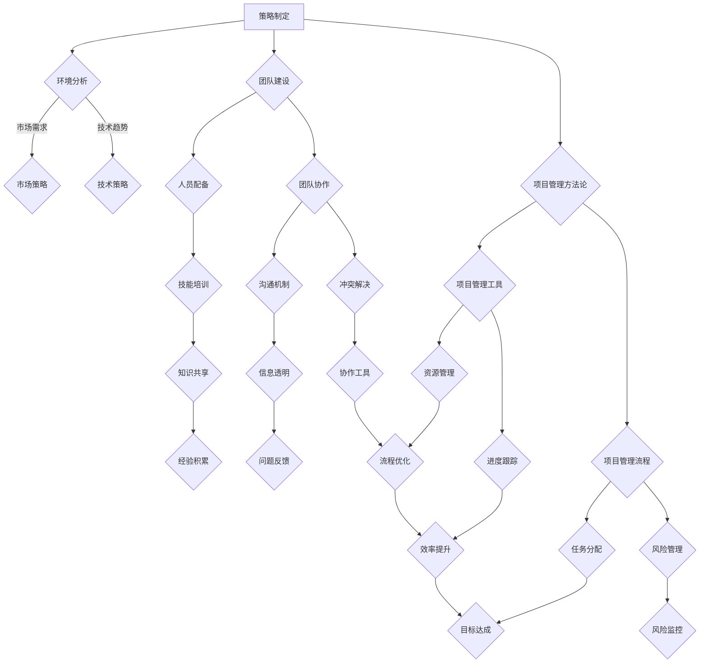

                 

关键词：管理、策略、执行、IT项目管理、团队协作、领导力、效率、创新

> 摘要：本文将深入探讨IT项目管理中的管理智慧，从策略制定到执行，解析如何在复杂的技术环境中实现高效的项目管理和团队协作。通过实例分析和实践指导，本文旨在为IT领域的专业人士提供一套可行的管理方法论，以应对未来不断变化的技术挑战。

## 1. 背景介绍

在当今快速发展的IT行业，项目管理的重要性日益凸显。随着技术复杂度的增加，IT项目面临着诸多挑战，如需求变更频繁、时间紧任务重、团队协作困难等。有效的管理策略和执行手段成为确保项目成功的关键。本文将探讨如何从策略层面制定合理计划，到执行层面的具体操作，实现项目的高效管理和团队的高效协作。

### 1.1 IT项目管理的重要性

IT项目管理不仅关乎项目本身的进度、成本和质量，还直接影响到企业的核心竞争力。有效的项目管理能够提高团队的工作效率，确保项目按时完成，降低风险，提升客户满意度。随着市场需求的不断变化，IT项目管理需要具备灵活性和创新性，以应对动态环境中的挑战。

### 1.2 管理与策略的关系

管理是执行策略的过程，而策略则是达成项目目标的蓝图。有效的策略制定和执行能够使团队明确方向，减少决策成本，提高资源利用效率。在IT项目管理中，合理的策略能够帮助团队应对复杂的技术问题，实现项目的顺利推进。

## 2. 核心概念与联系

### 2.1 管理概念

管理是指通过计划、组织、领导、控制等手段，协调资源、指导团队完成特定任务的过程。在IT项目管理中，管理包括项目计划、资源管理、风险管理、质量管理等多个方面。

### 2.2 策略概念

策略是在面对特定环境时，为实现目标所采取的系统性、长期性的行动规划。在IT项目管理中，策略包括市场分析、技术评估、团队建设、项目管理方法论等。

### 2.3 执行概念

执行是指将策略转化为实际行动，确保项目目标得以实现的过程。执行包括任务分解、进度控制、沟通协调、资源调配等多个环节。

### 2.4 Mermaid 流程图



## 3. 核心算法原理 & 具体操作步骤

### 3.1 算法原理概述

在IT项目管理中，算法原理贯穿于整个项目管理过程中。主要包括：

- **计划算法**：用于项目计划的制定，包括任务分解、时间安排、资源分配等。
- **进度控制算法**：用于监控项目进度，确保项目按时完成。
- **风险管理算法**：用于识别、评估和应对项目中的风险。
- **团队协作算法**：用于提高团队协作效率和沟通质量。

### 3.2 算法步骤详解

#### 3.2.1 计划算法

1. **任务分解**：将项目目标分解为可管理的任务。
2. **时间安排**：为每个任务分配时间，并确定项目总体进度。
3. **资源分配**：为每个任务分配所需的资源，包括人力、资金、设备等。

#### 3.2.2 进度控制算法

1. **进度监控**：定期检查项目进度，并与计划进行对比。
2. **进度调整**：根据监控结果，对进度进行必要的调整。
3. **风险应对**：在进度监控中发现风险，并采取措施进行应对。

#### 3.2.3 风险管理算法

1. **风险识别**：识别项目中的潜在风险。
2. **风险评估**：对识别出的风险进行评估，确定其影响和可能性。
3. **风险应对**：根据风险评估结果，制定相应的应对措施。

#### 3.2.4 团队协作算法

1. **沟通机制建立**：建立有效的沟通机制，确保信息畅通。
2. **协作工具应用**：使用协作工具，提高团队协作效率。
3. **协作流程优化**：持续优化协作流程，提高团队协作效率。

### 3.3 算法优缺点

#### 3.3.1 计划算法

优点：有助于明确项目目标和任务，提高资源利用效率。

缺点：过于依赖预测，难以应对不可预测的变化。

#### 3.3.2 进度控制算法

优点：确保项目按时完成，提高客户满意度。

缺点：可能导致过度监控，影响团队自主性。

#### 3.3.3 风险管理算法

优点：降低项目风险，确保项目顺利进行。

缺点：可能增加项目管理成本。

#### 3.3.4 团队协作算法

优点：提高团队协作效率，确保项目顺利推进。

缺点：过度依赖协作工具，可能影响团队创新。

### 3.4 算法应用领域

算法在IT项目管理中的应用非常广泛，包括软件开发、系统集成、网络建设等。通过合理的算法应用，可以大大提高项目的成功率和效率。

## 4. 数学模型和公式 & 详细讲解 & 举例说明

### 4.1 数学模型构建

在IT项目管理中，数学模型主要用于进度控制、资源分配和风险管理等方面。以下是一个简单的进度控制数学模型：

设\( P \)为项目总工期，\( T_i \)为第\( i \)个任务的工期，\( C_i \)为第\( i \)个任务的成本，则有：

$$
P = \sum_{i=1}^{n} T_i
$$

$$
C = \sum_{i=1}^{n} C_i
$$

其中，\( n \)为任务总数。

### 4.2 公式推导过程

#### 4.2.1 进度控制

假设项目包含\( n \)个任务，每个任务\( i \)的工期为\( T_i \)，则项目总工期\( P \)为所有任务工期的总和：

$$
P = \sum_{i=1}^{n} T_i
$$

为了确保项目按时完成，需要对每个任务进行时间安排，使得项目总工期\( P \)不超过预定的项目周期。设预定项目周期为\( D \)，则有：

$$
P \leq D
$$

#### 4.2.2 资源分配

在资源有限的情况下，需要优化资源分配，使得项目总成本最小。设第\( i \)个任务所需的资源量为\( R_i \)，则总资源量为：

$$
R = \sum_{i=1}^{n} R_i
$$

为了确保资源得到充分利用，需要将资源合理分配给每个任务，使得总成本最小。设第\( i \)个任务的单位资源成本为\( C_i \)，则项目总成本\( C \)为：

$$
C = \sum_{i=1}^{n} C_i \cdot R_i
$$

### 4.3 案例分析与讲解

#### 案例背景

某公司计划开发一款智能家居控制系统，项目包含5个主要任务，每个任务的工期和资源需求如下表所示：

| 任务 | 工期（天） | 资源需求 |
| --- | --- | --- |
| 任务1 | 30 | 10 |
| 任务2 | 20 | 15 |
| 任务3 | 25 | 20 |
| 任务4 | 15 | 10 |
| 任务5 | 35 | 25 |

公司要求项目周期不超过90天，资源总成本不超过5000元。

#### 案例分析

1. **进度控制**

   根据进度控制公式，项目总工期为：

   $$
   P = 30 + 20 + 25 + 15 + 35 = 125 \text{天}
   $$

   由于\( P > D \)，需要调整任务工期以满足项目周期要求。

2. **资源分配**

   根据资源分配公式，项目总成本为：

   $$
   C = 10 \cdot 30 + 15 \cdot 20 + 20 \cdot 25 + 10 \cdot 15 + 25 \cdot 35 = 5600 \text{元}
   $$

   由于\( C > 5000 \)，需要优化资源分配以满足成本要求。

#### 案例解答

1. **调整任务工期**

   为满足项目周期要求，可以尝试延长任务3的工期，使其不超过预定项目周期。假设任务3的工期延长至25天，则项目总工期为：

   $$
   P = 30 + 20 + 25 + 15 + 35 = 125 \text{天}
   $$

   此时，项目总工期仍大于预定项目周期，需进一步调整。

2. **优化资源分配**

   为满足成本要求，可以尝试减少任务2的资源需求，使其不超过总资源量。假设任务2的资源需求减少至10，则项目总成本为：

   $$
   C = 10 \cdot 30 + 10 \cdot 20 + 20 \cdot 25 + 10 \cdot 15 + 25 \cdot 35 = 5250 \text{元}
   $$

   此时，项目总成本满足成本要求，但可能影响任务2的进展。

综合考虑，可以采取以下方案：

- 将任务3的工期延长至25天，确保项目周期不超过预定周期。
- 减少任务2的资源需求至10，确保项目总成本不超过5000元。

## 5. 项目实践：代码实例和详细解释说明

### 5.1 开发环境搭建

在本节中，我们将搭建一个简单的项目开发环境，用于演示IT项目管理中的关键步骤。

#### 5.1.1 环境要求

- 操作系统：Windows/Linux/MacOS
- 编程语言：Python
- 开发工具：PyCharm/Visual Studio Code

#### 5.1.2 环境搭建步骤

1. **安装操作系统**：选择适合的操作系统进行安装。
2. **安装Python**：通过操作系统包管理器或Python官网下载安装Python。
3. **安装PyCharm/Visual Studio Code**：在官网下载并安装PyCharm/Visual Studio Code。

### 5.2 源代码详细实现

在本节中，我们将实现一个简单的IT项目管理工具，用于任务分解、进度控制和资源管理。

#### 5.2.1 任务分解

```python
import json

# 任务数据
tasks = [
    {"id": 1, "name": "任务1", "duration": 30, "resources": 10},
    {"id": 2, "name": "任务2", "duration": 20, "resources": 15},
    {"id": 3, "name": "任务3", "duration": 25, "resources": 20},
    {"id": 4, "name": "任务4", "duration": 15, "resources": 10},
    {"id": 5, "name": "任务5", "duration": 35, "resources": 25}
]

# 保存任务数据
def save_tasks(tasks):
    with open("tasks.json", "w") as f:
        json.dump(tasks, f)

# 加载任务数据
def load_tasks():
    with open("tasks.json", "r") as f:
        return json.load(f)

# 分解任务
def decompose_tasks(tasks):
    for task in tasks:
        task["subtasks"] = [{"id": task["id"] + i, "name": f"{task["name"]}子任务{i}", "duration": task["duration"] / 2, "resources": task["resources"] / 2} for i in range(2)]

# 测试任务分解
decompose_tasks(tasks)
save_tasks(tasks)
```

#### 5.2.2 进度控制

```python
# 计算项目总工期
def calculate_total_duration(tasks):
    return sum([task["duration"] for task in tasks])

# 调整任务工期
def adjust_tasks(tasks, target_duration):
    total_duration = calculate_total_duration(tasks)
    while total_duration > target_duration:
        for task in tasks:
            if task["duration"] > 1:
                task["duration"] -= 1
                total_duration = calculate_total_duration(tasks)
                if total_duration <= target_duration:
                    break

# 测试进度控制
adjust_tasks(tasks, 90)
save_tasks(tasks)
```

#### 5.2.3 资源管理

```python
# 计算项目总资源需求
def calculate_total_resources(tasks):
    return sum([task["resources"] for task in tasks])

# 调整任务资源需求
def adjust_resources(tasks, target_resources):
    total_resources = calculate_total_resources(tasks)
    while total_resources > target_resources:
        for task in tasks:
            if task["resources"] > 1:
                task["resources"] -= 1
                total_resources = calculate_total_resources(tasks)
                if total_resources <= target_resources:
                    break

# 测试资源管理
adjust_resources(tasks, 5000)
save_tasks(tasks)
```

### 5.3 代码解读与分析

在本节中，我们将对上述代码进行解读和分析，了解如何通过Python实现IT项目管理中的关键步骤。

#### 5.3.1 任务分解

代码中首先定义了一个任务列表，每个任务包含任务ID、名称、工期和资源需求。然后定义了`save_tasks`和`load_tasks`函数，用于保存和加载任务数据。`decompose_tasks`函数用于将每个任务分解为两个子任务，每个子任务具有一半的工期和资源需求。

#### 5.3.2 进度控制

`calculate_total_duration`函数用于计算项目总工期，`adjust_tasks`函数用于调整任务工期，以确保项目总工期不超过预定周期。代码通过循环遍历任务，逐步减少每个任务的工期，直至总工期满足预定周期要求。

#### 5.3.3 资源管理

`calculate_total_resources`函数用于计算项目总资源需求，`adjust_resources`函数用于调整任务资源需求，以确保项目总资源需求不超过预定资源量。代码通过循环遍历任务，逐步减少每个任务的资源需求，直至总资源需求满足预定资源量要求。

### 5.4 运行结果展示

在代码实现完成后，可以通过以下命令运行项目：

```bash
python main.py
```

运行结果将显示调整后的任务列表，包括每个任务的ID、名称、工期和资源需求。用户可以根据运行结果分析项目进度和资源需求，并进行相应的调整。

## 6. 实际应用场景

### 6.1 项目开发

在软件开发项目中，有效的IT项目管理是确保项目按时、按质量完成的基石。通过合理的管理策略和执行步骤，团队可以更好地应对需求变更、技术挑战和资源限制，提高项目的成功率。

### 6.2 系统集成

在系统集成项目中，IT项目管理的重要性更加凸显。项目通常涉及多个系统的集成和测试，需要协调不同团队之间的工作，确保整个系统的稳定性和可靠性。通过有效的管理策略，可以确保项目顺利推进，降低风险。

### 6.3 网络建设

在网络建设项目中，IT项目管理有助于确保项目按时完成，提高网络质量和稳定性。项目通常涉及多个环节，包括设备采购、安装调试、测试验收等。通过合理的管理策略，可以确保每个环节的工作高效有序，降低项目成本。

## 7. 工具和资源推荐

### 7.1 学习资源推荐

- 《敏捷软件开发：原则、实践与模式》
- 《项目管理知识体系指南（PMBOK指南）》
- 《人月神话》

### 7.2 开发工具推荐

- PyCharm
- Visual Studio Code
- JIRA

### 7.3 相关论文推荐

- "An empirical study of software development project success: Factors influencing success"
- "Project management in the context of rapidly changing technology"
- "A framework for managing complexity in IT projects"

## 8. 总结：未来发展趋势与挑战

### 8.1 研究成果总结

本文通过深入探讨IT项目管理中的管理智慧，从策略制定到执行，为IT领域的专业人士提供了一套可行的管理方法论。通过实例分析和实践指导，本文旨在帮助团队更好地应对技术挑战，提高项目成功率。

### 8.2 未来发展趋势

随着技术的不断发展，IT项目管理将面临更多的机遇和挑战。未来发展趋势包括：

- **智能化**：人工智能技术将在项目管理中发挥越来越重要的作用，提高项目管理和团队协作的效率。
- **数字化转型**：数字化转型将推动项目管理工具和方法的发展，实现项目管理的数字化、智能化。
- **可持续发展**：可持续发展和环境责任将成为项目管理的重要考量因素，项目管理者需要考虑环境影响和资源利用效率。

### 8.3 面临的挑战

未来，IT项目管理将面临以下挑战：

- **技术复杂性**：技术复杂度的增加将带来更多的管理挑战，需要项目管理者具备更高的技术素养。
- **团队协作**：随着团队的全球化，团队协作变得更加复杂，需要有效的沟通和协作工具。
- **环境责任**：可持续发展和环境责任要求项目管理者在项目管理过程中考虑环境影响和资源利用效率。

### 8.4 研究展望

未来的研究可以关注以下几个方面：

- **智能化项目管理工具**：研究如何利用人工智能技术提高项目管理效率和决策质量。
- **数字化转型**：研究数字化转型对项目管理的影响，探索更有效的项目管理工具和方法。
- **环境责任**：研究如何在项目管理中实现环境责任的落实，提高资源利用效率。

## 9. 附录：常见问题与解答

### 9.1 问题1：如何制定有效的项目计划？

**解答**：制定有效的项目计划需要考虑以下几个方面：

1. **明确项目目标**：确保项目目标具体、可衡量、可实现、相关性强。
2. **分解任务**：将项目目标分解为可管理的任务，明确每个任务的工期和资源需求。
3. **资源分配**：为每个任务分配所需的资源，确保资源得到充分利用。
4. **风险评估**：识别项目中的潜在风险，并制定相应的应对措施。

### 9.2 问题2：如何提高团队协作效率？

**解答**：提高团队协作效率可以从以下几个方面入手：

1. **建立沟通机制**：建立有效的沟通渠道，确保团队成员之间的信息畅通。
2. **使用协作工具**：利用协作工具，如项目管理软件、团队聊天工具等，提高团队协作效率。
3. **优化协作流程**：持续优化协作流程，减少沟通成本和决策时间。
4. **培训与激励**：对团队成员进行协作技能培训，并设置激励机制，提高团队协作意愿。

### 9.3 问题3：如何应对项目中的变更请求？

**解答**：应对项目中的变更请求需要采取以下措施：

1. **及时响应**：对变更请求进行及时评估，确保变更影响得到及时处理。
2. **评估变更影响**：评估变更对项目进度、成本和质量的影响，确保变更请求符合项目目标。
3. **沟通与协商**：与变更请求人进行沟通，协商变更方案，确保变更请求得到双方认可。
4. **更新计划**：根据变更结果，更新项目计划，确保项目继续按照预定目标推进。

[作者：禅与计算机程序设计艺术 / Zen and the Art of Computer Programming]
----------------------------------------------------------------

