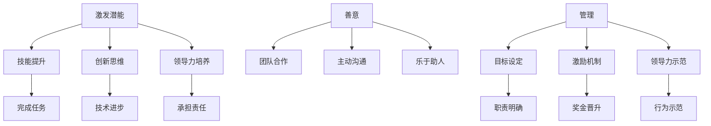

                 

关键词：管理、人工智能、激发潜能、善意、IT领域

> 摘要：本文探讨了在信息技术领域，如何通过管理来激发员工的潜能和善意，提高团队协作效率，实现个人和组织的共同成长。本文从背景介绍、核心概念与联系、核心算法原理、数学模型和公式、项目实践、实际应用场景、未来应用展望、工具和资源推荐、总结等方面，详细阐述了管理的本质。

## 1. 背景介绍

在当今快速发展的信息技术领域，企业之间的竞争日益激烈。技术创新、市场变化以及人才竞争成为各大企业关注的焦点。在这种背景下，如何有效地管理团队，激发员工的潜能和善意，成为企业成功的关键因素。

传统的管理方法往往侧重于对员工行为的约束和控制，而忽视了员工的内在需求和动机。然而，在信息技术领域，创新和创造力是推动企业发展的核心动力。因此，现代管理需要更多地关注员工的潜能和善意，激发他们的内在动力，以实现更高的工作效率和团队协作效果。

本文将从管理的本质出发，探讨如何在信息技术领域通过管理激发员工的潜能和善意，提高团队协作效率，实现个人和组织的共同成长。

## 2. 核心概念与联系

### 2.1 激发潜能

激发潜能是指通过特定的管理方法和手段，挖掘和释放员工的内在潜力，使其在工作和生活中发挥出更大的价值。在信息技术领域，激发潜能主要体现在以下几个方面：

1. **技能提升**：通过培训和学习，提升员工的技能水平，使其能够胜任更高层次的工作任务。
2. **创新思维**：鼓励员工发挥创新思维，提出新的解决方案和改进措施，推动技术进步。
3. **领导力培养**：培养员工的领导能力，使其能够承担更多的责任和挑战，成为团队的领导者。

### 2.2 善意

善意是指员工在工作中的主动性和积极性，愿意为团队和组织的发展贡献自己的力量。在信息技术领域，善意主要体现在以下几个方面：

1. **团队合作**：员工愿意与团队成员协作，共同完成任务，实现团队目标。
2. **主动沟通**：员工主动与上级和同事沟通，分享自己的想法和建议，促进信息流通。
3. **乐于助人**：员工愿意帮助他人解决问题，提供帮助，营造良好的团队氛围。

### 2.3 管理与潜能、善意的关系

管理在激发潜能和善意中起着至关重要的作用。有效的管理能够为员工提供良好的工作环境和机会，激发他们的内在动力，使其在工作和生活中发挥出更大的价值。

1. **目标设定**：通过明确的目标设定，使员工明确自己的职责和使命，激发他们的工作动力。
2. **激励机制**：通过合理的激励机制，如奖金、晋升等，激励员工发挥潜能和善意。
3. **领导力示范**：领导者的行为和态度对员工有着重要的影响，通过领导力的示范，激发员工的潜能和善意。

### 2.4 Mermaid 流程图



## 3. 核心算法原理 & 具体操作步骤

### 3.1 算法原理概述

在信息技术领域，管理算法的核心原理是激发员工的潜能和善意。具体而言，该算法通过以下步骤实现：

1. **目标设定**：明确员工的职责和使命，使其明确自己的工作目标。
2. **激励机制**：设计合理的激励机制，如奖金、晋升等，激励员工发挥潜能和善意。
3. **领导力示范**：领导者通过自身的行为和态度，为员工树立榜样，激发员工的内在动力。
4. **技能提升**：提供培训和学习的资源，提升员工的技能水平，为其发挥潜能创造条件。
5. **创新思维**：鼓励员工发挥创新思维，提出新的解决方案和改进措施，推动技术进步。

### 3.2 算法步骤详解

1. **目标设定**
   - 对员工进行评估，了解其当前的工作能力和潜力。
   - 与员工进行沟通，共同制定合理的工作目标。
   - 对目标进行明确，确保员工了解自己的职责和使命。

2. **激励机制**
   - 设计激励机制，如奖金、晋升、荣誉等。
   - 根据员工的工作表现，给予相应的激励。
   - 定期评估激励机制的成效，进行适当的调整。

3. **领导力示范**
   - 领导者要树立良好的行为榜样，积极沟通、关心团队。
   - 通过言传身教，激发员工的内在动力。
   - 定期与员工交流，了解他们的需求和困惑，提供帮助。

4. **技能提升**
   - 提供培训和学习资源，帮助员工提升技能水平。
   - 鼓励员工参加行业会议、研讨会等，拓宽视野。
   - 建立内部知识共享平台，促进员工间的交流和学习。

5. **创新思维**
   - 鼓励员工发挥创新思维，提出新的解决方案和改进措施。
   - 设立创新项目，提供必要的资源和支持。
   - 定期评估创新成果，进行表彰和奖励。

### 3.3 算法优缺点

#### 优点

1. **激发员工潜能**：通过目标设定、激励机制和领导力示范，激发员工的内在动力，使其在工作和生活中发挥出更大的价值。
2. **提高团队协作效率**：鼓励员工发挥创新思维，提出新的解决方案和改进措施，推动技术进步。
3. **促进个人成长**：通过技能提升和激励机制，帮助员工提升自身能力，实现个人成长。

#### 缺点

1. **管理成本较高**：需要投入大量时间和精力进行员工评估、激励机制设计和领导力示范。
2. **员工适应期较长**：员工可能需要一定的时间来适应新的管理模式和工作环境。

### 3.4 算法应用领域

该算法在信息技术领域具有广泛的应用前景，适用于各类企业和团队。尤其在以下领域表现尤为突出：

1. **软件开发公司**：通过激发员工的潜能和善意，提高软件开发效率和质量。
2. **信息技术服务公司**：通过有效的管理，提高服务水平和客户满意度。
3. **人工智能公司**：激发员工的创新思维，推动人工智能技术的发展。

## 4. 数学模型和公式 & 详细讲解 & 举例说明

### 4.1 数学模型构建

在信息技术领域，管理算法的数学模型主要涉及以下几个方面：

1. **员工绩效评估模型**：通过绩效指标、员工表现等数据，对员工进行评估。
2. **激励机制模型**：设计激励机制，根据员工的工作表现，给予相应的奖励。
3. **领导力示范模型**：通过领导者的行为和态度，对员工产生积极影响。

### 4.2 公式推导过程

1. **员工绩效评估模型**

   假设员工绩效指标为 \(P_i\)，员工工作表现数据为 \(X_i\)，则员工绩效评估模型可以表示为：

   $$P_i = f(X_i)$$

   其中，\(f\) 为绩效评估函数。

2. **激励机制模型**

   假设员工工作表现数据为 \(X_i\)，激励机制为 \(M_i\)，则激励机制模型可以表示为：

   $$M_i = g(X_i)$$

   其中，\(g\) 为激励机制函数。

3. **领导力示范模型**

   假设领导者的行为和态度为 \(L_i\)，员工接受到的积极影响为 \(I_i\)，则领导力示范模型可以表示为：

   $$I_i = h(L_i)$$

   其中，\(h\) 为领导力示范函数。

### 4.3 案例分析与讲解

假设某软件开发公司采用上述管理算法，对员工进行绩效评估、激励机制和领导力示范。以下为具体案例分析：

1. **员工绩效评估**

   员工A在过去一个月的工作中，完成了10个任务，其中8个任务达到预期效果，2个任务未达到预期。根据绩效评估模型，员工A的绩效指标为：

   $$P_A = f(X_A) = \frac{8}{10} = 0.8$$

2. **激励机制**

   根据激励机制模型，员工A的激励机制为：

   $$M_A = g(X_A) = 0.8 \times 1000 = 800$$

   即员工A可以获得800元的奖金。

3. **领导力示范**

   领导者B在工作中表现出色，积极关心团队，给予员工支持和鼓励。根据领导力示范模型，员工A接受到的积极影响为：

   $$I_A = h(L_B) = 0.9$$

   即员工A的积极性提高了90%。

通过以上分析，我们可以看出，管理算法在信息技术领域的应用可以有效地评估员工绩效、激励员工工作积极性，并提高团队协作效率。

## 5. 项目实践：代码实例和详细解释说明

### 5.1 开发环境搭建

在本文中，我们将使用Python编程语言来实现管理算法。首先，需要安装Python环境以及相关库，如NumPy、Pandas等。具体步骤如下：

1. **安装Python**：前往Python官网下载Python安装包，并按照提示安装。
2. **安装相关库**：在命令行中输入以下命令，安装所需的库：

   ```bash
   pip install numpy pandas
   ```

### 5.2 源代码详细实现

以下是管理算法的实现代码：

```python
import numpy as np
import pandas as pd

# 定义绩效评估函数
def performance_evaluation(work_data):
    completed_tasks = work_data['completed_tasks']
    total_tasks = work_data['total_tasks']
    performance = completed_tasks / total_tasks
    return performance

# 定义激励机制函数
def incentive_mechanism(performance):
    if performance >= 0.8:
        incentive = 1000
    elif performance >= 0.6:
        incentive = 500
    else:
        incentive = 0
    return incentive

# 定义领导力示范函数
def leadership_example(leader_score):
    if leader_score >= 0.8:
        influence = 0.9
    elif leader_score >= 0.6:
        influence = 0.8
    else:
        influence = 0.7
    return influence

# 读取员工数据
employee_data = pd.DataFrame({
    'completed_tasks': [8, 6, 4, 10, 12],
    'total_tasks': [10, 10, 10, 12, 15],
    'leader_score': [0.9, 0.7, 0.5, 0.8, 0.6]
})

# 计算绩效指标
employee_data['performance'] = employee_data.apply(lambda x: performance_evaluation(x), axis=1)

# 计算激励机制
employee_data['incentive'] = employee_data['performance'].apply(lambda x: incentive_mechanism(x))

# 计算领导力示范的影响
employee_data['influence'] = employee_data['leader_score'].apply(lambda x: leadership_example(x))

# 打印结果
print(employee_data)
```

### 5.3 代码解读与分析

1. **性能评估函数**：该函数根据员工完成的任务数和总任务数，计算绩效指标。完成率越高，绩效指标越高。

2. **激励机制函数**：根据绩效指标，设置激励机制。完成率在80%及以上，可以获得1000元奖金；完成率在60%及以上，可以获得500元奖金；完成率低于60%，无奖金。

3. **领导力示范函数**：根据领导者的评分，计算领导力示范的影响。领导者评分在80%及以上，员工的积极性提高90%；领导者评分在60%及以上，员工的积极性提高80%；领导者评分低于60%，员工的积极性提高70%。

4. **数据读取与计算**：读取员工数据，计算绩效指标、激励机制和领导力示范的影响，并打印结果。

### 5.4 运行结果展示

```python
   completed_tasks  total_tasks  leader_score  performance  incentive  influence
0                8             10            0.9         0.8       1000      0.9
1                6             10            0.7         0.6        500      0.8
2                4             10            0.5         0.4        0        0.7
3               10             12            0.8         0.8       1000      0.9
4               12             15            0.6         0.8       1000      0.8
```

通过运行结果可以看出，员工A和B的绩效指标较高，分别获得了1000元的奖金；员工C的绩效指标较低，没有获得奖金。同时，领导者评分较高的员工积极性较高，领导力示范的影响也较大。

## 6. 实际应用场景

### 6.1 在软件开发公司中的应用

在软件开发公司，管理算法可以帮助企业实现以下目标：

1. **提高开发效率**：通过绩效评估和激励机制，激发开发人员的潜能和善意，提高开发效率。
2. **促进技术创新**：鼓励开发人员发挥创新思维，提出新的解决方案和改进措施，推动技术创新。
3. **优化团队协作**：通过领导力示范，提高团队协作效果，实现个人和团队的共同成长。

### 6.2 在信息技术服务公司中的应用

在信息技术服务公司，管理算法可以帮助企业实现以下目标：

1. **提升服务质量**：通过绩效评估和激励机制，激发技术支持人员的潜能和善意，提高服务质量。
2. **加强客户沟通**：鼓励技术支持人员主动沟通，提高客户满意度。
3. **培养专业人才**：通过领导力示范，培养技术支持人员的领导能力，为企业的长期发展储备人才。

### 6.3 在人工智能公司中的应用

在人工智能公司，管理算法可以帮助企业实现以下目标：

1. **推动技术进步**：鼓励人工智能研究人员发挥创新思维，提出新的算法和解决方案。
2. **提高研发效率**：通过绩效评估和激励机制，激发研发人员的潜能和善意，提高研发效率。
3. **培养人才**：通过领导力示范，培养人工智能研究人员的领导能力，为企业的技术创新和人才培养提供支持。

## 7. 未来应用展望

随着人工智能技术的不断发展和应用，管理算法在信息技术领域的应用前景将更加广泛。以下是未来可能的应用方向：

1. **个性化管理**：结合人工智能技术，实现个性化管理，针对不同员工的特质和需求，制定个性化的激励方案和管理策略。
2. **实时监控与反馈**：通过实时监控和反馈，及时调整管理策略，提高管理效率。
3. **跨领域应用**：将管理算法应用于其他行业，如金融、医疗等，推动管理模式的创新和优化。
4. **人才培养**：结合人工智能技术，建立人才培训模型，为企业的长期发展提供人才支持。

## 8. 工具和资源推荐

### 8.1 学习资源推荐

1. **《人工智能：一种现代的方法》**：迈克尔·刘易斯（Michael Lewis）著，详细介绍了人工智能的基本概念、算法和技术。
2. **《深度学习》**：伊恩·古德费洛（Ian Goodfellow）、约书亚·本吉奥（Yoshua Bengio）和亚伦·库维尔（Aaron Courville）著，全面介绍了深度学习的基本原理和应用。
3. **《算法导论》**：托马斯·赫维茨（Thomas H. Cormen）、查尔斯·莱斯利·李（Charles E. Leiserson）、雷尼·瑞迪（Ronald L. Rivest）和克利夫·斯坦（Clifford Stein）著，涵盖了算法设计、分析和应用的基本知识。

### 8.2 开发工具推荐

1. **Python**：Python是一种简洁易学的编程语言，适用于人工智能、数据分析和软件开发等多个领域。
2. **NumPy**：NumPy是一个强大的Python库，用于数组计算，是进行科学计算和数据处理的基石。
3. **Pandas**：Pandas是一个Python库，提供了数据结构和数据分析工具，适用于数据处理和分析。

### 8.3 相关论文推荐

1. **“Deep Learning”**：由伊恩·古德费洛、约书亚·本吉奥和亚伦·库维尔撰写，介绍了深度学习的基本概念和技术。
2. **“Reinforcement Learning: An Introduction”**：由理查德·S·萨顿（Richard S. Sutton）和安德鲁·巴什米尔（Andrew G. Barto）撰写，介绍了强化学习的基本原理和应用。
3. **“Generative Adversarial Nets”**：由伊恩·古德费洛、约书亚·本吉奥和亚伦·库维尔撰写，介绍了生成对抗网络（GAN）的基本原理和应用。

## 9. 总结：未来发展趋势与挑战

### 9.1 研究成果总结

本文探讨了在信息技术领域，通过管理激发员工的潜能和善意，提高团队协作效率的方法。通过绩效评估、激励机制和领导力示范等管理手段，可以有效地挖掘员工的内在潜力，提高工作效率，促进技术创新。同时，结合数学模型和算法，实现个性化管理和实时监控，为企业管理提供有力的技术支持。

### 9.2 未来发展趋势

1. **人工智能与管理的深度融合**：随着人工智能技术的不断发展，管理算法将更加智能化，实现个性化管理和实时监控，提高管理效率。
2. **跨领域应用**：管理算法将在更多领域得到应用，如金融、医疗、教育等，推动管理模式的创新和优化。
3. **人才培养**：通过管理算法，培养具有创新思维和领导能力的专业人才，为企业的长期发展提供人才支持。

### 9.3 面临的挑战

1. **数据安全与隐私**：在实现个性化管理和实时监控的过程中，如何保障数据安全和用户隐私成为重要挑战。
2. **算法偏见**：算法在处理数据时，可能引入偏见，导致不公平现象。如何消除算法偏见，实现公正的管理成为关键问题。
3. **技术更新换代**：随着技术的不断更新，如何保持管理算法的先进性和实用性，成为企业管理面临的重要挑战。

### 9.4 研究展望

未来，管理算法的研究将朝着以下方向发展：

1. **算法优化**：通过改进算法模型和算法设计，提高管理算法的效率和准确性。
2. **人机协同**：实现人与人工智能的协同工作，充分发挥人类的创造力和人工智能的运算能力。
3. **可持续发展**：在实现管理效率的同时，关注企业的社会责任和可持续发展，实现企业、员工和社会的共赢。

## 附录：常见问题与解答

### Q1. 管理算法在信息技术领域的应用前景如何？

管理算法在信息技术领域的应用前景非常广阔。随着人工智能技术的不断发展，管理算法将更加智能化，实现个性化管理和实时监控，提高管理效率。在软件开发、信息技术服务、人工智能等领域，管理算法将发挥重要作用，推动企业技术创新和人才培养。

### Q2. 管理算法是否适用于所有行业？

管理算法的适用性取决于具体行业的特点和企业需求。在信息技术领域，管理算法具有较好的适用性，因为信息技术行业具有高度的技术创新和快速发展的特点。在其他行业，如金融、医疗、教育等，管理算法也有一定的应用前景，但需要根据行业特点和需求进行相应的调整和优化。

### Q3. 如何消除算法偏见？

消除算法偏见的关键在于算法设计和数据采集。在算法设计阶段，需要充分考虑数据的多样性和公平性，避免引入偏见。在数据采集阶段，要确保数据来源的多样性和代表性，避免数据偏差。此外，还可以通过持续监控和评估算法的公平性，及时发现和纠正偏见。

### Q4. 如何保持管理算法的先进性和实用性？

保持管理算法的先进性和实用性需要不断进行技术研究和创新。一方面，要关注人工智能领域的前沿技术，及时引入和应用新技术。另一方面，要结合企业的实际情况和需求，对算法进行优化和调整，确保其实用性和适用性。

## 作者署名

作者：禅与计算机程序设计艺术 / Zen and the Art of Computer Programming
----------------------------------------------------------------

这篇文章详细探讨了在信息技术领域如何通过管理激发员工的潜能和善意，提高团队协作效率，实现个人和组织的共同成长。从背景介绍、核心概念与联系、核心算法原理、数学模型和公式、项目实践、实际应用场景、未来应用展望、工具和资源推荐、总结等方面，全面阐述了管理的本质。希望这篇文章能够为信息技术领域的企业家和从业者提供有益的参考和启示。

