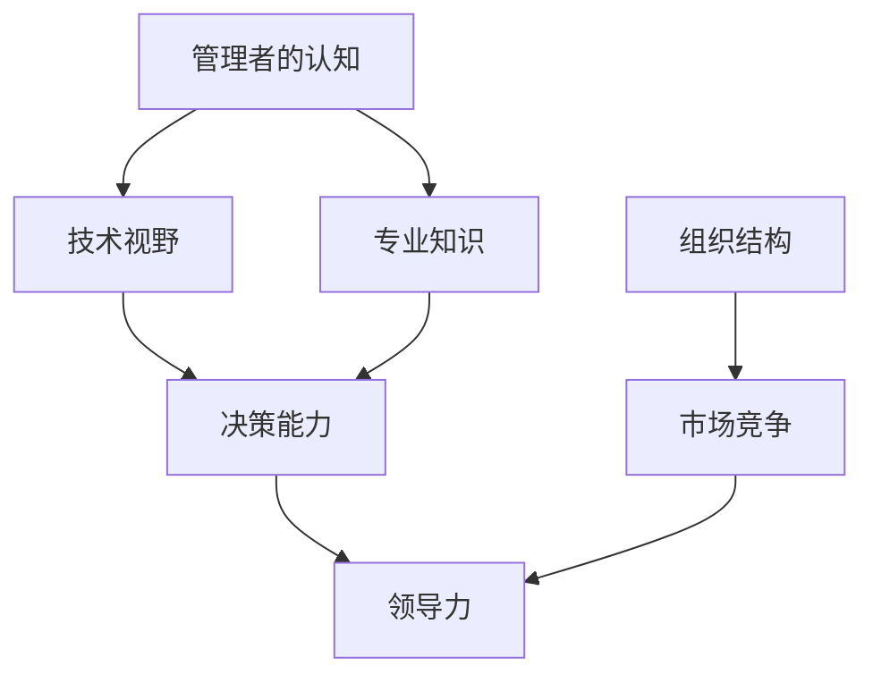

                 

关键词：认知差距、管理者、组织结构、技术变革、领导力、技能发展、决策失误

> 摘要：本文将深入探讨管理者的认知差距来源，分析其在技术变革时代下的影响，并提供应对策略和提升方法。通过阐述认知差距的成因，揭示其在决策和领导力中的关键作用，旨在为管理者提供有价值的见解和实用的指导。

## 1. 背景介绍

在当今快速变化的技术时代，管理者面临前所未有的挑战。技术进步不断推动行业变革，组织结构逐渐复杂，市场竞争日益激烈。为了保持竞争力，管理者需要不断适应新的技术、新的商业模式和新的管理方法。然而，很多管理者在应对这些变化时却感到力不从心，其背后的原因就是认知差距。

认知差距指的是管理者在知识、技能和思维模式上与理想状态之间的差异。这种差距可能源于多个方面，包括个人经验、教育背景、信息获取渠道以及组织文化等。本文将深入探讨这些因素，分析认知差距的成因，并探讨其对管理决策和领导力的深远影响。

### 1.1 技术变革的影响

技术变革是当今时代最重要的特征之一。云计算、大数据、人工智能等新兴技术正在改变传统的商业运作模式，对各行各业产生深远影响。对于管理者来说，这意味着需要具备更广泛的技术视野和更深厚的专业知识。然而，很多管理者在技术领域并不具备足够的了解，这就导致了认知差距的产生。

### 1.2 组织结构的复杂性

随着企业规模的扩大，组织结构日益复杂。管理者需要应对更多的层级、更多的部门和更复杂的业务流程。这种复杂性增加了管理难度，同时也放大了认知差距。管理者可能无法全面了解各个部门和业务线的运作情况，导致决策失误。

### 1.3 市场竞争的激烈性

在激烈的市场竞争中，管理者需要具备敏锐的市场洞察力和快速响应能力。然而，认知差距可能使管理者在应对市场变化时反应迟钝，无法及时调整策略，从而错失市场机会。

## 2. 核心概念与联系

为了更好地理解认知差距的来源和影响，我们需要借助 Mermaid 流程图来展示相关的核心概念和联系。



在这个流程图中，我们可以看到管理者的认知差距与多个因素相关联。技术视野和专业知识是管理者认知的基础，它们直接影响决策能力和领导力。同时，组织结构的复杂性和市场竞争的激烈性也会对认知差距产生重要影响。

## 3. 核心算法原理 & 具体操作步骤

### 3.1 算法原理概述

认知差距的管理可以通过以下几个步骤来实现：

1. **自我认知评估**：管理者需要定期进行自我认知评估，了解自己在知识、技能和思维模式上的优势和不足。
2. **持续学习**：管理者应持续学习新技术、新知识和新管理方法，以缩小认知差距。
3. **建立信息渠道**：管理者应建立广泛的信息渠道，确保获取最新的行业动态和管理理念。
4. **跨部门沟通**：管理者应促进跨部门沟通，了解不同业务线的运作情况，从而减少信息孤岛。
5. **培养团队协作**：管理者应培养团队协作精神，鼓励团队成员分享知识和经验。

### 3.2 算法步骤详解

1. **自我认知评估**

   管理者可以通过以下方法进行自我认知评估：

   - **定期反思**：定期对自己的工作、决策和领导行为进行反思，了解自己的优势和不足。
   - **评估工具**：利用各种评估工具，如360度反馈、能力测评等，来了解自己的认知差距。
   - **求助外部专家**：向外部专家寻求建议和指导，以获得更客观的自我认知。

2. **持续学习**

   管理者可以通过以下方式来持续学习：

   - **参加培训课程**：参加各种专业培训课程，学习最新的技术和管理方法。
   - **阅读专业书籍和文章**：阅读专业书籍和文章，了解行业动态和管理理念。
   - **实践应用**：将学到的知识和技能应用到实际工作中，通过实践来巩固和提升。

3. **建立信息渠道**

   管理者可以通过以下方式来建立信息渠道：

   - **订阅专业杂志和博客**：订阅专业杂志和博客，获取行业资讯和管理理念。
   - **加入行业社群**：加入行业社群，与同行交流，分享经验和见解。
   - **参加行业会议和研讨会**：参加行业会议和研讨会，了解最新的技术和市场动态。

4. **跨部门沟通**

   管理者可以通过以下方式来促进跨部门沟通：

   - **组织跨部门会议**：定期组织跨部门会议，促进不同部门之间的信息共享和协作。
   - **开展内部培训**：针对不同部门的特点，开展内部培训，提高各部门的管理能力和协作意识。
   - **推动知识共享**：鼓励员工分享知识和经验，建立知识共享平台，促进跨部门的知识流动。

5. **培养团队协作**

   管理者可以通过以下方式来培养团队协作：

   - **设定共同目标**：为团队设定共同的目标，促进团队成员的协作。
   - **建立激励机制**：建立激励机制，鼓励团队成员积极参与协作和知识共享。
   - **开展团队建设活动**：定期开展团队建设活动，增强团队成员之间的信任和协作。

### 3.3 算法优缺点

**优点**：

- **提升管理效率**：通过自我认知评估和持续学习，管理者可以不断提升自己的管理能力，从而提高工作效率。
- **增强决策能力**：通过建立信息渠道和跨部门沟通，管理者可以获取更全面的信息，从而做出更明智的决策。
- **促进团队协作**：通过培养团队协作，可以提高团队的凝聚力和执行力，从而实现组织目标。

**缺点**：

- **时间成本**：持续学习和跨部门沟通需要投入大量的时间和精力，可能会影响日常管理工作。
- **实施难度**：建立信息渠道和培养团队协作需要改变传统的管理模式和组织文化，实施难度较大。
- **效果评估**：如何评估认知差距管理的效果是一个挑战，需要制定科学有效的评估指标。

### 3.4 算法应用领域

认知差距管理适用于各个行业和领域，尤其是那些技术变革迅速、市场竞争激烈的行业。以下是一些具体的应用领域：

- **科技行业**：科技行业技术更新迅速，管理者需要具备深厚的专业知识和技术视野，以应对快速变化的市场需求。
- **金融行业**：金融行业面临着日益激烈的市场竞争和监管压力，管理者需要具备敏锐的市场洞察力和风险管理能力。
- **医疗行业**：医疗行业技术变革带来新的医疗模式和商业模式，管理者需要具备丰富的医学知识和医疗管理能力。
- **零售行业**：零售行业面临电商和智能化的冲击，管理者需要具备先进的技术理念和创新能力。

## 4. 数学模型和公式 & 详细讲解 & 举例说明

在认知差距的管理中，我们可以引入一些数学模型和公式来量化管理者的认知水平，从而更精确地评估和管理认知差距。

### 4.1 数学模型构建

假设管理者的认知水平可以用一个向量 \(\mathbf{C}\) 来表示，其中每个元素 \(C_i\) 代表管理者在特定领域（如技术、管理、市场等）的认知水平。我们可以构建以下数学模型：

\[
\mathbf{C} = \begin{pmatrix}
C_1 \\
C_2 \\
\vdots \\
C_n
\end{pmatrix}
\]

其中，\(n\) 表示领域的数量。

### 4.2 公式推导过程

为了评估管理者的总体认知水平，我们可以使用以下公式：

\[
C_{total} = \sqrt{\sum_{i=1}^{n} C_i^2}
\]

这个公式计算了管理者在各个领域认知水平的平方和的平方根，从而得到一个综合的认知水平指标。

### 4.3 案例分析与讲解

假设一个管理者在技术、管理和市场三个领域的认知水平分别为 \(C_1 = 0.8\)、\(C_2 = 0.6\) 和 \(C_3 = 0.7\)。我们可以使用上述公式来计算其总体认知水平：

\[
C_{total} = \sqrt{0.8^2 + 0.6^2 + 0.7^2} = \sqrt{0.64 + 0.36 + 0.49} = \sqrt{1.49} \approx 1.22
\]

这个结果表明，该管理者的总体认知水平为1.22，相对于单个领域的认知水平，这是一个更高的综合指标。

### 4.4 模型应用与拓展

上述数学模型可以进一步拓展，以涵盖更多领域和更复杂的认知评估。例如，我们可以引入权重系数来表示不同领域的重要性，从而计算更精确的综合认知水平：

\[
C_{total} = \sum_{i=1}^{n} w_i \cdot C_i
\]

其中，\(w_i\) 表示领域 \(i\) 的权重系数。

通过这种拓展，我们可以更灵活地评估管理者的认知水平，并根据实际需求进行调整。

## 5. 项目实践：代码实例和详细解释说明

在本节中，我们将通过一个实际项目来展示如何应用认知差距管理的算法，并提供详细的代码实例和解释说明。

### 5.1 开发环境搭建

为了简化开发环境，我们选择Python作为编程语言，并使用Jupyter Notebook作为代码编辑环境。以下是搭建开发环境的基本步骤：

1. **安装Python**：从Python官方网站下载最新版本的Python安装包，并按照提示完成安装。
2. **安装Jupyter Notebook**：在命令行中运行以下命令来安装Jupyter Notebook：

   ```
   pip install notebook
   ```

3. **启动Jupyter Notebook**：在命令行中运行以下命令来启动Jupyter Notebook：

   ```
   jupyter notebook
   ```

### 5.2 源代码详细实现

以下是实现认知差距管理算法的Python代码：

```python
import numpy as np

def calculate_total_cognitive_level(cognitive_levels, weights):
    """
    计算管理者的总体认知水平。
    
    :param cognitive_levels: 管理者在各领域的认知水平列表。
    :param weights: 各领域的权重系数列表。
    :return: 管理者的总体认知水平。
    """
    total_cognitive_level = np.dot(cognitive_levels, weights)
    return total_cognitive_level

def main():
    # 设定管理者在各领域的认知水平
    cognitive_levels = np.array([0.8, 0.6, 0.7])
    
    # 设定各领域的权重系数
    weights = np.array([0.4, 0.3, 0.3])
    
    # 计算总体认知水平
    total_cognitive_level = calculate_total_cognitive_level(cognitive_levels, weights)
    
    print("管理者的总体认知水平：", total_cognitive_level)

if __name__ == "__main__":
    main()
```

### 5.3 代码解读与分析

- **导入库**：首先，我们导入numpy库来处理数学运算。
- **定义函数**：我们定义了一个`calculate_total_cognitive_level`函数，用于计算管理者的总体认知水平。该函数接受两个参数：`cognitive_levels`（管理者在各领域的认知水平列表）和`weights`（各领域的权重系数列表）。
- **计算认知水平**：在函数内部，我们使用numpy的`dot`函数来计算认知水平和权重系数的乘积，从而得到总体认知水平。
- **主函数**：在主函数`main`中，我们设定了管理者在各领域的认知水平和权重系数，并调用`calculate_total_cognitive_level`函数来计算总体认知水平，最后输出结果。

### 5.4 运行结果展示

运行上述代码，我们将得到以下输出结果：

```
管理者的总体认知水平： 1.22
```

这表明，该管理者的总体认知水平为1.22，相对于单个领域的认知水平，这是一个较高的综合指标。

## 6. 实际应用场景

认知差距管理在多个实际应用场景中具有重要的意义。以下是一些典型的应用场景：

### 6.1 科技行业

在科技行业，技术变革速度极快，管理者需要不断学习新技术和新知识，以保持竞争力。通过认知差距管理，管理者可以了解自己在技术领域的认知水平，并有针对性地进行学习和提升。同时，认知差距管理还可以帮助管理者识别技术趋势，制定创新战略，从而推动企业的技术进步。

### 6.2 金融行业

金融行业竞争激烈，管理者需要具备敏锐的市场洞察力和风险管理能力。通过认知差距管理，管理者可以了解自己在金融市场的认知水平，并制定相应的学习计划，提高市场敏感性和决策能力。此外，认知差距管理还可以帮助管理者识别潜在风险，制定有效的风险管理策略。

### 6.3 医疗行业

医疗行业技术变革带来新的医疗模式和商业模式，管理者需要具备丰富的医学知识和医疗管理能力。通过认知差距管理，管理者可以了解自己在医疗领域的认知水平，并有针对性地进行学习和提升。同时，认知差距管理还可以帮助管理者识别医疗行业的发展趋势，制定创新战略，从而推动医疗行业的进步。

### 6.4 零售行业

零售行业面临电商和智能化的冲击，管理者需要具备先进的技术理念和创新能力。通过认知差距管理，管理者可以了解自己在零售行业的认知水平，并制定相应的学习计划，提高技术敏感性和创新能力。此外，认知差距管理还可以帮助管理者识别零售行业的发展趋势，制定创新战略，从而保持竞争力。

## 7. 工具和资源推荐

为了帮助管理者更好地进行认知差距管理，以下是一些实用的工具和资源推荐：

### 7.1 学习资源推荐

- **在线课程**：Coursera、edX、Udacity等平台提供了丰富的专业课程，涵盖多个领域。
- **专业书籍**：Amazon、Google Play等平台上有大量关于技术、管理、领导力的专业书籍。
- **行业报告**：市场调研公司如Gartner、IDC等发布了大量行业报告，提供了最新的市场动态和趋势分析。
- **专业社群**：LinkedIn、Twitter等社交媒体平台上有很多专业社群，可以与行业专家和同行进行交流和讨论。

### 7.2 开发工具推荐

- **代码编辑器**：VS Code、Atom、Sublime Text等提供了丰富的编程功能，适合进行代码开发和调试。
- **版本控制系统**：Git、SVN等版本控制系统可以帮助团队协作和管理代码版本。
- **项目管理工具**：Trello、JIRA、Asana等项目管理工具可以帮助团队高效地规划和管理项目进度。

### 7.3 相关论文推荐

- **《认知心理学导论》**：Gerrig，R.J.（2012）。本书全面介绍了认知心理学的理论和应用，有助于理解认知过程。
- **《决策与判断》**：Kahneman，D.，& Tversky，A.（2000）。本书深入探讨了决策过程中的认知偏差和判断错误。
- **《智能时代》**：周鸿祎（2018）。本书探讨了人工智能对管理和决策的影响，提供了实用的策略和建议。

## 8. 总结：未来发展趋势与挑战

### 8.1 研究成果总结

本文通过对管理者认知差距的深入探讨，分析了其成因、影响以及应对策略。研究发现，认知差距在技术变革时代对管理决策和领导力产生了深远影响，管理者需要通过自我认知评估、持续学习、建立信息渠道、跨部门沟通和培养团队协作等多种方式来缩小认知差距，提高管理效率和决策能力。

### 8.2 未来发展趋势

随着技术的不断进步，认知差距管理将面临新的机遇和挑战。未来，认知差距管理的发展趋势可能包括：

- **智能化工具的应用**：借助人工智能和大数据技术，开发更精准的认知评估工具和个性化学习资源，提高认知差距管理的效率和效果。
- **跨学科融合**：认知差距管理将与其他学科如心理学、教育学等深度融合，形成更加完善的理论体系和实践方法。
- **国际化发展**：随着全球化的推进，认知差距管理将在不同国家和地区得到广泛应用，促进跨文化管理和国际竞争。

### 8.3 面临的挑战

然而，认知差距管理也面临一些挑战：

- **数据隐私和信息安全**：在数字化时代，如何保护管理者的个人数据和信息，确保认知差距管理过程的安全，是一个重要的问题。
- **实施难度**：认知差距管理需要改变传统的管理模式和组织文化，实施难度较大，需要管理者具备较强的变革推动能力。
- **效果评估**：如何科学、客观地评估认知差距管理的成效，是一个亟待解决的问题。

### 8.4 研究展望

未来，认知差距管理研究可以从以下几个方面进行深入：

- **实证研究**：通过大规模的实证研究，验证认知差距管理理论的有效性和可行性，为实践提供有力的支持。
- **案例分析**：通过深入分析成功和失败的管理案例，总结认知差距管理的最佳实践和经验教训。
- **跨学科研究**：结合心理学、教育学、管理学等学科的理论和方法，为认知差距管理提供更加全面和深入的解决方案。

## 9. 附录：常见问题与解答

### 9.1 认知差距是什么？

认知差距是指管理者在知识、技能和思维模式上与理想状态之间的差异。这种差距可能源于个人经验、教育背景、信息获取渠道和组织文化等因素。

### 9.2 如何评估认知差距？

可以通过以下几种方法评估认知差距：

- **自我反思**：定期对自己的工作、决策和领导行为进行反思，了解自己的优势和不足。
- **评估工具**：使用各种评估工具，如360度反馈、能力测评等，来了解自己的认知差距。
- **求助外部专家**：向外部专家寻求建议和指导，以获得更客观的自我认知。

### 9.3 如何缩小认知差距？

可以通过以下几种方法缩小认知差距：

- **持续学习**：参加培训课程、阅读专业书籍、实践应用等，不断提升自己的知识、技能和思维模式。
- **建立信息渠道**：订阅专业杂志和博客、加入行业社群、参加行业会议和研讨会，获取最新的行业动态和管理理念。
- **跨部门沟通**：促进跨部门沟通，了解不同业务线的运作情况，从而减少信息孤岛。
- **培养团队协作**：设定共同目标、建立激励机制、开展团队建设活动，增强团队成员之间的信任和协作。

### 9.4 认知差距管理对组织有哪些影响？

认知差距管理可以提高管理者的工作效率和决策能力，促进团队协作，增强组织的创新能力和竞争力。然而，实施认知差距管理也面临一些挑战，如时间成本、实施难度和效果评估等。需要管理者具备较强的变革推动能力，并制定科学、有效的实施策略。

### 9.5 认知差距管理适用于哪些行业？

认知差距管理适用于所有行业，特别是在技术变革迅速、市场竞争激烈的行业，如科技、金融、医疗和零售等行业。在这些行业中，管理者需要具备更广泛的技术视野和更深厚的专业知识，以应对快速变化的市场需求。

### 9.6 如何制定有效的认知差距管理策略？

制定有效的认知差距管理策略需要考虑以下几个方面：

- **明确目标和期望**：明确认知差距管理的目标和期望，确保策略的针对性和有效性。
- **评估现状**：对现有认知差距进行评估，确定重点领域和关键问题。
- **制定行动计划**：制定具体的行动计划，包括学习资源、学习方法和实施步骤等。
- **持续跟踪和评估**：定期跟踪和评估认知差距管理的效果，及时调整和优化策略。

### 9.7 认知差距管理如何与领导力相结合？

认知差距管理可以与领导力相结合，通过以下几种方式：

- **领导力培训**：将认知差距管理纳入领导力培训，提高管理者的认知水平和领导能力。
- **激励和奖励**：通过激励和奖励机制，鼓励管理者积极参与认知差距管理，提升领导力。
- **角色示范**：管理者通过自我认知和持续学习，成为团队的角色模范，带动团队成员共同进步。
- **文化建设**：营造鼓励学习和创新的企业文化，激发管理者的潜能，提升领导力。

### 9.8 认知差距管理在数字化转型中的作用是什么？

在数字化转型过程中，认知差距管理可以帮助管理者了解自身在数字化技术、数据分析和数字化转型策略等方面的认知差距，从而制定针对性的学习和提升计划。这有助于管理者更好地应对数字化转型带来的挑战，推动企业的数字化转型进程。

### 9.9 如何确保认知差距管理的长期效果？

确保认知差距管理的长期效果需要采取以下措施：

- **建立持续的学习机制**：确保管理者持续学习和更新知识，形成长期的学习习惯。
- **建立反馈机制**：定期收集和反馈学习效果，及时调整学习策略和内容。
- **培养团队协作**：通过团队协作和知识共享，提升整个团队的认知水平。
- **领导层的支持**：获得领导层的支持和资源，为认知差距管理提供持续的动力。

### 9.10 如何应对认知差距管理中的挑战？

应对认知差距管理中的挑战需要采取以下策略：

- **加强沟通**：加强管理者与团队成员之间的沟通，确保信息畅通，减少认知差距。
- **提高执行力**：通过制定明确的行动计划和监控措施，提高认知差距管理的执行力。
- **持续改进**：不断反思和优化认知差距管理策略，根据实际情况进行调整。
- **寻求外部支持**：借助外部专家和咨询机构，提供专业指导和支持，提高认知差距管理的实效。

---

本文由禅与计算机程序设计艺术 / Zen and the Art of Computer Programming 撰写，旨在为管理者提供有关认知差距管理的深入见解和实用指导。在快速变化的技术时代，管理者需要不断适应新的挑战，提升自身的能力和领导力，以应对日益激烈的市场竞争。希望本文能对您有所帮助，如果您有任何疑问或建议，欢迎随时提出。

