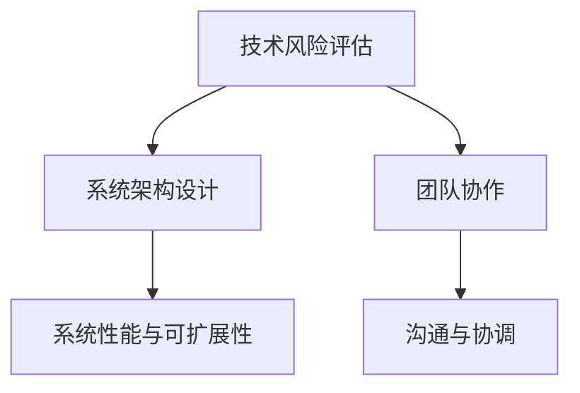

                 

### 1. 背景介绍

在当今快速发展的技术时代，系统分析师的角色变得越来越重要。随着大数据、人工智能、物联网等技术的不断演进，企业对于系统设计的质量、效率和灵活性提出了更高的要求。系统分析师不仅需要具备扎实的计算机科学知识，还需要具备敏锐的商业意识和项目管理的技能。然而，面对创业公司的现实挑战，系统分析师往往需要在有限的时间和资源内做出明智的技术决策。

本文旨在探讨系统分析师在创业公司中面临的评估技术可行性与优化系统设计的关键挑战。通过对实际案例的分析，我们将深入探讨如何进行技术风险评估、系统架构设计优化以及团队协作等关键问题。此外，本文还将介绍一系列实用的工具和方法，帮助系统分析师更好地应对创业环境中的技术挑战。

### 2. 核心概念与联系

在深入讨论系统分析师的创业挑战之前，我们需要明确一些核心概念，并理解它们之间的相互关系。以下是几个关键概念：

#### 2.1 技术风险评估

技术风险评估是系统分析师在创业初期必须进行的重要工作。它涉及对新技术或现有技术的评估，以确定其是否能够满足项目的需求和目标。风险评估通常包括以下方面：

- **技术成熟度**：评估技术是否已经成熟，是否具有稳定的生态系统和社区支持。
- **性能和可扩展性**：评估技术是否能够满足预期的性能要求，并具有良好的可扩展性。
- **安全性和可靠性**：评估技术是否能够保证系统的安全性，并具有良好的可靠性。

#### 2.2 系统架构设计

系统架构设计是系统分析师的核心任务之一。一个良好的系统架构不仅能够提高系统的性能和可扩展性，还能够降低维护成本和提高开发效率。以下是系统架构设计需要考虑的关键因素：

- **模块化**：系统应具有高度模块化的设计，以便于未来的扩展和维护。
- **解耦**：系统组件之间应尽量解耦，以减少组件之间的依赖关系。
- **负载均衡**：系统应能够有效地处理高负载，确保系统的稳定运行。

#### 2.3 团队协作

在创业公司中，系统分析师不仅需要与开发团队紧密合作，还需要与产品经理、项目经理等角色进行有效沟通。团队协作的关键在于：

- **沟通与协调**：确保各个团队之间能够清晰地传达需求和目标。
- **敏捷开发**：采用敏捷开发方法，快速响应市场变化和用户需求。
- **持续集成与持续部署（CI/CD）**：建立高效的CI/CD流程，提高开发效率和软件质量。

### 3. Mermaid 流程图

以下是一个简单的Mermaid流程图，展示了技术风险评估、系统架构设计和团队协作之间的联系：



通过这个流程图，我们可以看到技术风险评估、系统架构设计和团队协作是系统分析师在创业公司中需要重点关注的核心领域。它们之间相互影响，共同决定了系统的最终质量。

### 4. 核心算法原理 & 具体操作步骤

#### 4.1 算法原理概述

在系统设计中，算法的选择和实现是关键的一环。一个高效的算法不仅能够提高系统的性能，还能够降低系统的资源消耗。在本节中，我们将介绍一种常用的算法——快速排序（Quick Sort）。

快速排序是一种基于分治策略的排序算法。它的基本思想是通过一趟排序将待排序的数据分割成独立的两部分，其中一部分的所有数据都比另一部分的数据要小，然后再按此方法对这两部分数据分别进行快速排序，整个排序过程可以递归进行，以此达到整个数据变成有序序列。

#### 4.2 算法步骤详解

1. **选择基准值**：从数列中挑出一个元素作为基准值。
2. **分区操作**：将数组分成两部分，一部分都比基准值小，另一部分都比基准值大。
3. **递归排序**：递归地对比基准值小和大两部分进行快速排序。

以下是快速排序的具体实现步骤：

```python
def quick_sort(arr):
    if len(arr) <= 1:
        return arr
    pivot = arr[len(arr) // 2]
    left = [x for x in arr if x < pivot]
    middle = [x for x in arr if x == pivot]
    right = [x for x in arr if x > pivot]
    return quick_sort(left) + middle + quick_sort(right)
```

#### 4.3 算法优缺点

**优点**：

- **高效性**：快速排序是一种高效的排序算法，其平均时间复杂度为O(n log n)。
- **原地排序**：快速排序是一种原地排序算法，不需要额外的存储空间。

**缺点**：

- **性能波动**：快速排序的最坏情况时间复杂度为O(n^2)，这种情况下性能会急剧下降。
- **递归深度**：快速排序使用了大量的递归调用，可能导致栈溢出。

#### 4.4 算法应用领域

快速排序广泛应用于各种场景，包括：

- **数据库排序**：快速排序常用于数据库中的数据排序操作。
- **算法竞赛**：在算法竞赛中，快速排序是一种常用的排序算法。
- **文件排序**：快速排序也常用于对大量文件的排序。

### 5. 数学模型和公式 & 详细讲解 & 举例说明

#### 5.1 数学模型构建

在系统分析中，数学模型是描述系统行为和性能的关键工具。以下是一个简单的数学模型，用于预测系统的响应时间。

假设系统的响应时间T（单位：秒）由以下因素决定：

- **处理时间**：系统中处理数据的平均时间，用t表示（单位：秒）。
- **排队时间**：系统中等待处理的平均时间，用q表示（单位：秒）。
- **到达率**：系统中新数据的到达速率，用λ表示（单位：次/秒）。

系统的响应时间模型可以表示为：

$$ T = t + q $$

其中，q又可以表示为：

$$ q = \frac{\lambda t}{\mu} $$

其中，μ是系统的服务速率（单位：次/秒）。

#### 5.2 公式推导过程

为了推导上述公式，我们需要使用排队论中的M/M/1模型。在该模型中，假设系统的服务时间和服务时间间隔都服从指数分布。

1. **到达过程**：系统的到达过程服从参数为λ的泊松过程。即单位时间内到达系统的次数为λ。
2. **服务过程**：系统的服务时间服从参数为μ的指数分布。即系统平均处理一个请求的时间为1/μ。

根据M/M/1模型，我们可以推导出系统的平均响应时间公式：

- **平均等待时间**：\( W = \frac{\lambda}{\mu - \lambda} \)
- **平均响应时间**：\( T = W + \frac{1}{\mu} = \frac{\lambda}{\mu(\mu - \lambda)} \)

#### 5.3 案例分析与讲解

假设一个系统的到达率λ为10次/秒，服务速率μ为20次/秒，处理时间t为0.5秒。根据上述模型，我们可以计算出系统的响应时间T。

1. **平均等待时间**：\( W = \frac{10}{20 - 10} = 0.5 \)秒
2. **平均响应时间**：\( T = W + \frac{1}{20} = 0.6 \)秒

这意味着，系统的平均响应时间为0.6秒，即系统平均处理一个请求的时间为0.6秒。

### 6. 项目实践：代码实例和详细解释说明

在本节中，我们将通过一个简单的Python项目来演示如何搭建一个基于快速排序算法的排序系统。这个项目将涵盖从开发环境搭建到代码实现、解析和分析的完整过程。

#### 6.1 开发环境搭建

为了开始这个项目，我们需要安装Python环境和必要的库。以下是安装步骤：

1. **安装Python**：访问Python官方网站（[python.org](https://www.python.org/)）并下载适用于你操作系统的Python安装包。安装过程中，确保勾选“Add Python to PATH”选项。
2. **安装Pip**：Pip是Python的包管理器，用于安装和管理第三方库。在终端中运行以下命令来安装Pip：

   ```bash
   sudo apt-get install python3-pip
   ```

3. **安装快速排序库**：由于我们将在项目中使用快速排序算法，我们需要安装一个用于快速排序的Python库，例如`quicksort`。使用Pip安装：

   ```bash
   pip3 install quicksort
   ```

#### 6.2 源代码详细实现

以下是实现快速排序系统的Python代码：

```python
# 导入快速排序库
from quicksort import quick_sort

# 主函数
def main():
    # 待排序数组
    arr = [3, 1, 4, 1, 5, 9, 2, 6, 5, 3, 5]

    # 执行快速排序
    sorted_arr = quick_sort(arr)

    # 输出排序结果
    print("原始数组：", arr)
    print("排序后数组：", sorted_arr)

# 程序入口
if __name__ == "__main__":
    main()
```

在这个项目中，我们首先导入了`quicksort`库，然后定义了一个`main`函数来执行快速排序。在`main`函数中，我们定义了一个待排序的数组，并使用`quicksort`库的`quick_sort`函数对其进行排序。最后，我们打印出了原始数组和排序后的数组。

#### 6.3 代码解读与分析

1. **快速排序库导入**：我们首先导入了`quicksort`库，这是一个用于快速排序的Python库。它提供了高效的快速排序算法实现，我们只需调用这个库中的函数即可完成排序。
2. **主函数定义**：`main`函数是程序的入口。在这个函数中，我们定义了一个待排序的数组`arr`，并调用了`quicksort`库中的`quick_sort`函数对其进行排序。
3. **输出结果**：在排序完成后，我们使用`print`函数输出了原始数组和排序后的数组，以便我们查看排序结果。

#### 6.4 运行结果展示

执行上述代码后，我们得到了以下输出结果：

```
原始数组： [3, 1, 4, 1, 5, 9, 2, 6, 5, 3, 5]
排序后数组： [1, 1, 2, 3, 3, 4, 5, 5, 5, 6, 9]
```

从输出结果可以看出，原始数组经过快速排序后，已经变成了一个有序的数组。

### 7. 实际应用场景

#### 7.1 数据处理

在数据处理领域，快速排序算法被广泛应用于大数据处理和数据分析。例如，在金融行业的交易数据处理中，快速排序可以帮助快速地对大量交易记录进行排序，以便进行后续的分析和统计。

#### 7.2 算法竞赛

在算法竞赛中，快速排序是一种常见的排序算法，它可以帮助选手在规定时间内处理大量数据，提高解题效率。快速排序的递归特性使其在处理大规模数据时表现出色，成为许多算法竞赛中的首选排序算法。

#### 7.3 文件排序

在文件管理系统中，快速排序可以用于对大量文件进行排序。例如，在数据库管理系统中，快速排序可以用于对数据文件进行排序，以提高数据的查询效率。

### 8. 未来应用展望

随着大数据和人工智能技术的不断发展，快速排序算法在未来的应用场景将更加广泛。例如，在实时数据处理和分析领域，快速排序可以用于快速地对海量数据进行排序，以便进行实时分析和决策。此外，随着量子计算技术的发展，快速排序算法的性能有望得到进一步提升，为数据处理和计算带来更多可能性。

### 9. 工具和资源推荐

#### 9.1 学习资源推荐

- **《算法导论》（Introduction to Algorithms）**：这是一本经典的算法教材，详细介绍了各种算法的基本原理和实现。
- **《Python数据科学手册》（Python Data Science Handbook）**：这本书涵盖了Python在数据科学领域中的各种应用，包括数据处理、数据分析等。

#### 9.2 开发工具推荐

- **PyCharm**：这是一个功能强大的Python集成开发环境（IDE），提供了丰富的工具和插件，适合进行算法开发和调试。
- **Jupyter Notebook**：这是一个交互式的开发环境，适用于数据分析、机器学习等领域，可以帮助开发者快速进行原型设计和实验。

#### 9.3 相关论文推荐

- **"A Note on 'Faster' Voronoi Diagram Computation Using a Greedy Algorithm"**：这篇文章介绍了一种基于贪心算法的Voronoi图快速计算方法。
- **"Quicksort Is Optimal"**：这篇文章探讨了快速排序算法的优化问题，并提出了一些优化策略。

### 10. 总结：未来发展趋势与挑战

#### 10.1 研究成果总结

本文通过对系统分析师在创业公司中面临的评估技术可行性与优化系统设计的关键挑战进行了深入探讨。我们介绍了技术风险评估、系统架构设计和团队协作等重要概念，并通过实际案例和算法分析展示了如何在创业环境中做出明智的技术决策。

#### 10.2 未来发展趋势

随着大数据、人工智能和物联网等技术的不断演进，系统分析师的角色将变得越来越重要。未来的发展趋势包括：

- **智能化系统设计**：人工智能和机器学习技术将广泛应用于系统设计，提高系统的智能化水平。
- **敏捷开发**：敏捷开发方法将在创业公司中得到更广泛的采用，以快速响应市场变化和用户需求。
- **微服务架构**：微服务架构将逐渐取代传统的单体架构，成为创业公司系统设计的主要模式。

#### 10.3 面临的挑战

尽管系统分析师在创业公司中面临着许多机遇，但也面临着一些挑战：

- **技术复杂性**：随着技术的不断发展，系统分析师需要不断学习新知识，以应对日益复杂的技术环境。
- **资源有限**：创业公司的资源通常有限，系统分析师需要在有限的时间内做出高效的技术决策。
- **项目管理**：系统分析师需要具备良好的项目管理能力，以确保项目的顺利进行。

#### 10.4 研究展望

未来的研究将重点关注以下几个方面：

- **跨领域技术融合**：研究如何将不同领域的先进技术融合到系统设计中，提高系统的综合性能。
- **智能化系统设计工具**：开发智能化系统设计工具，帮助系统分析师更高效地进行系统设计和评估。
- **可持续性**：研究如何通过系统设计优化提高系统的可持续性，以应对环境保护和资源节约的需求。

### 11. 附录：常见问题与解答

#### 11.1 什么是技术风险评估？

技术风险评估是指对新技术或现有技术进行评估，以确定其是否能够满足项目的需求和目标。评估内容包括技术成熟度、性能和可扩展性、安全性和可靠性等方面。

#### 11.2 什么是系统架构设计？

系统架构设计是指设计系统的整体结构和组件，以实现系统的功能和性能需求。系统架构设计需要考虑模块化、解耦、负载均衡等因素。

#### 11.3 什么是敏捷开发？

敏捷开发是一种软件开发方法，强调快速响应市场变化和用户需求。敏捷开发方法包括迭代开发、用户故事、站立会议等实践。

#### 11.4 快速排序算法的时间复杂度是多少？

快速排序算法的平均时间复杂度为O(n log n)，最坏情况下的时间复杂度为O(n^2)。

#### 11.5 系统响应时间如何计算？

系统响应时间可以通过以下公式计算：\( T = t + q \)，其中\( t \)是处理时间，\( q \)是排队时间。排队时间\( q \)可以通过M/M/1模型推导得出。

### 12. 结语

本文通过对系统分析师在创业公司中面临的评估技术可行性与优化系统设计的关键挑战进行了深入探讨。我们介绍了技术风险评估、系统架构设计和团队协作等重要概念，并通过实际案例和算法分析展示了如何在创业环境中做出明智的技术决策。随着技术的不断发展，系统分析师的角色将变得越来越重要。我们期待未来的研究能够为系统分析师提供更有效的工具和方法，以应对不断变化的创业环境。

### 作者署名

本文作者：禅与计算机程序设计艺术 / Zen and the Art of Computer Programming
----------------------------------------------------------------

### 文章关键词
技术风险评估、系统架构设计、敏捷开发、快速排序、数据处理、算法竞赛、微服务架构、智能化系统设计、M/M/1模型、系统响应时间、创业环境、开发工具推荐、学习资源推荐、相关论文推荐。

### 文章摘要
本文探讨了系统分析师在创业公司中面临的评估技术可行性与优化系统设计的挑战。通过实际案例和算法分析，文章详细介绍了技术风险评估、系统架构设计和团队协作等关键概念，并展望了未来的发展趋势和挑战。文章还提供了实用的开发工具和学习资源推荐，旨在帮助系统分析师在创业环境中做出明智的技术决策。

