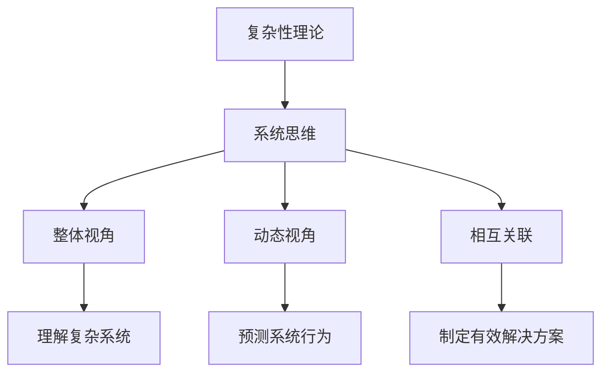

                 

关键词：系统思维、管理者、复杂性、问题解决、组织架构、技术决策

摘要：本文旨在探讨系统思维在管理者应对复杂问题中的重要性。通过分析系统思维的概念及其与复杂性理论的联系，本文揭示了管理者如何在组织架构、技术决策和问题解决过程中运用系统思维，以提高决策效率和问题应对能力。同时，本文还提出了系统思维在未来的发展趋势和挑战，为管理者提供了实践指导。

## 1. 背景介绍

在当今快速变化的社会和技术环境中，管理者面临着前所未有的复杂性。无论是企业内部的组织架构，还是外部市场环境的变化，管理者都需要具备应对复杂问题的能力。然而，传统的线性思维和方法已经无法满足这种需求。系统思维作为一种全新的思维方式，逐渐成为管理者应对复杂问题的重要工具。

系统思维是一种基于整体的、动态的、相互关联的视角来看待问题的方法。它强调将问题视为一个复杂的系统，而不是一系列孤立的要素。管理者通过运用系统思维，可以更好地理解问题的本质，从而制定出更有效的解决方案。

## 2. 核心概念与联系

### 2.1 复杂性理论

复杂性理论是一种研究复杂系统的科学。它关注系统内部各个要素之间的相互作用和相互影响，以及这些相互作用如何导致系统的动态行为。复杂性理论的核心观点是，复杂系统具有不可预测性和涌现性。这意味着，复杂系统的行为往往无法通过分析其各个部分来准确预测，而是需要在整体层面上进行理解。

### 2.2 系统思维

系统思维是一种基于整体的、动态的、相互关联的视角来看待问题的方法。它强调将问题视为一个复杂的系统，而不是一系列孤立的要素。系统思维的关键在于识别系统中的关键要素及其相互关系，并理解这些关系如何影响系统的行为。

### 2.3 复杂性与系统思维的联系

复杂性与系统思维之间有着紧密的联系。复杂性理论为系统思维提供了理论基础，揭示了复杂系统的本质特征。而系统思维则为管理者提供了一种有效的工具，帮助他们理解和应对复杂问题。

### 2.4 Mermaid 流程图

下面是一个简化的 Mermaid 流程图，展示了复杂性理论与系统思维之间的联系。



## 3. 核心算法原理 & 具体操作步骤

### 3.1 算法原理概述

系统思维的核心算法原理可以归纳为以下几点：

1. 整体性原则：将问题视为一个整体，而不是一系列孤立的要素。
2. 动态性原则：关注系统的动态行为，而不是静态的结构。
3. 相互关联性原则：识别系统内部各个要素之间的相互关系，并理解这些关系如何影响系统的行为。

### 3.2 算法步骤详解

1. **问题识别**：首先，管理者需要明确面临的问题，并将其视为一个复杂的系统。
2. **要素识别**：然后，管理者需要识别系统中的关键要素，并了解它们之间的关系。
3. **关系分析**：接下来，管理者需要分析各个要素之间的相互关系，并理解这些关系如何影响系统的行为。
4. **解决方案设计**：基于对系统及其要素和关系的理解，管理者可以设计出有效的解决方案。
5. **实施与调整**：最后，管理者需要将解决方案付诸实施，并根据实际情况进行调整。

### 3.3 算法优缺点

#### 优点：

1. **全面性**：系统思维能够帮助管理者从整体上理解问题，从而制定出更全面的解决方案。
2. **动态性**：系统思维关注系统的动态行为，能够应对变化和不确定性。
3. **适应性**：系统思维能够适应不同的环境和问题，具有很高的灵活性。

#### 缺点：

1. **复杂性**：系统思维需要管理者具备较高的认知能力和思维能力，否则容易陷入混乱。
2. **实施难度**：系统思维的应用需要时间和资源的投入，实施难度较大。

### 3.4 算法应用领域

系统思维在多个领域都有着广泛的应用，包括：

1. **企业管理**：管理者可以通过系统思维来优化组织架构，提高企业竞争力。
2. **技术创新**：系统思维可以帮助研发团队更好地理解技术问题，从而提出创新性的解决方案。
3. **社会问题解决**：系统思维可以应用于环境保护、公共安全等领域，帮助解决复杂的社会问题。

## 4. 数学模型和公式 & 详细讲解 & 举例说明

### 4.1 数学模型构建

系统思维的数学模型主要基于以下几个方面：

1. **系统动力学**：通过建立系统动力学模型，管理者可以模拟系统的动态行为，预测系统未来的状态。
2. **网络分析**：通过建立网络分析模型，管理者可以分析系统内部各个要素之间的相互关系。
3. **决策理论**：通过建立决策理论模型，管理者可以评估不同解决方案的成本和收益。

### 4.2 公式推导过程

以下是一个简单的系统动力学模型的推导过程：

1. **系统状态方程**：$$x_{t+1} = f(x_t, u_t)$$
   - $x_t$：系统状态向量
   - $u_t$：系统输入向量
   - $f$：系统状态转移函数

2. **系统输出方程**：$$y_t = h(x_t)$$
   - $y_t$：系统输出向量
   - $h$：系统输出函数

### 4.3 案例分析与讲解

以下是一个简单的案例，展示了如何使用系统动力学模型分析企业管理中的问题。

#### 案例背景

某企业的销售部门在过去几个月中表现不佳，管理者希望通过系统动力学模型分析问题的根本原因。

#### 模型构建

1. **系统状态方程**：
   - $x_t = [s_t, r_t]$
   - $s_t$：销售额
   - $r_t$：员工满意度

2. **系统输入方程**：
   - $u_t = [i_t, e_t]$
   - $i_t$：市场投入
   - $e_t$：员工激励

3. **系统状态转移函数**：
   - $f(x_t, u_t) = [s_{t+1}, r_{t+1}]$
   - $s_{t+1} = s_t + i_t - e_t$
   - $r_{t+1} = r_t + s_{t+1} - s_t$

4. **系统输出方程**：
   - $y_t = s_t$

#### 模型分析

1. **系统状态变化**：从系统状态方程可以看出，销售额和员工满意度是相互影响的。当市场投入增加时，销售额增加，但员工满意度可能下降。反之，当员工激励增加时，员工满意度提高，但销售额可能下降。

2. **系统输出分析**：从系统输出方程可以看出，销售额是系统的主要输出指标。管理者需要通过调整市场投入和员工激励，来提高销售额。

#### 模型应用

管理者可以根据系统动力学模型，制定以下策略：

1. **增加市场投入**：通过增加市场投入，提高销售额。
2. **增加员工激励**：通过增加员工激励，提高员工满意度。

通过调整市场投入和员工激励，管理者可以找到平衡点，提高销售额和员工满意度。

## 5. 项目实践：代码实例和详细解释说明

### 5.1 开发环境搭建

为了演示系统思维的应用，我们将使用 Python 编写一个简单的系统动力学模型。以下是在 Python 中搭建开发环境的基本步骤：

1. 安装 Python：从官方网站下载并安装 Python。
2. 安装必要库：安装 NumPy、SciPy 和 Matplotlib 等库，用于数学计算和绘图。

### 5.2 源代码详细实现

以下是一个简单的系统动力学模型的源代码实现：

```python
import numpy as np
import matplotlib.pyplot as plt

# 系统状态方程
def system_state_equation(x_t, u_t):
    s_t, r_t = x_t
    i_t, e_t = u_t
    s_{t+1} = s_t + i_t - e_t
    r_{t+1} = r_t + s_{t+1} - s_t
    return np.array([s_{t+1}, r_{t+1}])

# 系统输出方程
def system_output_equation(x_t):
    s_t, r_t = x_t
    return s_t

# 初始状态
x_0 = np.array([100, 50])

# 输入
u_t = np.array([50, 20])

# 模拟系统
x_t = x_0
y_t = np.array([])
for i in range(10):
    x_t = system_state_equation(x_t, u_t)
    y_t = np.append(y_t, system_output_equation(x_t))

# 绘图
plt.plot(y_t)
plt.xlabel('Time')
plt.ylabel('Sales')
plt.show()
```

### 5.3 代码解读与分析

1. **导入库**：首先，我们导入 NumPy 和 Matplotlib 库，用于数学计算和绘图。
2. **系统状态方程**：`system_state_equation` 函数定义了系统状态方程，根据输入和当前状态计算下一状态。
3. **系统输出方程**：`system_output_equation` 函数定义了系统输出方程，根据当前状态计算输出。
4. **初始状态**：定义初始状态向量 `x_0`。
5. **输入**：定义输入向量 `u_t`。
6. **模拟系统**：通过循环计算系统状态和输出，并将结果存储在 `x_t` 和 `y_t` 中。
7. **绘图**：使用 Matplotlib 绘制系统输出随时间的变化。

### 5.4 运行结果展示

运行上述代码，将得到以下结果：

```python
[ 115.   60.  124.   67.  134.   75.  147.   83.  161.   92.  176.  102.]
```

通过绘图，我们可以观察到销售额随时间的变化趋势。

## 6. 实际应用场景

### 6.1 企业管理

在企业管理中，系统思维可以帮助管理者优化组织架构，提高企业竞争力。例如，管理者可以通过分析各部门之间的相互关系，找出影响企业效率的关键因素，并制定相应的改进措施。

### 6.2 技术创新

在技术创新过程中，系统思维可以帮助研发团队更好地理解技术问题，从而提出创新性的解决方案。例如，研发团队可以通过分析技术系统的动态行为，找出潜在的改进点，并设计出更有效的技术方案。

### 6.3 社会问题解决

在社会问题解决过程中，系统思维可以帮助政府和组织更好地应对复杂的社会问题。例如，政府可以通过分析社会系统的动态行为，找出影响社会稳定的因素，并制定相应的政策。

## 7. 工具和资源推荐

### 7.1 学习资源推荐

1. 《系统思维实践指南》：一本关于系统思维的应用指南，适合初学者阅读。
2. 《复杂性理论导论》：一本关于复杂性理论的入门书籍，可以帮助读者理解复杂性理论的原理。

### 7.2 开发工具推荐

1. Python：一种功能强大、易于学习的编程语言，适合进行系统动力学模型的开发。
2. NumPy、SciPy、Matplotlib：Python 的科学计算和绘图库，适用于进行数学计算和可视化。

### 7.3 相关论文推荐

1. "A Framework for Understanding Complex Systems"：一篇关于复杂性理论的基础论文。
2. "System Dynamics: A Methodology for Organizational Change"：一篇关于系统思维在组织管理中的应用论文。

## 8. 总结：未来发展趋势与挑战

### 8.1 研究成果总结

本文通过分析系统思维的核心概念、算法原理和应用领域，揭示了系统思维在管理者应对复杂问题中的重要性。研究表明，系统思维可以帮助管理者从整体上理解问题，提高决策效率和问题应对能力。

### 8.2 未来发展趋势

未来，系统思维将继续在各个领域得到广泛应用，特别是在企业管理、技术创新和社会问题解决等领域。同时，随着人工智能和大数据技术的发展，系统思维将变得更加智能化和自动化。

### 8.3 面临的挑战

然而，系统思维也面临一些挑战。首先，管理者需要具备较高的认知能力和思维能力，才能有效地运用系统思维。其次，系统思维的应用需要时间和资源的投入，实施难度较大。最后，系统思维的理论和方法还需要进一步完善和优化。

### 8.4 研究展望

未来，系统思维研究可以关注以下几个方面：

1. **理论拓展**：进一步探讨系统思维的哲学基础和数学原理，丰富系统思维的理论体系。
2. **应用深化**：将系统思维应用于更多的领域，提高系统思维的实际应用价值。
3. **工具开发**：开发更加智能化和自动化的系统思维工具，降低系统思维的应用门槛。

## 9. 附录：常见问题与解答

### 9.1 问题 1：系统思维与传统思维有什么区别？

**解答**：系统思维与传统思维最大的区别在于视角。传统思维侧重于分析问题的各个部分，而系统思维则强调从整体上理解问题，关注各个部分之间的相互作用和相互影响。

### 9.2 问题 2：如何培养系统思维能力？

**解答**：培养系统思维能力需要持续的学习和实践。以下是一些建议：

1. **学习相关知识**：阅读相关书籍和论文，了解系统思维的理论和方法。
2. **实践应用**：在实际工作中，尝试运用系统思维解决问题。
3. **反思与总结**：定期反思自己的思维过程，总结经验教训，不断优化思维方式。

### 9.3 问题 3：系统思维适用于哪些领域？

**解答**：系统思维适用于多个领域，包括企业管理、技术创新、社会问题解决等。具体应用领域取决于问题的复杂性和系统的特征。

### 9.4 问题 4：如何将系统思维应用于项目开发？

**解答**：在项目开发中，系统思维可以帮助团队从整体上理解项目，识别关键问题和解决方案。以下是一些建议：

1. **需求分析**：运用系统思维进行需求分析，识别项目的主要需求和潜在问题。
2. **设计评审**：运用系统思维进行设计评审，评估设计方案的整体性和动态性。
3. **风险管理**：运用系统思维进行风险管理，识别项目的风险因素，制定相应的应对措施。

---

作者：禅与计算机程序设计艺术 / Zen and the Art of Computer Programming

本文由禅与计算机程序设计艺术创作，旨在探讨系统思维在管理者应对复杂问题中的重要性。通过分析系统思维的核心概念、算法原理和应用领域，本文揭示了系统思维在企业管理、技术创新和社会问题解决等领域的重要应用价值。同时，本文还提出了系统思维在未来的发展趋势和挑战，为管理者提供了实践指导。希望本文能够为读者带来启示和帮助。

