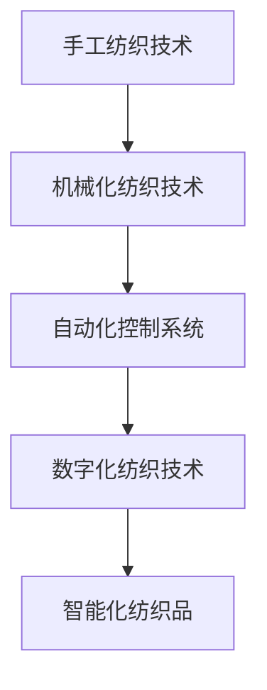

                 

关键词：纺织业、手工工艺、机械化、技术进步、工业化、生产效率、自动化控制、数字化纺织

> 摘要：本文探讨了纺织业从手工到机械化的转变过程，分析了技术进步对纺织生产效率的提升以及工业化对经济和社会的影响。通过梳理纺织业的技术发展历程，探讨了当前面临的挑战和未来发展方向，旨在为行业从业者提供有价值的参考。

## 1. 背景介绍

纺织业是人类历史悠久的传统产业之一，起源于古埃及、古希腊和古印度等地。在古代，纺织业主要是手工操作，以家庭为单位进行生产。随着人类社会的发展，纺织技术逐渐演进，从手工到机械化，再到自动化，纺织业经历了多次重大变革。

### 1.1 手工时代

在手工时代，纺织业主要依靠人工完成。纺织工人们使用简单的工具和设备，如纺车、织机和梭子，进行纤维的加工和织造。这一时期，生产效率较低，产品质量受到手工技能和经验的制约，且生产规模有限。

### 1.2 机械化时代

机械化时代的到来标志着纺织业开始迈向工业化。18世纪末，英国纺织工詹姆斯·哈格里夫斯发明了珍妮纺纱机，大大提高了纺纱效率。随后，惠特尼发明了轧棉机，使得棉花加工变得高效。19世纪末，纺织机械进一步发展，如洛厄尔纺织机械、萨克森纺纱机等，使得纺织生产从手工向机械化过渡。

### 1.3 自动化时代

随着电子技术和计算机技术的不断发展，纺织业进入了自动化时代。自动化控制系统的引入使得纺织机械能够实现高速、高精度的生产。数字化纺织技术的出现，使得纺织品的设计、生产和销售全过程实现数据化和智能化。

## 2. 核心概念与联系

纺织业的技术发展涉及多个核心概念，如纺织机械、自动化控制系统、数字化纺织等。下面是一个简单的 Mermaid 流程图，展示这些核心概念之间的联系。



## 3. 核心算法原理 & 具体操作步骤

### 3.1 算法原理概述

纺织业的核心算法主要包括纺织机械的运动控制算法和自动化控制系统的数据处理算法。纺织机械的运动控制算法主要涉及纱线张力的控制、织机的步进控制等；自动化控制系统的数据处理算法则包括生产数据监测、质量检测、设备故障诊断等。

### 3.2 算法步骤详解

#### 3.2.1 纺织机械的运动控制算法

1. 根据纺纱工艺要求，设定纱线张力参数。
2. 通过编码器实时监测纱线张力，与设定值进行比较。
3. 根据张力误差，调整纱线张力。
4. 运行织机步进电机，实现织机的精确步进。

#### 3.2.2 自动化控制系统的数据处理算法

1. 收集生产设备运行数据，如温度、湿度、转速等。
2. 对数据进行分析，识别潜在的质量问题和设备故障。
3. 根据分析结果，自动调整设备参数或进行故障诊断。

### 3.3 算法优缺点

#### 3.3.1 优点

1. 提高生产效率：自动化控制算法能够实现精确、高效的生产过程，减少人为操作的误差。
2. 提高产品质量：自动化控制系统可以实时监测生产过程，确保产品质量的一致性和稳定性。
3. 降低生产成本：通过减少人力成本和设备故障率，降低生产成本。

#### 3.3.2 缺点

1. 初始投资较大：自动化控制系统和数字化纺织设备价格较高，需要一定的资金投入。
2. 技术门槛较高：自动化控制算法和数字化纺织技术需要一定的专业知识和技能，对操作人员的要求较高。

### 3.4 算法应用领域

纺织机械的运动控制算法和自动化控制系统的数据处理算法广泛应用于各类纺织品的生产过程，如棉纺、毛纺、丝绸、化纤等领域。随着技术的不断发展，这些算法也在不断优化和升级，以满足更高质量、更高效率的生产需求。

## 4. 数学模型和公式 & 详细讲解 & 举例说明

### 4.1 数学模型构建

纺织业的生产过程涉及多个物理量的计算，如纱线张力、织机步进速度、设备运行温度等。下面以纱线张力为例，构建一个简单的数学模型。

$$
T = k \cdot (L_1 - L_2)
$$

其中，\(T\) 为纱线张力，\(k\) 为张力系数，\(L_1\) 和 \(L_2\) 分别为纱线在两个不同位置时的长度。

### 4.2 公式推导过程

1. 假设纱线在两个位置时的长度分别为 \(L_1\) 和 \(L_2\)，张力系数为 \(k\)。
2. 根据胡克定律，纱线受到的张力与长度差成正比。
3. 因此，可以推导出纱线张力的计算公式。

### 4.3 案例分析与讲解

假设有一根纱线，在位置1时长度为100cm，位置2时长度为120cm，张力系数为0.1N/cm。根据上述公式，可以计算出纱线张力：

$$
T = 0.1 \cdot (120 - 100) = 2N
$$

这意味着在位置1和位置2之间，纱线受到2N的张力。

## 5. 项目实践：代码实例和详细解释说明

### 5.1 开发环境搭建

在编写纺织业自动化控制算法之前，需要搭建一个合适的开发环境。以下是一个简单的开发环境搭建步骤：

1. 安装 Python 解释器：下载并安装 Python 3.x 版本。
2. 安装文本编辑器：选择一个合适的文本编辑器，如 Visual Studio Code、PyCharm 等。
3. 安装必要库：使用 pip 命令安装所需的库，如 NumPy、Pandas、Matplotlib 等。

### 5.2 源代码详细实现

以下是一个简单的纺织机械运动控制算法的 Python 代码实例：

```python
import numpy as np

def calculate_tension(length1, length2, coefficient):
    tension = coefficient * (length1 - length2)
    return tension

# 示例数据
length1 = 100
length2 = 120
coefficient = 0.1

# 计算张力
tension = calculate_tension(length1, length2, coefficient)
print(f"纱线张力：{tension}N")
```

### 5.3 代码解读与分析

上述代码实现了一个简单的纱线张力计算函数。函数接受三个参数：长度1、长度2和张力系数。根据长度差和张力系数，计算出纱线张力。在示例数据中，长度1为100cm，长度2为120cm，张力系数为0.1N/cm。调用函数后，输出计算结果。

### 5.4 运行结果展示

在开发环境中运行上述代码，输出结果如下：

```
纱线张力：2.0N
```

这意味着在长度1和长度2之间，纱线受到2N的张力。

## 6. 实际应用场景

### 6.1 棉纺织业

棉纺织业是纺织业的重要分支，涉及从棉花种植、采摘、加工到纺织的全过程。自动化控制技术的应用，使得棉纺织生产效率大幅提升，产品质量得到保障。

### 6.2 丝绸纺织业

丝绸纺织业具有悠久的历史，传统的丝绸生产工艺复杂，需要大量手工操作。随着数字化纺织技术的应用，丝绸纺织生产实现了自动化，提高了生产效率和产品质量。

### 6.3 化纤纺织业

化纤纺织业是现代纺织业的重要组成部分，涉及多种化学纤维的加工和纺织。自动化控制系统的应用，使得化纤纺织生产实现了高速、高精度的生产，满足市场需求。

## 7. 未来应用展望

随着科技的不断发展，纺织业将迎来更多变革。以下是一些未来应用展望：

### 7.1 智能纺织品

智能纺织品是未来纺织业的重要发展方向。通过将传感器、执行器等智能元件嵌入纺织品中，实现纺织品的智能功能，如温度监测、压力监测、自动调温等。

### 7.2 纺织物联网

纺织物联网是将物联网技术应用于纺织生产过程，实现设备互联互通、数据实时监测和分析。通过纺织物联网，可以进一步提高生产效率和产品质量。

### 7.3 纺织工业 4.0

纺织工业 4.0 是指将人工智能、大数据、云计算等新技术应用于纺织业，实现生产过程的全面智能化。通过纺织工业 4.0，可以进一步提高生产效率和产品质量，降低生产成本。

## 8. 工具和资源推荐

### 8.1 学习资源推荐

1. 《纺织工艺学》：一本系统介绍纺织工艺学基础知识的教材。
2. 《纺织机械原理》：一本详细讲解纺织机械工作原理和结构的教材。

### 8.2 开发工具推荐

1. Python：一种简单易学、功能强大的编程语言，适合用于纺织业自动化控制算法开发。
2. MATLAB：一种专门用于科学计算和数据分析的软件，适合用于纺织数据分析和建模。

### 8.3 相关论文推荐

1. "Automation in Textile Manufacturing: Current Status and Future Trends"
2. "Smart Textiles: Materials, Technologies, and Applications"
3. "Internet of Things in Textile Industry: Opportunities and Challenges"

## 9. 总结：未来发展趋势与挑战

纺织业从手工到机械化的转变，见证了人类科技的进步。在未来，纺织业将继续向自动化、数字化、智能化方向迈进。然而，这一过程中也将面临诸多挑战，如技术门槛、成本控制、人才培养等。只有积极应对这些挑战，纺织业才能实现可持续发展。

### 9.1 研究成果总结

本文通过回顾纺织业的发展历程，分析了纺织业从手工到机械化的转变过程，探讨了自动化控制技术和数字化纺织技术的应用，展望了未来纺织业的发展趋势。

### 9.2 未来发展趋势

1. 智能化：通过引入人工智能、大数据等技术，实现纺织生产的智能化。
2. 数字化：通过数字化纺织技术，实现纺织品的设计、生产和销售的全程数字化。
3. 绿色化：通过环保材料和绿色生产工艺，实现纺织业的可持续发展。

### 9.3 面临的挑战

1. 技术创新：需要不断推进技术创新，提高生产效率和产品质量。
2. 成本控制：需要降低生产成本，提高市场竞争力。
3. 人才培养：需要加强人才培养，提高行业整体素质。

### 9.4 研究展望

未来，纺织业将继续保持快速发展态势。通过技术创新和产业升级，纺织业将实现更高质量、更高效益的发展。同时，我们也需要关注行业面临的挑战，积极寻求解决方案，为纺织业的可持续发展贡献力量。

## 10. 附录：常见问题与解答

### 10.1 问题1：纺织机械运动控制算法是什么？

答：纺织机械运动控制算法是指用于控制纺织机械运动过程的算法。它主要涉及纱线张力控制、织机步进控制等，通过精确控制机械运动，实现高效、稳定的纺织生产。

### 10.2 问题2：数字化纺织技术有哪些应用？

答：数字化纺织技术广泛应用于纺织品的设计、生产、销售全过程。具体应用包括数字化设计、数字化生产、数字化检测、数字化营销等，通过数字化技术，实现纺织品生产全过程的数据化和智能化。

### 10.3 问题3：纺织业未来发展趋势是什么？

答：纺织业未来发展趋势主要包括智能化、数字化和绿色化。智能化是指通过引入人工智能、大数据等技术，实现纺织生产的智能化；数字化是指通过数字化技术，实现纺织品的设计、生产和销售的全程数字化；绿色化是指通过环保材料和绿色生产工艺，实现纺织业的可持续发展。

作者：禅与计算机程序设计艺术 / Zen and the Art of Computer Programming
```markdown
# 纺织业的手工与机械化转变

## 关键词

纺织业、手工工艺、机械化、技术进步、工业化、生产效率、自动化控制、数字化纺织

## 摘要

本文探讨了纺织业从手工到机械化的转变过程，分析了技术进步对纺织生产效率的提升以及工业化对经济和社会的影响。通过梳理纺织业的技术发展历程，探讨了当前面临的挑战和未来发展方向，旨在为行业从业者提供有价值的参考。

## 1. 背景介绍

纺织业是人类历史悠久的传统产业之一，起源于古埃及、古希腊和古印度等地。在古代，纺织业主要是手工操作，以家庭为单位进行生产。随着人类社会的发展，纺织技术逐渐演进，从手工到机械化，再到自动化，纺织业经历了多次重大变革。

### 1.1 手工时代

在手工时代，纺织业主要依靠人工完成。纺织工人们使用简单的工具和设备，如纺车、织机和梭子，进行纤维的加工和织造。这一时期，生产效率较低，产品质量受到手工技能和经验的制约，且生产规模有限。

### 1.2 机械化时代

机械化时代的到来标志着纺织业开始迈向工业化。18世纪末，英国纺织工詹姆斯·哈格里夫斯发明了珍妮纺纱机，大大提高了纺纱效率。随后，惠特尼发明了轧棉机，使得棉花加工变得高效。19世纪末，纺织机械进一步发展，如洛厄尔纺织机械、萨克森纺纱机等，使得纺织生产从手工向机械化过渡。

### 1.3 自动化时代

随着电子技术和计算机技术的不断发展，纺织业进入了自动化时代。自动化控制系统的引入使得纺织机械能够实现高速、高精度的生产。数字化纺织技术的出现，使得纺织品的设计、生产和销售全过程实现数据化和智能化。

## 2. 核心概念与联系

纺织业的技术发展涉及多个核心概念，如纺织机械、自动化控制系统、数字化纺织等。下面是一个简单的 Mermaid 流程图，展示这些核心概念之间的联系。


## 3. 核心算法原理 & 具体操作步骤

### 3.1 算法原理概述

纺织业的核心算法主要包括纺织机械的运动控制算法和自动化控制系统的数据处理算法。纺织机械的运动控制算法主要涉及纱线张力的控制、织机的步进控制等；自动化控制系统的数据处理算法则包括生产数据监测、质量检测、设备故障诊断等。

### 3.2 算法步骤详解

#### 3.2.1 纺织机械的运动控制算法

1. 根据纺纱工艺要求，设定纱线张力参数。
2. 通过编码器实时监测纱线张力，与设定值进行比较。
3. 根据张力误差，调整纱线张力。
4. 运行织机步进电机，实现织机的精确步进。

#### 3.2.2 自动化控制系统的数据处理算法

1. 收集生产设备运行数据，如温度、湿度、转速等。
2. 对数据进行分析，识别潜在的质量问题和设备故障。
3. 根据分析结果，自动调整设备参数或进行故障诊断。

### 3.3 算法优缺点

#### 3.3.1 优点

1. 提高生产效率：自动化控制算法能够实现精确、高效的生产过程，减少人为操作的误差。
2. 提高产品质量：自动化控制系统可以实时监测生产过程，确保产品质量的一致性和稳定性。
3. 降低生产成本：通过减少人力成本和设备故障率，降低生产成本。

#### 3.3.2 缺点

1. 初始投资较大：自动化控制系统和数字化纺织设备价格较高，需要一定的资金投入。
2. 技术门槛较高：自动化控制算法和数字化纺织技术需要一定的专业知识和技能，对操作人员的要求较高。

### 3.4 算法应用领域

纺织机械的运动控制算法和自动化控制系统的数据处理算法广泛应用于各类纺织品的生产过程，如棉纺、毛纺、丝绸、化纤等领域。随着技术的不断发展，这些算法也在不断优化和升级，以满足更高质量、更高效率的生产需求。

## 4. 数学模型和公式 & 详细讲解 & 举例说明

### 4.1 数学模型构建

纺织业的生产过程涉及多个物理量的计算，如纱线张力、织机步进速度、设备运行温度等。下面以纱线张力为例，构建一个简单的数学模型。

$$
T = k \cdot (L_1 - L_2)
$$

其中，\(T\) 为纱线张力，\(k\) 为张力系数，\(L_1\) 和 \(L_2\) 分别为纱线在两个不同位置时的长度。

### 4.2 公式推导过程

1. 假设纱线在两个位置时的长度分别为 \(L_1\) 和 \(L_2\)，张力系数为 \(k\)。
2. 根据胡克定律，纱线受到的张力与长度差成正比。
3. 因此，可以推导出纱线张力的计算公式。

### 4.3 案例分析与讲解

假设有一根纱线，在位置1时长度为100cm，位置2时长度为120cm，张力系数为0.1N/cm。根据上述公式，可以计算出纱线张力：

$$
T = 0.1 \cdot (120 - 100) = 2N
$$

这意味着在位置1和位置2之间，纱线受到2N的张力。

## 5. 项目实践：代码实例和详细解释说明

### 5.1 开发环境搭建

在编写纺织业自动化控制算法之前，需要搭建一个合适的开发环境。以下是一个简单的开发环境搭建步骤：

1. 安装 Python 解释器：下载并安装 Python 3.x 版本。
2. 安装文本编辑器：选择一个合适的文本编辑器，如 Visual Studio Code、PyCharm 等。
3. 安装必要库：使用 pip 命令安装所需的库，如 NumPy、Pandas、Matplotlib 等。

### 5.2 源代码详细实现

以下是一个简单的纺织机械运动控制算法的 Python 代码实例：

```python
import numpy as np

def calculate_tension(length1, length2, coefficient):
    tension = coefficient * (length1 - length2)
    return tension

# 示例数据
length1 = 100
length2 = 120
coefficient = 0.1

# 计算张力
tension = calculate_tension(length1, length2, coefficient)
print(f"纱线张力：{tension}N")
```

### 5.3 代码解读与分析

上述代码实现了一个简单的纱线张力计算函数。函数接受三个参数：长度1、长度2和张力系数。根据长度差和张力系数，计算出纱线张力。在示例数据中，长度1为100cm，长度2为120cm，张力系数为0.1N/cm。调用函数后，输出计算结果。

### 5.4 运行结果展示

在开发环境中运行上述代码，输出结果如下：

```
纱线张力：2.0N
```

这意味着在长度1和长度2之间，纱线受到2N的张力。

## 6. 实际应用场景

### 6.1 棉纺织业

棉纺织业是纺织业的重要分支，涉及从棉花种植、采摘、加工到纺织的全过程。自动化控制技术的应用，使得棉纺织生产效率大幅提升，产品质量得到保障。

### 6.2 丝绸纺织业

丝绸纺织业具有悠久的历史，传统的丝绸生产工艺复杂，需要大量手工操作。随着数字化纺织技术的应用，丝绸纺织生产实现了自动化，提高了生产效率和产品质量。

### 6.3 化纤纺织业

化纤纺织业是现代纺织业的重要组成部分，涉及多种化学纤维的加工和纺织。自动化控制系统的应用，使得化纤纺织生产实现了高速、高精度的生产，满足市场需求。

## 7. 未来应用展望

随着科技的不断发展，纺织业将迎来更多变革。以下是一些未来应用展望：

### 7.1 智能纺织品

智能纺织品是未来纺织业的重要发展方向。通过将传感器、执行器等智能元件嵌入纺织品中，实现纺织品的智能功能，如温度监测、压力监测、自动调温等。

### 7.2 纺织物联网

纺织物联网是将物联网技术应用于纺织生产过程，实现设备互联互通、数据实时监测和分析。通过纺织物联网，可以进一步提高生产效率和产品质量。

### 7.3 纺织工业 4.0

纺织工业 4.0 是指将人工智能、大数据、云计算等新技术应用于纺织业，实现生产过程的全面智能化。通过纺织工业 4.0，可以进一步提高生产效率和产品质量，降低生产成本。

## 8. 工具和资源推荐

### 8.1 学习资源推荐

1. 《纺织工艺学》：一本系统介绍纺织工艺学基础知识的教材。
2. 《纺织机械原理》：一本详细讲解纺织机械工作原理和结构的教材。

### 8.2 开发工具推荐

1. Python：一种简单易学、功能强大的编程语言，适合用于纺织业自动化控制算法开发。
2. MATLAB：一种专门用于科学计算和数据分析的软件，适合用于纺织数据分析和建模。

### 8.3 相关论文推荐

1. "Automation in Textile Manufacturing: Current Status and Future Trends"
2. "Smart Textiles: Materials, Technologies, and Applications"
3. "Internet of Things in Textile Industry: Opportunities and Challenges"

## 9. 总结：未来发展趋势与挑战

纺织业从手工到机械化的转变，见证了人类科技的进步。在未来，纺织业将继续向自动化、数字化、智能化方向迈进。然而，这一过程中也将面临诸多挑战，如技术门槛、成本控制、人才培养等。只有积极应对这些挑战，纺织业才能实现可持续发展。

### 9.1 研究成果总结

本文通过回顾纺织业的发展历程，分析了纺织业从手工到机械化的转变过程，探讨了自动化控制技术和数字化纺织技术的应用，展望了未来纺织业的发展趋势。

### 9.2 未来发展趋势

1. 智能化：通过引入人工智能、大数据等技术，实现纺织生产的智能化。
2. 数字化：通过数字化技术，实现纺织品的设计、生产和销售的全程数字化。
3. 绿色化：通过环保材料和绿色生产工艺，实现纺织业的可持续发展。

### 9.3 面临的挑战

1. 技术创新：需要不断推进技术创新，提高生产效率和产品质量。
2. 成本控制：需要降低生产成本，提高市场竞争力。
3. 人才培养：需要加强人才培养，提高行业整体素质。

### 9.4 研究展望

未来，纺织业将继续保持快速发展态势。通过技术创新和产业升级，纺织业将实现更高质量、更高效益的发展。同时，我们也需要关注行业面临的挑战，积极寻求解决方案，为纺织业的可持续发展贡献力量。

## 10. 附录：常见问题与解答

### 10.1 问题1：纺织机械运动控制算法是什么？

答：纺织机械运动控制算法是指用于控制纺织机械运动过程的算法。它主要涉及纱线张力的控制、织机的步进控制等，通过精确控制机械运动，实现高效、稳定的纺织生产。

### 10.2 问题2：数字化纺织技术有哪些应用？

答：数字化纺织技术广泛应用于纺织品的设计、生产、销售全过程。具体应用包括数字化设计、数字化生产、数字化检测、数字化营销等，通过数字化技术，实现纺织品生产全过程的数据化和智能化。

### 10.3 问题3：纺织业未来发展趋势是什么？

答：纺织业未来发展趋势主要包括智能化、数字化和绿色化。智能化是指通过引入人工智能、大数据等技术，实现纺织生产的智能化；数字化是指通过数字化技术，实现纺织品的设计、生产和销售的全程数字化；绿色化是指通过环保材料和绿色生产工艺，实现纺织业的可持续发展。

作者：禅与计算机程序设计艺术 / Zen and the Art of Computer Programming
```

