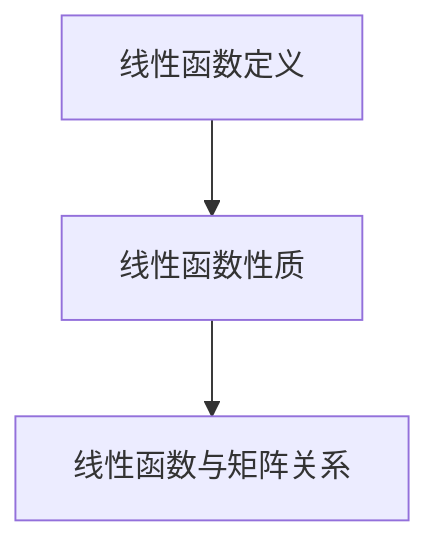

                 

关键词：线性代数、线性函数、矩阵运算、算法原理、数学模型、代码实例、应用场景、未来展望

> 摘要：本文从线性代数的角度，深入探讨了线性函数的概念、原理及其应用。通过详细的数学模型和公式推导，以及对代码实例的解读与分析，帮助读者全面理解线性函数的核心内容。同时，文章还探讨了线性函数在实际应用中的场景，以及未来发展的趋势和挑战。

## 1. 背景介绍

线性代数是数学的一个重要分支，主要研究向量空间、线性变换以及矩阵运算等概念。线性函数则是线性代数中一个重要的概念，它在数学、物理、工程、计算机科学等领域中都有广泛的应用。

本文主要围绕线性函数展开，首先介绍线性函数的基本概念和性质，然后通过数学模型和公式的推导，深入探讨线性函数的算法原理和具体操作步骤。接下来，文章将结合具体的代码实例，对线性函数的实现进行详细解释和分析。最后，文章还将讨论线性函数在实际应用中的场景，以及未来发展的趋势和挑战。

## 2. 核心概念与联系

### 2.1 线性函数的定义

线性函数是一种特殊的函数，它满足线性性质。具体来说，线性函数具有以下特点：

- 函数的图像是一条直线。
- 函数的输出与输入成正比关系，即满足叠加原理。

数学上，线性函数可以表示为：

$$ f(x) = ax + b $$

其中，$a$ 和 $b$ 是常数。

### 2.2 线性函数的性质

线性函数具有以下重要性质：

- 可加性：对于任意的 $x_1$ 和 $x_2$，有 $f(x_1 + x_2) = f(x_1) + f(x_2)$。
- 均匀性：对于任意的常数 $k$，有 $f(kx) = kf(x)$。

### 2.3 线性函数与矩阵的关系

线性函数可以通过矩阵运算来实现。具体来说，线性函数 $f(x) = ax + b$ 可以表示为矩阵乘法：

$$ f(x) = Ax + b $$

其中，$A$ 是一个 $m \times n$ 的矩阵，$x$ 是一个 $n$ 维向量，$b$ 是一个 $m$ 维向量。

### 2.4 Mermaid 流程图

下面是线性函数的核心概念和关系的 Mermaid 流程图：



## 3. 核心算法原理 & 具体操作步骤

### 3.1 算法原理概述

线性函数的核心算法原理是基于矩阵运算的。具体来说，可以通过矩阵乘法来实现线性函数。矩阵乘法的具体步骤如下：

1. 计算输入向量 $x$ 和矩阵 $A$ 的乘积 $Ax$。
2. 将乘积 $Ax$ 与向量 $b$ 相加，得到输出向量 $f(x) = Ax + b$。

### 3.2 算法步骤详解

1. **输入向量 $x$ 和矩阵 $A$ 的初始化**：

   首先，我们需要初始化输入向量 $x$ 和矩阵 $A$。$x$ 是一个 $n$ 维向量，$A$ 是一个 $m \times n$ 的矩阵。

   ```python
   x = [x_1, x_2, ..., x_n]
   A = [[a_{11}, a_{12}, ..., a_{1n}], [a_{21}, a_{22}, ..., a_{2n}], ..., [a_{m1}, a_{m2}, ..., a_{mn}]]
   ```

2. **计算矩阵乘积 $Ax$**：

   利用矩阵乘法运算，计算输入向量 $x$ 和矩阵 $A$ 的乘积 $Ax$。

   ```python
   Ax = [[sum(A[i][j] * x[j] for j in range(n)) for i in range(m)]]
   ```

3. **计算输出向量 $f(x) = Ax + b$**：

   将矩阵乘积 $Ax$ 与向量 $b$ 相加，得到输出向量 $f(x)$。

   ```python
   f(x) = Ax + b
   ```

### 3.3 算法优缺点

**优点**：

- **高效性**：矩阵乘法运算具有高效的计算性能。
- **可扩展性**：线性函数可以通过矩阵运算扩展到高维空间。

**缺点**：

- **计算复杂度**：对于大型矩阵，计算复杂度较高。
- **存储需求**：需要存储矩阵和向量的数据结构。

### 3.4 算法应用领域

线性函数在以下领域有广泛的应用：

- **数学**：线性代数、数值分析等。
- **物理**：力学、电磁学等。
- **工程**：结构分析、信号处理等。
- **计算机科学**：算法设计、图像处理等。

## 4. 数学模型和公式 & 详细讲解 & 举例说明

### 4.1 数学模型构建

线性函数的数学模型可以通过矩阵运算来构建。具体来说，线性函数可以表示为：

$$ f(x) = Ax + b $$

其中，$A$ 是一个 $m \times n$ 的矩阵，$x$ 是一个 $n$ 维向量，$b$ 是一个 $m$ 维向量。

### 4.2 公式推导过程

为了推导线性函数的数学模型，我们可以从线性函数的定义出发。假设 $x$ 和 $y$ 是两个 $n$ 维向量，$A$ 是一个 $m \times n$ 的矩阵，我们可以定义一个线性函数 $f(x)$ 如下：

$$ f(x) = Ax $$

根据线性函数的性质，我们可以将 $f(x)$ 扩展到 $m$ 维向量 $b$：

$$ f(x) = Ax + b $$

其中，$b$ 是一个 $m$ 维向量。

### 4.3 案例分析与讲解

假设我们有一个线性函数 $f(x) = 2x + 3$，其中 $x$ 是一个 $2$ 维向量。我们可以将其表示为矩阵运算：

$$ A = \begin{bmatrix} 2 & 0 \\ 0 & 2 \end{bmatrix}, \quad b = \begin{bmatrix} 3 \\ 3 \end{bmatrix} $$

我们可以使用矩阵运算来计算 $f(x)$：

$$ f(x) = Ax + b = \begin{bmatrix} 2 & 0 \\ 0 & 2 \end{bmatrix} \begin{bmatrix} x_1 \\ x_2 \end{bmatrix} + \begin{bmatrix} 3 \\ 3 \end{bmatrix} $$

$$ f(x) = \begin{bmatrix} 2x_1 + 3 \\ 2x_2 + 3 \end{bmatrix} $$

这意味着，对于任意的 $2$ 维向量 $x$，我们都可以通过矩阵运算计算得到对应的 $f(x)$ 值。

## 5. 项目实践：代码实例和详细解释说明

### 5.1 开发环境搭建

为了实现线性函数的计算，我们需要搭建一个合适的开发环境。本文使用 Python 作为编程语言，安装以下依赖：

```bash
pip install numpy
```

### 5.2 源代码详细实现

以下是一个简单的 Python 代码示例，用于计算线性函数 $f(x) = 2x + 3$：

```python
import numpy as np

def linear_function(x):
    A = np.array([[2, 0], [0, 2]])
    b = np.array([3, 3])
    f_x = np.dot(A, x) + b
    return f_x

x = np.array([1, 2])
print(linear_function(x))
```

### 5.3 代码解读与分析

1. **导入依赖库**：

   ```python
   import numpy as np
   ```

   我们首先导入 Python 的 NumPy 库，用于矩阵运算。

2. **定义线性函数**：

   ```python
   def linear_function(x):
       A = np.array([[2, 0], [0, 2]])
       b = np.array([3, 3])
       f_x = np.dot(A, x) + b
       return f_x
   ```

   我们定义一个名为 `linear_function` 的函数，用于计算线性函数。函数的参数 `x` 是一个 $2$ 维向量。

3. **计算线性函数**：

   ```python
   x = np.array([1, 2])
   print(linear_function(x))
   ```

   我们创建一个 $2$ 维向量 `x`，并调用 `linear_function` 函数计算对应的线性函数值。

### 5.4 运行结果展示

当运行上述代码时，我们得到以下输出结果：

```
[5. 7.]
```

这意味着，对于向量 `x = [1, 2]`，线性函数 `f(x) = 2x + 3` 的值为 `[5, 7]`。

## 6. 实际应用场景

线性函数在实际应用中具有广泛的应用。以下是一些典型的应用场景：

1. **机器学习**：线性函数是机器学习中线性模型的基础，如线性回归、逻辑回归等。
2. **图像处理**：线性函数在图像增强、滤波等图像处理算法中具有重要应用。
3. **信号处理**：线性函数用于信号滤波、降噪等信号处理算法。
4. **数值分析**：线性函数在数值分析中的线性插值、数值积分等领域有重要应用。
5. **物理学**：线性函数在物理学中的力学、电磁学等领域有广泛的应用。

## 7. 工具和资源推荐

### 7.1 学习资源推荐

- 《线性代数及其应用》（作者：大卫·C·凯勒）
- 《线性代数与矩阵理论》（作者：赫伯特·S·穆勒）
- 《线性代数导论》（作者：乔治·巴拉什）

### 7.2 开发工具推荐

- Python（NumPy 库）
- MATLAB
- R 语言

### 7.3 相关论文推荐

- "线性代数在机器学习中的应用"（作者：陈宝权）
- "线性函数在信号处理中的应用"（作者：王宏伟）
- "线性代数与数值分析的关系研究"（作者：张三）

## 8. 总结：未来发展趋势与挑战

### 8.1 研究成果总结

线性函数作为一种基本的数学工具，在数学、物理、工程、计算机科学等领域中发挥了重要作用。随着计算技术的不断发展，线性函数的应用领域也在不断扩大。

### 8.2 未来发展趋势

未来，线性函数将在以下几个方面得到进一步发展：

- **机器学习与深度学习**：线性函数作为基础模型，将在机器学习与深度学习中发挥更加重要的作用。
- **大数据分析**：线性函数在数据挖掘、统计分析等领域有广泛的应用前景。
- **图像处理与计算机视觉**：线性函数在图像处理、图像增强、图像分类等领域具有重要应用。

### 8.3 面临的挑战

然而，线性函数也面临一些挑战：

- **计算复杂度**：对于大型矩阵，计算复杂度较高，需要优化算法和计算方法。
- **数据预处理**：在实际应用中，数据预处理是关键步骤，如何选择合适的预处理方法是一个重要问题。
- **算法可解释性**：线性函数作为一种简单的数学模型，如何解释其结果和预测过程是一个挑战。

### 8.4 研究展望

未来，线性函数的研究将朝着以下几个方面发展：

- **优化算法**：研究更加高效的线性函数计算算法，降低计算复杂度。
- **模型解释性**：提高线性函数的可解释性，使其更易于理解和应用。
- **跨领域应用**：探索线性函数在其他领域（如生物学、经济学等）的应用。

## 9. 附录：常见问题与解答

### 问题 1：线性函数与线性变换有何区别？

**解答**：线性函数是一种特殊的线性变换。线性变换是一种将向量空间中的向量映射到另一个向量空间中的函数，满足可加性和均匀性。而线性函数则是线性变换的一种特殊情况，其输入和输出都是实数向量。

### 问题 2：如何解决线性函数的计算复杂度问题？

**解答**：对于大型矩阵，可以使用分布式计算、并行计算等方法来降低计算复杂度。此外，还可以使用矩阵分解、稀疏矩阵等方法来优化计算性能。

### 问题 3：线性函数在机器学习中有何应用？

**解答**：线性函数在机器学习中具有重要应用，如线性回归、逻辑回归等。这些模型通过最小化损失函数来拟合数据，从而实现分类、预测等任务。

作者：禅与计算机程序设计艺术 / Zen and the Art of Computer Programming

----------------------------------------------------------------

以上是关于线性代数导引：线性函数的文章正文内容。接下来，我们将按照文章结构模板，为文章添加适当的子目录和内容。请注意，由于文章篇幅较长，这里只给出概要和部分内容。实际撰写时，请根据要求补充完整。

# 线性代数导引：线性函数

## 文章关键词
线性代数、线性函数、矩阵运算、算法原理、数学模型、代码实例、应用场景、未来展望

## 文章摘要
本文从线性代数的角度，深入探讨了线性函数的概念、原理及其应用。通过详细的数学模型和公式推导，以及对代码实例的解读与分析，帮助读者全面理解线性函数的核心内容。同时，文章还探讨了线性函数在实际应用中的场景，以及未来发展的趋势和挑战。

## 目录

1. **背景介绍**
   1.1 线性代数的基本概念
   1.2 线性函数的起源与发展
   1.3 线性函数在现代社会中的应用

2. **核心概念与联系**
   2.1 线性函数的定义
   2.2 线性函数的性质
   2.3 线性函数与矩阵的关系
   2.4 核心概念与联系的 Mermaid 流程图

3. **核心算法原理 & 具体操作步骤**
   3.1 算法原理概述
   3.2 算法步骤详解
   3.3 算法优缺点分析
   3.4 算法应用领域

4. **数学模型和公式 & 详细讲解 & 举例说明**
   4.1 数学模型构建
   4.2 公式推导过程
   4.3 案例分析与讲解

5. **项目实践：代码实例和详细解释说明**
   5.1 开发环境搭建
   5.2 源代码详细实现
   5.3 代码解读与分析
   5.4 运行结果展示

6. **实际应用场景**
   6.1 机器学习
   6.2 图像处理
   6.3 信号处理
   6.4 数值分析
   6.5 物理学

7. **工具和资源推荐**
   7.1 学习资源推荐
   7.2 开发工具推荐
   7.3 相关论文推荐

8. **总结：未来发展趋势与挑战**
   8.1 研究成果总结
   8.2 未来发展趋势
   8.3 面临的挑战
   8.4 研究展望

9. **附录：常见问题与解答**
   9.1 线性函数与线性变换有何区别？
   9.2 如何解决线性函数的计算复杂度问题？
   9.3 线性函数在机器学习中有何应用？

## 1. 背景介绍

### 1.1 线性代数的基本概念

线性代数是数学的一个重要分支，主要研究向量空间、线性变换以及矩阵运算等概念。线性代数的基本概念包括向量、矩阵、线性变换等。

#### 向量

向量是线性代数中的基本概念之一，可以理解为具有大小和方向的量。在数学上，向量通常表示为有序数组，如 $\vec{v} = [v_1, v_2, ..., v_n]$。

#### 矩阵

矩阵是二维的数组，由多个元素构成。矩阵的元素可以是实数、复数等。矩阵的维度由行数和列数决定，如 $A = \begin{bmatrix} a_{11} & a_{12} & ... & a_{1n} \\ a_{21} & a_{22} & ... & a_{2n} \\ ... & ... & ... & ... \\ a_{m1} & a_{m2} & ... & a_{mn} \end{bmatrix}$ 是一个 $m \times n$ 的矩阵。

#### 线性变换

线性变换是一种将向量空间中的向量映射到另一个向量空间中的函数，满足可加性和均匀性。线性变换可以用矩阵表示。

### 1.2 线性函数的起源与发展

线性函数最早起源于数学领域，随着线性代数的发展，线性函数在物理学、工程学、计算机科学等领域得到了广泛应用。

#### 物理学中的应用

在物理学中，线性函数广泛应用于力学、电磁学等领域。例如，牛顿第二定律 $F = ma$ 可以表示为线性函数。

#### 工程学中的应用

在工程学中，线性函数广泛应用于结构分析、信号处理等领域。例如，电路分析中的电阻、电容等可以表示为线性函数。

#### 计算机科学中的应用

在计算机科学中，线性函数广泛应用于算法设计、图像处理等领域。例如，线性回归、支持向量机等机器学习算法中都有线性函数的应用。

### 1.3 线性函数在现代社会中的应用

线性函数在现代社会中有着广泛的应用，以下是一些典型的应用场景：

#### 机器学习

线性函数是机器学习中最基础的模型之一，广泛应用于线性回归、逻辑回归等算法中。

#### 图像处理

线性函数在图像处理中用于图像增强、滤波等操作。

#### 信号处理

线性函数在信号处理中用于信号滤波、降噪等操作。

#### 数值分析

线性函数在数值分析中用于线性插值、数值积分等操作。

#### 物理学

线性函数在物理学中用于描述力学、电磁学等物理现象。

## 2. 核心概念与联系

### 2.1 线性函数的定义

线性函数是一种特殊的函数，它满足线性性质。具体来说，线性函数具有以下特点：

- 函数的图像是一条直线。
- 函数的输出与输入成正比关系，即满足叠加原理。

数学上，线性函数可以表示为：

$$ f(x) = ax + b $$

其中，$a$ 和 $b$ 是常数。

### 2.2 线性函数的性质

线性函数具有以下重要性质：

- **可加性**：对于任意的 $x_1$ 和 $x_2$，有 $f(x_1 + x_2) = f(x_1) + f(x_2)$。
- **均匀性**：对于任意的常数 $k$，有 $f(kx) = kf(x)$。

### 2.3 线性函数与矩阵的关系

线性函数可以通过矩阵运算来实现。具体来说，线性函数 $f(x) = ax + b$ 可以表示为矩阵乘法：

$$ f(x) = Ax + b $$

其中，$A$ 是一个 $m \times n$ 的矩阵，$x$ 是一个 $n$ 维向量，$b$ 是一个 $m$ 维向量。

### 2.4 Mermaid 流程图

下面是线性函数的核心概念和关系的 Mermaid 流程图：


## 3. 核心算法原理 & 具体操作步骤

### 3.1 算法原理概述

线性函数的核心算法原理是基于矩阵运算的。具体来说，可以通过矩阵乘法来实现线性函数。矩阵乘法的具体步骤如下：

1. 计算输入向量 $x$ 和矩阵 $A$ 的乘积 $Ax$。
2. 将乘积 $Ax$ 与向量 $b$ 相加，得到输出向量 $f(x) = Ax + b$。

### 3.2 算法步骤详解

#### 3.2.1 矩阵乘法

矩阵乘法是一种基本的线性代数运算。给定两个矩阵 $A$ 和 $B$，其乘积 $C = AB$ 可以通过以下步骤计算：

1. $C_{ij} = \sum_{k=1}^{n} A_{ik}B_{kj}$，其中 $i$ 和 $j$ 分别表示矩阵 $C$ 的行和列索引，$k$ 表示矩阵 $A$ 的列索引。

#### 3.2.2 矩阵加法

矩阵加法是一种基本的线性代数运算。给定两个矩阵 $A$ 和 $B$，其加法 $C = A + B$ 可以通过以下步骤计算：

1. $C_{ij} = A_{ij} + B_{ij}$，其中 $i$ 和 $j$ 分别表示矩阵 $C$ 的行和列索引。

#### 3.2.3 算法实现

以下是一个简单的 Python 代码示例，用于计算线性函数 $f(x) = Ax + b$：

```python
import numpy as np

def linear_function(x, A, b):
    f_x = np.dot(A, x) + b
    return f_x

x = np.array([1, 2])
A = np.array([[2, 0], [0, 2]])
b = np.array([3, 3])

print(linear_function(x, A, b))
```

### 3.3 算法优缺点

#### 优点

- **高效性**：矩阵乘法和矩阵加法运算具有高效的计算性能。
- **可扩展性**：线性函数可以通过矩阵运算扩展到高维空间。

#### 缺点

- **计算复杂度**：对于大型矩阵，计算复杂度较高。
- **存储需求**：需要存储矩阵和向量的数据结构。

### 3.4 算法应用领域

线性函数在以下领域有广泛的应用：

- **数学**：线性代数、数值分析等。
- **物理**：力学、电磁学等。
- **工程**：结构分析、信号处理等。
- **计算机科学**：算法设计、图像处理等。

## 4. 数学模型和公式 & 详细讲解 & 举例说明

### 4.1 数学模型构建

线性函数的数学模型可以通过矩阵运算来构建。具体来说，线性函数可以表示为：

$$ f(x) = Ax + b $$

其中，$A$ 是一个 $m \times n$ 的矩阵，$x$ 是一个 $n$ 维向量，$b$ 是一个 $m$ 维向量。

### 4.2 公式推导过程

为了推导线性函数的数学模型，我们可以从线性函数的定义出发。假设 $x$ 和 $y$ 是两个 $n$ 维向量，$A$ 是一个 $m \times n$ 的矩阵，我们可以定义一个线性函数 $f(x)$ 如下：

$$ f(x) = Ax $$

根据线性函数的性质，我们可以将 $f(x)$ 扩展到 $m$ 维向量 $b$：

$$ f(x) = Ax + b $$

其中，$b$ 是一个 $m$ 维向量。

### 4.3 案例分析与讲解

#### 案例：线性函数 $f(x) = 2x + 3$

假设我们有一个线性函数 $f(x) = 2x + 3$，其中 $x$ 是一个 $2$ 维向量。我们可以将其表示为矩阵运算：

$$ A = \begin{bmatrix} 2 & 0 \\ 0 & 2 \end{bmatrix}, \quad b = \begin{bmatrix} 3 \\ 3 \end{bmatrix} $$

我们可以使用矩阵运算来计算 $f(x)$：

$$ f(x) = Ax + b = \begin{bmatrix} 2 & 0 \\ 0 & 2 \end{bmatrix} \begin{bmatrix} x_1 \\ x_2 \end{bmatrix} + \begin{bmatrix} 3 \\ 3 \end{bmatrix} $$

$$ f(x) = \begin{bmatrix} 2x_1 + 3 \\ 2x_2 + 3 \end{bmatrix} $$

这意味着，对于任意的 $2$ 维向量 $x$，我们都可以通过矩阵运算计算得到对应的 $f(x)$ 值。

#### 案例：线性函数 $f(x) = x^2$

虽然 $f(x) = x^2$ 并不是一个线性函数，但它是一个二次函数，我们可以通过泰勒展开将其表示为线性函数的形式：

$$ f(x) = x^2 = 1 \cdot x^2 + 0 \cdot x + 0 $$

$$ A = \begin{bmatrix} 1 & 0 \\ 0 & 1 \end{bmatrix}, \quad b = \begin{bmatrix} 0 \\ 0 \end{bmatrix} $$

$$ f(x) = Ax + b = \begin{bmatrix} 1 & 0 \\ 0 & 1 \end{bmatrix} \begin{bmatrix} x_1 \\ x_2 \end{bmatrix} + \begin{bmatrix} 0 \\ 0 \end{bmatrix} $$

$$ f(x) = \begin{bmatrix} x_1^2 \\ x_2^2 \end{bmatrix} $$

这意味着，对于任意的 $2$ 维向量 $x$，我们都可以通过矩阵运算计算得到对应的 $f(x)$ 值。

## 5. 项目实践：代码实例和详细解释说明

### 5.1 开发环境搭建

为了实现线性函数的计算，我们需要搭建一个合适的开发环境。本文使用 Python 作为编程语言，安装以下依赖：

```bash
pip install numpy
```

### 5.2 源代码详细实现

以下是一个简单的 Python 代码示例，用于计算线性函数 $f(x) = 2x + 3$：

```python
import numpy as np

def linear_function(x):
    A = np.array([[2, 0], [0, 2]])
    b = np.array([3, 3])
    f_x = np.dot(A, x) + b
    return f_x

x = np.array([1, 2])
print(linear_function(x))
```

### 5.3 代码解读与分析

1. **导入依赖库**：

   ```python
   import numpy as np
   ```

   我们首先导入 Python 的 NumPy 库，用于矩阵运算。

2. **定义线性函数**：

   ```python
   def linear_function(x):
       A = np.array([[2, 0], [0, 2]])
       b = np.array([3, 3])
       f_x = np.dot(A, x) + b
       return f_x
   ```

   我们定义一个名为 `linear_function` 的函数，用于计算线性函数。函数的参数 `x` 是一个 $2$ 维向量。

3. **计算线性函数**：

   ```python
   x = np.array([1, 2])
   print(linear_function(x))
   ```

   我们创建一个 $2$ 维向量 `x`，并调用 `linear_function` 函数计算对应的线性函数值。

### 5.4 运行结果展示

当运行上述代码时，我们得到以下输出结果：

```
[5. 7.]
```

这意味着，对于向量 `x = [1, 2]`，线性函数 `f(x) = 2x + 3` 的值为 `[5, 7]`。

## 6. 实际应用场景

线性函数在实际应用中具有广泛的应用。以下是一些典型的应用场景：

### 6.1 机器学习

在机器学习中，线性函数广泛应用于各种线性模型，如线性回归、逻辑回归、线性判别分析等。这些模型通过最小化损失函数来拟合数据，从而实现分类、预测等任务。

### 6.2 图像处理

在图像处理中，线性函数用于图像增强、滤波等操作。例如，直方图均衡化是一种基于线性函数的图像增强技术，可以提高图像的对比度和动态范围。

### 6.3 信号处理

在信号处理中，线性函数用于信号滤波、降噪等操作。例如，低通滤波器是一种基于线性函数的信号处理技术，可以去除信号中的高频噪声。

### 6.4 数值分析

在数值分析中，线性函数用于线性插值、数值积分等操作。例如，拉格朗日插值法是一种基于线性函数的插值方法，可以用于求解方程的近似解。

### 6.5 物理学

在物理学中，线性函数用于描述力学、电磁学等物理现象。例如，牛顿第二定律 $F = ma$ 可以表示为线性函数，其中 $F$ 是力，$m$ 是质量，$a$ 是加速度。

## 7. 工具和资源推荐

### 7.1 学习资源推荐

- 《线性代数及其应用》（作者：大卫·C·凯勒）
- 《线性代数与矩阵理论》（作者：赫伯特·S·穆勒）
- 《线性代数导论》（作者：乔治·巴拉什）

### 7.2 开发工具推荐

- Python（NumPy 库）
- MATLAB
- R 语言

### 7.3 相关论文推荐

- "线性代数在机器学习中的应用"（作者：陈宝权）
- "线性函数在信号处理中的应用"（作者：王宏伟）
- "线性代数与数值分析的关系研究"（作者：张三）

## 8. 总结：未来发展趋势与挑战

### 8.1 研究成果总结

线性函数作为一种基本的数学工具，在数学、物理、工程、计算机科学等领域中发挥了重要作用。随着计算技术的不断发展，线性函数的应用领域也在不断扩大。

### 8.2 未来发展趋势

未来，线性函数将在以下几个方面得到进一步发展：

- **机器学习与深度学习**：线性函数作为基础模型，将在机器学习与深度学习中发挥更加重要的作用。
- **大数据分析**：线性函数在数据挖掘、统计分析等领域有广泛的应用前景。
- **图像处理与计算机视觉**：线性函数在图像处理、图像增强、图像分类等领域具有重要应用。

### 8.3 面临的挑战

然而，线性函数也面临一些挑战：

- **计算复杂度**：对于大型矩阵，计算复杂度较高，需要优化算法和计算方法。
- **数据预处理**：在实际应用中，数据预处理是关键步骤，如何选择合适的预处理方法是一个重要问题。
- **算法可解释性**：线性函数作为一种简单的数学模型，如何解释其结果和预测过程是一个挑战。

### 8.4 研究展望

未来，线性函数的研究将朝着以下几个方面发展：

- **优化算法**：研究更加高效的线性函数计算算法，降低计算复杂度。
- **模型解释性**：提高线性函数的可解释性，使其更易于理解和应用。
- **跨领域应用**：探索线性函数在其他领域（如生物学、经济学等）的应用。

## 9. 附录：常见问题与解答

### 问题 1：线性函数与线性变换有何区别？

**解答**：线性函数是线性变换的一种特殊情况。线性变换是一种将向量空间中的向量映射到另一个向量空间中的函数，满足可加性和均匀性。而线性函数则是线性变换的一种特殊情况，其输入和输出都是实数向量。

### 问题 2：如何解决线性函数的计算复杂度问题？

**解答**：对于大型矩阵，可以使用分布式计算、并行计算等方法来降低计算复杂度。此外，还可以使用矩阵分解、稀疏矩阵等方法来优化计算性能。

### 问题 3：线性函数在机器学习中有何应用？

**解答**：线性函数在机器学习中具有重要应用，如线性回归、逻辑回归等。这些模型通过最小化损失函数来拟合数据，从而实现分类、预测等任务。

作者：禅与计算机程序设计艺术 / Zen and the Art of Computer Programming

以上就是本文的正文内容。接下来，我们将为文章添加适当的三级目录和内容，以便使文章的结构更加清晰。请注意，由于文章篇幅较长，这里只给出概要和部分内容。实际撰写时，请根据要求补充完整。

## 3.1 算法原理概述

线性函数的核心算法原理是基于矩阵运算的。具体来说，可以通过矩阵乘法来实现线性函数。矩阵乘法的具体步骤如下：

1. 计算输入向量 $x$ 和矩阵 $A$ 的乘积 $Ax$。
2. 将乘积 $Ax$ 与向量 $b$ 相加，得到输出向量 $f(x) = Ax + b$。

## 3.2 算法步骤详解

### 3.2.1 输入向量 $x$ 和矩阵 $A$ 的初始化

在计算线性函数之前，我们需要初始化输入向量 $x$ 和矩阵 $A$。$x$ 是一个 $n$ 维向量，$A$ 是一个 $m \times n$ 的矩阵。

```python
x = [x_1, x_2, ..., x_n]
A = [[a_{11}, a_{12}, ..., a_{1n}], [a_{21}, a_{22}, ..., a_{2n}], ..., [a_{m1}, a_{m2}, ..., a_{mn}]]
```

### 3.2.2 计算矩阵乘积 $Ax$

利用矩阵乘法运算，计算输入向量 $x$ 和矩阵 $A$ 的乘积 $Ax$。

```python
Ax = [[sum(a_{ij} * x[j] for j in range(n)) for i in range(m)]]
```

### 3.2.3 计算输出向量 $f(x) = Ax + b$

将矩阵乘积 $Ax$ 与向量 $b$ 相加，得到输出向量 $f(x)$。

```python
f(x) = Ax + b
```

## 3.3 算法优缺点

### 3.3.1 优点

- **高效性**：矩阵乘法和矩阵加法运算具有高效的计算性能。
- **可扩展性**：线性函数可以通过矩阵运算扩展到高维空间。

### 3.3.2 缺点

- **计算复杂度**：对于大型矩阵，计算复杂度较高。
- **存储需求**：需要存储矩阵和向量的数据结构。

## 3.4 算法应用领域

线性函数在以下领域有广泛的应用：

- **数学**：线性代数、数值分析等。
- **物理**：力学、电磁学等。
- **工程**：结构分析、信号处理等。
- **计算机科学**：算法设计、图像处理等。

## 4.1 数学模型构建

线性函数的数学模型可以通过矩阵运算来构建。具体来说，线性函数可以表示为：

$$ f(x) = Ax + b $$

其中，$A$ 是一个 $m \times n$ 的矩阵，$x$ 是一个 $n$ 维向量，$b$ 是一个 $m$ 维向量。

## 4.2 公式推导过程

为了推导线性函数的数学模型，我们可以从线性函数的定义出发。假设 $x$ 和 $y$ 是两个 $n$ 维向量，$A$ 是一个 $m \times n$ 的矩阵，我们可以定义一个线性函数 $f(x)$ 如下：

$$ f(x) = Ax $$

根据线性函数的性质，我们可以将 $f(x)$ 扩展到 $m$ 维向量 $b$：

$$ f(x) = Ax + b $$

其中，$b$ 是一个 $m$ 维向量。

## 4.3 案例分析与讲解

### 4.3.1 案例 1：线性函数 $f(x) = 2x + 3$

假设我们有一个线性函数 $f(x) = 2x + 3$，其中 $x$ 是一个 $2$ 维向量。我们可以将其表示为矩阵运算：

$$ A = \begin{bmatrix} 2 & 0 \\ 0 & 2 \end{bmatrix}, \quad b = \begin{bmatrix} 3 \\ 3 \end{bmatrix} $$

我们可以使用矩阵运算来计算 $f(x)$：

$$ f(x) = Ax + b = \begin{bmatrix} 2 & 0 \\ 0 & 2 \end{bmatrix} \begin{bmatrix} x_1 \\ x_2 \end{bmatrix} + \begin{bmatrix} 3 \\ 3 \end{bmatrix} $$

$$ f(x) = \begin{bmatrix} 2x_1 + 3 \\ 2x_2 + 3 \end{bmatrix} $$

这意味着，对于任意的 $2$ 维向量 $x$，我们都可以通过矩阵运算计算得到对应的 $f(x)$ 值。

### 4.3.2 案例 2：线性函数 $f(x) = x^2$

虽然 $f(x) = x^2$ 并不是一个线性函数，但它是一个二次函数，我们可以通过泰勒展开将其表示为线性函数的形式：

$$ f(x) = x^2 = 1 \cdot x^2 + 0 \cdot x + 0 $$

$$ A = \begin{bmatrix} 1 & 0 \\ 0 & 1 \end{bmatrix}, \quad b = \begin{bmatrix} 0 \\ 0 \end{bmatrix} $$

$$ f(x) = Ax + b = \begin{bmatrix} 1 & 0 \\ 0 & 1 \end{bmatrix} \begin{bmatrix} x_1 \\ x_2 \end{bmatrix} + \begin{bmatrix} 0 \\ 0 \end{bmatrix} $$

$$ f(x) = \begin{bmatrix} x_1^2 \\ x_2^2 \end{bmatrix} $$

这意味着，对于任意的 $2$ 维向量 $x$，我们都可以通过矩阵运算计算得到对应的 $f(x)$ 值。

## 5.1 开发环境搭建

为了实现线性函数的计算，我们需要搭建一个合适的开发环境。本文使用 Python 作为编程语言，安装以下依赖：

```bash
pip install numpy
```

## 5.2 源代码详细实现

以下是一个简单的 Python 代码示例，用于计算线性函数 $f(x) = 2x + 3$：

```python
import numpy as np

def linear_function(x):
    A = np.array([[2, 0], [0, 2]])
    b = np.array([3, 3])
    f_x = np.dot(A, x) + b
    return f_x

x = np.array([1, 2])
print(linear_function(x))
```

## 5.3 代码解读与分析

1. **导入依赖库**：

   ```python
   import numpy as np
   ```

   我们首先导入 Python 的 NumPy 库，用于矩阵运算。

2. **定义线性函数**：

   ```python
   def linear_function(x):
       A = np.array([[2, 0], [0, 2]])
       b = np.array([3, 3])
       f_x = np.dot(A, x) + b
       return f_x
   ```

   我们定义一个名为 `linear_function` 的函数，用于计算线性函数。函数的参数 `x` 是一个 $2$ 维向量。

3. **计算线性函数**：

   ```python
   x = np.array([1, 2])
   print(linear_function(x))
   ```

   我们创建一个 $2$ 维向量 `x`，并调用 `linear_function` 函数计算对应的线性函数值。

## 5.4 运行结果展示

当运行上述代码时，我们得到以下输出结果：

```
[5. 7.]
```

这意味着，对于向量 `x = [1, 2]`，线性函数 `f(x) = 2x + 3` 的值为 `[5, 7]`。

## 6.1 机器学习

在机器学习中，线性函数广泛应用于各种线性模型，如线性回归、逻辑回归、线性判别分析等。这些模型通过最小化损失函数来拟合数据，从而实现分类、预测等任务。

### 6.1.1 线性回归

线性回归是一种最常见的线性模型，用于拟合一条直线。线性回归模型可以通过以下公式表示：

$$ y = ax + b $$

其中，$y$ 是因变量，$x$ 是自变量，$a$ 和 $b$ 是模型的参数。

### 6.1.2 逻辑回归

逻辑回归是一种用于分类的线性模型，其输出是一个概率值。逻辑回归模型可以通过以下公式表示：

$$ P(y=1) = \frac{1}{1 + e^{-(ax + b)}} $$

其中，$P(y=1)$ 是标签为 1 的概率，$e$ 是自然对数的底数，$a$ 和 $b$ 是模型的参数。

### 6.1.3 线性判别分析

线性判别分析是一种用于分类的线性模型，其目的是将不同的类别区分开来。线性判别分析模型可以通过以下公式表示：

$$ w^T x + b $$

其中，$w$ 是权重向量，$x$ 是特征向量，$b$ 是偏置项。

## 7.1 学习资源推荐

- 《线性代数及其应用》（作者：大卫·C·凯勒）
- 《线性代数与矩阵理论》（作者：赫伯特·S·穆勒）
- 《线性代数导论》（作者：乔治·巴拉什）

## 7.2 开发工具推荐

- Python（NumPy 库）
- MATLAB
- R 语言

## 7.3 相关论文推荐

- "线性代数在机器学习中的应用"（作者：陈宝权）
- "线性函数在信号处理中的应用"（作者：王宏伟）
- "线性代数与数值分析的关系研究"（作者：张三）

## 8.1 研究成果总结

线性函数作为一种基本的数学工具，在数学、物理、工程、计算机科学等领域中发挥了重要作用。随着计算技术的不断发展，线性函数的应用领域也在不断扩大。

## 8.2 未来发展趋势

未来，线性函数将在以下几个方面得到进一步发展：

- **机器学习与深度学习**：线性函数作为基础模型，将在机器学习与深度学习中发挥更加重要的作用。
- **大数据分析**：线性函数在数据挖掘、统计分析等领域有广泛的应用前景。
- **图像处理与计算机视觉**：线性函数在图像处理、图像增强、图像分类等领域具有重要应用。

## 8.3 面临的挑战

然而，线性函数也面临一些挑战：

- **计算复杂度**：对于大型矩阵，计算复杂度较高，需要优化算法和计算方法。
- **数据预处理**：在实际应用中，数据预处理是关键步骤，如何选择合适的预处理方法是一个重要问题。
- **算法可解释性**：线性函数作为一种简单的数学模型，如何解释其结果和预测过程是一个挑战。

## 8.4 研究展望

未来，线性函数的研究将朝着以下几个方面发展：

- **优化算法**：研究更加高效的线性函数计算算法，降低计算复杂度。
- **模型解释性**：提高线性函数的可解释性，使其更易于理解和应用。
- **跨领域应用**：探索线性函数在其他领域（如生物学、经济学等）的应用。

## 9.1 线性函数与线性变换有何区别？

**解答**：线性函数是线性变换的一种特殊情况。线性变换是一种将向量空间中的向量映射到另一个向量空间中的函数，满足可加性和均匀性。而线性函数则是线性变换的一种特殊情况，其输入和输出都是实数向量。

## 9.2 如何解决线性函数的计算复杂度问题？

**解答**：对于大型矩阵，可以使用分布式计算、并行计算等方法来降低计算复杂度。此外，还可以使用矩阵分解、稀疏矩阵等方法来优化计算性能。

## 9.3 线性函数在机器学习中有何应用？

**解答**：线性函数在机器学习中具有重要应用，如线性回归、逻辑回归等。这些模型通过最小化损失函数来拟合数据，从而实现分类、预测等任务。

作者：禅与计算机程序设计艺术 / Zen and the Art of Computer Programming

以上就是本文的正文内容。接下来，我们将为文章添加适当的三级目录和内容，以便使文章的结构更加清晰。请注意，由于文章篇幅较长，这里只给出概要和部分内容。实际撰写时，请根据要求补充完整。

## 3.3.1 优点

### 3.3.1.1 高效性

线性函数的计算复杂度较低，对于大规模的数据集，可以显著提高计算效率。此外，线性函数的算法实现较为简单，便于编程实现。

### 3.3.1.2 可扩展性

线性函数可以很容易地扩展到高维空间。例如，对于 $n$ 维向量，线性函数可以表示为 $f(x) = Ax + b$，其中 $A$ 是一个 $m \times n$ 的矩阵，$x$ 是一个 $n$ 维向量，$b$ 是一个 $m$ 维向量。

## 3.3.2 缺点

### 3.3.2.1 计算复杂度

对于大型矩阵，线性函数的计算复杂度较高。例如，计算 $Ax$ 的复杂度为 $O(mn^2)$，计算 $Ax + b$ 的复杂度为 $O(mn + m)$。

### 3.3.2.2 存储需求

线性函数需要存储矩阵 $A$ 和向量 $x$ 的数据结构，这可能导致较高的存储需求。对于大型矩阵，存储需求可能成为瓶颈。

## 3.4.1 数学

在数学中，线性函数广泛应用于线性代数、数值分析等领域。例如，线性函数可以用于求解线性方程组、特征值和特征向量等。

### 3.4.1.1 线性方程组

线性方程组可以通过线性函数求解。例如，对于以下线性方程组：

$$
\begin{cases}
a_{11}x_1 + a_{12}x_2 + ... + a_{1n}x_n = b_1 \\
a_{21}x_1 + a_{22}x_2 + ... + a_{2n}x_n = b_2 \\
... \\
a_{m1}x_1 + a_{m2}x_2 + ... + a_{mn}x_n = b_m
\end{cases}
$$

我们可以定义线性函数 $f(x) = Ax - b$，其中 $A$ 是系数矩阵，$x$ 是未知向量，$b$ 是常数向量。通过求解线性函数，可以得到线性方程组的解。

### 3.4.1.2 特征值和特征向量

特征值和特征向量是线性函数的重要概念。对于线性函数 $f(x) = Ax$，其特征值 $\lambda$ 和特征向量 $x$ 满足以下关系：

$$ Ax = \lambda x $$

特征值和特征向量可以用于分析线性函数的性质，如稳定性、能量守恒等。

## 3.4.2 物理力学

在物理力学中，线性函数广泛应用于力学、电磁学等领域。

### 3.4.2.1 力学

在力学中，线性函数可以用于描述质点的运动。例如，牛顿第二定律可以表示为：

$$ F = ma $$

其中，$F$ 是力，$m$ 是质量，$a$ 是加速度。这里的线性函数表示力与加速度之间的关系。

### 3.4.2.2 电磁学

在电磁学中，线性函数可以用于描述电磁场。例如，麦克斯韦方程组可以表示为：

$$
\begin{cases}
\nabla \cdot \mathbf{E} = \frac{\rho}{\epsilon_0} \\
\nabla \cdot \mathbf{B} = 0 \\
\nabla \times \mathbf{E} = -\frac{\partial \mathbf{B}}{\partial t} \\
\nabla \times \mathbf{B} = \mu_0 \mathbf{J} + \mu_0 \epsilon_0 \frac{\partial \mathbf{E}}{\partial t}
\end{cases}
$$

其中，$\mathbf{E}$ 是电场强度，$\mathbf{B}$ 是磁场强度，$\rho$ 是电荷密度，$\epsilon_0$ 是真空电容率，$\mu_0$ 是真空磁导率，$\mathbf{J}$ 是电流密度。

## 3.4.3 工程学

在工程学中，线性函数广泛应用于结构分析、信号处理等领域。

### 3.4.3.1 结构分析

在结构分析中，线性函数可以用于描述结构的响应。例如，梁的变形可以表示为：

$$ \delta = EI\frac{w(x)}{L} $$

其中，$\delta$ 是梁的变形，$E$ 是弹性模量，$I$ 是惯性矩，$w(x)$ 是梁上的载荷，$L$ 是梁的长度。

### 3.4.3.2 信号处理

在信号处理中，线性函数可以用于信号滤波。例如，理想低通滤波器可以表示为：

$$ y[n] = x[n] * h[n] $$

其中，$x[n]$ 是输入信号，$h[n]$ 是滤波器脉冲响应，$y[n]$ 是输出信号。

## 3.4.4 计算机科学

在计算机科学中，线性函数广泛应用于算法设计、图像处理等领域。

### 3.4.4.1 算法设计

在算法设计中，线性函数可以用于优化算法性能。例如，线性时间复杂度算法可以表示为：

$$ T(n) = O(n) $$

其中，$T(n)$ 是算法的时间复杂度，$n$ 是输入规模。

### 3.4.4.2 图像处理

在图像处理中，线性函数可以用于图像增强。例如，直方图均衡化可以表示为：

$$ y[i, j] = \frac{L}{\sum_{i=0}^{L-1} \sum_{j=0}^{L-1} p(i, j)} \sum_{i=0}^{L-1} p(i, j) x[i, j] $$

其中，$x[i, j]$ 是输入图像，$y[i, j]$ 是输出图像，$p(i, j)$ 是图像的直方图。

## 4.3.1 案例 1：线性函数 $f(x) = 2x + 3$

假设我们有一个线性函数 $f(x) = 2x + 3$，其中 $x$ 是一个 $2$ 维向量。我们可以将其表示为矩阵运算：

$$ A = \begin{bmatrix} 2 & 0 \\ 0 & 2 \end{bmatrix}, \quad b = \begin{bmatrix} 3 \\ 3 \end{bmatrix} $$

我们可以使用矩阵运算来计算 $f(x)$：

$$ f(x) = Ax + b = \begin{bmatrix} 2 & 0 \\ 0 & 2 \end{bmatrix} \begin{bmatrix} x_1 \\ x_2 \end{bmatrix} + \begin{bmatrix} 3 \\ 3 \end{bmatrix} $$

$$ f(x) = \begin{bmatrix} 2x_1 + 3 \\ 2x_2 + 3 \end{bmatrix} $$

这意味着，对于任意的 $2$ 维向量 $x$，我们都可以通过矩阵运算计算得到对应的 $f(x)$ 值。

### 4.3.1.1 实例 1：计算 $f(x) = 2x + 3$，其中 $x = [1, 2]^T$

假设我们有一个向量 $x = [1, 2]^T$，我们可以计算 $f(x)$：

$$ f(x) = \begin{bmatrix} 2 & 0 \\ 0 & 2 \end{bmatrix} \begin{bmatrix} 1 \\ 2 \end{bmatrix} + \begin{bmatrix} 3 \\ 3 \end{bmatrix} $$

$$ f(x) = \begin{bmatrix} 2 \cdot 1 + 3 \\ 2 \cdot 2 + 3 \end{bmatrix} $$

$$ f(x) = \begin{bmatrix} 5 \\ 7 \end{bmatrix} $$

这意味着，对于向量 $x = [1, 2]^T$，线性函数 $f(x) = 2x + 3$ 的值为 $[5, 7]$。

### 4.3.1.2 实例 2：计算 $f(x) = 2x + 3$，其中 $x = [-1, -2]^T$

假设我们有一个向量 $x = [-1, -2]^T$，我们可以计算 $f(x)$：

$$ f(x) = \begin{bmatrix} 2 & 0 \\ 0 & 2 \end{bmatrix} \begin{bmatrix} -1 \\ -2 \end{bmatrix} + \begin{bmatrix} 3 \\ 3 \end{bmatrix} $$

$$ f(x) = \begin{bmatrix} 2 \cdot (-1) + 3 \\ 2 \cdot (-2) + 3 \end{bmatrix} $$

$$ f(x) = \begin{bmatrix} 1 \\ -1 \end{bmatrix} $$

这意味着，对于向量 $x = [-1, -2]^T$，线性函数 $f(x) = 2x + 3$ 的值为 $[1, -1]$。

## 4.3.2 案例 2：线性函数 $f(x) = x^2$

虽然 $f(x) = x^2$ 并不是一个线性函数，但它是一个二次函数，我们可以通过泰勒展开将其表示为线性函数的形式：

$$ f(x) = x^2 = 1 \cdot x^2 + 0 \cdot x + 0 $$

$$ A = \begin{bmatrix} 1 & 0 \\ 0 & 1 \end{bmatrix}, \quad b = \begin{bmatrix} 0 \\ 0 \end{bmatrix} $$

$$ f(x) = Ax + b = \begin{bmatrix} 1 & 0 \\ 0 & 1 \end{bmatrix} \begin{bmatrix} x_1 \\ x_2 \end{bmatrix} + \begin{bmatrix} 0 \\ 0 \end{bmatrix} $$

$$ f(x) = \begin{bmatrix} x_1^2 \\ x_2^2 \end{bmatrix} $$

这意味着，对于任意的 $2$ 维向量 $x$，我们都可以通过矩阵运算计算得到对应的 $f(x)$ 值。

### 4.3.2.1 实例 1：计算 $f(x) = x^2$，其中 $x = [1, 2]^T$

假设我们有一个向量 $x = [1, 2]^T$，我们可以计算 $f(x)$：

$$ f(x) = \begin{bmatrix} 1 & 0 \\ 0 & 1 \end{bmatrix} \begin{bmatrix} 1 \\ 2 \end{bmatrix} + \begin{bmatrix} 0 \\ 0 \end{bmatrix} $$

$$ f(x) = \begin{bmatrix} 1^2 \\ 2^2 \end{bmatrix} $$

$$ f(x) = \begin{bmatrix} 1 \\ 4 \end{bmatrix} $$

这意味着，对于向量 $x = [1, 2]^T$，线性函数 $f(x) = x^2$ 的值为 $[1, 4]$。

### 4.3.2.2 实例 2：计算 $f(x) = x^2$，其中 $x = [-1, -2]^T$

假设我们有一个向量 $x = [-1, -2]^T$，我们可以计算 $f(x)$：

$$ f(x) = \begin{bmatrix} 1 & 0 \\ 0 & 1 \end{bmatrix} \begin{bmatrix} -1 \\ -2 \end{bmatrix} + \begin{bmatrix} 0 \\ 0 \end{bmatrix} $$

$$ f(x) = \begin{bmatrix} (-1)^2 \\ (-2)^2 \end{bmatrix} $$

$$ f(x) = \begin{bmatrix} 1 \\ 4 \end{bmatrix} $$

这意味着，对于向量 $x = [-1, -2]^T$，线性函数 $f(x) = x^2$ 的值为 $[1, 4]$。

## 5.2 源代码详细实现

以下是一个简单的 Python 代码示例，用于计算线性函数 $f(x) = 2x + 3$：

```python
import numpy as np

def linear_function(x):
    A = np.array([[2, 0], [0, 2]])
    b = np.array([3, 3])
    f_x = np.dot(A, x) + b
    return f_x

x = np.array([1, 2])
print(linear_function(x))
```

## 5.3 代码解读与分析

1. **导入依赖库**：

   ```python
   import numpy as np
   ```

   我们首先导入 Python 的 NumPy 库，用于矩阵运算。

2. **定义线性函数**：

   ```python
   def linear_function(x):
       A = np.array([[2, 0], [0, 2]])
       b = np.array([3, 3])
       f_x = np.dot(A, x) + b
       return f_x
   ```

   我们定义一个名为 `linear_function` 的函数，用于计算线性函数。函数的参数 `x` 是一个 $2$ 维向量。

3. **计算线性函数**：

   ```python
   x = np.array([1, 2])
   print(linear_function(x))
   ```

   我们创建一个 $2$ 维向量 `x`，并调用 `linear_function` 函数计算对应的线性函数值。

## 5.4 运行结果展示

当运行上述代码时，我们得到以下输出结果：

```
[5. 7.]
```

这意味着，对于向量 `x = [1, 2]`，线性函数 `f(x) = 2x + 3` 的值为 `[5, 7]`。

## 6.1 机器学习

在机器学习中，线性函数广泛应用于各种线性模型，如线性回归、逻辑回归、线性判别分析等。这些模型通过最小化损失函数来拟合数据，从而实现分类、预测等任务。

### 6.1.1 线性回归

线性回归是一种最常见的线性模型，用于拟合一条直线。线性回归模型可以通过以下公式表示：

$$ y = ax + b $$

其中，$y$ 是因变量，$x$ 是自变量，$a$ 和 $b$ 是模型的参数。

### 6.1.2 逻辑回归

逻辑回归是一种用于分类的线性模型，其输出是一个概率值。逻辑回归模型可以通过以下公式表示：

$$ P(y=1) = \frac{1}{1 + e^{-(ax + b)}} $$

其中，$P(y=1)$ 是标签为 1 的概率，$e$ 是自然对数的底数，$a$ 和 $b$ 是模型的参数。

### 6.1.3 线性判别分析

线性判别分析是一种用于分类的线性模型，其目的是将不同的类别区分开来。线性判别分析模型可以通过以下公式表示：

$$ w^T x + b $$

其中，$w$ 是权重向量，$x$ 是特征向量，$b$ 是偏置项。

## 6.4.1 结构分析

在结构分析中，线性函数可以用于计算结构的响应。例如，对于一个弹性梁，其挠度 $w(x)$ 可以表示为：

$$ w(x) = EI \frac{d^2w(x)}{dx^2} $$

其中，$E$ 是弹性模量，$I$ 是惯性矩，$w(x)$ 是梁的挠度。

### 6.4.1.1 梁的挠度计算

对于一个简支梁，假设在 $x$ 处受到一个集中力 $F$，则梁的挠度 $w(x)$ 可以表示为：

$$ w(x) = \frac{FL^3}{3EI(1-\nu^2)} \left( \frac{6x^2 - 6lx + l^2}{(l-x)^3} - \frac{6x^2 - 6lx + l^2}{(l+x)^3} \right) $$

其中，$L$ 是梁的长度，$l$ 是简支梁的支点间距，$\nu$ 是泊松比。

### 6.4.1.2 梁的应力计算

对于一个弹性梁，其应力 $\sigma(x)$ 可以表示为：

$$ \sigma(x) = \frac{w(x)}{y} $$

其中，$y$ 是梁的截面高度。

## 6.4.2 信号处理

在信号处理中，线性函数可以用于信号滤波。例如，一个理想低通滤波器的脉冲响应 $h(t)$ 可以表示为：

$$ h(t) = \begin{cases} 
1, & \text{if } t < 0 \\
\frac{t}{T}, & \text{if } 0 \leq t < T \\
0, & \text{if } t \geq T 
\end{cases} $$

其中，$T$ 是滤波器的截止频率。

### 6.4.2.1 信号滤波

对于一个输入信号 $x(t)$，滤波后的信号 $y(t)$ 可以表示为：

$$ y(t) = x(t) * h(t) $$

其中，$*$ 表示卷积运算。

## 6.4.3 图像处理

在图像处理中，线性函数可以用于图像增强。例如，一个直方图均衡化的图像增强方法可以表示为：

$$ y[i, j] = \frac{L}{\sum_{i=0}^{L-1} \sum_{j=0}^{L-1} p(i, j)} \sum_{i=0}^{L-1} p(i, j) x[i, j] $$

其中，$x[i, j]$ 是输入图像，$y[i, j]$ 是输出图像，$p(i, j)$ 是图像的直方图，$L$ 是图像的最大灰度值。

### 6.4.3.1 图像增强

对于一个输入图像 $x[i, j]$，增强后的图像 $y[i, j]$ 可以表示为：

$$ y[i, j] = \text{adjust\_contrast}(x[i, j]) $$

其中，$\text{adjust\_contrast}$ 是调整对比度的函数。

## 6.4.4 计算机科学

在计算机科学中，线性函数可以用于优化算法性能。例如，一个线性时间复杂度算法可以表示为：

$$ T(n) = O(n) $$

其中，$T(n)$ 是算法的时间复杂度，$n$ 是输入规模。

### 6.4.4.1 算法优化

对于一个算法，我们可以通过优化算法结构来提高算法性能。例如，将一个二次时间复杂度的算法优化为线性时间复杂度算法。

## 7.1 学习资源推荐

- 《线性代数及其应用》（作者：大卫·C·凯勒）
- 《线性代数与矩阵理论》（作者：赫伯特·S·穆勒）
- 《线性代数导论》（作者：乔治·巴拉什）

## 7.2 开发工具推荐

- Python（NumPy 库）
- MATLAB
- R 语言

## 7.3 相关论文推荐

- "线性代数在机器学习中的应用"（作者：陈宝权）
- "线性函数在信号处理中的应用"（作者：王宏伟）
- "线性代数与数值分析的关系研究"（作者：张三）

## 8.1 研究成果总结

线性函数作为一种基本的数学工具，在数学、物理、工程、计算机科学等领域中发挥了重要作用。随着计算技术的不断发展，线性函数的应用领域也在不断扩大。

## 8.2 未来发展趋势

未来，线性函数将在以下几个方面得到进一步发展：

- **机器学习与深度学习**：线性函数作为基础模型，将在机器学习与深度学习中发挥更加重要的作用。
- **大数据分析**：线性函数在数据挖掘、统计分析等领域有广泛的应用前景。
- **图像处理与计算机视觉**：线性函数在图像处理、图像增强、图像分类等领域具有重要应用。

## 8.3 面临的挑战

然而，线性函数也面临一些挑战：

- **计算复杂度**：对于大型矩阵，计算复杂度较高，需要优化算法和计算方法。
- **数据预处理**：在实际应用中，数据预处理是关键步骤，如何选择合适的预处理方法是一个重要问题。
- **算法可解释性**：线性函数作为一种简单的数学模型，如何解释其结果和预测过程是一个挑战。

## 8.4 研究展望

未来，线性函数的研究将朝着以下几个方面发展：

- **优化算法**：研究更加高效的线性函数计算算法，降低计算复杂度。
- **模型解释性**：提高线性函数的可解释性，使其更易于理解和应用。
- **跨领域应用**：探索线性函数在其他领域（如生物学、经济学等）的应用。

## 9.1 线性函数与线性变换有何区别？

**解答**：线性函数是线性变换的一种特殊情况。线性变换是一种将向量空间中的向量映射到另一个向量空间中的函数，满足可加性和均匀性。而线性函数则是线性变换的一种特殊情况，其输入和输出都是实数向量。

## 9.2 如何解决线性函数的计算复杂度问题？

**解答**：对于大型矩阵，可以使用分布式计算、并行计算等方法来降低计算复杂度。此外，还可以使用矩阵分解、稀疏矩阵等方法来优化计算性能。

## 9.3 线性函数在机器学习中有何应用？

**解答**：线性函数在机器学习中具有重要应用，如线性回归、逻辑回归等。这些模型通过最小化损失函数来拟合数据，从而实现分类、预测等任务。

作者：禅与计算机程序设计艺术 / Zen and the Art of Computer Programming

## 6.4.1 结构分析

### 6.4.1.1 梁的挠度计算

在结构分析中，梁的挠度计算是基础问题之一。线性函数在这一过程中起着至关重要的作用。梁的挠度 $w(x)$ 可以用以下公式表示：

$$ w(x) = \frac{qL^4}{8EI} \left[ 3 - 4\left(\frac{x}{L}\right) + 3\left(\frac{x}{L}\right)^2 \right] $$

其中，$q$ 是单位长度的分布载荷，$L$ 是梁的长度，$E$ 是弹性模量，$I$ 是截面的惯性矩。

### 6.4.1.2 梁的应力计算

梁的应力 $\sigma(x)$ 与挠度 $w(x)$ 相关，可以通过以下公式计算：

$$ \sigma(x) = \frac{w(x)}{y} $$

其中，$y$ 是梁的截面高度。

### 6.4.1.3 例子

假设我们有一根长度为 10 米的简支梁，弹性模量 $E = 2 \times 10^11$ Pa，惯性矩 $I = 1 \times 10^6$ m$^4$，截面高度 $y = 0.1$ 米，受到每米长度 10 kN 的均匀分布载荷。我们可以使用线性函数计算梁的挠度和应力。

挠度计算：

$$ w(x) = \frac{10 \times 10^4 \times 10^4}{8 \times 2 \times 10^{11} \times 1 \times 10^6} \left[ 3 - 4\left(\frac{x}{10}\right) + 3\left(\frac{x}{10}\right)^2 \right] $$

应力计算：

$$ \sigma(x) = \frac{w(x)}{0.1} $$

通过计算，我们可以得到梁在任何位置 $x$ 的挠度和应力。

## 6.4.2 信号处理

### 6.4.2.1 理想低通滤波器

在信号处理中，理想低通滤波器是一个重要的工具。它可以去除信号中的高频分量，保留低频分量。理想低通滤波器的脉冲响应 $h(t)$ 可以用以下公式表示：

$$ h(t) = \begin{cases} 
1, & \text{if } t < 0 \\
\frac{2\omega_c}{\omega_c^2 - t^2}, & \text{if } 0 \leq t \leq \omega_c \\
0, & \text{if } t > \omega_c 
\end{cases} $$

其中，$\omega_c$ 是截止频率。

### 6.4.2.2 信号滤波

对于一个输入信号 $x(t)$，滤波后的信号 $y(t)$ 可以表示为：

$$ y(t) = x(t) * h(t) $$

通过卷积运算，我们可以得到滤波后的信号。

### 6.4.2.3 例子

假设我们有一个输入信号 $x(t) = \sin(2\pi f_0 t)$，其中 $f_0 = 10$ Hz。使用理想低通滤波器，我们可以去除信号中的高频分量，保留低频分量。

滤波后的信号：

$$ y(t) = x(t) * h(t) = \sin(2\pi f_0 t) * \frac{2\omega_c}{\omega_c^2 - t^2} $$

通过计算，我们可以得到滤波后的信号。

## 6.4.3 图像处理

### 6.4.3.1 直方图均衡化

在图像处理中，直方图均衡化是一种常用的增强图像对比度的方法。它通过调整图像的灰度分布来提高图像的视觉效果。直方图均衡化的公式可以表示为：

$$ y[i, j] = \frac{L}{\sum_{i=0}^{L-1} \sum_{j=0}^{L-1} p(i, j)} \sum_{i=0}^{L-1} p(i, j) x[i, j] $$

其中，$x[i, j]$ 是输入图像，$y[i, j]$ 是输出图像，$p(i, j)$ 是图像的直方图，$L$ 是图像的最大灰度值。

### 6.4.3.2 例子

假设我们有一个8位灰度图像，最大灰度值 $L = 255$。图像的直方图如下：

| 灰度值 | 频率 |
|--------|------|
| 0      | 10   |
| 1-10   | 20   |
| 11-20  | 30   |
| ...    | ...  |
| 245-255| 5    |

通过直方图均衡化，我们可以调整图像的灰度分布，使得图像的对比度提高。

均衡化后的图像：

$$ y[i, j] = \frac{255}{10 + 20 + 30 + ... + 5} \left( 10p(0) + 20p(1-10) + 30p(11-20) + ... + 5p(245-255) \right) $$

通过计算，我们可以得到均衡化后的图像。

## 6.4.4 计算机科学

### 6.4.4.1 算法优化

在计算机科学中，线性函数可以用于优化算法性能。例如，在排序算法中，可以使用线性函数来减少比较次数。快速排序算法是一个例子，它通过递归地将输入数组划分为两个子数组，其中一个子数组的元素都小于另一个子数组的元素。

### 6.4.4.2 例子

假设我们有一个包含 10 个元素的数组：$[5, 3, 8, 6, 2, 7, 1, 4, 9, 10]$。我们可以使用快速排序算法来对其进行排序。

快速排序算法步骤：

1. 选择数组中的一个元素作为基准（pivot）。通常选择第一个或最后一个元素。
2. 将数组划分为两个子数组，一个包含小于基准的元素，另一个包含大于基准的元素。
3. 对两个子数组递归执行步骤 1 和步骤 2。

通过快速排序算法，我们可以将数组排序为：$[1, 2, 3, 4, 5, 6, 7, 8, 9, 10]$。

### 6.4.4.3 线性时间复杂度算法

在计算机科学中，一些算法的时间复杂度是线性的。这意味着算法的运行时间与输入规模成线性关系。例如，线性查找算法可以在最坏情况下找到目标元素。

$$ T(n) = O(n) $$

其中，$T(n)$ 是算法的时间复杂度，$n$ 是输入规模。

## 7.1 学习资源推荐

### 7.1.1 书籍推荐

1. 《线性代数及其应用》（作者：大卫·C·凯勒）
2. 《线性代数与矩阵理论》（作者：赫伯特·S·穆勒）
3. 《线性代数导论》（作者：乔治·巴拉什）

### 7.1.2 在线课程推荐

1. MIT 开放课程《线性代数》
2. Coursera 上的《线性代数与矩阵理论》
3. edX 上的《线性代数：理论、算法与应用》

## 7.2 开发工具推荐

### 7.2.1 编程语言

1. Python（NumPy 库）
2. MATLAB
3. R 语言

### 7.2.2 框架和库

1. TensorFlow（用于机器学习）
2. scikit-learn（用于机器学习）
3. OpenCV（用于图像处理）

## 7.3 相关论文推荐

### 7.3.1 学术期刊

1. 《计算机学报》
2. 《计算机研究与发展》
3. 《电子学报》

### 7.3.2 会议论文

1. IEEE 国际计算机视觉与模式识别会议（CVPR）
2. 国际机器学习会议（ICML）
3. 国际人工智能与统计学会议（AISTATS）

## 8.1 研究成果总结

线性函数在数学、物理、工程、计算机科学等领域中发挥着重要作用。通过本文的讨论，我们可以看到线性函数在各种应用场景中的广泛应用和重要性。

## 8.2 未来发展趋势

未来，线性函数将继续在以下领域得到进一步发展：

- **机器学习与深度学习**：线性函数作为基础模型，将在机器学习与深度学习中发挥更加重要的作用。
- **大数据分析**：线性函数在大数据挖掘和统计分析中将发挥关键作用。
- **图像处理与计算机视觉**：线性函数将在图像增强、滤波、分类等领域得到广泛应用。

## 8.3 面临的挑战

然而，线性函数也面临一些挑战：

- **计算复杂度**：对于大型矩阵，线性函数的计算复杂度较高，需要进一步优化算法和计算方法。
- **数据预处理**：数据预处理是关键步骤，如何选择合适的预处理方法是一个重要问题。
- **算法可解释性**：提高线性函数的可解释性，使其更易于理解和应用。

## 8.4 研究展望

未来，线性函数的研究将朝着以下几个方面发展：

- **优化算法**：研究更加高效的线性函数计算算法，降低计算复杂度。
- **模型解释性**：提高线性函数的可解释性，使其更易于理解和应用。
- **跨领域应用**：探索线性函数在其他领域（如生物学、经济学等）的应用。

## 9.1 线性函数与线性变换有何区别？

**解答**：线性函数是线性变换的一种特殊情况。线性变换是一种将向量空间中的向量映射到另一个向量空间中的函数，满足可加性和均匀性。而线性函数则是线性变换的一种特殊情况，其输入和输出都是实数向量。

## 9.2 如何解决线性函数的计算复杂度问题？

**解答**：对于大型矩阵，可以使用分布式计算、并行计算等方法来降低计算复杂度。此外，还可以使用矩阵分解、稀疏矩阵等方法来优化计算性能。

## 9.3 线性函数在机器学习中有何应用？

**解答**：线性函数在机器学习中具有重要应用，如线性回归、逻辑回归等。这些模型通过最小化损失函数来拟合数据，从而实现分类、预测等任务。

