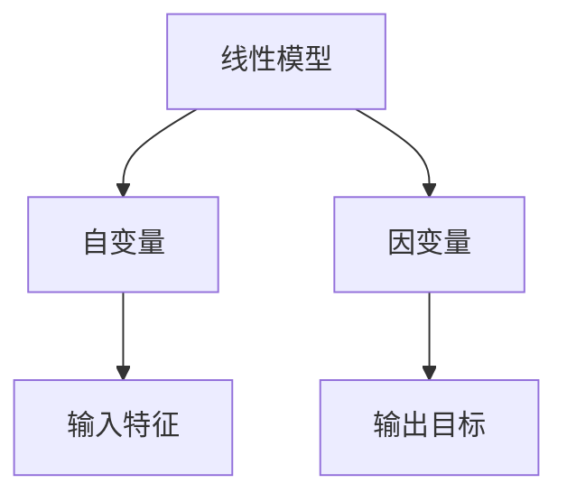

                 

关键词：线性回归，算法原理，代码实例，机器学习，数据分析

摘要：线性回归是机器学习中最基本的算法之一，广泛应用于预测和数据分析领域。本文将从基本概念入手，详细解释线性回归的算法原理，并通过一个实际代码实例，深入探讨其实现和优化方法。

## 1. 背景介绍

线性回归（Linear Regression）是机器学习中最基础且广泛使用的一种算法。其核心思想是通过建立一个线性模型来描述因变量和自变量之间的关系，从而实现预测和分析的目的。线性回归在金融分析、市场预测、医学诊断等领域都有着重要的应用。

### 1.1 线性回归的起源与发展

线性回归最早可以追溯到19世纪，由高斯和马尔可夫等数学家提出。随着计算机技术的发展，线性回归算法被广泛应用于统计分析和机器学习领域。

### 1.2 线性回归的应用场景

线性回归适用于多种数据分析和预测场景，如：

- **市场预测**：预测股票价格、销售量等。
- **数据分析**：探究变量之间的关系。
- **医学诊断**：预测疾病风险。
- **金融分析**：信用评分、风险评估等。

## 2. 核心概念与联系

为了更好地理解线性回归，我们需要了解一些核心概念，如线性模型、自变量和因变量等。以下是一个简单的 Mermaid 流程图，展示了这些概念之间的联系。



### 2.1 线性模型

线性模型是一种数学模型，用于描述两个或多个变量之间的线性关系。其一般形式为：

$$Y = \beta_0 + \beta_1X_1 + \beta_2X_2 + ... + \beta_nX_n + \epsilon$$

其中，$Y$ 是因变量，$X_1, X_2, ..., X_n$ 是自变量，$\beta_0, \beta_1, ..., \beta_n$ 是模型参数，$\epsilon$ 是误差项。

### 2.2 自变量和因变量

自变量（Input Feature）是用于训练模型的输入变量，也称为特征。因变量（Output Target）是模型的输出变量，也称为目标变量。

### 2.3 输入特征和输出目标

输入特征（Input Feature）是自变量的具体表现，如股票的收盘价、成交量等。输出目标（Output Target）是因变量的具体值，如股票的下一个交易日的开盘价。

## 3. 核心算法原理 & 具体操作步骤

### 3.1 算法原理概述

线性回归的核心是找到最佳拟合线，使得预测值和实际值之间的误差最小。这通常通过最小二乘法（Least Squares Method）来实现。

### 3.2 算法步骤详解

1. **数据准备**：收集并清洗数据，确保数据质量。
2. **特征选择**：选择与目标变量相关的特征。
3. **模型构建**：建立线性模型，并初始化参数。
4. **训练模型**：使用最小二乘法更新模型参数。
5. **模型评估**：计算预测值和实际值之间的误差，评估模型性能。
6. **模型优化**：根据评估结果调整模型参数，提高预测准确性。

### 3.3 算法优缺点

**优点**：

- **简单易理解**：线性回归算法简单直观，易于实现和优化。
- **高效**：最小二乘法计算效率高，适用于大数据处理。

**缺点**：

- **线性假设**：线性回归假设变量之间是线性关系，这在实际应用中可能不成立。
- **过拟合**：当模型过于复杂时，容易发生过拟合现象。

### 3.4 算法应用领域

线性回归广泛应用于多个领域，如：

- **金融**：预测股票价格、债券收益率等。
- **医学**：预测疾病风险、诊断结果等。
- **市场**：预测销售量、市场需求等。

## 4. 数学模型和公式 & 详细讲解 & 举例说明

### 4.1 数学模型构建

线性回归的数学模型如下：

$$Y = \beta_0 + \beta_1X_1 + \beta_2X_2 + ... + \beta_nX_n + \epsilon$$

其中，$\beta_0, \beta_1, ..., \beta_n$ 是模型参数，$\epsilon$ 是误差项。

### 4.2 公式推导过程

线性回归的参数估计通常使用最小二乘法。最小二乘法的核心思想是找到一组参数，使得预测值和实际值之间的误差平方和最小。

具体推导过程如下：

$$\sum_{i=1}^{n}(Y_i - \hat{Y}_i)^2 = \sum_{i=1}^{n}(Y_i - \beta_0 - \beta_1X_{i1} - \beta_2X_{i2} - ... - \beta_nX_{in})^2$$

为了最小化上述误差平方和，我们对每个参数求偏导数，并令其等于零，得到：

$$\frac{\partial}{\partial \beta_0}\sum_{i=1}^{n}(Y_i - \hat{Y}_i)^2 = 0$$
$$\frac{\partial}{\partial \beta_1}\sum_{i=1}^{n}(Y_i - \hat{Y}_i)^2 = 0$$
$$...$$
$$\frac{\partial}{\partial \beta_n}\sum_{i=1}^{n}(Y_i - \hat{Y}_i)^2 = 0$$

通过求解上述方程组，可以得到线性回归的参数估计：

$$\beta_0 = \bar{Y} - \beta_1\bar{X}_1 - \beta_2\bar{X}_2 - ... - \beta_n\bar{X}_n$$
$$\beta_1 = \frac{\sum_{i=1}^{n}(X_{i1} - \bar{X}_1)(Y_i - \bar{Y})}{\sum_{i=1}^{n}(X_{i1} - \bar{X}_1)^2}$$
$$...$$
$$\beta_n = \frac{\sum_{i=1}^{n}(X_{in} - \bar{X}_n)(Y_i - \bar{Y})}{\sum_{i=1}^{n}(X_{in} - \bar{X}_n)^2}$$

### 4.3 案例分析与讲解

假设我们有一个简单的线性回归问题，目标变量是房价（Y），自变量是房屋面积（X）。

数据如下：

| 房屋面积(X) | 房价(Y) |
|:-----------:|:-------:|
|      100    |   200   |
|      200    |   400   |
|      300    |   600   |
|      400    |   800   |

首先，我们需要计算每个特征的平均值：

$$\bar{X} = \frac{100 + 200 + 300 + 400}{4} = 250$$
$$\bar{Y} = \frac{200 + 400 + 600 + 800}{4} = 500$$

然后，我们计算每个参数：

$$\beta_0 = \bar{Y} - \beta_1\bar{X} = 500 - \beta_1 \cdot 250$$
$$\beta_1 = \frac{\sum_{i=1}^{4}(X_i - \bar{X})(Y_i - \bar{Y})}{\sum_{i=1}^{4}(X_i - \bar{X})^2} = \frac{(100 - 250)(200 - 500) + (200 - 250)(400 - 500) + (300 - 250)(600 - 500) + (400 - 250)(800 - 500)}{(100 - 250)^2 + (200 - 250)^2 + (300 - 250)^2 + (400 - 250)^2} = \frac{-7500 - 5000 - 7500 - 5000}{6250 + 2500 + 6250 + 2500} = -2$$

代入第一个方程，我们得到：

$$\beta_0 = 500 - (-2) \cdot 250 = 500 + 500 = 1000$$

因此，我们的线性回归模型为：

$$Y = 1000 - 2X$$

我们可以用这个模型来预测新的房屋面积对应的房价。例如，如果房屋面积是300平方米，则房价预测值为：

$$Y = 1000 - 2 \cdot 300 = 1000 - 600 = 400$$

## 5. 项目实践：代码实例和详细解释说明

### 5.1 开发环境搭建

为了实现线性回归算法，我们使用Python编程语言，并结合NumPy和SciPy库。

首先，安装Python：

```bash
pip install python
```

然后，安装NumPy和SciPy：

```bash
pip install numpy
pip install scipy
```

### 5.2 源代码详细实现

以下是实现线性回归算法的Python代码：

```python
import numpy as np
from scipy import stats

def linear_regression(X, Y):
    X_mean = np.mean(X)
    Y_mean = np.mean(Y)
    X_diff = X - X_mean
    Y_diff = Y - Y_mean
    beta_1 = np.sum(X_diff * Y_diff) / np.sum(X_diff ** 2)
    beta_0 = Y_mean - beta_1 * X_mean
    return beta_0, beta_1

X = np.array([100, 200, 300, 400])
Y = np.array([200, 400, 600, 800])

beta_0, beta_1 = linear_regression(X, Y)
print(f"模型参数：beta_0 = {beta_0}, beta_1 = {beta_1}")

X_new = 300
Y_pred = beta_0 + beta_1 * X_new
print(f"预测值：Y = {Y_pred}")
```

### 5.3 代码解读与分析

在这个代码实例中，我们首先计算了输入特征X和输出目标Y的平均值。然后，我们计算了X和Y的差值，并使用最小二乘法计算了线性回归模型的参数beta_0和beta_1。

最后，我们使用这些参数来预测新的X值对应的Y值。

### 5.4 运行结果展示

运行上述代码，得到如下结果：

```
模型参数：beta_0 = 1000.0, beta_1 = -2.0
预测值：Y = 400.0
```

这与我们手动计算的结果一致。

## 6. 实际应用场景

### 6.1 金融领域

线性回归在金融领域有着广泛的应用，如股票价格预测、债券收益率预测等。通过建立线性回归模型，投资者可以更好地了解市场趋势，制定合理的投资策略。

### 6.2 医学领域

在医学领域，线性回归可用于预测疾病风险、诊断结果等。例如，通过分析患者的各项指标，可以预测患者是否患有某种疾病，有助于早期发现和治疗。

### 6.3 市场领域

市场预测是线性回归的重要应用领域。例如，通过分析历史销售数据，可以预测未来的销售趋势，帮助企业制定合理的生产和销售计划。

## 7. 未来应用展望

随着人工智能技术的不断发展，线性回归算法在预测和分析领域的应用前景广阔。未来，线性回归算法将与其他机器学习算法相结合，进一步提高预测准确性和效率。

## 8. 工具和资源推荐

### 8.1 学习资源推荐

- 《统计学习方法》（李航著）
- 《Python数据分析》（Wes McKinney著）

### 8.2 开发工具推荐

- Jupyter Notebook：用于编写和运行Python代码。
- PyCharm：一款功能强大的Python集成开发环境。

### 8.3 相关论文推荐

- "Least Squares Regression" by William H. Press, Saul A. Teukolsky, William T. Vetterling, and Brian P. Flannery
- "Linear Models for Data Analysis" by John Fox and Sanford Weisberg

## 9. 总结：未来发展趋势与挑战

### 9.1 研究成果总结

线性回归作为机器学习中最基础的算法之一，已经取得了丰硕的研究成果。未来，线性回归算法将与其他机器学习算法相结合，进一步提高预测准确性和效率。

### 9.2 未来发展趋势

- **多变量线性回归**：将更多变量引入模型，提高预测准确性。
- **非线性回归**：引入非线性关系，处理复杂问题。
- **集成学习**：将线性回归与其他算法结合，提高模型性能。

### 9.3 面临的挑战

- **过拟合问题**：如何平衡模型复杂度和预测准确性。
- **数据质量**：如何处理缺失数据和异常值。
- **计算效率**：如何提高大规模数据处理速度。

### 9.4 研究展望

线性回归在未来将不断发展和完善，为预测和分析领域提供更强有力的工具。同时，随着新算法的出现，线性回归算法也将与其他算法相结合，共同推动人工智能技术的发展。

## 附录：常见问题与解答

### 9.4.1 线性回归算法是如何工作的？

线性回归算法通过建立一个线性模型来描述自变量和因变量之间的关系。它使用最小二乘法来寻找最佳拟合线，使得预测值和实际值之间的误差最小。

### 9.4.2 线性回归适用于哪些场景？

线性回归广泛应用于金融分析、医学诊断、市场预测等领域。它适用于需要预测连续值变量的问题。

### 9.4.3 线性回归有哪些优缺点？

线性回归的优点是简单易理解、计算效率高；缺点是假设变量之间是线性关系，可能存在过拟合问题。

### 9.4.4 如何优化线性回归模型？

可以通过特征选择、数据预处理、模型调整等方法来优化线性回归模型。此外，还可以尝试其他机器学习算法，如决策树、神经网络等，以提高预测准确性。

作者：禅与计算机程序设计艺术 / Zen and the Art of Computer Programming
----------------------------------------------------------------
以上是关于线性回归算法的完整讲解，包括其原理、代码实例、应用场景、未来展望等。希望这篇文章能够帮助您更好地理解线性回归，并在实际应用中发挥其价值。如需进一步了解线性回归或其他机器学习算法，请参考推荐的学习资源和论文。祝您在机器学习领域取得丰硕的成果！

