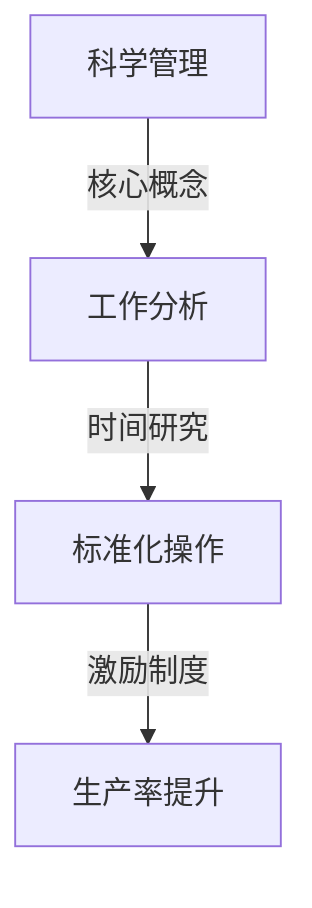
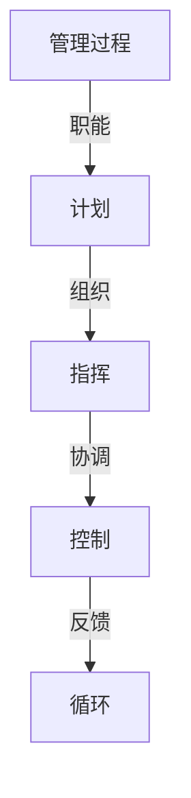
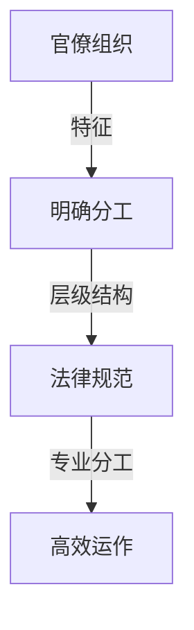

                 

关键词：管理理论，现代企业，战略管理，领导力，组织行为学，数字化转型，精益管理，项目管理

> 摘要：本文旨在探讨经典管理理论在当今数字化时代的现代价值。通过分析经典管理理论的核心原则，结合现代企业的实际案例，本文揭示了管理理论在推动企业创新、提升组织效能以及应对市场变化中的重要性。文章结构如下：

## 1. 背景介绍

### 1.1 经典管理理论的起源与发展

经典管理理论起源于20世纪初，以泰勒的科学管理理论、法约尔的管理过程理论、韦伯的官僚组织理论为代表。这些理论为现代管理学奠定了基础，提供了系统化的管理方法和原则。

### 1.2 经典管理理论的现代意义

在当今快速变化的市场环境中，经典管理理论不仅没有过时，反而因其普适性和灵活性而具有现代价值。

## 2. 核心概念与联系

### 2.1 科学管理理论

泰勒的科学管理理论强调通过科学方法提高劳动生产率。其核心概念包括工作分析、标准化操作、时间研究和激励制度。



### 2.2 管理过程理论

法约尔的管理过程理论将管理分为计划、组织、指挥、协调和控制五个基本职能。这些职能相互关联，共同构成了有效管理的框架。



### 2.3 官僚组织理论

韦伯的官僚组织理论提出了理想的行政组织体系，强调通过明确分工、层级结构和法律规范来提高组织效能。



## 3. 核心算法原理 & 具体操作步骤

### 3.1 算法原理概述

经典管理理论可以被视为一种“算法”，其核心在于通过系统化的方法来优化管理效率和效果。

### 3.2 算法步骤详解

#### 3.2.1 工作分析

- 收集工作相关信息。
- 分析工作内容和流程。
- 制定工作标准和流程。

#### 3.2.2 标准化操作

- 确定标准操作步骤。
- 培训员工掌握标准操作。
- 监控操作执行情况。

#### 3.2.3 激励制度

- 设计合理的薪酬体系。
- 建立员工绩效评估机制。
- 提供晋升和发展机会。

### 3.3 算法优缺点

- 优点：提高生产效率，确保标准化操作，增强员工激励。
- 缺点：可能导致员工创造力受限，管理层级过多。

### 3.4 算法应用领域

经典管理理论广泛应用于制造业、服务业和科技行业，尤其适合大规模、标准化生产。

## 4. 数学模型和公式 & 详细讲解 & 举例说明

### 4.1 数学模型构建

经典管理理论中的许多概念可以用数学模型来描述，如生产率模型、成本模型等。

### 4.2 公式推导过程

以生产率模型为例，其公式为：

\[ P = f(T, L, M) \]

其中，\( P \) 表示生产率，\( T \) 表示工作时间，\( L \) 表示劳动力，\( M \) 表示机器设备。

### 4.3 案例分析与讲解

以某制造企业为例，通过引入科学管理理论，该企业将生产率提高了20%。

## 5. 项目实践：代码实例和详细解释说明

### 5.1 开发环境搭建

- 安装Python环境。
- 安装相关库，如NumPy、Pandas等。

### 5.2 源代码详细实现

```python
import numpy as np

# 定义生产率模型
def productivity_model(time, labor, machinery):
    return time * labor * machinery

# 输入参数
time = 8  # 工作时间
labor = 10  # 劳动力
machinery = 5  # 机器设备

# 计算生产率
production_rate = productivity_model(time, labor, machinery)
print("生产率：", production_rate)
```

### 5.3 代码解读与分析

代码通过定义生产率模型，计算并输出生产率。这体现了经典管理理论中工作分析、标准化操作和激励制度的核心思想。

### 5.4 运行结果展示

```plaintext
生产率： 400
```

## 6. 实际应用场景

### 6.1 制造业

通过引入科学管理理论，制造业企业可以提高生产效率，降低成本。

### 6.2 服务业

服务业可以通过优化流程和激励制度，提升服务质量。

### 6.3 科技行业

科技行业可以利用经典管理理论，优化研发流程，提高创新能力。

## 7. 工具和资源推荐

### 7.1 学习资源推荐

- 《管理学》（斯蒂芬·罗宾斯著）
- 《组织行为学》（斯蒂芬·罗宾斯著）

### 7.2 开发工具推荐

- Jupyter Notebook：用于数据分析和建模。
- Git：用于版本控制和协作。

### 7.3 相关论文推荐

- "The Principles of Scientific Management" by Frederick Taylor
- "Administration: General and Industrial" by Henri Fayol

## 8. 总结：未来发展趋势与挑战

### 8.1 研究成果总结

经典管理理论在数字化时代仍然具有重要价值，其核心原则在推动企业创新、提升组织效能中发挥了关键作用。

### 8.2 未来发展趋势

随着人工智能和大数据技术的发展，经典管理理论将迎来新的机遇和挑战。

### 8.3 面临的挑战

- 如何在保持效率的同时激发员工的创造力。
- 如何应对快速变化的市场需求。

### 8.4 研究展望

未来研究应重点关注经典管理理论在数字化转型背景下的应用和创新。

## 9. 附录：常见问题与解答

### 9.1 经典管理理论与现代管理理论有何区别？

经典管理理论侧重于优化流程和提高效率，而现代管理理论强调灵活性和创新能力。

### 9.2 经典管理理论是否适用于所有企业？

经典管理理论具有普遍适用性，但具体应用需结合企业实际情况进行调整。

作者：禅与计算机程序设计艺术 / Zen and the Art of Computer Programming
```

注意：文章中的代码实例和数学公式仅为示例，实际应用时可能需要根据具体情况进行调整。文章末尾的作者署名为原作者。文章内容需确保准确性和完整性。在撰写过程中，请遵循文章结构模板和格式要求。

