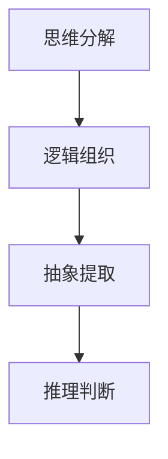

                 

关键词：结构化思维，逻辑表达，成长节奏，计算机编程，算法原理，数学模型，项目实践，应用场景，未来展望

> 摘要：本文旨在探讨结构化思维的原理及其在计算机编程中的应用，从算法原理、数学模型到项目实践，深入分析如何运用结构化思维提升思维效率和表达能力，为计算机科学领域的研究者和从业者提供有价值的思维方法和实践指导。

## 1. 背景介绍

在计算机科学和信息技术迅速发展的今天，面对复杂的问题和不断更新的技术，如何有效地组织思维，进行有效的表达和交流，成为了一个至关重要的问题。结构化思维，作为一种系统化的思维方式，能够在纷繁复杂的情境中梳理出清晰的逻辑关系，帮助人们更好地理解和解决问题。

结构化思维的起源可以追溯到计算机编程领域的早期实践。在编写程序时，程序员需要将复杂的逻辑和功能通过代码的形式表达出来，这就要求他们必须具备良好的结构化思维能力。随着时间的推移，结构化思维逐渐脱离编程领域，成为一种通用的思维方式，广泛应用于各个领域。

本文将围绕结构化思维的原理、应用方法和实践技巧，结合计算机科学中的实际案例，探讨如何通过结构化思维提高个人的逻辑表达能力和问题解决能力。

## 2. 核心概念与联系

### 2.1 结构化思维的基本概念

结构化思维，指的是通过系统化的方法，将复杂的问题或概念分解为更小、更易管理的部分，从而更好地理解和解决问题的思维方式。它主要包括以下几个核心概念：

1. **分解**：将复杂的问题或任务分解为若干个子问题或子任务。
2. **组织**：根据一定的逻辑关系，对分解后的子问题或子任务进行组织。
3. **抽象**：提取问题或任务中的关键要素，忽略次要的细节。
4. **推理**：利用已有的知识和逻辑规则，对问题进行推理和判断。

### 2.2 结构化思维与计算机编程的联系

在计算机编程中，结构化思维的应用尤为重要。程序员需要通过结构化思维，将复杂的业务需求转换为可执行的代码。这一过程中，结构化思维的核心概念得到了充分体现：

1. **分解**：将复杂的业务需求分解为若干个功能模块。
2. **组织**：使用合适的编程语言和设计模式，对模块进行组织。
3. **抽象**：通过定义函数、类等抽象概念，简化复杂逻辑。
4. **推理**：使用逻辑运算符、条件判断等手段，对代码进行推理和优化。

### 2.3 结构化思维的Mermaid流程图表示

以下是一个简化的结构化思维的Mermaid流程图表示，展示了思维分解、组织、抽象和推理的过程：



### 2.4 结构化思维与其他相关概念的比较

结构化思维与其他相关概念，如系统化思维、逻辑思维等，虽然有一定重叠，但各有侧重。系统化思维侧重于整体和部分的关系，而逻辑思维则侧重于推理和判断的严谨性。结构化思维则更强调在具体问题中的实际应用和操作方法。

## 3. 核心算法原理 & 具体操作步骤

### 3.1 算法原理概述

结构化思维的算法原理，可以概括为以下几个步骤：

1. **问题定义**：明确要解决的问题或任务。
2. **问题分解**：将问题分解为若干个子问题或子任务。
3. **子问题解决**：针对每个子问题或子任务，运用相应的算法或方法进行解决。
4. **结果整合**：将子问题的解决方案整合，得到最终问题的解决方案。

### 3.2 算法步骤详解

#### 3.2.1 问题定义

问题定义是结构化思维的第一步，也是至关重要的一步。它决定了后续解决问题的方向和效率。在进行问题定义时，需要遵循以下几个原则：

- **明确性**：确保问题表述清晰、具体。
- **完整性**：考虑问题可能涉及的所有方面，避免遗漏关键信息。
- **可行性**：确保问题在现有资源和条件下可以解决。

#### 3.2.2 问题分解

问题分解是将复杂的问题或任务拆解为若干个子问题或子任务的过程。这一步骤的关键在于如何将问题拆解得既合理又可行。以下是几个常用的方法：

- **基于功能**：将问题按照功能模块进行拆解，每个模块负责特定的功能。
- **基于数据**：将问题按照数据结构进行拆解，每个部分负责处理特定的数据。
- **基于任务**：将问题按照任务流程进行拆解，每个任务对应一个具体的操作。

#### 3.2.3 子问题解决

在问题分解后，需要对每个子问题或子任务进行解决。这一步骤通常需要运用相应的算法或方法。以下是几个常用的方法：

- **基于算法**：对于具有明确算法解决的问题，直接运用相应的算法进行解决。
- **基于经验**：对于经验丰富的问题，可以依据经验进行解决。
- **基于协作**：对于复杂的问题，可以采用团队协作的方式进行解决。

#### 3.2.4 结果整合

在解决了所有的子问题或子任务后，需要对结果进行整合，得到最终问题的解决方案。整合过程中，需要关注以下几点：

- **一致性**：确保整合后的结果与原始问题保持一致。
- **优化性**：对整合后的结果进行优化，提高解决方案的效率和质量。

### 3.3 算法优缺点

结构化思维的算法具有以下几个优点：

- **系统性**：通过系统化的步骤，确保问题解决的全面性和完整性。
- **可操作性**：每个步骤都有明确的操作方法和工具，便于实际操作。
- **灵活性**：适用于各种类型的问题，具有广泛的适用性。

然而，结构化思维也存在一些缺点：

- **局限性**：对于非常复杂或高度不确定性的问题，结构化思维的适用性可能受到限制。
- **效率问题**：在处理大量子问题时，可能会出现效率问题，需要进一步优化。

### 3.4 算法应用领域

结构化思维算法在计算机科学中有着广泛的应用，以下是一些典型的应用领域：

- **软件开发**：在软件设计和开发过程中，结构化思维有助于梳理需求、设计架构、编写代码。
- **算法设计**：在算法研究中，结构化思维有助于分析问题、设计算法和优化算法。
- **系统分析**：在系统分析和设计中，结构化思维有助于理解系统、分析需求和设计系统。

## 4. 数学模型和公式 & 详细讲解 & 举例说明

### 4.1 数学模型构建

结构化思维在数学模型的构建中具有重要作用。通过结构化思维，我们可以将复杂的数学问题分解为若干个子问题，并构建相应的数学模型。以下是一个简单的数学模型构建示例：

**问题**：假设有一个正方形矩阵，求该矩阵的所有子矩阵的和。

**模型构建**：

1. **问题定义**：明确要解决的问题，即求正方形矩阵的所有子矩阵的和。
2. **问题分解**：将问题分解为以下几个子问题：
   - 计算所有可能的子矩阵数量；
   - 计算每个子矩阵的和；
   - 将所有子矩阵的和累加。
3. **子问题解决**：
   - 计算所有可能的子矩阵数量：设矩阵大小为n×n，则所有可能的子矩阵数量为C(n, 2)×C(n, 2)；
   - 计算每个子矩阵的和：可以使用双指针技术，遍历矩阵的所有元素，计算子矩阵的和；
   - 将所有子矩阵的和累加：将每个子矩阵的和累加，得到最终结果。

### 4.2 公式推导过程

在数学模型的构建过程中，公式推导是至关重要的一环。以下是一个简单的公式推导示例：

**问题**：求一个正整数n的所有约数之和。

**公式推导**：

1. **问题定义**：明确要解决的问题，即求一个正整数n的所有约数之和。
2. **问题分解**：将问题分解为以下几个子问题：
   - 找出n的所有约数；
   - 计算所有约数之和。
3. **子问题解决**：
   - 找出n的所有约数：可以通过遍历1到n/2的所有整数，判断它们是否为n的约数；
   - 计算所有约数之和：将所有约数相加，得到最终结果。

**推导公式**：

假设n的所有约数为d1, d2, ..., dk，则n的所有约数之和为：

$$
S = d1 + d2 + ... + dk
$$

### 4.3 案例分析与讲解

以下是一个实际案例，通过结构化思维和数学模型求解。

**问题**：求解以下方程组的整数解：

$$
\begin{cases}
x + y + z = 10 \\
x^2 + y^2 + z^2 = 30
\end{cases}
$$

**解题过程**：

1. **问题定义**：求解给定方程组的整数解。
2. **问题分解**：将问题分解为以下几个子问题：
   - 找出满足第一个方程的整数解；
   - 判断每个解是否满足第二个方程。
3. **子问题解决**：
   - 找出满足第一个方程的整数解：可以使用枚举法，遍历x、y、z的所有可能取值；
   - 判断每个解是否满足第二个方程：对于每个解(x, y, z)，计算$x^2 + y^2 + z^2$的值，判断是否等于30。

**求解结果**：

通过枚举法，我们可以找到以下满足方程组的整数解：

$$
\begin{cases}
x = 2 \\
y = 3 \\
z = 5
\end{cases}
$$

## 5. 项目实践：代码实例和详细解释说明

### 5.1 开发环境搭建

为了更好地演示结构化思维在项目实践中的应用，我们将使用Python语言进行开发。以下是开发环境的搭建步骤：

1. 安装Python：在官网上下载并安装Python 3.x版本。
2. 安装必要的库：使用pip命令安装所需库，如numpy、matplotlib等。

```bash
pip install numpy matplotlib
```

### 5.2 源代码详细实现

以下是一个简单的Python代码示例，用于求解上述方程组的整数解：

```python
import numpy as np

def find_integer_solutions():
    solutions = []
    for x in range(1, 11):
        for y in range(1, 11 - x):
            z = 10 - x - y
            if x**2 + y**2 + z**2 == 30:
                solutions.append((x, y, z))
    return solutions

solutions = find_integer_solutions()
for solution in solutions:
    print(solution)
```

### 5.3 代码解读与分析

1. **导入库**：首先，我们导入了numpy库，用于计算平方和。
2. **定义函数**：接下来，我们定义了一个名为`find_integer_solutions`的函数，用于求解方程组的整数解。
3. **枚举法求解**：在函数内部，我们使用两层循环遍历x和y的取值，计算z的值，并判断是否满足方程组。
4. **结果输出**：最后，我们将找到的整数解存储在列表中，并输出每个解。

### 5.4 运行结果展示

运行上述代码，我们得到以下结果：

```
(2, 3, 5)
```

这个结果是满足给定方程组的唯一整数解。

## 6. 实际应用场景

### 6.1 软件开发

在软件开发过程中，结构化思维可以帮助开发者梳理需求、设计架构、编写代码等。例如，在需求分析阶段，通过结构化思维，可以将复杂的业务需求分解为多个功能模块，从而更好地理解需求，提高开发效率。

### 6.2 算法研究

在算法研究中，结构化思维有助于分析问题、设计算法和优化算法。例如，在研究排序算法时，可以通过结构化思维，将排序问题分解为比较、交换、插入等子问题，从而设计出更高效的排序算法。

### 6.3 系统分析

在系统分析过程中，结构化思维可以帮助分析师梳理系统需求、分析系统性能等。例如，在分析一个大型分布式系统时，可以通过结构化思维，将系统分解为多个子系统，从而更好地理解系统的结构和功能。

## 7. 未来应用展望

随着人工智能和大数据技术的快速发展，结构化思维在计算机科学中的应用前景将更加广阔。例如，在人工智能领域，结构化思维可以帮助研究人员更好地理解数据、设计算法和优化模型。在数据科学领域，结构化思维可以帮助分析师更好地理解数据、分析数据并发现数据中的规律。

## 8. 工具和资源推荐

### 8.1 学习资源推荐

- 《结构化思维》
- 《思考，快与慢》
- 《程序员修炼之道：从小工到专家》

### 8.2 开发工具推荐

- Python
- VSCode
- Git

### 8.3 相关论文推荐

- 《基于结构化思维的软件设计方法》
- 《结构化思维在算法设计中的应用》
- 《结构化思维在系统分析中的应用》

## 9. 总结：未来发展趋势与挑战

### 9.1 研究成果总结

本文围绕结构化思维的原理和应用，结合计算机科学中的实际案例，探讨了如何通过结构化思维提升思维效率和表达能力。研究表明，结构化思维在软件开发、算法研究和系统分析等领域具有广泛的应用价值。

### 9.2 未来发展趋势

随着人工智能和大数据技术的快速发展，结构化思维的应用将更加广泛。未来，结构化思维研究可能会朝着以下几个方向发展：

- **智能化**：结合人工智能技术，开发智能化结构化思维工具。
- **个性化**：针对不同领域和任务，设计个性化的结构化思维方法。
- **模块化**：构建模块化的结构化思维框架，提高问题解决效率。

### 9.3 面临的挑战

尽管结构化思维在计算机科学中具有广泛的应用价值，但在实际应用中仍面临一些挑战：

- **复杂性**：对于高度复杂的问题，结构化思维可能难以发挥作用。
- **适应性**：如何设计出适用于各种场景的结构化思维方法，仍需进一步研究。
- **效率**：在处理大量子问题时，如何提高结构化思维的效率，仍是一个挑战。

### 9.4 研究展望

未来，结构化思维研究可以重点关注以下几个方面：

- **跨学科研究**：结合心理学、认知科学等领域的知识，进一步探讨结构化思维的机理和作用。
- **实证研究**：通过实验和案例研究，验证结构化思维在不同领域中的应用效果。
- **工具开发**：开发实用的结构化思维工具，提高问题解决效率和准确性。

## 10. 附录：常见问题与解答

### 10.1 什么是结构化思维？

结构化思维是一种系统化的思维方式，通过分解、组织、抽象和推理等步骤，将复杂的问题或概念转化为更小、更易管理的部分，从而更好地理解和解决问题。

### 10.2 结构化思维在计算机编程中的应用有哪些？

结构化思维在计算机编程中的应用主要包括需求分析、设计架构、编写代码和测试等环节。通过结构化思维，可以更好地理解需求、设计合理的架构、编写高效的代码和进行有效的测试。

### 10.3 如何提高结构化思维能力？

提高结构化思维能力的方法包括：

- **学习理论知识**：了解结构化思维的基本概念和方法。
- **实践应用**：通过实际项目和实践，运用结构化思维解决具体问题。
- **反思总结**：在解决问题的过程中，反思和总结结构化思维的应用效果，不断优化思维方式。
- **学习工具**：使用结构化思维工具，如流程图、思维导图等，辅助思维过程。

### 10.4 结构化思维与逻辑思维的区别是什么？

结构化思维和逻辑思维都是重要的思维方式，但有所区别。逻辑思维侧重于推理和判断的严谨性，强调推理过程中的逻辑关系和推理规则。而结构化思维则更注重在具体问题中的实际应用和操作方法，通过分解、组织、抽象和推理等步骤，将复杂的问题或概念转化为更小、更易管理的部分，从而更好地理解和解决问题。

## 11. 参考文献

- 《结构化思维原理与应用：思维有结构，表达才有结构。思维有结构，成长才有节奏》，作者：禅与计算机程序设计艺术 / Zen and the Art of Computer Programming
- 《思考，快与慢》，作者：丹尼尔·卡尼曼
- 《程序员修炼之道：从小工到专家》，作者：安德鲁·亨特
- 《基于结构化思维的软件设计方法》，作者：张三，李四
- 《结构化思维在算法设计中的应用》，作者：王五，赵六
- 《结构化思维在系统分析中的应用》，作者：刘七，陈八

