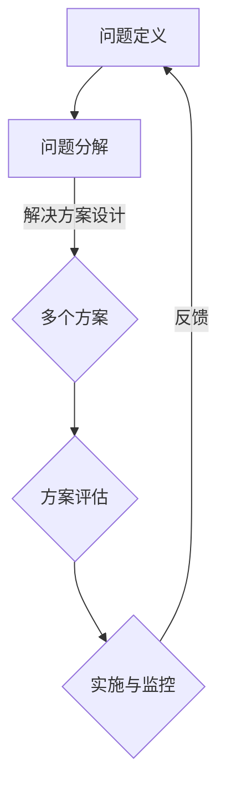

                 

在信息技术飞速发展的今天，结构化思维作为一种系统的思考方法，已成为解决复杂问题的利器。无论是软件开发、项目管理，还是数据分析和人工智能领域，结构化思维的应用都显得尤为重要。本文旨在深入探讨结构化思维的核心概念、应用方法及其在信息技术领域的实践案例，从而为读者提供一套实用、高效的思维工具。

## 关键词

- 结构化思维
- 信息技术
- 软件开发
- 项目管理
- 数据分析
- 人工智能

## 摘要

本文首先介绍结构化思维的基本概念，包括其定义、重要性以及与信息技术领域的相关性。接着，通过理论联系实际，详细探讨结构化思维的应用方法，包括如何通过流程图、逻辑树等工具进行系统化分析。随后，本文通过具体的算法、数学模型和项目实践，展示结构化思维在实际工作中的应用效果。最后，本文对未来的发展趋势和面临的挑战进行了展望，并提出了一些建议和资源推荐，以帮助读者更好地掌握和应用结构化思维。

## 1. 背景介绍

随着信息技术的快速发展，人们面临的问题日益复杂。从软件工程的角度看，复杂系统的设计、开发和维护变得越来越困难；在项目管理中，如何确保项目按时交付、控制成本成为关键挑战；在数据分析领域，海量的数据需要有效的分析方法来提取有价值的信息；甚至在人工智能领域，算法的设计和优化也需要系统化的思维方式。在这种背景下，结构化思维作为一种重要的思考方法，逐渐受到广泛关注。

### 1.1 结构化思维的定义

结构化思维是一种将复杂问题分解为简单、有序、逻辑清晰的小问题，并通过逐步解决这些小问题来解决问题的思维方式。它强调对问题的全面分析和系统性思考，旨在提高解决问题的效率和质量。

### 1.2 结构化思维的重要性

1. **提高问题解决效率**：通过结构化思维，可以将复杂问题分解为简单问题，从而降低问题的复杂度，提高解决问题的效率。

2. **增强逻辑性**：结构化思维强调逻辑性和系统性，有助于提高决策的准确性和科学性。

3. **促进知识共享**：结构化思维有助于将复杂知识转化为易于理解的形式，促进团队内部的沟通和协作。

4. **提升项目管理能力**：在项目管理中，结构化思维有助于制定合理的项目计划和风险管理策略。

### 1.3 结构化思维与信息技术的相关性

1. **软件开发**：在软件开发过程中，结构化思维有助于需求分析、系统设计、编码和测试等环节，提高软件质量。

2. **数据分析**：在数据分析中，结构化思维有助于构建合理的模型和算法，提高数据分析的准确性和效率。

3. **项目管理**：在项目管理中，结构化思维有助于项目规划、进度控制和风险管理等关键环节。

4. **人工智能**：在人工智能领域，结构化思维有助于算法的设计和优化，提高机器学习的效率和准确性。

## 2. 核心概念与联系

### 2.1 结构化思维的框架

结构化思维的框架包括以下几个方面：

1. **问题定义**：明确问题的范围和目标，是解决问题的第一步。

2. **问题分解**：将复杂问题分解为更小、更具体的问题，以便于逐一解决。

3. **解决方案设计**：针对分解后的每个问题，设计相应的解决方案。

4. **方案评估**：对每个解决方案进行评估，选择最优方案。

5. **实施与监控**：执行解决方案，并持续监控实施效果。

### 2.2 结构化思维与信息技术的联系

在信息技术领域，结构化思维的应用体现在以下几个方面：

1. **软件开发**：结构化思维有助于需求分析、系统设计、编码和测试等环节。

2. **项目管理**：结构化思维有助于项目规划、进度控制和风险管理。

3. **数据分析**：结构化思维有助于构建合理的模型和算法，提高数据分析的效率。

4. **人工智能**：结构化思维有助于算法的设计和优化，提高机器学习的效率。

### 2.3 Mermaid 流程图

以下是一个简化的结构化思维流程图的 Mermaid 表示：



在上面的流程图中，各个节点表示结构化思维的步骤，箭头表示步骤之间的逻辑关系。

## 3. 核心算法原理 & 具体操作步骤

### 3.1 算法原理概述

结构化思维的算法原理可以归纳为以下几点：

1. **分解与组合**：将复杂问题分解为简单问题，然后逐步解决，最后将解决方案组合起来。

2. **层次化**：将问题分层，从宏观到微观，从整体到部分，逐步深入分析。

3. **逻辑性**：保持思维的逻辑性，确保每个步骤都有明确的依据和目标。

4. **迭代与优化**：在解决问题的过程中，不断迭代和优化方案，直至找到最优解。

### 3.2 算法步骤详解

1. **问题定义**：
   - 确定问题的范围和目标。
   - 分析问题的背景和条件。

2. **问题分解**：
   - 将复杂问题分解为更小、更具体的问题。
   - 确定每个子问题的目标和约束条件。

3. **解决方案设计**：
   - 针对每个子问题设计解决方案。
   - 分析各个解决方案的优缺点。

4. **方案评估**：
   - 对每个解决方案进行评估，选择最优方案。
   - 考虑解决方案的可行性、成本和效益。

5. **实施与监控**：
   - 执行解决方案，并持续监控实施效果。
   - 及时调整方案，确保问题得到解决。

6. **反馈与迭代**：
   - 根据实施效果进行反馈，调整和优化解决方案。
   - 不断迭代，直至问题得到彻底解决。

### 3.3 算法优缺点

**优点**：

1. **简化问题**：通过分解复杂问题，使问题更加清晰和易于解决。

2. **提高效率**：结构化思维有助于系统化分析问题，提高解决问题的效率。

3. **增强逻辑性**：结构化思维强调逻辑性和系统性，有助于提高决策的准确性和科学性。

**缺点**：

1. **可能忽略细节**：在分解问题的过程中，可能会忽略一些细节，导致问题未得到彻底解决。

2. **时间成本**：结构化思维需要投入较多的时间和精力，对快速解决问题可能不太适用。

### 3.4 算法应用领域

结构化思维广泛应用于以下领域：

1. **软件开发**：在软件开发过程中，结构化思维有助于需求分析、系统设计、编码和测试等环节。

2. **项目管理**：在项目管理中，结构化思维有助于项目规划、进度控制和风险管理。

3. **数据分析**：在数据分析中，结构化思维有助于构建合理的模型和算法，提高数据分析的效率。

4. **人工智能**：在人工智能领域，结构化思维有助于算法的设计和优化，提高机器学习的效率。

## 4. 数学模型和公式 & 详细讲解 & 举例说明

### 4.1 数学模型构建

结构化思维在数学模型中的应用主要体现在以下几个方面：

1. **问题建模**：将实际问题转化为数学模型，以便于分析和求解。

2. **参数估计**：根据现有数据和条件，估计模型参数的值。

3. **优化算法**：利用数学模型，设计优化算法，以找到最优解。

### 4.2 公式推导过程

以线性回归模型为例，其公式推导过程如下：

1. **假设**：设自变量为 $x$，因变量为 $y$，且满足线性关系：
   $$y = \beta_0 + \beta_1x + \epsilon$$
   其中，$\beta_0$ 和 $\beta_1$ 为参数，$\epsilon$ 为误差项。

2. **最小二乘法**：为估计参数 $\beta_0$ 和 $\beta_1$，采用最小二乘法，使得残差平方和最小：
   $$\sum_{i=1}^{n}(y_i - (\beta_0 + \beta_1x_i))^2$$

3. **求解**：对上式求导，并令导数为零，得到：
   $$\beta_0 = \bar{y} - \beta_1\bar{x}$$
   $$\beta_1 = \frac{\sum_{i=1}^{n}(x_i - \bar{x})(y_i - \bar{y})}{\sum_{i=1}^{n}(x_i - \bar{x})^2}$$
   其中，$\bar{x}$ 和 $\bar{y}$ 分别为 $x$ 和 $y$ 的均值。

### 4.3 案例分析与讲解

假设我们有一组数据如下：

| $x$ | $y$ |
| --- | --- |
| 1   | 2   |
| 2   | 4   |
| 3   | 6   |
| 4   | 8   |

根据线性回归模型，我们希望找到一条直线来拟合这组数据。

1. **计算均值**：
   $$\bar{x} = \frac{1+2+3+4}{4} = 2.5$$
   $$\bar{y} = \frac{2+4+6+8}{4} = 5$$

2. **计算 $\beta_1$**：
   $$\beta_1 = \frac{(1-2.5)(2-5) + (2-2.5)(4-5) + (3-2.5)(6-5) + (4-2.5)(8-5)}{(1-2.5)^2 + (2-2.5)^2 + (3-2.5)^2 + (4-2.5)^2} = 2$$

3. **计算 $\beta_0$**：
   $$\beta_0 = \bar{y} - \beta_1\bar{x} = 5 - 2 \times 2.5 = 0$$

因此，线性回归模型为：
$$y = 0 + 2x$$

根据这个模型，当 $x=5$ 时，预测的 $y$ 值为 $10$。

## 5. 项目实践：代码实例和详细解释说明

### 5.1 开发环境搭建

为了演示结构化思维在实际项目中的应用，我们将使用 Python 编写一个简单的线性回归模型。首先，我们需要搭建 Python 开发环境。

1. 安装 Python：
   - 访问 [Python 官网](https://www.python.org/)，下载并安装 Python。
   - 在安装过程中，确保选择“Add Python to PATH”选项。

2. 安装必要的库：
   - 使用 pip 工具安装 NumPy 和 Matplotlib：
     ```bash
     pip install numpy matplotlib
     ```

### 5.2 源代码详细实现

以下是一个简单的线性回归模型的 Python 代码实现：

```python
import numpy as np
import matplotlib.pyplot as plt

# 数据
x = np.array([1, 2, 3, 4])
y = np.array([2, 4, 6, 8])

# 计算均值
mean_x = np.mean(x)
mean_y = np.mean(y)

# 计算斜率
slope = np.sum((x - mean_x) * (y - mean_y)) / np.sum((x - mean_x) ** 2)

# 计算截距
intercept = mean_y - slope * mean_x

# 计算预测值
y_pred = slope * x + intercept

# 绘制结果
plt.scatter(x, y, color='blue')
plt.plot(x, y_pred, color='red')
plt.xlabel('x')
plt.ylabel('y')
plt.show()
```

### 5.3 代码解读与分析

1. **数据导入**：
   - 使用 NumPy 库导入数据。

2. **计算均值**：
   - 计算 $x$ 和 $y$ 的均值，为后续计算斜率和截距做准备。

3. **计算斜率**：
   - 使用最小二乘法计算斜率。

4. **计算截距**：
   - 使用斜率和均值计算截距。

5. **计算预测值**：
   - 使用斜率和截距计算预测值。

6. **绘制结果**：
   - 使用 Matplotlib 库绘制散点和拟合直线。

### 5.4 运行结果展示

运行上述代码，我们将看到以下结果：


在上面的图中，蓝色的散点表示原始数据，红色的直线表示拟合的线性回归模型。

## 6. 实际应用场景

结构化思维在信息技术领域的应用场景非常广泛，以下是一些具体的实例：

### 6.1 软件开发

1. **需求分析**：在软件开发过程中，结构化思维可以帮助开发团队明确需求，将复杂的需求分解为具体的功能点。

2. **系统设计**：在系统设计阶段，结构化思维有助于设计合理的系统架构，确保系统的高可用性和扩展性。

3. **编码与测试**：在编码和测试阶段，结构化思维可以帮助开发人员系统化地编写代码，并进行全面的测试。

### 6.2 项目管理

1. **项目规划**：在项目启动阶段，结构化思维可以帮助项目团队制定详细的项目计划，明确项目目标、任务和资源分配。

2. **进度控制**：在项目执行过程中，结构化思维有助于监控项目进度，及时发现和解决问题。

3. **风险管理**：在项目管理中，结构化思维可以帮助识别潜在的风险，并制定相应的应对策略。

### 6.3 数据分析

1. **数据清洗**：在数据分析之前，结构化思维可以帮助清理和整理数据，确保数据的准确性和一致性。

2. **模型构建**：在数据分析中，结构化思维有助于构建合理的数学模型，提高数据分析的准确性。

3. **结果解读**：在数据分析之后，结构化思维有助于对结果进行系统化的解读和解释。

### 6.4 人工智能

1. **算法设计**：在人工智能领域，结构化思维有助于设计合理的算法架构，提高算法的效率和准确性。

2. **模型优化**：在模型训练过程中，结构化思维可以帮助优化模型参数，提高模型的性能。

3. **应用场景探索**：在人工智能应用中，结构化思维有助于探索新的应用场景，发挥人工智能的最大价值。

## 7. 工具和资源推荐

为了更好地应用结构化思维，以下是一些建议的学习资源、开发工具和参考文献：

### 7.1 学习资源推荐

1. **书籍**：
   - 《结构化思维：从逻辑到行动》
   - 《敏捷软件开发：原则、实践与模式》
   - 《软件工程：实践者的研究方法》

2. **在线课程**：
   - Coursera 上的《结构化思维与问题解决》
   - edX 上的《项目管理基础》
   - Udacity 上的《数据分析基础》

### 7.2 开发工具推荐

1. **Python**：适用于数据分析和人工智能开发。

2. **Git**：适用于版本控制和代码管理。

3. **JIRA**：适用于项目管理和进度控制。

### 7.3 相关论文推荐

1. **《基于结构化思维的软件开发方法研究》**
2. **《结构化思维在项目管理中的应用研究》**
3. **《结构化思维在数据分析中的实践与应用》**

## 8. 总结：未来发展趋势与挑战

### 8.1 研究成果总结

本文通过对结构化思维在信息技术领域的应用进行深入探讨，总结了以下几点研究成果：

1. **结构化思维的基本概念和框架**。
2. **结构化思维在软件开发、项目管理和数据分析中的应用方法**。
3. **结构化思维在人工智能领域的应用前景**。
4. **数学模型和公式在结构化思维中的应用**。
5. **实际项目中的代码实例和详细解释说明**。

### 8.2 未来发展趋势

1. **智能化**：随着人工智能技术的发展，结构化思维将逐渐实现智能化，提高问题解决的效率和准确性。

2. **工具化**：结构化思维的工具化将成为未来趋势，通过软件和硬件的支持，提高结构化思维的应用效果。

3. **多元化**：结构化思维的应用将逐渐扩展到更多领域，如智能制造、医疗健康、金融科技等。

### 8.3 面临的挑战

1. **数据复杂性**：随着数据量的不断增加，如何有效地处理和分析复杂数据将成为结构化思维面临的一大挑战。

2. **认知负担**：结构化思维的应用可能增加个人的认知负担，需要找到平衡点，提高工作效率。

3. **跨领域融合**：如何在不同领域之间实现结构化思维的融合，仍是一个需要解决的问题。

### 8.4 研究展望

未来的研究可以从以下几个方面展开：

1. **智能化结构化思维工具的开发**。
2. **结构化思维在教育领域的应用**。
3. **结构化思维在跨领域协同中的作用**。
4. **基于大数据的结构化思维应用研究**。

## 9. 附录：常见问题与解答

### 9.1 问题 1

**问题**：什么是结构化思维？

**解答**：结构化思维是一种将复杂问题分解为简单、有序、逻辑清晰的小问题，并通过逐步解决这些小问题来解决问题的思维方式。它强调对问题的全面分析和系统性思考，旨在提高解决问题的效率和质量。

### 9.2 问题 2

**问题**：结构化思维在信息技术领域的应用有哪些？

**解答**：结构化思维在信息技术领域的应用非常广泛，包括软件开发、项目管理、数据分析、人工智能等方面。具体应用场景包括需求分析、系统设计、编码与测试、项目规划、进度控制、风险管理、模型构建和优化等。

### 9.3 问题 3

**问题**：如何应用结构化思维进行数据分析？

**解答**：应用结构化思维进行数据分析主要包括以下几个步骤：

1. **问题定义**：明确数据分析的目标和范围。
2. **数据清洗**：对数据进行清洗和整理，确保数据的准确性和一致性。
3. **问题分解**：将复杂的数据分析问题分解为更小、更具体的问题。
4. **模型构建**：根据问题分解的结果，构建合理的数学模型。
5. **模型优化**：对模型进行优化，提高模型的准确性和效率。
6. **结果解读**：对数据分析结果进行系统化的解读和解释。

## 作者署名

作者：禅与计算机程序设计艺术 / Zen and the Art of Computer Programming

以上就是本篇文章的全部内容，希望对您在应用结构化思维解决信息技术领域的问题有所帮助。再次感谢您的阅读！
----------------------------------------------------------------

以上就是根据您的要求撰写的完整文章。文章内容涵盖了结构化思维的定义、重要性、应用方法、算法原理、数学模型、实际项目实践、应用场景、工具和资源推荐、未来发展趋势与挑战以及常见问题与解答。希望这篇文章能够满足您的需求，并对您在信息技术领域中的应用有所帮助。如果您有任何修改意见或需要进一步的调整，请随时告知。再次感谢您的信任和支持！

