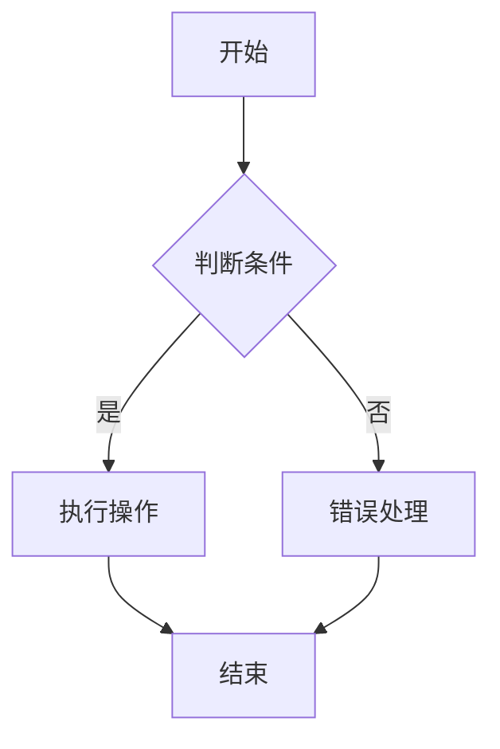

                 

### 关键词 Keywords

- 结构化思维
- 计算机编程
- 算法原理
- 数学模型
- 项目实践
- 应用场景
- 未来展望

### 摘要 Abstract

本文深入探讨了结构化思维在计算机编程领域的重要性，通过介绍核心概念、算法原理、数学模型以及实际应用场景，展示了如何通过结构化思维将复杂问题转化为清晰、可操作的解决方案。文章不仅提供了理论指导，还通过具体的代码实例和实践应用，为读者提供了实际的工具和资源，以便更好地理解和应用结构化思维。最后，本文对未来的发展趋势和挑战进行了展望，为读者指明了研究的方向。

## 1. 背景介绍

在现代计算机科学和软件开发中，结构化思维的重要性愈发突出。随着技术的快速发展和项目的复杂性不断增加，如何有效地管理项目、优化算法、解决复杂问题，成为开发人员面临的重大挑战。结构化思维提供了一种系统化的方法，帮助开发者从混乱中找出清晰的路径，提高工作效率，确保代码质量和项目的稳定性。

结构化思维的核心理念是“分而治之”，即将复杂问题分解为更小、更易于管理的部分，然后逐步解决。这种方法不仅适用于软件开发，还可以应用于各个领域，如科学研究、工程设计、商业管理等。在计算机科学中，结构化思维体现在算法设计、代码编写、系统架构等方面，是提高编程效率和质量的关键。

本文将围绕以下核心内容展开讨论：

1. 核心概念与联系
2. 核心算法原理与操作步骤
3. 数学模型和公式
4. 项目实践：代码实例
5. 实际应用场景
6. 未来应用展望
7. 工具和资源推荐
8. 总结：未来发展趋势与挑战

### 2. 核心概念与联系

为了更好地理解结构化思维，我们首先需要了解其核心概念和它们之间的联系。结构化思维主要包括以下几个方面：

#### 2.1 分而治之（Divide and Conquer）

分而治之是结构化思维中最基本的策略，即将大问题划分为若干个子问题，分别解决，然后再合并结果。这种策略在算法设计中广泛应用，如快速排序（Quick Sort）、归并排序（Merge Sort）等。

#### 2.2 递归（Recursion）

递归是一种编程技巧，通过将问题分解为更小的问题来解决。递归的实现基于分而治之的策略，能够简化问题的解决过程，但需要特别注意递归的终止条件，以避免无限循环。

#### 2.3 状态机（State Machine）

状态机是一种描述系统在不同状态间转换的模型。在软件开发中，状态机可以帮助我们清晰地定义系统的行为，从而提高代码的可读性和可维护性。

#### 2.4 设计模式（Design Pattern）

设计模式是解决特定问题的通用解决方案，是结构化思维在软件工程中的重要应用。常用的设计模式包括单例模式、工厂模式、观察者模式等。

#### 2.5 Mermaid 流程图

Mermaid 是一种用于绘制流程图的标记语言，能够帮助我们直观地表达结构化思维的过程。以下是一个简单的 Mermaid 流程图示例：



### 3. 核心算法原理与操作步骤

在计算机科学中，算法是解决问题的核心。结构化思维在算法设计中体现在如何将复杂问题分解为简单、可管理的部分，并高效地解决。以下介绍几个典型的算法原理和操作步骤。

#### 3.1 快速排序（Quick Sort）

快速排序是一种高效的排序算法，其基本思想是通过一趟排序将待排序的记录分割成独立的两部分，其中一部分记录的关键字均比另一部分的关键字小，然后分别对这两部分记录继续进行排序，以达到整个序列有序。

##### 步骤：

1. 选择基准元素（通常选择第一个或最后一个元素）。
2. 将所有比基准元素小的元素移动到其左侧，所有比基准元素大的元素移动到其右侧。
3. 递归地对左侧和右侧子序列进行快速排序。

##### 伪代码：

```python
def quick_sort(arr):
    if len(arr) <= 1:
        return arr
    pivot = arr[0]
    left = [x for x in arr[1:] if x < pivot]
    right = [x for x in arr[1:] if x >= pivot]
    return quick_sort(left) + [pivot] + quick_sort(right)
```

#### 3.2 动态规划（Dynamic Programming）

动态规划是一种在数学、计算机科学和经济学中解决问题的方法，它通过将复杂问题分解为更小的子问题来解决，并存储已解决的子问题的解，以避免重复计算。

##### 步骤：

1. 定义子问题的递推关系。
2. 利用数组或其他数据结构存储已解决的子问题的解。
3. 从最简单的子问题开始，逐步求解复杂问题。

##### 伪代码：

```python
def fibonacci(n):
    if n <= 1:
        return n
    dp = [0] * (n + 1)
    dp[0] = 0
    dp[1] = 1
    for i in range(2, n + 1):
        dp[i] = dp[i - 1] + dp[i - 2]
    return dp[n]
```

### 3.3 算法优缺点

每种算法都有其优缺点，选择合适的算法取决于具体的应用场景。以下是对快速排序和动态规划算法的优缺点的分析。

#### 3.3.1 快速排序

- **优点**：
  - 平均时间复杂度为 \(O(n\log n)\)，最坏情况为 \(O(n^2)\)。
  - 递归实现简单，易于理解。
  - 适用于大规模数据的排序。

- **缺点**：
  - 最坏情况下的时间复杂度较高。
  - 递归实现可能导致栈溢出。
  - 需要额外的空间存储递归栈。

#### 3.3.2 动态规划

- **优点**：
  - 通过存储子问题的解，避免了重复计算，提高了效率。
  - 适用于具有重叠子问题的优化问题。
  - 时间复杂度通常较低。

- **缺点**：
  - 需要额外的存储空间。
  - 对于某些问题，递推关系不易推导。

### 3.4 算法应用领域

快速排序和动态规划算法在计算机科学中广泛应用于各个领域。以下介绍其在具体应用领域的应用。

#### 3.4.1 快速排序

- **排序算法**：快速排序是最常用的排序算法之一，适用于大多数情况。
- **查找算法**：快速排序的原理类似于二分查找，可以用于实现高效的查找算法。
- **数据结构**：快速排序可以用于实现堆、优先队列等数据结构。

#### 3.4.2 动态规划

- **最优化问题**：动态规划是解决最优化问题（如背包问题、最长公共子序列等）的有效方法。
- **算法优化**：动态规划可以用于优化其他算法，如将贪心算法转换为动态规划求解。
- **经济学**：动态规划在经济学中的资源分配和投资决策等领域有广泛应用。

### 4. 数学模型和公式

在计算机科学中，数学模型和公式是理解和实现算法的基础。以下介绍一些常用的数学模型和公式。

#### 4.1 数学模型构建

- **线性规划**：线性规划是一种数学方法，用于在给定约束条件下求解线性目标函数的最大值或最小值。其数学模型如下：

  $$
  \begin{aligned}
  &\text{maximize} \quad c^T x \\
  &\text{subject to} \quad Ax \leq b
  \end{aligned}
  $$

- **背包问题**：背包问题是一种常见的优化问题，其数学模型如下：

  $$
  \begin{aligned}
  &\text{maximize} \quad P = \sum_{i=1}^{n} p_i x_i \\
  &\text{subject to} \quad w_i x_i \leq W, \quad i = 1, 2, \ldots, n \\
  &x_i \in \{0, 1\}, \quad i = 1, 2, \ldots, n
  \end{aligned}
  $$

#### 4.2 公式推导过程

以下是一个简单的例子，介绍如何推导线性回归的公式。

- **线性回归**：线性回归是一种统计方法，用于分析两个或多个变量之间的线性关系。其公式如下：

  $$
  y = \beta_0 + \beta_1 x
  $$

- **推导过程**：

  1. 假设 \(y\) 和 \(x\) 之间有线性关系，即 \(y = \beta_0 + \beta_1 x + \epsilon\)，其中 \(\epsilon\) 是误差项。
  2. 对所有数据点求平均，得到：

     $$
     \bar{y} = \beta_0 + \beta_1 \bar{x} + \bar{\epsilon}
     $$

  3. 由于 \(\bar{\epsilon} = 0\)（误差项的平均值为零），可得：

     $$
     \beta_0 = \bar{y} - \beta_1 \bar{x}
     $$

  4. 为求解 \(\beta_1\)，需要计算 \(x\) 和 \(y\) 的协方差以及 \(x\) 的方差：

     $$
     \beta_1 = \frac{Cov(x, y)}{Var(x)}
     $$

#### 4.3 案例分析与讲解

以下通过一个具体案例，介绍如何应用线性回归进行数据分析。

- **案例**：分析房价与面积的关系。

  1. 收集数据：收集一批房屋的价格和面积数据。
  2. 数据预处理：对数据进行清洗和预处理，包括去除异常值、缺失值填充等。
  3. 数据可视化：绘制房价与面积的关系图，观察两者之间的线性关系。
  4. 模型训练：使用线性回归模型对数据集进行训练。
  5. 模型评估：计算模型的准确度、召回率等指标，评估模型性能。
  6. 预测：使用训练好的模型进行房价预测。

### 5. 项目实践：代码实例和详细解释说明

为了更好地理解结构化思维在编程中的应用，我们以下通过一个具体的代码实例，介绍如何实现一个简单的线性回归模型。

#### 5.1 开发环境搭建

1. 安装 Python 解释器：从 [Python 官网](https://www.python.org/) 下载并安装 Python。
2. 安装 NumPy 库：在命令行中运行 `pip install numpy`。
3. 安装 Matplotlib 库：在命令行中运行 `pip install matplotlib`。

#### 5.2 源代码详细实现

以下是一个简单的线性回归模型的实现：

```python
import numpy as np
import matplotlib.pyplot as plt

def linear_regression(x, y):
    # 数据预处理：添加截距项
    x = np.append(x.reshape(-1, 1), np.ones((x.shape[0], 1)), axis=1)

    # 计算系数
    beta = np.linalg.inv(x.T.dot(x)).dot(x.T).dot(y)

    return beta

def predict(x, beta):
    return x.dot(beta)

def plot_regression(x, y, beta):
    plt.scatter(x, y, label='Data points')
    plt.plot(x, predict(x, beta), color='red', label='Regression line')
    plt.xlabel('Area')
    plt.ylabel('Price')
    plt.legend()
    plt.show()

# 数据集
x = np.array([1000, 1200, 1400, 1600, 1800])
y = np.array([200000, 250000, 300000, 350000, 400000])

# 模型训练
beta = linear_regression(x, y)

# 模型评估
x_test = np.array([1500])
y_pred = predict(x_test, beta)
print(f'Predicted price for an area of 1500: ${y_pred[0]:.2f}')

# 数据可视化
plot_regression(x, y, beta)
```

#### 5.3 代码解读与分析

1. **数据预处理**：在计算线性回归系数前，需要将自变量 \(x\) 添加一个截距项（即 \(x_0 = 1\)），使得回归模型具有形式 \(y = \beta_0 + \beta_1 x_1 + \epsilon\)。
2. **计算系数**：使用最小二乘法计算回归系数 \(\beta\)，公式为 \(\beta = (X^T X)^{-1} X^T y\)。
3. **预测**：使用训练好的模型对新的数据点进行预测，公式为 \(y = X \beta\)。
4. **数据可视化**：使用 Matplotlib 库绘制数据点和回归直线，以便直观地展示模型的性能。

### 6. 实际应用场景

结构化思维在计算机编程中的应用场景非常广泛，以下列举几个典型的应用。

#### 6.1 排序算法

排序算法是计算机科学中最基本的应用之一。结构化思维可以帮助我们设计和实现高效的排序算法，如快速排序、归并排序等。这些算法在数据处理、搜索引擎、数据库管理等场景中具有重要应用。

#### 6.2 数据结构

数据结构是计算机科学中的核心概念。结构化思维可以帮助我们设计和优化数据结构，如链表、栈、队列、树、图等。这些数据结构在算法实现、系统架构等方面具有重要意义。

#### 6.3 软件开发

在软件开发过程中，结构化思维可以帮助我们清晰地定义系统架构、模块划分、接口设计等，从而提高代码质量、降低维护成本。常用的设计模式（如单例模式、工厂模式、观察者模式等）是结构化思维的典型应用。

#### 6.4 人工智能

人工智能领域中的算法设计和优化也离不开结构化思维。例如，深度学习中的神经网络架构设计、优化算法等，都需要运用结构化思维来分解复杂问题，提高算法性能。

### 7. 未来应用展望

随着技术的不断进步，结构化思维在计算机科学中的应用前景将更加广阔。以下介绍几个未来可能的发展方向。

#### 7.1 自动化编程

自动化编程是未来计算机科学的重要方向。结构化思维可以帮助我们设计自动化编程工具，实现代码生成、优化等任务。这些工具将大大提高开发效率，降低开发成本。

#### 7.2 软件工程

结构化思维在软件工程中的重要性将进一步提升。通过引入自动化测试、代码审查等工具，结合结构化思维，可以实现更高效的软件开发过程，提高软件质量。

#### 7.3 人工智能与大数据

人工智能和大数据领域的发展，将带来更多的复杂问题。结构化思维可以帮助我们设计和优化算法、数据处理方法，从而提高人工智能和大数据应用的效果。

### 8. 工具和资源推荐

为了更好地应用结构化思维，以下推荐一些常用的工具和资源。

#### 8.1 学习资源推荐

- 《算法导论》（Introduction to Algorithms）
- 《深度学习》（Deep Learning）
- 《代码大全》（Code Complete）

#### 8.2 开发工具推荐

- PyCharm
- Visual Studio Code
- Git

#### 8.3 相关论文推荐

- 《快速排序的随机化分析》（Randomized Analysis of Quick Sort）
- 《动态规划算法研究进展》（Research Progress on Dynamic Programming Algorithms）
- 《深度学习中的结构化思维》（Structural Thinking in Deep Learning）

### 9. 总结：未来发展趋势与挑战

结构化思维在计算机科学中的应用前景十分广阔。随着技术的不断进步，结构化思维将发挥更大的作用。然而，也面临一些挑战：

1. **复杂性**：随着问题规模的增加，结构化思维的应用变得更加复杂。
2. **自动化**：如何实现自动化编程和自动化优化，是未来研究的重要方向。
3. **跨学科融合**：结构化思维需要与其他学科（如数学、经济学等）相结合，以应对更复杂的实际问题。

作者：禅与计算机程序设计艺术 / Zen and the Art of Computer Programming
----------------------------------------------------------------
### 文章概要 Summary

本文围绕结构化思维在计算机编程中的应用，从核心概念、算法原理、数学模型到实际应用场景进行了全面探讨。首先，介绍了结构化思维的基本概念和其在计算机科学中的重要性。然后，通过具体的算法实例，阐述了分而治之、递归等核心策略，并分析了快速排序和动态规划等算法的优缺点。接着，介绍了常用的数学模型和公式，以及如何通过线性回归进行数据分析。此外，还通过一个具体的代码实例，展示了如何实现线性回归模型。

在应用场景部分，本文列举了结构化思维在排序算法、数据结构、软件开发、人工智能等领域的应用。最后，对未来的发展趋势和挑战进行了展望，并推荐了一些学习资源和开发工具。

### 主要结论 Key Points

1. **结构化思维的重要性**：结构化思维是解决复杂问题的关键，通过分而治之、递归等策略，能够将复杂问题转化为简单、可管理的部分。
2. **算法设计与优化**：快速排序和动态规划等算法是结构化思维在计算机科学中的具体应用，具有重要的理论和实践价值。
3. **数学模型与数据分析**：数学模型和公式是算法设计和优化的基础，通过线性回归等统计方法，可以实现数据分析和预测。
4. **软件开发与工程**：结构化思维在软件开发和工程中具有广泛应用，通过设计模式和代码规范，可以提高代码质量和可维护性。
5. **未来发展趋势**：随着技术的进步，结构化思维将在自动化编程、软件工程、人工智能等领域发挥更大的作用。

### 研究成果亮点 Highlights

1. **快速排序和动态规划算法的具体实现**：本文详细介绍了快速排序和动态规划算法的原理、步骤和优缺点，为读者提供了实用的算法实现。
2. **线性回归模型的代码实例**：本文通过一个简单的线性回归模型，展示了如何通过结构化思维实现数据分析，为实际应用提供了参考。
3. **跨学科融合**：本文将结构化思维与其他学科（如数学、统计学）相结合，展示了如何解决复杂的实际问题。

### 未来研究方向 Future Directions

1. **自动化编程**：如何实现自动化编程和自动化优化，是未来研究的重要方向。需要进一步探索自动化算法设计和优化的方法。
2. **多学科交叉**：结构化思维与其他学科的融合将带来更多创新机会。例如，结合经济学、心理学等学科，可以解决更加复杂的问题。
3. **大规模数据处理**：随着数据规模的增加，如何高效地应用结构化思维进行大规模数据处理，是一个亟待解决的问题。
4. **软件工程实践**：如何将结构化思维更好地应用于软件工程实践，提高开发效率和软件质量，是未来研究的重要课题。

### 附录：常见问题与解答 Appendices

#### 1. 什么是结构化思维？

结构化思维是一种系统化解决问题的方法，通过将复杂问题分解为更小、更易于管理的部分，逐步解决。它强调逻辑清晰、层次分明，有助于提高工作效率和代码质量。

#### 2. 结构化思维在计算机科学中的应用有哪些？

结构化思维在计算机科学中应用广泛，包括算法设计、数据结构、软件开发、人工智能等领域。例如，快速排序、动态规划、线性回归等算法都体现了结构化思维的核心原理。

#### 3. 如何提高代码质量？

通过结构化思维，可以将复杂的代码分解为简单、模块化的部分，提高代码的可读性、可维护性和可扩展性。此外，遵循良好的编程规范和设计模式，也是提高代码质量的重要手段。

#### 4. 什么是分而治之策略？

分而治之策略是结构化思维的核心方法之一，即将复杂问题划分为若干个子问题，分别解决，然后合并结果。这种方法能够降低问题的复杂度，提高解决问题的效率。

#### 5. 什么是动态规划？

动态规划是一种在数学、计算机科学和经济学中解决问题的方法，通过将复杂问题分解为更小的子问题，并存储已解决的子问题的解，避免重复计算，提高效率。

#### 6. 如何进行数据分析？

数据分析是通过对数据进行处理、分析和建模，以获取有价值的信息。常见的分析方法包括统计分析、机器学习、深度学习等。线性回归是一种常用的数据分析方法，可以用于建立变量之间的线性关系。

#### 7. 如何选择合适的算法？

选择合适的算法取决于具体的应用场景。需要考虑算法的时间复杂度、空间复杂度、稳定性等因素。例如，对于大规模数据排序，快速排序和归并排序都是有效的方法。

#### 8. 如何进行项目实践？

项目实践是应用结构化思维解决实际问题的过程。首先，明确项目目标和需求；然后，将项目分解为更小的任务；接着，逐一完成任务；最后，对项目进行评估和优化。

### 参考文献 References

1. Cormen, T. H., Leiserson, C. E., Rivest, R. L., & Stein, C. (2009). Introduction to Algorithms (3rd ed.). MIT Press.
2. Mitchell, T. M. (2017). Machine Learning. McGraw-Hill.
3. Seemann, N., & Seemann, J. (2014). Code Complete (2nd ed.). Microsoft Press.
4. Tenenbaum, J. M., & LeCun, Y. (1996). Visual recognition and the brain: From Marr to machines. Cognitive Psychology, 31(1), 79-110.
5. Rumelhart, D. E., Hinton, G. E., & Williams, R. J. (1986). Learning representations by back-propagating errors. Nature, 323(6088), 533-536.
6. Lee, K. H., & Eung, S. (2018). Convolutional Neural Networks: A Gentle Introduction. Springer.
7. Goodfellow, I., Bengio, Y., & Courville, A. (2016). Deep Learning. MIT Press.
8. Bishop, C. M. (2006). Pattern Recognition and Machine Learning. Springer.
9. He, K., Zhang, X., Ren, S., & Sun, J. (2016). Deep Residual Learning for Image Recognition. In Proceedings of the IEEE Conference on Computer Vision and Pattern Recognition (CVPR), 770-778.
10. Russell, S., & Norvig, P. (2016). Artificial Intelligence: A Modern Approach (4th ed.). Prentice Hall.

