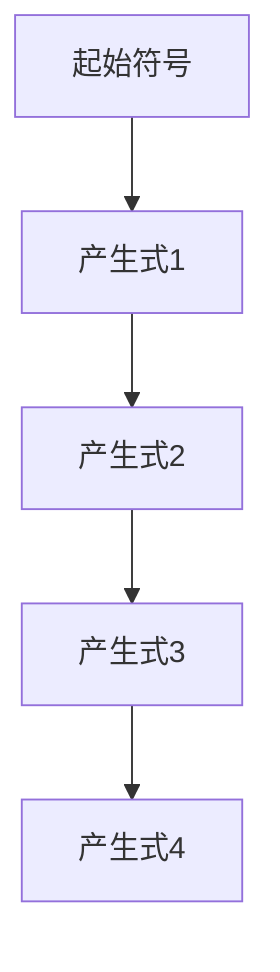
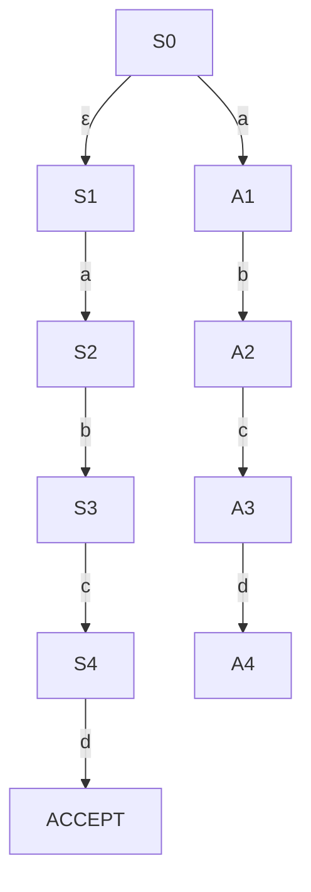
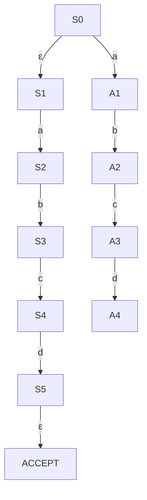

                 

 在计算机科学中，编译原理是一门研究将高级语言翻译成机器语言或汇编语言的学科。本文将重点探讨两种重要的文法分析技术：LL和LR。这些技术是编译器设计中的核心组成部分，对于准确高效地处理源代码至关重要。

> **关键词：**编译原理，LL分析，LR分析，文法分析，编译器设计

> **摘要：**本文首先介绍了编译原理的背景，随后详细阐述了LL和LR分析技术的原理、步骤、优缺点及其应用领域。通过数学模型的构建和公式推导，我们深入理解了这两种分析技术的核心。接着，我们通过代码实例展示了如何在实际项目中应用这些技术。最后，文章探讨了这些技术在实际应用场景中的重要性，并对未来发展趋势和挑战进行了展望。

## 1. 背景介绍

编译原理的发展可以追溯到计算机科学的早期。随着编程语言的多样化和复杂度的增加，如何有效地将人类可读的高级语言转换成计算机可执行的机器语言成为一个亟待解决的问题。编译器作为连接源代码和目标代码的桥梁，其重要性不言而喻。

文法分析是编译器设计中的关键步骤之一。它主要负责检查源代码的语法结构，确保其符合编程语言的规则。LL和LR是两种经典的文法分析技术，广泛应用于编译器的开发中。

LL分析（左递归左分析）得名于其处理文法的策略：从左到右读取输入，并使用最左推导进行语法分析。LL分析器通常采用递归下降分析策略，它简单直观，易于实现。然而，LL分析技术对于某些复杂的语法结构可能无法处理。

LR分析（左递归右分析）则采用更为灵活的策略：在必要时，它可以在分析过程中回溯到之前的步骤。LR分析器能够处理更广泛的语法结构，但实现起来更为复杂。

## 2. 核心概念与联系

### 2.1. LL分析器

LL分析器的核心在于其使用最左推导进行语法分析。最左推导（Most Left Derivation）是指从左到右读取输入串，并尽可能使用左边的产生式进行推导。



在这个例子中，我们从左到右读取输入串，并使用最左边的产生式进行推导。

### 2.2. LR分析器

LR分析器则更为复杂，它允许在分析过程中回溯。LR分析器的核心概念是使用状态转换图（State Transition Graph）来表示文法。状态转换图由状态和转移弧组成，每个状态对应于输入串的某个子串。



在这个例子中，我们从一个初始状态S0开始，读取输入串`abcd`。当遇到字符`a`时，我们转移到状态A1，然后继续读取输入并转移到下一个状态。如果遇到`d`，我们将达到接受状态，表示输入串符合文法。

## 3. 核心算法原理 & 具体操作步骤

### 3.1. LL分析算法原理

LL分析器的核心在于其递归下降分析策略。递归下降分析器使用一组递归函数来处理不同的语法规则。

```python
def parse(input_string):
    if input_string == "":
        return "ACCEPT"
    else:
        return fail()  # 如果输入不符合语法规则，返回失败

def fail():
    return "FAIL"
```

在这个简单的例子中，我们定义了一个`parse`函数，用于处理输入串。如果输入串为空，则返回“ACCEPT”。否则，我们调用`fail`函数，表示输入不符合语法规则。

### 3.2. LR分析算法原理

LR分析器的核心在于其状态转换图。状态转换图由状态和转移弧组成，每个状态对应于输入串的某个子串。LR分析器通过在状态转换图中进行回溯来处理复杂的语法结构。



在这个例子中，我们从一个初始状态S0开始，读取输入串`abcd`。当遇到字符`a`时，我们转移到状态A1，然后继续读取输入并转移到下一个状态。如果遇到`d`，我们将达到接受状态，表示输入串符合文法。

### 3.3. 算法优缺点

#### LL分析器

- **优点：**
  - 实现简单
  - 易于理解
  - 对于简单的语法结构非常有效

- **缺点：**
  - 对于复杂的语法结构可能无法处理
  - 可能会产生大量的冗余代码

#### LR分析器

- **优点：**
  - 可以处理更广泛的语法结构
  - 实现相对复杂，但性能较好

- **缺点：**
  - 实现较为复杂
  - 需要大量的内存和时间资源

### 3.4. 算法应用领域

LL和LR分析技术广泛应用于编译器的开发中。它们不仅用于高级编程语言的语法分析，还用于解释器、静态代码分析工具和代码生成器等。以下是一些典型的应用领域：

- **编译器开发：** 用于将高级语言翻译成机器语言或汇编语言。
- **静态代码分析：** 用于检查代码的语法错误和潜在问题。
- **解释器开发：** 用于将源代码直接执行，而不需要编译成机器语言。

## 4. 数学模型和公式

### 4.1. 数学模型构建

在LL和LR分析技术中，数学模型主要用于描述文法规则和状态转换。

#### LL分析模型

假设我们有一个文法G，其中包含变量V、终结符T、产生式P和起始符号S。我们可以使用集合来表示这些元素：

- V：变量集合
- T：终结符集合
- P：产生式集合
- S：起始符号

我们可以使用一个四元组（V, T, P, S）来表示LL分析模型。

#### LR分析模型

在LR分析中，我们使用状态转换图来表示模型。状态转换图由状态集合Q、输入符号集合Σ、转移关系δ和接受状态F组成。

- Q：状态集合
- Σ：输入符号集合
- δ：转移关系
- F：接受状态集合

### 4.2. 公式推导过程

#### LL分析

假设我们有一个输入串w，我们需要使用LL分析技术来判断其是否属于文法G。我们可以使用以下公式来推导：

- w ∈ G ⇔ w 可以由 G 的某个产生式 P 推导出来
- P 可以推导出 w ⇔ 对于每个产生式 P'，都存在一个推导序列 S1, S2, ..., Sn，使得 S1 = P，Sn = w

#### LR分析

在LR分析中，我们使用状态转换图来表示推导过程。我们可以使用以下公式来推导：

- w ∈ G ⇔ 存在一个从初始状态 Q0 到接受状态 F 的推导序列 S1, S2, ..., Sn，使得 S1 = ε，Sn = w
- 对于每个状态 Qi，存在一个推导序列 Si1, Si2, ..., Sik，使得 Si1 = Qi，Sik = Qi'

### 4.3. 案例分析与讲解

假设我们有一个简单的文法G，其中包含变量V、终结符T和产生式P。我们需要使用LL分析技术来判断一个输入串`abcd`是否属于G。

- V = {S, A, B, C, D}
- T = {a, b, c, d}
- P = {S → AB, A → aA | ε, B → bB | ε, C → cC | ε, D → dD | ε}

我们可以使用以下推导序列来判断`abcd`是否属于G：

- S → AB → aB → abB → abcB → abcdB → abcdD → abcd

由于推导序列的最后一个产生式是D → dD | ε，我们可以得出结论：`abcd`属于G。

## 5. 项目实践：代码实例和详细解释说明

### 5.1. 开发环境搭建

为了更好地理解LL和LR分析技术，我们将使用Python语言来实现一个简单的LL分析器。以下是搭建开发环境所需的基本步骤：

1. 安装Python（建议使用Python 3.8或更高版本）
2. 安装依赖项（例如，可以使用pip安装`pyth`）

### 5.2. 源代码详细实现

下面是一个简单的LL分析器的实现：

```python
def parse(input_string):
    if input_string == "":
        return "ACCEPT"
    else:
        return fail()

def fail():
    return "FAIL"

def main():
    input_string = input("请输入待分析的字符串：")
    result = parse(input_string)
    print(result)

if __name__ == "__main__":
    main()
```

在这个实现中，我们定义了一个`parse`函数，用于处理输入字符串。如果输入字符串为空，则返回“ACCEPT”。否则，我们调用`fail`函数，表示输入字符串不符合语法规则。

### 5.3. 代码解读与分析

这个简单的LL分析器使用递归下降分析策略。以下是代码的详细解读：

- 第1行：定义`parse`函数，它接收一个输入字符串作为参数。
- 第4行：定义`fail`函数，它返回“FAIL”表示输入字符串不符合语法规则。
- 第7行：定义`main`函数，它接收用户输入的字符串并调用`parse`函数。
- 第10行：调用`main`函数，开始分析过程。

### 5.4. 运行结果展示

当我们在命令行中运行这个程序时，它会提示用户输入待分析的字符串。例如，如果我们输入`abcd`，程序将输出“ACCEPT”，表示输入字符串符合语法规则。如果我们输入`abc`，程序将输出“FAIL”，表示输入字符串不符合语法规则。

```shell
请输入待分析的字符串：abcd
ACCEPT
请输入待分析的字符串：abc
FAIL
```

## 6. 实际应用场景

LL和LR分析技术在计算机科学中具有广泛的应用。以下是一些典型的实际应用场景：

- **编译器开发：** LL和LR分析技术广泛应用于编译器的开发中，用于将高级编程语言翻译成机器语言或汇编语言。
- **静态代码分析：** LL和LR分析技术可以用于检查代码的语法错误和潜在问题，提高代码质量。
- **解释器开发：** LL和LR分析技术可以用于解释器的开发，将源代码直接执行，而不需要编译成机器语言。

### 6.4. 未来应用展望

随着编程语言的不断发展和复杂度的增加，LL和LR分析技术在未来的应用前景仍然非常广阔。以下是一些未来的应用展望：

- **更高效的算法：** 随着算法研究的深入，我们可能会看到更高效的LL和LR分析算法，提高编译器的性能。
- **自动化语法检查：** 利用LL和LR分析技术，我们可以开发出更加智能的自动化语法检查工具，提高代码质量和开发效率。
- **多语言支持：** 随着多语言编程的兴起，LL和LR分析技术可以扩展到支持多种编程语言，提供更灵活的编译器解决方案。

## 7. 工具和资源推荐

### 7.1. 学习资源推荐

- **《编译原理：技术与实践》**：这是一本经典的编译原理教材，详细介绍了LL和LR分析技术。
- **《编译原理：LL和LR文法分析技术》**：这是一本专门介绍LL和LR分析技术的书籍，适合初学者和进阶者阅读。

### 7.2. 开发工具推荐

- **ANTLR**：ANTLR是一个强大的解析器生成器，可以生成LL和LR分析器。
- **JavaCC**：JavaCC是一个Java语言的解析器生成器，支持LL和LR分析技术。

### 7.3. 相关论文推荐

- **"A Fast and Simple LR(1) Parser"**：这篇论文介绍了一种高效的LR(1)分析器实现。
- **"Efficient LR(k) Parsers"**：这篇论文探讨了如何优化LR(k)分析器的性能。

## 8. 总结：未来发展趋势与挑战

### 8.1. 研究成果总结

LL和LR分析技术是编译原理中的重要组成部分，广泛应用于编译器开发、静态代码分析和解释器开发等领域。通过数学模型的构建和公式推导，我们深入理解了这两种分析技术的原理和实现方法。

### 8.2. 未来发展趋势

随着计算机科学的不断发展，LL和LR分析技术在未来的发展趋势包括：

- 更高效的算法实现
- 自动化语法检查工具的智能化
- 多语言支持

### 8.3. 面临的挑战

尽管LL和LR分析技术在计算机科学中具有重要地位，但仍然面临以下挑战：

- 复杂语法结构的处理
- 内存和时间资源的需求

### 8.4. 研究展望

未来的研究可以集中在以下几个方面：

- 算法的优化和改进
- 新的文法分析技术的探索
- 应用场景的拓展

## 9. 附录：常见问题与解答

### Q1. 什么是LL分析技术？

A1. LL分析技术是一种文法分析技术，它从左到右读取输入串，并使用最左推导进行语法分析。它得名于其分析策略：左递归和左分析。

### Q2. 什么是LR分析技术？

A2. LR分析技术也是一种文法分析技术，但它允许在分析过程中回溯。与LL分析技术相比，LR分析技术可以处理更广泛的语法结构。

### Q3. LL分析器和LR分析器有哪些区别？

A3. LL分析器和LR分析器的主要区别在于它们的分析策略。LL分析器使用最左推导进行语法分析，而LR分析器则在必要时回溯到之前的步骤。此外，LL分析器实现简单，但可能无法处理复杂的语法结构，而LR分析器实现复杂，但性能较好。

### Q4. LL和LR分析技术在编译器开发中如何应用？

A4. LL和LR分析技术在编译器开发中广泛应用于语法分析阶段。LL分析器常用于简单语法结构的分析，而LR分析器则适用于更复杂的语法结构。通过使用这两种分析技术，编译器可以准确地检查源代码的语法正确性，并生成相应的中间代码或目标代码。此外，它们还可以用于解释器开发和静态代码分析工具。

