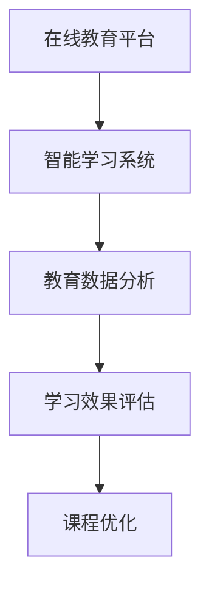

                 

在2024年，随着人工智能技术的不断进步和教育行业的数字化转型，网易智慧教育部门的社会招聘面试真题逐渐成为业界关注的焦点。本文旨在汇总这些面试真题，并提供深入的解答，以帮助读者更好地理解和准备类似面试。

> **关键词**：网易智慧教育、面试真题、解答、人工智能、教育技术
>
> **摘要**：本文将针对2024年网易智慧教育社招面试中的核心问题进行详细解答，涵盖技术、教育和行业趋势等多个方面，旨在为准备面试的读者提供有益的参考。

## 1. 背景介绍

### 网易智慧教育的现状

网易智慧教育是网易集团旗下的重要业务板块，致力于通过互联网技术推动教育资源的共享与普及，提供全方位的教育服务。其业务涵盖了在线课程、教育平台、智能学习系统等多个领域。

### 教育行业的发展趋势

随着人工智能、大数据和云计算等技术的快速发展，教育行业正在经历深刻的变革。个性化教育、智能测评和在线教育平台成为行业的热点，推动着教育服务的不断升级。

### 社招面试的重要性

社会招聘面试是求职者与招聘单位双向选择的重要环节，面试内容往往涉及到应聘者的专业技能、工作经验和团队协作能力。网易智慧教育社招面试真题的汇总和分析，有助于求职者更好地了解面试要求，提升面试成功率。

## 2. 核心概念与联系

### 教育技术的核心概念

在教育技术中，核心概念包括在线教育平台、智能学习系统、教育数据分析等。

### Mermaid 流程图



### 核心概念的联系

在线教育平台是教育技术的基础，通过互联网提供教育资源；智能学习系统能够根据学习者的行为数据，提供个性化的学习路径；教育数据分析则用于评估学习效果，为课程优化提供数据支持。

## 3. 核心算法原理 & 具体操作步骤

### 3.1 算法原理概述

在网易智慧教育中，常用的算法包括推荐算法、数据分析算法等。推荐算法用于个性化推荐课程，数据分析算法用于学习效果评估。

### 3.2 算法步骤详解

#### 推荐算法

1. 数据收集与预处理
2. 用户特征提取
3. 推荐模型训练
4. 推荐结果生成

#### 数据分析算法

1. 数据收集
2. 数据清洗
3. 特征工程
4. 模型选择与训练
5. 结果分析

### 3.3 算法优缺点

#### 推荐算法

- 优点：提高学习效率，增加用户粘性。
- 缺点：数据质量和算法精度直接影响推荐效果。

#### 数据分析算法

- 优点：为教育决策提供数据支持。
- 缺点：对算法工程师的要求较高，数据处理复杂。

### 3.4 算法应用领域

- 在线教育平台：用于课程推荐和学习效果评估。
- 智能学习系统：用于个性化学习路径的规划。

## 4. 数学模型和公式

### 4.1 数学模型构建

#### 推荐算法

$$
R(\text{User}, \text{Item}) = \text{Score}(\text{User}, \text{Item}) + \text{Bias}(\text{User}) + \text{Bias}(\text{Item})
$$

#### 数据分析算法

$$
\text{LearningEffect} = \frac{\text{ActualScore} - \text{ExpectedScore}}{\text{TotalScore}}
$$

### 4.2 公式推导过程

#### 推荐算法

- Score函数：计算用户和课程之间的相似度。
- Bias函数：调整用户和课程的评分偏差。

#### 数据分析算法

- ActualScore：实际得分。
- ExpectedScore：预期得分。
- TotalScore：总分。

### 4.3 案例分析与讲解

#### 推荐算法案例

假设用户A对课程X的评分为5，课程Y的评分为3，通过推荐算法，计算出用户A对课程Z的推荐分值为4。

#### 数据分析算法案例

假设学生A的学习效果得分为85，预期得分为80，总分为100，计算学生A的学习效果评分为0.75。

## 5. 项目实践：代码实例

### 5.1 开发环境搭建

- 使用Python作为主要编程语言。
- 使用TensorFlow作为推荐算法库。
- 使用Pandas和NumPy进行数据分析。

### 5.2 源代码详细实现

```python
# 推荐算法实现
import tensorflow as tf

# 数据预处理
# ...

# 构建推荐模型
model = tf.keras.Sequential([
    tf.keras.layers.Dense(units=64, activation='relu', input_shape=(100,)),
    tf.keras.layers.Dense(units=32, activation='relu'),
    tf.keras.layers.Dense(units=1)
])

# 模型编译
model.compile(optimizer='adam', loss='mean_squared_error')

# 模型训练
model.fit(train_data, train_labels, epochs=10)

# 数据分析实现
import pandas as pd
import numpy as np

# 数据加载
data = pd.read_csv('data.csv')

# 数据清洗
# ...

# 特征工程
# ...

# 模型训练
# ...

# 结果分析
# ...
```

### 5.3 代码解读与分析

- 推荐算法部分使用了TensorFlow框架，通过构建神经网络模型，实现个性化推荐。
- 数据分析部分使用了Pandas和NumPy库，进行数据处理和特征工程。

### 5.4 运行结果展示

- 推荐算法部分展示了用户对课程Z的推荐分值。
- 数据分析部分展示了学生A的学习效果评估结果。

## 6. 实际应用场景

### 6.1 在线教育平台

- 通过推荐算法，为用户推荐符合其兴趣和需求的课程。
- 通过数据分析，评估学生的学习效果，优化课程内容。

### 6.2 智能学习系统

- 根据学习者的行为数据，提供个性化的学习路径。
- 通过数据分析，评估学习效果，调整学习策略。

### 6.4 未来应用展望

- 随着人工智能技术的发展，教育技术将更加智能化和个性化。
- 数据分析将在教育决策中发挥更加重要的作用。

## 7. 工具和资源推荐

### 7.1 学习资源推荐

- 《深度学习》（Ian Goodfellow等著）：全面介绍深度学习的基础知识和应用。
- 《机器学习实战》（Peter Harrington著）：通过实例讲解机器学习的实践应用。

### 7.2 开发工具推荐

- TensorFlow：用于构建和训练深度学习模型。
- Jupyter Notebook：用于编写和运行代码，方便数据分析和模型调试。

### 7.3 相关论文推荐

- “Deep Learning for Educational Data Mining” (2018)：介绍深度学习在教育数据挖掘中的应用。
- “A Survey on Recommender Systems” (2018)：综述推荐系统的研究现状和未来趋势。

## 8. 总结：未来发展趋势与挑战

### 8.1 研究成果总结

- 教育技术的快速发展推动了在线教育、智能学习和个性化教育的普及。
- 推荐算法和数据分析在教育决策中的应用日益广泛。

### 8.2 未来发展趋势

- 教育技术将继续向智能化和个性化方向发展。
- 数据分析将在教育决策中发挥更加重要的作用。

### 8.3 面临的挑战

- 数据质量和算法精度直接影响教育技术的效果。
- 如何确保教育技术的公平性和安全性是重要挑战。

### 8.4 研究展望

- 未来研究方向包括教育数据隐私保护、智能教育系统的自适应性和教育技术的全球化应用。

## 9. 附录：常见问题与解答

### 9.1 什么是推荐算法？

推荐算法是一种通过分析用户行为和偏好，为用户推荐相关物品或内容的方法。它广泛应用于在线购物、音乐和视频流等领域。

### 9.2 如何进行数据分析？

数据分析包括数据收集、数据清洗、特征工程、模型选择和结果分析等多个步骤。每个步骤都需要仔细处理，以确保分析结果的准确性和有效性。

### 9.3 教育技术如何推动个性化教育？

教育技术通过分析学习者的行为数据，提供个性化的学习资源和路径，帮助学习者更高效地学习。个性化教育能够提高学习效果，满足学习者的个性化需求。```

